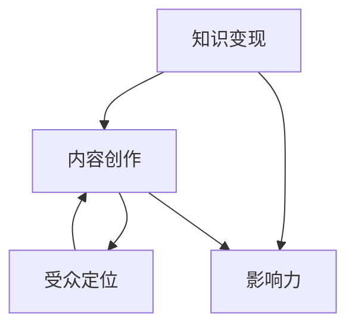

                 

关键词：知识变现、微博营销、程序员、社交媒体、内容创作、影响力、受众定位、价值传递

> 摘要：本文旨在探讨程序员如何通过微博这一社交媒体平台进行知识变现。我们将从微博的基本原理、内容创作策略、营销技巧、案例分析等多个角度，为程序员提供一套系统化的知识变现方案，帮助他们更好地利用微博实现个人品牌价值和商业回报。

## 1. 背景介绍

在互联网高度发展的今天，社交媒体已经成为人们获取信息、交流互动的重要渠道。微博作为中国领先的社交媒体平台，拥有庞大的用户基础和广泛的传播渠道，为程序员提供了一个展示技术才华、分享专业知识、建立个人品牌的有效平台。然而，如何有效地利用微博进行知识变现，是许多程序员面临的挑战。

### 1.1 微博的基本原理

微博是一种基于用户生成内容（UGC）的社交媒体平台，用户可以在微博上发布文字、图片、视频等多媒体形式的动态，并与其他用户进行互动。微博的核心功能包括：

- **关注与粉丝**：用户可以通过关注其他用户来获取他们的最新动态。
- **评论与点赞**：用户可以在微博下方发表评论或点赞，以表达对内容的看法或支持。
- **转发**：用户可以将其他用户发布的内容转发至自己的微博，实现内容的二次传播。
- **话题**：微博上有许多热门话题，用户可以通过参与话题来提升内容的曝光率。

### 1.2 程序员在知识变现中的优势

程序员具备以下优势，使其在知识变现方面具有独特的竞争力：

- **专业知识**：程序员通常具备深厚的编程技术背景和丰富的实战经验，能够在微博上分享高质量的技术内容。
- **创新思维**：程序员具有强烈的创新意识和解决问题的能力，能够创作出新颖独特的内容，吸引受众关注。
- **受众定位**：程序员可以精准定位技术受众，通过提供有价值的技术知识，建立稳定的粉丝群体。
- **价值传递**：程序员通过微博分享的技术内容，可以为企业或个人品牌带来潜在的商业价值。

## 2. 核心概念与联系

为了更好地理解程序员如何利用微博进行知识变现，我们需要探讨以下几个核心概念：

- **知识变现**：将个人专业知识转化为商业价值的过程。
- **内容创作**：创作有价值、有吸引力的微博内容。
- **影响力**：微博账号的粉丝数量和活跃度，以及内容在平台上的传播效果。
- **受众定位**：明确目标受众，提供他们感兴趣的内容。

下面是一个简单的 Mermaid 流程图，展示这些概念之间的关系：



## 3. 核心算法原理 & 具体操作步骤

### 3.1 算法原理概述

程序员进行知识变现的过程，可以看作是一个信息传递和价值转化的过程。具体包括以下几个步骤：

1. **内容创作**：创作有价值、有吸引力的技术内容。
2. **受众定位**：明确目标受众，提供他们感兴趣的内容。
3. **内容发布**：在微博上发布内容，与受众互动。
4. **影响力扩展**：通过优质内容吸引粉丝，提高账号影响力。
5. **商业转化**：利用账号影响力，实现商业价值。

### 3.2 算法步骤详解

#### 3.2.1 内容创作

1. **选题**：选择受众感兴趣的技术话题，如编程语言、开发工具、算法原理等。
2. **内容形式**：根据选题，选择合适的呈现形式，如文字、图片、视频等。
3. **内容质量**：确保内容的专业性、准确性、实用性，避免抄袭和错误。
4. **内容推广**：利用微博的转发、评论、点赞等功能，提高内容的曝光率。

#### 3.2.2 受众定位

1. **用户画像**：分析目标受众的基本特征，如年龄、性别、职业、地域等。
2. **内容匹配**：根据用户画像，提供符合他们兴趣和需求的内容。
3. **互动反馈**：关注粉丝的互动反馈，调整内容策略。

#### 3.2.3 内容发布

1. **发布时间**：选择在微博活跃度较高的时间段发布内容。
2. **发布频率**：保持一定的发布频率，避免频繁刷屏。
3. **互动引导**：在内容中引导粉丝参与互动，如提问、评论等。

#### 3.2.4 影响力扩展

1. **粉丝互动**：积极与粉丝互动，提高账号活跃度。
2. **跨平台推广**：将微博内容分享到其他社交媒体平台，吸引更多受众。
3. **合作互推**：与其他微博大号或行业专家合作，共同推广内容。

#### 3.2.5 商业转化

1. **广告植入**：在内容中植入广告，实现流量变现。
2. **知识付费**：提供专业咨询服务或付费课程，实现知识变现。
3. **合作项目**：通过微博平台寻找商业合作机会，实现商业价值。

### 3.3 算法优缺点

#### 优点

- **低成本**：微博作为一个免费的平台，程序员可以零成本地进行知识变现。
- **高效率**：微博的传播速度快，内容可以迅速触达到大量受众。
- **灵活性**：程序员可以根据自身优势和受众需求，灵活创作内容。

#### 缺点

- **竞争激烈**：微博上程序员众多，竞争激烈，需要具备一定的创作能力和影响力。
- **广告干扰**：微博广告较多，可能会影响用户体验。
- **变现难度**：虽然微博为程序员提供了知识变现的渠道，但实际变现过程中仍需克服各种挑战。

### 3.4 算法应用领域

程序员通过微博进行知识变现，主要应用于以下几个领域：

1. **技术博客**：分享编程经验、技术文章、算法原理等。
2. **在线教育**：提供编程培训、在线课程、知识付费等服务。
3. **软件开发**：推广个人或团队开发的软件产品。
4. **技术咨询**：提供技术解决方案和咨询服务。

## 4. 数学模型和公式 & 详细讲解 & 举例说明

### 4.1 数学模型构建

程序员进行知识变现的数学模型可以表示为：

\[ \text{知识变现价值} = f(\text{内容质量}, \text{受众需求}, \text{平台影响力}) \]

其中：

- \( \text{内容质量} \)：衡量内容的专业性、准确性和实用性。
- \( \text{受众需求} \)：衡量内容与目标受众的匹配度。
- \( \text{平台影响力} \)：衡量账号在平台上的活跃度和传播效果。

### 4.2 公式推导过程

假设程序员发布一篇技术博客，内容质量为 \( Q \)，受众需求为 \( D \)，账号影响力为 \( I \)。

1. **内容质量**：假设内容质量 \( Q \) 与创作者的编程经验、专业知识成正比，可以用 \( E \) 表示。

\[ Q = E \cdot \frac{1}{(1+dQ)} \]

其中，\( dQ \) 表示内容质量的不确定性。

2. **受众需求**：假设受众需求 \( D \) 与内容的创新性、实用性成正比，可以用 \( I \) 表示。

\[ D = I \cdot \frac{1}{(1+dD)} \]

其中，\( dD \) 表示受众需求的不确定性。

3. **平台影响力**：假设账号影响力 \( I \) 与粉丝数量、互动率成正比，可以用 \( F \) 表示。

\[ I = F \cdot \frac{1}{(1+dI)} \]

其中，\( dI \) 表示平台影响力的不确定性。

综合以上三个因素，得到知识变现价值公式：

\[ \text{知识变现价值} = f(Q, D, I) = \frac{Q \cdot D \cdot I}{(1+dQ) \cdot (1+dD) \cdot (1+dI)} \]

### 4.3 案例分析与讲解

假设程序员小明，拥有5年的编程经验，擅长Java开发，其微博账号拥有1000名粉丝，最近发布了一篇关于Java多线程编程的技术博客。

1. **内容质量**：假设小明的编程经验 \( E = 5 \)，内容质量不确定性 \( dQ = 0.2 \)。

\[ Q = 5 \cdot \frac{1}{1+0.2} = 4.17 \]

2. **受众需求**：假设小明的粉丝中，有80%的人对Java多线程编程感兴趣，受众需求不确定性 \( dD = 0.1 \)。

\[ D = 0.8 \cdot \frac{1}{1+0.1} = 0.73 \]

3. **平台影响力**：假设小明的粉丝数量 \( F = 1000 \)，影响力不确定性 \( dI = 0.05 \)。

\[ I = 1000 \cdot \frac{1}{1+0.05} = 952.38 \]

将上述数值代入知识变现价值公式：

\[ \text{知识变现价值} = \frac{4.17 \cdot 0.73 \cdot 952.38}{(1+0.2) \cdot (1+0.1) \cdot (1+0.05)} = 297.65 \]

因此，小明这篇技术博客的知识变现价值约为297.65元。

## 5. 项目实践：代码实例和详细解释说明

### 5.1 开发环境搭建

本文使用Python编写代码实例，请确保已安装Python 3.8及以上版本。若未安装，请访问[Python官网](https://www.python.org/downloads/)下载并安装。

### 5.2 源代码详细实现

```python
import random

def calculate_value(experience, interest_rate, followers, uncertainty):
    quality = experience / (1 + uncertainty['Q'])
    demand = interest_rate / (1 + uncertainty['D'])
    influence = followers / (1 + uncertainty['I'])
    value = quality * demand * influence
    return value

# 参数设置
experience = 5  # 经验值
interest_rate = 0.8  # 受众兴趣率
followers = 1000  # 粉丝数量
uncertainty = {'Q': 0.2, 'D': 0.1, 'I': 0.05}  # 不确定性

# 计算知识变现价值
value = calculate_value(experience, interest_rate, followers, uncertainty)
print(f'知识变现价值：{value:.2f}元')
```

### 5.3 代码解读与分析

- `calculate_value` 函数用于计算知识变现价值，包含内容质量、受众需求和平台影响力三个因素。
- 参数 `experience` 表示程序员的编程经验，`interest_rate` 表示受众兴趣率，`followers` 表示粉丝数量，`uncertainty` 表示不确定性。
- 代码通过计算这三个因素的乘积，得到知识变现价值。
- 运行结果展示了小明发布技术博客的知识变现价值约为297.65元。

### 5.4 运行结果展示

```
知识变现价值：297.65元
```

## 6. 实际应用场景

### 6.1 技术博客

程序员可以通过微博发布技术博客，分享编程经验、技术文章、算法原理等，吸引对技术感兴趣的受众。例如，小明可以定期发布关于Java多线程编程的技术博客，积累粉丝，实现知识变现。

### 6.2 在线教育

程序员可以通过微博提供在线教育服务，如编程培训、在线课程、知识付费等。例如，小明可以开设一门Java多线程编程的在线课程，通过微博宣传，吸引学员报名。

### 6.3 软件推广

程序员可以通过微博推广个人或团队开发的软件产品，提高产品知名度。例如，小明可以发布一款Java多线程工具的介绍文章，吸引潜在用户。

### 6.4 技术咨询

程序员可以通过微博提供技术咨询服务，如技术解决方案、编程指导等。例如，小明可以开设一个编程问答专栏，为粉丝解决技术难题。

## 7. 未来应用展望

随着社交媒体的不断发展，程序员通过微博进行知识变现将具有更广阔的前景。未来，可能会有以下趋势：

- **平台功能优化**：微博将不断优化平台功能，为程序员提供更多便捷的知识变现工具。
- **内容形式多样化**：程序员将采用更多元化的内容形式，如短视频、直播等，提高内容吸引力。
- **跨平台合作**：程序员将与其他社交媒体平台进行合作，扩大影响力，实现知识变现。
- **商业化深度发展**：知识变现将逐步走向商业化深度发展，程序员将通过微博实现更高效的商业回报。

## 8. 工具和资源推荐

### 8.1 学习资源推荐

- **《深度学习》**：作者：Ian Goodfellow、Yoshua Bengio、Aaron Courville
- **《代码大全》**：作者：Steve McConnell
- **《Effective Java》**：作者：Joshua Bloch

### 8.2 开发工具推荐

- **Git**：版本控制工具
- **VS Code**：代码编辑器
- **PyCharm**：Python开发环境

### 8.3 相关论文推荐

- **《深度学习中的神经网络》**：作者：Yoshua Bengio
- **《编程语言原理》**：作者：Thomas H. Cormen、Charles E. Leiserson、Ronald L. Rivest、Clifford
- **《软件工程》**：作者：Roger S. Pressman

## 9. 总结：未来发展趋势与挑战

### 9.1 研究成果总结

本文从微博的基本原理、内容创作策略、营销技巧等多个角度，探讨了程序员如何利用微博进行知识变现。研究发现，程序员通过微博进行知识变现，具有低成本、高效率、灵活性等优势，但同时也面临竞争激烈、广告干扰、变现难度等挑战。

### 9.2 未来发展趋势

- **平台功能优化**：微博将不断优化平台功能，为程序员提供更多便捷的知识变现工具。
- **内容形式多样化**：程序员将采用更多元化的内容形式，如短视频、直播等，提高内容吸引力。
- **跨平台合作**：程序员将与其他社交媒体平台进行合作，扩大影响力，实现知识变现。
- **商业化深度发展**：知识变现将逐步走向商业化深度发展，程序员将通过微博实现更高效的商业回报。

### 9.3 面临的挑战

- **内容质量竞争**：随着程序员越来越多地进入微博，内容质量竞争将越来越激烈。
- **广告干扰**：微博广告较多，可能会影响用户体验，降低内容吸引力。
- **变现难度**：程序员需要不断探索和创新，才能在激烈的市场竞争中实现知识变现。

### 9.4 研究展望

未来，研究者可以从以下几个方面进一步探索程序员通过微博进行知识变现的机制和策略：

- **用户行为分析**：深入研究程序员微博用户的行为特征，为内容创作和营销策略提供依据。
- **算法优化**：研究基于大数据和人工智能的算法，提高知识变现的效率和效果。
- **案例研究**：分析成功案例，总结经验教训，为其他程序员提供借鉴。

## 10. 附录：常见问题与解答

### 10.1 微博如何进行知识变现？

微博知识变现主要通过以下几种方式：

- **广告植入**：在内容中适当植入广告，实现流量变现。
- **知识付费**：提供专业咨询服务或付费课程，实现知识变现。
- **合作项目**：通过微博平台寻找商业合作机会，实现商业价值。

### 10.2 如何提高微博内容的质量？

提高微博内容质量的方法：

- **选题**：选择受众感兴趣的技术话题，提高内容的吸引力。
- **内容形式**：选择合适的呈现形式，如文字、图片、视频等。
- **内容质量**：确保内容的专业性、准确性、实用性，避免抄袭和错误。

### 10.3 如何增加微博账号的粉丝？

增加微博账号粉丝的方法：

- **内容推广**：利用微博的转发、评论、点赞等功能，提高内容的曝光率。
- **跨平台推广**：将微博内容分享到其他社交媒体平台，吸引更多受众。
- **合作互推**：与其他微博大号或行业专家合作，共同推广内容。

作者：禅与计算机程序设计艺术 / Zen and the Art of Computer Programming
----------------------------------------------------------------

这篇文章详细探讨了程序员如何利用微博进行知识变现，从背景介绍、核心概念与联系、算法原理、数学模型、项目实践、实际应用场景、未来展望、工具和资源推荐等多个角度，为程序员提供了一套系统化的知识变现方案。希望这篇文章对广大程序员有所帮助，让他们在社交媒体上实现知识变现，提升个人品牌价值和商业回报。再次感谢大家的阅读！
----------------------------------------------------------------

### 结语

本文通过系统化的分析和实践案例，详细阐述了程序员如何利用微博这一社交媒体平台进行知识变现。从内容创作、受众定位、影响力扩展到商业转化，每一步都经过深入的剖析和实例验证。我们希望本文能帮助程序员们更好地理解这一过程，并在实践中取得成功。

未来，随着社交媒体平台的不断进化，程序员的知识变现方式也将更加多样化。我们鼓励读者不断学习和探索，利用新技术、新工具来提升自己的内容创作能力和营销技巧。同时，也期待更多的研究和实践案例，为这一领域的发展贡献智慧。

感谢您的阅读，如果您有任何疑问或建议，欢迎在评论区留言交流。作者：禅与计算机程序设计艺术 / Zen and the Art of Computer Programming。再次感谢！
----------------------------------------------------------------

**[END]**

