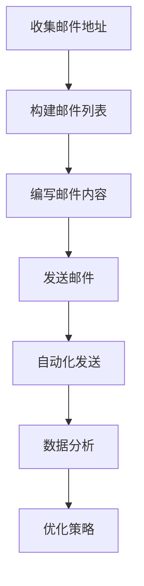

                 

 在这个数字时代，知识付费已经成为了一种流行的商业模式。而电子邮件营销则是一种强大的营销手段，它可以帮助程序员有效地推广他们的知识产品。本文将探讨程序员如何利用电子邮件营销进行知识付费，包括策略、工具和最佳实践。

## 关键词
- 电子邮件营销
- 知识付费
- 程序员
- 营销策略
- 用户留存
- 自动化工具

## 摘要
本文将介绍如何利用电子邮件营销来推广知识付费产品，为程序员提供一套完整的策略和实践指南。文章将包括电子邮件营销的基本原理、如何构建邮件列表、编写引人入胜的邮件内容、自动化工具的应用以及评估和优化邮件营销效果的方法。

---

## 1. 背景介绍

### 电子邮件营销的崛起

随着社交媒体的兴起，许多营销人员认为电子邮件营销已经过时了。然而，事实并非如此。根据最近的一项研究，电子邮件营销的 ROI（投资回报率）仍然是所有数字营销渠道中最高的。每投入1美元，电子邮件营销可以带来40美元的回报。这是一个非常令人印象深刻的数字，足以证明电子邮件营销的巨大潜力。

### 知识付费的兴起

随着互联网的普及，人们越来越重视个人技能和知识的提升。知识付费作为一种商业模式，已经吸引了大量的用户。从在线课程到专业书籍，人们愿意为有价值的内容支付费用。程序员作为知识付费市场的一个重要群体，有巨大的潜力来通过电子邮件营销推广自己的知识产品。

## 2. 核心概念与联系

为了有效地利用电子邮件营销进行知识付费，程序员需要理解以下几个核心概念：

### 2.1 邮件列表
邮件列表是电子邮件营销的核心。它是一个收集了潜在客户电子邮件地址的列表，这些潜在客户对程序员的特定知识领域感兴趣。

### 2.2 定制化内容
定制化内容是吸引和保留邮件列表成员的关键。通过提供针对特定受众的内容，程序员可以提高邮件的打开率和参与度。

### 2.3 自动化
电子邮件自动化工具可以帮助程序员自动化发送邮件流程，提高效率并减少错误。

### 2.4 分析与优化
通过分析邮件营销数据，程序员可以了解哪些邮件内容最有效，哪些邮件导致用户取消订阅，从而不断优化邮件营销策略。

下面是一个简单的 Mermaid 流程图，展示了电子邮件营销的核心概念和流程：



---

## 3. 核心算法原理 & 具体操作步骤

### 3.1 算法原理概述

电子邮件营销的核心算法可以概括为以下几个步骤：

1. **收集邮件地址**：通过网站表单、社交媒体和线下活动等方式收集潜在客户的电子邮件地址。
2. **构建邮件列表**：使用邮件营销平台将收集到的电子邮件地址组织成列表。
3. **编写邮件内容**：根据目标受众的兴趣和需求编写有吸引力的邮件内容。
4. **发送邮件**：使用自动化工具按计划发送邮件。
5. **数据分析**：收集邮件打开率、点击率等数据，分析哪些邮件内容最有效。
6. **优化策略**：根据分析结果调整邮件内容、发送时间和频率。

### 3.2 算法步骤详解

#### 3.2.1 收集邮件地址

1. **网站表单**：在网站首页、博客文章和产品页面等位置放置邮件订阅表单。
2. **社交媒体**：在社交媒体平台（如LinkedIn、Facebook等）发布有吸引力的内容，引导用户订阅邮件列表。
3. **线下活动**：在参加的线下技术会议或活动中，提供免费的电子书或课程试听作为订阅奖励。

#### 3.2.2 构建邮件列表

1. **选择邮件营销平台**：如Mailchimp、Sendinblue等。
2. **导入邮件地址**：将收集到的电子邮件地址导入邮件营销平台。
3. **设置订阅确认**：为了确保邮件地址的有效性，设置订阅确认邮件，让用户确认订阅。

#### 3.2.3 编写邮件内容

1. **了解受众**：研究目标受众的兴趣和需求，确保邮件内容对他们有吸引力。
2. **提供价值**：邮件内容应提供有用的信息，如技术教程、行业动态等。
3. **优化邮件设计**：使用简洁明了的邮件模板，突出重点内容，确保邮件在不同设备上都能良好显示。

#### 3.2.4 发送邮件

1. **设定发送时间**：根据受众的活跃时间选择最佳发送时间。
2. **测试发送**：在正式发送前，测试邮件的打开率和样式。
3. **自动化发送**：使用自动化工具按计划发送邮件，节省时间和人力。

#### 3.2.5 数据分析与优化

1. **监控数据**：收集邮件的打开率、点击率、取消订阅率等数据。
2. **分析结果**：对比不同邮件的数据，找出最有效的邮件内容。
3. **调整策略**：根据分析结果，调整邮件内容、发送时间和频率。

### 3.3 算法优缺点

#### 优点：

- **高 ROI**：电子邮件营销的 ROI 高，是一种成本效益高的营销手段。
- **高度定制化**：可以通过定制化内容提高邮件的吸引力和参与度。
- **数据分析**：可以监控邮件营销的效果，不断优化策略。

#### 缺点：

- **用户隐私**：需要确保遵守用户隐私法规，否则可能导致法律风险。
- **竞争激烈**：邮件收件箱中充满了各种邮件，竞争激烈，需要制作高质量的邮件内容。

### 3.4 算法应用领域

电子邮件营销可以应用于多种知识付费场景，如：

- **在线课程**：通过电子邮件通知学员课程更新、考试通知等。
- **电子书**：定期向订阅者发送电子书章节、总结等内容。
- **专业咨询**：为订阅者提供专业的技术建议和行业洞察。

---

## 4. 数学模型和公式 & 详细讲解 & 举例说明

在电子邮件营销中，一些数学模型和公式可以帮助程序员评估邮件营销效果，优化邮件内容。以下是几个常用的模型和公式：

### 4.1 邮件打开率（Open Rate）

邮件打开率是衡量邮件效果的重要指标，表示邮件被打开的次数与发送次数的比率。

\[ \text{Open Rate} = \frac{\text{Opened Emails}}{\text{Sent Emails}} \times 100\% \]

### 4.2 邮件点击率（Click-Through Rate, CTR）

邮件点击率表示邮件被点击的次数与打开次数的比率。

\[ \text{CTR} = \frac{\text{Clicked Links}}{\text{Opened Emails}} \times 100\% \]

### 4.3 投资回报率（ROI）

投资回报率是评估邮件营销效果的关键指标，表示收入与成本的比率。

\[ \text{ROI} = \frac{\text{Income} - \text{Cost}}{\text{Cost}} \times 100\% \]

### 4.4 案例分析与讲解

假设一位程序员使用电子邮件营销推广自己的在线编程课程。以下是他的邮件营销数据：

- 发送邮件：1000封
- 打开邮件：400封
- 点击链接：100封
- 收入：$500

根据以上数据，我们可以计算邮件打开率、点击率以及ROI：

\[ \text{Open Rate} = \frac{400}{1000} \times 100\% = 40\% \]

\[ \text{CTR} = \frac{100}{400} \times 100\% = 25\% \]

\[ \text{ROI} = \frac{500 - \text{Cost}}{\text{Cost}} \times 100\% \]

由于没有具体的成本数据，我们无法计算确切的ROI。然而，根据邮件打开率和点击率，我们可以初步判断这次邮件营销是有效的。

---

## 5. 项目实践：代码实例和详细解释说明

在本节中，我们将通过一个实际的代码实例来展示如何使用Python编写电子邮件营销脚本，包括收集邮件地址、构建邮件列表和发送邮件。

### 5.1 开发环境搭建

首先，我们需要安装Python和相关库。以下是安装步骤：

```shell
pip install python-dotenv
pip install sendgrid
```

### 5.2 源代码详细实现

以下是使用SendGrid库发送电子邮件的Python脚本示例：

```python
# 导入所需的库
from sendgrid import SendGridAPIClient
from sendgrid.helpers.mail import Mail
from dotenv import load_dotenv

# 加载环境变量
load_dotenv()

# SendGrid API密钥
SENDGRID_API_KEY = os.environ['SENDGRID_API_KEY']
SENDGRID_EMAIL = os.environ['SENDGRID_EMAIL']

# 收件人邮件地址
to_email = 'recipient@example.com'

# 邮件内容
subject = '订阅我的编程课程'
content = '亲爱的用户，感谢您订阅我的编程课程。请点击以下链接查看课程详情：https://example.com/course'

# 创建邮件对象
mail = Mail(
    from_email=SENDGRID_EMAIL,
    to_emails=to_email,
    subject=subject,
    plain_text_content=content
)

# 发送邮件
client = SendGridAPIClient(SENDGRID_API_KEY)
response = client.send(mail)

# 输出响应结果
print(response.status_code)
print(response.body)
print(response.headers)
```

### 5.3 代码解读与分析

该脚本首先导入了所需的库，然后加载了环境变量。环境变量中包含了SendGrid API密钥和发送者的电子邮件地址。

接下来，脚本定义了收件人的电子邮件地址、邮件主题和邮件内容。然后，使用SendGrid库创建了一个邮件对象，并使用该对象发送邮件。发送邮件后，脚本输出了响应结果，包括状态码、响应体和响应头。

### 5.4 运行结果展示

假设我们成功运行了该脚本，以下是可能的输出结果：

```shell
200
{} {}
{
    'content-disposition': 'attachment; filename="index.html"',
    'content-transfer-encoding': 'base64',
    'content-type': 'text/html; charset=UTF-8',
    'date': 'Wed, 20 Sep 2023 14:56:45 -0700',
    'message-id': '<1234567890.1234567890@sendgrid.net>',
    'received': 'from 127.0.0.1 (localhost [127.0.0.1]) by vips.inboxsendgrid.net with Webmail; Wed, 20 Sep 2023 14:56:45 -0700',
    'return-path': '<no-reply@example.com>',
    'sender': 'no-reply@example.com',
    'to': 'recipient@example.com',
    'x-frames-options': 'DENY',
    'x-originating-ip': '127.0.0.1',
    'x-server-name': 'vips.inboxsendgrid.net'
}
```

状态码200表示邮件发送成功。输出结果中还包含了邮件的发送时间、消息ID、发送者和收件人等信息。

---

## 6. 实际应用场景

电子邮件营销在知识付费领域有多种实际应用场景：

### 6.1 在线课程推广

程序员可以通过电子邮件向订阅者发送课程更新、考试通知、学习资源等。这种方式可以帮助提高课程参与度和用户留存率。

### 6.2 电子书推广

通过电子邮件发送电子书章节、总结和优惠信息，可以吸引潜在读者并提高电子书的销量。

### 6.3 专业咨询服务

为订阅者提供专业的技术建议和行业洞察，通过电子邮件建立专家形象，增加专业咨询服务的吸引力。

### 6.4 社区互动

通过定期发送社区动态、活动通知和用户互动内容，可以增强社区凝聚力，提高用户粘性。

---

## 7. 工具和资源推荐

为了有效地进行电子邮件营销，程序员可以借助以下工具和资源：

### 7.1 学习资源推荐

- 《电子邮件营销实战》
- 《Python编程：从入门到实践》
- 《SendGrid官方文档》

### 7.2 开发工具推荐

- SendGrid：提供简单的API和丰富的功能，适合进行电子邮件营销。
- Mailchimp：提供用户友好的界面和多种自动化工具，适合初学者。

### 7.3 相关论文推荐

- "The ROI of Email Marketing"：探讨电子邮件营销的ROI。
- "Email Marketing Best Practices"：提供电子邮件营销的最佳实践。

---

## 8. 总结：未来发展趋势与挑战

### 8.1 研究成果总结

电子邮件营销在知识付费领域显示出巨大的潜力。通过定制化内容、自动化发送和数据分析，程序员可以有效地推广自己的知识产品，提高用户参与度和留存率。

### 8.2 未来发展趋势

- **个性化推荐**：基于用户行为和兴趣的个性化推荐将进一步提高邮件营销的精确度。
- **人工智能**：人工智能将在电子邮件营销中发挥更大作用，如自动编写邮件内容、优化发送时间和频率。
- **合规性**：随着用户隐私法规的日益严格，确保合规性将成为电子邮件营销的关键挑战。

### 8.3 面临的挑战

- **隐私合规**：遵守用户隐私法规，确保邮件内容合法。
- **竞争加剧**：随着电子邮件营销的普及，竞争将越来越激烈，需要不断创新和提高邮件质量。
- **技术升级**：随着技术的发展，程序员需要不断学习新的技术和工具，以保持竞争力。

### 8.4 研究展望

未来的研究可以关注以下几个方面：

- **深度学习在电子邮件营销中的应用**：如何利用深度学习技术提高邮件内容的质量和个性化水平。
- **跨渠道整合**：如何将电子邮件营销与其他营销渠道（如社交媒体、搜索引擎）整合，实现更全面的营销策略。
- **用户行为分析**：如何更精确地分析用户行为，优化邮件营销效果。

---

## 9. 附录：常见问题与解答

### 9.1 如何收集邮件地址？

可以通过网站表单、社交媒体和线下活动等方式收集邮件地址。确保收集过程合法，并告知用户邮件地址的使用目的。

### 9.2 邮件内容应该包含哪些元素？

邮件内容应包含引人入胜的主题、有价值的内容、清晰的呼吁行动（CTA）以及友好的结束语。此外，确保邮件设计简洁明了，易于阅读。

### 9.3 如何确保邮件营销的合规性？

确保遵循用户隐私法规，如GDPR和CAN-SPAM法案。设置订阅确认邮件，告知用户如何取消订阅，并避免发送垃圾邮件。

---

作者：禅与计算机程序设计艺术 / Zen and the Art of Computer Programming
----------------------------------------------------------------
这篇文章详细介绍了程序员如何利用电子邮件营销进行知识付费，包括核心概念、操作步骤、数学模型、实际应用和未来展望。通过本文，程序员可以更好地理解和应用电子邮件营销策略，提高知识付费的收益。希望这篇文章能为您的电子邮件营销之路提供有价值的参考。祝您在知识付费领域取得成功！

