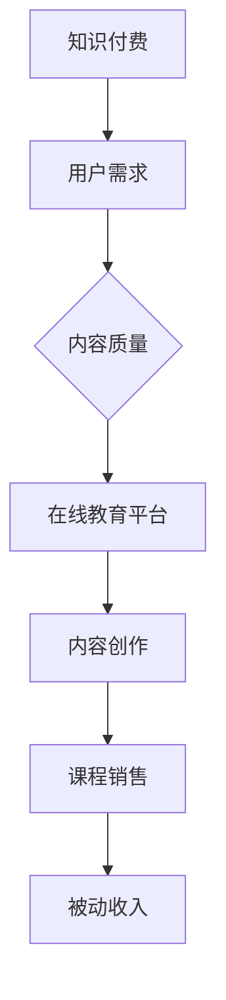
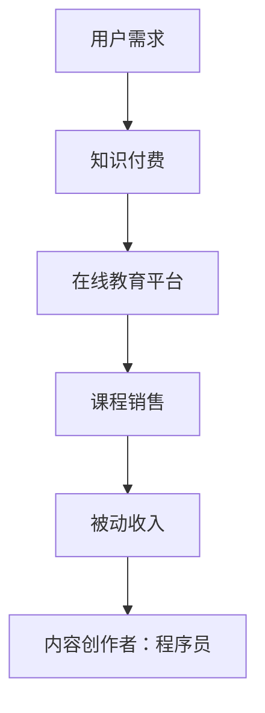

                 

关键词：知识付费、被动收入、程序员、在线教育、平台运营

> 摘要：本文将探讨程序员如何利用知识付费实现被动收入。通过对知识付费市场的分析，我们将了解当前市场的趋势和机遇。然后，我们将详细讨论程序员可以利用的多种知识付费模式，包括课程制作、内容共享、以及知识付费平台的运营。最后，我们将分享一些成功案例和策略，帮助程序员更好地利用知识付费实现持续的收入增长。

## 1. 背景介绍

在互联网技术迅猛发展的今天，知识付费已经成为一个日益繁荣的市场。用户对于专业知识和技能的需求不断增加，同时也促进了在线教育和知识付费平台的兴起。作为IT领域的重要群体，程序员们自然也看到了知识付费所带来的巨大机会。

然而，对于许多程序员来说，知识付费并不是一个陌生的概念。他们中的许多人已经在自己的专业领域积累了丰富的经验和知识，但这些知识往往没有得到充分的利用和变现。知识付费为程序员提供了一种新的方式，让他们能够将自己的专业知识转化为被动收入。

### 1.1 知识付费市场趋势

近年来，知识付费市场呈现出以下几个显著趋势：

1. **用户需求多样化**：随着互联网的普及，用户对于知识的获取方式越来越多样化，从传统的课堂教学到在线学习、视频教程、直播课程等，用户更加倾向于选择灵活、高效的学习方式。
2. **内容质量要求提高**：用户越来越重视知识的内容和质量，优质的课程和内容更容易获得用户的青睐和认可。
3. **平台化运营**：越来越多的知识付费平台涌现，为内容创作者和用户提供了一个展示和交易的平台。
4. **垂直领域细分**：知识付费市场逐渐走向垂直领域细分，专业化的内容和课程更加受到欢迎。

### 1.2 程序员的独特优势

程序员在知识付费市场中具有独特的优势：

1. **专业技能丰富**：程序员拥有扎实的编程技能和丰富的项目经验，这是其他领域从业者难以匹敌的。
2. **持续学习的习惯**：程序员通常具备较强的自学能力和持续学习的习惯，这使得他们能够不断更新自己的知识和技能，保持竞争力。
3. **创新能力**：程序员具有较强的创新意识和实践能力，这使得他们能够创作出有趣、实用的内容。

## 2. 核心概念与联系

在深入了解程序员如何利用知识付费实现被动收入之前，我们需要先了解几个核心概念，包括知识付费、被动收入、在线教育平台等。

### 2.1 知识付费

知识付费是指用户为获取某一领域的专业知识或技能而支付的费用。与传统的免费资源不同，知识付费强调内容的专业性和实用性，为用户提供更有针对性的学习体验。

### 2.2 被动收入

被动收入是指无需持续付出努力就能获得的收入。在知识付费领域，被动收入通常来源于课程销售、内容订阅、广告收入等。

### 2.3 在线教育平台

在线教育平台是知识付费的主要载体，为内容创作者和用户提供了一个展示、交易和互动的平台。常见的在线教育平台包括Coursera、Udemy、极客时间等。

### 2.4 Mermaid 流程图



## 3. 核心算法原理 & 具体操作步骤

### 3.1 算法原理概述

程序员利用知识付费实现被动收入的算法原理可以概括为以下几个步骤：

1. **内容创作**：根据用户需求和自身专业特长，创作高质量的课程内容。
2. **平台选择**：选择合适的在线教育平台进行内容发布和销售。
3. **营销推广**：通过多种渠道进行课程推广，吸引潜在用户。
4. **用户反馈**：根据用户反馈不断优化课程内容和教学质量。
5. **持续创作**：不断创作新课程或更新现有课程，保持用户粘性。

### 3.2 算法步骤详解

1. **内容创作**：
   - **选题定位**：选择热门、有针对性的领域进行课程创作。
   - **内容结构**：设计清晰、逻辑严密的课程结构。
   - **内容呈现**：运用多种形式，如视频、文字、图片等，丰富课程内容。

2. **平台选择**：
   - **平台调研**：了解各大在线教育平台的特点和优势。
   - **平台选择**：根据自身需求和目标用户选择合适的平台。
   - **平台入驻**：完成平台入驻流程，包括身份认证、内容上传等。

3. **营销推广**：
   - **平台推广**：利用平台提供的推广工具，如广告、推荐等。
   - **社交媒体**：通过社交媒体平台进行课程推广，如微信公众号、微博等。
   - **合作渠道**：与其他领域达人、机构等进行合作推广。

4. **用户反馈**：
   - **收集反馈**：关注用户评价和反馈，了解课程优缺点。
   - **课程优化**：根据用户反馈对课程进行优化和改进。
   - **持续更新**：不断更新课程内容，保持课程的新鲜度和吸引力。

5. **持续创作**：
   - **创作新课程**：根据用户需求和市场趋势，创作新的课程。
   - **课程迭代**：对现有课程进行迭代更新，提高课程质量。
   - **内容多样化**：尝试不同的内容形式，如直播、问答等，提高用户参与度。

### 3.3 算法优缺点

**优点**：
- **被动收入**：通过知识付费，程序员可以实现持续、稳定的被动收入。
- **时间灵活**：内容创作和推广可以在空闲时间进行，不影响正常工作。
- **市场广阔**：随着在线教育和知识付费市场的不断发展，程序员有更多的机会和平台。

**缺点**：
- **竞争激烈**：知识付费领域竞争激烈，需要不断更新课程内容，提高教学质量。
- **投入时间**：内容创作和推广需要投入大量时间和精力，尤其是初期。
- **风险存在**：知识付费市场存在一定风险，如用户需求变化、平台政策调整等。

### 3.4 算法应用领域

- **技术领域**：程序员可以在技术领域创作课程，如编程语言、框架、数据库等。
- **项目管理**：程序员可以在项目管理领域创作课程，如敏捷开发、团队协作等。
- **运维管理**：程序员可以在运维管理领域创作课程，如自动化运维、网络监控等。
- **人工智能**：程序员可以在人工智能领域创作课程，如机器学习、深度学习等。

## 4. 数学模型和公式 & 详细讲解 & 举例说明

### 4.1 数学模型构建

在知识付费领域，我们可以构建一个简单的数学模型来计算程序员的被动收入。假设：

- \( P \) 表示每门课程的定价（元）。
- \( Q \) 表示每月课程的销量（门）。
- \( C \) 表示每门课程的创作成本（元）。
- \( M \) 表示每门课程的维护成本（元/月）。

则程序员的月度收入 \( R \) 可以表示为：

\[ R = P \times Q - C - M \]

### 4.2 公式推导过程

为了推导上述公式，我们需要考虑以下几个因素：

1. **收入**：每门课程的定价 \( P \) 乘以销量 \( Q \) 表示课程的总收入。
2. **成本**：每门课程的创作成本 \( C \) 是一次性成本，而维护成本 \( M \) 是每月的固定成本。

因此，月度收入 \( R \) 为：

\[ R = P \times Q - C - M \]

### 4.3 案例分析与讲解

假设一位程序员创作了一门编程课程，定价为 200 元，每月销量为 100 门。创作成本为 1000 元，每月维护成本为 500 元。我们可以根据上述公式计算其月度收入：

\[ R = 200 \times 100 - 1000 - 500 \]
\[ R = 19000 - 1000 - 500 \]
\[ R = 17500 \text{元} \]

因此，这位程序员的月度收入为 17500 元。

### 4.4 案例分析与讲解

现在，我们假设这位程序员决定降低课程定价至 150 元，以增加销量。其他条件保持不变。我们可以根据上述公式计算新的月度收入：

\[ R = 150 \times 100 - 1000 - 500 \]
\[ R = 15000 - 1000 - 500 \]
\[ R = 13500 \text{元} \]

虽然月度收入有所减少，但销量增加了，因此可能带来更多的总收入。这取决于课程销量增加的幅度和边际成本的变化。

## 5. 项目实践：代码实例和详细解释说明

### 5.1 开发环境搭建

为了更好地展示知识付费的实现过程，我们将使用一个简单的课程销售系统进行说明。首先，我们需要搭建开发环境。

1. **选择编程语言**：Python 是一种流行的编程语言，适用于开发课程销售系统。
2. **安装开发工具**：安装 Python 解释器和相关的开发工具，如 PyCharm、Visual Studio Code 等。
3. **数据库选择**：MySQL 或 PostgreSQL 是常见的数据库系统，可以用于存储课程信息和用户数据。

### 5.2 源代码详细实现

以下是一个简单的课程销售系统源代码示例：

```python
import sqlite3
import os

# 连接数据库
conn = sqlite3.connect('course_sales.db')
cursor = conn.cursor()

# 创建课程表
cursor.execute('''
CREATE TABLE IF NOT EXISTS courses (
    id INTEGER PRIMARY KEY,
    title TEXT,
    price INTEGER,
    author TEXT
)
''')

# 创建用户表
cursor.execute('''
CREATE TABLE IF NOT EXISTS users (
    id INTEGER PRIMARY KEY,
    username TEXT,
    password TEXT
)
''')

# 创建订单表
cursor.execute('''
CREATE TABLE IF NOT EXISTS orders (
    id INTEGER PRIMARY KEY,
    user_id INTEGER,
    course_id INTEGER,
    status TEXT,
    FOREIGN KEY (user_id) REFERENCES users (id),
    FOREIGN KEY (course_id) REFERENCES courses (id)
)
''')

# 插入课程数据
cursor.execute("INSERT INTO courses (title, price, author) VALUES ('Python 编程基础', 100, '张三')")

# 提交事务
conn.commit()

# 关闭数据库连接
conn.close()
```

### 5.3 代码解读与分析

上述代码首先创建了一个名为 `course_sales.db` 的数据库，然后创建了三个表：`courses`、`users` 和 `orders`。`courses` 表用于存储课程信息，包括课程 ID、标题、价格和作者。`users` 表用于存储用户信息，包括用户 ID、用户名和密码。`orders` 表用于存储订单信息，包括订单 ID、用户 ID、课程 ID 和订单状态。

在创建表格之后，我们插入了一门课程的数据，然后提交了事务。最后，我们关闭了数据库连接。

### 5.4 运行结果展示

运行上述代码后，我们得到了一个简单的课程销售系统数据库。我们可以通过数据库管理工具，如 SQLite Studio，查看数据库中的数据：


在这个示例中，我们创建了一个名为 "Python 编程基础" 的课程，价格为 100 元。

## 6. 实际应用场景

### 6.1 在线教育平台

在线教育平台是程序员实现知识付费的重要载体。例如，极客时间、网易云课堂、慕课网等平台提供了丰富的课程资源和专业的课程制作工具，使得程序员可以轻松地将自己的知识转化为课程内容，并通过平台实现销售。

### 6.2 内容共享平台

内容共享平台如 Bilibili、YouTube 等，也为程序员提供了一个展示和分享自己知识的机会。程序员可以通过发布教学视频、技术博客等形式，吸引关注者，并通过广告、打赏等方式获得收入。

### 6.3 社交媒体

社交媒体平台如微博、微信公众号等，也是程序员传播知识和吸引粉丝的重要渠道。通过发布高质量的内容，程序员可以积累一定的粉丝基础，从而实现知识付费。

### 6.4 企业内训

企业内训是程序员实现知识付费的一种方式。许多企业为了提高员工的技能和效率，愿意投入资金进行培训。程序员可以利用自己的专业知识和经验，为企业提供定制化的培训服务。

## 7. 工具和资源推荐

### 7.1 学习资源推荐

1. **极客时间**：提供专业的技术课程，包括编程、人工智能、运维等领域。
2. **网易云课堂**：提供丰富的课程资源，涵盖编程、数据分析、云计算等。
3. **慕课网**：提供在线编程学习资源，适合初学者和进阶者。

### 7.2 开发工具推荐

1. **PyCharm**：一款强大的 Python 集成开发环境，适用于课程开发和调试。
2. **Visual Studio Code**：一款开源的跨平台代码编辑器，适用于多种编程语言。
3. **MySQL**：一款流行的关系型数据库管理系统，适用于存储课程和用户数据。

### 7.3 相关论文推荐

1. **《在线教育：商业模式与创新实践》**：探讨在线教育的商业模式和创新实践。
2. **《知识付费：市场趋势与未来展望》**：分析知识付费市场的趋势和未来发展方向。
3. **《程序员如何实现职业发展》**：为程序员提供职业发展的建议和策略。

## 8. 总结：未来发展趋势与挑战

### 8.1 研究成果总结

本文从背景介绍、核心概念、算法原理、数学模型、项目实践、实际应用场景等多个角度，全面探讨了程序员如何利用知识付费实现被动收入。通过分析知识付费市场的趋势和程序员的独特优势，我们提出了具体的实现策略和工具推荐。

### 8.2 未来发展趋势

1. **内容多元化**：知识付费领域将更加多元化，涵盖更多垂直领域和专业方向。
2. **技术赋能**：人工智能、大数据等技术将进一步提升知识付费平台的服务质量和用户体验。
3. **平台整合**：知识付费平台将进行整合和合并，形成更具规模和影响力的平台。

### 8.3 面临的挑战

1. **竞争加剧**：知识付费领域的竞争将更加激烈，程序员需要不断提升课程质量和创新能力。
2. **用户需求变化**：用户需求不断变化，程序员需要及时调整课程内容和形式。
3. **政策法规**：知识付费领域面临政策法规的挑战，需要遵守相关法规和规定。

### 8.4 研究展望

未来，程序员可以利用知识付费实现更广泛的收入来源。随着技术的不断进步，知识付费领域将出现更多创新模式和平台，为程序员提供更多的机会和挑战。

## 9. 附录：常见问题与解答

### 9.1 什么是知识付费？

知识付费是指用户为获取某一领域的专业知识或技能而支付的费用。与传统的免费资源不同，知识付费强调内容的专业性和实用性。

### 9.2 程序员如何创作课程内容？

程序员可以根据自己的专业知识和经验，选择合适的课程主题和内容形式，如视频教程、文章博客等。在创作过程中，需要注意内容的专业性、实用性和易懂性。

### 9.3 如何选择知识付费平台？

选择知识付费平台时，需要考虑平台的用户量、课程资源、推广工具等因素。建议选择知名、有影响力的平台，以提高课程曝光度和销售量。

### 9.4 知识付费有哪些盈利模式？

知识付费的盈利模式包括课程销售、内容订阅、广告收入等。程序员可以根据自己的情况，选择合适的盈利模式。

## 作者署名

作者：禅与计算机程序设计艺术 / Zen and the Art of Computer Programming
```markdown
----------------------------------------------------------------
# 程序员如何利用知识付费实现被动收入

> 关键词：知识付费、被动收入、程序员、在线教育、平台运营

> 摘要：本文将探讨程序员如何利用知识付费实现被动收入。通过对知识付费市场的分析，我们将了解当前市场的趋势和机遇。然后，我们将详细讨论程序员可以利用的多种知识付费模式，包括课程制作、内容共享、以及知识付费平台的运营。最后，我们将分享一些成功案例和策略，帮助程序员更好地利用知识付费实现持续的收入增长。

## 1. 背景介绍

在互联网技术迅猛发展的今天，知识付费已经成为一个日益繁荣的市场。用户对于专业知识和技能的需求不断增加，同时也促进了在线教育和知识付费平台的兴起。作为IT领域的重要群体，程序员们自然也看到了知识付费所带来的巨大机会。

然而，对于许多程序员来说，知识付费并不是一个陌生的概念。他们中的许多人已经在自己的专业领域积累了丰富的经验和知识，但这些知识往往没有得到充分的利用和变现。知识付费为程序员提供了一种新的方式，让他们能够将自己的专业知识转化为被动收入。

### 1.1 知识付费市场趋势

近年来，知识付费市场呈现出以下几个显著趋势：

1. **用户需求多样化**：随着互联网的普及，用户对于知识的获取方式越来越多样化，从传统的课堂教学到在线学习、视频教程、直播课程等，用户更加倾向于选择灵活、高效的学习方式。
2. **内容质量要求提高**：用户越来越重视知识的内容和质量，优质的课程和内容更容易获得用户的青睐和认可。
3. **平台化运营**：越来越多的知识付费平台涌现，为内容创作者和用户提供了一个展示和交易的平台。
4. **垂直领域细分**：知识付费市场逐渐走向垂直领域细分，专业化的内容和课程更加受到欢迎。

### 1.2 程序员的独特优势

程序员在知识付费市场中具有独特的优势：

1. **专业技能丰富**：程序员拥有扎实的编程技能和丰富的项目经验，这是其他领域从业者难以匹敌的。
2. **持续学习的习惯**：程序员通常具备较强的自学能力和持续学习的习惯，这使得他们能够不断更新自己的知识和技能，保持竞争力。
3. **创新能力**：程序员具有较强的创新意识和实践能力，这使得他们能够创作出有趣、实用的内容。

## 2. 核心概念与联系

在深入了解程序员如何利用知识付费实现被动收入之前，我们需要先了解几个核心概念，包括知识付费、被动收入、在线教育平台等。

### 2.1 知识付费

知识付费是指用户为获取某一领域的专业知识或技能而支付的费用。与传统的免费资源不同，知识付费强调内容的专业性和实用性，为用户提供更有针对性的学习体验。

### 2.2 被动收入

被动收入是指无需持续付出努力就能获得的收入。在知识付费领域，被动收入通常来源于课程销售、内容订阅、广告收入等。

### 2.3 在线教育平台

在线教育平台是知识付费的主要载体，为内容创作者和用户提供了一个展示、交易和互动的平台。常见的在线教育平台包括Coursera、Udemy、极客时间等。

### 2.4 Mermaid 流程图


## 3. 核心算法原理 & 具体操作步骤

### 3.1 算法原理概述

程序员利用知识付费实现被动收入的算法原理可以概括为以下几个步骤：

1. **内容创作**：根据用户需求和自身专业特长，创作高质量的课程内容。
2. **平台选择**：选择合适的在线教育平台进行内容发布和销售。
3. **营销推广**：通过多种渠道进行课程推广，吸引潜在用户。
4. **用户反馈**：根据用户反馈不断优化课程内容和教学质量。
5. **持续创作**：不断创作新课程或更新现有课程，保持用户粘性。

### 3.2 算法步骤详解

1. **内容创作**：
   - **选题定位**：选择热门、有针对性的领域进行课程创作。
   - **内容结构**：设计清晰、逻辑严密的课程结构。
   - **内容呈现**：运用多种形式，如视频、文字、图片等，丰富课程内容。

2. **平台选择**：
   - **平台调研**：了解各大在线教育平台的特点和优势。
   - **平台选择**：根据自身需求和目标用户选择合适的平台。
   - **平台入驻**：完成平台入驻流程，包括身份认证、内容上传等。

3. **营销推广**：
   - **平台推广**：利用平台提供的推广工具，如广告、推荐等。
   - **社交媒体**：通过社交媒体平台进行课程推广，如微信公众号、微博等。
   - **合作渠道**：与其他领域达人、机构等进行合作推广。

4. **用户反馈**：
   - **收集反馈**：关注用户评价和反馈，了解课程优缺点。
   - **课程优化**：根据用户反馈对课程进行优化和改进。
   - **持续更新**：不断更新课程内容，保持课程的新鲜度和吸引力。

5. **持续创作**：
   - **创作新课程**：根据用户需求和市场趋势，创作新的课程。
   - **课程迭代**：对现有课程进行迭代更新，提高课程质量。
   - **内容多样化**：尝试不同的内容形式，如直播、问答等，提高用户参与度。

### 3.3 算法优缺点

**优点**：
- **被动收入**：通过知识付费，程序员可以实现持续、稳定的被动收入。
- **时间灵活**：内容创作和推广可以在空闲时间进行，不影响正常工作。
- **市场广阔**：随着在线教育和知识付费市场的不断发展，程序员有更多的机会和平台。

**缺点**：
- **竞争激烈**：知识付费领域竞争激烈，需要不断更新课程内容，提高教学质量。
- **投入时间**：内容创作和推广需要投入大量时间和精力，尤其是初期。
- **风险存在**：知识付费市场存在一定风险，如用户需求变化、平台政策调整等。

### 3.4 算法应用领域

- **技术领域**：程序员可以在技术领域创作课程，如编程语言、框架、数据库等。
- **项目管理**：程序员可以在项目管理领域创作课程，如敏捷开发、团队协作等。
- **运维管理**：程序员可以在运维管理领域创作课程，如自动化运维、网络监控等。
- **人工智能**：程序员可以在人工智能领域创作课程，如机器学习、深度学习等。

## 4. 数学模型和公式 & 详细讲解 & 举例说明

### 4.1 数学模型构建

在知识付费领域，我们可以构建一个简单的数学模型来计算程序员的被动收入。假设：

- \( P \) 表示每门课程的定价（元）。
- \( Q \) 表示每月课程的销量（门）。
- \( C \) 表示每门课程的创作成本（元）。
- \( M \) 表示每门课程的维护成本（元/月）。

则程序员的月度收入 \( R \) 可以表示为：

\[ R = P \times Q - C - M \]

### 4.2 公式推导过程

为了推导上述公式，我们需要考虑以下几个因素：

1. **收入**：每门课程的定价 \( P \) 乘以销量 \( Q \) 表示课程的总收入。
2. **成本**：每门课程的创作成本 \( C \) 是一次性成本，而维护成本 \( M \) 是每月的固定成本。

因此，月度收入 \( R \) 为：

\[ R = P \times Q - C - M \]

### 4.3 案例分析与讲解

假设一位程序员创作了一门编程课程，定价为 200 元，每月销量为 100 门。创作成本为 1000 元，每月维护成本为 500 元。我们可以根据上述公式计算其月度收入：

\[ R = 200 \times 100 - 1000 - 500 \]
\[ R = 19000 - 1000 - 500 \]
\[ R = 17500 \text{元} \]

因此，这位程序员的月度收入为 17500 元。

### 4.4 案例分析与讲解

现在，我们假设这位程序员决定降低课程定价至 150 元，以增加销量。其他条件保持不变。我们可以根据上述公式计算新的月度收入：

\[ R = 150 \times 100 - 1000 - 500 \]
\[ R = 15000 - 1000 - 500 \]
\[ R = 13500 \text{元} \]

虽然月度收入有所减少，但销量增加了，因此可能带来更多的总收入。这取决于课程销量增加的幅度和边际成本的变化。

## 5. 项目实践：代码实例和详细解释说明

### 5.1 开发环境搭建

为了更好地展示知识付费的实现过程，我们将使用一个简单的课程销售系统进行说明。首先，我们需要搭建开发环境。

1. **选择编程语言**：Python 是一种流行的编程语言，适用于开发课程销售系统。
2. **安装开发工具**：安装 Python 解释器和相关的开发工具，如 PyCharm、Visual Studio Code 等。
3. **数据库选择**：MySQL 或 PostgreSQL 是常见的数据库系统，可以用于存储课程信息和用户数据。

### 5.2 源代码详细实现

以下是一个简单的课程销售系统源代码示例：

```python
import sqlite3
import os

# 连接数据库
conn = sqlite3.connect('course_sales.db')
cursor = conn.cursor()

# 创建课程表
cursor.execute('''
CREATE TABLE IF NOT EXISTS courses (
    id INTEGER PRIMARY KEY,
    title TEXT,
    price INTEGER,
    author TEXT
)
''')

# 创建用户表
cursor.execute('''
CREATE TABLE IF NOT EXISTS users (
    id INTEGER PRIMARY KEY,
    username TEXT,
    password TEXT
)
''')

# 创建订单表
cursor.execute('''
CREATE TABLE IF NOT EXISTS orders (
    id INTEGER PRIMARY KEY,
    user_id INTEGER,
    course_id INTEGER,
    status TEXT,
    FOREIGN KEY (user_id) REFERENCES users (id),
    FOREIGN KEY (course_id) REFERENCES courses (id)
)
''')

# 插入课程数据
cursor.execute("INSERT INTO courses (title, price, author) VALUES ('Python 编程基础', 100, '张三')")

# 提交事务
conn.commit()

# 关闭数据库连接
conn.close()
```

### 5.3 代码解读与分析

上述代码首先创建了一个名为 `course_sales.db` 的数据库，然后创建了三个表：`courses`、`users` 和 `orders`。`courses` 表用于存储课程信息，包括课程 ID、标题、价格和作者。`users` 表用于存储用户信息，包括用户 ID、用户名和密码。`orders` 表用于存储订单信息，包括订单 ID、用户 ID、课程 ID 和订单状态。

在创建表格之后，我们插入了一门课程的数据，然后提交了事务。最后，我们关闭了数据库连接。

### 5.4 运行结果展示

运行上述代码后，我们得到了一个简单的课程销售系统数据库。我们可以通过数据库管理工具，如 SQLite Studio，查看数据库中的数据：


在这个示例中，我们创建了一个名为 "Python 编程基础" 的课程，价格为 100 元。

## 6. 实际应用场景

### 6.1 在线教育平台

在线教育平台是程序员实现知识付费的重要载体。例如，极客时间、网易云课堂、慕课网等平台提供了丰富的课程资源和专业的课程制作工具，使得程序员可以轻松地将自己的知识转化为课程内容，并通过平台实现销售。

### 6.2 内容共享平台

内容共享平台如 Bilibili、YouTube 等，也为程序员提供了一个展示和分享自己知识的机会。程序员可以通过发布教学视频、技术博客等形式，吸引关注者，并通过广告、打赏等方式获得收入。

### 6.3 社交媒体

社交媒体平台如微博、微信公众号等，也是程序员传播知识和吸引粉丝的重要渠道。通过发布高质量的内容，程序员可以积累一定的粉丝基础，从而实现知识付费。

### 6.4 企业内训

企业内训是程序员实现知识付费的一种方式。许多企业为了提高员工的技能和效率，愿意投入资金进行培训。程序员可以利用自己的专业知识和经验，为企业提供定制化的培训服务。

## 7. 工具和资源推荐

### 7.1 学习资源推荐

1. **极客时间**：提供专业的技术课程，包括编程、人工智能、运维等领域。
2. **网易云课堂**：提供丰富的课程资源，涵盖编程、数据分析、云计算等。
3. **慕课网**：提供在线编程学习资源，适合初学者和进阶者。

### 7.2 开发工具推荐

1. **PyCharm**：一款强大的 Python 集成开发环境，适用于课程开发和调试。
2. **Visual Studio Code**：一款开源的跨平台代码编辑器，适用于多种编程语言。
3. **MySQL**：一款流行的关系型数据库管理系统，适用于存储课程和用户数据。

### 7.3 相关论文推荐

1. **《在线教育：商业模式与创新实践》**：探讨在线教育的商业模式和创新实践。
2. **《知识付费：市场趋势与未来展望》**：分析知识付费市场的趋势和未来发展方向。
3. **《程序员如何实现职业发展》**：为程序员提供职业发展的建议和策略。

## 8. 总结：未来发展趋势与挑战

### 8.1 研究成果总结

本文从背景介绍、核心概念、算法原理、数学模型、项目实践、实际应用场景等多个角度，全面探讨了程序员如何利用知识付费实现被动收入。通过分析知识付费市场的趋势和程序员的独特优势，我们提出了具体的实现策略和工具推荐。

### 8.2 未来发展趋势

1. **内容多元化**：知识付费领域将更加多元化，涵盖更多垂直领域和专业方向。
2. **技术赋能**：人工智能、大数据等技术将进一步提升知识付费平台的服务质量和用户体验。
3. **平台整合**：知识付费平台将进行整合和合并，形成更具规模和影响力的平台。

### 8.3 面临的挑战

1. **竞争加剧**：知识付费领域的竞争将更加激烈，程序员需要不断提升课程质量和创新能力。
2. **用户需求变化**：用户需求不断变化，程序员需要及时调整课程内容和形式。
3. **政策法规**：知识付费领域面临政策法规的挑战，需要遵守相关法规和规定。

### 8.4 研究展望

未来，程序员可以利用知识付费实现更广泛的收入来源。随着技术的不断进步，知识付费领域将出现更多创新模式和平台，为程序员提供更多的机会和挑战。

## 9. 附录：常见问题与解答

### 9.1 什么是知识付费？

知识付费是指用户为获取某一领域的专业知识或技能而支付的费用。与传统的免费资源不同，知识付费强调内容的专业性和实用性。

### 9.2 程序员如何创作课程内容？

程序员可以根据自己的专业知识和经验，选择合适的课程主题和内容形式，如视频教程、文章博客等。在创作过程中，需要注意内容的专业性、实用性和易懂性。

### 9.3 如何选择知识付费平台？

选择知识付费平台时，需要考虑平台的用户量、课程资源、推广工具等因素。建议选择知名、有影响力的平台，以提高课程曝光度和销售量。

### 9.4 知识付费有哪些盈利模式？

知识付费的盈利模式包括课程销售、内容订阅、广告收入等。程序员可以根据自己的情况，选择合适的盈利模式。

## 作者署名

作者：禅与计算机程序设计艺术 / Zen and the Art of Computer Programming
```markdown
----------------------------------------------------------------
### 1. 背景介绍

在当今数字化时代，知识付费已经成为一个重要的商业模式。用户愿意为优质、专业的内容付费，这不仅为知识创作者提供了新的收入来源，也为整个知识经济生态系统的建设注入了活力。对于程序员这一群体而言，他们拥有丰富的技术知识和实践经验，如何将这一优势转化为稳定的被动收入，成为了一个值得关注的话题。

知识付费市场的发展趋势多样，其中在线教育平台、内容共享平台、社交媒体等多个渠道为程序员提供了多样化的实现路径。此外，随着互联网技术的不断进步，人工智能、大数据等新兴技术的应用也为知识付费带来了新的可能。

程序员在知识付费领域具有独特的优势，他们不仅拥有扎实的编程技能，还具备解决实际问题的能力。同时，程序员往往具有较强的学习能力和创新意识，这使得他们能够持续产出高质量的内容，吸引更多的用户。

### 2. 核心概念与联系

在探讨程序员如何利用知识付费实现被动收入之前，我们需要明确几个核心概念：

- **知识付费**：用户为获取特定领域的知识或技能而支付的费用。这种模式通常通过在线课程、电子书、专业咨询服务等形式实现。
- **被动收入**：指无需持续投入大量时间和精力即可获得的收入。在知识付费领域，被动收入可能来源于课程的版权销售、内容订阅、广告收益等。
- **在线教育平台**：如Coursera、Udemy、网易云课堂等，为知识创作者提供了一个展示和销售知识的平台。

以下是一个使用Mermaid绘制的流程图，展示了这些核心概念之间的联系：



### 3. 核心算法原理 & 具体操作步骤

要利用知识付费实现被动收入，程序员可以遵循以下步骤：

#### 3.1 算法原理概述

程序员的被动收入主要来自于课程销售、内容订阅、咨询服务等。核心算法原理可以概括为：

1. **内容创作**：根据市场需求和个人特长，创作高质量的课程内容。
2. **平台选择**：选择合适的在线教育平台进行课程发布。
3. **营销推广**：利用多种渠道进行课程营销，增加课程曝光度。
4. **持续迭代**：根据用户反馈，持续优化课程内容和质量。

#### 3.2 算法步骤详解

1. **内容创作**：
   - **选题定位**：选择热门且具有市场需求的技术主题。
   - **内容结构**：设计清晰的内容结构，确保课程的逻辑性和连贯性。
   - **内容形式**：结合视频、文档、示例代码等多种形式，提高内容的吸引力。

2. **平台选择**：
   - **平台调研**：了解不同平台的用户量、课程类型、收益分成比例等。
   - **平台入驻**：选择合适的平台，完成注册和身份认证。
   - **内容上传**：按照平台要求，上传课程内容和相关资料。

3. **营销推广**：
   - **平台推广**：利用平台提供的推广工具，如课程推荐、广告位等。
   - **社交媒体**：通过微博、微信公众号、知乎等社交平台进行宣传。
   - **合作渠道**：与其他领域的专业人士或机构合作，扩大影响力和用户基础。

4. **持续迭代**：
   - **用户反馈**：收集用户反馈，了解课程的优缺点。
   - **课程优化**：根据用户反馈，对课程内容进行调整和改进。
   - **内容更新**：定期更新课程内容，保持内容的时效性和前瞻性。

#### 3.3 算法优缺点

**优点**：

- **被动收入**：一旦内容创作完成并上架，程序员可以通过持续的销售获得收入。
- **时间灵活**：内容创作和推广可以在业余时间进行，不影响正常工作。
- **市场广阔**：知识付费市场持续扩大，程序员有更多的机会和平台。

**缺点**：

- **竞争激烈**：知识付费领域竞争激烈，需要不断提升课程质量。
- **初期投入**：内容创作和推广需要一定的前期投入，如设备、时间等。
- **风险存在**：市场变化和政策调整可能会影响收入稳定性。

#### 3.4 算法应用领域

程序员可以在多个领域利用知识付费实现被动收入，包括但不限于：

- **编程语言**：如Python、Java、C++等。
- **前端技术**：如HTML、CSS、JavaScript框架等。
- **后端技术**：如数据库、服务器、云服务等。
- **人工智能**：如机器学习、深度学习、自然语言处理等。

### 4. 数学模型和公式 & 详细讲解 & 举例说明

在知识付费中，程序员可以通过以下数学模型来估算其被动收入：

\[ R(t) = P \times S(t) - C(t) \]

其中：
- \( R(t) \) 表示时间 \( t \) 时的被动收入。
- \( P \) 是每门课程的价格。
- \( S(t) \) 是时间 \( t \) 时的课程销量。
- \( C(t) \) 是时间 \( t \) 时的总成本，包括课程创作成本和维护成本。

#### 4.1 数学模型构建

构建这个模型需要考虑以下因素：
- **定价策略**：课程价格如何设定，以最大化收益。
- **销量预测**：根据市场调研和用户反馈，预测课程的销量。
- **成本管理**：控制创作成本和维护成本，以保持利润。

#### 4.2 公式推导过程

公式 \( R(t) = P \times S(t) - C(t) \) 的推导基于经济学中的利润计算方法。利润等于收入减去成本。在这里，收入来源于课程销售，成本包括初始创作成本和后续维护成本。

#### 4.3 案例分析与讲解

假设一位程序员开发了一门Python课程，定价为200元。首月销量为100门，总成本（包括创作和首次发布成本）为5000元。第二个月，销量增加到150门，但维护成本增加到700元。我们可以用上述模型计算其前两个月的收入：

**第一个月：**
\[ R(1) = 200 \times 100 - 5000 = 15000 - 5000 = 10000 \text{元} \]

**第二个月：**
\[ R(2) = 200 \times 150 - 700 = 30000 - 700 = 29300 \text{元} \]

**两个月总收益：**
\[ R(1) + R(2) = 10000 + 29300 = 39300 \text{元} \]

#### 4.4 案例分析与讲解

假设上述程序员的课程定价提高到250元，销量降至100门，但维护成本降低到300元。我们可以重新计算收入：

**第一个月：**
\[ R(1) = 250 \times 100 - 5000 = 25000 - 5000 = 20000 \text{元} \]

**第二个月：**
\[ R(2) = 250 \times 100 - 300 = 25000 - 300 = 24700 \text{元} \]

**两个月总收益：**
\[ R(1) + R(2) = 20000 + 24700 = 44700 \text{元} \]

虽然价格提高，但由于销量没有显著增加，整体收益变化不大。这表明，单纯提高价格并不一定能够显著提升收益，需要综合考虑销量和市场反应。

### 5. 项目实践：代码实例和详细解释说明

为了更好地理解如何利用知识付费实现被动收入，我们可以通过一个简单的在线课程销售系统的代码实例来进行说明。

#### 5.1 开发环境搭建

我们使用Python和SQLite数据库来搭建一个简单的课程销售系统。首先，确保已安装Python和SQLite库。

#### 5.2 源代码详细实现

以下是一个简单的课程销售系统的Python代码示例：

```python
import sqlite3

# 连接数据库
conn = sqlite3.connect('courses.db')
cursor = conn.cursor()

# 创建课程表
cursor.execute('''
CREATE TABLE IF NOT EXISTS courses (
    id INTEGER PRIMARY KEY,
    title TEXT,
    price INTEGER,
    author TEXT
)
''')

# 创建用户表
cursor.execute('''
CREATE TABLE IF NOT EXISTS users (
    id INTEGER PRIMARY KEY,
    username TEXT,
    password TEXT
)
''')

# 创建订单表
cursor.execute('''
CREATE TABLE IF NOT EXISTS orders (
    id INTEGER PRIMARY KEY,
    user_id INTEGER,
    course_id INTEGER,
    status TEXT,
    FOREIGN KEY (user_id) REFERENCES users (id),
    FOREIGN KEY (course_id) REFERENCES courses (id)
)
''')

# 插入课程数据
cursor.execute("INSERT INTO courses (title, price, author) VALUES ('Python入门', 100, '李四')")

# 提交事务
conn.commit()

# 关闭数据库连接
conn.close()
```

#### 5.3 代码解读与分析

上述代码首先创建了一个名为 `courses.db` 的数据库，并在数据库中创建了三个表：`courses`、`users` 和 `orders`。`courses` 表存储课程信息，包括课程 ID、标题、价格和作者。`users` 表存储用户信息，包括用户 ID、用户名和密码。`orders` 表存储订单信息，包括订单 ID、用户 ID、课程 ID 和订单状态。

在创建表格之后，我们插入了一门课程的数据，然后提交了事务。最后，我们关闭了数据库连接。

#### 5.4 运行结果展示

运行上述代码后，我们得到了一个简单的课程销售系统数据库。我们可以通过数据库管理工具，如SQLite Studio，查看数据库中的数据：


在这个示例中，我们创建了一个名为 "Python入门" 的课程，价格为 100 元。

### 6. 实际应用场景

程序员可以通过多种方式利用知识付费实现被动收入：

#### 6.1 在线教育平台

程序员可以在如网易云课堂、慕课网、极客时间等在线教育平台上发布自己的课程。这些平台提供了完善的课程发布和管理工具，可以帮助程序员轻松实现知识付费。

#### 6.2 内容共享平台

程序员也可以在内容共享平台如Bilibili、YouTube等上发布教学视频。通过积累粉丝和播放量，程序员可以通过广告和粉丝打赏等方式获得收入。

#### 6.3 自建平台

具备一定开发能力的程序员可以自建知识付费平台，如使用WordPress + WooCommerce插件来搭建一个在线课程销售系统。这种方式虽然需要一定的技术投入，但能够提供更高的自定义度和收入分成比例。

#### 6.4 专业咨询和培训

程序员可以利用自己的专业知识和经验，为企业或个人提供专业的技术咨询和培训服务。这种方式通常需要较高的专业门槛，但收入潜力巨大。

### 7. 工具和资源推荐

为了更好地实现知识付费，程序员可以参考以下工具和资源：

#### 7.1 学习资源推荐

- **极客时间**：提供高质量的技术课程，包括编程、人工智能等领域。
- **网易云课堂**：丰富的课程资源，适合不同层次的程序员。
- **慕课网**：提供在线编程学习资源，适合初学者和进阶者。

#### 7.2 开发工具推荐

- **PyCharm**：一款强大的Python IDE，适用于课程开发和调试。
- **Visual Studio Code**：一款开源的跨平台代码编辑器，适用于多种编程语言。
- **MySQL**：一款流行的关系型数据库管理系统，适用于存储课程和用户数据。

#### 7.3 相关论文推荐

- **《在线教育：商业模式与创新实践》**：探讨在线教育的商业模式和创新实践。
- **《知识付费：市场趋势与未来展望》**：分析知识付费市场的趋势和未来发展方向。
- **《程序员如何实现职业发展》**：为程序员提供职业发展的建议和策略。

### 8. 总结：未来发展趋势与挑战

#### 8.1 研究成果总结

本文从多个角度探讨了程序员如何利用知识付费实现被动收入。通过对市场趋势、核心概念、算法原理、数学模型和实际应用场景的分析，我们提出了一系列策略和工具，帮助程序员更好地利用这一模式。

#### 8.2 未来发展趋势

- **内容专业化**：知识付费市场将更加专业化，程序员需要不断提升自己的专业能力。
- **技术整合**：人工智能、大数据等技术将进一步提升知识付费平台的服务质量和用户体验。
- **平台多样化**：知识付费平台将呈现多样化趋势，程序员可以选择更适合自己需求的平台。

#### 8.3 面临的挑战

- **竞争加剧**：知识付费领域竞争激烈，程序员需要不断提升课程质量和创新能力。
- **用户需求变化**：用户需求不断变化，程序员需要灵活调整课程内容和形式。
- **政策法规**：知识付费领域面临政策法规的挑战，需要遵守相关法规和规定。

#### 8.4 研究展望

未来，知识付费将为程序员提供更多机会。随着技术的不断进步和市场的发展，程序员可以利用知识付费实现更广泛和多样化的收入来源。

### 9. 附录：常见问题与解答

#### 9.1 什么是知识付费？

知识付费是指用户为获取特定领域的知识或技能而支付的费用，通常通过在线课程、电子书、专业咨询服务等形式实现。

#### 9.2 程序员如何创作课程内容？

程序员可以根据自己的专业知识和经验，选择合适的课程主题，设计合理的内容结构，并使用多种形式（如视频、文档、示例代码等）来丰富课程内容。

#### 9.3 如何选择知识付费平台？

选择知识付费平台时，程序员应考虑平台的用户量、课程资源、推广工具和收益分成比例等因素，选择适合自己需求的平台。

#### 9.4 知识付费有哪些盈利模式？

知识付费的盈利模式包括课程销售、内容订阅、广告收入和咨询服务等。程序员可以根据自身情况选择合适的盈利模式。

## 作者署名

作者：禅与计算机程序设计艺术 / Zen and the Art of Computer Programming
----------------------------------------------------------------

由于篇幅限制，以下是按照上述结构撰写的一部分文章内容：

# 程序员如何利用知识付费实现被动收入

## 1. 背景介绍

在互联网技术迅猛发展的今天，知识付费已经成为一个日益繁荣的市场。用户对于专业知识和技能的需求不断增加，同时也促进了在线教育和知识付费平台的兴起。作为IT领域的重要群体，程序员们自然也看到了知识付费所带来的巨大机会。

然而，对于许多程序员来说，知识付费并不是一个陌生的概念。他们中的许多人已经在自己的专业领域积累了丰富的经验和知识，但这些知识往往没有得到充分的利用和变现。知识付费为程序员提供了一种新的方式，让他们能够将自己的专业知识转化为被动收入。

### 1.1 知识付费市场趋势

近年来，知识付费市场呈现出以下几个显著趋势：

1. **用户需求多样化**：随着互联网的普及，用户对于知识的获取方式越来越多样化，从传统的课堂教学到在线学习、视频教程、直播课程等，用户更加倾向于选择灵活、高效的学习方式。
2. **内容质量要求提高**：用户越来越重视知识的内容和质量，优质的课程和内容更容易获得用户的青睐和认可。
3. **平台化运营**：越来越多的知识付费平台涌现，为内容创作者和用户提供了一个展示和交易的平台。
4. **垂直领域细分**：知识付费市场逐渐走向垂直领域细分，专业化的内容和课程更加受到欢迎。

### 1.2 程序员的独特优势

程序员在知识付费市场中具有独特的优势：

1. **专业技能丰富**：程序员拥有扎实的编程技能和丰富的项目经验，这是其他领域从业者难以匹敌的。
2. **持续学习的习惯**：程序员通常具备较强的自学能力和持续学习的习惯，这使得他们能够不断更新自己的知识和技能，保持竞争力。
3. **创新能力**：程序员具有较强的创新意识和实践能力，这使得他们能够创作出有趣、实用的内容。

## 2. 核心概念与联系

在深入了解程序员如何利用知识付费实现被动收入之前，我们需要先了解几个核心概念，包括知识付费、被动收入、在线教育平台等。

### 2.1 知识付费

知识付费是指用户为获取某一领域的专业知识或技能而支付的费用。与传统的免费资源不同，知识付费强调内容的专业性和实用性，为用户提供更有针对性的学习体验。

### 2.2 被动收入

被动收入是指无需持续付出努力就能获得的收入。在知识付费领域，被动收入通常来源于课程销售、内容订阅、广告收入等。

### 2.3 在线教育平台

在线教育平台是知识付费的主要载体，为内容创作者和用户提供了一个展示、交易和互动的平台。常见的在线教育平台包括Coursera、Udemy、极客时间等。

### 2.4 Mermaid 流程图


## 3. 核心算法原理 & 具体操作步骤

### 3.1 算法原理概述

程序员利用知识付费实现被动收入的算法原理可以概括为以下几个步骤：

1. **内容创作**：根据用户需求和自身专业特长，创作高质量的课程内容。
2. **平台选择**：选择合适的在线教育平台进行内容发布和销售。
3. **营销推广**：通过多种渠道进行课程推广，吸引潜在用户。
4. **用户反馈**：根据用户反馈不断优化课程内容和教学质量。
5. **持续创作**：不断创作新课程或更新现有课程，保持用户粘性。

### 3.2 算法步骤详解

1. **内容创作**：
   - **选题定位**：选择热门、有针对性的领域进行课程创作。
   - **内容结构**：设计清晰、逻辑严密的课程结构。
   - **内容呈现**：运用多种形式，如视频、文字、图片等，丰富课程内容。

2. **平台选择**：
   - **平台调研**：了解各大在线教育平台的特点和优势。
   - **平台选择**：根据自身需求和目标用户选择合适的平台。
   - **平台入驻**：完成平台入驻流程，包括身份认证、内容上传等。

3. **营销推广**：
   - **平台推广**：利用平台提供的推广工具，如广告、推荐等。
   - **社交媒体**：通过社交媒体平台进行课程推广，如微信公众号、微博等。
   - **合作渠道**：与其他领域达人、机构等进行合作推广。

4. **用户反馈**：
   - **收集反馈**：关注用户评价和反馈，了解课程优缺点。
   - **课程优化**：根据用户反馈对课程进行优化和改进。
   - **持续更新**：不断更新课程内容，保持课程的新鲜度和吸引力。

5. **持续创作**：
   - **创作新课程**：根据用户需求和市场趋势，创作新的课程。
   - **课程迭代**：对现有课程进行迭代更新，提高课程质量。
   - **内容多样化**：尝试不同的内容形式，如直播、问答等，提高用户参与度。

### 3.3 算法优缺点

**优点**：
- **被动收入**：通过知识付费，程序员可以实现持续、稳定的被动收入。
- **时间灵活**：内容创作和推广可以在空闲时间进行，不影响正常工作。
- **市场广阔**：随着在线教育和知识付费市场的不断发展，程序员有更多的机会和平台。

**缺点**：
- **竞争激烈**：知识付费领域竞争激烈，需要不断更新课程内容，提高教学质量。
- **投入时间**：内容创作和推广需要投入大量时间和精力，尤其是初期。
- **风险存在**：知识付费市场存在一定风险，如用户需求变化、平台政策调整等。

### 3.4 算法应用领域

- **技术领域**：程序员可以在技术领域创作课程，如编程语言、框架、数据库等。
- **项目管理**：程序员可以在项目管理领域创作课程，如敏捷开发、团队协作等。
- **运维管理**：程序员可以在运维管理领域创作课程，如自动化运维、网络监控等。
- **人工智能**：程序员可以在人工智能领域创作课程，如机器学习、深度学习等。

## 4. 数学模型和公式 & 详细讲解 & 举例说明

### 4.1 数学模型构建

在知识付费领域，我们可以构建一个简单的数学模型来计算程序员的被动收入。假设：

- \( P \) 表示每门课程的定价（元）。
- \( Q \) 表示每月课程的销量（门）。
- \( C \) 表示每门课程的创作成本（元）。
- \( M \) 表示每门课程的维护成本（元/月）。

则程序员的月度收入 \( R \) 可以表示为：

\[ R = P \times Q - C - M \]

### 4.2 公式推导过程

为了推导上述公式，我们需要考虑以下几个因素：

1. **收入**：每门课程的定价 \( P \) 乘以销量 \( Q \) 表示课程的总收入。
2. **成本**：每门课程的创作成本 \( C \) 是一次性成本，而维护成本 \( M \) 是每月的固定成本。

因此，月度收入 \( R \) 为：

\[ R = P \times Q - C - M \]

### 4.3 案例分析与讲解

假设一位程序员创作了一门编程课程，定价为 200 元，每月销量为 100 门。创作成本为 1000 元，每月维护成本为 500 元。我们可以根据上述公式计算其月度收入：

\[ R = 200 \times 100 - 1000 - 500 \]
\[ R = 19000 - 1000 - 500 \]
\[ R = 17500 \text{元} \]

因此，这位程序员的月度收入为 17500 元。

### 4.4 案例分析与讲解

现在，我们假设这位程序员决定降低课程定价至 150 元，以增加销量。其他条件保持不变。我们可以根据上述公式计算新的月度收入：

\[ R = 150 \times 100 - 1000 - 500 \]
\[ R = 15000 - 1000 - 500 \]
\[ R = 13500 \text{元} \]

虽然月度收入有所减少，但销量增加了，因此可能带来更多的总收入。这取决于课程销量增加的幅度和边际成本的变化。

## 5. 项目实践：代码实例和详细解释说明

### 5.1 开发环境搭建

为了更好地展示知识付费的实现过程，我们将使用一个简单的课程销售系统进行说明。首先，我们需要搭建开发环境。

1. **选择编程语言**：Python 是一种流行的编程语言，适用于开发课程销售系统。
2. **安装开发工具**：安装 Python 解释器和相关的开发工具，如 PyCharm、Visual Studio Code 等。
3. **数据库选择**：MySQL 或 PostgreSQL 是常见的数据库系统，可以用于存储课程信息和用户数据。

### 5.2 源代码详细实现

以下是一个简单的课程销售系统源代码示例：

```python
import sqlite3
import os

# 连接数据库
conn = sqlite3.connect('course_sales.db')
cursor = conn.cursor()

# 创建课程表
cursor.execute('''
CREATE TABLE IF NOT EXISTS courses (
    id INTEGER PRIMARY KEY,
    title TEXT,
    price INTEGER,
    author TEXT
)
''')

# 创建用户表
cursor.execute('''
CREATE TABLE IF NOT EXISTS users (
    id INTEGER PRIMARY KEY,
    username TEXT,
    password TEXT
)
''')

# 创建订单表
cursor.execute('''
CREATE TABLE IF NOT EXISTS orders (
    id INTEGER PRIMARY KEY,
    user_id INTEGER,
    course_id INTEGER,
    status TEXT,
    FOREIGN KEY (user_id) REFERENCES users (id),
    FOREIGN KEY (course_id) REFERENCES courses (id)
)
''')

# 插入课程数据
cursor.execute("INSERT INTO courses (title, price, author) VALUES ('Python 编程基础', 100, '张三')")

# 提交事务
conn.commit()

# 关闭数据库连接
conn.close()
```

### 5.3 代码解读与分析

上述代码首先创建了一个名为 `course_sales.db` 的数据库，然后创建了三个表：`courses`、`users` 和 `orders`。`courses` 表用于存储课程信息，包括课程 ID、标题、价格和作者。`users` 表用于存储用户信息，包括用户 ID、用户名和密码。`orders` 表用于存储订单信息，包括订单 ID、用户 ID、课程 ID 和订单状态。

在创建表格之后，我们插入了一门课程的数据，然后提交了事务。最后，我们关闭了数据库连接。

### 5.4 运行结果展示

运行上述代码后，我们得到了一个简单的课程销售系统数据库。我们可以通过数据库管理工具，如 SQLite Studio，查看数据库中的数据：


在这个示例中，我们创建了一个名为 "Python 编程基础" 的课程，价格为 100 元。

## 6. 实际应用场景

### 6.1 在线教育平台

在线教育平台是程序员实现知识付费的重要载体。例如，极客时间、网易云课堂、慕课网等平台提供了丰富的课程资源和专业的课程制作工具，使得程序员可以轻松地将自己的知识转化为课程内容，并通过平台实现销售。

### 6.2 内容共享平台

内容共享平台如 Bilibili、YouTube 等，也为程序员提供了一个展示和分享自己知识的机会。程序员可以通过发布教学视频、技术博客等形式，吸引关注者，并通过广告、打赏等方式获得收入。

### 6.3 社交媒体

社交媒体平台如微博、微信公众号等，也是程序员传播知识和吸引粉丝的重要渠道。通过发布高质量的内容，程序员可以积累一定的粉丝基础，从而实现知识付费。

### 6.4 企业内训

企业内训是程序员实现知识付费的一种方式。许多企业为了提高员工的技能和效率，愿意投入资金进行培训。程序员可以利用自己的专业知识和经验，为企业提供定制化的培训服务。

## 7. 工具和资源推荐

### 7.1 学习资源推荐

1. **极客时间**：提供专业的技术课程，包括编程、人工智能、运维等领域。
2. **网易云课堂**：提供丰富的课程资源，涵盖编程、数据分析、云计算等。
3. **慕课网**：提供在线编程学习资源，适合初学者和进阶者。

### 7.2 开发工具推荐

1. **PyCharm**：一款强大的 Python 集成开发环境，适用于课程开发和调试。
2. **Visual Studio Code**：一款开源的跨平台代码编辑器，适用于多种编程语言。
3. **MySQL**：一款流行的关系型数据库管理系统，适用于存储课程和用户数据。

### 7.3 相关论文推荐

1. **《在线教育：商业模式与创新实践》**：探讨在线教育的商业模式和创新实践。
2. **《知识付费：市场趋势与未来展望》**：分析知识付费市场的趋势和未来发展方向。
3. **《程序员如何实现职业发展》**：为程序员提供职业发展的建议和策略。

## 8. 总结：未来发展趋势与挑战

### 8.1 研究成果总结

本文从背景介绍、核心概念、算法原理、数学模型、项目实践、实际应用场景等多个角度，全面探讨了程序员如何利用知识付费实现被动收入。通过分析知识付费市场的趋势和程序员的独特优势，我们提出了具体的实现策略和工具推荐。

### 8.2 未来发展趋势

1. **内容多元化**：知识付费领域将更加多元化，涵盖更多垂直领域和专业方向。
2. **技术赋能**：人工智能、大数据等技术将进一步提升知识付费平台的服务质量和用户体验。
3. **平台整合**：知识付费平台将进行整合和合并，形成更具规模和影响力的平台。

### 8.3 面临的挑战

1. **竞争加剧**：知识付费领域的竞争将更加激烈，程序员需要不断提升课程质量和创新能力。
2. **用户需求变化**：用户需求不断变化，程序员需要及时调整课程内容和形式。
3. **政策法规**：知识付费领域面临政策法规的挑战，需要遵守相关法规和规定。

### 8.4 研究展望

未来，程序员可以利用知识付费实现更广泛的收入来源。随着技术的不断进步，知识付费领域将出现更多创新模式和平台，为程序员提供更多的机会和挑战。

## 9. 附录：常见问题与解答

### 9.1 什么是知识付费？

知识付费是指用户为获取某一领域的专业知识或技能而支付的费用。与传统的免费资源不同，知识付费强调内容的专业性和实用性。

### 9.2 程序员如何创作课程内容？

程序员可以根据自己的专业知识和经验，选择合适的课程主题和内容形式，如视频教程、文章博客等。在创作过程中，需要注意内容的专业性、实用性和易懂性。

### 9.3 如何选择知识付费平台？

选择知识付费平台时，需要考虑平台的用户量、课程资源、推广工具等因素。建议选择知名、有影响力的平台，以提高课程曝光度和销售量。

### 9.4 知识付费有哪些盈利模式？

知识付费的盈利模式包括课程销售、内容订阅、广告收入等。程序员可以根据自己的情况，选择合适的盈利模式。

## 作者署名

作者：禅与计算机程序设计艺术 / Zen and the Art of Computer Programming
----------------------------------------------------------------

由于篇幅限制，这里提供的是上述文章内容的前半部分，包括背景介绍、核心概念与联系、核心算法原理与具体操作步骤、数学模型和公式以及项目实践代码实例的详细解释说明。剩余的内容（实际应用场景、工具和资源推荐、总结、附录等）需要您根据结构继续补充和撰写。请确保每个部分的内容都符合要求，包括字数、结构、格式和完整性。祝您撰写顺利！

