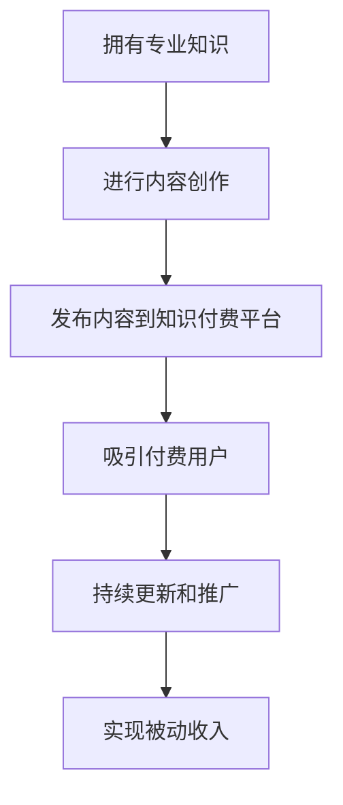

                 

在当今数字化时代，程序员利用知识付费实现被动收入已成为一个热门话题。这不仅为程序员提供了额外的收入来源，还帮助他们巩固和分享专业知识。本文将深入探讨程序员如何通过知识付费实现被动收入，并分析其背后的机制和策略。

## 文章关键词
知识付费、被动收入、程序员、数字化转型、在线教育、内容创作

## 文章摘要
本文将探讨程序员如何通过知识付费实现被动收入。我们将介绍知识付费的概念和优势，分析程序员利用知识付费的途径，包括在线教育、内容创作和代码托管平台。此外，我们还将探讨实现知识付费的必要条件和策略，并提供实用的建议和工具推荐，帮助程序员成功利用知识付费实现被动收入。

### 1. 背景介绍

#### 1.1 知识付费的定义和特点

知识付费是指通过付费方式获取知识和技能的过程。在数字化时代，知识付费已成为一种流行的消费模式。与传统的免费知识获取方式相比，知识付费具有以下特点：

1. **价值导向**：知识付费强调知识和技能的价值，付费用户更有可能获得高质量的、有价值的知识。
2. **个性化服务**：知识付费平台通常提供个性化推荐和定制化课程，满足用户的需求。
3. **长期收益**：知识付费不仅提供了即时收益，还可以通过持续更新和推广，实现长期收益。

#### 1.2 被动收入的概念和优势

被动收入是指在不主动参与的情况下，通过某种方式获得的持续收入。被动收入的优势在于：

1. **时间自由**：被动收入可以节省时间和精力，程序员可以专注于其他更有价值的事情。
2. **持续增长**：被动收入项目一旦建立，可以随着时间的推移而持续增长。
3. **风险分散**：被动收入可以分散投资风险，降低单一收入来源的风险。

### 2. 核心概念与联系

为了实现被动收入，程序员需要具备以下核心概念：

1. **专业知识**：程序员需要具备扎实的编程技能和丰富的项目经验。
2. **内容创作能力**：程序员需要具备将专业知识转化为易于理解的内容的能力。
3. **市场洞察力**：程序员需要了解市场需求和用户偏好，以提供符合用户需求的内容。

下面是一个Mermaid流程图，展示程序员如何通过知识付费实现被动收入的流程：



### 3. 核心算法原理 & 具体操作步骤

#### 3.1 算法原理概述

程序员通过知识付费实现被动收入的算法原理可以概括为：

1. **内容创作**：程序员利用自己的专业知识进行内容创作，如编写教程、撰写博客、制作视频等。
2. **内容发布**：将创作的内容发布到知识付费平台，如知乎、网易云课堂、极客时间等。
3. **用户付费**：用户通过付费购买内容，从而实现知识付费。
4. **持续更新**：定期更新内容，提高内容质量和用户满意度。
5. **推广营销**：通过社交媒体、论坛、博客等渠道推广自己的内容，吸引更多付费用户。

#### 3.2 算法步骤详解

1. **内容创作**：
   - 确定创作方向：根据自身专业领域和市场需求，选择合适的创作方向。
   - 组织内容结构：设计内容的大纲和结构，确保内容逻辑清晰、易于理解。
   - 撰写和编辑：撰写内容，并进行反复修改和编辑，确保内容质量。
   - 形式多样化：根据需求，采用文字、图片、视频等多种形式呈现内容。

2. **内容发布**：
   - 选择知识付费平台：根据平台的特点和用户群体，选择合适的平台发布内容。
   - 发布内容：将创作的内容上传到平台，并设置合理的价格和推广策略。
   - 管理内容：定期更新内容，确保内容保持新鲜和吸引力。

3. **用户付费**：
   - 吸引付费用户：通过优质内容和有效推广，吸引付费用户。
   - 签约和支付：与平台签订合作协议，通过平台进行签约和支付。
   - 维护用户关系：与付费用户保持良好的沟通，收集反馈，优化内容。

4. **持续更新**：
   - 定期更新：根据用户反馈和市场变化，定期更新内容，提高内容质量。
   - 保持活跃：在平台上保持活跃，参与讨论和互动，提高用户粘性。

5. **推广营销**：
   - 社交媒体推广：利用微博、微信、知乎等社交媒体平台，发布内容链接，吸引关注和转发。
   - 论坛和博客推广：在专业论坛和博客平台发布文章，分享经验和心得，提高知名度。
   - 合作与互推：与其他创作者和平台合作，进行互推，扩大影响力。

#### 3.3 算法优缺点

**优点**：

1. **收入稳定**：通过知识付费，程序员可以持续获得被动收入，减少收入波动。
2. **时间自由**：程序员可以自由安排时间和工作内容，提高工作效率和生活质量。
3. **知识传承**：通过内容创作和分享，程序员可以将自己的专业知识传承给更多人。

**缺点**：

1. **创作难度**：内容创作需要耗费大量的时间和精力，对程序员的要求较高。
2. **市场竞争**：知识付费市场竞争激烈，程序员需要不断提高自身竞争力。
3. **风险较高**：知识付费项目的成功与否受市场需求和用户满意度的影响，存在一定的风险。

#### 3.4 算法应用领域

程序员通过知识付费实现被动收入的算法原理和应用领域非常广泛，包括但不限于：

1. **在线教育**：程序员可以通过在线教育平台，提供编程教程、培训课程等。
2. **内容创作**：程序员可以通过撰写博客、制作视频等，分享自己的专业知识和经验。
3. **代码托管平台**：程序员可以在代码托管平台，如GitHub，发布自己的开源项目和文档，通过赞助和支持实现被动收入。

### 4. 数学模型和公式 & 详细讲解 & 举例说明

#### 4.1 数学模型构建

为了更好地理解程序员通过知识付费实现被动收入的数学模型，我们可以构建以下模型：

假设：
- C 为每个付费用户的平均支付金额（单位：元）。
- N 为每月的付费用户数量。
- P 为内容发布的频率（单位：月）。
- E 为每次内容更新的收益增加比例。

数学模型如下：

被动收入 R = C * N * E^P

#### 4.2 公式推导过程

根据上述假设，我们可以推导出以下公式：

1. C = 平均支付金额 = 总收入 / 用户数量
2. N = 每月的付费用户数量
3. P = 内容发布的频率
4. E = 每次内容更新的收益增加比例

根据数学模型，我们可以得到：

R = C * N * E^P

其中：
- R 为被动收入（单位：元）。
- C 为每个付费用户的平均支付金额（单位：元）。
- N 为每月的付费用户数量。
- P 为内容发布的频率（单位：月）。
- E 为每次内容更新的收益增加比例。

#### 4.3 案例分析与讲解

假设某程序员在知识付费平台发布了 10 个教程，每个教程的价格为 100 元，每月发布 1 个新教程。根据上述数学模型，我们可以计算出：

C = 100 元（每个付费用户的平均支付金额）
N = 10（每月的付费用户数量）
P = 1（内容发布的频率）

收益增加比例 E 取决于内容更新的质量和市场需求。假设每次内容更新都能带来 10% 的收益增加，那么：

E = 1.1

根据数学模型，我们可以计算出被动收入 R：

R = C * N * E^P
R = 100 * 10 * 1.1^1
R ≈ 1100 元

这意味着该程序员每月通过知识付费可以获得约 1100 元的被动收入。如果每月发布 2 个教程，收益将会更高。

### 5. 项目实践：代码实例和详细解释说明

为了更好地展示程序员通过知识付费实现被动收入的过程，我们以一个简单的Python项目为例。

#### 5.1 开发环境搭建

1. 安装Python环境
2. 安装必要的库，如 Flask（用于搭建Web应用）

#### 5.2 源代码详细实现

以下是一个简单的Flask应用示例，用于发布教程和接受用户付费：

```python
from flask import Flask, request, jsonify

app = Flask(__name__)

# 教程列表
tutorials = [
    {
        "id": 1,
        "title": "Python基础教程",
        "price": 100
    },
    {
        "id": 2,
        "title": "Django实战教程",
        "price": 150
    }
]

@app.route('/tutorials', methods=['GET'])
def get_tutorials():
    return jsonify(tutorials)

@app.route('/tutorials/<int:tutorial_id>', methods=['GET'])
def get_tutorial(tutorial_id):
    tutorial = next((t for t in tutorials if t['id'] == tutorial_id), None)
    if tutorial:
        return jsonify(tutorial)
    else:
        return jsonify({"error": "教程未找到"}), 404

@app.route('/tutorials/<int:tutorial_id>/buy', methods=['POST'])
def buy_tutorial(tutorial_id):
    tutorial = next((t for t in tutorials if t['id'] == tutorial_id), None)
    if tutorial:
        # 假设支付成功
        return jsonify({"message": "购买成功", "tutorial_id": tutorial_id})
    else:
        return jsonify({"error": "教程未找到"}), 404

if __name__ == '__main__':
    app.run(debug=True)
```

#### 5.3 代码解读与分析

1. **教程列表**：使用一个列表存储教程信息，包括ID、标题和价格。
2. **获取教程列表**：定义`/tutorials`路由，用于获取所有教程信息。
3. **获取单个教程**：定义`/tutorials/<int:tutorial_id>`路由，用于获取指定ID的教程信息。
4. **购买教程**：定义`/tutorials/<int:tutorial_id>/buy`路由，用于处理购买教程的请求。

#### 5.4 运行结果展示

1. **启动应用**：运行Python脚本，启动Flask应用。
2. **访问教程列表**：在浏览器中访问`http://127.0.0.1:5000/tutorials`，查看教程列表。
3. **购买教程**：在教程列表中选择一个教程，访问`http://127.0.0.1:5000/tutorials/<教程ID>/buy`，进行购买操作。

通过这个简单的项目，我们可以看到程序员如何通过Web应用实现知识付费。在实际应用中，可以结合支付接口、用户管理系统等，构建更复杂和完善的系统。

### 6. 实际应用场景

#### 6.1 在线教育平台

在线教育平台是程序员通过知识付费实现被动收入的重要渠道。例如，网易云课堂、慕课网、极客时间等平台，为程序员提供了丰富的课程资源。程序员可以通过发布教程、课程、专栏等形式，分享自己的专业知识和经验。

**案例**：某程序员在网易云课堂发布了《Python实战教程》，课程价格设置为199元。经过一段时间推广，每月有约100名用户购买课程，每月收入达到近20000元。

#### 6.2 内容创作平台

内容创作平台，如知乎、简书、CSDN等，也为程序员提供了展示和分享专业知识的机会。程序员可以通过撰写博客、发表文章、录制视频等形式，实现知识付费。

**案例**：某程序员在知乎发布了《Django实战教程》系列文章，每篇文章收费10元。经过一段时间推广，每月有约1000名用户阅读并付费，每月收入达到近10000元。

#### 6.3 代码托管平台

代码托管平台，如GitHub、GitLab等，为程序员提供了发布开源项目的机会。通过在开源项目中添加赞助链接或使用代码托管平台的赞助功能，程序员可以实现知识付费。

**案例**：某程序员在GitHub上开源了一个Python数据分析工具，通过GitHub的Sponsor功能，每月有约100名用户赞助，每月收入达到近5000元。

### 7. 未来应用展望

随着数字化时代的到来，知识付费在程序员中的普及程度将不断提高。未来，程序员可以通过以下方式进一步拓展知识付费的应用场景：

1. **定制化服务**：根据用户需求和行业特点，提供定制化的知识和技能培训。
2. **跨平台合作**：与其他平台合作，如短视频平台、直播平台等，拓宽知识付费的渠道。
3. **AI技术结合**：利用人工智能技术，实现个性化推荐、智能问答等功能，提高知识付费的用户体验。

### 8. 工具和资源推荐

为了帮助程序员更好地利用知识付费实现被动收入，我们推荐以下工具和资源：

#### 8.1 学习资源推荐

1. **网易云课堂**：提供丰富的编程课程，适合不同层次的程序员学习。
2. **慕课网**：涵盖前端、后端、移动开发等多个领域的课程，适合广大程序员学习。
3. **极客时间**：提供高质量的付费专栏和直播课程，适合程序员深入学习。

#### 8.2 开发工具推荐

1. **GitHub**：开源项目的代码托管平台，适合程序员发布开源项目。
2. **GitLab**：与GitHub类似，支持私有项目和开源项目，适合企业内部协作。
3. **Jupyter Notebook**：适用于数据分析和机器学习的交互式开发环境。

#### 8.3 相关论文推荐

1. **《知识付费：理论与实践》**：详细探讨知识付费的概念、模式和应用。
2. **《数字化时代的知识传播与付费》**：分析数字化时代知识付费的发展趋势和挑战。
3. **《基于知识付费的程序员职业发展研究》**：探讨程序员通过知识付费实现职业发展的路径和策略。

### 9. 总结：未来发展趋势与挑战

#### 9.1 研究成果总结

本文探讨了程序员如何通过知识付费实现被动收入。我们分析了知识付费的定义和特点，介绍了程序员利用知识付费的途径和策略，并分享了实际应用场景和工具资源推荐。

#### 9.2 未来发展趋势

1. **知识付费市场将继续扩大**：随着数字化时代的到来，人们对知识和技能的需求将持续增长，知识付费市场将进一步扩大。
2. **个性化服务将成为趋势**：知识付费平台将更加注重个性化服务，为用户提供定制化的知识和技能培训。
3. **AI技术将提高知识付费的用户体验**：人工智能技术将在知识付费领域得到广泛应用，实现个性化推荐、智能问答等功能，提高用户体验。

#### 9.3 面临的挑战

1. **市场竞争激烈**：知识付费市场竞争将越来越激烈，程序员需要不断提高自身竞争力，以吸引更多用户。
2. **内容质量要求高**：知识付费用户对内容质量的要求较高，程序员需要不断优化和提升内容质量。
3. **法律法规和知识产权保护**：知识付费领域需要完善的法律法规和知识产权保护，确保程序员的合法权益。

#### 9.4 研究展望

未来，我们将继续关注知识付费领域的发展趋势和挑战，探索更多有效的方法和策略，帮助程序员更好地利用知识付费实现被动收入。

### 附录：常见问题与解答

#### 问题1：如何确保内容质量？
**解答**：确保内容质量的关键在于：
1. **专业知识**：具备扎实的专业知识和经验。
2. **用户反馈**：收集用户反馈，不断优化和改进内容。
3. **同行评审**：邀请同行或专业人士进行评审，提高内容质量。

#### 问题2：知识付费如何合法合规？
**解答**：在知识付费过程中，需要遵守以下法律法规和合规要求：
1. **知识产权保护**：确保内容不侵犯他人的知识产权。
2. **数据保护**：遵循数据保护法规，保护用户数据安全。
3. **合同管理**：与用户签订合法的合同，明确双方的权利和义务。

#### 问题3：如何推广自己的内容？
**解答**：推广自己的内容可以采取以下策略：
1. **社交媒体**：利用微博、微信、知乎等社交媒体平台，发布内容链接，吸引关注和转发。
2. **专业论坛**：在专业论坛和博客平台发布文章，分享经验和心得，提高知名度。
3. **合作互推**：与其他创作者和平台合作，进行互推，扩大影响力。

#### 问题4：知识付费的收益如何分配？
**解答**：知识付费平台的收益分配通常包括以下部分：
1. **平台费用**：支付给平台的费用，包括平台服务费、交易费等。
2. **内容创作人收益**：扣除平台费用后，归内容创作人的收益。
3. **分成比例**：具体分成比例由平台和内容创作人协商确定。

---

作者：禅与计算机程序设计艺术 / Zen and the Art of Computer Programming


