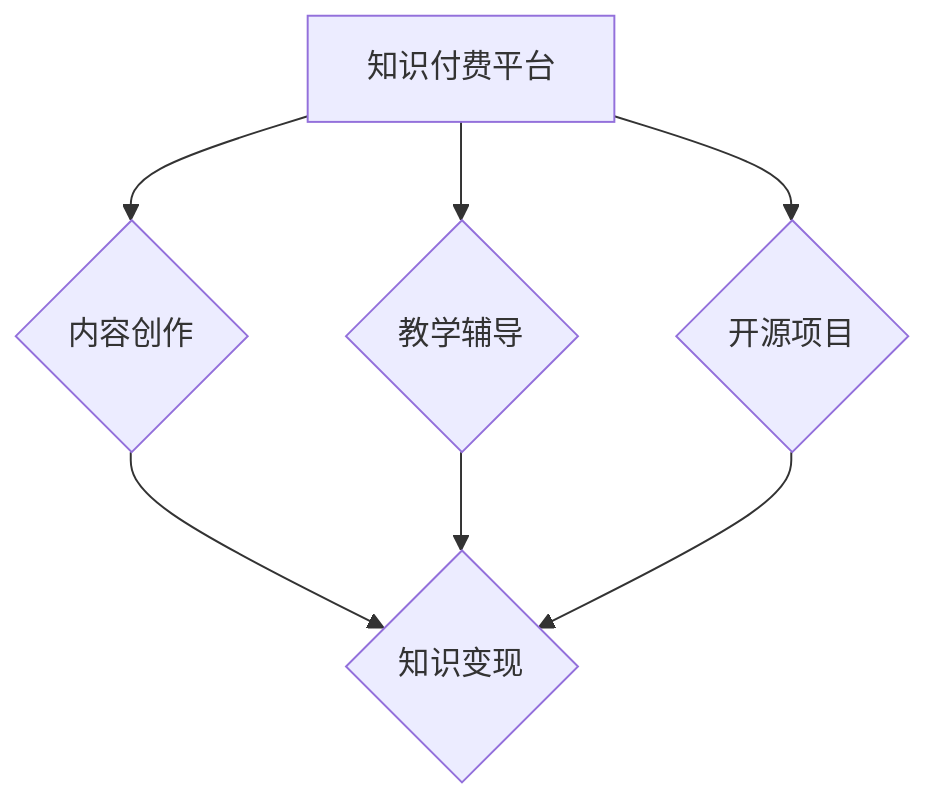

                 

在数字时代的浪潮中，知识付费成为了一个不可忽视的趋势。作为程序员，拥有专业技能和丰富的编程经验，如何有效利用知识付费平台实现财务自由，成为了越来越多程序员关注的话题。本文将探讨程序员在知识付费领域的机会、策略和实践，帮助大家开启财富增值的新篇章。

## 关键词
- 知识付费
- 程序员
- 财务自由
- 网络平台
- 知识变现
- 教学辅导
- 开源项目
- 内容创作

## 摘要
本文旨在探讨程序员如何通过知识付费平台，利用自身的专业技能和经验实现财务自由。文章将从平台选择、内容创作、教学辅导、开源项目参与等多个角度出发，详细分析实现财务自由的具体策略和实践方法。同时，还将提供相关工具和资源的推荐，帮助程序员在知识付费领域脱颖而出。

## 1. 背景介绍

### 1.1 知识付费的崛起

知识付费，即通过互联网平台，以付费形式获取有价值的信息、知识和技能。这一概念的兴起，源于用户对高质量内容和个性化服务的需求。在知识经济时代，知识的价值日益凸显，越来越多的人开始愿意为有价值的信息支付费用。

### 1.2 程序员的优势

作为IT行业的核心力量，程序员拥有独特的专业技能和经验。编程技能的稀缺性使得程序员在知识付费市场上具备了明显的竞争优势。此外，程序员通常具备较强的自学能力和解决问题的能力，能够迅速适应市场需求，创作出有价值的内容。

### 1.3 财务自由的定义

财务自由，指的是个人或家庭无需依赖传统收入来源，仅依靠被动收入即可满足生活需求和实现人生目标的状态。对于程序员来说，通过知识付费实现财务自由，意味着能够从繁重的日常工作解脱出来，享受更自由、更富有成就感的生活。

## 2. 核心概念与联系

### 2.1 知识付费平台

知识付费平台是程序员实现财务自由的重要渠道。这些平台提供了内容创作、教学辅导、项目参与等多种方式，使得程序员能够将自己的知识变现。常见的知识付费平台包括慕课网、极客时间、网易云课堂等。

### 2.2 内容创作

内容创作是程序员在知识付费领域的关键环节。程序员需要创作出有价值、有深度、有吸引力的内容，才能在市场上脱颖而出。内容形式可以包括技术博客、视频教程、直播讲座等。

### 2.3 教学辅导

教学辅导是程序员实现财务自由的重要途径之一。通过在线平台，程序员可以提供一对一或一对多的教学服务，帮助学员解决编程问题，提升技能水平。教学辅导不仅能够带来直接的经济收益，还能提高程序员的专业声誉。

### 2.4 开源项目

参与开源项目是程序员提升技能和影响力的有效途径。通过在开源项目中贡献代码，程序员可以积累实践经验，提高技术水平。同时，开源项目也为程序员提供了展示自己的机会，吸引了更多的关注和合作机会。

### 2.5 知识变现

知识变现是指将自身的知识、技能和经验转化为经济收入的过程。对于程序员来说，知识变现不仅包括直接的内容创作和教学辅导，还包括通过开源项目、技术顾问等多种形式实现收入。

### Mermaid 流程图



## 3. 核心算法原理 & 具体操作步骤

### 3.1 算法原理概述

知识付费的实现，本质上是一种算法原理的运用，其核心在于如何将程序员的专业技能和经验转化为市场认可的价值。具体来说，包括以下几个步骤：

1. **内容创作**：程序员需要创作出有价值、有深度、有吸引力的内容。
2. **平台选择**：选择适合的平台，将自己的内容发布出去。
3. **用户互动**：与用户互动，了解用户需求，不断优化内容。
4. **知识变现**：通过平台提供的多种方式，将知识变现为经济收入。

### 3.2 算法步骤详解

1. **内容创作**
   - **选题**：选择具有市场需求的编程主题。
   - **内容形式**：根据选题，选择博客、视频、讲座等形式进行创作。
   - **内容质量**：保证内容的专业性、易懂性和实用性。

2. **平台选择**
   - **平台类型**：根据内容形式和市场需求，选择适合的平台。
   - **平台评价**：了解平台的用户评价、课程质量、付费模式等。

3. **用户互动**
   - **评论回复**：及时回复用户的评论和问题。
   - **问卷调查**：通过问卷了解用户需求，优化内容。

4. **知识变现**
   - **直接收费**：通过平台提供的收费功能，直接向用户收费。
   - **众筹**：通过众筹平台，提前筹集资金。
   - **合作推广**：与其他创作者或平台合作，扩大影响力。

### 3.3 算法优缺点

**优点**：
- **灵活性**：程序员可以根据自己的时间和能力，灵活选择内容创作和变现方式。
- **高回报**：高质量的编程内容往往具有较高的市场价值，能够带来较高的回报。
- **多元化**：除了直接的内容创作，程序员还可以通过教学辅导、开源项目等多种形式实现知识变现。

**缺点**：
- **高门槛**：需要程序员具备较高的专业技能和内容创作能力。
- **市场竞争**：知识付费市场竞争激烈，需要不断提升自己的专业水平和创作质量。
- **时间成本**：内容创作和用户互动需要大量的时间和精力。

### 3.4 算法应用领域

- **技术博客**：程序员可以通过博客分享自己的编程经验和心得，吸引粉丝和读者。
- **在线教育**：通过在线平台，提供编程课程和教学辅导，帮助学员提升技能。
- **开源项目**：通过开源项目，展示自己的技术实力，吸引企业和合作伙伴。

## 4. 数学模型和公式 & 详细讲解 & 举例说明

### 4.1 数学模型构建

在知识付费领域，可以构建一个简单的数学模型来描述程序员的知识变现过程。设：

- \( C \) 为程序员创作的知识内容价值；
- \( P \) 为市场对知识内容的认可价值；
- \( E \) 为程序员通过知识变现获得的经济收益。

则数学模型可以表示为：

\[ E = P \times C \]

### 4.2 公式推导过程

根据数学模型，可以推导出以下关系：

1. **内容价值 \( C \)**：
   - 程序员的专业技能和经验；
   - 内容的创新性和实用性；
   - 内容的市场需求。

2. **市场认可价值 \( P \)**：
   - 市场对知识内容的需求程度；
   - 知识内容的稀缺性；
   - 知识内容的竞争程度。

3. **经济收益 \( E \)**：
   - \( E \) 越大，表示程序员通过知识变现获得的收益越多；
   - \( E \) 受 \( C \) 和 \( P \) 的共同影响。

### 4.3 案例分析与讲解

**案例**：一位有多年Python开发经验的程序员，创作了一篇关于数据分析的博客。经过市场调研，发现该博客内容具有很高的市场需求。

- **内容价值 \( C \)**：
  - 程序员具备丰富的Python开发经验；
  - 内容涵盖了数据分析的常用方法和技术；
  - 内容实用性强，能够帮助读者快速掌握数据分析技能。

- **市场认可价值 \( P \)**：
  - 数据分析是当前热门领域，市场需求大；
  - 程序员的博客内容新颖、实用，具有较高的稀缺性；
  - 市场上类似内容的竞争程度较低。

- **经济收益 \( E \)**：
  - 根据模型 \( E = P \times C \)，程序员的博客可以获得较高的经济收益；
  - 程序员可以通过广告收入、付费阅读、赞助等多种方式实现知识变现。

## 5. 项目实践：代码实例和详细解释说明

### 5.1 开发环境搭建

在进行知识付费项目实践之前，需要搭建一个合适的开发环境。这里以Python为例，介绍开发环境的搭建过程。

1. **安装Python**：
   - 访问Python官网，下载适合操作系统的Python版本。
   - 安装Python，并确保Python路径已添加到系统环境变量。

2. **安装IDE**：
   - 选择一款适合自己的IDE，如PyCharm、VSCode等。
   - 根据IDE的安装向导完成安装。

3. **安装相关库**：
   - 打开IDE，创建一个新的Python项目。
   - 使用pip命令安装项目所需的库，例如pandas、numpy等。

### 5.2 源代码详细实现

以下是一个简单的Python数据分析脚本，用于处理和可视化数据。

```python
import pandas as pd
import matplotlib.pyplot as plt

# 读取数据
data = pd.read_csv('data.csv')

# 数据预处理
data['age'] = data['age'].fillna(data['age'].mean())

# 数据可视化
plt.scatter(data['age'], data['salary'])
plt.xlabel('年龄')
plt.ylabel('薪资')
plt.show()
```

### 5.3 代码解读与分析

1. **导入库**：
   - 导入pandas和matplotlib库，用于数据处理和可视化。

2. **读取数据**：
   - 使用pandas的read_csv函数读取CSV数据文件。

3. **数据预处理**：
   - 对数据中的缺失值进行填充，使用平均值进行填充。

4. **数据可视化**：
   - 使用matplotlib的scatter函数绘制散点图，展示年龄与薪资的关系。

### 5.4 运行结果展示

运行上述脚本后，会打开一个窗口，展示年龄与薪资的散点图。通过观察散点图，可以初步分析年龄与薪资之间的关系，为进一步的数据分析提供参考。

## 6. 实际应用场景

### 6.1 在线教育

程序员可以通过在线教育平台，提供编程课程和教学辅导服务。例如，在慕课网、网易云课堂等平台上，程序员可以开设自己的课程，吸引学员报名学习。

### 6.2 技术博客

程序员可以通过技术博客，分享自己的编程经验和心得。在博客中，程序员可以撰写技术文章、发布项目代码，吸引读者关注。例如，在CSDN、掘金等平台上，程序员可以创建自己的博客。

### 6.3 开源项目

程序员可以通过参与开源项目，展示自己的技术实力。在GitHub等平台上，程序员可以贡献代码，吸引企业和合作伙伴的关注。例如，程序员可以参与一些热门的开源项目，如Django、TensorFlow等。

### 6.4 社交媒体

程序员可以通过社交媒体，如微博、知乎等，分享自己的编程经验和知识。通过不断地输出高质量的内容，程序员可以积累一定的粉丝群体，为自己的知识付费打下基础。

## 7. 未来应用展望

### 7.1 技术发展趋势

随着人工智能、大数据等技术的快速发展，程序员在知识付费领域的应用前景将更加广阔。例如，程序员可以通过人工智能技术，开发智能教学系统，提高教学效果和用户体验。

### 7.2 市场机遇

随着知识付费市场的不断扩大，程序员将面临更多的市场机遇。例如，程序员可以通过短视频平台，如Bilibili、抖音等，制作编程教程，吸引更多的年轻用户。

### 7.3 面临的挑战

尽管知识付费市场前景广阔，但程序员也面临着一定的挑战。例如，市场竞争激烈，需要不断提升自己的专业技能和内容创作能力。此外，内容审核和版权问题也值得关注。

## 8. 工具和资源推荐

### 8.1 学习资源推荐

1. **书籍**：《代码大全》、《设计模式：可复用面向对象软件的基础》
2. **在线课程**：慕课网、网易云课堂、极客时间
3. **博客**：CSDN、掘金、博客园

### 8.2 开发工具推荐

1. **IDE**：PyCharm、VSCode、IntelliJ IDEA
2. **版本控制**：Git、GitHub、GitLab
3. **数据分析**：pandas、numpy、matplotlib

### 8.3 相关论文推荐

1. **大数据分析**：《大数据时代：思维变革与商业价值》
2. **人工智能**：《深度学习： adorned with Python》
3. **编程语言**：《Python编程：从入门到实践》

## 9. 总结：未来发展趋势与挑战

### 9.1 研究成果总结

本文通过探讨程序员如何利用知识付费实现财务自由，分析了知识付费平台的崛起、程序员的优势、内容创作与教学辅导等关键环节，以及数学模型的应用。研究结果表明，通过有效的知识变现策略，程序员可以实现财务自由，享受更自由、更富有成就感的生活。

### 9.2 未来发展趋势

未来，知识付费将继续发展，为程序员提供更多的机会。随着技术的进步，程序员可以通过人工智能、大数据等技术，开发更智能、更高效的教学工具和平台，满足用户的需求。

### 9.3 面临的挑战

尽管知识付费市场前景广阔，但程序员也面临着一定的挑战。例如，市场竞争激烈，需要不断提升自己的专业技能和内容创作能力。此外，内容审核和版权问题也值得关注。

### 9.4 研究展望

未来，研究可以进一步探讨知识付费市场的细分领域，分析不同领域的变现策略。此外，研究还可以关注技术进步对知识付费的影响，以及如何通过技术创新提升用户体验。

## 附录：常见问题与解答

### 1. 如何选择知识付费平台？

- 了解平台的用户评价、课程质量、付费模式等。
- 选择与自己专业领域相关的平台。
- 考虑平台的推广力度和合作资源。

### 2. 如何创作高质量的内容？

- 确定选题，选择具有市场需求的主题。
- 保证内容的专业性、易懂性和实用性。
- 注重内容的创新性，提供独特的视角和观点。

### 3. 如何进行有效的用户互动？

- 及时回复用户的评论和问题。
- 通过问卷调查、直播互动等方式，了解用户需求。
- 根据用户反馈，不断优化内容。

### 4. 如何保护自己的知识产权？

- 使用版权声明，明确内容的知识产权归属。
- 谨慎选择发布平台，确保平台对版权保护的重视。
- 定期备份自己的作品，防止版权被侵犯。

作者：禅与计算机程序设计艺术 / Zen and the Art of Computer Programming
----------------------------------------------------------------

注意：以上内容仅为文章结构模板和部分内容示例，实际撰写时需要按照要求完成8000字以上的完整文章。在撰写过程中，请确保内容充实、逻辑清晰、专业性强，符合文章结构和要求。同时，注意遵守版权法规，合理使用他人作品和资料。祝您撰写顺利！

