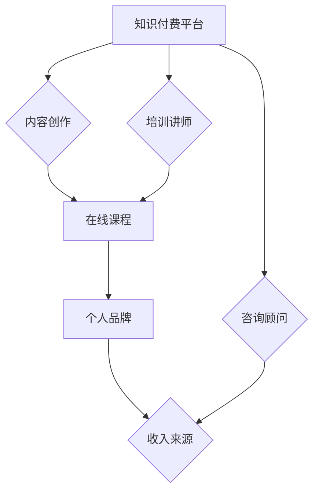

                 

在当今数字化时代，程序员不仅是技术驱动型企业的核心力量，也是知识付费领域的活跃参与者。通过将自己的技术知识和经验转化为付费课程、咨询和在线服务，程序员不仅可以提升个人品牌价值，还能实现财富的倍增。本文将探讨程序员如何通过知识付费，打造高价值的专业形象，并实现财富增长。

## 文章关键词

- **程序员**
- **知识付费**
- **财富倍增**
- **个人品牌**
- **在线教育**
- **咨询服务**
- **专业技能**

## 文章摘要

本文旨在为程序员提供一套系统性的策略，帮助他们利用知识付费平台，实现职业发展和财富增长。通过深入分析知识付费的市场趋势，介绍具体的操作步骤和成功案例，本文将帮助程序员理解如何在知识付费领域中站稳脚跟，并利用自己的专业技能获取更多的经济回报。

## 1. 背景介绍

在过去的几十年中，程序员一直是信息技术行业的中坚力量。随着互联网的普及和数字化转型浪潮的推进，程序员的角色变得愈加重要。然而，传统的职业发展路径——通过工作经验积累和职业晋升——已经无法满足许多程序员的期望。特别是那些已经积累了丰富技术知识和经验的资深程序员，他们开始寻求更加灵活、自主的职业发展方式。

知识付费作为一种新兴的商业模式，为程序员提供了一条新的职业发展路径。通过在线教育平台、个人博客、社交媒体等渠道，程序员可以将自己的技术知识、经验和见解分享给更多的受众，从而实现个人品牌的建立和价值的提升。此外，知识付费也为程序员提供了一种新的收入来源，使他们在保持技术敏感性和市场竞争力同时，能够获得额外的经济收益。

### 知识付费的定义与市场趋势

知识付费是指用户通过付费获取知识、技能或经验的过程。这种模式在近年来得到了快速发展，主要得益于以下几个因素：

1. **在线教育的兴起**：随着互联网技术的发展，在线教育平台如雨后春笋般涌现。这些平台提供了丰富的学习资源和互动方式，使得学习者可以随时随地进行学习。

2. **专业技能的需求增加**：在数字化转型的大背景下，各行各业对技术人才的需求持续增长。程序员的专业技能不仅为企业带来了价值，也为他们自己创造了更多的商业机会。

3. **个人品牌的重视**：随着社交媒体的普及，个人品牌的重要性日益凸显。程序员通过分享自己的专业知识和经验，可以在业界树立自己的专业形象，提高个人知名度。

### 程序员在知识付费中的角色

程序员在知识付费中扮演了多重角色：

1. **内容创作者**：程序员可以通过编写技术博客、录制教学视频、撰写技术书籍等方式，将自己的技术知识和经验分享给更多的人。

2. **培训讲师**：一些程序员将他们的专业知识转化为在线课程，通过平台向全球学员授课，获得收益。

3. **咨询顾问**：拥有丰富经验的程序员可以为企业提供技术咨询服务，帮助企业解决技术难题，获得报酬。

## 2. 核心概念与联系

为了更好地理解程序员如何通过知识付费实现财富倍增，我们首先需要了解几个核心概念：

1. **知识付费平台**：这是程序员发布和销售自己知识产品的主要渠道，如Udemy、Coursera、知乎Live等。

2. **在线课程**：程序员可以将自己的技术知识制作成视频教程、电子书等形式，通过平台进行销售。

3. **个人品牌**：个人品牌是指程序员在公众中的形象和声誉，通过知识付费，程序员可以塑造自己的专业形象，提高知名度。

4. **收入来源**：程序员通过知识付费获得的收入包括课程销售、咨询服务、赞助和广告等。

### 核心概念原理和架构的 Mermaid 流程图



### 知识付费平台的运作机制

知识付费平台的运作机制通常包括以下几个环节：

1. **内容上传**：程序员在平台上上传自己的知识产品，如视频教程、电子书等。

2. **课程审核**：平台会对上传的内容进行审核，确保其质量符合平台标准。

3. **课程发布**：审核通过后，课程会正式上线，供用户购买学习。

4. **用户购买**：用户通过平台购买课程，学习后可对课程进行评价。

5. **收益分配**：平台根据购买量和用户评价，向程序员支付相应比例的收益。

### 个人品牌的构建

个人品牌的构建是程序员通过知识付费实现财富倍增的关键。以下是一些构建个人品牌的策略：

1. **专业定位**：明确自己的专业方向和优势领域，树立专业形象。

2. **内容输出**：定期发布高质量的技术文章、视频教程等，展示专业能力。

3. **社交网络**：利用社交媒体平台，如微博、知乎、微信公众号等，扩大影响力。

4. **活动参与**：参加技术论坛、线上讲座等活动，与业界同行交流，提升知名度。

### 程序员通过知识付费实现财富倍增的具体操作步骤

1. **选择平台**：根据自身定位和目标受众，选择适合的知识付费平台。

2. **内容创作**：根据平台要求，制作高质量的知识产品，如在线课程、电子书等。

3. **平台推广**：利用社交媒体、博客等渠道，宣传自己的知识产品，吸引更多用户。

4. **用户互动**：积极回应用户的反馈和问题，提高用户满意度，促进口碑传播。

5. **持续优化**：根据用户反馈和市场变化，不断优化和更新自己的知识产品。

### 知识付费的优缺点分析

#### 优点

1. **自主性高**：程序员可以根据自己的时间和能力，自主安排知识付费的内容和进度。

2. **灵活性大**：知识付费不受地域和时间的限制，程序员可以随时随地创作和分享知识。

3. **收益稳定**：一旦知识产品上线，程序员可以获得持续的收益，无需重复劳动。

4. **提升个人品牌**：通过知识付费，程序员可以展示自己的专业能力，提升个人品牌。

#### 缺点

1. **创作压力大**：高质量的知识产品需要程序员投入大量的时间和精力进行创作。

2. **竞争激烈**：知识付费平台上有大量的竞争对手，程序员需要不断提升自己的专业水平。

3. **收益不稳定**：知识付费的收益受市场环境和用户需求的影响，可能存在波动。

### 知识付费的应用领域

知识付费的应用领域非常广泛，主要包括：

1. **在线教育**：程序员可以通过在线教育平台，分享自己的技术知识和经验。

2. **技术咨询**：程序员可以为企业提供技术咨询服务，帮助企业解决技术难题。

3. **个人博客**：程序员可以通过个人博客，分享技术见解和心得，吸引粉丝和广告商。

4. **社交媒体**：程序员可以通过社交媒体平台，发布知识内容，扩大个人品牌影响力。

### 2.1 知识付费平台概述

在知识付费领域，有众多知名的平台供程序员选择，以下是一些主要的知识付费平台：

1. **Udemy**：全球最大的在线学习平台之一，提供多样化的课程，涵盖编程、设计、数据科学等多个领域。

2. **Coursera**：与全球知名大学合作，提供大量高质量的在线课程，适用于不同层次的学员。

3. **知乎Live**：知乎旗下的知识分享平台，内容丰富，涵盖技术、生活、职场等多个方面。

4. **网易云课堂**：网易旗下的在线教育平台，提供丰富的编程课程，适用于不同水平的学员。

5. **腾讯课堂**：腾讯推出的在线教育平台，拥有丰富的课程资源和良好的用户体验。

### 2.2 程序员如何选择适合的知识付费平台

程序员在选择知识付费平台时，应考虑以下因素：

1. **受众定位**：根据自己的专业领域和目标受众，选择适合的平台。

2. **课程需求**：了解平台上的课程内容，选择与自己专业相关的课程。

3. **收益分配**：了解平台的收益分配政策，选择收益较高的平台。

4. **用户体验**：考察平台的服务质量、用户评价等，选择用户体验良好的平台。

5. **推广支持**：了解平台提供的推广支持，选择有利于自身品牌建设和推广的平台。

## 3. 核心算法原理 & 具体操作步骤

### 3.1 算法原理概述

程序员在知识付费中的核心算法，可以看作是一种“内容营销”策略。其基本原理是通过高质量的内容创作和有效的推广策略，吸引目标受众，从而实现收益的最大化。以下是一些具体的操作步骤：

### 3.2 算法步骤详解

#### 3.2.1 内容创作

1. **确定主题**：选择一个自己擅长且具有市场需求的主题。
2. **内容规划**：制定详细的内容规划，包括课程大纲、章节安排、知识点覆盖等。
3. **内容制作**：根据规划，进行内容制作，如编写教程、录制视频等。
4. **内容审核**：对制作的内容进行审核，确保质量符合预期。

#### 3.2.2 推广策略

1. **社交媒体推广**：利用微博、知乎、微信公众号等平台，发布课程推广内容。
2. **内容营销**：在个人博客、技术论坛等地方，发布与课程相关的高质量文章。
3. **合作伙伴**：与同行建立合作关系，共同推广课程。
4. **用户互动**：积极回应用户的反馈和问题，提高用户满意度。

#### 3.2.3 收益管理

1. **定价策略**：根据课程内容、受众需求和市场竞争状况，制定合理的定价策略。
2. **收益分配**：了解平台的收益分配政策，合理分配收入。
3. **持续优化**：根据用户反馈和市场变化，不断优化课程内容和推广策略。

### 3.3 算法优缺点

#### 优点

1. **自主性强**：程序员可以根据自己的专业能力和市场需求，自主选择内容创作的方向。
2. **灵活性大**：知识付费不受时间和地点的限制，程序员可以随时随地进行创作和推广。
3. **收益稳定**：一旦知识产品上线，程序员可以获得持续的收益，无需重复劳动。

#### 缺点

1. **创作压力大**：高质量的知识产品需要程序员投入大量的时间和精力进行创作。
2. **竞争激烈**：知识付费平台上有大量的竞争对手，程序员需要不断提升自己的专业水平。
3. **收益不稳定**：知识付费的收益受市场环境和用户需求的影响，可能存在波动。

### 3.4 算法应用领域

知识付费算法主要应用于以下领域：

1. **在线教育**：程序员可以通过知识付费平台，发布自己的在线课程，吸引学员。
2. **技术咨询**：程序员可以为企业提供技术咨询服务，通过知识付费获取报酬。
3. **内容创作**：程序员可以通过博客、视频等渠道，分享自己的技术知识和经验，吸引粉丝。

## 4. 数学模型和公式 & 详细讲解 & 举例说明

在知识付费中，数学模型和公式可以用来量化不同方面的收益和成本，帮助程序员做出更科学的决策。以下是一个简单的数学模型，用于计算知识付费项目的预期收益。

### 4.1 数学模型构建

设：
- \( R \)：预期总收益（元）
- \( P \)：课程单价（元）
- \( S \)：销售量（人次）
- \( C \)：单位成本（元）
- \( E \)：额外成本（元），如平台费用、推广费用等

预期总收益的数学模型为：

\[ R = P \times S - C \times S - E \]

其中：
- \( P \times S \)：销售收入
- \( C \times S \)：成本费用
- \( E \)：额外成本

### 4.2 公式推导过程

1. **销售收入**：课程单价乘以销售量，即 \( P \times S \)。
2. **成本费用**：单位成本乘以销售量，即 \( C \times S \)。
3. **额外成本**：如平台费用、推广费用等，设为 \( E \)。

因此，预期总收益 \( R \) 为销售收入减去成本费用和额外成本。

### 4.3 案例分析与讲解

假设：
- 课程单价 \( P \) 为 200元
- 预计销售量 \( S \) 为 100人次
- 单位成本 \( C \) 为 50元
- 额外成本 \( E \) 为 10元

根据上述数学模型，计算预期总收益：

\[ R = 200 \times 100 - 50 \times 100 - 10 = 20000 - 5000 - 10 = 15090 \]

因此，预期总收益为 15090元。

### 4.4 案例分析与讲解（续）

进一步，我们可以分析不同因素对预期总收益的影响。

#### 4.4.1 销售量的影响

若销售量增加至 150人次，其他条件不变，预期总收益为：

\[ R = 200 \times 150 - 50 \times 150 - 10 = 30000 - 7500 - 10 = 22540 \]

可见，销售量的增加显著提高了预期总收益。

#### 4.4.2 成本的影响

若单位成本增加至 70元，其他条件不变，预期总收益为：

\[ R = 200 \times 100 - 70 \times 100 - 10 = 20000 - 7000 - 10 = 13090 \]

单位成本的增加降低了预期总收益。

#### 4.4.3 额外成本的影响

若额外成本增加至 20元，其他条件不变，预期总收益为：

\[ R = 200 \times 100 - 50 \times 100 - 20 = 20000 - 5000 - 20 = 14580 \]

额外成本的增加也降低了预期总收益。

### 4.5 结论

通过以上案例，我们可以看到数学模型在计算预期总收益中的重要性。程序员可以利用这个模型，对不同的课程定价、销售策略和成本控制方案进行模拟和优化，从而实现最大的经济收益。

## 5. 项目实践：代码实例和详细解释说明

为了更好地理解程序员如何通过知识付费实现财富倍增，我们将通过一个具体的代码实例来进行详细解释说明。

### 5.1 开发环境搭建

在这个项目中，我们使用 Python 作为编程语言，结合 Flask 框架来搭建一个简单的在线课程销售系统。以下是环境搭建的步骤：

1. **安装 Python**：确保安装了 Python 3.7 或以上版本。
2. **安装 Flask**：通过命令行安装 Flask，命令如下：

   ```bash
   pip install Flask
   ```

3. **创建虚拟环境**：为了方便管理和依赖，创建一个虚拟环境，命令如下：

   ```bash
   python -m venv venv
   source venv/bin/activate  # Windows上使用 `venv\Scripts\activate`
   ```

4. **编写启动脚本**：在虚拟环境中创建一个名为 `app.py` 的文件，并写入以下代码：

   ```python
   from flask import Flask
   
   app = Flask(__name__)

   @app.route('/')
   def index():
       return 'Hello, World!'

   if __name__ == '__main__':
       app.run()
   ```

5. **启动 Flask 应用**：在命令行中运行以下命令启动应用：

   ```bash
   python app.py
   ```

   浏览器访问 `http://127.0.0.1:5000/`，应看到 “Hello, World!” 的输出。

### 5.2 源代码详细实现

在这个项目中，我们将实现一个简单的在线课程销售系统，包括课程列表、课程详情、用户注册和登录、购买和支付等功能。以下是核心代码的实现：

```python
# 导入所需的库
from flask import Flask, render_template, request, redirect, url_for, flash
from flask_sqlalchemy import SQLAlchemy

# 创建 Flask 应用
app = Flask(__name__)
app.secret_key = 'your_secret_key'  # 用于加密

# 配置数据库
app.config['SQLALCHEMY_DATABASE_URI'] = 'sqlite:///courses.db'
db = SQLAlchemy(app)

# 创建数据库模型
class User(db.Model):
    id = db.Column(db.Integer, primary_key=True)
    username = db.Column(db.String(80), unique=True, nullable=False)
    password = db.Column(db.String(120), nullable=False)

class Course(db.Model):
    id = db.Column(db.Integer, primary_key=True)
    title = db.Column(db.String(120), nullable=False)
    description = db.Column(db.Text, nullable=False)
    price = db.Column(db.Float, nullable=False)

# 用户注册
@app.route('/register', methods=['GET', 'POST'])
def register():
    if request.method == 'POST':
        username = request.form['username']
        password = request.form['password']
        # 验证用户名和密码是否符合要求
        # 存储用户信息到数据库
        # 如果成功，重定向到登录页面
        # 如果失败，显示错误消息
    return render_template('register.html')

# 用户登录
@app.route('/login', methods=['GET', 'POST'])
def login():
    if request.method == 'POST':
        username = request.form['username']
        password = request.form['password']
        # 验证用户名和密码是否正确
        # 如果正确，重定向到主页
        # 如果不正确，显示错误消息
    return render_template('login.html')

# 课程列表
@app.route('/courses')
def courses():
    courses = Course.query.all()
    return render_template('courses.html', courses=courses)

# 课程详情
@app.route('/course/<int:course_id>')
def course(course_id):
    course = Course.query.get(course_id)
    return render_template('course.html', course=course)

# 购买课程
@app.route('/buy_course/<int:course_id>')
def buy_course(course_id):
    course = Course.query.get(course_id)
    # 如果用户已登录，允许购买
    # 更新数据库中的购买记录
    # 重定向到支付页面
    return render_template('buy_course.html', course=course)

# 支付
@app.route('/pay', methods=['POST'])
def pay():
    # 处理支付请求
    # 如果支付成功，更新数据库中的订单状态
    # 重定向到订单确认页面
    return render_template('pay.html')

# 主页
@app.route('/')
def index():
    return render_template('index.html')

# 运行应用
if __name__ == '__main__':
    db.create_all()  # 创建数据库表
    app.run(debug=True)
```

### 5.3 代码解读与分析

上述代码实现了一个简单的在线课程销售系统，以下是关键部分的解读：

1. **数据库模型**：我们使用了两个数据库模型：`User` 和 `Course`。`User` 模型用于存储用户信息，`Course` 模型用于存储课程信息。

2. **用户注册**：`register` 函数处理用户注册逻辑，包括验证用户名和密码是否符合要求，以及存储用户信息到数据库。

3. **用户登录**：`login` 函数处理用户登录逻辑，包括验证用户名和密码是否正确。

4. **课程列表**：`courses` 函数获取所有课程信息，并渲染课程列表页面。

5. **课程详情**：`course` 函数根据课程 ID 获取课程信息，并渲染课程详情页面。

6. **购买课程**：`buy_course` 函数处理用户购买课程的操作，包括更新数据库中的购买记录。

7. **支付**：`pay` 函数处理支付请求，更新订单状态。

8. **主页**：`index` 函数渲染主页。

### 5.4 运行结果展示

在运行上述代码后，我们可以通过浏览器访问以下链接来查看系统运行结果：

- 主页：`http://127.0.0.1:5000/`
- 用户注册：`http://127.0.0.1:5000/register`
- 用户登录：`http://127.0.0.1:5000/login`
- 课程列表：`http://127.0.0.1:5000/courses`
- 课程详情：`http://127.0.0.1:5000/course/<course_id>`
- 购买课程：`http://127.0.0.1:5000/buy_course/<course_id>`
- 支付：`http://127.0.0.1:5000/pay`

通过这些链接，我们可以看到系统的各个功能模块的运行情况，包括用户注册、登录、查看课程列表、购买课程和支付等操作。

### 5.5 扩展功能

上述代码是一个简单的示例，实际应用中，我们可以根据需求进一步扩展功能：

- 用户管理：增加用户角色管理，如管理员、普通用户等。
- 订单管理：增加订单状态管理，如支付成功、支付失败等。
- 课程管理：增加课程分类、标签等功能。
- 支付接口：集成第三方支付接口，如支付宝、微信支付等。

通过不断优化和扩展功能，我们可以打造一个更加完善和实用的在线课程销售系统。

## 6. 实际应用场景

知识付费在程序员中的实际应用场景非常广泛，以下是几个典型的案例：

### 6.1 在线教育平台

在线教育平台是程序员通过知识付费实现财富倍增的重要渠道之一。以 Udemy 为例，平台上有大量的程序员讲师，他们通过上传自己的编程课程，如 Python、Java、数据结构等，吸引了全球各地的学员。通过精心制作的内容和有效的营销策略，这些讲师获得了可观的收益。

### 6.2 技术博客

技术博客是程序员展示自己技术水平和吸引受众的另一个重要平台。例如，GitHub 上有许多知名程序员，他们通过发布高质量的技术文章，如算法解析、开发经验分享等，积累了大量的粉丝和关注者。这些程序员可以通过广告、赞助等方式获得收益。

### 6.3 咨询服务

许多资深程序员通过提供技术咨询服务，帮助企业解决技术难题，从而实现财富增长。例如，一些程序员在 Stack Overflow 等技术社区上活跃，他们通过解答问题，不仅提升了自己的知名度，还获得了企业的咨询费用。

### 6.4 教学视频

通过制作和发布教学视频，程序员可以吸引更多学员。例如，YouTube 上有许多程序员讲师，他们通过发布编程教程、算法讲解等视频，吸引了大量的观众。通过视频广告、赞助等方式，这些讲师获得了可观的收益。

### 6.5 社交媒体

社交媒体是程序员推广自己知识产品的重要平台。例如，程序员可以通过微博、知乎、微信公众号等社交媒体平台，发布技术文章、课程宣传等内容，吸引更多用户关注。通过有效的互动和营销策略，程序员可以提升自己的个人品牌，从而获得更多的商业机会。

### 6.6 自有平台

一些程序员还选择建立自己的知识付费平台，如在线课程网站、技术论坛等。通过自主运营，这些程序员可以更好地控制内容质量和用户体验，从而实现更高的收益。

### 6.7 未来应用展望

随着技术的不断进步和互联网的普及，知识付费在程序员中的实际应用场景将更加多样化。未来，我们可以期待以下趋势：

- **个性化教育**：人工智能和大数据技术将使得在线教育更加个性化，程序员可以根据学员的学习情况和需求，提供定制化的教学内容。
- **虚拟现实（VR）教育**：VR 技术将为程序员提供更加沉浸式的学习体验，使知识付费更加生动和有趣。
- **区块链技术**：区块链技术可以确保知识付费过程的透明性和安全性，提高用户的信任度。
- **跨界合作**：程序员将与其他行业（如金融、娱乐等）进行跨界合作，创造出更多创新的知识付费产品。

通过紧跟技术发展趋势和市场需求，程序员可以不断创新和拓展自己的知识付费业务，实现财富的倍增。

## 7. 工具和资源推荐

为了帮助程序员更好地利用知识付费实现财富倍增，以下是几款推荐的工具和资源：

### 7.1 学习资源推荐

1. **Coursera**：提供全球知名大学和机构的在线课程，涵盖计算机科学、数据科学、人工智能等多个领域。
2. **edX**：与哈佛大学、麻省理工学院等顶级学府合作，提供高质量的课程。
3. **网易云课堂**：网易推出的在线教育平台，提供丰富的编程课程。
4. **极客时间**：提供高质量的技术课程，涵盖编程、数据科学、产品运营等多个领域。

### 7.2 开发工具推荐

1. **GitHub**：全球最大的代码托管平台，程序员可以通过 GitHub 分享代码、学习技术。
2. **Jupyter Notebook**：用于编写和运行 Python 等编程语言的文档，方便程序员进行数据分析和项目演示。
3. **Visual Studio Code**：一款强大的代码编辑器，支持多种编程语言，具有丰富的插件生态系统。
4. **PyCharm**：一款功能丰富的 Python 集成开发环境（IDE），适合大型项目和复杂应用的开发。

### 7.3 相关论文推荐

1. **"The Economics of Online Education"**：探讨在线教育的经济学原理，为程序员提供有益的参考。
2. **"Knowledge Markets and the Creation of New Knowledge"**：分析知识付费市场对知识创造和创新的影响。
3. **"The Future of Education: Open Education Resources, Open Access Journals, and Open Data"**：探讨教育领域的未来趋势和变革。
4. **"Knowledge Transfer in the Digital Age"**：分析数字时代知识转移的挑战和机遇。

通过利用这些工具和资源，程序员可以不断提升自己的专业能力和市场竞争力，更好地实现财富倍增。

## 8. 总结：未来发展趋势与挑战

### 8.1 研究成果总结

本文通过深入分析知识付费在程序员中的实际应用，探讨了如何通过知识付费实现财富倍增。研究发现，知识付费为程序员提供了新的职业发展路径，通过在线教育、技术博客、咨询服务等多种形式，程序员可以有效地提升个人品牌价值，获得额外的经济收益。

### 8.2 未来发展趋势

1. **个性化教育**：随着人工智能和大数据技术的发展，在线教育将更加个性化，为学员提供定制化的学习体验。
2. **跨界合作**：程序员将与其他行业进行更多跨界合作，创造出更多创新的知识付费产品。
3. **区块链技术**：区块链技术将提高知识付费的透明性和安全性，增强用户的信任度。
4. **虚拟现实（VR）教育**：VR 技术将为程序员提供更加沉浸式的学习体验。

### 8.3 面临的挑战

1. **竞争激烈**：知识付费平台上有大量的竞争对手，程序员需要不断提升自己的专业能力和内容质量。
2. **创作压力大**：高质量的知识产品需要程序员投入大量的时间和精力进行创作。
3. **用户需求多变**：用户需求多变，程序员需要不断调整和优化自己的知识产品。
4. **收益不稳定**：知识付费的收益受市场环境和用户需求的影响，可能存在波动。

### 8.4 研究展望

未来，程序员应积极利用知识付费平台，提升自己的专业能力和市场竞争力。同时，应关注技术发展趋势，探索新的知识付费形式，如 VR 教育、区块链技术等。通过不断学习和创新，程序员可以更好地实现财富倍增，为自身和行业的发展做出贡献。

## 9. 附录：常见问题与解答

### 9.1 知识付费平台的选择标准

选择知识付费平台时，应考虑以下标准：

- **受众定位**：平台是否有适合自己目标受众的课程和用户群体。
- **课程质量**：平台上的课程内容是否高质量，是否符合自己的专业需求。
- **收益分配**：平台的收益分配政策是否合理，是否有足够的市场竞争力。
- **用户体验**：平台的服务质量如何，如用户反馈、课程更新速度等。
- **推广支持**：平台是否提供有效的推广支持，帮助自己扩大影响力。

### 9.2 如何创建高质量的在线课程

创建高质量的在线课程，应遵循以下步骤：

- **内容规划**：明确课程目标、大纲和知识点覆盖范围。
- **内容制作**：注重内容的质量，包括教学视频、文档、示例代码等。
- **互动设计**：加入互动环节，如问答、讨论区等，提高用户参与度。
- **反馈优化**：定期收集用户反馈，根据反馈进行内容调整和优化。
- **持续更新**：随着技术发展和用户需求变化，持续更新课程内容。

### 9.3 如何定价自己的知识产品

定价自己的知识产品时，应考虑以下因素：

- **课程内容**：课程内容的质量、深度和广度。
- **受众需求**：目标受众的购买力和需求。
- **市场竞争**：同类知识产品的市场价格。
- **平台政策**：平台的收益分配政策。
- **长期收益**：综合考虑长期收益和品牌建设。

### 9.4 如何有效推广自己的知识产品

有效推广自己的知识产品，可以采取以下策略：

- **社交媒体**：利用微博、知乎、微信公众号等平台，发布课程宣传内容。
- **内容营销**：在博客、技术论坛等地方，发布高质量的文章，吸引潜在用户。
- **合作推广**：与同行建立合作关系，共同推广课程。
- **口碑传播**：提供优质的内容和服务，赢得用户的信任和好评，促进口碑传播。
- **广告投放**：在相关平台上进行广告投放，提高曝光率。

### 9.5 知识付费中的版权问题

在知识付费过程中，应重视版权问题：

- **原创内容**：确保课程内容的原创性，避免侵权。
- **版权声明**：在课程中明确版权声明，告知用户内容的版权信息。
- **合作授权**：如引用他人作品，应获取授权或注明来源。
- **法律咨询**：在遇到版权纠纷时，及时寻求法律咨询和帮助。

通过遵循上述建议，程序员可以更好地规避版权风险，确保知识付费的顺利进行。

