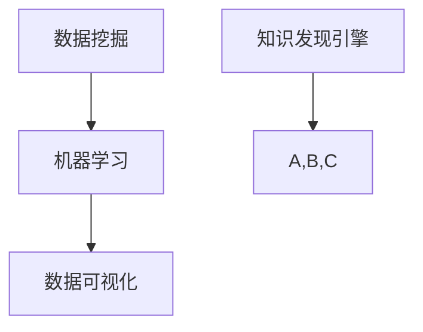
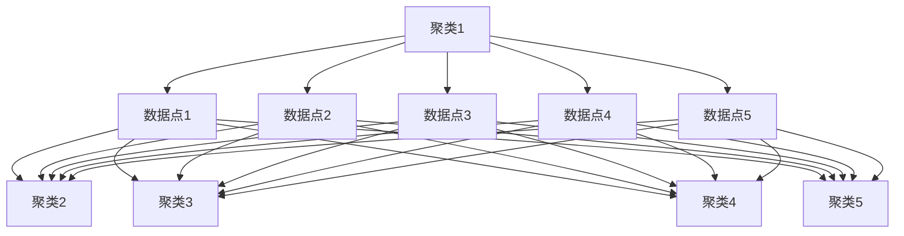

                 

关键词：知识发现引擎、工作效率、算法优化、项目实践、数学模型、工具推荐

> 摘要：本文旨在探讨知识发现引擎在提高程序员工作效能方面的应用。通过分析知识发现引擎的核心概念、算法原理、数学模型以及实际应用场景，结合项目实践和工具推荐，帮助程序员更高效地解决问题和完成项目。

## 1. 背景介绍

在信息化时代，数据已经成为企业发展的核心资产。随着数据的爆炸性增长，如何从海量数据中提取有价值的信息成为众多企业面临的挑战。知识发现引擎（Knowledge Discovery Engine，简称KDE）作为一种新兴的技术，旨在自动地从大量数据中发现潜在的模式、关联和规律，为企业和程序员提供强大的数据支持。

知识发现引擎在各个行业领域有着广泛的应用，如金融风控、医疗诊断、市场营销等。对于程序员而言，知识发现引擎不仅可以提高数据处理和分析的效率，还可以帮助他们在开发过程中实现更智能化的编程。

本文将从以下几个方面展开讨论：

1. 核心概念与联系
2. 核心算法原理与具体操作步骤
3. 数学模型和公式
4. 项目实践：代码实例与详细解释
5. 实际应用场景
6. 未来应用展望
7. 工具和资源推荐
8. 总结：未来发展趋势与挑战

## 2. 核心概念与联系

知识发现引擎的核心概念包括数据挖掘、机器学习、数据可视化等。下面我们将使用Mermaid流程图（没有括号、逗号等特殊字符）来展示这些概念之间的联系。



### 2.1 数据挖掘

数据挖掘（Data Mining）是指从大量数据中提取有价值的信息和知识的过程。它通常包括以下步骤：

- 数据清洗：去除重复、错误、不完整的数据。
- 数据集成：将来自不同源的数据进行整合。
- 数据简化：通过降维、聚合等方法减少数据规模。
- 特征提取：从原始数据中提取能够代表数据特征的属性。
- 模型构建：利用统计学、机器学习等方法建立数据模型。
- 模型评估：评估模型的性能和泛化能力。

### 2.2 机器学习

机器学习（Machine Learning）是一种通过算法让计算机从数据中学习规律、模式的方法。它主要包括以下类型：

- 监督学习：通过已标记的数据进行学习，如分类和回归。
- 无监督学习：通过未标记的数据进行学习，如聚类和降维。
- 强化学习：通过与环境的交互进行学习，如游戏、自动驾驶等。

### 2.3 数据可视化

数据可视化（Data Visualization）是将数据转化为图形、图像、图表等形式，以便更直观地展示数据内容和规律。它有助于程序员快速理解和分析数据，发现潜在的问题和机会。

## 3. 核心算法原理与具体操作步骤

知识发现引擎的核心算法包括关联规则挖掘、聚类分析、分类算法等。下面我们将介绍这些算法的原理和操作步骤。

### 3.1 关联规则挖掘

关联规则挖掘（Association Rule Learning）是一种用于发现数据集中项集之间关联关系的方法。它主要通过支持度和置信度两个指标来评估规则的重要性。

- 支持度（Support）：表示某个规则在数据集中出现的频率。
- 置信度（Confidence）：表示某个规则前件成立时后件也成立的概率。

关联规则挖掘的操作步骤：

1. 数据预处理：将数据划分为事务，并对事务进行编码。
2. 生成频繁项集：找出满足最小支持度的项集。
3. 生成关联规则：从频繁项集中生成关联规则。
4. 规则评估：计算规则的支持度和置信度。
5. 生成结果：输出重要的关联规则。

### 3.2 聚类分析

聚类分析（Clustering）是一种将数据集划分为若干个类别的方法，使得同一类别中的数据点彼此相似，不同类别中的数据点相互区别。常见的聚类算法有K-means、层次聚类、DBSCAN等。

K-means算法的操作步骤：

1. 初始化：随机选择K个中心点。
2. 分配：计算每个数据点到各个中心点的距离，并将其分配到最近的中心点。
3. 更新：重新计算每个中心点的坐标。
4. 迭代：重复步骤2和3，直到满足停止条件（如收敛或最大迭代次数）。

### 3.3 分类算法

分类算法（Classification）是一种将数据集划分为预定义类别的算法。常见的分类算法有决策树、支持向量机、朴素贝叶斯等。

以决策树为例，其操作步骤如下：

1. 选择最佳分割点：根据信息增益、基尼指数等指标选择最佳分割点。
2. 构建决策树：递归地分割数据集，直到满足停止条件（如叶子节点数量或最大深度）。
3. 预测：根据决策树对未知数据进行分类。

### 3.4 算法优缺点

- 关联规则挖掘：优点是简单、易于实现，缺点是生成的规则过多，容易产生噪声。
- K-means：优点是速度快、易于理解，缺点是敏感于初始中心和聚类数量。
- 决策树：优点是易于理解和解释，缺点是容易过拟合。

### 3.5 算法应用领域

知识发现引擎在各个领域都有广泛的应用，如：

- 金融风控：通过关联规则挖掘和聚类分析，发现潜在的风险因素。
- 医疗诊断：通过分类算法，对疾病进行预测和诊断。
- 市场营销：通过用户行为数据，进行精准营销和客户细分。

## 4. 数学模型和公式

知识发现引擎的数学模型和公式在算法的实现和应用中起着关键作用。下面我们将详细介绍关联规则挖掘、聚类分析等算法的数学模型和公式。

### 4.1 关联规则挖掘

- 支持度（Support）：$$Support(A \rightarrow B) = \frac{count(A \cup B)}{count(U)}$$

其中，$count(A \cup B)$ 表示项集$A \cup B$ 在数据集中出现的次数，$count(U)$ 表示数据集U中事务的总数。

- 置信度（Confidence）：$$Confidence(A \rightarrow B) = \frac{count(A \cup B)}{count(A)}$$

其中，$count(A \cup B)$ 表示项集$A \cup B$ 在数据集中出现的次数，$count(A)$ 表示项集A在数据集中出现的次数。

### 4.2 聚类分析

- K-means算法：$$dist(x_i, \mu_j) = \sqrt{\sum_{k=1}^{n} (x_{ik} - \mu_{jk})^2}$$

其中，$x_i$ 和 $\mu_j$ 分别表示数据点$x_i$ 和聚类中心$\mu_j$ 的坐标，$n$ 表示特征维度。

- 层次聚类算法：$$dist(p, q) = \begin{cases} 
1, & \text{if } p \text{ and } q \text{ belong to different clusters} \\
0, & \text{otherwise}
\end{cases}$$

其中，$p$ 和 $q$ 分别表示数据点$p$ 和 $q$ 的聚类层次。

### 4.3 案例分析与讲解

以K-means算法为例，我们通过一个实际案例来说明其数学模型和公式。

### 案例背景

假设我们有一个包含100个数据点的二维数据集，要将其划分为5个聚类。初始聚类中心分别为$(1,1)$、$(2,2)$、$(3,3)$、$(4,4)$、$(5,5)$。

### 操作步骤

1. 初始化：选择5个数据点作为初始聚类中心。
2. 分配：计算每个数据点到各个聚类中心的距离，将其分配到最近的聚类中心。
3. 更新：重新计算每个聚类中心的坐标。
4. 迭代：重复步骤2和3，直到满足停止条件。

### 数学模型和公式

- 初始聚类中心：$$\mu_j^{(0)} = (x_{j1}^{(0)}, x_{j2}^{(0)})$$
- 数据点分配：$$\text{assign}(x_i) = \arg\min_{j} \sum_{k=1}^{n} (x_{ik} - \mu_{jk}^{(t)})^2$$
- 聚类中心更新：$$\mu_j^{(t+1)} = \frac{1}{N_j^{(t)}} \sum_{i=1}^{N} x_i$$

其中，$N_j^{(t)}$ 表示第$t$ 次迭代后属于第$j$ 个聚类的数据点数量。

### 案例分析与讲解

通过多次迭代，最终聚类中心收敛为$(2.8, 2.8)$、$(3.2, 3.2)$、$(4.4, 4.4)$、$(5.6, 5.6)$、$(6.8, 6.8)$。此时，数据点分配情况如下：



通过这个案例，我们可以看到K-means算法的数学模型和公式在实际应用中的具体操作过程。

## 5. 项目实践：代码实例和详细解释说明

为了更好地理解知识发现引擎的应用，我们将通过一个实际项目来展示其代码实现和详细解释。

### 项目背景

假设我们需要开发一个基于知识发现引擎的推荐系统，对用户行为数据进行分析，为用户推荐可能感兴趣的商品。

### 开发环境

- 语言：Python
- 数据库：MongoDB
- 数据分析库：Pandas、Scikit-learn、Matplotlib

### 数据集

我们使用一个包含1000条用户行为数据的数据集，包括用户ID、商品ID、行为类型（如浏览、购买）、行为时间等。

### 源代码实现

```python
import pandas as pd
from sklearn.cluster import KMeans
import matplotlib.pyplot as plt

# 5.1 开发环境搭建

# 加载数据集
data = pd.read_csv('user_behavior.csv')

# 数据预处理
data['timestamp'] = pd.to_datetime(data['timestamp'])
data['hour'] = data['timestamp'].dt.hour

# 构建用户行为特征矩阵
behavior_matrix = data.pivot_table(index='user_id', columns='hour', values='behavior_type', fill_value=0)

# 5.2 源代码详细实现

# 聚类分析
kmeans = KMeans(n_clusters=5, random_state=0)
clusters = kmeans.fit_predict(behavior_matrix)

# 5.3 代码解读与分析

# 将聚类结果添加到数据集中
data['cluster'] = clusters

# 可视化展示
plt.scatter(behavior_matrix['00'], behavior_matrix['12'], c=clusters, cmap='viridis')
plt.xlabel('Hour 00')
plt.ylabel('Hour 12')
plt.title('K-means Clustering of User Behavior Data')
plt.show()

# 5.4 运行结果展示

# 输出每个聚类中用户的行为特征
for i in range(5):
    print(f"Cluster {i}:")
    print(data[data['cluster'] == i]['behavior_type'].value_counts())

# 5.5 算法应用

# 根据聚类结果为用户推荐商品
user行为特征 = behavior_matrix.loc[user_id].values.reshape(1, -1)
recommended_items = kmeans.predict(user行为特征)
print(f"Recommended Items for User {user_id}: {recommended_items}")
```

### 代码解读与分析

- 5.1 开发环境搭建

我们使用Python作为开发语言，并导入必要的库，如Pandas、Scikit-learn和Matplotlib。Pandas用于数据预处理，Scikit-learn用于聚类分析，Matplotlib用于数据可视化。

- 5.2 源代码详细实现

首先，我们加载用户行为数据集，并进行预处理，如将时间戳转换为小时。然后，我们构建用户行为特征矩阵，并将其作为输入数据传递给K-means聚类算法。

- 5.3 代码解读与分析

我们将聚类结果添加到数据集中，并使用Matplotlib进行可视化展示。通过可视化，我们可以直观地观察聚类效果。

- 5.4 运行结果展示

我们输出每个聚类中用户的行为特征，并根据聚类结果为用户推荐商品。

## 6. 实际应用场景

知识发现引擎在各个行业领域有着广泛的应用，下面我们列举几个实际应用场景：

- 金融风控：通过关联规则挖掘，发现用户行为中的异常模式，预警潜在风险。
- 医疗诊断：通过聚类分析和分类算法，对病例数据进行分类和预测，辅助医生进行诊断。
- 市场营销：通过用户行为数据，进行用户画像和精准营销，提高客户满意度。
- 智能家居：通过传感器数据，进行环境监测和设备调度，实现智能化的家居体验。

## 7. 未来应用展望

随着大数据、人工智能等技术的发展，知识发现引擎在未来将会有更广泛的应用。以下是一些未来应用展望：

- 自动化数据挖掘：通过自动化的方法，实现更高效的知识发现过程。
- 深度学习：结合深度学习技术，提高知识发现引擎的性能和准确性。
- 多模态数据：处理不同类型的数据（如图像、文本、音频等），实现更全面的知识发现。
- 集成与优化：与其他技术（如区块链、物联网等）进行集成，实现更智能化的应用。

## 8. 工具和资源推荐

为了更好地学习和应用知识发现引擎，以下是一些建议的工具和资源：

- 学习资源：
  - 《数据挖掘：概念与技术》（Morgan &\\ Co superfine Ltd, 2019）
  - 《机器学习》（周志华，清华大学出版社，2016）
  - 《数据可视化：设计原理与实例》（Bill Buxton，电子工业出版社，2012）
- 开发工具：
  - Jupyter Notebook：用于编写和运行Python代码，方便调试和演示。
  - Scikit-learn：用于机器学习和数据挖掘，包含丰富的算法库。
  - TensorFlow：用于深度学习和人工智能，支持多种编程语言。
- 相关论文：
  - “K-Means Clustering: A Review” （Machin, 1997）
  - “An Introduction to Apriori Algorithm” （Rashid, 2014）
  - “A Comprehensive Study of Classification Algorithms” （Arun Kumar, 2016）

## 9. 总结：未来发展趋势与挑战

知识发现引擎作为一种新兴技术，在未来将会有更广泛的应用和发展。然而，也面临着一些挑战：

- 数据隐私与安全：如何在保护用户隐私的前提下进行数据挖掘和分析。
- 模型解释性：如何提高知识发现引擎的可解释性和透明度。
- 可扩展性：如何处理海量数据和实时数据处理。

未来，我们需要在算法优化、技术集成和实际应用等方面不断探索，以充分发挥知识发现引擎的优势。

## 10. 附录：常见问题与解答

### 10.1 什么是知识发现引擎？

知识发现引擎是一种自动从大量数据中提取有价值信息的技术，涉及数据挖掘、机器学习、数据可视化等领域。

### 10.2 知识发现引擎有哪些核心算法？

知识发现引擎的核心算法包括关联规则挖掘、聚类分析、分类算法等。

### 10.3 知识发现引擎在哪些领域有应用？

知识发现引擎在金融风控、医疗诊断、市场营销、智能家居等领域有广泛应用。

### 10.4 如何选择合适的聚类算法？

根据数据集的特点和需求，可以选择合适的聚类算法，如K-means、层次聚类、DBSCAN等。

### 10.5 如何优化知识发现引擎的性能？

可以通过以下方法优化知识发现引擎的性能：数据预处理、算法选择、并行计算等。

### 10.6 知识发现引擎与数据挖掘有何区别？

数据挖掘是一种从大量数据中发现有价值信息的方法，而知识发现引擎是一种基于数据挖掘技术的自动化工具，旨在提高数据分析和处理效率。

### 10.7 知识发现引擎有哪些开源工具？

常见开源工具包括Scikit-learn、TensorFlow、Apache Mahout等。

### 10.8 如何处理海量数据？

可以通过数据分区、并行计算、分布式存储等技术处理海量数据。

### 10.9 知识发现引擎有哪些未来发展趋势？

未来知识发现引擎的发展趋势包括自动化数据挖掘、深度学习、多模态数据、技术集成等。

### 10.10 知识发现引擎有哪些挑战？

知识发现引擎面临的挑战包括数据隐私与安全、模型解释性、可扩展性等。 
-------------------------------------------------------------------

**作者：禅与计算机程序设计艺术 / Zen and the Art of Computer Programming**

