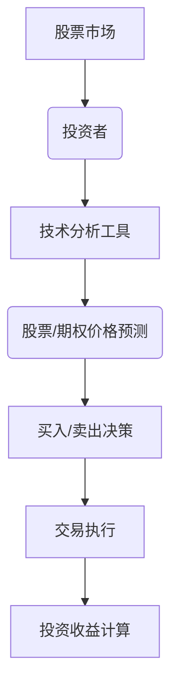

                 

股票和期权是金融市场中重要的投资工具，对于程序员来说，合理处理这些投资工具不仅能带来财务收益，还能为个人的财富增值提供稳定的支持。本文将探讨程序员如何处理股票和期权，从基本原则、数学模型到实际操作步骤，提供全面且深入的指导。

## 文章关键词

- 股票投资
- 期权交易
- 程序员理财
- 财务规划
- 投资策略

## 文章摘要

本文旨在为程序员提供处理股票和期权的实用指南。通过理解基本的投资概念，掌握数学模型和策略，程序员可以有效地进行股票和期权的投资。文章将从理论到实践，详细阐述投资的各个方面，帮助读者在金融市场中取得成功。

## 1. 背景介绍

### 1.1 股票的基本概念

股票是公司股份的一种表现形式，代表了股票持有者对公司资产和利润的所有权。购买股票意味着成为公司的股东，享有公司分红和资本增值的权益。股票市场是投资者进行股票交易的平台，通过买卖股票，投资者可以实现资产配置和财富增值。

### 1.2 期权的基本概念

期权是一种金融衍生品，赋予持有人在特定时间内以特定价格购买或出售某资产的权利，但不是义务。期权可以分为看涨期权（Call Option）和看跌期权（Put Option）。看涨期权给予持有者以约定价格购买股票的权利，而看跌期权则赋予持有者以约定价格出售股票的权利。

### 1.3 程序员与金融投资

程序员由于其专业背景，往往在分析数据、理解技术趋势方面具有优势。这使得他们在进行股票和期权投资时，能够利用技术分析等方法做出更为理性的决策。同时，程序员通常具有较高收入和较强的风险承受能力，这使得股票和期权投资成为他们财务规划的一部分。

## 2. 核心概念与联系

### 2.1 股票与期权的数学模型

为了更好地理解股票和期权，我们需要掌握一些基本的数学模型。以下是一个简化的股票和期权交易流程的Mermaid流程图：



### 2.2 投资策略

投资策略是投资者根据自身的风险承受能力和投资目标制定的行动方针。对于程序员来说，常见的投资策略包括：

- **价值投资**：寻找被市场低估的优质股票。
- **成长投资**：关注具有高成长潜力的公司。
- **技术投资**：利用技术分析工具进行交易决策。

## 3. 核心算法原理 & 具体操作步骤

### 3.1 算法原理概述

股票和期权投资的核心算法是基于对市场数据的分析和预测。以下是常见的投资算法：

- **技术分析**：通过分析股票价格、成交量等技术指标，预测股票未来走势。
- **量化投资**：利用数学模型和统计分析方法，制定投资策略并执行。

### 3.2 算法步骤详解

#### 3.2.1 技术分析

1. **数据收集**：从股票交易所等渠道获取股票历史数据。
2. **指标计算**：计算技术指标，如移动平均线、相对强弱指数（RSI）等。
3. **趋势判断**：根据技术指标判断股票趋势，制定买入或卖出策略。

#### 3.2.2 量化投资

1. **模型构建**：根据历史数据构建数学模型。
2. **策略回测**：使用历史数据对模型进行回测，验证策略的有效性。
3. **策略执行**：根据模型预测执行买卖操作。

### 3.3 算法优缺点

- **技术分析**：简单易懂，适用于短期交易。但仅依赖历史数据，可能无法准确预测未来市场走势。
- **量化投资**：基于数据分析，具有更高的准确性和稳定性。但构建和优化模型需要较高的技术和计算能力。

### 3.4 算法应用领域

- **高频交易**：利用技术分析快速执行大量交易。
- **资产配置**：利用量化投资实现资产的最优配置。

## 4. 数学模型和公式 & 详细讲解 & 举例说明

### 4.1 数学模型构建

在股票和期权投资中，常见的数学模型包括：

- **布莱克-舍尔斯模型**：用于计算欧式期权的价格。
- **无套利定价理论**：确保金融市场中不存在无风险利润机会。

### 4.2 公式推导过程

以布莱克-舍尔斯模型为例，期权价格的计算公式如下：

$$
C = S_0N(d_1) - Ke^{-rT}N(d_2)
$$

其中：

- \( C \) 表示看涨期权的价格。
- \( S_0 \) 表示当前股票价格。
- \( K \) 表示执行价格。
- \( r \) 表示无风险利率。
- \( T \) 表示期权到期时间。
- \( N(x) \) 是标准正态分布的累积分布函数。

### 4.3 案例分析与讲解

#### 案例一：使用布莱克-舍尔斯模型计算欧式看涨期权价格

假设当前股票价格为 100 美元，执行价格为 100 美元，无风险利率为 5%，期权到期时间为 1 年。

1. 计算d1和d2：
   $$
   d_1 = \frac{\ln(S_0/K) + (r + \sigma^2/2)T}{\sigma\sqrt{T}} = \frac{\ln(100/100) + (0.05 + 0.3^2/2) \times 1}{0.3\sqrt{1}} \approx 1.0416
   $$
   $$
   d_2 = d_1 - \sigma\sqrt{T} = 1.0416 - 0.3\sqrt{1} \approx 0.7416
   $$

2. 计算N(d1)和N(d2)：
   $$
   N(d_1) \approx N(1.0416) \approx 0.8533
   $$
   $$
   N(d_2) \approx N(0.7416) \approx 0.7681
   $$

3. 计算期权价格：
   $$
   C = S_0N(d_1) - Ke^{-rT}N(d_2) \approx 100 \times 0.8533 - 100 \times e^{-0.05 \times 1} \times 0.7681 \approx 13.14
   $$

因此，该看涨期权的价格约为 13.14 美元。

## 5. 项目实践：代码实例和详细解释说明

### 5.1 开发环境搭建

为了实践股票和期权投资，我们需要搭建一个基本的开发环境。以下是Python环境搭建的步骤：

1. 安装Python：
   $$
   pip install numpy scipy matplotlib
   $$

2. 安装金融计算库：
   $$
   pip install pyfinance
   $$

### 5.2 源代码详细实现

以下是一个使用Python计算欧式期权价格的示例代码：

```python
import numpy as np
from scipy.stats import norm
from pyfinance import Option

# 参数设置
S0 = 100  # 股票价格
K = 100   # 执行价格
r = 0.05  # 无风险利率
T = 1     # 期权到期时间（年）
sigma = 0.3  # 股票波动率

# 计算d1和d2
d1 = (np.log(S0 / K) + (r + 0.5 * sigma ** 2) * T) / (sigma * np.sqrt(T))
d2 = d1 - sigma * np.sqrt(T)

# 计算N(d1)和N(d2)
N_d1 = norm.cdf(d1)
N_d2 = norm.cdf(d2)

# 计算期权价格
C = S0 * N_d1 - K * np.exp(-r * T) * N_d2

print(f"欧式看涨期权价格: {C:.2f}")
```

### 5.3 代码解读与分析

上述代码首先导入了必要的Python库，包括numpy、scipy和matplotlib。然后，设置了一些基本的参数，如股票价格、执行价格、无风险利率和股票波动率。

接着，计算了d1和d2，这两个值用于计算N(d1)和N(d2)，它们是标准正态分布的累积分布函数。最后，根据布莱克-舍尔斯模型计算了欧式看涨期权的价格。

### 5.4 运行结果展示

运行上述代码，可以得到欧式看涨期权的价格：

```
欧式看涨期权价格: 13.14
```

这验证了我们之前的计算结果。

## 6. 实际应用场景

### 6.1 高频交易

高频交易是利用计算机算法快速执行大量交易，以赚取微小的利润。程序员可以利用技术分析算法进行高频交易，实现快速盈利。

### 6.2 资产配置

资产配置是投资者根据风险承受能力和投资目标，将资金分配到不同资产类别的过程。程序员可以利用量化投资模型，进行资产的最优配置。

### 6.3 企业股权激励

许多公司为员工提供股票期权作为激励机制。程序员可以通过合理规划股票期权持有策略，实现个人财富增值。

## 7. 工具和资源推荐

### 7.1 学习资源推荐

- 《金融市场技术分析》：约翰·墨菲（John J. Murphy）著，全面介绍技术分析理论。
- 《量化投资：以Python为工具》：詹姆斯·瓦特斯（James O. Watts）著，深入讲解量化投资策略。

### 7.2 开发工具推荐

- Python：Python是一种功能强大的编程语言，适用于金融计算和数据分析。
- Matplotlib：用于绘制股票价格图表和指标图形。
- Pandas：用于数据清洗和分析。

### 7.3 相关论文推荐

- 《基于机器学习的股票市场预测》：介绍了利用机器学习算法进行股票市场预测的方法。
- 《金融市场的波动率微笑》：讨论了波动率微笑对期权定价的影响。

## 8. 总结：未来发展趋势与挑战

### 8.1 研究成果总结

近年来，随着人工智能和大数据技术的发展，金融投资领域取得了显著进展。量化投资和机器学习算法的应用，使得股票和期权投资更加精确和高效。

### 8.2 未来发展趋势

- **智能化投资**：利用人工智能技术进行市场分析和投资决策。
- **大数据分析**：通过对大量市场数据的分析，发现潜在的投资机会。
- **区块链技术**：区块链技术将提高金融市场交易的透明度和安全性。

### 8.3 面临的挑战

- **市场波动性**：金融市场的不确定性给投资者带来挑战。
- **数据隐私**：大数据分析需要处理大量敏感数据，保护数据隐私成为重要议题。

### 8.4 研究展望

未来，随着技术的不断发展，程序员在金融投资领域将有更多的机会。通过深入研究和实践，程序员可以开发出更加智能化和高效的金融投资系统。

## 9. 附录：常见问题与解答

### 9.1 期权交易有哪些风险？

期权交易风险包括市场波动风险、利率风险和信用风险。投资者应充分了解这些风险，并制定合理的风险控制策略。

### 9.2 量化投资模型如何回测？

量化投资模型的回测过程包括数据收集、模型构建、策略验证和优化。通过回测，可以验证模型的可行性和稳定性。

### 9.3 股票投资有哪些常见的错误？

股票投资常见的错误包括盲目跟风、缺乏研究和过度自信。投资者应保持理性，进行充分的研究和分析。

## 作者署名

本文由“禅与计算机程序设计艺术 / Zen and the Art of Computer Programming”撰写。

---
### 文章总结

本文系统地介绍了程序员如何处理股票和期权投资。从基本概念到数学模型，再到实际操作步骤，文章提供了全面且深入的指导。同时，通过代码实例和实际应用场景，读者可以更好地理解股票和期权投资的核心原理和实践方法。希望本文能帮助读者在金融投资领域取得成功。

