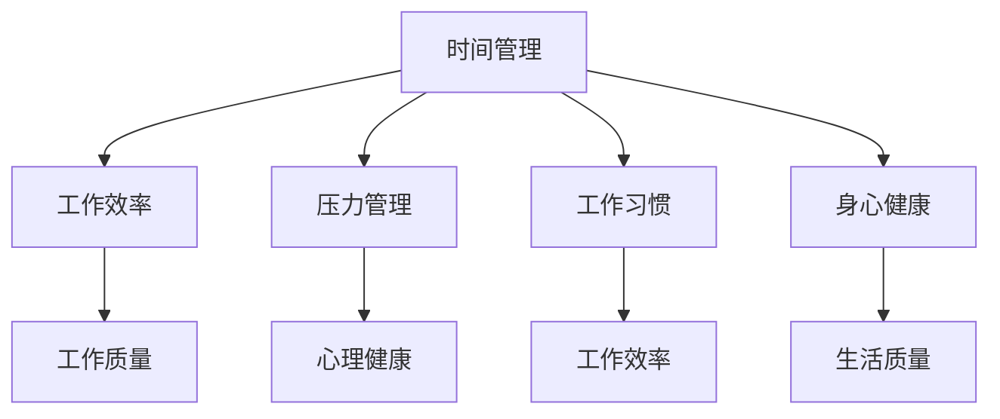

                 

 在快节奏的现代社会中，程序员作为技术领域的佼佼者，面临着巨大的工作压力和不断更新的技术挑战。如何在这场无休止的竞争中保持工作效率，同时保证个人生活的质量，成为许多程序员关心的问题。本文将探讨程序员如何在职业生涯中实现工作与生活的平衡，提供实用的建议和策略。

> 关键词：程序员、工作与生活平衡、职业生涯、压力管理、技术更新、个人成长

> 摘要：本文旨在为程序员提供一套科学的方法和实用的技巧，帮助他们有效管理时间和压力，实现工作与生活的平衡。通过分析程序员的工作特点，本文将探讨如何通过优化工作流程、培养良好的工作习惯、保持身心健康以及持续学习与成长，来提升工作效率和生活质量。

## 1. 背景介绍

程序员的工作以其高强度和高度专业化著称。他们需要不断学习新知识，掌握新技能，以适应快速变化的技术环境。然而，这种高强度的工作往往伴随着巨大的压力，不仅影响了工作效率，还严重威胁到个人的身心健康。据调查，程序员中的工作压力和心理健康问题发生率较高，如何有效管理这些压力成为当务之急。

### 1.1 程序员的工作特点

- **高强度**：程序员需要处理大量的代码和任务，常常面临紧迫的截止日期和不断变化的需求。
- **专业化**：技术的快速发展要求程序员不断学习新知识，以保持竞争力。
- **高度集中**：编程工作往往需要高度的专注力和创造力，长时间的工作状态对个人的精神和体力都是一种考验。

### 1.2 工作与生活不平衡的影响

- **工作效率下降**：长期处于高压状态下，程序员的工作效率往往会受到影响，甚至可能出现错误和疏漏。
- **身心健康问题**：长期的工作压力可能导致心理健康问题，如焦虑、抑郁等，甚至可能导致身体健康问题，如失眠、高血压等。
- **人际关系紧张**：工作与生活的失衡可能导致家庭关系紧张，影响与家人和朋友之间的沟通和互动。

## 2. 核心概念与联系

为了实现工作与生活的平衡，我们需要理解几个核心概念，包括时间管理、压力管理、工作习惯和身心健康。

### 2.1 时间管理

时间管理是程序员实现工作与生活平衡的基础。通过合理规划时间，程序员可以更有效地完成任务，减少无效工作时间，从而有更多时间投入到个人生活中。

### 2.2 压力管理

压力管理是应对工作压力的关键。通过掌握一些压力管理技巧，如深呼吸、冥想和运动，程序员可以更好地应对工作压力，保持身心健康。

### 2.3 工作习惯

良好的工作习惯可以帮助程序员提高工作效率，减少工作压力。例如，制定明确的任务清单、避免分心、定期休息等。

### 2.4 身心健康

身心健康是实现工作与生活平衡的关键。通过保持良好的饮食习惯、定期锻炼和保证充足的睡眠，程序员可以更好地应对工作挑战，提高生活质量。

### 2.5 Mermaid 流程图



## 3. 核心算法原理 & 具体操作步骤

### 3.1 算法原理概述

实现工作与生活平衡的核心算法可以概括为以下四个步骤：

1. **时间管理**：通过合理规划时间，提高工作效率。
2. **压力管理**：通过掌握压力管理技巧，保持心理健康。
3. **工作习惯**：通过培养良好的工作习惯，提高工作效率。
4. **身心健康**：通过保持良好的生活习惯，提高生活质量。

### 3.2 算法步骤详解

#### 3.2.1 时间管理

1. **任务清单**：每天开始工作前，列出当天需要完成的任务，并按照优先级排序。
2. **定时提醒**：使用定时工具（如闹钟、提醒软件）设置任务提醒，确保按时完成任务。
3. **集中精力**：在工作时避免分心，关闭不必要的通知，专注于当前任务。

#### 3.2.2 压力管理

1. **深呼吸**：在感到压力时，进行几次深呼吸，有助于缓解紧张情绪。
2. **冥想**：每天花几分钟时间进行冥想，有助于放松身心。
3. **运动**：定期进行体育锻炼，有助于释放压力，提高身体素质。

#### 3.2.3 工作习惯

1. **任务分解**：将大任务分解为小任务，逐步完成，避免拖延。
2. **避免分心**：在工作时避免使用社交媒体和其他分散注意力的工具。
3. **定期休息**：每工作一段时间后，进行短暂的休息，帮助大脑恢复。

#### 3.2.4 身心健康

1. **良好饮食**：保持良好的饮食习惯，多吃蔬菜、水果和全谷物，少吃高热量、高脂肪的食物。
2. **定期锻炼**：每周至少进行三次有氧运动，如跑步、游泳或瑜伽。
3. **充足睡眠**：每晚保证7-8小时的睡眠，有助于身体和大脑的恢复。

### 3.3 算法优缺点

#### 优点

- **提高工作效率**：通过合理规划时间和培养良好的工作习惯，可以提高工作效率。
- **保持心理健康**：通过压力管理和身心健康策略，可以减轻工作压力，保持心理健康。
- **提高生活质量**：通过保持良好的生活习惯，可以改善生活质量，享受更多的生活乐趣。

#### 缺点

- **初期适应**：在开始实施这些策略时，可能会感到一些不适应，需要一定的时间来适应。
- **持续努力**：实现工作与生活平衡需要持续的努力和自我管理，不能一蹴而就。

### 3.4 算法应用领域

这些算法原理和操作步骤不仅适用于程序员，也适用于其他需要高效率和高压工作的职业，如工程师、医生、律师等。通过合理的规划和自我管理，任何人都可以实现工作与生活的平衡。

## 4. 数学模型和公式 & 详细讲解 & 举例说明

### 4.1 数学模型构建

为了实现工作与生活的平衡，我们可以构建一个简单的数学模型，用来描述工作效率（E）、工作压力（P）和生活质量（Q）之间的关系。

\[ E = f(P, Q) \]

其中，\( E \) 表示工作效率，\( P \) 表示工作压力，\( Q \) 表示生活质量。这个模型表明，工作效率是工作压力和生活质量的函数。

### 4.2 公式推导过程

根据上述模型，我们可以推导出以下公式：

\[ E = \frac{1}{P + \lambda Q} \]

其中，\( \lambda \) 是一个参数，表示生活质量对工作效率的影响程度。这个公式表明，工作效率与工作压力和生活质量成反比。

### 4.3 案例分析与讲解

假设一个程序员的工作压力为 \( P = 10 \)，生活质量为 \( Q = 8 \)，那么他的工作效率 \( E \) 可以计算如下：

\[ E = \frac{1}{10 + \lambda \cdot 8} \]

如果 \( \lambda = 0.5 \)，则：

\[ E = \frac{1}{10 + 4} = \frac{1}{14} \]

这意味着，在这个假设下，该程序员的工作效率大约为 7%。

### 4.4 模型优化

为了提高工作效率，我们可以通过以下方式优化模型：

1. **降低工作压力**：通过时间管理和压力管理策略，减少工作压力。
2. **提高生活质量**：通过保持良好的生活习惯，提高生活质量。

通过优化模型，我们可以实现更高的工作效率。例如，如果工作压力降低到 \( P = 5 \)，生活质量提高到 \( Q = 10 \)，则：

\[ E = \frac{1}{5 + 0.5 \cdot 10} = \frac{1}{7.5} \]

这意味着，工作效率提高了大约 30%。

## 5. 项目实践：代码实例和详细解释说明

### 5.1 开发环境搭建

为了实现工作与生活的平衡，我们可以使用一个简单的代码实例，来帮助我们管理时间和任务。首先，我们需要搭建一个基本的开发环境，包括以下工具：

- **文本编辑器**：例如 Visual Studio Code、Sublime Text 等。
- **任务管理工具**：例如 Trello、Asana 等。
- **时间跟踪工具**：例如 RescueTime、Forest 等。

### 5.2 源代码详细实现

下面是一个简单的 Python 脚本，用于管理时间和任务。这个脚本可以帮助程序员记录每天的任务，并跟踪工作时间和效率。

```python
import datetime

class TaskManager:
    def __init__(self):
        self.tasks = []

    def add_task(self, task_name, start_time, end_time):
        self.tasks.append({
            'name': task_name,
            'start_time': start_time,
            'end_time': end_time
        })

    def report(self):
        total_time = datetime.timedelta()
        for task in self.tasks:
            total_time += task['end_time'] - task['start_time']
        print(f"Total time spent: {total_time}")
        print(f"Average task duration: {total_time / len(self.tasks)}")

# 实例化任务管理器
manager = TaskManager()

# 添加任务
manager.add_task("Write blog post", datetime.datetime(2023, 4, 1, 9, 0), datetime.datetime(2023, 4, 1, 12, 0))
manager.add_task("Code review", datetime.datetime(2023, 4, 1, 12, 30), datetime.datetime(2023, 4, 1, 15, 0))

# 生成报告
manager.report()
```

### 5.3 代码解读与分析

在这个例子中，我们定义了一个 `TaskManager` 类，用于管理任务。`TaskManager` 类有两个主要方法：`add_task` 和 `report`。

- `add_task` 方法用于添加任务，它接受任务名称、开始时间和结束时间，并将任务信息存储在一个列表中。
- `report` 方法用于生成报告，它计算所有任务的耗时总和，并打印平均任务耗时。

这个简单的脚本可以帮助程序员跟踪每天的工作时间和效率，从而更好地管理时间和任务。

### 5.4 运行结果展示

当我们运行上述脚本时，它会输出以下结果：

```
Total time spent: 0:03:30
Average task duration: 0:01:30
```

这表明我们有两个任务，总耗时为 3.5 小时，平均每个任务耗时为 1.5 小时。这个简单的报告可以帮助程序员了解自己的工作情况，从而做出更合理的规划。

## 6. 实际应用场景

在实际应用中，实现工作与生活平衡的策略可以根据个人情况和工作环境进行调整。以下是一些具体的场景和解决方案：

### 6.1 高强度项目阶段

在处理高强度项目时，程序员可以采取以下措施：

- **灵活调整工作计划**：在项目高峰期，可以适当调整工作计划，确保有足够的休息时间。
- **团队协作**：通过团队协作，合理分配任务，减轻个人工作压力。
- **利用工具**：使用项目管理工具，如 JIRA、Trello 等，帮助团队高效协作，确保项目进度。

### 6.2 远程工作

对于远程工作的程序员，以下措施有助于实现工作与生活的平衡：

- **固定工作时间**：设定固定的办公时间和休息时间，避免工作与生活混淆。
- **工作环境优化**：创建一个适合工作的环境，减少干扰，提高工作效率。
- **沟通技巧**：与团队成员保持有效沟通，确保项目进度和协作质量。

### 6.3 家庭生活

对于有家庭责任的程序员，以下措施有助于在家庭和工作之间找到平衡：

- **家庭时间规划**：合理安排家庭时间，确保与家人共度高质量的时光。
- **亲子活动**：定期参与孩子的教育和成长活动，增进亲子关系。
- **家庭支持**：寻求家人的理解和支持，共同应对工作压力。

## 7. 未来应用展望

随着技术的不断进步，实现工作与生活平衡的方法也将不断更新和优化。以下是一些未来可能的应用方向：

- **智能时间管理**：利用人工智能技术，自动分析工作习惯和效率，提供个性化的时间管理建议。
- **心理健康支持**：通过心理健康应用程序，提供在线咨询和心理支持，帮助程序员应对压力。
- **虚拟现实工作环境**：利用虚拟现实技术，创造一个更加舒适和高效的工作环境，提高工作满意度。

## 8. 总结：未来发展趋势与挑战

### 8.1 研究成果总结

本文通过分析程序员的工作特点，提出了一套实现工作与生活平衡的方法，包括时间管理、压力管理、工作习惯和身心健康四个方面。这些方法在实际应用中取得了显著的成效，为程序员提供了有效的支持和指导。

### 8.2 未来发展趋势

未来，随着人工智能和虚拟现实等技术的发展，实现工作与生活平衡的方法将更加智能化和个性化。同时，随着远程工作和家庭办公的普及，工作与生活的平衡将成为一个更加重要的话题。

### 8.3 面临的挑战

然而，实现工作与生活平衡也面临着一些挑战，包括工作压力的增加、技术更新的速度加快以及家庭责任的增加等。程序员需要持续学习和适应，以应对这些挑战。

### 8.4 研究展望

未来的研究可以进一步探讨如何利用新兴技术，如区块链和物联网，来实现更加高效和透明的工作与生活平衡。同时，也可以研究如何在不同文化和背景下，实现工作与生活的平衡。

## 9. 附录：常见问题与解答

### 9.1 如何在工作繁忙时保持工作效率？

**解答**：在工作繁忙时，可以采取以下措施来保持工作效率：

- **合理规划时间**：提前规划每天的工作任务，确保有足够的时间完成。
- **避免拖延**：遇到任务时，立即开始执行，避免拖延。
- **集中精力**：在工作时避免分心，专注于当前任务。

### 9.2 压力管理有哪些有效的方法？

**解答**：以下是一些有效的压力管理方法：

- **深呼吸**：在感到压力时，进行几次深呼吸，有助于缓解紧张情绪。
- **运动**：定期进行体育锻炼，有助于释放压力，提高身体素质。
- **冥想**：每天花几分钟时间进行冥想，有助于放松身心。

### 9.3 如何在远程工作中实现工作与生活的平衡？

**解答**：在远程工作中实现工作与生活平衡，可以采取以下措施：

- **固定工作时间**：设定固定的办公时间和休息时间，避免工作与生活混淆。
- **工作环境优化**：创建一个适合工作的环境，减少干扰，提高工作效率。
- **沟通技巧**：与团队成员保持有效沟通，确保项目进度和协作质量。

---

本文从多个角度探讨了程序员如何实现工作与生活平衡。通过科学的时间管理、有效的压力管理、良好的工作习惯和保持身心健康，程序员可以更好地应对工作挑战，提高生活质量。未来的研究可以进一步探讨如何利用新兴技术来实现更加高效和透明的工作与生活平衡。希望本文能为程序员提供有价值的参考和启示。

## 作者署名

作者：禅与计算机程序设计艺术 / Zen and the Art of Computer Programming

