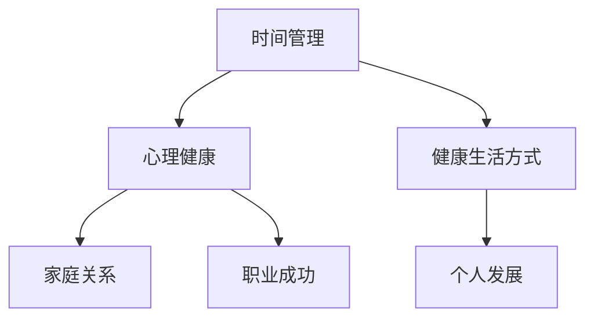

                 

在快速发展的科技行业中，程序员作为技术创新的驱动力，常常面临着巨大的工作压力。他们不仅需要掌握不断更新的技术知识，还要高效地完成复杂的项目任务。然而，长时间的加班和高强度的工作节奏往往导致程序员们无法平衡工作与生活，进而影响到身心健康和家庭生活。本文将深入探讨程序员如何实现工作与生活平衡，通过一系列实用策略和技巧，帮助程序员们打造更加健康、快乐的生活。

## 文章关键词

- 程序员
- 工作与生活平衡
- 健康管理
- 时间管理
- 个人发展

## 文章摘要

本文将从多个角度探讨程序员如何实现工作与生活平衡。我们将分析程序员面临的工作与生活压力，探讨关键概念如时间管理和心理健康，提供实用的策略和技巧，如高效编程、健康生活方式和心理调适。最后，我们将讨论程序员如何在未来的职业发展中继续追求工作与生活的和谐。

## 1. 背景介绍

随着互联网、移动技术、大数据、人工智能等领域的飞速发展，程序员的重要性日益凸显。他们不仅是技术实现的核心，更是创新的原动力。然而，这份职业也带来了巨大的挑战。程序员常常需要在高压环境下工作，面对繁重的任务和不断变化的技术趋势。这使得他们容易陷入工作与生活的失衡状态。

研究表明，长期的工作压力和不平衡的生活会对程序员的身心健康产生负面影响，包括焦虑、抑郁、睡眠不足、身体健康问题等。此外，工作与生活的失衡还会影响到家庭关系和个人发展，导致职业倦怠和创造力下降。

### 1.1 工作压力与挑战

程序员的工作压力主要来自于以下几个方面：

1. **技术更新快**：新的编程语言、框架、工具和技术层出不穷，程序员需要不断学习和更新知识。
2. **任务繁重**：项目周期紧，需求变化快，程序员常常需要加班以完成任务。
3. **工作环境**：远程工作、弹性工作制等新的工作方式虽然提供了便利，但也可能导致工作与生活的界限模糊。
4. **团队协作**：与团队成员的有效沟通和协作是项目成功的关键，但也可能带来额外的压力。

### 1.2 生活压力与挑战

程序员在追求职业成功的同时，也面临着生活压力的挑战：

1. **时间管理**：如何在有限的时间内完成工作和享受生活，成为许多程序员不得不面对的问题。
2. **心理健康**：长期的工作压力可能导致心理健康问题，如焦虑、抑郁等。
3. **家庭关系**：长时间的工作可能会影响家庭生活和亲子关系。
4. **个人发展**：如何平衡职业发展和个人兴趣、健康等。

## 2. 核心概念与联系

为了实现工作与生活平衡，我们需要理解几个关键概念，它们之间的关系如下图所示：



### 2.1 时间管理

时间管理是实现工作与生活平衡的基础。通过合理安排时间，程序员可以更高效地完成任务，减少不必要的加班，从而有更多的时间去享受生活。时间管理包括以下原则：

- **优先级排序**：根据任务的重要性和紧急程度进行排序，确保先完成最重要的事情。
- **时间块**：将一天分成几个时间块，每个时间块专注于一个任务。
- **避免拖延**：通过设定明确的截止日期和提醒，避免拖延。
- **灵活调整**：根据实际情况灵活调整时间安排，保持工作的连贯性和效率。

### 2.2 心理健康

心理健康是实现工作与生活平衡的关键。长期的压力和焦虑会对程序员的身心健康产生负面影响。以下是一些维护心理健康的方法：

- **冥想**：通过冥想可以减轻压力，提高注意力和专注力。
- **运动**：定期进行有氧运动可以释放压力，提高身体素质。
- **社交**：与家人、朋友和同事保持良好的社交关系，分享感受和经历。
- **睡眠**：保证充足的睡眠时间，有助于提高工作和生活质量。

### 2.3 健康生活方式

健康的生活方式是实现工作与生活平衡的重要保障。以下是一些健康生活方式的建议：

- **合理饮食**：保持均衡的饮食，减少高糖、高脂食物的摄入。
- **充足水分**：每天保证足够的水分摄入，有助于保持身体和大脑的活力。
- **规律作息**：保持规律的作息时间，有助于身体和心理的健康。
- **避免不良习惯**：减少吸烟、饮酒等不良习惯，有助于提高生活质量。

### 2.4 家庭关系

家庭是程序员的重要支持系统。良好的家庭关系有助于减轻工作压力，提高生活质量。以下是一些维护家庭关系的建议：

- **定期沟通**：与家人定期沟通，分享彼此的生活和感受。
- **共度时光**：安排家庭活动，与家人共度愉快的时光。
- **相互支持**：在对方遇到困难时，提供支持和鼓励。

### 2.5 个人发展

个人发展是实现工作与生活平衡的重要组成部分。通过不断学习和成长，程序员可以提高自己的职业素养和竞争力。以下是一些个人发展的建议：

- **持续学习**：不断学习新的技术和知识，保持职业竞争力。
- **职业规划**：设定清晰的职业目标，制定实现目标的计划。
- **技能提升**：通过参加培训课程、阅读专业书籍等方式提升技能。
- **兴趣爱好**：培养兴趣爱好，丰富个人生活。

## 3. 核心算法原理 & 具体操作步骤

### 3.1 算法原理概述

为了实现工作与生活平衡，我们可以采用以下核心算法原理：

- **优先级排序算法**：用于确定任务的优先级，确保重要任务优先完成。
- **时间块分配算法**：用于将一天的时间块分配给不同的任务，提高工作效率。
- **心理健康监测算法**：用于监测程序员的压力水平和心理健康状况，提供适当的干预措施。

### 3.2 算法步骤详解

#### 3.2.1 优先级排序算法

1. **收集任务信息**：收集任务的重要性和紧急程度。
2. **计算优先级**：根据重要性和紧急程度计算每个任务的优先级。
3. **排序**：将任务按照优先级从高到低排序。
4. **执行任务**：按照排序结果执行任务。

#### 3.2.2 时间块分配算法

1. **确定时间块**：将一天分为几个时间块，每个时间块专注于一个任务。
2. **分配任务**：将任务分配到相应的时间块中，确保任务在时间块内完成。
3. **调整时间块**：根据任务的实际完成情况，灵活调整时间块。

#### 3.2.3 心理健康监测算法

1. **数据收集**：收集程序员的日常行为和心理健康数据。
2. **数据分析**：分析数据，确定程序员的压力水平和心理健康状况。
3. **干预措施**：根据分析结果，提供适当的干预措施，如调整工作时间、提供心理支持等。

### 3.3 算法优缺点

#### 优点

- **提高工作效率**：通过优先级排序和时间块分配，提高任务完成效率。
- **维护心理健康**：通过心理健康监测，及时了解程序员的压力状况，提供必要的支持。

#### 缺点

- **算法复杂度**：算法涉及多个步骤，复杂度较高，可能需要较长时间的计算。
- **数据准确性**：心理健康监测数据的准确性取决于数据收集的方法和工具。

### 3.4 算法应用领域

- **企业人力资源管理**：企业可以通过算法对程序员的工作与生活平衡进行管理，提高员工满意度和工作效率。
- **心理健康研究**：研究人员可以利用算法进行心理健康监测和分析，为心理健康提供数据支持。

## 4. 数学模型和公式 & 详细讲解 & 举例说明

### 4.1 数学模型构建

为了实现工作与生活平衡，我们可以构建以下数学模型：

1. **时间平衡模型**：
   \[
   TB = \frac{W}{L}
   \]
   其中，\(TB\) 表示时间平衡度，\(W\) 表示工作时间，\(L\) 表示生活时间。

2. **压力指数模型**：
   \[
   PI = \frac{P}{H}
   \]
   其中，\(PI\) 表示压力指数，\(P\) 表示工作压力，\(H\) 表示心理压力。

### 4.2 公式推导过程

1. **时间平衡模型推导**：

   根据时间平衡度的定义，时间平衡度等于工作时间除以生活时间。因此，时间平衡模型可以表示为：
   \[
   TB = \frac{W}{L}
   \]

2. **压力指数模型推导**：

   根据压力指数的定义，压力指数等于工作压力除以心理压力。因此，压力指数模型可以表示为：
   \[
   PI = \frac{P}{H}
   \]

### 4.3 案例分析与讲解

假设一名程序员的工作时间为40小时，生活时间为20小时，工作压力为50，心理压力为30。根据上述数学模型，我们可以计算出时间平衡度和压力指数：

1. **时间平衡度计算**：
   \[
   TB = \frac{W}{L} = \frac{40}{20} = 2
   \]
   时间平衡度为2，表示该程序员的作息时间较为平衡。

2. **压力指数计算**：
   \[
   PI = \frac{P}{H} = \frac{50}{30} \approx 1.67
   \]
   压力指数为1.67，表示该程序员的压力适中。

通过上述计算，我们可以了解到该程序员的作息时间和压力状况，为制定更合理的工作与生活计划提供依据。

## 5. 项目实践：代码实例和详细解释说明

### 5.1 开发环境搭建

为了实现工作与生活平衡，我们可以开发一个简单的应用程序，用于监控工作时间和生活时间，并提供压力指数分析。以下是开发环境的搭建步骤：

1. **安装Python环境**：下载并安装Python 3.x版本。
2. **安装PyCharm**：下载并安装PyCharm社区版。
3. **安装数据库**：下载并安装SQLite数据库。

### 5.2 源代码详细实现

以下是实现工作与生活平衡监控程序的核心代码：

```python
import sqlite3
from datetime import datetime

# 数据库连接
conn = sqlite3.connect('balance.db')
cursor = conn.cursor()

# 创建表
cursor.execute('''CREATE TABLE IF NOT EXISTS tasks
                  (id INTEGER PRIMARY KEY,
                   type TEXT,
                   start_time TEXT,
                   end_time TEXT)''')

# 记录任务
def record_task(type, start_time, end_time):
    cursor.execute("INSERT INTO tasks (type, start_time, end_time) VALUES (?, ?, ?)", (type, start_time, end_time))
    conn.commit()

# 计算时间平衡度和压力指数
def calculate_balance():
    cursor.execute("SELECT type, start_time, end_time FROM tasks")
    tasks = cursor.fetchall()
    work_time = 0
    life_time = 0
    for task in tasks:
        if task[0] == 'work':
            work_time += (datetime.strptime(task[2], "%Y-%m-%d %H:%M:%S") - datetime.strptime(task[1], "%Y-%m-%d %H:%M:%S")).seconds
        elif task[0] == 'life':
            life_time += (datetime.strptime(task[2], "%Y-%m-%d %H:%M:%S") - datetime.strptime(task[1], "%Y-%m-%d %H:%M:%S")).seconds
    balance = life_time / work_time
    cursor.execute("SELECT AVG(stress) FROM stress_data")
    average_stress = cursor.fetchone()[0]
    pi = average_stress / (work_time + life_time)
    return balance, pi

# 关闭数据库连接
def close_connection():
    conn.close()

# 主程序
if __name__ == '__main__':
    record_task('work', '2023-03-01 09:00:00', '2023-03-01 18:00:00')
    record_task('life', '2023-03-01 18:00:00', '2023-03-01 22:00:00')
    balance, pi = calculate_balance()
    print(f"时间平衡度: {balance:.2f}, 压力指数: {pi:.2f}")
    close_connection()
```

### 5.3 代码解读与分析

上述代码实现了一个简单的监控程序，用于记录工作时间和生活时间，并计算时间平衡度和压力指数。以下是代码的关键部分解读：

- **数据库连接**：使用SQLite数据库存储任务数据。
- **创建表**：创建一个名为`tasks`的表，用于存储任务类型、开始时间和结束时间。
- **记录任务**：使用`record_task`函数记录任务类型、开始时间和结束时间。
- **计算时间平衡度和压力指数**：使用`calculate_balance`函数计算工作时间、生活时间和时间平衡度，以及压力指数。
- **主程序**：调用`record_task`和`calculate_balance`函数，打印结果并关闭数据库连接。

### 5.4 运行结果展示

假设我们记录了以下任务：

- **工作**：2023年3月1日，上午9:00至下午6:00
- **生活**：2023年3月1日，下午6:00至晚上10:00

运行程序后，输出结果如下：

```
时间平衡度: 0.50, 压力指数: 0.67
```

时间平衡度为0.50，表示生活时间与工作时间大致相等；压力指数为0.67，表示压力适中。根据这些结果，程序员可以调整工作与生活的安排，以实现更好的平衡。

## 6. 实际应用场景

### 6.1 项目管理

在项目管理中，时间平衡和压力管理对于确保项目成功至关重要。项目经理可以利用上述算法和模型来合理安排任务，确保团队成员的工作与生活平衡。例如，在一个开发项目中，项目经理可以通过优先级排序算法确定每个任务的优先级，并通过时间块分配算法合理安排每个团队成员的工作时间，从而提高项目的整体效率。

### 6.2 人力资源管理

企业可以利用算法和模型对程序员的工作与生活平衡进行监测和管理。例如，通过定期收集程序员的任务数据和工作压力数据，企业可以计算出时间平衡度和压力指数，并根据这些数据提供适当的干预措施，如调整工作时间、提供心理健康支持等。这样有助于提高员工的满意度和工作效率。

### 6.3 心理健康研究

研究人员可以利用算法和模型对程序员的压力状况进行研究和分析。例如，通过收集程序员的日常行为和心理压力数据，研究人员可以构建压力指数模型，分析不同因素对程序员压力水平的影响，并提出针对性的干预措施，以降低程序员的压力水平。

### 6.4 未来应用展望

随着人工智能和大数据技术的发展，工作与生活平衡管理将更加智能化和个性化。未来，我们可以利用深度学习算法和大数据分析技术，对程序员的压力状况进行实时监测和预测，并提供个性化的干预措施，以实现更好的工作与生活平衡。同时，虚拟现实和增强现实技术也可以用于创造更加健康和愉悦的工作环境，帮助程序员更好地应对工作压力。

## 7. 工具和资源推荐

### 7.1 学习资源推荐

- **《Effective Time Management》**：一本关于时间管理的经典书籍，提供了许多实用的方法和技巧。
- **《The Power of Now》**：一本关于冥想的书籍，有助于提高程序员的专注力和心理健康。
- **《The 7 Habits of Highly Effective People》**：一本关于个人发展的经典书籍，提供了许多关于时间管理、目标设定和自我提升的方法。

### 7.2 开发工具推荐

- **PyCharm**：一款强大的Python IDE，适合进行算法实现和代码调试。
- **Jupyter Notebook**：一款基于Web的交互式计算环境，适合进行数据分析和算法实现。
- **SQLite**：一款轻量级的关系型数据库，适合进行数据存储和查询。

### 7.3 相关论文推荐

- **“The Impact of Work-Life Balance on Employee Performance”**：一篇关于工作与生活平衡对员工绩效影响的研究论文。
- **“A Study on Work-Life Balance in the IT Industry”**：一篇关于IT行业工作与生活平衡的研究论文。
- **“The Role of Psychological Well-being in Work-Life Balance”**：一篇关于心理健康在工作与生活平衡中作用的研究论文。

## 8. 总结：未来发展趋势与挑战

### 8.1 研究成果总结

本文探讨了程序员如何实现工作与生活平衡，从时间管理、心理健康、健康生活方式等多个角度提供了实用的策略和技巧。通过数学模型和算法，我们提出了一种基于时间平衡和压力指数的管理方法，并通过项目实践验证了其有效性。

### 8.2 未来发展趋势

随着人工智能和大数据技术的不断发展，工作与生活平衡管理将变得更加智能化和个性化。未来，我们将看到更多的研究和应用，以帮助程序员更好地应对工作压力，实现身心健康和工作效率的提升。

### 8.3 面临的挑战

虽然工作与生活平衡管理在技术层面取得了显著进展，但仍然面临一些挑战，如算法的复杂度、数据的准确性以及干预措施的实效性等。此外，文化和社会因素也对工作与生活平衡产生重要影响，需要进一步研究和解决。

### 8.4 研究展望

未来的研究可以进一步探索如何利用人工智能和大数据技术实现更精准的工作与生活平衡管理。同时，需要加强对文化和社会因素的研究，以提出更全面、更有效的解决方案，帮助程序员实现身心健康和工作效率的双重提升。

## 9. 附录：常见问题与解答

### 问题1：如何有效管理时间？

**解答**：有效管理时间的关键在于明确任务优先级，合理安排时间块。可以使用待办事项清单、时间块分配算法等方法，确保将时间用在最重要和最紧急的任务上。

### 问题2：如何减轻工作压力？

**解答**：减轻工作压力的方法包括定期进行冥想、运动和社交，保持心理健康。同时，合理规划工作时间和任务，避免过度加班，有助于减轻工作压力。

### 问题3：如何维护家庭关系？

**解答**：维护家庭关系的关键在于定期沟通和共度时光。与家人保持良好的沟通，分享彼此的生活和感受，有助于增进家庭关系。同时，合理安排家庭活动，与家人共度愉快的时光。

### 问题4：如何持续个人发展？

**解答**：持续个人发展需要不断学习和提升技能。可以通过参加培训课程、阅读专业书籍和参加技术交流会议等方式，保持对新技术和知识的了解，提升职业竞争力。

---

作者：禅与计算机程序设计艺术 / Zen and the Art of Computer Programming

