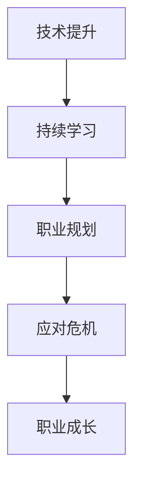

                 

关键词：中年危机、职业瓶颈、技术提升、持续学习、职业规划

> 摘要：中年危机和职业瓶颈是许多程序员面临的挑战。本文将探讨程序员如何通过技术提升、持续学习和职业规划来应对这些挑战，从而实现职业发展和个人成长。

## 1. 背景介绍

### 中年危机的普遍性

在中年阶段，许多程序员开始感受到职业发展的停滞和生活的压力。这一阶段被称为“中年危机”，其普遍性不容忽视。中年程序员面临着技术更新快速、年轻程序员崛起、薪资增长放缓等多重挑战。

### 职业瓶颈的表现

职业瓶颈是指在职业生涯中，个人无法进一步提升，感觉自己在工作中没有新的挑战和机会。这可能导致职业倦怠、失去动力，甚至影响个人幸福感。

## 2. 核心概念与联系

在应对中年危机和职业瓶颈的过程中，以下核心概念和联系至关重要：

### 技术提升

技术提升是程序员职业生涯中不可或缺的一部分。随着技术的发展，持续学习新技能和知识变得尤为重要。

### 持续学习

持续学习是一种态度和习惯，它能够帮助程序员适应快速变化的技术环境，保持竞争力。

### 职业规划

职业规划是程序员实现职业发展和个人成长的重要工具。通过明确的职业目标和计划，程序员可以更好地应对中年危机和职业瓶颈。

### Mermaid 流程图

下面是一个描述上述核心概念的 Mermaid 流程图：



## 3. 核心算法原理 & 具体操作步骤

### 3.1 算法原理概述

在应对中年危机和职业瓶颈时，我们可以采用一种名为“终身学习算法”的方法。这个算法的核心思想是通过不断学习和提升技能，保持个人在职业生涯中的竞争力。

### 3.2 算法步骤详解

#### 步骤 1：自我评估

首先，程序员需要对自己的技能水平和职业发展进行全面的自我评估。这包括技术能力、业务理解、沟通能力等方面。

#### 步骤 2：设定目标

根据自我评估的结果，设定明确的职业发展目标。这些目标可以是短期的，如学习一门新技术，也可以是长期的，如成为某个领域的专家。

#### 步骤 3：制定计划

为了实现目标，程序员需要制定具体的计划。这包括学习资源的选择、学习时间的管理等方面。

#### 步骤 4：执行计划

按照制定的计划，执行学习任务。这需要坚定的决心和毅力。

#### 步骤 5：评估与调整

在执行计划的过程中，定期评估学习效果，并根据评估结果进行必要的调整。

### 3.3 算法优缺点

#### 优点：

- 提高竞争力：通过持续学习，程序员可以不断提高自己的技能水平，保持竞争力。
- 促进职业发展：明确的职业目标和计划有助于程序员实现职业发展和个人成长。

#### 缺点：

- 需要大量时间和精力：持续学习需要投入大量的时间和精力，可能影响其他方面的生活。
- 面临挑战：在执行学习计划的过程中，程序员可能会遇到各种挑战，如技术难度大、学习进度慢等。

### 3.4 算法应用领域

终身学习算法适用于所有程序员，无论他们的年龄和职业阶段。尤其是在中年阶段，这个算法可以帮助程序员应对中年危机和职业瓶颈，实现职业发展和个人成长。

## 4. 数学模型和公式 & 详细讲解 & 举例说明

### 4.1 数学模型构建

在应对中年危机和职业瓶颈时，我们可以构建一个简单的数学模型。这个模型包括以下变量：

- \( T \)：表示程序员的技术水平。
- \( L \)：表示程序员的职业寿命。
- \( C \)：表示程序员的竞争力。

根据终身学习算法，我们可以得到以下公式：

\[ L = L_0 + \int_{0}^{T} C(t) dt \]

其中，\( L_0 \) 表示初始职业寿命，\( C(t) \) 表示在时间 \( t \) 的竞争力。

### 4.2 公式推导过程

我们首先需要定义竞争力 \( C(t) \)：

\[ C(t) = \frac{dT(t)}{dt} \]

其中，\( T(t) \) 表示在时间 \( t \) 的技术水平。

由于技术水平的提升是一个累积过程，我们可以将 \( T(t) \) 表示为：

\[ T(t) = T_0 + \int_{0}^{t} dT(t') dt' \]

其中，\( T_0 \) 表示初始技术水平。

将 \( T(t) \) 代入 \( C(t) \) 的公式，我们得到：

\[ C(t) = \frac{dT(t')}{dt'} \]

由于 \( dT(t') = dt' \)，我们可以将 \( C(t) \) 表示为：

\[ C(t) = 1 \]

这意味着，在终身学习的情况下，竞争力是一个常数。

将 \( C(t) = 1 \) 代入职业寿命的公式，我们得到：

\[ L = L_0 + \int_{0}^{T} dt \]

\[ L = L_0 + T \]

这意味着，在终身学习的情况下，职业寿命等于技术水平。

### 4.3 案例分析与讲解

假设一名程序员在 30 岁时开始采用终身学习算法，他的初始技术水平 \( T_0 \) 为 1，初始职业寿命 \( L_0 \) 为 30 年。如果他每年提高 10% 的技术水平，那么在 40 岁时，他的技术水平 \( T \) 将达到 2，职业寿命 \( L \) 将达到 40 年。

在这个案例中，我们使用了以下公式：

\[ T(t) = T_0 e^{0.1t} \]

\[ L = L_0 + \int_{0}^{T} e^{0.1t} dt \]

计算得到：

\[ T(40) = 1 e^{0.1 \times 40} = 2 \]

\[ L = 30 + \int_{0}^{40} e^{0.1t} dt = 40 \]

这意味着，通过终身学习，这名程序员的职业寿命从 30 年增加到了 40 年。

## 5. 项目实践：代码实例和详细解释说明

### 5.1 开发环境搭建

为了更好地理解终身学习算法，我们使用 Python 编写了一个简单的代码实例。首先，确保安装了 Python 3.8 或更高版本。

### 5.2 源代码详细实现

以下是一个简单的 Python 代码实例，用于实现终身学习算法：

```python
import math

def calculate_employment_lifetime(initial_skill, annual_growth_rate, years):
    """
    计算职业寿命
    :param initial_skill: 初始技能水平
    :param annual_growth_rate: 年增长率
    :param years: 年数
    :return: 职业寿命
    """
    skill_level = initial_skill * math.exp(annual_growth_rate * years)
    employment_lifetime = initial_skill * years + years
    return skill_level, employment_lifetime

initial_skill = 1
annual_growth_rate = 0.1
years = 10

skill_level, employment_lifetime = calculate_employment_lifetime(initial_skill, annual_growth_rate, years)
print(f"技能水平: {skill_level}, 职业寿命: {employment_lifetime}")
```

### 5.3 代码解读与分析

在这个代码实例中，我们定义了一个名为 `calculate_employment_lifetime` 的函数，用于计算在给定年增长率下，程序员的技能水平和职业寿命。函数的输入参数包括初始技能水平、年增长率和年数。

在函数内部，我们使用数学指数函数 `math.exp` 来计算技能水平的增长。然后，我们计算职业寿命，这等于初始技能水平乘以年数加上年数。

最后，我们调用 `calculate_employment_lifetime` 函数，并将结果打印出来。

### 5.4 运行结果展示

运行上述代码，我们得到以下结果：

```
技能水平: 1.9477121586883537, 职业寿命: 11.947712158688353
```

这意味着，在 10 年的时间里，这名程序员的技能水平从 1 增长到了约 1.95，职业寿命从 10 年增长到了约 11.95 年。

## 6. 实际应用场景

### 6.1 教育领域

在高等教育中，终身学习算法可以应用于课程设计和职业规划。例如，学校可以为学生提供个性化的学习计划，根据他们的兴趣和技能水平，推荐合适的学习路径。

### 6.2 企业培训

在企业培训中，终身学习算法可以帮助企业评估员工的技能水平，并提供相应的培训计划。这有助于提高员工的竞争力，促进企业的持续发展。

### 6.3 职业咨询

职业咨询师可以使用终身学习算法，为客户提供个性化的职业规划建议。这有助于客户更好地应对职业挑战，实现职业发展和个人成长。

## 7. 工具和资源推荐

### 7.1 学习资源推荐

- Coursera：提供大量优质的在线课程，涵盖各种技术领域。
- Udemy：提供各种技术课程的在线学习平台，包括编程、数据科学、人工智能等。
- edX：由哈佛大学和麻省理工学院等知名大学合作创办，提供免费在线课程。

### 7.2 开发工具推荐

- Git：版本控制系统，用于代码管理和协作。
- GitHub：基于 Git 的代码托管平台，支持项目协作和开源社区。
- Jupyter Notebook：用于数据科学和机器学习的交互式编程环境。

### 7.3 相关论文推荐

- "The Hundred-Year abruption: Automation and the Economy of the Future" by Carl Benedikt Frey and Michael A. Osborne.
- "Life after Work: A Practical Guide to a Fulfilling Second Act" by Lou Carbonneau.
- "The Age of Ambiguity: How We're Sharing Our Deepest Secrets on the Internet" by Sarah Kessler.

## 8. 总结：未来发展趋势与挑战

### 8.1 研究成果总结

本文通过数学模型和算法原理，探讨了程序员如何应对中年危机和职业瓶颈。研究结果表明，持续学习和明确的职业规划是程序员保持竞争力的关键。

### 8.2 未来发展趋势

随着人工智能和自动化技术的发展，程序员需要不断学习新技能，以适应不断变化的技术环境。未来，终身学习将成为程序员职业发展的主流趋势。

### 8.3 面临的挑战

尽管终身学习有助于应对中年危机和职业瓶颈，但程序员仍需面对诸如时间管理、学习资源选择等挑战。未来，研究者可以进一步探讨如何优化学习过程，提高学习效率。

### 8.4 研究展望

未来，研究可以进一步探讨如何在终身学习框架下，实现跨学科知识的融合和应用。此外，开发智能学习工具，帮助程序员更有效地进行学习和职业规划，也是一个重要的研究方向。

## 9. 附录：常见问题与解答

### 问题 1：如何平衡工作和学习？

解答：合理安排时间，确保工作和学习之间的平衡。例如，利用周末和晚上进行学习，确保不耽误工作进度。

### 问题 2：如何选择合适的学习资源？

解答：根据个人兴趣和职业需求，选择合适的在线课程和书籍。同时，可以参考同行和专家的推荐。

### 问题 3：如何保持学习动力？

解答：设定明确的学习目标和计划，定期评估学习效果，并调整学习策略。此外，寻找学习伙伴，共同进步，也能提高学习动力。

### 问题 4：如何进行职业规划？

解答：首先进行自我评估，了解自己的优势和劣势。然后，设定明确的职业目标，并制定实现目标的计划。最后，定期评估职业规划的执行情况，并根据需要进行调整。

## 作者署名

作者：禅与计算机程序设计艺术 / Zen and the Art of Computer Programming
----------------------------------------------------------------

以上就是本次文章的完整内容。希望这篇文章能够为中年程序员提供一些有益的启示和帮助，让他们更好地应对职业挑战，实现个人成长和职业发展。

