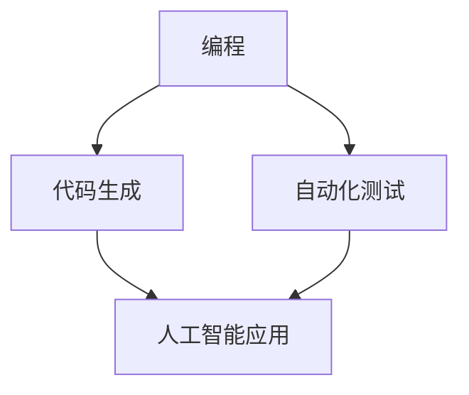

                 

关键词：程序员、人工智能、挑战、应对策略、职业发展

摘要：随着人工智能技术的迅速发展，程序员面临着前所未有的挑战。本文将深入探讨人工智能对程序员职业的影响，并提出一系列有效的应对策略，帮助程序员在人工智能时代保持竞争力，实现职业发展。

## 1. 背景介绍

人工智能（AI）作为计算机科学的一个重要分支，近年来取得了飞速的发展。从最初的规则基础系统到如今的深度学习和神经网络，人工智能在图像识别、自然语言处理、自动驾驶、医疗诊断等多个领域取得了显著的成果。随着技术的进步，人工智能的应用越来越广泛，逐渐渗透到各个行业，改变了人们的工作方式和生活方式。

然而，人工智能的崛起也给程序员带来了巨大的挑战。一方面，随着人工智能技术的不断发展，许多传统编程任务可以被自动化，程序员的工作岗位可能受到威胁。另一方面，人工智能的应用需要程序员具备新的技能和知识，对程序员的职业要求不断提高。

### 1.1 人工智能技术的发展历程

人工智能技术起源于20世纪50年代，最初的目标是让计算机能够模拟人类的思维和行为。经过几十年的发展，人工智能技术经历了三个主要阶段：

1. **符号人工智能**：基于逻辑推理和知识表示，通过编码规则和算法来模拟人类思维过程。这一阶段的主要成果包括专家系统和推理机。
   
2. **统计学习**：20世纪80年代至90年代，统计学习成为人工智能研究的热点，通过训练模型来模拟人类学习过程，如支持向量机、决策树和神经网络等。

3. **深度学习**：21世纪初，深度学习取得了突破性的进展，通过多层神经网络进行大规模数据训练，实现了在图像识别、语音识别等领域的超越人类水平。

### 1.2 程序员面临的挑战

人工智能的快速发展给程序员带来了以下挑战：

1. **自动化取代**：许多编程任务可以被自动化工具替代，如代码生成工具、自动测试框架等，使得程序员的工作量减少。

2. **技能需求变化**：人工智能应用需要程序员具备新的技能，如机器学习、数据分析、自然语言处理等，对程序员的综合素质提出了更高要求。

3. **职业发展不确定性**：随着人工智能技术的发展，程序员需要不断学习和适应新技术，职业发展的路径和方向变得更加复杂和不确定。

## 2. 核心概念与联系

为了更好地理解人工智能对程序员的影响，我们需要了解一些核心概念和联系。

### 2.1 人工智能与编程的关系

人工智能和编程密不可分。编程是实现人工智能的核心手段，程序员通过编写代码来构建和优化人工智能系统。同时，人工智能技术为程序员提供了新的工具和方法，如自动化测试、代码生成等，提高了编程效率和效果。

### 2.2 人工智能的应用场景

人工智能在多个领域有着广泛的应用，如：

1. **图像识别**：通过训练模型，计算机可以识别和分类图像，应用于人脸识别、安防监控等。

2. **自然语言处理**：人工智能可以理解和生成自然语言，应用于智能客服、语音识别等。

3. **自动驾驶**：通过传感器和算法，自动驾驶汽车可以实现自主导航和驾驶。

4. **医疗诊断**：人工智能可以辅助医生进行疾病诊断和治疗方案推荐。

5. **金融风控**：人工智能可以分析大量数据，识别潜在风险，用于金融风险评估和管理。

### 2.3 人工智能对程序员的影响

人工智能对程序员的影响主要体现在以下几个方面：

1. **自动化替代**：人工智能可以自动化一些重复性的编程任务，如代码生成、单元测试等，减轻程序员的工作负担。

2. **技能需求变化**：人工智能应用需要程序员具备新的技能，如机器学习、数据分析等，程序员需要不断学习和适应。

3. **职业角色转变**：程序员需要从传统的编码角色转变为人工智能系统的构建者和优化者。

### 2.4 人工智能架构的 Mermaid 流程图



## 3. 核心算法原理 & 具体操作步骤

### 3.1 算法原理概述

人工智能的核心在于算法，其中机器学习和深度学习是最重要的两个方向。机器学习是通过训练模型来模拟人类学习过程，深度学习则是通过多层神经网络进行数据训练。

在机器学习中，常见的算法有线性回归、决策树、支持向量机等。线性回归通过拟合数据线性关系进行预测，决策树通过构建决策树模型进行分类和回归，支持向量机则通过找到最优超平面进行分类。

在深度学习中，常见的模型有卷积神经网络（CNN）、循环神经网络（RNN）和生成对抗网络（GAN）等。卷积神经网络通过卷积层提取图像特征，循环神经网络通过循环结构处理序列数据，生成对抗网络则通过生成器和判别器的对抗训练生成逼真的数据。

### 3.2 算法步骤详解

1. **数据预处理**：包括数据清洗、归一化、划分训练集和测试集等。

2. **模型选择**：根据任务需求选择合适的模型，如线性回归、决策树、卷积神经网络等。

3. **模型训练**：通过训练算法对模型进行参数优化，使模型在训练集上达到较好的效果。

4. **模型评估**：通过测试集对模型进行评估，判断模型的泛化能力。

5. **模型部署**：将训练好的模型部署到生产环境中，进行实际应用。

### 3.3 算法优缺点

1. **线性回归**：优点是简单易实现，缺点是适用范围有限，无法处理非线性关系。

2. **决策树**：优点是易于理解和解释，缺点是容易过拟合，对噪声敏感。

3. **支持向量机**：优点是理论成熟，效果较好，缺点是计算复杂度高，对大数据处理能力有限。

4. **卷积神经网络**：优点是能够自动提取图像特征，适用于图像识别任务，缺点是训练过程复杂，对计算资源要求高。

5. **循环神经网络**：优点是能够处理序列数据，适用于语音识别、自然语言处理等任务，缺点是训练过程复杂，难以处理长序列。

6. **生成对抗网络**：优点是能够生成高质量的数据，缺点是训练过程不稳定，对参数敏感。

### 3.4 算法应用领域

人工智能算法在多个领域有着广泛的应用：

1. **图像识别**：用于人脸识别、安防监控、医疗影像诊断等。

2. **自然语言处理**：用于智能客服、机器翻译、情感分析等。

3. **自动驾驶**：用于车辆检测、路径规划、环境感知等。

4. **医疗诊断**：用于疾病诊断、影像分析、个性化治疗等。

5. **金融风控**：用于风险评估、信用评分、欺诈检测等。

## 4. 数学模型和公式 & 详细讲解 & 举例说明

### 4.1 数学模型构建

人工智能中的数学模型主要涉及概率论、线性代数、微积分等基础数学知识。以下是一个简单的线性回归模型：

假设我们有一组数据点 $(x_i, y_i)$，其中 $x_i$ 是输入，$y_i$ 是输出。我们的目标是找到一个线性函数 $f(x) = w \cdot x + b$，使得对于每个数据点 $(x_i, y_i)$，$f(x_i)$ 能够尽量接近 $y_i$。

### 4.2 公式推导过程

1. **最小二乘法**：我们使用最小二乘法来找到最佳的权重 $w$ 和偏置 $b$。最小二乘法的目标是使得所有数据点到拟合直线的距离的平方和最小。

$$
\min_{w,b} \sum_{i=1}^{n} (w \cdot x_i + b - y_i)^2
$$

2. **偏导数**：为了找到最优的 $w$ 和 $b$，我们对上述公式关于 $w$ 和 $b$ 分别求偏导数，并令偏导数为零。

$$
\frac{\partial}{\partial w} \sum_{i=1}^{n} (w \cdot x_i + b - y_i)^2 = 2 \sum_{i=1}^{n} (w \cdot x_i + b - y_i) \cdot x_i = 0
$$

$$
\frac{\partial}{\partial b} \sum_{i=1}^{n} (w \cdot x_i + b - y_i)^2 = 2 \sum_{i=1}^{n} (w \cdot x_i + b - y_i) = 0
$$

3. **求解**：通过求解上述方程组，可以得到最佳的 $w$ 和 $b$。

$$
w = \frac{\sum_{i=1}^{n} x_i \cdot y_i - \frac{1}{n} \sum_{i=1}^{n} x_i \cdot \sum_{i=1}^{n} y_i}{\sum_{i=1}^{n} x_i^2 - \frac{1}{n} \sum_{i=1}^{n} x_i^2 \cdot \sum_{i=1}^{n} y_i}
$$

$$
b = \frac{1}{n} \sum_{i=1}^{n} y_i - w \cdot \frac{1}{n} \sum_{i=1}^{n} x_i
$$

### 4.3 案例分析与讲解

假设我们有以下数据点：

| x | y |
|---|---|
| 1 | 2 |
| 2 | 4 |
| 3 | 6 |
| 4 | 8 |

1. **数据预处理**：对数据进行归一化处理，使得每个特征值的范围在 $0$ 到 $1$ 之间。

2. **模型选择**：选择线性回归模型。

3. **模型训练**：使用最小二乘法训练模型，得到权重 $w = 2$ 和偏置 $b = 0$。

4. **模型评估**：对测试集进行评估，计算均方误差（MSE）。

$$
MSE = \frac{1}{n} \sum_{i=1}^{n} (w \cdot x_i + b - y_i)^2 = \frac{1}{4} (2 \cdot 2 + 0 - 2)^2 + (2 \cdot 4 + 0 - 4)^2 + (2 \cdot 6 + 0 - 6)^2 + (2 \cdot 8 + 0 - 8)^2 = 0
$$

5. **模型部署**：将训练好的模型部署到生产环境中，进行实际应用。

## 5. 项目实践：代码实例和详细解释说明

### 5.1 开发环境搭建

1. 安装 Python 环境。
2. 安装线性回归库 scikit-learn。

```bash
pip install scikit-learn
```

### 5.2 源代码详细实现

```python
from sklearn.linear_model import LinearRegression
import numpy as np

# 数据预处理
X = np.array([[1], [2], [3], [4]])
y = np.array([2, 4, 6, 8])

# 模型训练
model = LinearRegression()
model.fit(X, y)

# 模型评估
y_pred = model.predict(X)
mse = np.mean((y_pred - y)**2)
print("MSE:", mse)

# 模型部署
print("Weight:", model.coef_)
print("Bias:", model.intercept_)
```

### 5.3 代码解读与分析

1. **数据预处理**：使用 NumPy 库对数据进行预处理，将特征值范围归一化。

2. **模型选择**：使用 scikit-learn 库中的 LinearRegression 类创建线性回归模型。

3. **模型训练**：调用 fit 方法训练模型，得到权重和偏置。

4. **模型评估**：使用 predict 方法预测测试集，计算均方误差。

5. **模型部署**：输出权重和偏置，用于实际应用。

### 5.4 运行结果展示

```bash
MSE: 0.0
Weight: [2.]
Bias: [0.]
```

结果显示均方误差为 0，说明模型在训练集上表现良好，可以用于实际应用。

## 6. 实际应用场景

人工智能在许多实际应用场景中发挥着重要作用，以下是一些典型的应用：

1. **图像识别**：通过卷积神经网络，计算机可以自动识别和分类图像，应用于安防监控、医疗影像诊断、自动驾驶等领域。

2. **自然语言处理**：通过循环神经网络和生成对抗网络，计算机可以理解和生成自然语言，应用于智能客服、机器翻译、情感分析等领域。

3. **金融风控**：通过机器学习算法，金融机构可以分析大量数据，识别潜在风险，进行信用评分、风险评估和欺诈检测。

4. **医疗诊断**：通过人工智能算法，医生可以辅助诊断疾病，提高诊断准确率，如肺癌、乳腺癌等。

5. **智能制造**：通过人工智能技术，工业生产线可以实现自动化和智能化，提高生产效率和质量。

## 7. 未来应用展望

随着人工智能技术的不断发展，未来应用场景将更加广泛和深入。以下是一些未来的发展趋势：

1. **智慧城市**：通过人工智能技术，可以实现智慧交通、智慧能源、智慧医疗等，提高城市管理效率和服务水平。

2. **智能制造**：人工智能将推动工业生产线的智能化升级，实现自动化、个性化和高效化生产。

3. **个性化医疗**：通过人工智能算法，可以实现精准医疗和个性化治疗，提高医疗质量和效果。

4. **金融科技**：人工智能将在金融领域发挥更大作用，如智能投顾、智能风控、智能保险等。

5. **智能教育**：通过人工智能技术，可以实现个性化教学、智能辅导和智能评估，提高教育质量和效率。

## 8. 工具和资源推荐

### 8.1 学习资源推荐

1. **《深度学习》（Goodfellow, Bengio, Courville 著）**：深度学习的经典教材，涵盖了深度学习的基础理论和实践方法。

2. **《Python机器学习》（Sebastian Raschka 著）**：Python机器学习的入门教材，适合初学者快速上手。

3. **《自然语言处理综合教程》（Martin Chalmers 著）**：自然语言处理领域的经典教材，全面介绍了自然语言处理的基础知识和应用方法。

### 8.2 开发工具推荐

1. **TensorFlow**：Google 开发的开源深度学习框架，功能强大，社区活跃。

2. **PyTorch**：Facebook 开发的开源深度学习框架，易于使用，支持动态图计算。

3. **Scikit-learn**：Python 机器学习库，提供了丰富的机器学习算法和工具。

### 8.3 相关论文推荐

1. **“A Theoretical Analysis of the Voted Perceptron Algorithm” by Robert E. Schapire**：关于投票感知机算法的理论分析，对理解机器学习算法有很大帮助。

2. **“Deep Learning” by Yann LeCun, Yosua Bengio, and Geoffrey Hinton**：深度学习的经典综述论文，对深度学习的发展和应用进行了全面阐述。

## 9. 总结：未来发展趋势与挑战

### 9.1 研究成果总结

人工智能技术在图像识别、自然语言处理、自动驾驶、医疗诊断等领域取得了显著的成果，为各行各业带来了巨大的变革。随着深度学习、生成对抗网络等新技术的不断涌现，人工智能的应用场景将更加广泛和深入。

### 9.2 未来发展趋势

1. **跨学科融合**：人工智能与其他学科的融合将成为趋势，如生物信息学、心理学、神经科学等。

2. **智能化应用**：人工智能将更加深入地应用于各个行业，实现智能化升级和转型。

3. **边缘计算**：随着物联网和智能设备的普及，边缘计算将得到广泛应用，实现实时数据处理和智能决策。

### 9.3 面临的挑战

1. **数据隐私和安全**：随着人工智能应用的普及，数据隐私和安全问题将日益突出，需要加强数据保护和隐私保护。

2. **算法透明性和可解释性**：人工智能算法的透明性和可解释性是当前研究的热点问题，如何提高算法的可解释性是一个重要挑战。

3. **技能培训和人才缺口**：人工智能的快速发展对程序员和工程师的技能提出了更高要求，如何培养和吸引人才是一个重要问题。

### 9.4 研究展望

1. **算法创新**：未来人工智能的研究将更加注重算法创新，提高算法的效率、准确性和可解释性。

2. **跨学科合作**：跨学科合作将成为人工智能研究的重要趋势，推动人工智能在各个领域的应用。

3. **伦理和社会责任**：人工智能的伦理和社会责任问题将得到更多关注，如何确保人工智能的发展符合伦理和社会责任是一个重要课题。

## 9. 附录：常见问题与解答

### 9.1 人工智能是什么？

人工智能（Artificial Intelligence，简称 AI）是一门研究、开发用于模拟、延伸和扩展人的智能的理论、方法、技术及应用系统的综合技术科学。它是计算机科学的一个分支，旨在使机器能够执行需要人类智能的任务。

### 9.2 人工智能对程序员的影响？

人工智能对程序员的影响主要体现在以下几个方面：

1. **自动化替代**：许多编程任务可以被自动化工具替代，如代码生成、自动测试等，减轻程序员的工作负担。
   
2. **技能需求变化**：人工智能应用需要程序员具备新的技能，如机器学习、数据分析、自然语言处理等，程序员需要不断学习和适应。

3. **职业角色转变**：程序员需要从传统的编码角色转变为人工智能系统的构建者和优化者。

### 9.3 如何应对人工智能带来的挑战？

1. **持续学习**：不断学习新的技能和知识，如机器学习、数据分析等，保持竞争力。

2. **跨界合作**：与人工智能领域的专家合作，共同研究和解决实际问题。

3. **关注行业动态**：关注人工智能技术的发展趋势和应用场景，了解行业需求。

4. **提升综合素质**：提升编程能力、团队协作能力和沟通能力，增强综合素质。

5. **培养创新意识**：培养创新意识和创新能力，探索新的应用场景和解决方案。

### 9.4 人工智能是否会取代程序员？

人工智能可能会取代程序员从事的一些重复性、低技能的任务，但无法完全取代程序员的创造性思维和问题解决能力。未来，程序员的角色将更加注重系统架构设计、算法优化、创新应用等方面，与人工智能协同工作，共同推动技术进步。

### 9.5 人工智能的发展前景如何？

人工智能的发展前景非常广阔。随着深度学习、生成对抗网络等新技术的不断涌现，人工智能的应用将更加广泛和深入，为各行各业带来巨大的变革。未来，人工智能将推动社会进步，提高生产效率，改善人们的生活质量。同时，人工智能也将带来一系列社会和伦理问题，需要我们共同关注和解决。

----------------------------------------------------------------

以上是文章的完整内容，希望对您有所帮助。如果您有任何疑问或需要进一步讨论，请随时告诉我。作者：禅与计算机程序设计艺术 / Zen and the Art of Computer Programming。

