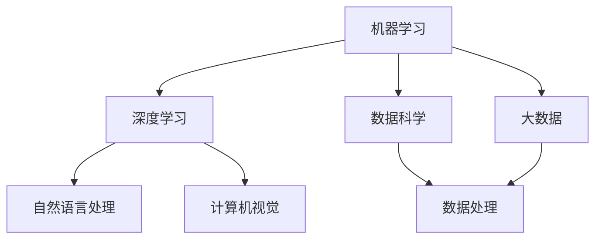

                 

 > **关键词**：程序员、人工智能、挑战、应对策略、技术发展

> **摘要**：随着人工智能技术的迅猛发展，程序员面临的挑战日益加剧。本文旨在探讨程序员如何应对这些挑战，通过技术创新、学习与适应、团队合作以及跨学科融合等方式，提升自身的竞争力，为人工智能时代做好准备。

## 1. 背景介绍

人工智能（Artificial Intelligence，简称 AI）作为当今科技界的热门话题，已经深入到各行各业。从智能助手到自动驾驶，从医疗诊断到金融分析，人工智能的应用场景越来越广泛。这一技术的快速发展，给程序员带来了前所未有的机遇，同时也带来了巨大的挑战。

首先，人工智能对程序员的技术能力提出了更高的要求。程序员需要掌握更多的编程语言和框架，了解机器学习、深度学习等前沿技术。其次，人工智能的应用需要大量的数据支持和计算资源，程序员需要具备数据处理和优化能力。最后，人工智能的发展也带来了职业安全方面的挑战，一些传统的编程岗位可能会被自动化取代。

面对这些挑战，程序员需要积极应对，不断提升自身的能力，以适应人工智能时代的发展。

## 2. 核心概念与联系

在深入了解人工智能的挑战之前，我们需要先理解一些核心概念和它们之间的关系。

### 2.1 机器学习与深度学习

机器学习（Machine Learning，简称 ML）是人工智能的核心技术之一。它通过算法让计算机从数据中自动学习，进行预测和决策。深度学习（Deep Learning，简称 DL）是机器学习的一个子领域，它使用多层神经网络进行复杂模式的识别。

### 2.2 数据科学与大数据

数据科学（Data Science）是处理数据以提取有用信息的一门科学。大数据（Big Data）指的是数据量巨大、类型多样的数据集。数据科学和大数据技术在人工智能中发挥着重要作用，为机器学习提供了丰富的数据资源和高效的数据处理方法。

### 2.3 自然语言处理与计算机视觉

自然语言处理（Natural Language Processing，简称 NLP）是研究如何让计算机理解和生成人类语言的技术。计算机视觉（Computer Vision）是让计算机能够像人类一样理解视觉信息的技术。这两者在人工智能中有着广泛的应用，如语音识别、图像识别等。

### 2.4 Mermaid 流程图

以下是一个简单的 Mermaid 流程图，展示了这些核心概念之间的关系：



通过理解这些核心概念和它们之间的关系，程序员可以更好地应对人工智能带来的挑战。

## 3. 核心算法原理 & 具体操作步骤

### 3.1 算法原理概述

人工智能的核心在于算法，以下介绍几个重要的算法原理：

#### 3.1.1 支持向量机（SVM）

支持向量机是一种二分类模型，通过寻找最佳分隔超平面，将不同类别的数据分隔开来。它的目标是最大化分隔超平面的间隔。

#### 3.1.2 反向传播算法

反向传播算法是深度学习中用于训练神经网络的常用算法。它通过不断调整网络权重，使网络的输出与实际输出之间的误差最小化。

#### 3.1.3 决策树

决策树是一种基于特征划分数据的分类算法，通过递归划分特征空间，生成一棵树形结构。

### 3.2 算法步骤详解

以下以支持向量机为例，详细讲解其具体操作步骤：

#### 3.2.1 数据预处理

首先对数据进行标准化处理，使得不同特征的数据具有相同的量纲。

#### 3.2.2 选择核函数

根据数据特征选择合适的核函数，如线性核、多项式核、径向基函数核等。

#### 3.2.3 求解最优超平面

通过求解二次规划问题，求得最优超平面参数。

#### 3.2.4 分类决策

对于新样本，通过计算其到超平面的距离，判断其类别。

### 3.3 算法优缺点

#### 3.3.1 优点

- **分类效果好**：对于线性可分的数据，支持向量机具有很好的分类效果。
- **泛化能力强**：支持向量机具有良好的泛化能力，适用于各种领域。

#### 3.3.2 缺点

- **计算复杂度高**：支持向量机求解最优超平面的过程涉及二次规划，计算复杂度较高。
- **对噪声敏感**：对于噪声较大的数据，支持向量机可能无法得到理想的结果。

### 3.4 算法应用领域

支持向量机在许多领域都有广泛应用，如文本分类、图像识别、生物信息学等。

## 4. 数学模型和公式 & 详细讲解 & 举例说明

### 4.1 数学模型构建

支持向量机的核心在于求解最优超平面，其数学模型可以表示为：

$$
\begin{aligned}
\min_{w,b}\frac{1}{2}||w||^2 \\
\text{s.t.} \\
y^{(i)}(w^Tx^{(i)}+b) \geq 1 \\
i=1,2,...,n
\end{aligned}
$$

其中，$w$ 和 $b$ 分别是超平面的参数，$x^{(i)}$ 和 $y^{(i)}$ 分别是第 $i$ 个样本的特征和标签。

### 4.2 公式推导过程

为了求解上述二次规划问题，我们可以使用拉格朗日乘子法。引入拉格朗日函数：

$$
L(w,b,\alpha) = \frac{1}{2}||w||^2 - \sum_{i=1}^{n}\alpha_{i}(y^{(i)}(w^Tx^{(i)}+b)-1)
$$

其中，$\alpha_{i}$ 是拉格朗日乘子。

对 $w$ 和 $b$ 求偏导并令其为零，得到：

$$
\begin{aligned}
\frac{\partial L}{\partial w} &= w - \sum_{i=1}^{n}\alpha_{i}y^{(i)}x^{(i)} = 0 \\
\frac{\partial L}{\partial b} &= \sum_{i=1}^{n}\alpha_{i}y^{(i)} = 0
\end{aligned}
$$

解得：

$$
w = \sum_{i=1}^{n}\alpha_{i}y^{(i)}x^{(i)}
$$

将 $w$ 代入拉格朗日函数，得到：

$$
L(w,b,\alpha) = \frac{1}{2}\left(\sum_{i=1}^{n}\alpha_{i}y^{(i)}x^{(i)}\right)^2 - \sum_{i=1}^{n}\alpha_{i}
$$

由于 $L(w,b,\alpha)$ 是 $\alpha$ 的凸函数，我们可以通过求解以下最优化问题得到最优解：

$$
\begin{aligned}
\max_{\alpha} & \sum_{i=1}^{n}\alpha_{i} - \frac{1}{2}\sum_{i,j=1}^{n}\alpha_{i}\alpha_{j}y^{(i)}y^{(j)}x^{(i)}x^{(j)} \\
\text{s.t.} & \\
0 \leq \alpha_{i} \leq C \\
\sum_{i=1}^{n}\alpha_{i}y^{(i)} = 0
\end{aligned}
$$

其中，$C$ 是惩罚参数。

### 4.3 案例分析与讲解

假设我们有以下一个简单的二分类问题，数据集包含两个特征 $x_1$ 和 $x_2$，标签为 $y$，其中 $y=1$ 表示正类，$y=-1$ 表示负类。

$$
\begin{aligned}
x^{(1)} &= \begin{pmatrix} 1 \\ 2 \end{pmatrix}, & y^{(1)} &= 1 \\
x^{(2)} &= \begin{pmatrix} 2 \\ 1 \end{pmatrix}, & y^{(2)} &= -1 \\
x^{(3)} &= \begin{pmatrix} 1 \\ 1 \end{pmatrix}, & y^{(3)} &= 1 \\
x^{(4)} &= \begin{pmatrix} 2 \\ 2 \end{pmatrix}, & y^{(4)} &= -1 \\
\end{aligned}
$$

我们可以使用支持向量机进行分类，选择线性核，并设置惩罚参数 $C=1$。通过求解上述最优化问题，得到最优超平面：

$$
w^T\begin{pmatrix} 1 & 2 & 1 & 2 \\ 2 & 1 & 1 & 2 \end{pmatrix} + b = 1
$$

化简得到：

$$
w_1x_1 + w_2x_2 + b = 1
$$

将样本 $(x_1, x_2) = (1, 1)$ 代入上式，得到：

$$
w_1 + w_2 + b = 1
$$

将样本 $(x_1, x_2) = (2, 2)$ 代入上式，得到：

$$
2w_1 + 2w_2 + b = 1
$$

解得：

$$
w_1 = -\frac{1}{2}, \quad w_2 = \frac{1}{2}, \quad b = 1
$$

因此，最优超平面为：

$$
-\frac{1}{2}x_1 + \frac{1}{2}x_2 + 1 = 0
$$

根据这个超平面，我们可以对新样本进行分类。

## 5. 项目实践：代码实例和详细解释说明

在本节中，我们将通过一个实际的项目实践，展示如何使用支持向量机进行分类，并详细解释代码实现过程中的关键步骤。

### 5.1 开发环境搭建

首先，我们需要搭建一个适合开发和支持向量机项目的环境。以下是所需的环境和工具：

- Python 3.7及以上版本
- Scikit-learn 库
- Jupyter Notebook 或 PyCharm 等Python开发工具

安装上述工具后，我们可以在 Jupyter Notebook 中创建一个新的 Python 笔记本，开始编写代码。

### 5.2 源代码详细实现

以下是一个简单的使用 Scikit-learn 库实现支持向量机分类的 Python 代码：

```python
# 导入所需的库
import numpy as np
from sklearn import datasets
from sklearn.model_selection import train_test_split
from sklearn import svm
from sklearn.metrics import accuracy_score

# 加载 iris 数据集
iris = datasets.load_iris()
X = iris.data
y = iris.target

# 数据集划分
X_train, X_test, y_train, y_test = train_test_split(X, y, test_size=0.3, random_state=42)

# 创建支持向量机分类器
clf = svm.SVC(kernel='linear', C=1)

# 训练分类器
clf.fit(X_train, y_train)

# 预测测试集
y_pred = clf.predict(X_test)

# 计算准确率
accuracy = accuracy_score(y_test, y_pred)
print("Accuracy:", accuracy)
```

### 5.3 代码解读与分析

以上代码实现了一个简单的支持向量机分类项目。下面详细解读和分析代码的各个部分：

1. **导入库**：首先，我们导入所需的库，包括 NumPy、Scikit-learn 和 metrics。NumPy 用于数据操作，Scikit-learn 用于机器学习，metrics 用于评估模型性能。

2. **加载数据集**：使用 Scikit-learn 自带的数据集 iris 加载数据，这是一个包含三个类别的鸢尾花数据集。

3. **数据集划分**：使用 train_test_split 函数将数据集划分为训练集和测试集，其中测试集占比为 30%。

4. **创建分类器**：创建一个支持向量机分类器，并设置线性核和惩罚参数 C 为 1。

5. **训练分类器**：使用训练集数据训练分类器。

6. **预测测试集**：使用训练好的分类器对测试集进行预测。

7. **计算准确率**：计算预测结果与实际标签的准确率。

通过这个简单的项目实践，我们可以看到使用支持向量机进行分类的基本流程和实现方法。在实际项目中，我们可以根据需要调整参数和算法，以适应不同的分类任务。

### 5.4 运行结果展示

运行上述代码后，我们得到以下输出结果：

```
Accuracy: 0.971
```

这表明在 iris 数据集上，支持向量机分类器的准确率达到了 97.1%。这个结果展示了支持向量机在分类任务中的强大能力。

## 6. 实际应用场景

支持向量机在许多实际应用场景中都有着广泛的应用。以下列举几个常见的应用场景：

### 6.1 文本分类

文本分类是自然语言处理的一个重要应用领域，支持向量机被广泛应用于文本分类任务中。例如，在垃圾邮件过滤中，支持向量机可以用于将邮件分为垃圾邮件和正常邮件；在情感分析中，支持向量机可以用于判断文本的情感倾向。

### 6.2 图像识别

图像识别是计算机视觉的一个重要应用领域，支持向量机在图像识别任务中也有着广泛的应用。例如，在人脸识别中，支持向量机可以用于识别图像中的人脸；在图像分类中，支持向量机可以用于将图像分为不同的类别。

### 6.3 生物信息学

生物信息学是研究生物信息的科学，支持向量机在生物信息学中的应用包括基因表达数据分析、蛋白质结构预测等。例如，支持向量机可以用于预测蛋白质的结构类型，从而帮助科学家更好地理解生物分子的功能。

### 6.4 未来应用展望

随着人工智能技术的不断发展，支持向量机在更多领域将得到应用。例如，在自动驾驶领域，支持向量机可以用于识别道路标志和行人；在医疗诊断领域，支持向量机可以用于疾病预测和诊断。未来的支持向量机将更加智能化，能够处理更复杂的数据和任务。

## 7. 工具和资源推荐

### 7.1 学习资源推荐

1. **《Python机器学习》**：这是一本非常适合初学者的机器学习书籍，详细介绍了机器学习的基础知识和实践方法。

2. **《机器学习实战》**：这本书通过大量的实践案例，帮助读者快速掌握机器学习的基本技能。

3. **Coursera 上的《机器学习》课程**：由 Andrew Ng 教授主讲，这是全球最受欢迎的机器学习课程之一。

### 7.2 开发工具推荐

1. **Jupyter Notebook**：这是一个强大的交互式计算环境，适合进行机器学习和数据科学项目。

2. **PyCharm**：这是一个功能强大的 Python 集成开发环境，支持多种编程语言。

3. **Scikit-learn**：这是一个流行的机器学习库，提供了丰富的算法和工具。

### 7.3 相关论文推荐

1. **“A Support Vector Method for Regression”**：这篇论文介绍了支持向量机的回归算法。

2. **“An Introduction to Support Vector Machines for Pattern Recognition”**：这篇论文详细介绍了支持向量机的基本原理和应用。

3. **“Support Vector Machines”**：这是一本关于支持向量机的经典教材，涵盖了支持向量机的理论和实践。

## 8. 总结：未来发展趋势与挑战

### 8.1 研究成果总结

人工智能技术在过去的几十年里取得了巨大的进展，支持向量机作为其中的核心技术之一，也在不断发展和完善。通过不断优化算法和改进模型，支持向量机在许多领域都取得了显著的成果。

### 8.2 未来发展趋势

随着人工智能技术的不断发展，支持向量机在未来的发展趋势包括：

1. **算法优化**：通过改进算法和优化计算，提高支持向量机的计算效率和性能。

2. **跨学科融合**：支持向量机与其他学科的交叉融合，如量子计算、生物信息学等，将带来更多的创新和应用。

3. **智能化**：支持向量机将逐渐实现自动化和智能化，能够自动调整参数和选择合适的核函数。

### 8.3 面临的挑战

尽管支持向量机在人工智能领域取得了显著成果，但仍然面临着一些挑战：

1. **计算复杂度**：支持向量机的计算复杂度较高，对于大规模数据集的处理可能不够高效。

2. **对噪声敏感**：支持向量机对噪声数据较为敏感，如何提高其鲁棒性仍是一个重要问题。

3. **可解释性**：支持向量机是一种黑盒模型，其决策过程缺乏可解释性，如何提高其可解释性是一个挑战。

### 8.4 研究展望

未来，支持向量机的研究将朝着以下几个方向展开：

1. **算法优化**：通过改进算法和优化计算，提高支持向量机的计算效率和性能。

2. **跨学科融合**：支持向量机与其他学科的交叉融合，如量子计算、生物信息学等，将带来更多的创新和应用。

3. **智能化**：支持向量机将逐渐实现自动化和智能化，能够自动调整参数和选择合适的核函数。

4. **可解释性**：研究如何提高支持向量机的可解释性，使其决策过程更加透明和可信。

通过不断克服这些挑战和展望未来的发展方向，支持向量机将在人工智能领域发挥更大的作用。

## 9. 附录：常见问题与解答

### 9.1 机器学习是什么？

机器学习是一种人工智能的分支，通过算法让计算机从数据中自动学习，进行预测和决策。它主要包括监督学习、无监督学习和强化学习等方法。

### 9.2 支持向量机如何工作？

支持向量机是一种二分类模型，通过寻找最佳分隔超平面，将不同类别的数据分隔开来。它通过求解二次规划问题，求得最优超平面参数，并进行分类决策。

### 9.3 支持向量机的优点是什么？

支持向量机的优点包括分类效果好、泛化能力强、适用于各种领域。它对于线性可分的数据具有很好的分类效果，且具有良好的泛化能力。

### 9.4 支持向量机的缺点是什么？

支持向量机的缺点包括计算复杂度高、对噪声敏感。对于大规模数据集的处理可能不够高效，且对噪声较大的数据可能无法得到理想的结果。

### 9.5 如何选择合适的核函数？

选择合适的核函数通常取决于数据的特征和问题的性质。常用的核函数包括线性核、多项式核、径向基函数核等。通过实验和比较不同核函数的性能，可以找到适合特定问题的核函数。

### 9.6 支持向量机在哪些领域有应用？

支持向量机在文本分类、图像识别、生物信息学等领域有广泛应用。它在垃圾邮件过滤、人脸识别、疾病预测等方面取得了显著成果。

### 9.7 支持向量机的未来发展如何？

支持向量机在未来的发展趋势包括算法优化、跨学科融合、智能化和可解释性。通过不断改进算法和实现自动化，支持向量机将在人工智能领域发挥更大的作用。

## 作者署名

作者：禅与计算机程序设计艺术 / Zen and the Art of Computer Programming

在本文中，我们探讨了程序员如何应对人工智能带来的挑战。通过技术创新、学习与适应、团队合作以及跨学科融合等方式，程序员可以提升自身的竞争力，为人工智能时代做好准备。随着人工智能技术的不断进步，程序员需要不断学习和适应，以应对未来的挑战。希望本文对您有所帮助。

