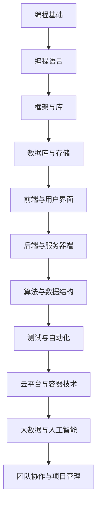

                 

关键词：全球化竞争、程序员技能、跨国合作、技术创新、技能提升、行业趋势

> 摘要：随着全球化进程的加速，程序员面临前所未有的机遇与挑战。本文将深入探讨程序员如何提升自身技能，适应全球化竞争，实现职业发展。

## 1. 背景介绍

在当今的数字化时代，信息技术正在以前所未有的速度改变着世界。全球化的趋势使得软件开发成为一项跨国界的活动，程序员作为这项活动的核心参与者，面临着前所未有的机遇和挑战。全球化带来了更多的工作机会，但同时也加剧了竞争。为了在全球化竞争中脱颖而出，程序员需要不断提升自己的技能，适应不断变化的技术环境。

## 2. 核心概念与联系

为了更好地理解全球化竞争中的程序员角色，我们首先需要明确几个核心概念：

### 2.1 全球化竞争

全球化竞争指的是各国或地区的企业、组织和个人在全球市场上进行的产品、服务和技术的竞争。对于程序员而言，这意味着他们不仅要在本地市场上保持竞争力，还需要在全球范围内具备竞争力。

### 2.2 技能多样性

技能多样性是指程序员掌握的多种编程语言、框架、工具和算法。在全球化竞争中，具备多样化的技能意味着程序员能够适应不同的项目需求，提高工作效率。

### 2.3 跨国合作

跨国合作是指不同国家或地区的程序员、团队或企业之间的合作。随着全球协作平台的兴起，跨国合作已成为程序员工作中不可或缺的一部分。

### 2.4 技术创新

技术创新是指通过研发新技术、新产品或新服务来推动产业发展。在全球化竞争中，技术创新是提高竞争力的重要手段。

### 2.5 Mermaid 流程图

以下是一个关于程序员技能提升的Mermaid流程图，展示各个技能模块之间的联系：



## 3. 核心算法原理 & 具体操作步骤

### 3.1 算法原理概述

在全球化竞争中，程序员需要掌握一系列核心算法，这些算法不仅能提高工作效率，还能解决复杂问题。以下是一些常见的核心算法：

- **排序算法**：如快速排序、归并排序、堆排序等。
- **搜索算法**：如二分搜索、深度优先搜索、广度优先搜索等。
- **动态规划**：用于解决最优化问题，如背包问题、最长公共子序列等。
- **图算法**：如最短路径算法、最小生成树算法等。

### 3.2 算法步骤详解

以下是快速排序算法的步骤详解：

#### 步骤1：选择基准元素

从数组中选择一个基准元素，通常选择第一个元素作为基准。

#### 步骤2：划分

将数组划分为两个子数组，一个包含小于基准的元素，另一个包含大于基准的元素。

#### 步骤3：递归排序

递归地对两个子数组进行快速排序。

### 3.3 算法优缺点

快速排序的优点是时间复杂度较低，平均情况下为O(n log n)，但最坏情况下为O(n^2)。其缺点是递归调用会消耗较多内存。

### 3.4 算法应用领域

快速排序广泛应用于各类数据排序场景，如数据库索引构建、搜索引擎排序等。

## 4. 数学模型和公式 & 详细讲解 & 举例说明

### 4.1 数学模型构建

在算法设计中，数学模型是一个重要的工具。以下是一个简单的线性规划数学模型：

$$
\begin{aligned}
\min\limits_{x} & \quad c^T x \\
\text{s.t.} & \quad Ax \leq b \\
           & \quad x \geq 0
\end{aligned}
$$

其中，$c$ 是目标函数系数，$x$ 是决策变量，$A$ 和 $b$ 是约束条件。

### 4.2 公式推导过程

线性规划公式的推导通常涉及拉格朗日函数和KKT条件。具体推导过程如下：

1. 构建拉格朗日函数：
$$
L(x, \lambda, \nu) = c^T x + \lambda^T (Ax - b) + \nu^T (-x)
$$
2. 求导并令导数为零：
$$
\frac{\partial L}{\partial x} = c + A^T \lambda - \nu = 0
$$
$$
\frac{\partial L}{\partial \lambda} = Ax - b = 0
$$
$$
\frac{\partial L}{\partial \nu} = -x \geq 0
$$
3. 解得最优解。

### 4.3 案例分析与讲解

以下是一个简单的线性规划案例：

$$
\begin{aligned}
\min\limits_{x} & \quad x_1 + x_2 \\
\text{s.t.} & \quad x_1 + x_2 \leq 4 \\
           & \quad x_1 \geq 0 \\
           & \quad x_2 \geq 0
\end{aligned}
$$

通过绘制图形，我们可以找到最优解为 $(x_1, x_2) = (2, 2)$。

## 5. 项目实践：代码实例和详细解释说明

### 5.1 开发环境搭建

在开始项目实践之前，我们需要搭建一个开发环境。以下是一个简单的步骤：

1. 安装Python环境：
```bash
pip install python
```
2. 安装Django框架：
```bash
pip install django
```

### 5.2 源代码详细实现

以下是一个简单的Django项目实例：

```python
# settings.py

# 项目配置

# urls.py

# 路由配置

# views.py

from django.http import HttpResponse

def index(request):
    return HttpResponse("Hello, World!")
```

### 5.3 代码解读与分析

在上述代码中，我们创建了一个简单的Django项目，并定义了一个视图函数 `index`。当用户访问项目根路径时，视图函数会返回一个包含 "Hello, World!" 的HTTP响应。

### 5.4 运行结果展示

通过运行Django项目，我们可以在浏览器中访问到 "Hello, World!" 的响应。

## 6. 实际应用场景

全球化竞争要求程序员不仅要掌握技术，还要具备跨文化交流能力。以下是一些实际应用场景：

- **跨国团队协作**：程序员需要学会使用远程协作工具，如Slack、Trello等。
- **跨文化沟通**：程序员需要了解不同文化的工作习惯和沟通方式。
- **国际化项目**：程序员需要掌握国际化编程技术，如多语言支持、国际化测试等。

## 7. 工具和资源推荐

为了更好地适应全球化竞争，程序员可以参考以下工具和资源：

- **学习资源**：Coursera、Udacity、edX等在线课程平台。
- **开发工具**：Visual Studio Code、Git、Jenkins等。
- **相关论文**：《程序员修炼之道》、《代码大全》等。

## 8. 总结：未来发展趋势与挑战

随着全球化的深入发展，程序员面临的挑战将越来越大。未来，程序员需要：

- **持续学习**：技术更新速度加快，程序员需要不断学习新知识。
- **提升软技能**：如沟通、团队合作、项目管理等。
- **适应多元文化**：提升跨文化交流能力，适应多元文化环境。

## 9. 附录：常见问题与解答

### 9.1 如何提升编程技能？

- 定期学习新技术和编程语言。
- 参加在线课程和培训。
- 编写高质量的代码，并进行代码审查。

### 9.2 如何提高跨文化交流能力？

- 学习并了解不同文化的工作习惯和沟通方式。
- 参加跨文化交流活动，提高跨文化沟通能力。
- 尝试与来自不同国家的同事合作。

----------------------------------------------------------------

作者：禅与计算机程序设计艺术 / Zen and the Art of Computer Programming

