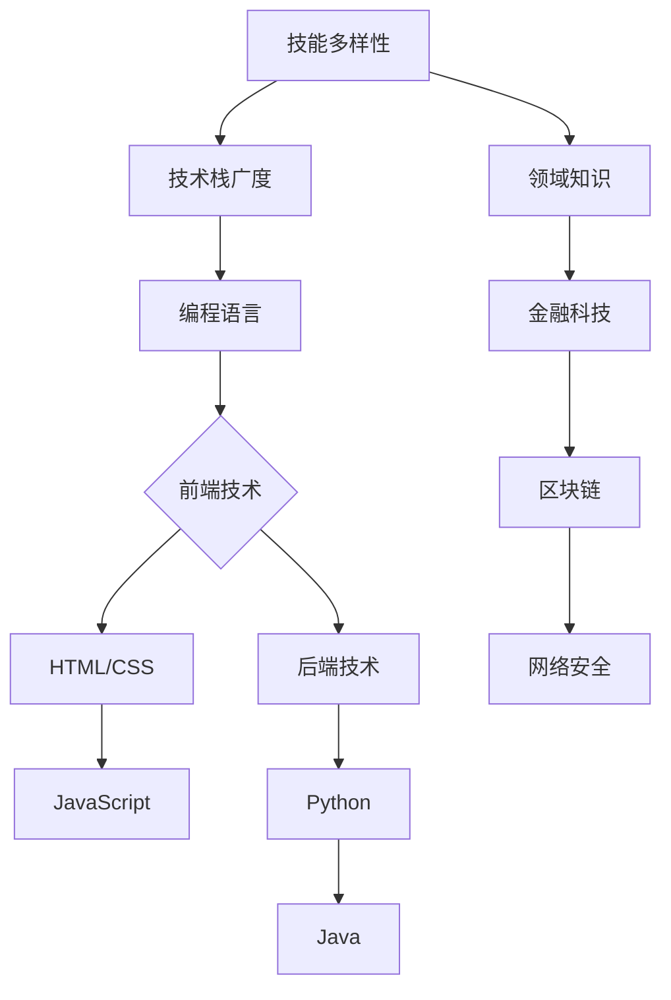
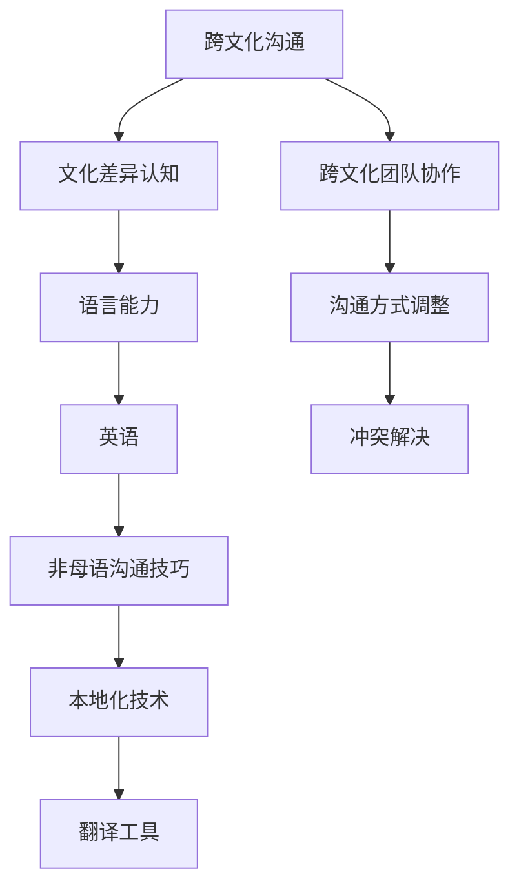

                 

关键词：全球化，程序员，技能提升，职业发展，国际市场，技术交流

> 摘要：随着全球化进程的不断深入，程序员面临着前所未有的竞争环境和机遇。本文从多个角度探讨了程序员如何提升自身技能，适应全球化竞争，并在国际市场中获得优势。

## 1. 背景介绍

在当今世界，信息技术已经成为推动经济发展和社会进步的关键力量。全球化的趋势使得各国之间的技术交流更加频繁，程序员的工作机会和挑战也日益增加。一方面，程序员面临着来自全球同行的激烈竞争；另一方面，他们也获得了更多的合作和成长机会。如何应对全球化竞争，成为每个程序员都需要思考的问题。

### 1.1 全球化带来的挑战

1. **技能竞争**：随着技术的快速发展，程序员需要不断更新自己的技能，以应对新的挑战。
2. **工作压力**：全球化使得程序员需要面对更多的竞争和压力，如何在竞争激烈的环境中保持优势？
3. **文化差异**：程序员需要与来自不同国家和文化背景的同事合作，这要求他们具备跨文化沟通的能力。

### 1.2 全球化带来的机遇

1. **工作机会**：全球化带来了更多的跨国公司和远程工作机会，程序员可以获得更广阔的职业发展空间。
2. **技能提升**：通过与全球顶尖程序员的合作和交流，程序员可以学习到更多的先进技术和经验。
3. **市场拓展**：程序员可以利用全球化优势，开拓国际市场，为企业带来更多商机。

## 2. 核心概念与联系

### 2.1 技能多样性

**Mermaid 流程图：**



### 2.2 跨文化沟通

**Mermaid 流程图：**



## 3. 核心算法原理 & 具体操作步骤

### 3.1 算法原理概述

全球化竞争中的程序员需要掌握多种核心算法，如排序算法、搜索算法、数据结构等。以下是一个简单的排序算法——快速排序的原理概述：

**快速排序（Quick Sort）：**

1. 选择一个基准元素。
2. 将数组划分为两个子数组，一个包含小于基准元素的元素，另一个包含大于基准元素的元素。
3. 递归地对两个子数组进行快速排序。

### 3.2 算法步骤详解

**快速排序步骤：**

1. 选择基准元素（通常选择数组的第一个或最后一个元素）。
2. 创建两个空数组，用于存储小于和大于基准元素的子数组。
3. 遍历数组，将小于基准元素的元素添加到第一个子数组，将大于基准元素的元素添加到第二个子数组。
4. 递归地对两个子数组进行快速排序。
5. 将排序好的子数组合并，得到最终排序结果。

### 3.3 算法优缺点

**优点：**

1. 时间复杂度较低，平均情况下为 \(O(n \log n)\)。
2. 支持原地排序，不需要额外的空间。

**缺点：**

1. 最坏情况下的时间复杂度为 \(O(n^2)\)，通常发生在输入数据已经有序的情况下。
2. 选择基准元素的方式可能影响排序性能。

### 3.4 算法应用领域

快速排序广泛应用于各种场景，如数据库排序、文件排序等。特别是在处理大数据时，快速排序是一个高效的选择。

## 4. 数学模型和公式 & 详细讲解 & 举例说明

### 4.1 数学模型构建

在全球化竞争中，程序员需要掌握一些基本的数学模型和公式，如线性规划、决策树等。以下是一个简单的线性规划模型：

**目标函数：**最大化或最小化目标函数 \(z = c_1x_1 + c_2x_2 + ... + c_nx_n\)

**约束条件：**

\[
\begin{cases}
a_{11}x_1 + a_{12}x_2 + ... + a_{1n}x_n \leq b_1 \\
a_{21}x_1 + a_{22}x_2 + ... + a_{2n}x_n \leq b_2 \\
\vdots \\
a_{m1}x_1 + a_{m2}x_2 + ... + a_{mn}x_n \leq b_m \\
x_1, x_2, ..., x_n \geq 0
\end{cases}
\]

### 4.2 公式推导过程

线性规划模型的求解通常采用单纯形法。以下是单纯形法的基本步骤：

1. **初始基本可行解**：选择一组非负基本可行解，通常选择目标函数中的系数最大的变量作为进入变量。
2. **迭代优化**：在保持基本可行解的前提下，通过调整变量值，使目标函数值逐步优化。
3. **终止条件**：当所有进入变量的系数都小于等于零时，算法终止，得到最优解。

### 4.3 案例分析与讲解

假设有一个生产问题，需要生产两种产品 A 和 B，每种产品都需要经过加工过程 1 和 2。每个产品在加工过程中的时间和利润如下表：

| 产品 | 加工时间 1 | 加工时间 2 | 利润   |
| ---- | ---------- | ---------- | ---- |
| A    | 2          | 4          | 300  |
| B    | 3          | 1          | 400  |

每天工厂有 10 个小时的生产时间，求解生产计划。

**目标函数：**最大化总利润 \(z = 300x_1 + 400x_2\)

**约束条件：**

\[
\begin{cases}
2x_1 + 3x_2 \leq 10 \\
4x_1 + x_2 \leq 10 \\
x_1, x_2 \geq 0
\end{cases}
\]

通过单纯形法求解，得到最优解为 \(x_1 = 2, x_2 = 2\)，总利润为 1300。

## 5. 项目实践：代码实例和详细解释说明

### 5.1 开发环境搭建

为了演示一个简单的全球化竞争相关的项目，我们将使用 Python 和 Flask 搭建一个简单的 Web 应用。以下是开发环境的搭建步骤：

1. 安装 Python 3.8 或更高版本。
2. 安装 Flask 模块：`pip install Flask`
3. 创建一个名为 `app.py` 的文件，用于编写 Flask 应用代码。

### 5.2 源代码详细实现

以下是一个简单的 Flask 应用示例：

```python
from flask import Flask, request, jsonify

app = Flask(__name__)

@app.route('/api/competition', methods=['POST'])
def competition():
    data = request.get_json()
    skill_score = data.get('skill_score', 0)
    experience_score = data.get('experience_score', 0)
    language_score = data.get('language_score', 0)

    total_score = skill_score + experience_score + language_score
    return jsonify({'total_score': total_score})

if __name__ == '__main__':
    app.run(debug=True)
```

### 5.3 代码解读与分析

1. **Flask 应用创建**：使用 `Flask(__name__)` 创建一个 Flask 应用对象。
2. **路由定义**：使用 `@app.route('/api/competition', methods=['POST'])` 定义一个处理 POST 请求的路由。
3. **请求处理**：在路由函数中，获取请求中的 JSON 数据，计算总得分，并返回 JSON 格式的响应。

### 5.4 运行结果展示

1. 启动 Flask 应用：`python app.py`
2. 使用 Postman 或其他工具发送 POST 请求到 `http://127.0.0.1:5000/api/competition`，并包含以下 JSON 数据：

```json
{
  "skill_score": 80,
  "experience_score": 90,
  "language_score": 75
}
```

3. 服务器返回响应：

```json
{
  "total_score": 335
}
```

## 6. 实际应用场景

### 6.1 技术公司招聘

技术公司在全球范围内招聘程序员时，通常会考虑候选人的技能多样性、经验、语言能力等因素。例如，一个跨国公司可能会要求程序员具备以下条件：

- **技能多样性**：掌握至少三种编程语言，熟悉前端和后端技术。
- **经验**：至少三年相关工作经验，具备大型项目开发经验。
- **语言能力**：具备良好的英语沟通能力，能够参与跨文化团队协作。

### 6.2 全球化项目协作

程序员在全球项目协作中，需要具备以下能力：

- **文化差异认知**：了解不同国家和地区的文化差异，尊重并适应不同文化。
- **跨文化团队协作**：具备良好的沟通能力和团队合作精神，能够与来自不同文化背景的同事有效协作。
- **冲突解决**：具备解决跨文化冲突的能力，能够冷静处理并解决团队内部的分歧。

## 7. 工具和资源推荐

### 7.1 学习资源推荐

1. **在线编程平台**：如 LeetCode、HackerRank，提供大量编程题目和算法挑战。
2. **技术博客**：如 Medium、GitHub，阅读和分析优秀的编程博客和开源项目。
3. **在线课程**：如 Coursera、Udemy，学习各种编程语言和技术的在线课程。

### 7.2 开发工具推荐

1. **集成开发环境**：如 Visual Studio Code、IntelliJ IDEA，提供丰富的编程工具和插件。
2. **代码版本控制**：如 Git、GitHub，用于代码管理、协作和版本追踪。
3. **持续集成/持续部署**：如 Jenkins、GitLab CI，用于自动化测试和部署。

### 7.3 相关论文推荐

1. "The Importance of Programming Languages in Global Software Development"
2. "Cultural Differences in Software Engineering: A Literature Review"
3. "The Impact of Globalization on Software Engineering Education"

## 8. 总结：未来发展趋势与挑战

### 8.1 研究成果总结

1. 全球化竞争对程序员技能要求越来越高。
2. 技能多样性、跨文化沟通和国际化视野成为程序员的核心竞争力。
3. 数学模型和算法在全球化竞争中的应用日益广泛。

### 8.2 未来发展趋势

1. 技术全球化将进一步加速，程序员需要具备更多的国际化技能。
2. 跨文化团队协作和全球项目协作将越来越普遍。
3. 大数据和人工智能技术将在全球化竞争中发挥重要作用。

### 8.3 面临的挑战

1. 技术更新速度快，程序员需要不断学习和适应。
2. 文化差异和沟通障碍可能影响团队协作效果。
3. 国际市场的竞争压力越来越大，程序员需要具备更强的竞争力。

### 8.4 研究展望

1. 探索新的编程语言和开发工具，提高程序员的生产力。
2. 研究跨文化团队协作的最佳实践，提高团队效能。
3. 利用大数据和人工智能技术，为程序员提供更智能的辅助工具。

## 9. 附录：常见问题与解答

### 9.1 什么是全球化竞争？

全球化竞争是指在全球化背景下，不同国家和地区的企业和个人在市场上进行竞争。对于程序员而言，全球化竞争主要体现在技术技能、工作经验和跨文化沟通等方面。

### 9.2 程序员如何提升国际化技能？

程序员可以通过以下途径提升国际化技能：

- 学习多种编程语言和开发工具。
- 参与跨国项目和团队协作。
- 提高英语水平，阅读国际技术文献和博客。
- 参加国际技术会议和研讨会，了解行业动态。

### 9.3 全球化竞争中的数学模型有哪些应用？

全球化竞争中的数学模型广泛应用于资源分配、项目管理和决策分析等方面。常见的数学模型包括线性规划、决策树、排队论等。

### 9.4 快速排序算法如何优化？

快速排序算法可以通过以下方式优化：

- 选择更高效的基准元素选取策略，如随机选择。
- 采用三数取中法，减少最坏情况的发生。
- 使用插入排序处理小规模子数组，提高排序效率。

### 9.5 跨文化沟通的关键是什么？

跨文化沟通的关键包括：

- 尊重不同文化背景，避免文化偏见。
- 提高语言能力，使用简单易懂的语言。
- 了解不同文化中的沟通方式和礼仪。
- 建立良好的信任关系，增强团队合作。

---

### 作者署名

作者：禅与计算机程序设计艺术 / Zen and the Art of Computer Programming

以上，就是本篇关于“程序员如何应对全球化竞争”的文章。希望对您有所启发和帮助。在全球化竞争日益激烈的今天，程序员需要不断提升自身技能，适应国际市场，并在跨文化交流中展现出色的专业素养。希望本文能为您提供一些实用的指导和建议。

