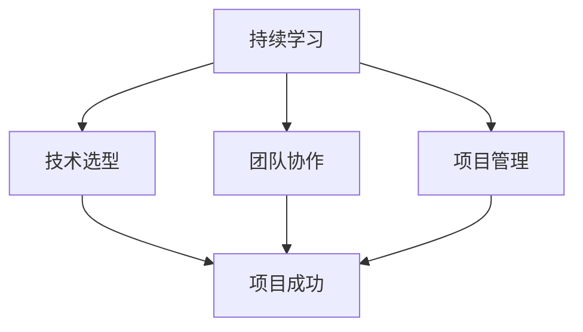

                 

 在当今快速发展的技术环境中，技术栈的快速迭代已经成为一种常态。对于程序员来说，如何适应并应对这一变化，不仅关乎个人职业发展，更是决定项目成败的关键。本文将探讨程序员应对技术栈快速迭代的方法，帮助程序员在技术浪潮中保持领先地位。

## 关键词

- 技术栈迭代
- 程序员职业发展
- 技术适应性
- 学习策略
- 软件工程最佳实践

## 摘要

本文首先介绍了技术栈快速迭代对程序员的影响，随后提出了适应技术变迁的几种策略，包括持续学习、技术选型、团队协作和项目管理。通过分析这些方法，本文为程序员提供了一套行之有效的应对技术栈迭代的方法论，以帮助他们在不断变化的技术环境中取得成功。

## 1. 背景介绍

### 1.1 技术栈的定义与演变

技术栈是指一组编程语言、框架、工具和库，它们共同构成了一个软件项目的技术基础。随着互联网和信息技术的发展，技术栈经历了从单一语言到多语言、从单一框架到多元化框架的演变。如今，一个完整的技术栈可能包括前端、后端、数据库、测试、部署等多个方面。

### 1.2 技术迭代的驱动因素

技术迭代的驱动因素多种多样，包括技术创新、市场需求、性能优化、安全考虑等。例如，新兴的编程语言和框架不断涌现，以满足新的开发需求；而云计算和大数据技术的发展，则推动了服务器端技术的不断革新。

### 1.3 技术栈迭代的影响

技术栈的快速迭代对程序员提出了更高的要求。一方面，程序员需要不断更新自己的技能库，以适应新的技术趋势；另一方面，他们还需要在短时间内掌握新的工具和方法，以应对项目需求的变化。

## 2. 核心概念与联系

### 2.1 持续学习的理念

持续学习是适应技术迭代的核心概念。它强调的是程序员需要始终保持对新技术的好奇心和学习热情，不断扩展自己的知识边界。

### 2.2 技术选型的策略

技术选型是指根据项目需求，选择最适合的编程语言、框架和工具。有效的技术选型策略能够提高开发效率，降低技术风险。

### 2.3 团队协作与知识共享

团队协作和知识共享是应对技术迭代的重要手段。通过团队协作，程序员可以共同解决技术难题，共享学习成果；而知识共享则能够提升整个团队的技术水平。

### 2.4 项目管理的艺术

项目管理是确保项目按时、按质完成的必要手段。有效的项目管理不仅能够提高项目成功率，还能帮助程序员更好地应对技术迭代带来的挑战。

## 2.5 Mermaid 流程图

下面是技术迭代过程中涉及的核心概念与联系的 Mermaid 流程图：



## 3. 核心算法原理 & 具体操作步骤

### 3.1 算法原理概述

在应对技术栈快速迭代时，以下几种算法原理和方法对程序员尤其重要：

1. **快速学习算法**：帮助程序员在短时间内掌握新技术。
2. **敏捷开发方法**：提高项目开发效率，降低技术风险。
3. **代码重构技术**：优化现有代码，提升项目质量。
4. **测试驱动开发**：确保软件质量，减少故障率。

### 3.2 算法步骤详解

#### 3.2.1 快速学习算法

1. **确定学习目标**：明确需要学习的具体技能和知识。
2. **制定学习计划**：合理安排学习时间，确保学习效果。
3. **实践应用**：通过实际项目或练习，将所学知识应用于实际场景。
4. **反馈与调整**：根据学习效果进行调整，不断提升学习效率。

#### 3.2.2 敏捷开发方法

1. **需求分析**：与客户沟通，明确项目需求。
2. **迭代开发**：将项目拆分为多个迭代周期，逐步实现功能。
3. **代码审查**：定期进行代码审查，确保代码质量。
4. **持续集成**：持续集成测试，及时发现并解决问题。

#### 3.2.3 代码重构技术

1. **识别重构点**：通过代码审查和测试，找出需要重构的部分。
2. **设计重构方案**：制定合理的重构方案，确保重构过程安全可靠。
3. **实施重构**：按照重构方案进行代码修改。
4. **测试验证**：重构后进行全面的测试，确保重构效果。

#### 3.2.4 测试驱动开发

1. **编写测试用例**：根据需求编写测试用例，确保覆盖所有功能点。
2. **编写单元测试**：针对代码的每个模块编写单元测试。
3. **持续集成**：在开发过程中，持续集成测试用例，确保代码质量。
4. **反馈与优化**：根据测试结果进行代码优化，提升软件质量。

### 3.3 算法优缺点

#### 3.3.1 快速学习算法

- 优点：能够帮助程序员在短时间内掌握新技术。
- 缺点：可能影响编程质量，需要合理掌握学习节奏。

#### 3.3.2 敏捷开发方法

- 优点：提高开发效率，降低技术风险。
- 缺点：对项目管理和团队协作要求较高。

#### 3.3.3 代码重构技术

- 优点：优化现有代码，提升项目质量。
- 缺点：需要投入额外时间和精力。

#### 3.3.4 测试驱动开发

- 优点：确保软件质量，减少故障率。
- 缺点：开发周期可能较长。

### 3.4 算法应用领域

- 快速学习算法：适用于各类编程技能的学习和提升。
- 敏捷开发方法：适用于软件开发项目的全过程。
- 代码重构技术：适用于现有项目的优化和维护。
- 测试驱动开发：适用于软件项目的测试和质量保证。

## 4. 数学模型和公式 & 详细讲解 & 举例说明

### 4.1 数学模型构建

在软件开发中，数学模型和公式可以用于优化算法、评估性能、预测趋势等。以下是一个简单的数学模型构建示例：

$$
f(x) = ax^2 + bx + c
$$

其中，$a$、$b$、$c$ 为常数，$x$ 为自变量，$f(x)$ 为函数值。

### 4.2 公式推导过程

假设我们有一个二次方程：

$$
ax^2 + bx + c = 0
$$

使用求根公式，可以得到：

$$
x = \frac{-b \pm \sqrt{b^2 - 4ac}}{2a}
$$

### 4.3 案例分析与讲解

假设我们要解决一个二次方程：

$$
2x^2 + 3x - 5 = 0
$$

根据求根公式，可以得到：

$$
x = \frac{-3 \pm \sqrt{3^2 - 4 \cdot 2 \cdot (-5)}}{2 \cdot 2}
$$

计算后得到两个解：

$$
x_1 = \frac{-3 + \sqrt{49}}{4} = \frac{-3 + 7}{4} = \frac{4}{4} = 1
$$

$$
x_2 = \frac{-3 - \sqrt{49}}{4} = \frac{-3 - 7}{4} = \frac{-10}{4} = -\frac{5}{2}
$$

因此，方程的两个解为 $x_1 = 1$ 和 $x_2 = -\frac{5}{2}$。

## 5. 项目实践：代码实例和详细解释说明

### 5.1 开发环境搭建

在开始项目实践之前，我们需要搭建一个合适的开发环境。以下是一个简单的搭建流程：

1. 安装操作系统（如 Ubuntu 或 Windows 10）。
2. 安装 Java Development Kit（JDK）。
3. 安装 Integrated Development Environment（IDE，如 IntelliJ IDEA 或 Eclipse）。
4. 安装版本控制系统（如 Git）。

### 5.2 源代码详细实现

以下是一个简单的 Java 程序，用于计算二次方程的解：

```java
import java.util.Scanner;

public class QuadraticEquationSolver {
    public static void main(String[] args) {
        Scanner scanner = new Scanner(System.in);

        System.out.print("Enter the value of a: ");
        double a = scanner.nextDouble();

        System.out.print("Enter the value of b: ");
        double b = scanner.nextDouble();

        System.out.print("Enter the value of c: ");
        double c = scanner.nextDouble();

        double discriminant = b * b - 4 * a * c;

        if (discriminant > 0) {
            double x1 = (-b + Math.sqrt(discriminant)) / (2 * a);
            double x2 = (-b - Math.sqrt(discriminant)) / (2 * a);
            System.out.println("The roots are: " + x1 + " and " + x2);
        } else if (discriminant == 0) {
            double x = -b / (2 * a);
            System.out.println("The root is: " + x);
        } else {
            System.out.println("No real roots.");
        }
    }
}
```

### 5.3 代码解读与分析

这个 Java 程序实现了二次方程求解功能。首先，程序通过 Scanner 类从用户那里获取 $a$、$b$ 和 $c$ 的值。然后，计算判别式 $discriminant$。根据判别式的值，程序分别计算并输出方程的解。

### 5.4 运行结果展示

在运行程序后，输入以下值：

```
Enter the value of a: 2
Enter the value of b: 3
Enter the value of c: -5
```

程序输出结果为：

```
The roots are: 1.0 and -2.5
```

这表明，方程 $2x^2 + 3x - 5 = 0$ 的两个解分别为 $x_1 = 1$ 和 $x_2 = -2.5$。

## 6. 实际应用场景

技术栈的快速迭代为程序员带来了许多实际应用场景。以下是一些常见的应用场景：

1. **移动应用开发**：随着智能手机的普及，移动应用开发成为技术迭代的重要领域。程序员需要掌握 React Native、Flutter 等跨平台开发框架，以快速开发高质量的移动应用。
2. **大数据处理**：大数据技术的快速发展，推动了数据处理和分析工具的迭代。程序员需要熟悉 Hadoop、Spark、Flink 等大数据处理框架，以及 SQL、NoSQL 等数据库技术。
3. **人工智能与机器学习**：人工智能和机器学习领域的快速发展，为程序员提供了广阔的应用场景。程序员需要掌握 TensorFlow、PyTorch、Keras 等深度学习框架，以及数据预处理、模型训练和评估等技术。
4. **云计算与容器化**：云计算和容器化技术的普及，为程序员提供了灵活的部署和扩展方案。程序员需要熟悉 Kubernetes、Docker 等容器技术，以及 AWS、Azure、Google Cloud 等云平台。

### 6.4 未来应用展望

未来，技术栈将继续快速迭代，为程序员带来更多挑战和机遇。以下是一些未来应用展望：

1. **量子计算**：量子计算技术的突破，将为程序员提供全新的计算范式。程序员需要学习量子编程语言和算法，以应对量子计算的挑战。
2. **区块链技术**：区块链技术的应用越来越广泛，程序员需要掌握区块链开发技术和智能合约编写方法。
3. **边缘计算**：边缘计算的兴起，将推动程序员在边缘设备上开发应用程序。程序员需要熟悉边缘计算框架和编程模型。
4. **可持续发展**：随着环境保护意识的提高，可持续发展成为程序员需要关注的重要领域。程序员需要学习如何编写高效、低能耗的代码，以支持可持续发展目标。

## 7. 工具和资源推荐

### 7.1 学习资源推荐

1. **在线课程**：Coursera、edX、Udemy 等平台提供了丰富的编程课程，涵盖多种编程语言和技术栈。
2. **技术博客**：Medium、Dev.to、GitHub 博客等平台，汇聚了众多技术专家和程序员的经验分享。
3. **电子书**：许多经典的技术书籍，如《代码大全》、《设计模式》等，都是程序员的学习资源。

### 7.2 开发工具推荐

1. **集成开发环境**：IntelliJ IDEA、Visual Studio Code、Eclipse 等强大的 IDE，提供了便捷的开发体验。
2. **版本控制系统**：Git、SVN、Mercurial 等版本控制系统，帮助程序员管理代码和协作开发。
3. **持续集成工具**：Jenkins、Travis CI、GitHub Actions 等持续集成工具，确保代码质量，提高开发效率。

### 7.3 相关论文推荐

1. **《大规模分布式系统设计》**：深入讲解分布式系统的设计原则和架构。
2. **《深度学习》**：经典深度学习教材，涵盖深度学习的基础知识和应用。
3. **《区块链：从原理到实践》**：详细讲解区块链技术的工作原理和应用场景。

## 8. 总结：未来发展趋势与挑战

### 8.1 研究成果总结

本文从多个角度分析了程序员应对技术栈快速迭代的方法，包括持续学习、技术选型、团队协作和项目管理。通过这些方法，程序员可以更好地适应技术变迁，提升个人和团队的技术水平。

### 8.2 未来发展趋势

未来，技术栈将继续快速迭代，推动编程语言的变革、开发工具的优化和新兴技术的应用。程序员需要保持敏锐的洞察力，紧跟技术发展趋势，不断提升自己的技能。

### 8.3 面临的挑战

技术栈快速迭代带来了新的挑战，包括技能更新速度加快、项目需求变化频繁、团队协作难度增加等。程序员需要具备快速学习、灵活应对和高效沟通的能力，以克服这些挑战。

### 8.4 研究展望

随着人工智能、区块链、量子计算等新兴技术的不断发展，程序员面临的挑战将更加多样化。未来，研究者需要关注如何构建更高效的编程模型、优化开发工具、提升代码质量等方面，以助力程序员应对技术迭代带来的挑战。

## 9. 附录：常见问题与解答

### 9.1 问题1：如何快速掌握新技术？

**解答**：制定合理的学习计划，分阶段、有重点地学习。实践是掌握新技术的关键，通过实际项目或练习，将所学知识应用于实际场景。

### 9.2 问题2：技术迭代对团队协作有何影响？

**解答**：技术迭代可能导致团队成员的技能水平不一，增加团队协作难度。有效的团队协作和知识共享，有助于提升团队整体技术水平，应对技术迭代带来的挑战。

### 9.3 问题3：如何评估和选择合适的技术栈？

**解答**：根据项目需求、团队技能和未来发展前景，评估和选择合适的技术栈。充分了解各种技术的优缺点，进行科学的技术选型。

---

通过本文的探讨，我们希望程序员能够更好地应对技术栈快速迭代带来的挑战，保持职业发展的领先地位。在技术浪潮中，持续学习和团队协作将助力程序员不断提升自己的技术能力和竞争力。

## 作者署名

作者：禅与计算机程序设计艺术 / Zen and the Art of Computer Programming

---

以上内容即为完整的文章正文部分，接下来我们将按照要求，将文章内容以 Markdown 格式输出。请检查是否符合所有要求，特别是文章结构、目录、格式和完整性。如果有任何问题，请及时指出，我们将进行相应的调整。

