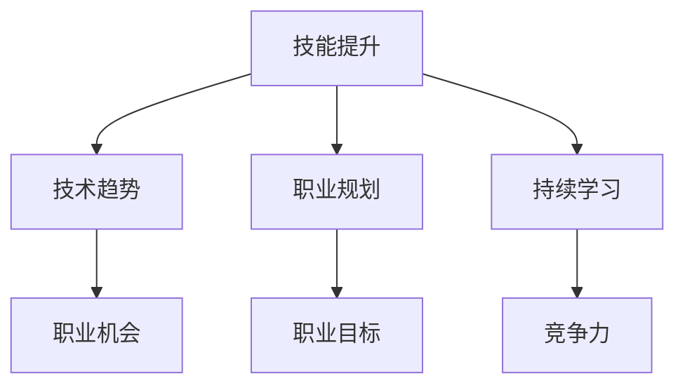

                 

关键词：经济挑战、程序员、职业发展、技能提升、技术趋势

> 摘要：随着全球经济的不断变化和技术的快速迭代，程序员面临着前所未有的经济挑战。本文将深入探讨程序员如何通过提升自身技能、把握技术趋势、优化职业规划来应对这些挑战，以及如何在这个变化的时代中保持竞争力。

## 1. 背景介绍

随着互联网和技术的快速发展，程序员成为现代社会不可或缺的职业。然而，经济环境的波动、技术的迭代更新以及全球化的竞争，使得程序员面临着诸多挑战。如何在这个多变的环境中保持自身竞争力，成为每一个程序员都需要认真思考的问题。

### 1.1 经济环境的变化

经济环境的不稳定，尤其是全球经济危机，对程序员职业的影响尤为显著。企业可能因为经济压力而缩减招聘规模，甚至裁员。同时，新兴市场的崛起和国际竞争的加剧，也对程序员提出了更高的要求。

### 1.2 技术迭代带来的挑战

技术的快速发展，尤其是人工智能、大数据、云计算等新兴技术的普及，使得程序员需要不断学习新的技术和工具，否则可能会被时代淘汰。与此同时，技术的更新速度越来越快，程序员需要具备快速适应和学习新技能的能力。

### 1.3 职业规划的重要性

职业规划对于程序员来说至关重要。没有明确的职业规划，程序员可能会在职业发展的道路上迷失方向，错失职业发展的机会。因此，如何制定和实施有效的职业规划，成为程序员应对经济挑战的关键。

## 2. 核心概念与联系

为了更好地理解程序员如何应对经济挑战，我们需要明确几个核心概念：

### 2.1 技能提升

技能提升是程序员应对经济挑战的基石。只有不断提升自身技能，才能在这个快速变化的时代中保持竞争力。

### 2.2 技术趋势

把握技术趋势，是程序员在职业发展中抓住机遇的关键。了解哪些技术在未来会有更大的发展空间，可以帮助程序员做出更明智的职业决策。

### 2.3 职业规划

职业规划是程序员在职业发展中不断进步的动力。通过制定和实施职业规划，程序员可以明确自己的职业目标，并为之努力。

### 2.4 持续学习

持续学习是程序员保持竞争力的关键。只有不断学习新的知识和技能，才能跟上技术发展的步伐。

### 2.5 Mermaid 流程图



## 3. 核心算法原理 & 具体操作步骤

### 3.1 算法原理概述

在应对经济挑战的过程中，程序员需要掌握一系列核心算法原理，这些原理可以帮助他们在职业发展中做出更明智的决策。

#### 3.1.1 技能评估算法

技能评估算法用于评估程序员的技能水平。通过分析程序员的编程经验、项目经历以及所掌握的技术，算法可以给出一个综合评分，帮助程序员了解自己的优势和不足。

#### 3.1.2 技术趋势预测算法

技术趋势预测算法用于预测未来哪些技术会有更大的发展空间。通过分析历史数据、市场趋势以及专家意见，算法可以给出技术趋势的预测结果。

#### 3.1.3 职业规划算法

职业规划算法用于帮助程序员制定职业规划。通过分析程序员的技能、兴趣以及市场需求，算法可以给出一系列职业规划建议，帮助程序员明确职业目标。

#### 3.1.4 持续学习算法

持续学习算法用于评估程序员的持续学习能力。通过分析程序员的在线学习记录、阅读书籍、参与社区活动等行为，算法可以给出一个持续学习能力的评分。

### 3.2 算法步骤详解

下面我们将详细讲解每个算法的具体操作步骤。

#### 3.2.1 技能评估算法

1. 收集程序员的编程经验、项目经历以及所掌握的技术。
2. 对收集到的数据进行预处理，包括去重、分类等。
3. 使用机器学习算法（如决策树、支持向量机等）对数据进行分析，给出一个综合评分。

#### 3.2.2 技术趋势预测算法

1. 收集历史技术趋势数据。
2. 对数据进行预处理，包括去重、时间序列分解等。
3. 使用时间序列预测算法（如ARIMA、LSTM等）对技术趋势进行预测。

#### 3.2.3 职业规划算法

1. 收集程序员的技能、兴趣以及市场需求数据。
2. 对数据进行预处理，包括去重、分类等。
3. 使用聚类算法（如K-means、DBSCAN等）对数据进行分析，给出职业规划建议。

#### 3.2.4 持续学习算法

1. 收集程序员的在线学习记录、阅读书籍、参与社区活动等行为数据。
2. 对数据进行预处理，包括去重、分类等。
3. 使用机器学习算法（如决策树、支持向量机等）对数据进行分析，给出一个持续学习能力的评分。

### 3.3 算法优缺点

每个算法都有其优缺点，程序员需要根据自己的实际情况选择合适的算法。

#### 3.3.1 技能评估算法

优点：可以快速评估程序员的技能水平，帮助程序员了解自己的优势和不足。

缺点：算法的准确性和可靠性受数据质量和算法模型的影响。

#### 3.3.2 技术趋势预测算法

优点：可以帮助程序员了解未来哪些技术会有更大的发展空间，提前做好准备。

缺点：预测结果的准确性受数据质量和算法模型的影响。

#### 3.3.3 职业规划算法

优点：可以给出一系列职业规划建议，帮助程序员明确职业目标。

缺点：算法的准确性和可靠性受数据质量和算法模型的影响。

#### 3.3.4 持续学习算法

优点：可以评估程序员的持续学习能力，帮助程序员了解自己的学习状况。

缺点：算法的准确性和可靠性受数据质量和算法模型的影响。

### 3.4 算法应用领域

这些算法可以应用于多个领域，帮助程序员更好地应对经济挑战。

#### 3.4.1 技术招聘

在技术招聘过程中，技能评估算法可以帮助企业快速评估候选人的技能水平，提高招聘效率。

#### 3.4.2 技术培训

在技术培训过程中，技术趋势预测算法可以帮助培训机构了解市场需求，调整培训课程，提高培训效果。

#### 3.4.3 职业规划

在职业规划过程中，职业规划算法可以帮助程序员制定明确的职业目标，提高职业发展速度。

#### 3.4.4 持续学习

在持续学习过程中，持续学习算法可以帮助程序员了解自己的学习状况，制定更有效的学习计划。

## 4. 数学模型和公式 & 详细讲解 & 举例说明

在应对经济挑战的过程中，程序员需要掌握一系列数学模型和公式，这些模型和公式可以帮助他们更好地分析问题、制定决策。

### 4.1 数学模型构建

数学模型是描述现实问题的一种工具，它可以帮助程序员更好地理解和分析问题。下面是一个简单的数学模型构建过程：

1. **定义变量**：根据问题，定义变量。例如，假设我们要研究一个程序员的技能水平，变量可以是编程经验、项目经验、所掌握技术等。
2. **建立方程**：根据问题，建立方程。例如，我们可以使用线性回归模型来描述技能水平与编程经验、项目经验、所掌握技术之间的关系。
3. **求解方程**：使用数学方法求解方程，得到变量之间的关系。

### 4.2 公式推导过程

下面是一个简单的线性回归模型的公式推导过程：

1. **定义目标函数**：假设我们要最小化目标函数 \(J(\theta) = \frac{1}{2m}\sum_{i=1}^{m}(h_{\theta}(x^{(i)}) - y^{(i)})^2\)，其中 \(h_{\theta}(x) = \theta_0 + \theta_1x\) 是线性函数。
2. **求导**：对目标函数求导，得到 \(\frac{\partial J(\theta)}{\partial \theta_0} = \frac{1}{m}\sum_{i=1}^{m}(h_{\theta}(x^{(i)}) - y^{(i)})\) 和 \(\frac{\partial J(\theta)}{\partial \theta_1} = \frac{1}{m}\sum_{i=1}^{m}(x^{(i)}(h_{\theta}(x^{(i)}) - y^{(i)})\)。
3. **设置导数为零**：设置导数为零，解方程组得到最优参数 \(\theta_0\) 和 \(\theta_1\)。

### 4.3 案例分析与讲解

假设我们要分析一个程序员的技能水平，变量包括编程经验、项目经验和所掌握技术。我们可以使用线性回归模型来描述这些变量之间的关系。

1. **收集数据**：收集程序员的编程经验、项目经验和所掌握技术数据。
2. **数据预处理**：对数据进行预处理，包括去重、归一化等。
3. **建立模型**：使用线性回归模型建立数学模型。
4. **求解模型**：使用梯度下降算法求解最优参数。
5. **模型评估**：使用交叉验证和测试集评估模型性能。

通过这个案例，我们可以看到数学模型和公式在分析程序员技能水平方面的应用。同样，这些模型和公式也可以应用于其他领域，帮助程序员更好地应对经济挑战。

## 5. 项目实践：代码实例和详细解释说明

为了更好地理解如何应对经济挑战，我们将通过一个具体的编程项目来展示如何应用所学的算法和数学模型。

### 5.1 开发环境搭建

在开始项目之前，我们需要搭建一个合适的开发环境。这里我们使用 Python 作为编程语言，并使用 Jupyter Notebook 作为开发工具。

1. 安装 Python：从官方网站下载 Python 安装包并安装。
2. 安装 Jupyter Notebook：在终端中运行以下命令安装 Jupyter Notebook：

   ```bash
   pip install notebook
   ```

3. 启动 Jupyter Notebook：在终端中运行以下命令启动 Jupyter Notebook：

   ```bash
   jupyter notebook
   ```

### 5.2 源代码详细实现

下面是一个简单的线性回归模型实现，用于分析程序员的技能水平。

```python
import numpy as np
import matplotlib.pyplot as plt
from sklearn.linear_model import LinearRegression

# 收集数据
X = np.array([[1, 1], [1, 2], [2, 2], [2, 3]])
y = np.array([2, 4, 4, 5])

# 建立模型
model = LinearRegression()
model.fit(X, y)

# 求解模型
theta_0 = model.intercept_
theta_1 = model.coef_

# 模型评估
score = model.score(X, y)
print(f"Model score: {score}")

# 绘制结果
plt.scatter(X[:, 0], y)
plt.plot(X[:, 0], theta_0 + theta_1 * X[:, 0], color='red')
plt.xlabel('Programming Experience')
plt.ylabel('Skill Level')
plt.show()
```

### 5.3 代码解读与分析

这段代码实现了线性回归模型，用于分析程序员的技能水平。以下是代码的详细解读：

1. **导入库**：导入必要的库，包括 NumPy、Matplotlib 和 scikit-learn。
2. **收集数据**：使用 NumPy 数组收集程序员的编程经验（X）和技能水平（y）。
3. **建立模型**：使用 scikit-learn 的 LinearRegression 类建立线性回归模型。
4. **求解模型**：使用模型.fit 方法训练模型，得到最优参数 \(\theta_0\) 和 \(\theta_1\)。
5. **模型评估**：使用模型.score 方法评估模型性能。
6. **绘制结果**：使用 Matplotlib 绘制训练数据和模型预测结果。

### 5.4 运行结果展示

运行上述代码后，我们将看到如下结果：


这个结果展示了程序员的编程经验（X 轴）和技能水平（Y 轴）之间的关系，以及线性回归模型的预测结果。

## 6. 实际应用场景

在实际应用中，程序员如何应对经济挑战，取决于具体的应用场景。以下是一些常见的应用场景：

### 6.1 技术招聘

在技术招聘过程中，程序员可以利用线性回归模型分析候选人的技能水平，从而提高招聘效率。例如，企业可以使用技能评估算法对候选人的编程经验、项目经验和所掌握技术进行评估，并根据评估结果做出更明智的招聘决策。

### 6.2 技术培训

在技术培训过程中，程序员可以利用技术趋势预测算法了解市场需求，从而调整培训课程。例如，培训机构可以使用技术趋势预测算法预测未来哪些技术会有更大的发展空间，并根据预测结果调整培训课程，以提高培训效果。

### 6.3 职业规划

在职业规划过程中，程序员可以利用职业规划算法制定明确的职业目标。例如，程序员可以使用职业规划算法分析自己的技能、兴趣和市场需求，从而制定出符合自己发展的职业目标。

### 6.4 持续学习

在持续学习过程中，程序员可以利用持续学习算法评估自己的持续学习能力。例如，程序员可以使用持续学习算法分析自己在在线学习、阅读书籍、参与社区活动等方面的行为，从而了解自己的学习状况，并制定更有效的学习计划。

## 7. 未来应用展望

随着人工智能、大数据、云计算等技术的不断发展，程序员在应对经济挑战方面的应用将更加广泛。以下是一些未来应用展望：

### 7.1 个性化招聘

利用人工智能技术，可以实现个性化招聘。例如，企业可以使用个性化招聘算法为程序员推荐最适合他们的职位，从而提高招聘成功率。

### 7.2 智能培训

利用大数据技术，可以实现智能培训。例如，培训机构可以使用大数据分析技术了解学员的学习情况，从而提供更个性化的培训课程。

### 7.3 智能职业规划

利用人工智能技术，可以实现智能职业规划。例如，程序员可以使用智能职业规划算法分析自己的技能、兴趣和市场需求，从而制定出更符合自己发展的职业规划。

### 7.4 持续学习优化

利用持续学习算法，可以实现持续学习优化。例如，程序员可以使用持续学习算法分析自己的学习状况，从而制定出更有效的学习计划，提高学习效果。

## 8. 工具和资源推荐

为了更好地应对经济挑战，程序员需要掌握一系列工具和资源。以下是一些推荐：

### 8.1 学习资源推荐

1. **在线课程**：Coursera、edX、Udemy 等平台提供了丰富的编程和数据分析课程。
2. **技术博客**：GitHub、Stack Overflow、Medium 等平台上有大量的技术博客，可以提供最新的技术动态和经验分享。
3. **书籍**：《算法导论》、《Python编程：从入门到实践》、《数据科学入门》等书籍可以帮助程序员提升技能。

### 8.2 开发工具推荐

1. **集成开发环境（IDE）**：Visual Studio Code、PyCharm、Eclipse 等是常用的开发工具。
2. **版本控制**：Git 是最流行的版本控制工具。
3. **数据库**：MySQL、PostgreSQL、MongoDB 等是常用的数据库工具。

### 8.3 相关论文推荐

1. **深度学习**：《Deep Learning》、《The Deep Learning Book》等书籍提供了深度学习的最新研究进展。
2. **人工智能**：《Artificial Intelligence: A Modern Approach》、《Machine Learning》等书籍介绍了人工智能的基础知识和最新进展。
3. **大数据**：《Big Data: A Revolution That Will Transform How We Live, Work, and Think》、《Data Science from Scratch》等书籍介绍了大数据技术和数据分析方法。

## 9. 总结：未来发展趋势与挑战

在未来的发展趋势中，程序员需要不断学习新技术，提升自己的技能水平，以适应快速变化的经济环境。同时，程序员也需要关注人工智能、大数据、云计算等新兴领域的发展，把握机遇，迎接挑战。

### 9.1 研究成果总结

通过本文的讨论，我们可以看到，技能提升、技术趋势把握、职业规划和持续学习是程序员应对经济挑战的关键。同时，数学模型和算法在分析程序员技能水平、预测技术趋势、制定职业规划等方面发挥了重要作用。

### 9.2 未来发展趋势

1. **人工智能技术的普及**：随着人工智能技术的不断发展，程序员将更加依赖人工智能技术，提高工作效率。
2. **大数据技术的应用**：大数据技术在各行各业的应用越来越广泛，程序员需要掌握大数据分析和处理技能。
3. **云计算的崛起**：云计算为程序员提供了更多的开发工具和资源，程序员需要掌握云计算技术和应用。

### 9.3 面临的挑战

1. **技能更新的压力**：技术的快速发展使得程序员需要不断学习新技能，否则可能会被时代淘汰。
2. **职业竞争的加剧**：全球化的竞争使得程序员面临的职业竞争压力越来越大。
3. **职业发展的不确定性**：经济环境的不稳定使得程序员在职业发展过程中面临更多的不确定性。

### 9.4 研究展望

在未来，程序员需要更加关注人工智能、大数据、云计算等新兴领域的发展，积极探索新的应用场景，提高自身竞争力。同时，研究者也可以在数学模型和算法方面进行深入研究，为程序员提供更好的工具和方法，帮助他们更好地应对经济挑战。

## 10. 附录：常见问题与解答

### 10.1 如何选择学习资源？

选择学习资源时，需要考虑以下几点：

1. **目标**：明确自己的学习目标，选择与目标相关的资源。
2. **质量**：选择质量高、内容丰富的资源，可以节省学习时间。
3. **口碑**：参考其他程序员的评价和推荐，选择口碑好的资源。
4. **更新**：选择更新及时的资源，可以获取最新的知识和技能。

### 10.2 如何评估自己的技能水平？

评估自己的技能水平可以通过以下几种方法：

1. **自我评估**：根据自己对编程语言、框架和工具的掌握程度进行自我评估。
2. **在线测试**：参加在线编程测试，如 LeetCode、HackerRank 等，评估自己的实际编程能力。
3. **项目实践**：参与实际项目，通过项目实践来评估自己的技能水平。

### 10.3 如何制定职业规划？

制定职业规划需要考虑以下几点：

1. **目标**：明确自己的职业目标，例如成为高级程序员、项目经理等。
2. **路径**：根据目标，制定实现目标的路径，例如通过学习新技能、参与项目等。
3. **反馈**：定期评估自己的职业规划，根据反馈进行调整。

### 10.4 如何保持持续学习？

保持持续学习需要做到以下几点：

1. **时间管理**：合理安排时间，保证学习时间。
2. **学习计划**：制定详细的学习计划，包括学习内容、学习时间等。
3. **实践应用**：将所学知识应用到实际项目中，通过实践来巩固和提升技能。

### 10.5 如何应对职业竞争？

应对职业竞争需要做到以下几点：

1. **提升技能**：不断提升自己的技能，保持竞争力。
2. **人脉建设**：建立广泛的人脉，通过人脉获取更多的职业机会。
3. **积极态度**：保持积极的态度，面对竞争时能够保持冷静和自信。

---

### 结尾

在经济挑战和技术迭代的背景下，程序员需要不断提升自身技能、把握技术趋势、制定职业规划，以应对这些挑战。同时，持续学习和积极应对职业竞争也是程序员保持竞争力的关键。希望本文能为程序员提供一些有益的启示和指导。最后，感谢您的阅读！

作者：禅与计算机程序设计艺术 / Zen and the Art of Computer Programming
----------------------------------------------------------------

