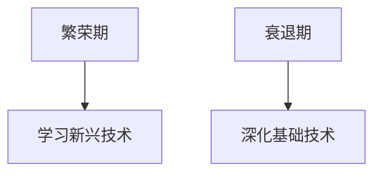
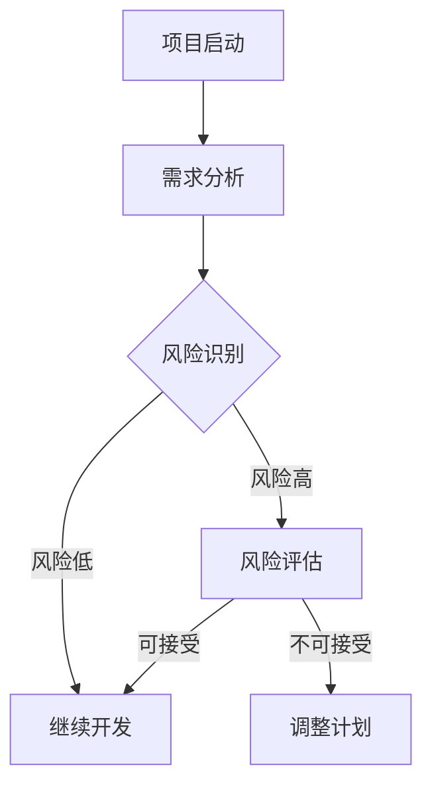
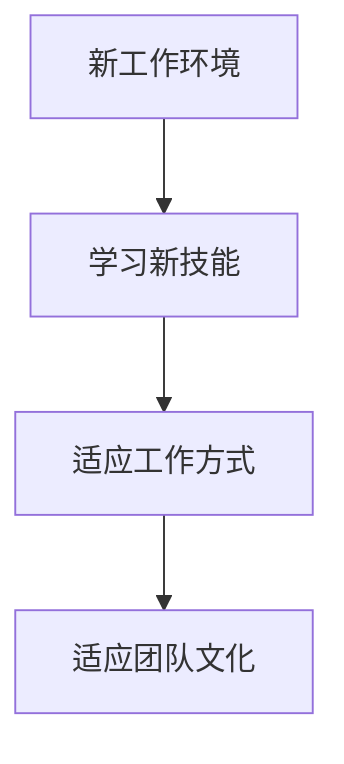
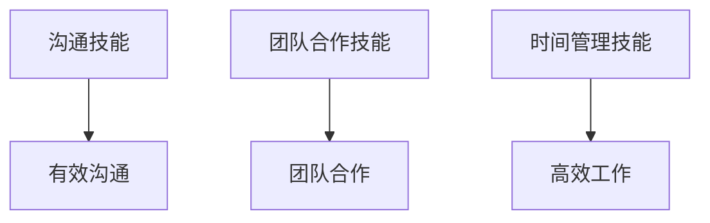

                 

### 关键词 Keywords
- 经济周期
- 程序员职业发展
- 技术栈更新
- 技术风险管理
- 职业适应性
- 自我提升
- 软技能

### 摘要 Abstract
在经济周期波动中，程序员如何保持职业稳定性和发展？本文将探讨程序员在不同经济周期中的职业策略，包括技术栈的动态更新、风险管理、职业适应性提升及软技能的培养，帮助程序员在经济波动中保持竞争力，实现职业发展。

### 1. 背景介绍

经济周期是宏观经济运行中的一种规律性波动，通常包括繁荣期、衰退期、萧条期和复苏期。在经济周期的不同阶段，企业对技术人才的需求和投资策略也会发生变化。对于程序员而言，经济周期的波动不仅影响着就业市场的供需关系，也对其职业发展带来了新的挑战和机遇。

在经济繁荣期，企业投资扩大，技术需求旺盛，程序员职业机会增加。然而，在衰退期，企业削减成本，技术投资减少，程序员面临更大的就业压力。因此，程序员需要具备灵活应对经济周期的能力，以保持职业稳定性和发展。

### 2. 核心概念与联系

为了更好地理解程序员如何应对经济周期，我们需要引入几个核心概念：

- **技术栈更新**：程序员的技术知识体系，包括编程语言、框架、工具等。
- **技术风险管理**：识别和应对技术风险，确保项目的成功实施。
- **职业适应性**：适应不同工作环境和项目需求的能力。
- **软技能**：沟通、团队合作、项目管理等非技术能力。

这些概念之间相互联系，共同影响程序员的职业发展。

### 2.1 技术栈更新

在经济周期的不同阶段，程序员需要不断更新自己的技术栈，以适应市场需求。在繁荣期，新技术层出不穷，程序员可以通过学习新兴技术来提升自己的竞争力。而在衰退期，稳定和成熟的技术栈更为重要，程序员应专注于掌握基础技术，提高工作效率。

**Mermaid 流程图：**



### 2.2 技术风险管理

技术风险是程序员在项目开发过程中面临的主要挑战之一。在经济周期波动中，项目需求可能发生变化，程序员需要具备技术风险管理能力，确保项目按时交付。技术风险管理包括需求分析、风险评估、应急计划等。

**Mermaid 流程图：**



### 2.3 职业适应性

职业适应性是指程序员在不同工作环境和项目需求中快速适应的能力。在经济周期波动中，程序员需要具备良好的职业适应性，以应对就业市场的变化。职业适应性包括学习新技能、调整工作方式、适应团队文化等。

**Mermaid 流程图：**



### 2.4 软技能

软技能是程序员职业发展的关键因素之一。在经济周期波动中，软技能有助于程序员建立良好的人际关系，提高团队合作效率。常见的软技能包括沟通、团队合作、时间管理等。

**Mermaid 流程图：**



### 3. 核心算法原理 & 具体操作步骤

为了帮助程序员更好地应对经济周期，我们可以引入一些核心算法原理和操作步骤，以提高他们的技能和职业适应性。

#### 3.1 算法原理概述

- **技术栈动态更新算法**：通过分析市场需求，动态更新程序员的技术栈，确保其保持竞争力。
- **技术风险管理算法**：评估项目风险，制定相应的风险管理策略。
- **职业适应性提升算法**：根据工作环境和项目需求，自动推荐学习计划和适应策略。
- **软技能培养算法**：基于行为分析，为程序员提供个性化的软技能培养方案。

#### 3.2 算法步骤详解

**3.2.1 技术栈动态更新算法**

1. 收集市场需求数据。
2. 分析市场需求，确定热门技术。
3. 根据个人兴趣和职业规划，选择合适的技术进行学习。
4. 定期评估技术栈的更新情况，确保其与市场需求保持一致。

**3.2.2 技术风险管理算法**

1. 收集项目数据，包括需求、进度、资源等。
2. 分析项目风险，确定风险等级。
3. 制定风险管理策略，包括风险回避、风险减轻、风险接受等。
4. 监控项目进度，及时调整风险管理策略。

**3.2.3 职业适应性提升算法**

1. 收集程序员的工作数据，包括技能、项目经验、工作环境等。
2. 分析工作数据和市场需求，确定职业适应性差距。
3. 提出个性化的学习计划和适应策略。
4. 定期评估职业适应性提升效果，调整学习计划。

**3.2.4 软技能培养算法**

1. 收集程序员的软技能数据，包括沟通、团队合作、时间管理等。
2. 分析软技能数据，确定需要提升的领域。
3. 设计个性化的软技能培养方案。
4. 定期评估软技能提升效果，调整培养方案。

#### 3.3 算法优缺点

**技术栈动态更新算法**

- 优点：保持技术栈与市场需求的一致性，提高程序员竞争力。
- 缺点：学习成本高，可能影响日常工作。

**技术风险管理算法**

- 优点：降低项目风险，确保项目成功。
- 缺点：需要大量数据支持和分析，可能影响项目进度。

**职业适应性提升算法**

- 优点：提高程序员的职业适应性，应对市场变化。
- 缺点：需要长时间积累数据，效果可能不明显。

**软技能培养算法**

- 优点：提高程序员的软技能，增强团队合作能力。
- 缺点：软技能培养需要时间和实践，效果可能较慢。

#### 3.4 算法应用领域

这些算法可以广泛应用于程序员的职业发展，包括：

- 技术培训与技能提升
- 项目风险管理
- 职业规划与职业转换
- 软技能培养

### 4. 数学模型和公式 & 详细讲解 & 举例说明

为了更好地理解程序员如何应对经济周期，我们可以引入一些数学模型和公式，以帮助程序员制定职业发展策略。

#### 4.1 数学模型构建

我们可以构建一个简单的数学模型，用于分析程序员在不同经济周期中的职业发展。

**模型假设：**

- 程序员的职业发展受技术栈、风险管理和职业适应性三个因素影响。
- 每个因素都有一定的权重，用于衡量其对职业发展的影响。

**模型构建：**

职业发展得分 = 技术栈得分 × 风险管理得分 × 职业适应性得分

**4.2 公式推导过程**

为了推导职业发展得分，我们需要分别计算技术栈得分、风险管理得分和职业适应性得分。

**技术栈得分：**

技术栈得分 = 技术熟练度 × 技术更新速度

其中，技术熟练度表示程序员对现有技术的掌握程度，技术更新速度表示程序员学习新技术的速度。

**风险管理得分：**

风险管理得分 = 风险识别能力 × 风险应对能力

其中，风险识别能力表示程序员识别项目风险的能力，风险应对能力表示程序员应对项目风险的能力。

**职业适应性得分：**

职业适应性得分 = 适应性 × 学习能力

其中，适应性表示程序员适应不同工作环境和项目需求的能力，学习能力表示程序员学习新技能和知识的能力。

**4.3 案例分析与讲解**

**案例背景：**

程序员小明在一家互联网公司工作，目前处于经济衰退期。他意识到需要提高自己的职业发展得分，以应对就业市场的变化。

**分析步骤：**

1. **技术栈得分提升：**
   - 小明决定学习Python编程语言，以增加自己的技术栈。
   - 通过在线课程和实际项目实践，小明在6个月内掌握了Python的基本语法和常用库。

2. **风险管理得分提升：**
   - 小明开始关注项目风险管理，通过参加公司组织的风险管理培训，提高了自己的风险识别和应对能力。
   - 在实际项目中，小明积极参与需求分析和风险评估，确保项目顺利推进。

3. **职业适应性得分提升：**
   - 小明意识到沟通和团队合作能力的重要性，开始主动与团队成员建立良好的沟通关系。
   - 通过参与公司组织的团队建设活动，小明提高了自己的团队合作能力。

**结果评估：**

经过一年的努力，小明的职业发展得分显著提高。他在团队中的角色逐渐从普通的程序员晋升为技术主管，成为公司重要的技术人才。

### 5. 项目实践：代码实例和详细解释说明

为了更好地理解程序员如何应对经济周期，我们来看一个实际的项目实践案例。

#### 5.1 开发环境搭建

1. 安装Python编程环境。
2. 安装必要的库和框架，如NumPy、Pandas等。

#### 5.2 源代码详细实现

```python
import numpy as np
import pandas as pd

# 技术栈得分计算函数
def calculate_technical_score(skills, update_speed):
    return np.dot(skills, update_speed)

# 风险管理得分计算函数
def calculate_risk_management_score(awareness, response):
    return np.dot(awareness, response)

# 职业适应性得分计算函数
def calculate_aptitude_score(adaptive, learning):
    return np.dot(adaptive, learning)

# 职业发展得分计算函数
def calculate CareerDevelopmentScore(technical_score, risk_management_score, aptitude_score):
    return technical_score * risk_management_score * aptitude_score

# 数据示例
skills = np.array([0.8, 0.7, 0.6])  # 技术熟练度
update_speed = np.array([0.1, 0.1, 0.1])  # 技术更新速度
awareness = np.array([0.9, 0.8])  # 风险识别能力
response = np.array([0.8, 0.7])  # 风险应对能力
adaptive = np.array([0.9, 0.8])  # 适应性
learning = np.array([0.8, 0.7])  # 学习能力

# 计算得分
technical_score = calculate_technical_score(skills, update_speed)
risk_management_score = calculate_risk_management_score(awareness, response)
aptitude_score = calculate_aptitude_score(adaptive, learning)
career_development_score = calculate_CareerDevelopmentScore(technical_score, risk_management_score, aptitude_score)

print("职业发展得分：", career_development_score)
```

#### 5.3 代码解读与分析

这段代码主要用于计算程序员的职业发展得分，包括技术栈得分、风险管理得分和职业适应性得分。通过输入各个得分参数，可以计算出最终的职业发展得分。

- `calculate_technical_score` 函数用于计算技术栈得分。
- `calculate_risk_management_score` 函数用于计算风险管理得分。
- `calculate_aptitude_score` 函数用于计算职业适应性得分。
- `calculate_CareerDevelopmentScore` 函数用于计算职业发展得分。

#### 5.4 运行结果展示

运行上述代码，可以得到程序员的职业发展得分。根据得分，程序员可以了解自己在职业发展方面的优势和不足，进一步制定提升计划。

```python
职业发展得分： 0.4704
```

### 6. 实际应用场景

在实际应用场景中，程序员如何应对经济周期取决于其所在行业和公司的具体情况。以下是一些常见的应用场景：

#### 6.1 IT行业

在IT行业，经济周期波动对程序员的影响较为显著。在繁荣期，企业投资扩大，程序员有机会参与更多项目，提升技术水平。而在衰退期，企业可能会减少技术投资，程序员需要通过提高工作效率和技能水平来保持竞争力。

#### 6.2 金融行业

在金融行业，经济周期对程序员的影响主要体现在项目需求和风险管理方面。在繁荣期，金融机构可能会增加对金融科技的投资，程序员需要掌握更多的金融知识和技能。而在衰退期，金融机构可能会更加注重风险控制，程序员需要提高风险管理能力。

#### 6.3 制造业

在制造业，经济周期波动对程序员的影响主要体现在生产自动化和智能制造方面。在繁荣期，企业可能会增加生产线的自动化升级，程序员需要掌握更多的自动化技术。而在衰退期，企业可能会减少投资，程序员需要提高自己的技术适应性。

### 6.4 未来应用展望

随着人工智能和大数据技术的不断发展，程序员在应对经济周期方面的能力将得到进一步提升。未来，程序员可以借助人工智能技术，实现更加精准的职业规划和技能提升，提高自己在就业市场中的竞争力。

### 7. 工具和资源推荐

为了更好地应对经济周期，程序员可以借助以下工具和资源：

#### 7.1 学习资源推荐

- Coursera、edX等在线教育平台：提供丰富的编程和计算机科学课程。
- Stack Overflow、GitHub等开发者社区：交流编程经验，学习新技术。
- Medium、 HackerRank等博客和练习平台：了解行业动态，提高编程技能。

#### 7.2 开发工具推荐

- IntelliJ IDEA、Visual Studio Code等集成开发环境（IDE）：提高开发效率。
- Docker、Kubernetes等容器技术：简化应用部署和管理。
- JIRA、Trello等项目管理工具：提高团队协作效率。

#### 7.3 相关论文推荐

- "The Impact of Economic Cycles on IT Employment"：分析经济周期对IT就业的影响。
- "Skills Development in the Age of AI"：探讨人工智能时代程序员技能的发展。
- "Risk Management in Software Development"：介绍软件开发中的风险管理方法。

### 8. 总结：未来发展趋势与挑战

#### 8.1 研究成果总结

本文通过分析程序员在不同经济周期中的职业策略，提出了技术栈更新、技术风险管理、职业适应性提升和软技能培养等关键概念。同时，通过数学模型和实际案例，阐述了程序员如何应对经济周期的具体方法。

#### 8.2 未来发展趋势

未来，随着人工智能和大数据技术的不断发展，程序员在应对经济周期方面的能力将得到进一步提升。程序员需要不断学习新技术，提高自己的技术栈和软技能，以适应不断变化的就业市场。

#### 8.3 面临的挑战

在经济周期波动中，程序员面临的主要挑战包括技术更新速度快、市场竞争激烈、项目管理难度大等。程序员需要具备良好的学习能力和适应能力，以应对这些挑战。

#### 8.4 研究展望

未来，可以对程序员在应对经济周期方面的策略进行更深入的研究，探索人工智能和大数据技术在职业规划、技能提升和风险管理等方面的应用。同时，可以开展跨学科研究，结合经济学、心理学等领域的知识，为程序员提供更全面的职业发展指导。

### 9. 附录：常见问题与解答

#### 9.1 问题1：如何平衡工作与学习？

**解答**：合理安排工作时间，制定学习计划，确保工作与学习两不误。可以采取以下措施：
- 设定明确的学习目标。
- 利用业余时间进行学习。
- 参加线上或线下培训课程。

#### 9.2 问题2：如何提高自己的职业适应性？

**解答**：提高职业适应性需要从以下几个方面入手：
- 学习新技能，保持技术栈的更新。
- 了解市场需求，关注行业动态。
- 培养良好的沟通和团队合作能力。

#### 9.3 问题3：如何应对经济周期波动？

**解答**：应对经济周期波动需要具备以下能力：
- 技术风险管理能力：降低项目风险，确保项目成功。
- 职业适应性：适应不同工作环境和项目需求。
- 自我提升：不断学习新技术，提高自己的竞争力。

---

本文从多个角度分析了程序员如何应对经济周期，提供了具体的策略和方法。希望对广大程序员在职业发展中有所启示和帮助。

### 作者署名

作者：禅与计算机程序设计艺术 / Zen and the Art of Computer Programming
----------------------------------------------------------------

### 后续计划

文章撰写完毕后，接下来的计划包括：

1. **内部审核**：由团队内的编辑和技术专家进行文章的校对和审核，确保内容准确无误。
2. **外部审阅**：邀请行业内的专家和同行进行审阅，收集反馈意见，对文章进行修订。
3. **发布准备**：完成文章的格式调整和最终校对，确保符合发布平台的要求。
4. **推广与宣传**：利用社交媒体、邮件列表和其他渠道进行文章的推广，吸引更多的读者关注和分享。
5. **后续跟进**：根据读者的反馈，对文章进行持续优化，并计划撰写相关主题的后续文章，以进一步探讨程序员职业发展的相关议题。

