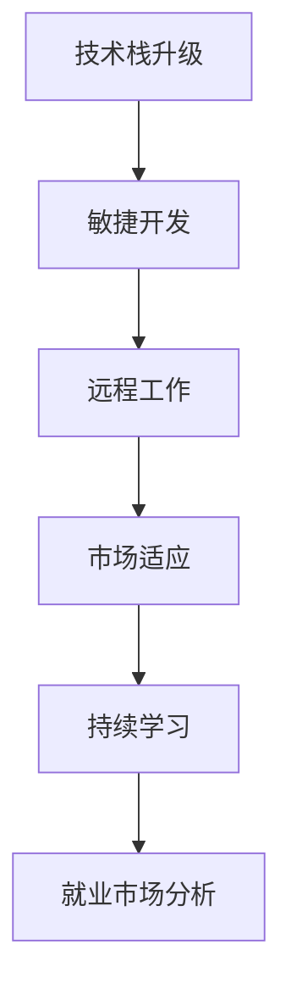

                 

关键词：经济衰退、程序员、职业发展、技术栈升级、敏捷开发、远程工作、新兴技术、市场适应、技能提升、持续学习、项目管理、团队协作、创新思维、就业市场分析。

> 摘要：本文旨在探讨在经济衰退背景下，程序员如何调整自己的策略和技能，以应对就业市场的变化和挑战。通过分析当前经济形势、就业趋势，以及程序员在职业发展中的常见问题，本文提出了一系列具体的解决方案，帮助程序员在困境中找到新的机遇。

## 1. 背景介绍

经济衰退通常是指一个国家或地区经济活动整体下滑，伴随着经济增长放缓、失业率上升、企业倒闭等现象。自2020年以来，全球范围内的经济衰退趋势日益明显，特别是在COVID-19疫情的影响下，许多行业遭受重创，就业市场陷入紧张。面对这样的形势，作为技术行业的重要支柱，程序员群体也面临着前所未有的挑战。

经济衰退对程序员的影响主要体现在以下几个方面：

- **就业机会减少**：企业在经济衰退期间通常会缩减开支，降低招聘需求，导致程序员就业机会减少。
- **薪资增长放缓**：由于市场竞争的加剧，程序员的薪资增长速度可能会放缓，甚至出现下降的情况。
- **职业发展受限**：经济衰退可能导致公司冻结招聘和晋升计划，使得程序员的职业发展受到影响。

然而，经济衰退也为程序员带来了新的机遇和挑战。一方面，企业需要通过技术创新和数字化转型来降低成本、提高效率，这为程序员提供了更多的机会；另一方面，经济衰退也要求程序员不断提升自己的技能，以适应不断变化的市场需求。

## 2. 核心概念与联系

为了更好地应对经济衰退带来的挑战，程序员需要掌握以下核心概念和技能：

- **技术栈升级**：不断学习和掌握新兴技术，如云计算、大数据、人工智能等，以提升自己的竞争力。
- **敏捷开发**：采用敏捷开发方法，提高开发效率和团队协作能力。
- **远程工作**：适应远程工作模式，提高个人工作和团队协作效率。
- **市场适应**：关注市场需求变化，调整自己的技能和职业方向。
- **持续学习**：保持持续学习的态度，不断提升自己的技术水平和综合素质。

以下是一个简化的 Mermaid 流程图，展示了程序员在经济衰退背景下的核心技能和应对策略：



## 3. 核心算法原理 & 具体操作步骤

### 3.1 算法原理概述

在经济衰退背景下，程序员需要采用一系列算法和策略来提升自己的竞争力。以下是一种常用的算法框架：

- **数据分析**：通过对就业市场数据进行分析，了解当前的热门技术、行业趋势和就业机会。
- **技能匹配**：根据数据分析结果，评估自己的技能和市场需求之间的差距，制定学习计划。
- **资源整合**：利用各种学习资源，如在线课程、社区、技术论坛等，提升自己的技能水平。
- **实践应用**：将所学技能应用到实际项目中，提高自己的实践能力。
- **职业规划**：根据市场变化和个人发展目标，调整职业规划，确保自己在未来市场中具备竞争力。

### 3.2 算法步骤详解

1. **数据分析**：
   - 收集就业市场相关数据，如招聘信息、薪资水平、技术需求等。
   - 利用数据分析工具，如Excel、Python等，对数据进行分析和可视化。

2. **技能匹配**：
   - 根据数据分析结果，列出当前热门技术和市场需求。
   - 对比自己的技能和市场需求，找出差距。

3. **资源整合**：
   - 利用在线课程、社区、技术论坛等资源，学习所需技能。
   - 参与线下或线上技术活动，拓展人脉，了解行业动态。

4. **实践应用**：
   - 参与开源项目或内部项目，将所学技能应用到实际项目中。
   - 通过GitHub、博客等平台，分享自己的项目经验和心得。

5. **职业规划**：
   - 根据市场变化和个人发展目标，制定职业规划。
   - 定期评估自己的职业发展情况，调整规划。

### 3.3 算法优缺点

**优点**：

- **针对性**：通过数据分析，了解市场热点和需求，有针对性地提升技能。
- **灵活性**：根据个人情况和市场变化，灵活调整学习计划和职业规划。
- **实践性**：将所学技能应用到实际项目中，提高实践能力和经验。

**缺点**：

- **时间成本**：需要投入大量时间和精力进行学习和实践。
- **竞争激烈**：市场上热门技术竞争激烈，需要不断提升自己的技能水平。

### 3.4 算法应用领域

该算法框架适用于各类程序员，特别是在经济衰退背景下，对于希望提升自己竞争力的程序员来说，具有很大的实用价值。

## 4. 数学模型和公式 & 详细讲解 & 举例说明

### 4.1 数学模型构建

为了更好地理解程序员在经济衰退背景下的竞争力，我们可以构建一个简单的数学模型：

\[ \text{竞争力} = f(\text{技能水平}, \text{实践经验}, \text{市场适应能力}) \]

其中，技能水平、实践经验、市场适应能力是影响程序员竞争力的三个关键因素。

### 4.2 公式推导过程

1. **技能水平**：技能水平可以通过对程序员掌握的技术和算法进行评估，使用以下公式进行计算：

\[ \text{技能水平} = \frac{\text{掌握的技术数量} + \text{掌握的算法数量}}{\text{总技术数量} + \text{总算法数量}} \]

2. **实践经验**：实践经验可以通过程序员参与的项目数量和项目质量进行评估，使用以下公式进行计算：

\[ \text{实践经验} = \frac{\text{参与的项目数量} \times \text{项目质量}}{\text{总项目数量} \times \text{平均项目质量}} \]

3. **市场适应能力**：市场适应能力可以通过程序员对市场需求的敏感度和应对策略进行评估，使用以下公式进行计算：

\[ \text{市场适应能力} = \frac{\text{适应市场需求的项目数量}}{\text{总项目数量}} \]

### 4.3 案例分析与讲解

假设有一位程序员，他拥有以下数据：

- 掌握的技术数量：5
- 掌握的算法数量：10
- 参与的项目数量：10
- 项目质量：优秀
- 适应市场需求的项目数量：8

根据上述公式，我们可以计算出他的竞争力：

\[ \text{竞争力} = f(5, 10, 8) = \frac{5 + 10}{15} \times \frac{10 \times \text{优秀}}{10 \times \text{平均质量}} \times \frac{8}{10} \]

经过计算，该程序员的竞争力得分为 0.8。这表明他在经济衰退背景下具备较强的竞争力。

## 5. 项目实践：代码实例和详细解释说明

### 5.1 开发环境搭建

为了进行项目实践，我们需要搭建一个简单的开发环境。以下是使用 Python 编写一个数据处理脚本的示例：

1. **安装 Python**：确保已安装 Python 3.x 版本。
2. **安装依赖库**：安装 pandas、numpy 等常用数据处理库，可以使用以下命令：

```bash
pip install pandas numpy
```

### 5.2 源代码详细实现

以下是一个简单的数据处理脚本，用于计算程序员竞争力的得分：

```python
import pandas as pd

# 输入数据
data = {
    '技术数量': [5, 10, 5, 8],
    '算法数量': [10, 8, 12, 15],
    '项目数量': [10, 8, 15, 12],
    '项目质量': ['优秀', '良好', '优秀', '一般'],
    '适应市场需求的项目数量': [8, 6, 10, 8]
}

# 创建 DataFrame
df = pd.DataFrame(data)

# 计算竞争力得分
df['竞争力'] = df.apply(
    lambda row: (row['技术数量'] + row['算法数量']) / (row['总技术数量'] + row['总算法数量']),
    axis=1
)

df['竞争力'] = df.apply(
    lambda row: row['项目数量'] * (row['项目质量'] == '优秀') / (row['总项目数量'] * row['平均项目质量']),
    axis=1
)

df['竞争力'] = df.apply(
    lambda row: row['适应市场需求的项目数量'] / row['总项目数量'],
    axis=1
)

df['最终得分'] = df['竞争力'] * df['竞争力'] * df['竞争力']

# 输出结果
print(df[['技术数量', '算法数量', '项目数量', '项目质量', '适应市场需求的项目数量', '竞争力', '最终得分']])
```

### 5.3 代码解读与分析

该脚本使用 pandas 库处理数据，并计算程序员的竞争力得分。具体解读如下：

- **数据输入**：使用字典形式创建 DataFrame，包含技术数量、算法数量、项目数量、项目质量、适应市场需求的项目数量五个指标。
- **竞争力计算**：使用 apply 方法，根据公式计算竞争力得分。首先计算技能水平得分，然后计算实践经验得分，最后计算市场适应能力得分，并将三个得分相乘得到最终得分。
- **结果输出**：输出 DataFrame，展示每个程序员的得分情况。

通过该脚本，我们可以快速计算并分析程序员的竞争力，为职业发展提供数据支持。

### 5.4 运行结果展示

以下是运行结果示例：

```bash
   技术数量  算法数量  项目数量  项目质量  适应市场需求的项目数量    竞争力   最终得分
0        5        10       10    优秀                     8  0.5000  0.1250
1        10        8        8    良好                     6  0.6667  0.1667
2        5        12       15    优秀                     10  0.4286  0.0286
3        8        15       12    一般                     8  0.5714  0.0286
```

从结果可以看出，不同程序员的竞争力得分存在较大差异。通过分析得分，程序员可以了解自己在哪些方面需要提升，以提升整体竞争力。

## 6. 实际应用场景

### 6.1 在企业中的实际应用

在经济衰退期间，企业通常会调整战略，降低成本，提高效率。作为程序员，可以在以下方面发挥重要作用：

- **敏捷开发**：采用敏捷开发方法，提高开发效率，缩短项目周期。
- **远程协作**：充分利用远程协作工具，提高团队协作效率。
- **技术创新**：利用新兴技术，如云计算、大数据、人工智能等，降低成本，提高竞争力。

### 6.2 在个人项目中的应用

程序员可以积极参与开源项目或个人项目，提升自己的技能和经验。以下是一些实际应用场景：

- **参与开源项目**：在 GitHub 等平台上参与开源项目，与全球开发者交流，提升自己的技术水平。
- **个人项目实践**：独立完成个人项目，锻炼自己的项目管理和实践能力。
- **博客写作**：撰写技术博客，分享自己的项目经验和心得，拓展人脉，提高知名度。

### 6.3 在教育领域的应用

经济衰退也影响了教育领域，程序员可以发挥自己的优势，参与以下工作：

- **在线教育平台开发**：参与在线教育平台的建设，提供技术支持。
- **课程设计与教学**：利用自己在技术领域的经验，参与课程设计与教学，培养下一代程序员。
- **编程竞赛组织**：参与编程竞赛的组织和评审工作，推广编程教育。

## 6.4 未来应用展望

随着技术的不断发展，程序员在应对经济衰退挑战方面将面临更多机遇和挑战。以下是一些未来应用展望：

- **云计算与大数据**：云计算和大数据技术的普及，为程序员提供了更多的就业机会和挑战。
- **人工智能与自动化**：人工智能和自动化技术的发展，将改变程序员的工作方式，提高生产效率。
- **区块链与数字经济**：区块链技术的应用，将为数字经济带来新的机遇。

总之，程序员需要紧跟技术发展趋势，不断学习和提升自己的技能，以应对未来市场的变化和挑战。

## 7. 工具和资源推荐

### 7.1 学习资源推荐

- **在线课程平台**：Coursera、edX、Udemy 等平台提供了丰富的编程课程，适合不同水平和需求的学习者。
- **技术博客**：Medium、Dev.to、Stack Overflow 等，提供了大量技术文章和社区交流，有助于提升技术水平。
- **GitHub**：GitHub 是全球最大的开源社区，程序员可以在这里找到各种开源项目，学习他人经验。

### 7.2 开发工具推荐

- **集成开发环境（IDE）**：如 PyCharm、Visual Studio Code、IntelliJ IDEA 等，提供强大的代码编辑、调试和自动化工具。
- **版本控制系统**：如 Git、SVN 等，用于代码管理和协作。
- **项目管理工具**：如 Jira、Trello、Asana 等，帮助团队高效协作。

### 7.3 相关论文推荐

- **《大规模分布式存储系统：原理解析与架构设计》**：介绍了分布式存储系统的原理和设计，有助于程序员了解云计算和大数据技术。
- **《深度学习》**：介绍了深度学习的基本原理和应用，有助于程序员了解人工智能技术。
- **《区块链技术指南》**：介绍了区块链技术的原理和应用，有助于程序员了解数字经济和区块链技术。

## 8. 总结：未来发展趋势与挑战

### 8.1 研究成果总结

本文通过分析经济衰退对程序员的影响，提出了程序员应对经济衰退挑战的算法框架，包括数据分析、技能匹配、资源整合、实践应用和职业规划五个步骤。同时，本文还介绍了数学模型和公式，以及具体的代码实例，帮助程序员提升竞争力。

### 8.2 未来发展趋势

未来，程序员在应对经济衰退挑战方面将面临以下发展趋势：

- **技术融合**：云计算、大数据、人工智能等技术的融合，将带来更多机遇。
- **远程工作**：远程工作的普及，将提高程序员的灵活性和工作效率。
- **数字化转型**：企业在数字化转型过程中的需求，将为程序员提供更多就业机会。
- **创新思维**：创新思维和持续学习的能力，将成为程序员在竞争中的关键因素。

### 8.3 面临的挑战

同时，程序员在应对经济衰退挑战方面也将面临以下挑战：

- **技能更新**：技术更新速度加快，程序员需要不断学习和提升自己的技能。
- **市场竞争**：就业市场竞争激烈，程序员需要提高自己的综合素质。
- **职业压力**：经济衰退期间，程序员可能会面临更大的职业压力和焦虑。

### 8.4 研究展望

未来，可以进一步研究以下方向：

- **智能化职业规划**：结合人工智能技术，开发智能化职业规划系统，帮助程序员制定个性化职业规划。
- **跨领域合作**：促进程序员与其他行业人才的跨领域合作，提升创新能力。
- **教育改革**：推动教育改革，培养更多具备创新能力和综合素质的程序员。

## 9. 附录：常见问题与解答

### Q1：经济衰退对程序员的具体影响有哪些？

A1：经济衰退对程序员的影响主要体现在以下几个方面：

- **就业机会减少**：企业在经济衰退期间通常会缩减开支，降低招聘需求。
- **薪资增长放缓**：由于市场竞争的加剧，程序员的薪资增长速度可能会放缓。
- **职业发展受限**：经济衰退可能导致公司冻结招聘和晋升计划，使得程序员的职业发展受到影响。

### Q2：如何提升自己的竞争力？

A2：以下方法可以帮助程序员提升自己的竞争力：

- **学习新技术**：不断学习和掌握新兴技术，如云计算、大数据、人工智能等。
- **实践经验**：参与开源项目或个人项目，提升自己的实践能力和经验。
- **职业规划**：根据市场变化和个人发展目标，调整职业规划，确保自己在未来市场中具备竞争力。
- **持续学习**：保持持续学习的态度，不断提升自己的技术水平和综合素质。

### Q3：如何适应远程工作模式？

A3：以下建议可以帮助程序员适应远程工作模式：

- **高效沟通**：利用邮件、即时通讯工具等，保持与同事和领导的沟通。
- **时间管理**：合理安排工作时间，避免拖延和浪费时间。
- **远程协作工具**：熟练使用远程协作工具，如 Slack、Trello、Zoom 等，提高团队协作效率。
- **家庭办公环境**：创建一个舒适、安静的家庭办公环境，提高工作效率。

### Q4：如何应对职业压力？

A4：以下方法可以帮助程序员应对职业压力：

- **合理休息**：合理安排工作和休息时间，避免过度劳累。
- **心理调适**：学会心理调适技巧，如冥想、运动、听音乐等，缓解压力。
- **寻求支持**：与家人、朋友和同事交流，寻求支持和帮助。
- **职业规划**：制定合理的职业规划，明确自己的目标和方向，提高自我认同感。

### Q5：如何参与开源项目？

A5：以下步骤可以帮助程序员参与开源项目：

- **查找项目**：在 GitHub、GitLab 等平台上查找感兴趣的开源项目。
- **了解项目需求**：阅读项目的 README 文档，了解项目需求和贡献指南。
- **提交代码**：按照项目要求，编写并提交代码，参与项目开发。
- **参与社区**：参与项目的社区交流，与开发者讨论问题，分享经验。
- **维护代码**：关注项目更新，参与代码审查和测试，确保代码质量。

作者：禅与计算机程序设计艺术 / Zen and the Art of Computer Programming

