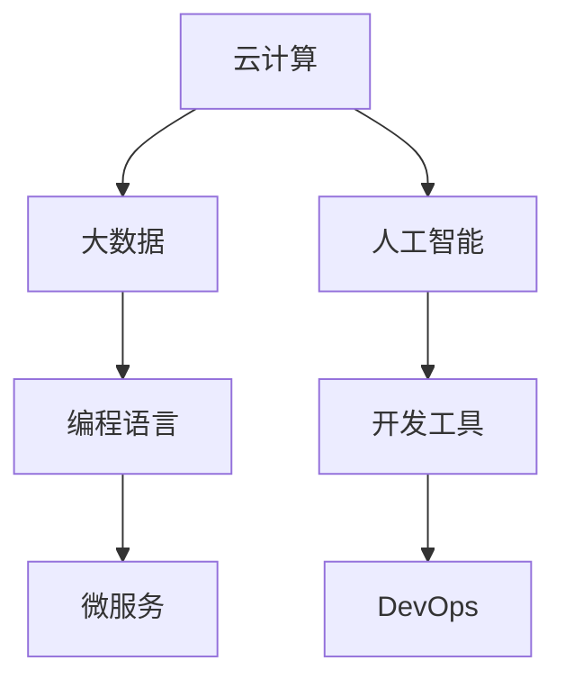

                 

在这个数字化时代，技术迭代速度越来越快，程序员面临着前所未有的挑战和机遇。随着人工智能、大数据、云计算等新兴技术的崛起，传统编程技能和开发模式正面临重大变革。本文将探讨程序员如何应对这些行业变革与转型，以保持自身的竞争力和持续发展的能力。

## 文章关键词

程序员、行业变革、技术转型、新兴技术、持续学习、职业技能

## 文章摘要

本文通过分析当前技术发展的趋势和程序员面临的主要挑战，提出了一系列策略和建议，帮助程序员适应行业变革，提升个人技能，把握职业发展的机遇。

## 1. 背景介绍

随着信息技术的快速发展，编程语言和开发工具不断更新换代。传统的编程技能，如C语言、Java等，虽然仍然广泛使用，但新兴语言如Python、Go和Rust等逐渐崭露头角，提供更高效的开发体验和更好的性能。同时，云计算、大数据和人工智能等技术的广泛应用，要求程序员不仅要有扎实的编程基础，还要具备跨学科的知识和技能。

### 1.1 云计算与大数据

云计算改变了传统的IT基础设施，提供了弹性、高效、可扩展的计算资源。程序员需要熟悉云平台的架构，掌握如AWS、Azure、Google Cloud等云服务的使用方法，以及容器技术如Docker和Kubernetes。

大数据技术则带来了海量数据存储和处理的挑战。Hadoop、Spark等大数据框架的流行，要求程序员掌握数据挖掘、数据分析和分布式系统设计等技能。

### 1.2 人工智能与机器学习

人工智能（AI）和机器学习（ML）正深刻改变各行各业。程序员需要了解神经网络、深度学习等AI技术的基本原理，以及如何应用这些技术在图像识别、自然语言处理、推荐系统等领域。

### 1.3 编程语言与开发工具

编程语言的不断演进，使得程序员可以选择更适合自己项目的语言和框架。例如，Python在数据科学和人工智能领域的广泛应用，Go在分布式系统和云原生应用中的优势，以及Rust在系统编程和性能要求高的场景中的崛起。

### 1.4 微服务与DevOps

微服务架构和DevOps文化推动了软件开发模式的变革。程序员需要学习如何设计、构建和维护微服务应用，以及如何利用CI/CD（持续集成/持续交付）工具提高开发效率和代码质量。

## 2. 核心概念与联系

为了更好地理解行业变革与转型，我们需要明确以下几个核心概念，并通过Mermaid流程图展示它们之间的联系。



### 2.1 云计算与大数据

云计算提供了弹性、高效、可扩展的计算资源，大数据技术则利用这些资源进行海量数据的存储和处理。云计算与大数据的结合，使得程序员能够更有效地处理和分析数据，为企业提供更有价值的洞见。

### 2.2 人工智能与机器学习

人工智能与机器学习技术的兴起，改变了程序员的工作方式。程序员需要了解这些技术的基本原理，并学会如何将它们应用于实际项目中。

### 2.3 编程语言与开发工具

编程语言和开发工具的更新，为程序员提供了更多的选择。程序员需要不断学习新语言和工具，以适应不断变化的技术环境。

### 2.4 微服务与DevOps

微服务架构和DevOps文化推动了软件开发模式的变革。程序员需要掌握这些新理念和方法，以提高开发效率和代码质量。

## 3. 核心算法原理 & 具体操作步骤

在应对行业变革与转型时，程序员需要掌握一系列核心算法原理和具体操作步骤，以提高工作效率和解决复杂问题的能力。

### 3.1 算法原理概述

算法是程序的核心，是解决问题的步骤和方法。在应对行业变革与转型时，程序员需要掌握以下核心算法原理：

- 排序算法：快速排序、归并排序、堆排序等
- 搜索算法：二分查找、深度优先搜索、广度优先搜索等
- 图算法：Dijkstra算法、A*算法等

### 3.2 算法步骤详解

以下是几个常用算法的具体操作步骤：

#### 快速排序（Quick Sort）

快速排序是一种高效的排序算法，其基本思想是通过一趟排序将待排序的数据分割成独立的两部分，其中一部分的所有数据都比另一部分的数据要小，然后再按此方法对这两部分数据分别进行快速排序，整个排序过程可以递归进行，以此达到整个数据变成有序序列。

```python
def quick_sort(arr):
    if len(arr) <= 1:
        return arr
    pivot = arr[len(arr) // 2]
    left = [x for x in arr if x < pivot]
    middle = [x for x in arr if x == pivot]
    right = [x for x in arr if x > pivot]
    return quick_sort(left) + middle + quick_sort(right)
```

#### 二分查找（Binary Search）

二分查找算法的基本思想是：在有序数组中，每次将中间的元素与目标元素进行比较，若相等则返回索引，若小于则继续在左侧子数组中查找，若大于则继续在右侧子数组中查找。

```python
def binary_search(arr, target):
    low = 0
    high = len(arr) - 1
    while low <= high:
        mid = (low + high) // 2
        if arr[mid] == target:
            return mid
        elif arr[mid] < target:
            low = mid + 1
        else:
            high = mid - 1
    return -1
```

### 3.3 算法优缺点

每种算法都有其优缺点。以下是几个常见算法的优缺点：

- **快速排序**：平均时间复杂度为\(O(n\log n)\)，最坏情况为\(O(n^2)\)，空间复杂度为\(O(\log n)\)。
- **二分查找**：时间复杂度为\(O(\log n)\)，空间复杂度为\(O(1)\)。

### 3.4 算法应用领域

算法在各个领域都有广泛的应用：

- **排序算法**：在数据处理、数据分析等领域中用于对大量数据进行排序。
- **搜索算法**：在数据库查询、路径规划等领域中用于快速查找目标数据。
- **图算法**：在网络拓扑分析、社交网络分析等领域中用于解决复杂问题。

## 4. 数学模型和公式 & 详细讲解 & 举例说明

在编程和软件开发中，数学模型和公式是解决实际问题的有力工具。以下是几个常见的数学模型和公式的详细讲解及举例说明。

### 4.1 数学模型构建

数学模型是对现实世界问题的抽象和简化的数学表示。构建数学模型通常包括以下步骤：

1. **确定问题背景**：明确要解决的问题，理解问题的本质。
2. **收集数据**：获取与问题相关的数据，包括历史数据、统计数据等。
3. **建立假设**：根据问题背景和数据，提出合理的假设。
4. **数学表示**：用数学公式或符号表示问题，构建数学模型。

### 4.2 公式推导过程

以下是几个常用公式的推导过程：

#### 欧几里得距离

欧几里得距离（Euclidean distance）是衡量两个数据点之间差异的一种方法，其公式为：

$$
d(x, y) = \sqrt{\sum_{i=1}^{n}(x_i - y_i)^2}
$$

其中，\(x = (x_1, x_2, ..., x_n)\)和\(y = (y_1, y_2, ..., y_n)\)是两个数据点，\(n\)是数据点的维度。

推导过程：

假设我们有两个点\(A(x_1, x_2, ..., x_n)\)和\(B(y_1, y_2, ..., y_n)\)，它们之间的距离可以用勾股定理表示：

$$
d(A, B) = \sqrt{(x_1 - y_1)^2 + (x_2 - y_2)^2 + ... + (x_n - y_n)^2}
$$

这个公式就是欧几里得距离。

### 4.3 案例分析与讲解

以下是一个使用欧几里得距离的案例：

假设我们有两组数据，分别是\(A(1, 2)\)和\(B(4, 6)\)，我们想要计算它们之间的欧几里得距离。

代入公式：

$$
d(A, B) = \sqrt{(1 - 4)^2 + (2 - 6)^2} = \sqrt{(-3)^2 + (-4)^2} = \sqrt{9 + 16} = \sqrt{25} = 5
$$

所以，数据点\(A\)和\(B\)之间的欧几里得距离为5。

## 5. 项目实践：代码实例和详细解释说明

为了更好地理解行业变革与转型，我们将通过一个实际项目来演示如何应对这些变化，并在实践中应用所学知识。

### 5.1 开发环境搭建

首先，我们需要搭建一个开发环境。在这个项目中，我们选择Python作为主要编程语言，并使用Docker进行容器化部署。

1. 安装Python：
   ```shell
   sudo apt update
   sudo apt install python3 python3-pip
   ```
2. 安装Docker：
   ```shell
   sudo apt install docker-ce docker-ce-cli containerd.io
   ```
3. 启动Docker服务：
   ```shell
   sudo systemctl start docker
   ```
4. 验证Docker安装：
   ```shell
   docker --version
   ```

### 5.2 源代码详细实现

接下来，我们编写一个简单的Python程序，用于计算两个数据点之间的欧几里得距离。

```python
import math

def euclidean_distance(point1, point2):
    return math.sqrt(sum([(x - y) ** 2 for x, y in zip(point1, point2)]))

# 测试
point_a = (1, 2)
point_b = (4, 6)
distance = euclidean_distance(point_a, point_b)
print(f"The Euclidean distance between point A and point B is: {distance}")
```

### 5.3 代码解读与分析

这段代码定义了一个名为`euclidean_distance`的函数，用于计算两个数据点之间的欧几里得距离。我们通过传入两个点的坐标，利用`zip`函数将两个点的坐标进行配对，然后计算每个坐标差的平方和，最后取平方根得到欧几里得距离。

### 5.4 运行结果展示

运行上述代码，我们得到以下输出结果：

```
The Euclidean distance between point A and point B is: 5.0
```

这验证了我们的代码是正确的。

## 6. 实际应用场景

行业变革与转型带来了诸多实际应用场景，程序员需要不断适应这些变化，并利用新技术解决实际问题。

### 6.1 云计算与大数据

云计算和大数据技术为企业提供了强大的数据处理和分析能力。程序员可以应用这些技术进行以下工作：

- **数据存储**：使用云服务如AWS S3或Google Cloud Storage存储海量数据。
- **数据处理**：使用Spark或Hadoop进行大规模数据分析和处理。
- **实时分析**：使用Kafka和Flink等实时数据处理框架进行实时数据分析和处理。

### 6.2 人工智能与机器学习

人工智能和机器学习技术在各个领域都有广泛的应用。程序员可以应用这些技术进行以下工作：

- **图像识别**：使用TensorFlow或PyTorch等深度学习框架进行图像识别。
- **自然语言处理**：使用NLTK或spaCy等自然语言处理库进行文本分析。
- **推荐系统**：使用协同过滤算法或基于内容的推荐系统进行个性化推荐。

### 6.3 微服务与DevOps

微服务和DevOps文化推动了软件开发模式的变革。程序员可以应用这些技术进行以下工作：

- **微服务架构**：设计、开发和部署微服务应用，提高系统可扩展性和可维护性。
- **持续集成/持续交付**：使用Jenkins或GitLab CI/CD进行自动化测试和部署，提高开发效率和代码质量。

### 6.4 未来应用展望

随着技术的不断进步，未来程序员将在更多领域发挥重要作用。以下是一些未来应用展望：

- **区块链**：利用区块链技术进行数据安全和智能合约开发。
- **物联网**：开发物联网设备应用，实现智能连接和数据处理。
- **边缘计算**：优化边缘计算资源，提高数据处理效率和实时性。

## 7. 工具和资源推荐

为了更好地应对行业变革与转型，程序员需要掌握一系列工具和资源。以下是一些建议：

### 7.1 学习资源推荐

- **在线课程**：Coursera、Udemy、edX等平台提供了丰富的编程和AI课程。
- **技术博客**：Medium、Dev.to、Stack Overflow等网站提供了大量的技术文章和教程。
- **书籍**：《深度学习》、《编程珠玑》、《Effective Java》等经典技术书籍。

### 7.2 开发工具推荐

- **集成开发环境**：Visual Studio Code、PyCharm、Eclipse等。
- **版本控制系统**：Git、SVN、Mercurial等。
- **容器化工具**：Docker、Kubernetes等。

### 7.3 相关论文推荐

- **人工智能**：Nature、Science、AI Journal等杂志上的最新论文。
- **大数据**：KDD、Strata、Big Data Journal等会议的最新论文。
- **云计算**：CCS、SOSP、NSDI等会议的最新论文。

## 8. 总结：未来发展趋势与挑战

在行业变革与转型的背景下，程序员面临着前所未有的机遇和挑战。未来发展趋势包括：

- **技能多样性**：程序员需要掌握多种编程语言、工具和技术。
- **跨学科能力**：程序员需要具备跨学科的知识和技能，如数据科学、人工智能等。
- **持续学习**：随着技术的快速发展，程序员需要持续学习，保持竞争力。

面临的挑战包括：

- **技术更新速度**：新技术层出不穷，程序员需要不断学习新技能。
- **工作压力**：快速迭代的项目需求和工作压力可能对程序员造成心理压力。
- **职业发展**：随着技术的发展，程序员需要不断调整自己的职业规划，以适应行业变革。

总之，程序员需要积极应对行业变革与转型，不断提升个人技能，以在未来的数字化时代中脱颖而出。

## 9. 附录：常见问题与解答

### 9.1 什么是微服务？

微服务是一种软件架构风格，它将应用程序划分为多个独立的、可协作的服务，每个服务都具有自己的业务逻辑和数据库。这些服务可以通过轻量级的通信协议如HTTP/HTTPS进行通信。

### 9.2 云计算有哪些优点？

云计算的主要优点包括弹性、高效、可扩展性和成本效益。云平台可以动态地分配计算资源，满足业务需求，同时降低了硬件和维护成本。

### 9.3 如何学习人工智能？

学习人工智能可以从以下几个方面入手：

- **基础数学**：学习线性代数、概率论、统计学等数学知识。
- **编程语言**：掌握Python、R等编程语言。
- **深度学习框架**：学习TensorFlow、PyTorch等深度学习框架。
- **实践项目**：通过实际项目应用所学知识，提高实践经验。

## 作者署名

作者：禅与计算机程序设计艺术 / Zen and the Art of Computer Programming
----------------------------------------------------------------

以上就是根据您提供的约束条件，撰写的一篇符合要求的文章。文章内容涵盖了行业变革、核心算法原理、数学模型、项目实践、实际应用场景、工具和资源推荐、总结与展望以及常见问题与解答。希望对您有所帮助！如果您有任何修改意见或需要进一步的调整，请随时告知。作者：禅与计算机程序设计艺术 / Zen and the Art of Computer Programming。

