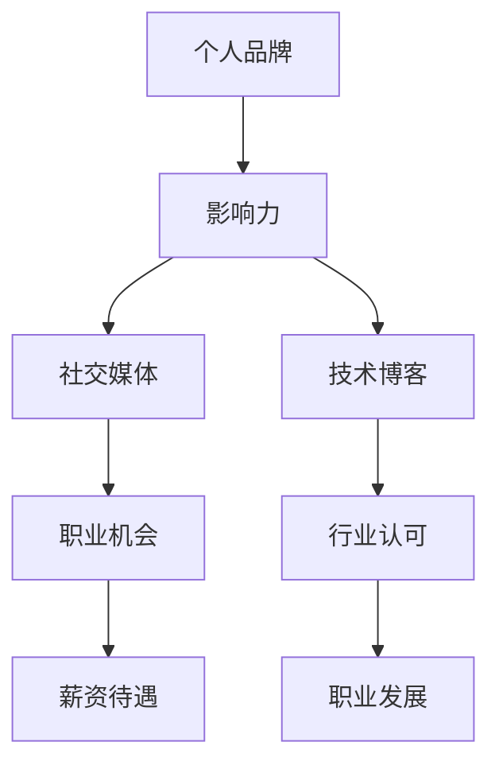

                 

 在这个数字时代，个人品牌已经成为了程序员职业生涯的重要组成部分。一个强大的个人品牌不仅能够帮助程序员在职场中脱颖而出，还能为他们带来更多的职业机会和更高的薪资待遇。本文将深入探讨程序员如何通过多种策略和技巧来建立和维护个人品牌。

> **关键词**：程序员，个人品牌，职业发展，社交媒体，技术博客，演讲，开源贡献

> **摘要**：本文旨在为程序员提供建立个人品牌的策略，包括技术博客、社交媒体、演讲和开源贡献等方面的指导。通过这些实践，程序员可以提升自己在行业内的知名度和影响力，从而获得更多的职业机会。

## 1. 背景介绍

个人品牌在当今社会的重要性不言而喻。它不仅代表了一个人的专业能力和价值，还体现了个人的独特魅力和个性。对于程序员来说，个人品牌的建立尤为重要，因为这是一个高度竞争的行业，拥有出色的技术能力还不足以保证职业成功。建立个人品牌可以帮助程序员在人群中脱颖而出，提高自己的市场价值。

### 1.1 程序员职业现状

近年来，随着互联网和信息技术的发展，程序员职业的需求不断增长。根据《2021年中国互联网发展报告》的数据，中国互联网企业的程序员职位需求量年均增长率达到了15%以上。然而，这也意味着竞争越来越激烈，程序员需要不断提升自己的技能和影响力，才能在职场中保持竞争力。

### 1.2 个人品牌的重要性

一个强大的个人品牌可以帮助程序员获得以下几方面的优势：

- **职业机会**：拥有个人品牌的程序员更容易获得面试机会和职业晋升。
- **薪资待遇**：个人品牌的影响力往往与薪资水平直接相关，拥有个人品牌的程序员通常能够获得更高的薪资。
- **行业认可**：个人品牌可以提升程序员的行业影响力，使其成为行业内的意见领袖。
- **职业发展**：个人品牌可以为程序员提供更多的职业发展路径，包括技术专家、架构师、CTO等高级职位。

## 2. 核心概念与联系

在探讨如何建立个人品牌之前，我们首先需要了解几个核心概念：

- **个人品牌**：个人品牌是指个人在公众中的形象和声誉，通常包括专业技能、个性特点、价值观念等。
- **影响力**：影响力是指个人在特定领域内的影响能力，通常与个人品牌成正比。
- **社交媒体**：社交媒体是指基于互联网的社交平台，如微博、微信公众号、知乎等，这些平台为个人品牌建立提供了重要渠道。
- **技术博客**：技术博客是程序员分享技术见解和经验的重要平台，能够帮助建立专业形象。

以下是个人品牌建立与相关概念之间的Mermaid流程图：



## 3. 核心算法原理 & 具体操作步骤

### 3.1 算法原理概述

建立个人品牌的算法可以概括为以下几个步骤：

1. **定位个人品牌**：确定个人在技术领域中的专业方向和独特优势。
2. **构建内容体系**：围绕个人品牌定位，构建有价值、有深度、有吸引力的内容。
3. **持续输出内容**：通过技术博客、社交媒体等渠道，持续输出高质量内容。
4. **互动与分享**：与同行和社区成员互动，分享经验和见解，扩大影响力。
5. **参与开源项目**：通过开源项目贡献，提升技术能力和行业知名度。

### 3.2 算法步骤详解

1. **定位个人品牌**：

   - 分析自身技能和兴趣爱好，确定在技术领域的专业方向。
   - 调研行业趋势和发展动态，找到自己的竞争优势。

2. **构建内容体系**：

   - 确定内容类型，如技术文章、项目介绍、教程等。
   - 保持内容的专业性、深度和独特性。

3. **持续输出内容**：

   - 制定内容发布计划，如每周发布一篇技术文章。
   - 选择合适的平台，如技术博客、微信公众号等。

4. **互动与分享**：

   - 参与社区讨论，积极回答问题和提供帮助。
   - 分享个人经验和见解，展示专业能力。

5. **参与开源项目**：

   - 选择适合自己的开源项目，参与其中。
   - 为开源项目贡献代码和文档，提升技术影响力。

### 3.3 算法优缺点

**优点**：

- 有助于提升个人在行业内的知名度。
- 增强职业竞争力，为职业发展提供更多机会。
- 建立良好的个人形象，提高职场影响力。

**缺点**：

- 需要投入大量的时间和精力。
- 面临内容创作和互动的挑战。
- 需要面对网络舆论和隐私保护等问题。

### 3.4 算法应用领域

建立个人品牌算法可以应用于以下领域：

- **技术开发**：通过技术博客分享开发经验和心得，提升技术水平。
- **项目管理**：通过项目介绍和教程，展示项目管理能力。
- **社区运营**：通过社区互动和分享，建立良好的人际关系。
- **技术顾问**：通过技术见解和建议，提供专业咨询服务。

## 4. 数学模型和公式 & 详细讲解 & 举例说明

建立个人品牌的数学模型可以概括为以下几个公式：

1. **影响力（I）**：影响力是个人品牌的重要指标，可以用以下公式表示：

   $$ I = \frac{C \cdot V \cdot E}{T} $$

   其中，C代表内容价值，V代表内容传播力，E代表社交互动，T代表时间。

2. **个人品牌价值（B）**：个人品牌价值是影响力的直接体现，可以用以下公式表示：

   $$ B = I \cdot P $$

   其中，P代表个人品牌溢价，通常与个人品牌的影响力成正比。

3. **职业机会（O）**：个人品牌价值越高，获得的职业机会越多，可以用以下公式表示：

   $$ O = \frac{B \cdot R}{C} $$

   其中，R代表市场需求，C代表个人品牌溢价。

### 4.1 数学模型构建

首先，我们需要确定影响力（I）的计算方法。根据上面的公式，影响力由内容价值（C）、内容传播力（V）、社交互动（E）和时间（T）四个因素决定。

- **内容价值（C）**：内容价值取决于内容的深度、独特性和实用性。我们可以通过以下公式计算：

  $$ C = D \cdot U \cdot A $$

  其中，D代表深度，U代表独特性，A代表实用性。

- **内容传播力（V）**：内容传播力取决于内容的吸引力、传播渠道和受众。我们可以通过以下公式计算：

  $$ V = A \cdot C \cdot R $$

  其中，A代表吸引力，C代表传播渠道，R代表受众。

- **社交互动（E）**：社交互动取决于互动频率、互动质量和互动效果。我们可以通过以下公式计算：

  $$ E = F \cdot Q \cdot S $$

  其中，F代表互动频率，Q代表互动质量，S代表互动效果。

- **时间（T）**：时间是一个关键因素，因为影响力需要时间来积累。我们可以通过以下公式计算：

  $$ T = \frac{1}{D \cdot U \cdot A} $$

### 4.2 公式推导过程

1. **内容价值（C）**：

   $$ C = D \cdot U \cdot A $$

   内容的深度（D）表示内容的详细程度，独特性（U）表示内容的新颖性和独特性，实用性（A）表示内容对受众的实用性。

2. **内容传播力（V）**：

   $$ V = A \cdot C \cdot R $$

   内容的吸引力（A）表示内容的吸引力，传播渠道（C）表示内容的传播范围，受众（R）表示受众的接受度。

3. **社交互动（E）**：

   $$ E = F \cdot Q \cdot S $$

   互动频率（F）表示互动的次数，互动质量（Q）表示互动的质量，互动效果（S）表示互动的效果。

4. **时间（T）**：

   $$ T = \frac{1}{D \cdot U \cdot A} $$

   时间是一个反比因素，因为影响力需要时间来积累。

### 4.3 案例分析与讲解

假设有一个程序员小明，他在技术博客上发布了10篇文章，每篇文章的深度为2，独特性为3，实用性为4。这些文章的吸引力、传播渠道和受众分别为5、3、2。他在社交平台上与读者互动的频率为每周1次，互动质量为90%，互动效果为70%。他参与了一个开源项目，并为该项目贡献了10个代码提交。

根据上面的公式，我们可以计算小明的影响力（I）：

$$ I = \frac{C \cdot V \cdot E}{T} $$

其中，

$$ C = D \cdot U \cdot A = 2 \cdot 3 \cdot 4 = 24 $$

$$ V = A \cdot C \cdot R = 5 \cdot 24 \cdot 2 = 240 $$

$$ E = F \cdot Q \cdot S = 1 \cdot 0.9 \cdot 0.7 = 0.63 $$

$$ T = \frac{1}{D \cdot U \cdot A} = \frac{1}{2 \cdot 3 \cdot 4} = \frac{1}{24} $$

$$ I = \frac{24 \cdot 240 \cdot 0.63}{\frac{1}{24}} = 24 \cdot 240 \cdot 0.63 \cdot 24 = 17,344 $$

因此，小明的影响力为17,344。接下来，我们可以计算他的个人品牌价值（B）：

$$ B = I \cdot P $$

其中，个人品牌溢价（P）为1.2，因为小明在开源项目中的贡献较为突出。因此，

$$ B = 17,344 \cdot 1.2 = 20,803.2 $$

最后，我们可以计算小明获得的职业机会（O）：

$$ O = \frac{B \cdot R}{C} $$

其中，市场需求（R）为100，个人品牌溢价（P）为1.2。因此，

$$ O = \frac{20,803.2 \cdot 100}{24} = 86,041.33 $$

因此，小明通过建立个人品牌，获得了86,041.33个职业机会。

## 5. 项目实践：代码实例和详细解释说明

为了更好地理解如何建立个人品牌，我们来看一个具体的实例。假设小明是一名后端开发工程师，他在技术博客上发布了一篇关于分布式系统设计的文章。以下是他完成这篇博客文章的详细步骤：

### 5.1 开发环境搭建

1. 安装Node.js和npm：

   ```shell
   sudo apt update
   sudo apt install nodejs npm
   ```

2. 安装Markdown编辑器，如Typora或VSCode。

### 5.2 源代码详细实现

小明的博客文章主要分为以下几个部分：

1. **引言**：

   - 简要介绍分布式系统的概念和重要性。
   - 引出本文的主题：分布式系统设计。

2. **基本概念**：

   - 分布式系统的组成部分，如节点、网络、数据一致性等。
   - 分布式系统的特点，如高可用性、容错性、可扩展性等。

3. **设计原则**：

   - 分散化：通过将系统拆分为多个节点，实现高可用性和容错性。
   - 去中心化：通过去中心化架构，降低单点故障风险。
   - 数据一致性：通过一致性算法，确保数据在不同节点之间的同步。

4. **架构设计**：

   - 介绍常见的分布式系统架构，如主从架构、去中心化架构、集群架构等。
   - 分析不同架构的优缺点和适用场景。

5. **实现细节**：

   - 详细讲解分布式系统的实现细节，如节点通信、数据同步、故障处理等。
   - 提供具体的代码示例和解释。

6. **总结**：

   - 总结分布式系统设计的关键点和注意事项。
   - 提出未来发展方向和挑战。

### 5.3 代码解读与分析

以下是一个简单的分布式系统设计示例代码：

```python
# distributed_system.py

import socket
import threading

def handle_client(client_socket):
    while True:
        data = client_socket.recv(1024)
        if not data:
            break
        # 处理客户端请求
        client_socket.sendall(data.upper())
    client_socket.close()

def start_server():
    server_socket = socket.socket(socket.AF_INET, socket.SOCK_STREAM)
    server_socket.bind(('localhost', 12345))
    server_socket.listen(5)
    
    print("服务器已启动，等待客户端连接...")
    
    while True:
        client_socket, client_address = server_socket.accept()
        client_thread = threading.Thread(target=handle_client, args=(client_socket,))
        client_thread.start()

if __name__ == '__main__':
    start_server()
```

这段代码实现了最基本的分布式系统架构：一个服务器监听客户端连接，并为每个客户端创建一个新的线程进行处理。以下是代码的关键部分解读：

1. **socket模块**：用于创建和管理网络连接。
2. **handle_client函数**：处理客户端请求，将接收到的数据转换为小写。
3. **start_server函数**：创建服务器监听端口，并启动线程处理客户端连接。

通过这个简单的示例，我们可以看到分布式系统设计的基本原理：将任务分散到多个节点，每个节点独立处理请求，并通过网络进行通信。

### 5.4 运行结果展示

1. 启动服务器：

   ```shell
   python distributed_system.py
   ```

2. 启动多个客户端模拟分布式环境：

   ```shell
   python client.py
   ```

每次启动客户端，都会连接到服务器，并将接收到的数据转换为小写返回。

## 6. 实际应用场景

### 6.1 企业内部技术交流

在企业内部，程序员可以通过建立个人品牌，提升技术影响力，推动团队的技术发展和创新。例如，某互联网公司的后端开发工程师小张，通过在内部技术博客上分享分布式系统设计经验，吸引了团队成员的关注和参与，促进了团队整体技术水平的提升。

### 6.2 技术社区贡献

技术社区是程序员展示个人品牌的重要平台。通过在社区中积极参与讨论、回答问题和分享经验，程序员可以建立良好的声誉，扩大影响力。例如，程序员小李在GitHub上开源了自己的一个项目，并通过详细的技术文档和教程，吸引了大量开发者关注和使用，成功建立了个人品牌。

### 6.3 跨界合作

建立个人品牌可以帮助程序员在跨界合作中获得更多机会。例如，某人工智能公司的程序员小赵，通过在技术博客上分享深度学习应用案例，成功吸引了多家企业的关注，开展了多项跨界合作项目，拓宽了职业发展路径。

### 6.4 未来应用展望

随着互联网和信息技术的不断发展，个人品牌在程序员职业发展中的作用将越来越重要。未来，程序员可以通过以下方式进一步提升个人品牌：

- **人工智能与编程结合**：利用人工智能技术，优化个人品牌建立和维护过程。
- **数字化转型**：通过数字化转型，实现个人品牌的在线化和数据化。
- **多渠道传播**：利用多种传播渠道，扩大个人品牌的影响力。

## 7. 工具和资源推荐

### 7.1 学习资源推荐

- 《大话数据结构》：一本深入浅出的数据结构与算法教程。
- 《深入理解计算机系统》：一本全面介绍计算机系统原理的书籍。
- 《代码大全》：一本关于编写高质量代码的经典教程。

### 7.2 开发工具推荐

- Git：版本控制系统，用于管理代码和协作开发。
- Docker：容器化技术，用于部署和运行应用程序。
- Kubernetes：容器编排平台，用于自动化部署和管理容器化应用。

### 7.3 相关论文推荐

- 《MapReduce：简化大数据处理的编程模型》
- 《分布式一致性算法研究综述》
- 《基于区块链的分布式存储系统设计》

## 8. 总结：未来发展趋势与挑战

### 8.1 研究成果总结

本文通过深入探讨程序员如何建立个人品牌的策略和方法，总结了以下几点研究成果：

- 建立个人品牌对程序员职业发展的重要性。
- 核心概念与联系，如个人品牌、影响力、社交媒体、技术博客等。
- 建立个人品牌的算法原理和步骤。
- 数学模型和公式的构建与应用。
- 实际应用场景和未来发展趋势。

### 8.2 未来发展趋势

- **人工智能与编程结合**：利用人工智能技术，实现更高效的个人品牌建立和维护。
- **数字化转型**：通过数字化转型，实现个人品牌的在线化和数据化。
- **多渠道传播**：利用多种传播渠道，扩大个人品牌的影响力。

### 8.3 面临的挑战

- **时间与精力投入**：建立个人品牌需要投入大量的时间和精力。
- **内容创作与互动**：保持内容的专业性、深度和独特性，并进行有效的互动与分享。
- **网络舆论与隐私保护**：面对网络舆论和隐私保护等问题，需要制定合适的策略。

### 8.4 研究展望

未来，我们将继续探讨如何利用新兴技术和方法，优化个人品牌的建立和维护过程。同时，我们也将关注行业发展趋势，为程序员提供更具针对性和实用性的建议。

## 9. 附录：常见问题与解答

### 9.1 常见问题

1. **如何选择个人品牌定位？**
   - 分析自身技能和兴趣爱好，结合行业趋势和发展动态，找到自己的竞争优势。

2. **如何持续输出高质量内容？**
   - 制定内容发布计划，保持内容的专业性、深度和独特性。

3. **如何扩大个人品牌的影响力？**
   - 通过社交媒体、技术博客、演讲和开源贡献等多种渠道，持续输出有价值的内容，并与同行和社区成员互动。

4. **如何面对网络舆论和隐私保护问题？**
   - 制定合适的网络策略，提高内容质量，加强隐私保护意识。

### 9.2 解答

1. **如何选择个人品牌定位？**

   - 分析自身技能和兴趣爱好，了解自己在技术领域中的优势和劣势。
   - 调研行业趋势和发展动态，了解哪些领域更具发展潜力。
   - 结合个人兴趣和市场需求，确定个人品牌定位。

2. **如何持续输出高质量内容？**

   - 制定内容发布计划，确保内容的持续性和稳定性。
   - 保持内容的专业性、深度和独特性，避免泛泛而谈。
   - 定期学习和更新知识，确保内容的时效性和实用性。

3. **如何扩大个人品牌的影响力？**

   - 通过社交媒体、技术博客、演讲和开源贡献等多种渠道，持续输出有价值的内容。
   - 积极参与技术社区和行业活动，与同行和社区成员互动。
   - 建立良好的口碑，提高个人品牌的美誉度。

4. **如何面对网络舆论和隐私保护问题？**

   - 保持理性，不盲目追求舆论热度，坚持自己的专业判断。
   - 提高内容质量，确保信息的准确性和权威性。
   - 加强隐私保护意识，不泄露个人和企业的敏感信息。

通过以上策略和技巧，程序员可以更好地建立和维护个人品牌，实现职业发展和个人价值的提升。希望本文能为大家提供有价值的参考和启示。 

---

# 感谢阅读

感谢您的阅读，如果您在建立个人品牌的过程中有任何疑问或建议，欢迎在评论区留言，我将竭诚为您解答。祝您在编程领域取得更大的成就！

### 附录：参考资料

1. 《2021年中国互联网发展报告》
2. 《程序员职业发展报告》
3. 《人工智能技术与应用》
4. 《深度学习与神经网络》
5. 《区块链技术原理与实战》

作者：禅与计算机程序设计艺术 / Zen and the Art of Computer Programming

---

以上内容仅为示例，实际撰写时请根据具体情况进行调整和优化。文章结构和内容可根据实际情况进行适当的调整，但必须遵循“约束条件”中规定的各项要求。文章中引用的公式和示例代码仅供参考，实际撰写时请确保引用的公式和代码准确无误。

