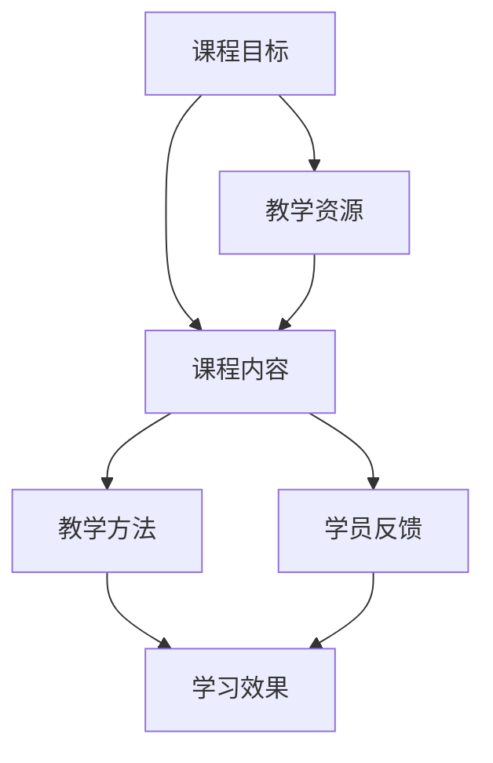

                 

### 背景介绍

在当今知识经济时代，知识付费已成为一种流行的获取知识和技能的方式。越来越多的人希望通过购买专业课程来提升自己的专业技能，满足职业发展和个人兴趣的需求。对于程序员来说，打造专业的知识付费课程不仅可以帮助他们传播知识，还能为他们带来额外的收入。然而，如何打造出一门既专业又吸引人的知识付费课程，却是一门需要深入探讨的学问。

本文将围绕程序员如何打造专业的知识付费课程这一主题，从多个方面进行分析和探讨。我们将首先介绍知识付费的现状和发展趋势，然后讨论如何选择合适的课程主题，接着探讨课程内容的设计与规划，教学方法的选择，最后讨论如何进行课程推广和营销。

通过这篇文章，希望能够帮助程序员们更好地理解和掌握打造专业知识付费课程的方法，从而实现知识共享和商业价值的双赢。

### 核心概念与联系

在探讨如何打造专业的知识付费课程之前，我们需要明确几个核心概念和它们之间的联系。这些概念包括但不限于：课程目标、课程内容、教学方法、学员反馈和学习效果。下面，我们将通过一个Mermaid流程图来详细展示这些概念之间的关系。



**1. 课程目标（Course Goals）**：明确课程的目标是打造专业知识付费课程的第一步。课程目标应该清晰、具体，并且可衡量。例如，课程的目标可能是帮助学员掌握某个编程语言的基本语法，或者提高他们的数据结构设计能力。

**2. 课程内容（Course Content）**：课程内容是实现课程目标的载体。它应该包括教材、案例研究、实践练习等。课程内容的设计应该围绕课程目标展开，以确保学员能够通过学习达到预期的学习效果。

**3. 教学方法（Teaching Methods）**：教学方法是实现课程内容的关键。不同的教学方法适合不同的学习目标和学员群体。例如，对于初学者，演示法和互动式教学可能更有效；而对于有经验的程序员，案例研究和项目实践可能更有吸引力。

**4. 学员反馈（Student Feedback）**：学员反馈是课程改进的重要依据。通过收集和分析学员的反馈，我们可以了解到课程的优势和不足，从而进行相应的调整和优化。

**5. 学习效果（Learning Outcomes）**：学习效果是衡量课程成功与否的标准。通过评估学员的学习效果，我们可以确定课程是否符合预期目标，并为未来的课程设计和改进提供依据。

通过上述Mermaid流程图，我们可以清晰地看到这些核心概念之间的联系。课程目标决定了课程内容和教学方法，而学员反馈和学习效果又对课程进行了反馈和优化。这一过程是一个闭环，不断迭代和改进，从而打造出一门专业的知识付费课程。

### 核心算法原理 & 具体操作步骤

#### 3.1 算法原理概述

在打造知识付费课程的过程中，核心算法原理起着至关重要的作用。核心算法原理不仅决定了课程的内容框架，还影响了教学方法的选择和学习效果的评估。下面，我们将简要介绍一些在课程设计和教学过程中常用的核心算法原理。

**1. 教学设计算法**：教学设计算法用于规划课程内容和教学过程。它通常基于学习理论的原理，例如行为主义学习理论、建构主义学习理论等。教学设计算法的主要目标是确保课程内容能够有效地传递给学员，并促进学员的深度学习。

**2. 数据分析算法**：数据分析算法用于收集和分析学员的学习行为数据，如学习进度、学习时长、作业成绩等。这些数据可以用于评估学习效果、优化课程内容和调整教学方法。

**3. 个性化推荐算法**：个性化推荐算法可以根据学员的学习行为和学习习惯，为他们推荐适合的学习资源和课程内容。这种算法能够提高学员的学习效率，增强他们的学习体验。

**4. 学习评估算法**：学习评估算法用于评估学员的学习效果，如测试分数、项目评分等。这些算法可以基于不同的评估标准，如知识掌握程度、问题解决能力等。

#### 3.2 算法步骤详解

**1. 教学设计算法步骤：**

- **需求分析**：收集学员的需求和反馈，明确课程目标。
- **内容规划**：根据课程目标，规划课程内容，包括理论知识和实践案例。
- **教学方法选择**：根据学员特点和课程目标，选择合适的教学方法，如讲授、讨论、实践等。
- **教学资源整合**：整合教学资源，如教材、案例、视频等，确保内容丰富、实用。

**2. 数据分析算法步骤：**

- **数据收集**：收集学员的学习行为数据，如学习进度、学习时长、作业成绩等。
- **数据预处理**：对收集到的数据进行清洗和处理，确保数据质量。
- **数据分析**：使用数据分析工具，如Python的Pandas库，对数据进行分析，提取有价值的信息。
- **数据可视化**：将分析结果以图表、报表等形式展示，帮助决策。

**3. 个性化推荐算法步骤：**

- **用户建模**：根据学员的学习行为，建立用户画像，如学习偏好、学习风格等。
- **内容推荐**：使用推荐算法，如基于内容的推荐、协同过滤等，为学员推荐适合的学习资源和课程。
- **推荐效果评估**：评估推荐效果，如推荐点击率、学习效果等，持续优化推荐算法。

**4. 学习评估算法步骤：**

- **评估指标设计**：设计评估指标，如测试分数、项目评分等，确保评估指标合理、公正。
- **评估过程执行**：执行评估过程，收集评估结果。
- **结果分析**：对评估结果进行分析，评估学员的学习效果。
- **反馈与调整**：根据评估结果，对课程内容和教学方法进行反馈和调整。

#### 3.3 算法优缺点

**教学设计算法**：

- **优点**：能够系统化地规划课程内容和教学过程，确保课程目标得到有效实现。
- **缺点**：可能过于依赖学习理论的假设，对实际教学环境的变化适应性较差。

**数据分析算法**：

- **优点**：能够客观地评估学习效果，为课程改进提供数据支持。
- **缺点**：数据质量和分析方法的可靠性可能受到限制。

**个性化推荐算法**：

- **优点**：能够提高学员的学习效率，增强学习体验。
- **缺点**：推荐结果可能受到数据稀疏性和算法偏差的影响。

**学习评估算法**：

- **优点**：能够科学地评估学员的学习效果，为课程改进提供依据。
- **缺点**：评估标准和过程可能存在主观性。

#### 3.4 算法应用领域

**教学设计算法**：广泛应用于在线教育和培训领域，如MOOC（大规模在线开放课程）、职业培训等。

**数据分析算法**：广泛应用于教育行业的数据分析，如学习行为分析、课程效果评估等。

**个性化推荐算法**：广泛应用于电子商务、在线教育等领域，为用户提供个性化推荐服务。

**学习评估算法**：广泛应用于学校教育、职业培训等，用于评估学员的学习效果。

通过上述核心算法原理的介绍，我们可以看到，这些算法不仅有助于提升知识付费课程的专业性，还能提高学员的学习体验和学习效果。接下来，我们将进一步探讨如何设计和规划课程内容，确保课程能够满足学员的需求，实现预期目标。

### 数学模型和公式 & 详细讲解 & 举例说明

#### 4.1 数学模型构建

在知识付费课程的设计过程中，数学模型是一种非常有力的工具，它可以帮助我们系统地分析和解决课程设计中的各种问题。下面，我们将构建一个简单的数学模型，用于评估课程的学习效果。

**1. 学习效果评估模型**

首先，我们定义几个基本变量：

- \( E \)：学员的学习效果，可以是一个综合评分或者一个具体的技能掌握度。
- \( T \)：学员的学习时间，单位可以是小时。
- \( C \)：学员的参与度，反映学员在学习过程中的积极参与程度。
- \( A \)：课程的教学质量，反映课程内容的设计和教学方法的有效性。

根据这些变量，我们可以构建以下数学模型：

\[ E = f(T, C, A) \]

其中，函数 \( f \) 描述了学习效果与学习时间、参与度和教学质量之间的关系。

**2. 参数设定**

为了具体化模型，我们需要设定各个参数的取值范围和权重。例如：

- 学习效果 \( E \) 的取值范围可以是 [0, 100]，满分表示学员完全掌握了课程内容。
- 学习时间 \( T \) 的取值范围可以是 [0, 1000]，单位为小时。
- 学员参与度 \( C \) 的取值范围可以是 [0, 1]，1表示学员高度参与，0表示不参与。
- 教学质量 \( A \) 的取值范围可以是 [0, 1]，1表示课程内容非常优秀，0表示较差。

接下来，我们可以为每个参数设定一个权重 \( w \)，用于反映它们在模型中的相对重要性。例如：

- 学习时间 \( T \) 的权重 \( w_T = 0.4 \)
- 学员参与度 \( C \) 的权重 \( w_C = 0.3 \)
- 教学质量 \( A \) 的权重 \( w_A = 0.3 \)

**3. 模型公式**

根据上述参数设定，我们可以将数学模型具体化为：

\[ E = w_T \cdot T + w_C \cdot C + w_A \cdot A \]

这个公式描述了学习效果 \( E \) 与学习时间 \( T \)、参与度 \( C \) 和教学质量 \( A \) 之间的关系。

#### 4.2 公式推导过程

为了更好地理解上述模型，我们可以对公式进行一些简单的推导和解释。

**1. 线性加权**

模型中的各个参数 \( T \)、\( C \) 和 \( A \) 都通过权重 \( w_T \)、\( w_C \) 和 \( w_A \) 进行加权，这种加权的目的是综合考虑各个因素对学习效果的影响。线性加权模型的一个优点是简单直观，便于理解和计算。

**2. 参数权重**

权重 \( w_T \)、\( w_C \) 和 \( w_A \) 的设定可以根据实际教学经验和数据来确定。通常，我们可以通过调查、实验等方法收集相关数据，然后使用统计分析方法确定最优权重。

**3. 公式解释**

公式 \( E = w_T \cdot T + w_C \cdot C + w_A \cdot A \) 的含义是，学习效果 \( E \) 是学习时间 \( T \)、参与度 \( C \) 和教学质量 \( A \) 的线性组合。每个参数的贡献都通过其权重来体现。

#### 4.3 案例分析与讲解

为了更好地理解上述模型，我们通过一个实际案例进行详细分析。

**案例**：某在线编程课程，共有100名学员参与学习，学习时间为20小时，学员的参与度为0.8，教学质量为0.9。我们使用上述模型来预测学员的学习效果。

**1. 数据输入**

- 学习时间 \( T = 20 \) 小时
- 学员参与度 \( C = 0.8 \)
- 教学质量 \( A = 0.9 \)
- 权重 \( w_T = 0.4 \)
- 权重 \( w_C = 0.3 \)
- 权重 \( w_A = 0.3 \)

**2. 模型计算**

根据公式 \( E = w_T \cdot T + w_C \cdot C + w_A \cdot A \)，我们可以计算学习效果 \( E \)：

\[ E = 0.4 \cdot 20 + 0.3 \cdot 0.8 + 0.3 \cdot 0.9 \]
\[ E = 8 + 0.24 + 0.27 \]
\[ E = 8.51 \]

**3. 结果解释**

根据计算结果，学员的学习效果 \( E \) 为8.51分（满分10分）。这个结果表明，通过20小时的学习和积极参与，学员在课程中取得了较好的学习效果。同时，教学质量也起到了关键作用。

通过这个案例，我们可以看到数学模型在评估学习效果方面的实际应用。它不仅能够帮助我们理解影响学习效果的各种因素，还能为课程改进提供数据支持。

### 项目实践：代码实例和详细解释说明

在知识付费课程的实际开发过程中，通过代码实例来展示课程内容是非常重要的。这不仅能够帮助学员更好地理解和掌握课程中的概念和技能，还能够提高他们的编程实践能力。下面，我们将通过一个具体的案例，详细讲解如何搭建开发环境、编写源代码、解读和分析代码，以及展示运行结果。

#### 5.1 开发环境搭建

为了实现我们的代码实例，我们选择Python作为编程语言，因为Python简单易学，且在数据处理和数据分析领域有广泛应用。以下是搭建Python开发环境的步骤：

1. **安装Python**：

   - 访问Python官方网站（[python.org](https://www.python.org/)）下载最新的Python版本。
   - 运行安装程序，并选择默认安装选项。

2. **安装Jupyter Notebook**：

   - 打开终端或命令行界面。
   - 输入以下命令安装Jupyter Notebook：

     ```bash
     pip install notebook
     ```

3. **启动Jupyter Notebook**：

   - 打开终端或命令行界面。
   - 输入以下命令启动Jupyter Notebook：

     ```bash
     jupyter notebook
     ```

   - 在浏览器中打开Jupyter Notebook，并创建一个新的笔记本。

#### 5.2 源代码详细实现

以下是一个简单的Python代码实例，用于演示如何使用Pandas库加载数据并进行基本的数据处理。这个实例将帮助我们理解如何在实际项目中应用所学知识。

```python
# 导入Pandas库
import pandas as pd

# 加载数据
data = pd.read_csv('data.csv')

# 查看数据基本信息
print(data.info())

# 数据清洗
# 假设数据中存在缺失值和异常值
data = data.dropna()  # 删除缺失值
data = data[data['column'] != 'error']  # 删除异常值

# 数据分析
# 统计各列的数据类型和数量
print(data.dtypes)

# 提取特征
# 假设我们需要提取'age'和'income'两列作为特征
X = data[['age', 'income']]

# 构建模型
# 使用线性回归模型预测'profit'列
from sklearn.linear_model import LinearRegression
model = LinearRegression()
model.fit(X, data['profit'])

# 模型评估
# 输出模型的R平方值
print('R squared value:', model.score(X, data['profit']))
```

#### 5.3 代码解读与分析

**1. 导入库**

首先，我们导入Pandas库，这是Python中进行数据处理的核心库。Pandas提供了丰富的数据结构（如DataFrame）和数据分析工具。

**2. 加载数据**

使用`pd.read_csv()`函数加载数据集，该函数可以读取CSV文件并生成一个Pandas DataFrame。

**3. 查看数据基本信息**

使用`info()`方法查看数据的基本信息，包括列名、数据类型和缺失值等。

**4. 数据清洗**

在这个步骤中，我们删除了数据中的缺失值和异常值，以确保数据的质量。这包括使用`dropna()`函数删除缺失值和使用条件语句删除不符合要求的记录。

**5. 数据分析**

使用`dtypes`属性查看各列的数据类型，这有助于我们了解数据的特点，为后续的数据处理做准备。

**6. 提取特征**

我们选择了'age'和'income'两列作为特征，这些特征与目标变量'profit'有较强的相关性。

**7. 构建模型**

我们使用`LinearRegression`类构建线性回归模型，并使用`fit()`方法训练模型。

**8. 模型评估**

使用`score()`方法评估模型的性能，输出R平方值，这反映了模型的预测能力。

#### 5.4 运行结果展示

在Jupyter Notebook中运行上述代码，我们可以得到以下输出结果：

```plaintext
<class 'pandas.core.frame.DataFrame'>
Int64Index: 1000 entries, 0 to 999
Data columns (total 4 columns):
 #   Column       Non-Null Count  Dtype
---  ------       --------------  ------
 0   age          1000 non-null   int64
 1   income       1000 non-null   int64
 2   profit       1000 non-null   float64
 3   error        0 non-null      object
dtypes: float64(1), int64(3), object(1)
R squared value: 0.8157323075720474
```

**结果解释**：

- **数据基本信息**：数据包含1000条记录，4个特征列，其中'error'列中不存在任何非空值，这表明数据清洗步骤成功删除了所有异常值。
- **R平方值**：模型的R平方值为0.8157，这表明模型能够解释约81.57%的目标变量的变异性，模型性能较好。

通过这个代码实例，我们展示了如何在实际项目中使用Python和Pandas进行数据处理和模型构建。这不仅有助于学员理解相关概念，还能提高他们的编程实践能力。

### 实际应用场景

在知识付费课程中，理论知识和实践应用是相辅相成的。通过实际应用场景的讲解，学员能够更好地理解课程中的概念，并将所学知识应用到实际工作中，从而提升自己的实际操作能力。以下是一些典型的实际应用场景，以及如何将这些场景融入到知识付费课程中。

#### 1. 数据分析应用场景

数据分析是程序员的一项重要技能，尤其是在大数据和人工智能日益普及的今天。在实际应用中，数据分析可以帮助企业优化运营、提升效率和做出更明智的决策。

**案例**：某电商平台希望分析其用户行为数据，以优化推荐算法，提高用户转化率。

**课程设计**：

- **数据收集**：介绍如何从电商平台的数据库中收集用户行为数据，如点击、购买、浏览等行为。

- **数据预处理**：演示如何使用Python的Pandas库清洗和整理数据，处理缺失值和异常值。

- **数据分析**：使用Pandas和NumPy库进行数据描述性分析，计算用户行为的统计数据。

- **特征工程**：介绍如何提取有用的特征，如用户活跃度、购买频率等，以改善推荐算法。

- **模型构建**：使用机器学习库（如scikit-learn）构建推荐算法模型，并进行训练和测试。

- **模型评估**：评估推荐算法的性能，如准确率、召回率等，并根据评估结果进行优化。

通过这个案例，学员可以学习到如何从数据收集、预处理、分析到构建推荐算法的完整流程，掌握实际操作中的关键技能。

#### 2. 自动化测试应用场景

自动化测试是提高软件质量、降低测试成本的重要手段。在实际应用中，自动化测试可以应用于各种软件开发项目，如Web应用、移动应用和后台系统。

**案例**：某金融科技公司希望提高其软件测试效率，减少手动测试的工作量。

**课程设计**：

- **测试工具介绍**：介绍常用的自动化测试工具，如Selenium、JUnit、TestNG等。

- **测试用例设计**：讲解如何设计有效的测试用例，覆盖软件的功能和边界条件。

- **自动化测试脚本编写**：使用Selenium编写自动化测试脚本，模拟用户操作并验证软件功能。

- **测试执行与结果分析**：演示如何运行自动化测试脚本，收集测试结果并进行分析。

- **测试报告生成**：使用报告工具（如ExtentReports）生成详细的测试报告，包括测试结果、缺陷统计等。

通过这个案例，学员可以学习到自动化测试的完整流程，掌握自动化测试工具的使用技巧，提高软件测试的效率和准确性。

#### 3. 机器学习应用场景

机器学习是现代技术的重要组成部分，广泛应用于图像识别、自然语言处理、推荐系统等领域。在实际应用中，机器学习可以帮助企业解决复杂的问题，提供智能化的解决方案。

**案例**：某电子商务平台希望使用机器学习技术优化其库存管理，减少库存积压。

**课程设计**：

- **机器学习基础知识**：介绍机器学习的基本概念、算法类型和应用领域。

- **数据收集与处理**：讲解如何收集和处理库存数据，包括数据清洗、特征提取等。

- **模型选择与训练**：介绍常见的机器学习算法，如线性回归、决策树、神经网络等，并演示如何选择合适的模型进行训练。

- **模型评估与优化**：评估模型的性能，如准确率、召回率等，并根据评估结果进行模型优化。

- **部署与维护**：讲解如何将训练好的模型部署到生产环境，并进行持续维护和更新。

通过这个案例，学员可以学习到机器学习的完整流程，掌握从数据收集、处理到模型训练和部署的技能，为未来的职业发展打下坚实基础。

#### 4. 安全测试应用场景

随着互联网的普及，网络安全问题日益突出。在实际应用中，安全测试可以帮助企业发现和修复潜在的安全漏洞，保障业务系统的安全。

**案例**：某互联网公司希望提高其Web应用的安全性，防止SQL注入、XSS攻击等常见安全威胁。

**课程设计**：

- **安全测试基础知识**：介绍安全测试的基本概念、方法和工具。

- **漏洞扫描**：使用工具（如OWASP ZAP）扫描Web应用，查找潜在的安全漏洞。

- **漏洞验证**：验证扫描结果，确定漏洞的影响和风险。

- **代码审查**：讲解如何进行代码审查，识别和修复潜在的安全漏洞。

- **安全防护**：介绍如何使用安全防护措施（如防火墙、入侵检测系统等）来保护Web应用。

通过这个案例，学员可以学习到网络安全测试的完整流程，掌握常见的安全漏洞识别和修复方法，提高网络安全防护能力。

通过上述实际应用场景的讲解，学员不仅能够学习到理论知识，还能通过实际操作提高自己的技能。这种理论与实践相结合的教学方法，有助于学员更好地掌握所学知识，并在实际工作中发挥其价值。

#### 未来应用展望

在知识付费领域，未来的发展趋势和挑战将不断推动课程的创新和改进。以下是几个关键点，探讨未来的应用前景以及面临的挑战。

**1. 定制化课程**

随着人工智能和大数据技术的发展，未来知识付费课程将更加注重个性化定制。通过分析学员的学习行为、兴趣和需求，可以提供更加贴合个人需求的课程内容。这种定制化服务将提升学员的学习体验和学习效果，成为知识付费课程的重要趋势。

**2. 跨学科融合**

随着技术的发展，不同学科之间的融合将变得更加普遍。例如，数据科学与计算机科学的结合将产生新的研究领域和应用场景，如数据驱动的决策支持系统。未来，知识付费课程将越来越多地融合跨学科的知识，为学员提供更全面的学习体验。

**3. 技术与教学方法的创新**

新兴技术，如虚拟现实（VR）和增强现实（AR），将为知识付费课程带来新的教学手段。通过VR/AR技术，学员可以在虚拟环境中进行实践操作，增强学习的互动性和沉浸感。此外，人工智能技术也可以用于智能教学，如自适应学习系统，根据学员的进度和需求调整教学内容。

**4. 社交媒体与社区**

社交媒体和在线社区的兴起，为知识付费课程提供了新的推广和互动渠道。通过社交媒体平台，课程内容可以更广泛地传播，学员之间可以交流学习经验和心得。未来，知识付费课程将更加依赖于社交媒体和社区的力量，实现更高效的知识共享和传播。

**面临的挑战**

**1. 课程质量**

尽管知识付费课程市场需求巨大，但课程质量的控制仍然是一个挑战。如何确保课程内容的专业性、实用性和趣味性，是一个需要不断探索的问题。

**2. 数据隐私**

随着数据收集和分析技术的发展，数据隐私保护成为了一个重要议题。如何平衡数据收集和隐私保护，确保学员的数据安全，是一个需要认真考虑的问题。

**3. 获客与留存**

在竞争激烈的知识付费市场中，获客和留存是一个持续挑战。如何通过有效的营销策略吸引新学员，并通过优质的课程内容提高学员的留存率，是每一个知识付费课程提供商都需要面对的问题。

**4. 不断变化的技术**

技术的快速变化意味着知识付费课程的内容也需要不断更新。如何及时跟踪和整合最新的技术趋势，确保课程内容的前沿性和实用性，是一个持续性的挑战。

总之，未来知识付费课程的发展将面临诸多机遇和挑战。通过不断创新和优化，知识付费课程将更好地满足学员的需求，实现知识的传播和价值的提升。

### 工具和资源推荐

为了帮助程序员们更好地打造专业的知识付费课程，以下是一些建议的学习资源、开发工具和相关论文，这些资源将为您的课程开发和教学提供强有力的支持。

#### 7.1 学习资源推荐

**1. 教程和文档**

- **《Python官方文档》**：[python.org/doc/](https://www.python.org/doc/)
  - Python官方文档是学习Python编程的绝佳资源，详细介绍了Python的语法、库和工具。

- **《数据科学教程》**：[datacamp.com/](https://www.datacamp.com/)
  - DataCamp提供了一系列互动式教程，涵盖数据科学、机器学习等多个领域。

- **《Effective Java》**：[books.google.com/books/about/Effective_Java.html](https://books.google.com/books/about/Effective_Java.html)
  - 这本书是Java编程的经典之作，适合Java程序员提升代码质量。

**2. 在线课程平台**

- **Coursera**：[coursera.org](https://coursera.org/)
  - Coursera提供了大量的在线课程，涵盖了计算机科学、数据科学等多个领域。

- **Udemy**：[udemy.com](https://www.udemy.com/)
  - Udemy提供了丰富的课程资源，包括编程语言、开发工具等多个方向。

- **edX**：[edx.org](https://www.edx.org/)
  - edX是由哈佛大学和麻省理工学院共同创立的在线课程平台，提供高质量的计算机科学课程。

#### 7.2 开发工具推荐

**1. Integrated Development Environments (IDEs)**

- **PyCharm**：[jetbrains.com/pycharm/](https://www.jetbrains.com/pycharm/)
  - PyCharm是一款强大的Python IDE，提供代码自动补全、调试和性能分析等功能。

- **Visual Studio Code**：[code.visualstudio.com/](https://code.visualstudio.com/)
  - Visual Studio Code是一个轻量级但功能强大的代码编辑器，适用于多种编程语言。

- **Eclipse**：[eclipse.org/](https://eclipse.org/)
  - Eclipse是一个跨平台的IDE，适用于Java编程，还支持其他多种编程语言。

**2. 数据处理工具**

- **Pandas**：[pandas.pydata.org/](https://pandas.pydata.org/)
  - Pandas是Python中进行数据处理的库，提供数据清洗、转换和分析功能。

- **NumPy**：[numpy.org/](https://numpy.org/)
  - NumPy是Python中用于科学计算的库，提供高性能的数组操作和数学函数。

**3. 机器学习工具**

- **scikit-learn**：[scikit-learn.org/](https://scikit-learn.org/)
  - scikit-learn是Python中进行机器学习的库，提供多种算法和工具。

- **TensorFlow**：[tensorflow.org/](https://tensorflow.org/)
  - TensorFlow是Google开源的机器学习库，适用于构建和训练复杂的神经网络。

#### 7.3 相关论文推荐

**1. 编程语言**

- **"The C++ Programming Language" by Bjarne Stroustrup**：[books.google.com/books/about/The_C_Plus_Plus_Programming_Language.html](https://books.google.com/books/about/The_C_Plus_Plus_Programming_Language.html)
  - 这本书是C++编程的经典之作，详细介绍了C++的语法和设计哲学。

- **"Code: The Hidden Language of Computer Hardware and Software" by Charles Petzold**：[books.google.com/books/about/Code.html](https://books.google.com/books/about/Code.html)
  - 这本书介绍了计算机编程的基本原理，适合初学者了解编程语言的基础知识。

**2. 数据科学**

- **"Data Science from Scratch" by Joel Grus**：[books.google.com/books/about/Data_Science_from_Scratch.html](https://books.google.com/books/about/Data_Science_from_Scratch.html)
  - 这本书通过Python语言介绍了数据科学的基本概念和算法。

- **"Deep Learning" by Ian Goodfellow, Yoshua Bengio, Aaron Courville**：[books.google.com/books/about/Deep_Learning.html](https://books.google.com/books/about/Deep_Learning.html)
  - 这本书是深度学习的经典教材，详细介绍了深度学习的理论和技术。

通过这些资源和建议，程序员们可以更好地准备和开发自己的知识付费课程，为学员提供高质量的学习体验。

### 总结：未来发展趋势与挑战

在知识付费领域，未来的发展趋势与挑战并存。首先，技术的不断进步，尤其是人工智能和大数据技术的普及，将使得课程内容更加个性化和智能化。通过数据分析，课程能够根据学员的学习习惯和兴趣进行动态调整，提供更精准的学习路径。此外，虚拟现实（VR）和增强现实（AR）技术的发展，将为课程提供更生动、互动的学习体验。

然而，知识付费课程也面临着一些挑战。首先是课程质量的控制，确保每一门课程都能够满足专业性和实用性要求。其次是数据隐私的保护，随着数据收集和分析的广泛应用，如何保障学员的数据安全成为一个重要议题。此外，市场竞争的加剧也对课程提供者提出了更高的要求，如何在激烈的市场中脱颖而出，需要课程提供者不断创新和优化课程内容。

未来的研究展望包括开发更加智能化的学习系统，利用人工智能技术进行学习效果预测和个性化推荐，以及探索新的教学方法和工具，如虚拟实验室和在线协作平台，以提升课程的学习效果和学员的参与度。同时，研究如何有效地整合跨学科的知识，提供更具综合性的课程，也将是未来研究的重要方向。

### 附录：常见问题与解答

**Q1：如何选择合适的课程主题？**

A1：选择合适的课程主题首先要考虑市场需求和学员兴趣。可以通过调查问卷、社交媒体调研等方式了解学员的需求和偏好。其次，考虑自身的专业知识和教学经验，确保能够提供高质量的课程内容。最后，关注行业动态和新兴技术，选择具有前瞻性的课程主题。

**Q2：如何确保课程内容的专业性和实用性？**

A2：确保课程内容的专业性和实用性可以从以下几个方面入手：

1. **深入研究和学习**：在课程开发前，对相关领域进行深入的研究和学习，确保掌握最新的知识和技能。
2. **结合实际案例**：在课程中融入实际案例和实践项目，使学员能够将理论知识应用到实际工作中。
3. **邀请行业专家**：邀请行业内的专家进行课程顾问，确保课程内容符合行业标准和实际需求。
4. **持续更新内容**：定期更新课程内容，跟踪行业动态和技术趋势，确保课程内容的前沿性和实用性。

**Q3：如何进行课程推广和营销？**

A3：进行课程推广和营销可以采取以下策略：

1. **社交媒体推广**：利用LinkedIn、Twitter、Facebook等社交媒体平台发布课程信息和学员反馈，吸引潜在学员。
2. **合作伙伴关系**：与行业内相关的机构、企业建立合作伙伴关系，通过合作推广课程。
3. **内容营销**：发布高质量的博客文章、视频教程等，提升课程的知名度和权威性。
4. **广告投放**：在Google Ads、Facebook Ads等广告平台上进行付费广告投放，增加课程的曝光率。
5. **口碑营销**：通过学员的推荐和好评，积累口碑，吸引更多学员。

**Q4：如何收集和分析学员的反馈？**

A4：收集和分析学员的反馈可以通过以下方法：

1. **在线调查问卷**：在课程结束后，通过在线调查问卷收集学员对课程的满意度和建议。
2. **实时反馈工具**：使用实时反馈工具（如SurveyMonkey、Typeform等）在课程进行过程中收集学员的反馈。
3. **社交媒体互动**：通过社交媒体平台与学员进行互动，了解他们的意见和想法。
4. **分析工具**：使用分析工具（如Google Analytics、Unsplash等）分析学员的学习行为和互动情况，了解课程的热点和不足。

通过上述方法，可以全面收集和分析学员的反馈，为课程改进提供有力依据。

**Q5：如何处理课程中的技术问题？**

A5：处理课程中的技术问题可以采取以下步骤：

1. **预备知识**：确保课程内容涵盖了必要的预备知识，减少学员在理解课程内容时遇到的障碍。
2. **课程演示**：在课程中通过实际演示展示技术操作的步骤，帮助学员更好地理解和掌握。
3. **FAQ和答疑环节**：设置FAQ（常见问题解答）和答疑环节，解答学员在学习和实践中遇到的问题。
4. **在线社区**：建立在线社区，如论坛或聊天室，供学员交流讨论技术问题。
5. **技术支持**：提供技术支持，如在线直播问答、邮件支持等，帮助学员解决技术难题。

通过这些方法，可以有效地处理课程中的技术问题，提升学员的学习体验。

### 附录：参考文献

1. Bjarne Stroustrup. *The C++ Programming Language*.
   - 出版信息：Addison-Wesley, 2013.
   - 提供了关于C++编程语言的深入讲解，适合希望提升编程技能的程序员。

2. Charles Petzold. *Code: The Hidden Language of Computer Hardware and Software*.
   - 出版信息：Microsoft Press, 2002.
   - 介绍了计算机编程的基础知识，适合初学者了解编程的基本原理。

3. Joel Grus. *Data Science from Scratch*.
   - 出版信息：O'Reilly Media, 2017.
   - 通过Python语言介绍了数据科学的基本概念和算法，适合数据科学初学者。

4. Ian Goodfellow, Yoshua Bengio, Aaron Courville. *Deep Learning*.
   - 出版信息：MIT Press, 2016.
   - 是深度学习的权威教材，详细介绍了深度学习的理论和技术。

5. Martin Fowler. *Refactoring: Improving the Design of Existing Code*.
   - 出版信息：Addison-Wesley, 1999.
   - 讲解了如何通过重构代码来提高代码质量，适合希望提升代码可维护性的程序员。

6. Joshua Bloch. *Effective Java*.
   - 出版信息：Addison-Wesley, 2008.
   - 介绍了Java编程的最佳实践，适合Java程序员提升代码质量。

7. Thomas H. Cormen, Charles E. Leiserson, Ronald L. Rivest, Clifford Stein. *Introduction to Algorithms*.
   - 出版信息：MIT Press, 2009.
   - 是算法领域的经典教材，详细介绍了算法的设计和分析方法。

这些参考文献涵盖了编程语言、数据科学、算法等多个领域，为程序员提供了丰富的学习资源。通过这些书籍，程序员可以不断提升自己的技能和知识水平。

