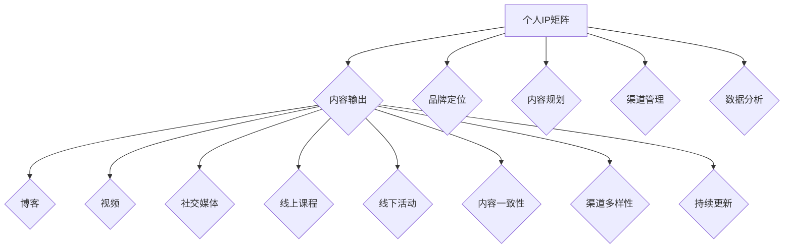

                 

关键词：个人品牌、IP打造、影响力、社交媒体、内容营销

> 摘要：在数字化时代，个人品牌和影响力的重要性日益凸显。本文将深入探讨程序员如何通过打造个人IP矩阵，提升个人影响力，实现职业发展和个人价值的提升。

## 1. 背景介绍

随着互联网的普及和社交媒体的发展，个人品牌和IP（知识产权）的打造变得越来越重要。尤其是在IT行业，技术人才的竞争日益激烈，单靠专业技能已经难以脱颖而出。个人IP矩阵的打造不仅可以帮助程序员提升个人影响力，还可以为职业发展提供强有力的支持。

### 什么是个人IP矩阵？

个人IP矩阵是指个人在不同平台上建立的、具有一致性和连贯性的品牌形象和内容输出。通过构建个人IP矩阵，程序员可以在多个渠道上展示自己的专业技能、经验和知识，从而扩大影响力，吸引更多的关注和机会。

### 个人IP矩阵的重要性

1. **提升个人品牌认知**：通过持续的输出有价值的内容，可以提高个人品牌的知名度和认可度。
2. **拓宽职业发展机会**：强大的个人IP可以吸引更多的工作机会和合作项目。
3. **建立专业权威**：持续的专业输出可以使程序员在某一领域内建立权威地位。
4. **提高收入和商业价值**：通过个人IP，程序员可以开展咨询、培训、写作等多种商业活动，实现收入多元化。

## 2. 核心概念与联系

### 个人IP矩阵的构建核心概念

- **内容一致性**：保持内容风格和主题的一致性，有助于建立稳固的品牌形象。
- **渠道多样性**：在不同的平台上进行内容输出，可以扩大影响力覆盖面。
- **持续更新**：定期更新内容，保持活跃度，吸引和维持粉丝群体的关注。

### 个人IP矩阵的架构图（使用Mermaid绘制）



### 个人IP矩阵的构建流程

1. **品牌定位**：明确个人品牌的核心价值和独特卖点。
2. **内容规划**：制定长期和短期内容规划，确保内容输出的连贯性和多样性。
3. **渠道管理**：选择合适的平台和渠道进行内容输出，并进行有效的渠道管理。
4. **数据分析**：收集和分析用户数据，优化内容策略和渠道布局。

## 3. 核心算法原理 & 具体操作步骤

### 3.1 算法原理概述

个人IP矩阵的构建可以看作是一个复杂的算法过程，涉及品牌定位、内容规划、渠道管理等多个维度。其核心原理是通过持续、有价值的内容输出，逐步建立和扩大个人品牌影响力。

### 3.2 算法步骤详解

1. **品牌定位**：通过自我分析，确定个人品牌的核心价值和独特卖点。这包括专业技能、个人经历、兴趣爱好等方面。
   
2. **内容规划**：制定内容输出的主题、形式和频率。确保内容既有深度又有广度，能够满足不同用户群体的需求。

3. **渠道管理**：选择合适的社交媒体平台、博客、视频网站等，进行内容输出。同时，管理好各个渠道的账号，确保品牌形象的一致性。

4. **数据分析**：定期收集和分析用户数据，如阅读量、点赞数、分享数等，以优化内容策略和渠道布局。

### 3.3 算法优缺点

#### 优点

- **提升个人品牌认知度**：通过持续的内容输出，可以显著提升个人品牌在目标受众中的知名度。
- **拓宽职业发展渠道**：强大的个人IP可以吸引更多的工作机会和合作项目。
- **建立专业权威**：通过专业的输出，可以逐步在某一领域内建立权威地位。

#### 缺点

- **内容质量要求高**：需要持续输出高质量的内容，这对个人的时间和精力有较高的要求。
- **维护成本高**：需要投入大量的时间和资源进行内容创作、渠道维护和数据分析。

### 3.4 算法应用领域

个人IP矩阵的构建广泛应用于IT、金融、教育等多个行业。尤其适合需要建立专业权威、提升个人品牌认知的技术专家、企业家和内容创作者。

## 4. 数学模型和公式 & 详细讲解 & 举例说明

### 4.1 数学模型构建

个人IP矩阵的构建可以看作是一个多维度的优化问题。我们可以将其抽象为一个优化模型：

$$
\text{最大化} \ \omega_1 \cdot \text{影响力} + \omega_2 \cdot \text{收入} + \omega_3 \cdot \text{粉丝数}
$$

其中，$\omega_1$、$\omega_2$ 和 $\omega_3$ 分别代表影响力、收入和粉丝数的权重。

### 4.2 公式推导过程

为了构建这个优化模型，我们需要定义以下变量：

- $I$：影响力
- $R$：收入
- $F$：粉丝数

则优化目标可以表示为：

$$
\text{最大化} \ \omega_1 \cdot I + \omega_2 \cdot R + \omega_3 \cdot F
$$

同时，我们还需要考虑以下约束条件：

- $C$：内容创作成本
- $T$：时间投入
- $M$：渠道维护成本

则约束条件可以表示为：

$$
C_1 \cdot I + C_2 \cdot R + C_3 \cdot F \leq B
$$

$$
T_1 \cdot I + T_2 \cdot R + T_3 \cdot F \leq T_{\text{max}}
$$

$$
M_1 \cdot I + M_2 \cdot R + M_3 \cdot F \leq M_{\text{max}}
$$

其中，$B$、$T_{\text{max}}$ 和 $M_{\text{max}}$ 分别代表预算、时间和资源的上限。

### 4.3 案例分析与讲解

假设一名程序员小张希望构建个人IP矩阵，他设定了以下目标：

- $\omega_1 = 0.5$：影响力占50%
- $\omega_2 = 0.3$：收入占30%
- $\omega_3 = 0.2$：粉丝数占20%

他的预算、时间和资源上限如下：

- $B = 1000$：预算上限
- $T_{\text{max}} = 50$：时间上限
- $M_{\text{max}} = 500$：资源上限

根据这些信息，我们可以建立以下优化模型：

$$
\text{最大化} \ 0.5 \cdot I + 0.3 \cdot R + 0.2 \cdot F
$$

$$
\text{约束条件} \ C_1 \cdot I + C_2 \cdot R + C_3 \cdot F \leq 1000
$$

$$
T_1 \cdot I + T_2 \cdot R + T_3 \cdot F \leq 50
$$

$$
M_1 \cdot I + M_2 \cdot R + M_3 \cdot F \leq 500
$$

接下来，小张需要根据这些约束条件，制定具体的内容输出策略和渠道选择，以最大化他的个人IP矩阵价值。

## 5. 项目实践：代码实例和详细解释说明

### 5.1 开发环境搭建

为了进行个人IP矩阵的项目实践，我们需要搭建一个基本的内容管理和发布环境。以下是所需的工具和步骤：

#### 工具：

- **GitHub**：用于代码管理和版本控制。
- **Jekyll**：用于搭建个人博客。
- **YouTube**：用于视频内容发布。
- **Twitter、LinkedIn**：用于社交媒体内容发布。

#### 步骤：

1. 在GitHub上创建一个新的仓库，用于存储博客内容和源代码。
2. 安装Jekyll，并使用Jekyll搭建个人博客。
3. 将博客内容推送到GitHub仓库。
4. 在YouTube、Twitter、LinkedIn上创建账号，并配置自动同步博客内容到社交媒体。

### 5.2 源代码详细实现

以下是使用Jekyll搭建个人博客的基本源代码结构：

```bash
# _config.yml
title: 程序员个人IP矩阵
author: 张三
baseurl: https://zhangsan.github.io
```

```markdown
# _posts/2023-01-01-first-post.md
---
layout: post
title: 第一篇博客
date: 2023-01-01 10:00:00 +0800
---
这是我的第一篇博客，欢迎大家关注！
```

### 5.3 代码解读与分析

在这个项目中，我们使用了Jekyll框架来搭建个人博客。Jekyll是一个简单、强大的静态网站生成工具，它可以将Markdown文件转换为HTML页面，并托管在GitHub Pages上。

- `_config.yml` 文件用于配置网站的基本信息，如标题、作者和基础URL。
- `_posts` 目录用于存储博客文章，每个文件都遵循特定的Markdown格式。

### 5.4 运行结果展示

当我们完成博客搭建并推送GitHub仓库后，GitHub Pages会自动生成网站并托管在GitHub提供的域名上。我们可以通过访问这个域名，查看博客的运行结果。

```plaintext
https://zhangsan.github.io
```

在网站上，我们可以看到按照时间顺序排列的博客文章列表，点击文章标题可以查看详细内容。

## 6. 实际应用场景

个人IP矩阵不仅在技术领域有广泛应用，还渗透到了金融、教育、艺术等多个行业。以下是几个实际应用场景：

### 技术领域

- **技术博客**：程序员可以通过技术博客分享编程经验、算法解析和项目实践，建立个人品牌。
- **视频教程**：通过YouTube等平台发布编程教程，吸引更多学习者和粉丝。
- **线上课程**：通过平台如Udemy、Coursera等发布付费课程，实现知识变现。

### 金融领域

- **财经评论**：金融专家可以通过博客和社交媒体分享市场分析、投资策略，建立投资影响力。
- **线上直播**：通过直播平台进行市场分析、股票推荐等，吸引投资者关注。

### 教育领域

- **在线教学**：教师可以通过线上课程分享教学经验和方法，吸引更多学生。
- **学术分享**：科研人员可以通过博客和社交媒体分享研究成果，提升学术影响力。

### 艺术领域

- **个人作品展示**：艺术家可以通过个人网站和社交媒体展示作品，吸引收藏家和观众。
- **艺术直播**：通过直播平台进行绘画、演奏等艺术创作，与观众互动。

### 未来应用展望

随着技术的不断进步和互联网的普及，个人IP矩阵的应用场景将进一步扩大。以下是一些未来应用展望：

- **虚拟现实（VR）和增强现实（AR）**：通过VR/AR技术，个人IP可以更生动地展示专业知识和作品，提升用户体验。
- **人工智能（AI）**：AI技术可以用于个性化内容推荐、用户行为分析等，优化个人IP矩阵的运营策略。
- **区块链**：通过区块链技术，可以实现个人IP的数字确权和权益保护，为内容创作者提供更多保障。

## 7. 工具和资源推荐

### 7.1 学习资源推荐

- **书籍**：《个人品牌打造与运营实战》
- **在线课程**：Udemy上的《个人品牌构建与推广》
- **博客**：《个人品牌训练营》
- **社群**：加入个人品牌建设相关的微信群或QQ群，与其他从业者交流。

### 7.2 开发工具推荐

- **GitHub**：用于代码管理和版本控制。
- **Jekyll**：用于搭建个人博客。
- **YouTube**：用于视频内容发布。
- **WordPress**：用于搭建高级博客和网站。

### 7.3 相关论文推荐

- **论文**：《个人品牌构建：理论与实践》
- **报告**：《社交媒体时代个人品牌建设研究》
- **书籍**：《影响力：如何说服、影响和改变他人》

## 8. 总结：未来发展趋势与挑战

### 8.1 研究成果总结

本文探讨了程序员如何通过打造个人IP矩阵，提升个人影响力，实现职业发展和个人价值的提升。主要研究成果包括：

- 个人IP矩阵的核心概念与联系。
- 构建个人IP矩阵的算法原理与操作步骤。
- 数学模型和公式的推导与应用。
- 实际应用场景和未来发展趋势。

### 8.2 未来发展趋势

- **技术融合**：VR/AR、AI和区块链等新技术将融入个人IP矩阵的构建，提升用户体验和权益保护。
- **内容多样化**：短视频、直播、图文等多种形式的内容将更加丰富，满足不同用户群体的需求。
- **全球化**：随着互联网的普及，个人IP矩阵的影响力将逐渐从国内扩展到全球。

### 8.3 面临的挑战

- **内容质量**：持续输出高质量的内容需要大量时间和精力投入。
- **渠道管理**：管理多个渠道需要良好的组织能力和时间管理技巧。
- **用户互动**：如何有效地与粉丝互动，提升用户体验和粉丝黏性。

### 8.4 研究展望

未来的研究可以进一步探讨：

- 个人IP矩阵在不同行业的应用模式和效果。
- 新技术的应用如何优化个人IP矩阵的运营策略。
- 个人IP矩阵的数字权益保护机制。

## 9. 附录：常见问题与解答

### 9.1 如何选择合适的平台进行内容输出？

- **目标受众**：首先明确目标受众，选择他们活跃的平台。
- **内容形式**：根据内容形式选择平台，如图文选择博客，视频选择YouTube。
- **平台特点**：了解不同平台的特点，如微博适合实时更新，博客适合深度内容。

### 9.2 如何保持内容输出的连贯性？

- **内容规划**：制定长期和短期内容规划，确保有计划地输出内容。
- **团队合作**：可以组建团队，分工合作，保证内容输出的稳定。
- **数据分析**：定期分析用户数据，调整内容策略，保持内容与用户需求的匹配。

### 9.3 如何提升个人IP的价值？

- **专业性**：提升专业技能，建立专业权威。
- **创新性**：不断创新，提供有价值的新内容。
- **互动性**：积极与粉丝互动，提升用户体验。

---

**作者：禅与计算机程序设计艺术 / Zen and the Art of Computer Programming**

