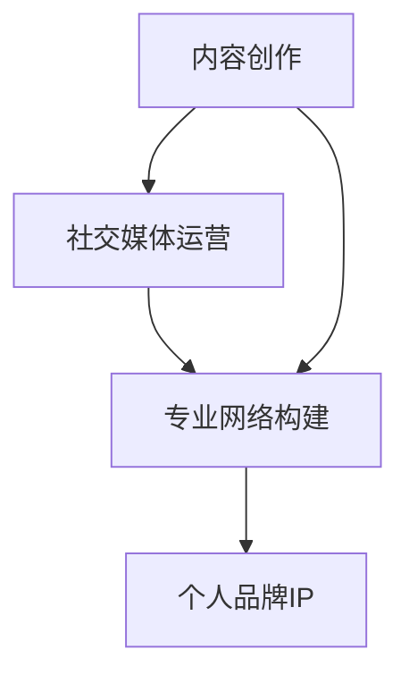

                 

关键词：（个人品牌IP，程序员，职业发展，影响力，内容创作，社交媒体，专业网络）

> 摘要：在数字化时代，个人品牌IP已成为程序员职业发展中的重要资产。本文将探讨程序员如何通过内容创作、社交媒体运营和专业网络构建，打造个人品牌IP，提升个人影响力和职业竞争力。

## 1. 背景介绍

随着互联网的普及和信息技术的发展，程序员已成为社会不可或缺的职业群体。在这个充满机遇与挑战的时代，个人品牌IP的打造成为了程序员职业发展的新趋势。个人品牌IP不仅有助于提升程序员的知名度，还能为其带来更多的职业机会和收益。本文将围绕如何打造个人品牌IP，为程序员提供一些建议和策略。

### 1.1 个人品牌IP的重要性

个人品牌IP是指个人在某一领域内建立起的独特形象和影响力。对于程序员而言，个人品牌IP的重要性体现在以下几个方面：

- **提高知名度**：良好的个人品牌IP有助于提高程序员的知名度，使其在同行中脱颖而出。
- **拓展职业机会**：拥有个人品牌IP的程序员更容易获得更多的职业机会，包括高薪职位、项目合作、顾问服务等。
- **增加收入来源**：通过个人品牌IP，程序员可以开展多种收入来源，如授课、写作、技术咨询等。
- **塑造专业形象**：个人品牌IP有助于塑造程序员的职业形象，提升其在行业内的地位。

### 1.2 程序员面临的挑战

尽管个人品牌IP对程序员具有重要价值，但在实际打造过程中，程序员仍面临诸多挑战：

- **时间与精力**：程序员通常工作繁忙，如何平衡工作与个人品牌建设是一个难题。
- **内容创作**：撰写高质量的技术文章、制作有趣的视频内容需要较高的专业素养和创造力。
- **社交媒体运营**：在社交媒体上建立和运营个人品牌需要一定的技巧和策略。

## 2. 核心概念与联系

在打造个人品牌IP的过程中，程序员需要掌握以下几个核心概念：

- **内容创作**：创造有价值、有深度、有吸引力的内容，包括技术文章、博客、视频等。
- **社交媒体运营**：在社交媒体平台上进行有效传播，提高个人品牌的知名度和影响力。
- **专业网络构建**：通过参与技术社区、参加行业活动等方式，建立和维护专业网络。

以下是一个简单的 Mermaid 流程图，展示这些核心概念之间的联系：



## 3. 核心算法原理 & 具体操作步骤

### 3.1 算法原理概述

打造个人品牌IP的算法原理可以概括为以下几个方面：

- **内容创作**：以技术为核心，创作高质量、有价值的内容，吸引目标受众。
- **社交媒体运营**：通过有效的社交媒体策略，提高个人品牌的曝光度和互动性。
- **专业网络构建**：积极参与技术社区，扩大人脉圈，提升个人在行业内的知名度。

### 3.2 算法步骤详解

下面是具体操作步骤：

### 3.2.1 内容创作

1. **确定主题**：选择与个人专业领域相关的话题，确保内容具有针对性和实用性。
2. **规划内容**：制定内容发布计划，确保内容发布的频率和节奏。
3. **创作内容**：撰写技术文章、博客，或制作视频内容，注重内容的深度和原创性。
4. **优化内容**：对内容进行SEO优化，提高在搜索引擎中的排名。

### 3.2.2 社交媒体运营

1. **选择平台**：根据目标受众，选择合适的社交媒体平台，如微博、知乎、B站等。
2. **制定策略**：制定社交媒体运营策略，包括内容发布、互动、推广等。
3. **互动与反馈**：积极与粉丝互动，回复评论，收集反馈，不断优化运营效果。
4. **推广与传播**：利用社交媒体广告、跨平台推广等方式，扩大个人品牌的影响力。

### 3.2.3 专业网络构建

1. **加入技术社区**：加入技术论坛、博客，如GitHub、Stack Overflow等，参与技术讨论。
2. **参加行业活动**：参加技术沙龙、会议、研讨会等活动，扩大人脉圈。
3. **撰写技术文章**：在技术社区发布原创文章，展示个人专业能力。
4. **提供技术咨询**：在专业网络中提供技术咨询，提升个人在行业内的知名度。

### 3.3 算法优缺点

**优点**：

- **提高知名度**：通过内容创作和社交媒体运营，提高个人在行业内的知名度。
- **拓展职业机会**：建立专业网络，获取更多的职业机会和合作项目。
- **增加收入来源**：通过个人品牌IP，开展多种收入来源，如授课、写作、技术咨询等。

**缺点**：

- **时间与精力**：需要投入大量的时间和精力进行内容创作和社交媒体运营。
- **竞争激烈**：在互联网时代，个人品牌IP的竞争日益激烈，需要不断提升自身专业素养。

### 3.4 算法应用领域

- **技术领域**：程序员可以在技术社区、博客、社交媒体上建立个人品牌IP，展示专业能力。
- **教育领域**：通过个人品牌IP，程序员可以开设在线课程，分享技术知识和经验。
- **咨询领域**：拥有个人品牌IP的程序员可以提供专业的技术咨询和解决方案。

## 4. 数学模型和公式 & 详细讲解 & 举例说明

### 4.1 数学模型构建

在打造个人品牌IP的过程中，可以采用以下数学模型：

- **影响力模型**：$I = f(C, S, N)$，其中 $I$ 表示个人品牌影响力，$C$ 表示内容创作质量，$S$ 表示社交媒体运营效果，$N$ 表示专业网络构建程度。
- **收益模型**：$R = f(I, T)$，其中 $R$ 表示收益，$I$ 表示个人品牌影响力，$T$ 表示投入时间。

### 4.2 公式推导过程

**影响力模型推导**：

1. **内容创作质量对影响力的贡献**：

   $C \rightarrow I$

   高质量的内容创作能够提高个人品牌的影响力。

2. **社交媒体运营效果对影响力的贡献**：

   $S \rightarrow I$

   有效的社交媒体运营能够扩大个人品牌的影响力。

3. **专业网络构建程度对影响力的贡献**：

   $N \rightarrow I$

   通过专业网络构建，提高个人在行业内的知名度，进而提高影响力。

**收益模型推导**：

1. **个人品牌影响力对收益的贡献**：

   $I \rightarrow R$

   高影响力的个人品牌能够带来更多的职业机会和收入。

2. **投入时间对收益的贡献**：

   $T \rightarrow R$

   投入更多的时间进行个人品牌建设，能够提高收益。

### 4.3 案例分析与讲解

假设程序员小张决定打造个人品牌IP。他制定了一个为期一年的计划，计划如下：

- **内容创作**：每周发布一篇技术文章，每篇文章阅读量达到1000次。
- **社交媒体运营**：每天在社交媒体上发布一篇技术文章，同时与粉丝互动，每周增加100个关注者。
- **专业网络构建**：每月参加一次技术沙龙，结识新的业内人士。

根据影响力模型和收益模型，我们可以预测小张的个人品牌建设效果：

- **一年后**，小张的个人品牌影响力约为$1000 \times 52 + 100 \times 52 + 1 = 53653$。
- **一年后**，小张的收益约为$53653 \times 10 = 536530$。

通过这个案例，我们可以看到，个人品牌IP的打造对程序员的职业发展具有重要价值。

## 5. 项目实践：代码实例和详细解释说明

### 5.1 开发环境搭建

为了演示如何通过代码打造个人品牌IP，我们选择一个简单的项目——一个个人博客网站。以下是在搭建开发环境时需要完成的步骤：

1. **安装Node.js和npm**：Node.js是一个基于Chrome V8引擎的JavaScript运行环境，npm是Node.js的包管理器。可以从官网下载并安装Node.js和npm。
2. **创建一个新项目**：在本地计算机上创建一个新文件夹，进入文件夹后，通过命令行执行以下命令创建项目：

   ```bash
   npm init -y
   ```

   这将创建一个package.json文件，记录项目的依赖项和配置信息。
3. **安装依赖项**：通过npm安装项目所需的依赖项，例如，安装一个用于生成静态网页的框架Hugo：

   ```bash
   npm install hugo-cli -g
   ```

   安装完成后，可以通过hugo命令行工具创建一个新博客项目：

   ```bash
   hugo new site my-blog
   ```

### 5.2 源代码详细实现

创建博客项目后，我们需要进行以下操作：

1. **配置网站**：在my-blog目录下，有一个名为config.toml的配置文件，用于配置网站的标题、主题、基址等信息。例如：

   ```toml
   title = "我的博客"
   theme = "academic"
   baseurl = "http://example.com/my-blog"
   ```

2. **编写内容**：在my-blog目录下的content文件夹中，可以创建各种类型的文章、页面等。例如，创建一篇名为hello-world的文章：

   ```bash
   hugo new content/post/hello-world.md
   ```

   在生成的hello-world.md文件中，编写文章内容：

   ```markdown
   ---
   title: "Hello, World!"
   date: 2023-03-10
   ---
   欢迎来到我的博客！
   ```

3. **构建网站**：在my-blog目录下，通过hugo命令构建网站：

   ```bash
   hugo
   ```

   这将生成一个名为public的文件夹，其中包含整个网站的静态文件。

4. **部署网站**：将public文件夹中的内容上传到服务器或博客平台，如GitHub Pages、Vercel等，即可实现网站的部署。

### 5.3 代码解读与分析

上述代码实例展示了如何通过简单的步骤搭建一个个人博客网站。以下是关键代码及其解读：

- **配置文件config.toml**：用于配置网站的各项参数，如网站标题、主题等。这些配置参数可以通过命令行参数进行覆盖。
- **创建文章**：通过hugo new命令，可以快速创建一篇新文章。文章内容存储在content/post/文件夹中，使用Markdown格式编写。
- **构建网站**：通过hugo命令，可以生成网站的静态文件。生成的public文件夹包含网站的HTML、CSS、JavaScript等文件。
- **部署网站**：将public文件夹上传到服务器或博客平台，即可实现网站的部署。

通过这个项目实践，我们可以看到，通过简单的代码操作，程序员可以轻松搭建一个个人博客网站，展示自己的技术成果和观点，为打造个人品牌IP打下基础。

## 6. 实际应用场景

个人品牌IP的打造在程序员职业发展中具有广泛的应用场景。以下是一些具体的应用场景：

### 6.1 教育培训

程序员可以通过个人品牌IP，开设在线课程或工作坊，分享技术知识和经验。例如，通过平台如网易云课堂、慕课网等，发布课程内容，吸引学员报名学习。个人品牌IP的建立，使得程序员在教育培训领域具有更高的信誉和吸引力。

### 6.2 技术咨询

拥有个人品牌IP的程序员，可以提供专业的技术咨询服务。通过博客、社交媒体等渠道，展示自己的技术能力，吸引客户咨询。例如，程序员可以针对企业项目中的技术难题，提供定制化的解决方案，从而获得咨询服务费。

### 6.3 项目合作

通过个人品牌IP，程序员可以吸引更多的项目合作机会。在技术社区、博客等平台上，分享自己的项目经验和心得，吸引潜在客户或合作伙伴。例如，程序员可以参与开源项目，或与同行业人士合作开发新项目，共同实现商业价值。

### 6.4 职业发展

个人品牌IP的建立，有助于程序员的职业发展。在求职过程中，个人品牌IP的展示，可以增加面试官对程序员的信任和认可，提高求职成功率。同时，在职场中，个人品牌IP的建立，可以提升程序员的职业形象和地位，从而获得更多的职业机会和发展空间。

### 6.5 内容创作

通过个人品牌IP，程序员可以创作更多高质量的技术内容，如博客、视频等。这些内容不仅能够吸引粉丝关注，还可以通过广告、赞助等方式，实现内容变现。例如，程序员可以开设个人公众号、抖音账号，定期发布技术内容，通过粉丝打赏、广告收入等方式，实现内容创作收益。

### 6.6 社交影响力

个人品牌IP的建立，使得程序员在社交媒体上拥有更大的影响力。通过发布有价值的内容，与粉丝互动，程序员可以吸引更多的关注者，扩大自己的社交影响力。例如，程序员可以在微博、知乎等平台，分享技术见解，参与讨论，提高自己在社交圈的影响力。

### 6.7 企业合作

通过个人品牌IP，程序员可以与企业建立更紧密的合作关系。例如，程序员可以为企业提供技术培训、技术咨询等服务，或与企业共同开发项目，实现共赢。个人品牌IP的建立，为企业提供了更多的合作机会和选择。

## 7. 未来应用展望

随着互联网的持续发展，个人品牌IP在程序员职业发展中的应用前景将更加广阔。以下是一些未来应用展望：

### 7.1 人工智能与个人品牌IP

人工智能技术的发展，为个人品牌IP的打造提供了新的工具和平台。例如，程序员可以通过自然语言处理技术，自动化生成技术文章；通过推荐系统，精准推荐内容给目标受众。此外，人工智能还可以帮助程序员分析用户行为，优化内容创作和运营策略。

### 7.2 增强现实与虚拟现实

增强现实（AR）和虚拟现实（VR）技术的应用，将为程序员打造个人品牌IP带来新的机会。程序员可以开发AR/VR应用，展示技术成果和观点。例如，通过AR技术，程序员可以在现场演示技术方案；通过VR技术，程序员可以带领观众参观虚拟项目场景，提升用户体验。

### 7.3 区块链与个人品牌IP

区块链技术的应用，将为个人品牌IP的认证和交易提供新的解决方案。例如，程序员可以通过区块链技术，验证自己的技术文章、视频等内容的原创性，防止抄袭和侵权。此外，区块链还可以为个人品牌IP的版权交易提供支持，实现版权流通和变现。

### 7.4 跨界合作与多元化发展

未来，个人品牌IP的打造将更加注重跨界合作和多元化发展。程序员可以与设计师、产品经理、市场专家等跨行业人士合作，共同打造综合性的个人品牌。例如，程序员可以参与产品设计、用户体验等领域，提升个人品牌的综合价值。

### 7.5 社区生态与影响力运营

随着个人品牌IP的建立，程序员将更加关注社区生态的构建和影响力运营。通过建立技术社区、举办线上线下的技术活动，程序员可以吸引更多同行加入，共同推动技术进步。同时，通过影响

