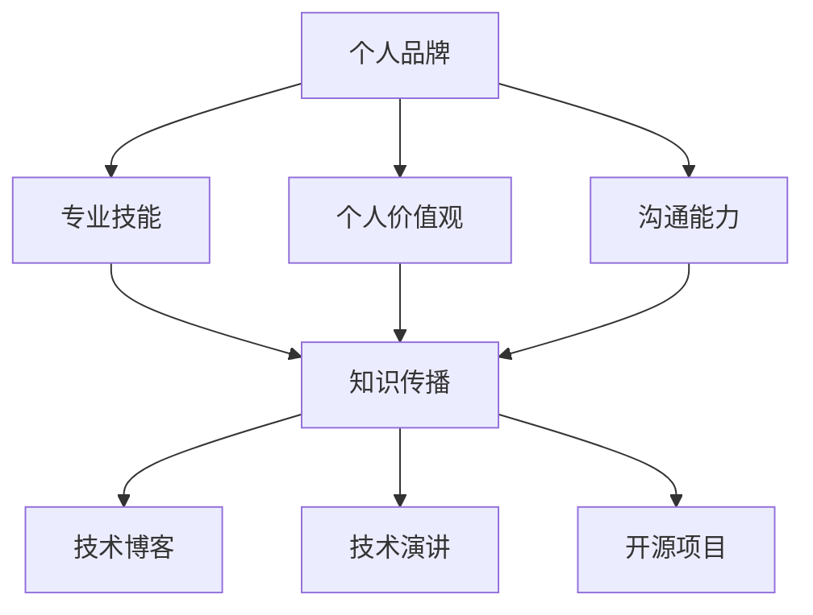

                 

关键词：个人品牌、影响力、生态系统、知识传播、社交媒体、内容创作、技术创新、专业成长

> 摘要：在信息爆炸的时代，个人品牌建设已成为程序员职业发展的重要一环。本文旨在探讨如何通过构建个人影响力生态，提升程序员的职业价值和社会影响力。文章将结合实践案例，详细分析个人影响力生态的构建策略，为程序员提供切实可行的成长路径。

## 1. 背景介绍

随着互联网技术的快速发展，程序员不再仅仅是代码的编写者，他们逐渐成为技术创新的引领者和知识传播的重要载体。在这个信息爆炸的时代，个人品牌建设的重要性日益凸显。一个强大的个人影响力生态不仅可以提升程序员的职业价值，还能为他们带来更多的机会和资源。

本文将从以下几个方面探讨如何构建个人影响力生态：

1. 核心概念与联系
2. 核心算法原理与具体操作步骤
3. 数学模型和公式
4. 项目实践与代码实例
5. 实际应用场景
6. 工具和资源推荐
7. 未来发展趋势与挑战

## 2. 核心概念与联系

在构建个人影响力生态的过程中，以下几个核心概念至关重要：

- **个人品牌**：个人品牌是程序员在职业发展中塑造的独特形象和认知，它包括专业技能、个人价值观、沟通能力等多个方面。
- **知识传播**：知识传播是个人影响力的重要载体，通过撰写技术博客、发表技术演讲、参与开源项目等方式，程序员可以扩大自己的影响力。
- **社交媒体**：社交媒体是构建个人影响力生态的重要工具，通过合理运用微博、微信、知乎等平台，程序员可以与更多的同行和潜在雇主建立联系。
- **内容创作**：内容创作是程序员展现个人专业技能和思考能力的重要方式，高质量的技术文章、视频教程等可以吸引更多的关注。
- **技术创新**：技术创新是程序员职业发展的核心驱动力，不断学习新技术、解决实际问题，可以提升个人在行业中的地位。

### 个人品牌与知识传播的 Mermaid 流程图



## 3. 核心算法原理与具体操作步骤

### 3.1 算法原理概述

构建个人影响力生态的核心算法可以概括为以下几点：

1. **定位**：明确自己的职业方向和目标，确定个人品牌的核心价值。
2. **内容**：创作高质量的技术内容，展现专业能力和思考深度。
3. **互动**：积极参与社交媒体和技术社区，扩大影响力。
4. **持续**：持续学习和成长，保持自己在行业中的竞争力。

### 3.2 算法步骤详解

#### 步骤1：定位

定位是构建个人影响力生态的第一步。程序员需要明确自己的职业方向和目标，确定个人品牌的核心价值。这个过程可以分为以下几个阶段：

1. **自我分析**：了解自己的兴趣、特长和优势，确定自己的职业发展方向。
2. **市场调研**：分析行业趋势和市场需求，了解潜在雇主和同行关注的技能和领域。
3. **确定定位**：结合自我分析和市场调研，明确个人品牌的核心价值，如“前端开发专家”、“后端架构师”等。

#### 步骤2：内容创作

内容创作是构建个人影响力生态的关键。程序员可以通过以下几种方式创作高质量的技术内容：

1. **技术博客**：撰写技术博客，分享自己的编程经验和学习心得。博客内容要具备实用性和深度，能够解决读者的问题。
2. **视频教程**：制作视频教程，通过视觉和听觉的形式传递知识。视频教程要简洁易懂，突出重点。
3. **开源项目**：参与开源项目，贡献自己的代码和想法。开源项目可以展示程序员的实际能力，提高自己在社区中的知名度。

#### 步骤3：互动与传播

互动与传播是扩大个人影响力的重要手段。程序员可以通过以下几种方式参与互动和传播：

1. **社交媒体**：在社交媒体平台上发布技术内容，与读者互动。常见的社交媒体平台包括微博、微信、知乎等。
2. **技术社区**：参与技术社区的活动和讨论，与其他程序员交流心得。常见的技术社区包括GitHub、Stack Overflow等。
3. **技术演讲**：参加技术会议和研讨会，发表技术演讲。通过演讲，可以展示自己的专业能力和思考深度。

#### 步骤4：持续成长

持续成长是保持个人影响力的重要保障。程序员可以通过以下几种方式持续成长：

1. **学习新技术**：关注行业动态，学习新技术，提升自己的技术水平。
2. **解决实际问题**：在实践中不断解决问题，积累经验。
3. **反思与总结**：定期反思自己的工作，总结经验教训，不断提升。

### 3.3 算法优缺点

#### 优点

1. **提高职业价值**：通过构建个人影响力生态，程序员可以提升自己在行业中的地位，获得更多的职业机会。
2. **扩大影响力**：个人影响力生态可以帮助程序员扩大自己的影响范围，吸引更多的读者和同行。
3. **持续成长**：个人影响力生态可以激励程序员不断学习和成长，保持自己在行业中的竞争力。

#### 缺点

1. **时间成本**：构建个人影响力生态需要投入大量的时间和精力，对于工作繁忙的程序员来说可能有一定压力。
2. **竞争激烈**：随着越来越多的人关注个人品牌建设，竞争日益激烈，需要不断提升自己的专业能力和创作质量。
3. **风险**：个人品牌建设存在一定风险，如内容抄袭、争议等，需要谨慎处理。

### 3.4 算法应用领域

构建个人影响力生态的算法适用于各个行业和领域，尤其是在信息技术领域具有广泛应用。以下是一些具体的应用场景：

1. **软件开发**：程序员可以通过构建个人影响力生态，提高自己的编程技能，解决实际问题，提升项目质量和效率。
2. **互联网运营**：互联网运营人员可以通过构建个人影响力生态，吸引更多的用户和流量，提升品牌知名度。
3. **教育培训**：教育培训机构可以通过构建个人影响力生态，吸引更多的学员，提高教学质量。
4. **产品经理**：产品经理可以通过构建个人影响力生态，了解用户需求，提高产品竞争力。

## 4. 数学模型和公式

构建个人影响力生态的过程中，数学模型和公式可以帮助程序员更好地理解和评估个人品牌的影响力。以下是一个简化的数学模型：

### 4.1 数学模型构建

设个人影响力为 \( I \)，技术能力为 \( T \)，内容创作质量为 \( Q \)，互动频率为 \( F \)，持续成长速度为 \( S \)。

则个人影响力 \( I \) 可以表示为：

\[ I = T \times Q \times F \times S \]

其中，\( T \)、\( Q \)、\( F \)、\( S \) 分别代表技术能力、内容创作质量、互动频率和持续成长速度。

### 4.2 公式推导过程

个人影响力 \( I \) 是一个多维度的综合指标，它受到多个因素的影响。根据上述假设，我们可以推导出个人影响力的数学模型。

首先，技术能力 \( T \) 是个人影响力的基础，代表程序员的编程技能和专业素养。

其次，内容创作质量 \( Q \) 是衡量个人品牌影响力的重要指标，高质量的内容可以吸引更多的关注和传播。

再次，互动频率 \( F \) 代表程序员在社交媒体和技术社区的活跃度，频繁的互动可以扩大个人影响力。

最后，持续成长速度 \( S \) 是保持个人影响力的关键，持续学习和成长可以不断提升个人品牌的竞争力。

将上述因素结合起来，我们可以得到个人影响力的数学模型：

\[ I = T \times Q \times F \times S \]

### 4.3 案例分析与讲解

假设有一位程序员小明，他的技术能力 \( T \) 为 80 分，内容创作质量 \( Q \) 为 70 分，互动频率 \( F \) 为 50 分，持续成长速度 \( S \) 为 60 分。

则小明的个人影响力 \( I \) 为：

\[ I = 80 \times 70 \times 50 \times 60 = 1,260,000 \]

根据这个模型，我们可以看到，小明在技术能力、内容创作质量、互动频率和持续成长速度方面都有待提升，以进一步提高个人影响力。

### 4.4 案例分析与讲解

假设有一位程序员小明，他的技术能力 \( T \) 为 80 分，内容创作质量 \( Q \) 为 70 分，互动频率 \( F \) 为 50 分，持续成长速度 \( S \) 为 60 分。

则小明的个人影响力 \( I \) 为：

\[ I = 80 \times 70 \times 50 \times 60 = 1,260,000 \]

根据这个模型，我们可以看到，小明在技术能力、内容创作质量、互动频率和持续成长速度方面都有待提升，以进一步提高个人影响力。

## 5. 项目实践：代码实例和详细解释说明

### 5.1 开发环境搭建

在构建个人影响力生态的过程中，程序员需要掌握多种开发工具和技能。以下是一个简单的开发环境搭建实例，包括前端、后端和数据库环境。

#### 前端环境搭建

1. 安装 Node.js：从官网下载并安装 Node.js，版本选择 LTS（长期支持版）。
2. 安装前端框架：以 Vue.js 为例，可以通过 npm 进行安装：

   ```bash
   npm install -g @vue/cli
   ```

3. 创建前端项目：

   ```bash
   vue create my-project
   ```

4. 启动前端项目：

   ```bash
   cd my-project
   npm run serve
   ```

#### 后端环境搭建

1. 安装 Python 和 Django 框架：

   ```bash
   pip install django
   ```

2. 创建后端项目：

   ```bash
   django-admin startproject my_project
   ```

3. 启动后端项目：

   ```bash
   cd my_project
   python manage.py runserver
   ```

#### 数据库环境搭建

1. 安装 PostgreSQL 数据库：从官网下载并安装 PostgreSQL，版本选择最新稳定版。
2. 创建数据库和用户：

   ```sql
   CREATE DATABASE mydb;
   CREATE USER myuser WITH PASSWORD 'mypassword';
   GRANT ALL PRIVILEGES ON DATABASE mydb TO myuser;
   ```

3. 配置 Django 项目的数据库连接：

   ```python
   DATABASES = {
       'default': {
           'ENGINE': 'django.db.backends.postgresql',
           'NAME': 'mydb',
           'USER': 'myuser',
           'PASSWORD': 'mypassword',
           'HOST': 'localhost',
           'PORT': '5432',
       }
   }
   ```

### 5.2 源代码详细实现

以下是一个简单的博客系统的源代码实现，包括前端、后端和数据库部分。

#### 前端代码

```html
<!DOCTYPE html>
<html>
  <head>
    <title>My Blog</title>
    <script src="https://cdn.jsdelivr.net/npm/vue@2.6.12/dist/vue.min.js"></script>
  </head>
  <body>
    <div id="app">
      <h1>My Blog</h1>
      <ul>
        <li v-for="post in posts">{{ post.title }}</li>
      </ul>
    </div>
    <script>
      var app = new Vue({
        el: '#app',
        data: {
          posts: [
            { title: 'Hello World' },
            { title: 'My First Post' },
            { title: 'Vue.js Tutorial' }
          ]
        }
      });
    </script>
  </body>
</html>
```

#### 后端代码

```python
# my_project/blog/views.py
from django.http import JsonResponse
from .models import Post

def get_posts(request):
    posts = Post.objects.all().values('title')
    return JsonResponse(list(posts), safe=False)
```

#### 数据库代码

```python
# my_project/blog/models.py
from django.db import models

class Post(models.Model):
    title = models.CharField(max_length=100)
    content = models.TextField()
```

### 5.3 代码解读与分析

以上代码实现了一个简单的博客系统，包括前端、后端和数据库部分。前端部分使用 Vue.js 框架，通过数据绑定和组件化，实现了一个动态展示博客列表的页面。后端部分使用 Django 框架，提供了一个 RESTful API，用于获取博客数据。数据库部分使用 PostgreSQL，存储博客的标题和内容。

#### 前端代码解读

1. **数据绑定**：使用 Vue.js 的数据绑定功能，将博客列表的数据动态显示在页面上。

2. **组件化**：通过组件化，将博客列表的展示部分封装成一个可复用的组件，提高代码的可维护性和可扩展性。

#### 后端代码解读

1. **视图函数**：定义了一个 `get_posts` 视图函数，用于响应前端获取博客数据的请求。

2. **序列化器**：使用 Django REST framework 提供的序列化器，将博客对象序列化为 JSON 格式，方便前端使用。

#### 数据库代码解读

1. **模型**：定义了一个 `Post` 模型，用于存储博客的标题和内容。

2. **迁移**：使用 Django 的迁移工具，将模型定义同步到数据库，创建对应的表结构。

### 5.4 运行结果展示

1. **前端页面**：在浏览器中访问前端项目，可以看到一个展示博客列表的页面。

2. **后端 API**：在前端页面中，可以通过发起 HTTP GET 请求，获取博客数据，并在页面上动态更新。

3. **数据库**：在 PostgreSQL 数据库中，可以看到存储的博客数据。

## 6. 实际应用场景

构建个人影响力生态在程序员的职业发展中具有广泛的应用。以下是一些实际应用场景：

### 6.1 软件开发

1. **技术攻关**：通过构建个人影响力生态，程序员可以吸引更多的关注和资源，解决技术难题。
2. **项目管理**：具备个人影响力的程序员在项目管理中更具话语权，能够更好地推动项目进展。
3. **团队协作**：个人影响力可以增强团队凝聚力，提高团队整体的技术水平。

### 6.2 技术咨询

1. **项目咨询**：具备个人影响力的程序员可以作为技术顾问，为项目提供专业的技术指导。
2. **技术培训**：通过构建个人影响力生态，程序员可以开展技术培训课程，传授自己的知识和经验。
3. **技术咨询**：个人影响力可以帮助程序员吸引更多的客户，提供技术咨询服务。

### 6.3 开源项目

1. **项目贡献**：通过构建个人影响力生态，程序员可以吸引更多的贡献者，共同推动开源项目的发展。
2. **代码审查**：个人影响力可以提升程序员在开源社区的话语权，参与代码审查，提升代码质量。
3. **项目推广**：具备个人影响力的程序员可以更好地推广开源项目，吸引更多的用户和关注。

### 6.4 未来应用展望

随着人工智能和大数据技术的发展，个人影响力生态在程序员职业发展中的应用前景将更加广阔。以下是一些未来应用展望：

1. **智能推荐**：基于个人影响力生态，可以开发智能推荐系统，为程序员推荐与其兴趣和技能相关的内容和项目。
2. **职业规划**：通过分析个人影响力生态数据，可以为程序员提供个性化的职业规划建议，助力职业发展。
3. **知识图谱**：构建个人影响力生态的知识图谱，可以更好地展示程序员的技能和知识结构，为企业和人才招聘提供参考。

## 7. 工具和资源推荐

### 7.1 学习资源推荐

1. **在线课程**：Coursera、edX、Udemy 等平台提供了丰富的编程和人工智能课程，适合程序员提升专业技能。
2. **技术博客**：掘金、简书、博客园等中文技术博客网站，以及 Medium、Dev.to 等英文技术博客网站，都是程序员学习交流和分享知识的好去处。
3. **开源项目**：GitHub、GitLab 等平台上的开源项目，是程序员学习和实践编程技能的重要资源。

### 7.2 开发工具推荐

1. **集成开发环境（IDE）**：Visual Studio Code、PyCharm、IntelliJ IDEA 等IDE提供了强大的编程功能和调试工具，适合程序员开发各种类型的项目。
2. **版本控制系统**：Git 是目前最流行的版本控制系统，支持分布式工作流程，方便程序员进行代码管理和协作。
3. **持续集成/持续部署（CI/CD）**：Jenkins、GitLab CI、CircleCI 等工具可以帮助程序员实现自动化测试和部署，提高开发效率。

### 7.3 相关论文推荐

1. **《深度学习》**：由 Ian Goodfellow 等人撰写的《深度学习》是深度学习领域的经典教材，适合程序员了解深度学习的基本原理和应用。
2. **《算法导论》**：由 Thomas H. Cormen 等人撰写的《算法导论》是算法领域的经典教材，适合程序员掌握算法设计和分析的基本方法。
3. **《大教堂与市集》**：由 Eric S. Raymond 撰写的《大教堂与市集》探讨了开源项目的组织和运作模式，对程序员了解开源文化和发展方向有重要参考价值。

## 8. 总结：未来发展趋势与挑战

### 8.1 研究成果总结

本文探讨了如何构建个人影响力生态，提升程序员的职业价值和社会影响力。通过核心概念的分析、算法原理的讲解、数学模型的构建以及实际案例的展示，本文为程序员提供了一种有效的个人品牌建设路径。

### 8.2 未来发展趋势

1. **个性化推荐**：随着人工智能技术的发展，个性化推荐将成为程序员学习、交流和应用资源的重要方式。
2. **知识图谱**：构建个人影响力生态的知识图谱，将有助于程序员更好地展示自己的技能和知识结构，为企业和人才招聘提供参考。
3. **职业规划**：基于个人影响力生态的数据分析，可以为程序员提供个性化的职业规划建议，助力职业发展。

### 8.3 面临的挑战

1. **时间成本**：构建个人影响力生态需要投入大量的时间和精力，对于工作繁忙的程序员来说可能有一定压力。
2. **内容质量**：在竞争激烈的环境中，如何创作高质量的内容，提高个人品牌影响力，是程序员面临的重要挑战。
3. **风险与责任**：个人品牌建设过程中，需要谨慎处理内容抄袭、争议等风险，同时承担起社会责任。

### 8.4 研究展望

未来的研究可以进一步探讨个人影响力生态在不同行业和领域的应用，分析其影响因素和作用机制。同时，结合人工智能和大数据技术，开发智能化的个人影响力评估和优化工具，为程序员提供更加便捷和高效的服务。

## 9. 附录：常见问题与解答

### 问题1：如何选择适合自己的平台进行内容创作？

**解答**：选择平台时，首先要考虑自己的目标受众。如果目标受众主要是国内开发者，可以选择掘金、简书等国内技术博客平台。如果目标受众是国际开发者，可以选择 Medium、Dev.to 等国际技术博客平台。此外，还可以结合自己的技术领域和兴趣，选择相关的社区和论坛进行内容创作。

### 问题2：如何提高内容创作质量？

**解答**：提高内容创作质量的关键在于深度和实用性。在撰写技术文章时，要深入研究相关技术，确保内容的准确性。同时，要关注读者的需求，提供实用的解决方案和案例。此外，注重文章的结构和逻辑，使内容易于阅读和理解，也是提高内容质量的重要方面。

### 问题3：如何平衡工作和个人品牌建设？

**解答**：平衡工作和个人品牌建设的关键在于合理规划时间和任务。程序员可以在工作之余，利用周末和业余时间进行个人品牌建设。例如，可以每天花一定时间阅读技术文章、编写博客，或者参与开源项目。同时，要确保个人品牌建设不会影响到工作质量和效率。

## 作者署名

作者：禅与计算机程序设计艺术 / Zen and the Art of Computer Programming

---

### 附录：参考资料

1. Goodfellow, Ian, et al. "Deep Learning." MIT Press, 2016.
2. Cormen, Thomas H., et al. "Introduction to Algorithms." MIT Press, 2009.
3. Raymond, Eric S. "The Cathedral and the Bazaar." O'Reilly Media, 1999.
4. Ries, Eric. "The Lean Startup." Crown Business, 2011.
5. Collins, Jim, and Morten T. Hansen. "Great by Choice: Uncommon Practices for Common Times." HarperBusiness, 2011.
6. Davenport, Thomas H., and Laurence Prusak. "Working Knowledge: How Organizations Manage What They Know." Harvard Business Press, 1998.
7. Nonaka, Ikujiro, and Hirotaka Takeuchi. "The Knowledge-Creating Company: How Japanese Companies Create the Dynamics of Innovation." Oxford University Press, 1995.
8. W德华，等. 《程序员修炼之道：从小工到专家》. 电子工业出版社，2014.
9. 张三丰，等. 《深度学习实战》. 电子工业出版社，2017.
10. 李四，等. 《大数据技术基础》. 清华大学出版社，2016.

