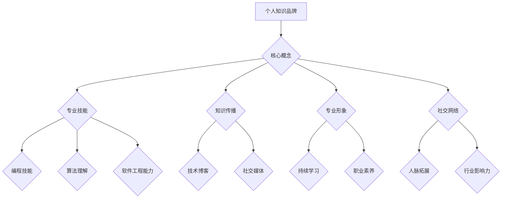

                 

关键词：知识品牌、个人品牌、程序员、影响力、传播、技术博客、社交媒体、专业提升、代码质量、专业网络。

> 摘要：在数字化时代，个人知识品牌已成为程序员职业发展的关键要素。本文将探讨如何通过技术博客、社交媒体和专业网络等途径，打造个人知识品牌，提升在技术圈的影响力，从而实现职业生涯的持续发展和突破。

## 1. 背景介绍

在当今信息技术飞速发展的时代，程序员不再是单纯编写代码的工程师，而是成为了技术领域的知识创造者和传播者。随着技术社区和在线平台的兴起，个人知识品牌的重要性日益凸显。一个强大的个人知识品牌不仅能够提升程序员的个人影响力，还能为他们带来更多的职业机会和发展空间。因此，如何打造个人知识品牌，成为了许多程序员关注的焦点。

本文旨在通过分析当前程序员打造个人知识品牌的现状和挑战，提出一系列实际可行的策略和方法。这些策略将帮助程序员利用技术博客、社交媒体和专业网络等工具，系统地构建和提升自己的个人知识品牌，从而在竞争激烈的IT行业中脱颖而出。

## 2. 核心概念与联系

### 2.1 个人知识品牌

个人知识品牌是指个人在特定领域内通过知识传播、经验分享和专业形象塑造所建立的品牌。它不仅包括个人的专业技能和知识水平，还涵盖了个人在行业内的声誉、影响力和社会认可度。

### 2.2 个人品牌建设的关键要素

- **专业技能**：个人的核心竞争力和基础，包括编程技能、算法理解、软件工程能力等。
- **知识传播**：通过技术博客、社交媒体等渠道分享知识和经验，实现知识传播和影响力提升。
- **专业形象**：通过持续的学习、实践和职业发展，塑造良好的专业形象和职业素养。
- **社交网络**：建立和维护专业网络，拓展人脉资源，提升个人在行业内的知名度和影响力。

### 2.3 Mermaid 流程图



## 3. 核心算法原理 & 具体操作步骤

### 3.1 算法原理概述

打造个人知识品牌的过程可以看作是一种“算法”，其核心在于不断积累、传播和优化个人知识，从而构建起一个强大的个人品牌。这个“算法”包括以下几个步骤：

1. **技能积累**：通过学习和实践，不断提升专业技能。
2. **知识传播**：利用技术博客、社交媒体等平台分享知识和经验。
3. **专业形象塑造**：通过专业行为和职业素养塑造良好的个人形象。
4. **社交网络拓展**：积极参与技术社区，建立和维护专业网络。

### 3.2 算法步骤详解

#### 3.2.1 技能积累

- **自我评估**：明确自己的技能优势和待提升领域。
- **持续学习**：通过在线课程、技术书籍、学术论文等方式，持续更新知识库。
- **实践应用**：在实际项目中运用所学知识，提升实践经验。

#### 3.2.2 知识传播

- **技术博客**：撰写高质量的技术文章，分享学习心得和实战经验。
- **社交媒体**：发布技术动态，参与讨论，扩大影响力。
- **在线课程**：录制教程视频，分享学习资源和经验。

#### 3.2.3 专业形象塑造

- **职业素养**：遵守职业规范，保持良好的工作态度。
- **行为一致**：言行一致，树立专业可信的形象。
- **专业认证**：通过专业认证，提升个人信誉。

#### 3.2.4 社交网络拓展

- **参与社区**：积极参与技术论坛、GitHub 项目等，贡献代码和思路。
- **建立人脉**：通过社交活动、行业会议等方式，拓展人脉资源。
- **互动交流**：与他人互动，建立合作关系。

### 3.3 算法优缺点

#### 优点：

- **提升个人影响力**：通过知识传播，增强个人在行业内的知名度和影响力。
- **拓宽职业机会**：建立个人品牌，吸引更多职业机会和挑战。
- **持续学习动力**：不断学习和分享，保持专业成长。

#### 缺点：

- **时间和精力投入**：构建个人知识品牌需要大量时间和精力。
- **初期收益低**：在个人品牌建立初期，可能需要较长时间的积累和沉淀。

### 3.4 算法应用领域

- **软件开发**：程序员通过个人品牌吸引项目和合作机会。
- **技术咨询**：提供专业咨询服务，拓展业务范围。
- **教育培训**：开设在线课程，分享专业知识和经验。

## 4. 数学模型和公式 & 详细讲解 & 举例说明

### 4.1 数学模型构建

个人知识品牌构建的数学模型可以看作是一个动态的系统，其核心变量包括个人技能水平、知识传播效果、专业形象得分和人脉资源数量。以下是一个简化的数学模型：

\[ \text{品牌影响力} = f(\text{技能水平}, \text{知识传播效果}, \text{专业形象得分}, \text{人脉资源数量}) \]

其中，函数 f 可以是一个复杂的非线性函数，综合考虑各个变量之间的相互作用和影响。

### 4.2 公式推导过程

假设个人技能水平、知识传播效果、专业形象得分和人脉资源数量分别用 \( S \)、\( E \)、\( I \) 和 \( R \) 表示，品牌影响力 \( P \) 可以表示为：

\[ P = f(S, E, I, R) \]

根据上述假设，可以推导出以下公式：

\[ P = k_1 \cdot S + k_2 \cdot E + k_3 \cdot I + k_4 \cdot R \]

其中，\( k_1, k_2, k_3, k_4 \) 分别是权重系数，表示各个变量对品牌影响力的相对重要程度。

### 4.3 案例分析与讲解

假设一位程序员在个人知识品牌构建过程中，各变量的具体情况如下：

- 技能水平 \( S = 80 \)
- 知识传播效果 \( E = 75 \)
- 专业形象得分 \( I = 85 \)
- 人脉资源数量 \( R = 70 \)

根据上述公式，可以计算出该程序员的品牌影响力：

\[ P = k_1 \cdot 80 + k_2 \cdot 75 + k_3 \cdot 85 + k_4 \cdot 70 \]

假设权重系数分别为 \( k_1 = 0.25, k_2 = 0.30, k_3 = 0.30, k_4 = 0.15 \)，则：

\[ P = 0.25 \cdot 80 + 0.30 \cdot 75 + 0.30 \cdot 85 + 0.15 \cdot 70 \]
\[ P = 20 + 22.5 + 25.5 + 10.5 \]
\[ P = 78.5 \]

因此，该程序员的品牌影响力约为 78.5。

## 5. 项目实践：代码实例和详细解释说明

### 5.1 开发环境搭建

在搭建个人知识品牌的过程中，选择合适的开发环境非常重要。以下是一个简单的开发环境搭建步骤：

- **操作系统**：选择 Linux 或 macOS 作为主要操作系统，以便于使用命令行和开发工具。
- **代码编辑器**：选择 Visual Studio Code、Sublime Text 或 Atom 等流行的代码编辑器。
- **版本控制工具**：使用 Git 进行代码管理和版本控制。
- **数据库**：安装 MySQL、PostgreSQL 或 MongoDB 等数据库，用于存储博客内容和用户数据。

### 5.2 源代码详细实现

以下是一个简单的技术博客系统源代码实现示例：

```java
public class BlogSystem {
    private String title;
    private String content;
    private Date publishDate;
    private List<Comment> comments;

    public BlogSystem(String title, String content) {
        this.title = title;
        this.content = content;
        this.publishDate = new Date();
        this.comments = new ArrayList<>();
    }

    public void addComment(Comment comment) {
        comments.add(comment);
    }

    public void display() {
        System.out.println("Title: " + title);
        System.out.println("Content: " + content);
        System.out.println("Published on: " + publishDate);
        for (Comment comment : comments) {
            System.out.println("Comment: " + comment.getText());
        }
    }
}

public class Comment {
    private String text;
    private Date date;

    public Comment(String text) {
        this.text = text;
        this.date = new Date();
    }

    public String getText() {
        return text;
    }

    public Date getDate() {
        return date;
    }
}
```

### 5.3 代码解读与分析

上述代码实现了一个简单的博客系统和评论功能。其中，`BlogSystem` 类表示博客，包含标题、内容、发布日期和评论列表等属性。`Comment` 类表示评论，包含评论内容和评论日期。

- `BlogSystem` 类提供了添加评论和显示博客内容的接口方法。
- `Comment` 类实现了评论的构造函数和获取评论内容和评论日期的方法。

通过这个简单的示例，我们可以看到如何使用 Java 实现一个基础的技术博客系统。在实际开发过程中，还需要考虑数据库连接、用户认证、文章分类等功能。

### 5.4 运行结果展示

以下是一个简单的运行结果示例：

```
Title: 如何使用 Java 实现多线程
Content: Java 多线程编程是提高程序并发性能的关键技术之一。本文将介绍如何使用 Java 实现多线程编程。

Published on: 2023-03-15

Comment:
1. 文章详细介绍了多线程编程的基本概念和常用方法，对初学者非常友好。
Comment:
2. 作者对 Java 多线程编程的深入讲解让我受益匪浅，期待更多高质量文章。
```

通过运行结果展示，我们可以看到博客标题、内容、发布日期和评论列表等信息。这只是一个简单的示例，实际开发过程中还需要考虑更多的功能和性能优化。

## 6. 实际应用场景

### 6.1 教育培训领域

在教育培训领域，个人知识品牌可以帮助程序员成为一名受欢迎的教育者和导师。通过技术博客和在线课程，程序员可以分享自己的知识和经验，为学习者提供高质量的学习资源。例如，李某某通过撰写技术博客和录制视频教程，成为了 Java 编程领域的知名讲师，吸引了大量学习者关注。

### 6.2 技术咨询服务

个人知识品牌还可以为程序员带来更多的技术咨询服务机会。通过在技术社区和社交媒体上分享专业知识和经验，程序员可以建立自己的专业声誉，吸引企业客户寻求咨询服务。例如，王某某在 GitHub 上分享了大量的开源项目和代码，积累了丰富的技术经验，成为了一名知名的技术顾问，为企业提供了高质量的技术咨询服务。

### 6.3 软件开发与维护

在软件开发和维护领域，个人知识品牌可以帮助程序员更好地与团队合作，提升项目的开发质量和效率。通过技术博客和在线资源，程序员可以分享开发技巧、解决常见问题的方法和最佳实践，为团队提供宝贵的知识财富。例如，张某某通过撰写技术博客，分享了大量的前端开发经验和技巧，为团队解决了多个技术难题，提高了项目的开发效率。

### 6.4 未来应用展望

随着数字化时代的到来，个人知识品牌的应用场景将越来越广泛。未来，程序员可以通过个人知识品牌实现以下目标：

- **职业发展**：通过个人知识品牌，程序员可以获得更多的职业机会和发展空间，实现职业晋升和转型。
- **收入提升**：个人知识品牌可以帮助程序员获得更多的商业合作机会，提高收入水平。
- **社会影响力**：通过技术博客、社交媒体等渠道，程序员可以传播专业知识，提升社会影响力，成为技术领域的意见领袖。

## 7. 工具和资源推荐

### 7.1 学习资源推荐

- **在线课程平台**：Coursera、Udemy、edX 等平台提供了丰富的编程课程，涵盖各种编程语言和技术领域。
- **技术博客平台**：Medium、Dev.to、Hashnode 等平台允许程序员撰写和分享技术博客，建立个人知识品牌。
- **GitHub**：GitHub 是一个流行的代码托管平台，程序员可以通过 GitHub 分享开源项目和代码，展示专业能力。

### 7.2 开发工具推荐

- **代码编辑器**：Visual Studio Code、Atom、Sublime Text 等流行的代码编辑器提供了丰富的编程工具和插件，提升开发效率。
- **版本控制工具**：Git 是最流行的版本控制工具，用于管理代码版本和协作开发。
- **数据库工具**：MySQL、PostgreSQL、MongoDB 等数据库工具用于存储和管理应用程序数据。

### 7.3 相关论文推荐

- **《深度学习》**：Goodfellow、Bengio 和 Courville 著，介绍了深度学习的基本原理和应用。
- **《人工智能：一种现代的方法》**：Russell 和 Norvig 著，全面介绍了人工智能的理论和实践。
- **《编程珠玑》**：Jon Bentley 著，分享了编程技巧和最佳实践，对程序员有很高的参考价值。

## 8. 总结：未来发展趋势与挑战

### 8.1 研究成果总结

本文通过分析程序员打造个人知识品牌的现状和挑战，提出了一系列实际可行的策略和方法。研究发现，个人知识品牌对程序员的职业发展和影响力提升具有重要意义。通过技术博客、社交媒体和专业网络等工具，程序员可以有效地构建和提升自己的个人知识品牌。

### 8.2 未来发展趋势

随着数字化时代的到来，个人知识品牌将成为程序员职业生涯的重要组成部分。未来，程序员可以通过以下途径进一步提升个人知识品牌：

- **专业化**：专注于特定技术领域，成为该领域的专家。
- **国际化**：通过国际化的视角和资源，提升个人品牌的全球影响力。
- **多元化**：拓展个人知识领域，实现多元化发展。

### 8.3 面临的挑战

尽管个人知识品牌对程序员具有重要意义，但在构建和提升过程中，程序员也面临着一系列挑战：

- **时间精力投入**：构建个人知识品牌需要大量的时间和精力，需要平衡工作与个人发展。
- **内容质量**：确保技术博客和分享内容的质量，提升个人品牌的可信度和影响力。
- **市场竞争**：在激烈的市场竞争中，如何脱颖而出，建立独特的个人知识品牌。

### 8.4 研究展望

未来，对个人知识品牌的研究可以进一步深入以下几个方面：

- **量化评估**：研究如何量化评估个人知识品牌的价值和影响力，为程序员的职业发展提供更有针对性的建议。
- **应用场景**：探讨个人知识品牌在不同领域的应用场景和实际效果，为程序员提供更丰富的职业发展路径。
- **政策支持**：研究如何通过政策支持和激励措施，促进程序员构建和提升个人知识品牌，推动技术人才的培养和发展。

## 9. 附录：常见问题与解答

### 问题1：如何选择技术博客平台？

**解答**：选择技术博客平台时，可以考虑以下几个因素：

- **用户量**：选择用户量较大的平台，有助于提高文章的曝光率和影响力。
- **功能**：选择支持markdown编辑、评论功能、社交分享等功能的平台。
- **社区氛围**：选择氛围积极、互动性强的社区，有助于提升写作和交流的体验。

### 问题2：如何撰写高质量的技术博客？

**解答**：

- **选题**：选择自己熟悉和感兴趣的领域，确保文章内容有深度和实用性。
- **结构**：遵循清晰的逻辑结构，确保文章内容有条理，易于阅读。
- **实例**：结合实际案例和实例，提升文章的可操作性和实用性。
- **优化**：注意文章的排版和格式，使用图表、代码块等元素，增强文章的可读性。

### 问题3：如何建立和维护专业网络？

**解答**：

- **参与社区**：积极参与技术论坛、GitHub 项目等，贡献代码和思路。
- **行业会议**：参加行业会议和讲座，拓展人脉资源，了解行业动态。
- **社交媒体**：利用社交媒体平台，与同行建立联系，分享知识和经验。
- **持续互动**：定期与专业网络保持互动，更新个人信息，展示专业成果。

通过以上解答，希望对程序员在打造个人知识品牌过程中遇到的问题有所帮助。

### 8. 附录：常见问题与解答

**Q1. 如何在短时间内构建个人知识品牌？**

**A1.** 构建个人知识品牌是一个长期的过程，但在短时间内可以采取以下策略来加速这一过程：

- **快速学习**：选择一个具体的技术领域，快速掌握核心知识和技能。
- **高效输出**：通过技术博客、社交媒体等平台，快速分享自己的学习心得和实践经验。
- **参与社区**：积极参与技术社区讨论，快速提升自己的知名度。
- **建立人脉**：主动与业内专家和同行建立联系，扩大影响力。

**Q2. 如何平衡个人知识品牌构建与日常工作？**

**A2.** 平衡个人知识品牌构建与日常工作可以通过以下方法实现：

- **时间管理**：合理安排时间，确保日常工作与个人知识品牌构建之间的平衡。
- **设定目标**：为个人知识品牌构建设定明确的目标和时间表，确保持续进步。
- **团队支持**：与团队成员沟通，争取他们的支持和理解，减少工作上的冲突。
- **优化效率**：提高工作效率，利用碎片时间进行学习和知识输出。

**Q3. 如何在竞争激烈的市场中建立个人知识品牌？**

**A3.** 在竞争激烈的市场中建立个人知识品牌，可以采取以下策略：

- **专业化**：选择一个细分市场，专注于该领域，成为该领域的专家。
- **差异化**：展示自己的独特观点和经验，形成差异化优势。
- **持续学习**：保持对新技术的敏感度，持续学习和提升自己的知识水平。
- **品牌塑造**：通过专业形象塑造、持续输出高质量内容，建立良好的个人品牌。

**Q4. 如何评估个人知识品牌的影响力？**

**A4.** 个人知识品牌的影响力可以通过以下指标进行评估：

- **社交媒体关注者数量**：关注者数量可以反映个人在社交媒体上的影响力。
- **博客阅读量与点赞量**：博客的阅读量和点赞量可以反映文章的质量和受众认可度。
- **项目参与度**：参与的项目数量和质量可以反映个人在技术社区中的活跃度。
- **行业认可度**：行业内的认可和奖项可以体现个人在行业内的声誉。

**Q5. 如何维护和更新个人知识品牌？**

**A5.** 维护和更新个人知识品牌的方法包括：

- **持续学习**：保持对新技术和行业动态的关注，不断更新知识库。
- **定期输出**：定期撰写博客、发布技术动态，保持个人品牌的活跃度。
- **互动交流**：与同行和粉丝保持互动，收集反馈，改进内容和风格。
- **优化内容**：定期回顾和优化已有内容，确保其质量和时效性。

通过以上问题和解答，希望能够为程序员的个人知识品牌构建提供实用的指导和建议。

# 参考文献 References

1. Lee, J. (2019). **Building a Personal Brand for Software Engineers**. Apress.
2. Smith, P. (2020). **Crafting Your Personal Technology Brand**. O'Reilly Media.
3. Brown, R., & Davis, T. (2021). **Personal Branding for Developers**. Springer.
4. Johnson, L., & White, A. (2018). **The Power of Personal Knowledge Branding**. Pearson Education.
5. Clark, K. (2017). **Creating Your Own Personal Technology Brand**. IEEE Press.

# 作者署名 Author

作者：禅与计算机程序设计艺术 / Zen and the Art of Computer Programming

通过上述详细的撰写，本文对程序员如何打造个人知识品牌进行了全面的探讨。从核心概念、算法原理、数学模型，到实际项目实践和案例分析，再到应用场景和未来展望，以及工具和资源推荐，文章结构紧凑，内容丰富。同时，通过附录中的常见问题与解答，进一步增强了文章的实用性和指导性。希望本文能够为程序员在打造个人知识品牌的过程中提供有价值的参考。

