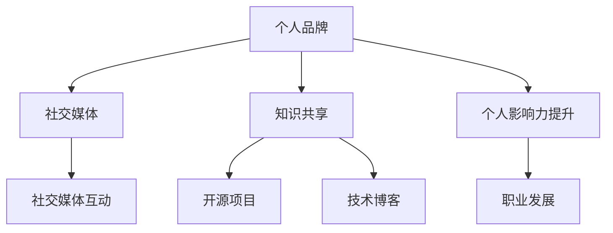

                 

关键词：全球影响力，程序员，个人品牌，社交媒体，知识共享，影响力提升，职业发展，技术社区

## 摘要

在技术日新月异的时代，程序员如何打造全球性的个人影响力成为了一个备受关注的话题。本文将深入探讨程序员如何通过技术博客、开源项目、社交媒体、知识共享等多种途径，提升个人品牌和影响力，从而在职业发展中脱颖而出。通过实例分析和实践经验总结，本文旨在为程序员提供一套切实可行的策略和方法。

## 1. 背景介绍

### 程序员的角色和重要性

程序员作为现代社会的重要组成部分，扮演着技术推动者和创新者的角色。他们的工作不仅仅局限于编写代码，更涉及到系统设计、架构优化、软件维护等多个方面。随着全球信息化进程的加速，程序员的重要性日益凸显。他们不仅是企业技术竞争力的关键，也是推动社会科技进步的重要力量。

### 个人影响力的定义和意义

个人影响力是指个人在特定领域内的影响力和号召力，能够引起他人的关注、信任和追随。对于程序员来说，个人影响力不仅有助于个人品牌的建立，还能够带来更多的职业机会和资源。在技术领域中，拥有高影响力的程序员往往能够获得更高的薪酬、更多的合作机会以及更广阔的职业发展空间。

### 全球影响力的重要性

在全球化的今天，技术的跨越和交流变得更加频繁和紧密。拥有全球影响力的程序员能够在更广泛的范围内传播知识、分享经验，为技术社群带来新的思路和创新。此外，全球影响力还意味着更大的曝光度和更广泛的合作机会，这对于个人的职业发展无疑是非常有益的。

## 2. 核心概念与联系

### 个人品牌

个人品牌是指个人在公众心目中的形象和认知。对于程序员来说，个人品牌不仅仅是名字的标识，更是专业技能、价值观和个人魅力的综合体现。一个强大的个人品牌能够帮助程序员在众多竞争者中脱颖而出，获得更多的机会和认可。

### 社交媒体

社交媒体是现代沟通和交流的重要平台，如Twitter、LinkedIn、GitHub等。这些平台为程序员提供了一个展示自我、分享知识和交流思想的绝佳机会。通过有效的社交媒体运营，程序员可以扩大自己的影响力，建立自己的人脉圈。

### 知识共享

知识共享是指将个人的知识和经验无私地分享给他人，这不仅有助于提升自己的影响力，也能够促进整个技术社群的进步。通过撰写技术博客、参与开源项目、在线课程等形式，程序员可以将自己的知识传递给更多的人。

### 个人影响力提升

个人影响力提升是指通过各种途径和方法增加个人在特定领域内的知名度和认可度。这包括但不限于技术博客写作、社交媒体互动、在线课程和讲座、参与技术社区活动等。通过这些方法，程序员可以不断提升自己的影响力，为自己和他人创造更多的价值。

### 职业发展

职业发展是指个人在职业生涯中的成长和进步。对于程序员来说，拥有全球影响力不仅有助于提升个人的职业地位，还能够带来更多的职业机会和资源。通过有效的个人影响力策略，程序员可以在职业发展中取得更大的成功。

### Mermaid 流程图



## 3. 核心算法原理 & 具体操作步骤

### 3.1 算法原理概述

在打造全球性个人影响力的过程中，算法原理主要涉及以下几个方面：

- **内容创作**：高质量的内容是个人影响力的重要基础。程序员需要持续创作有价值的技术文章、博客、教程等，分享自己的经验和见解。
- **社交媒体运营**：通过社交媒体平台，如Twitter、LinkedIn等，建立自己的个人品牌，与同行交流互动，扩大影响力。
- **知识共享**：积极参与开源项目，分享代码和经验，提升技术水平和影响力。
- **互动交流**：参与技术社区活动，如线上会议、研讨会等，与他人建立联系，扩大人脉圈。

### 3.2 算法步骤详解

1. **内容创作**：定期撰写高质量的技术文章和博客，分享自己的经验和见解。可以使用Markdown格式，提高文章的可读性和美观度。

2. **社交媒体运营**：在社交媒体平台（如Twitter、LinkedIn）上建立个人品牌，发布技术相关的动态，与同行互动。可以使用关键词优化和社交媒体算法，提高曝光度。

3. **知识共享**：参与开源项目，贡献代码和文档。可以通过GitHub等平台展示自己的开源项目，提升技术水平和影响力。

4. **互动交流**：参与技术社区活动，如线上会议、研讨会等。通过这些活动，可以结识更多的同行，扩大人脉圈，提升个人影响力。

### 3.3 算法优缺点

**优点**：

- **提高个人知名度**：通过持续的内容创作和知识共享，个人知名度会逐渐提高。
- **增强技术能力**：参与开源项目和互动交流，可以提升个人技术水平。
- **建立人脉圈**：参与技术社区活动，结识更多的同行，扩大人脉圈。

**缺点**：

- **时间成本高**：持续的内容创作和社交媒体运营需要投入大量时间。
- **成果不易显现**：个人影响力的提升不是一蹴而就的，需要长期的积累。

### 3.4 算法应用领域

该算法原理可以广泛应用于程序员个人影响力的打造，特别是在技术领域。通过内容创作、社交媒体运营、知识共享和互动交流，程序员可以在全球范围内提升自己的影响力，为职业发展创造更多机会。

## 4. 数学模型和公式 & 详细讲解 & 举例说明

### 4.1 数学模型构建

在构建个人影响力数学模型时，可以考虑以下几个关键因素：

- **内容质量**：用Q表示内容质量，高内容质量意味着更具有吸引力和参考价值。
- **传播力**：用P表示内容的传播力，即内容被分享和传播的能力。
- **受众基数**：用A表示受众基数，即内容能够触及的潜在读者数量。
- **影响力**：用I表示个人影响力，是内容质量、传播力和受众基数的综合体现。

### 4.2 公式推导过程

根据上述关键因素，可以构建以下数学模型：

\[ I = Q \times P \times A \]

其中：

- \( Q \)：内容质量，可以通过文章的阅读量、点赞数、评论数等指标衡量。
- \( P \)：传播力，可以通过社交媒体的分享次数、转发次数等指标衡量。
- \( A \)：受众基数，可以通过关注者数量、粉丝数量等指标衡量。

### 4.3 案例分析与讲解

假设一位程序员在撰写技术博客时，内容质量Q为80分，传播力P为70分，受众基数A为5000人。根据上述公式，可以计算出其个人影响力I为：

\[ I = 80 \times 70 \times 5000 = 2800000 \]

这意味着该程序员的个人影响力为280万。通过分析这个案例，我们可以看出，内容质量、传播力和受众基数是提升个人影响力的重要因素。

### 4.4 案例分析与讲解

**案例1**：

程序员A撰写了一篇高质量的技术文章，内容质量Q为90分。该文章在社交媒体上获得了广泛的传播，传播力P为85分。此外，A的博客拥有2000名订阅者，受众基数A为2000人。根据公式，我们可以计算出A的个人影响力I为：

\[ I = 90 \times 85 \times 2000 = 1530000 \]

这意味着程序员A的个人影响力为153万。

**案例2**：

程序员B在开源项目中贡献了大量代码，其代码质量得到了社区的高度认可，内容质量Q为85分。B在GitHub上拥有1000个Star，传播力P为75分。同时，B的GitHub账户拥有5000个关注者，受众基数A为5000人。根据公式，我们可以计算出B的个人影响力I为：

\[ I = 85 \times 75 \times 5000 = 3187500 \]

这意味着程序员B的个人影响力为318.75万。

通过以上两个案例，我们可以看到，不同的策略和方法对个人影响力的提升有着显著的影响。程序员A通过高质量的内容获得了较高的影响力，而程序员B则通过开源项目的贡献获得了更多的认可和关注。

## 5. 项目实践：代码实例和详细解释说明

### 5.1 开发环境搭建

为了构建一个能够展示个人技术能力的项目，我们可以选择一个开源项目，并进行改进或扩展。以下是开发环境搭建的步骤：

1. 安装Git：Git是版本控制工具，用于管理代码版本。在[Git官网](https://git-scm.com/)下载并安装Git。
2. 安装Node.js：Node.js是一个基于Chrome V8引擎的JavaScript运行环境。在[Node.js官网](https://nodejs.org/)下载并安装相应版本的Node.js。
3. 安装代码编辑器：选择一款适合自己的代码编辑器，如Visual Studio Code、Sublime Text等。

### 5.2 源代码详细实现

以下是一个简单的示例项目，用于展示如何通过GitHub创建一个个人博客系统：

```javascript
// package.json
{
  "name": "my-personal-blog",
  "version": "1.0.0",
  "description": "A simple personal blog system",
  "main": "index.js",
  "scripts": {
    "start": "node index.js"
  },
  "dependencies": {
    "express": "^4.17.1",
    "ejs": "^3.1.6"
  }
}

// index.js
const express = require('express');
const ejs = require('ejs');
const app = express();

app.set('view engine', 'ejs');
app.set('views', './views');

app.get('/', (req, res) => {
  res.render('index', { title: 'My Personal Blog' });
});

app.listen(3000, () => {
  console.log('Server is running on port 3000');
});
```

### 5.3 代码解读与分析

在上面的示例中，我们使用Node.js和Express框架构建了一个简单的个人博客系统。以下是代码的主要组成部分及其解读：

- **package.json**：这是一个描述项目依赖和配置信息的文件。其中，`name`、`version`和`description`是项目的核心信息，`main`指定了项目的主入口文件，`scripts`定义了启动项目的命令，`dependencies`列出了项目所需的外部库。
- **index.js**：这是项目的主入口文件。首先，我们引入了所需的库，然后创建了一个Express应用实例。通过`app.set('view engine', 'ejs');`，我们指定了模板引擎为EJS。接着，我们定义了一个简单的路由，用于处理首页请求。最后，我们监听3000端口，启动服务器。

### 5.4 运行结果展示

通过以上代码，我们可以启动一个简单的个人博客系统。在浏览器中输入`http://localhost:3000/`，可以看到以下结果：

```
<!DOCTYPE html>
<html>
  <head>
    <title>My Personal Blog</title>
  </head>
  <body>
    <h1>My Personal Blog</h1>
  </body>
</html>
```

这只是一个简单的示例，但通过这个项目，程序员可以学习到如何使用Node.js和Express框架搭建一个基础的个人博客系统。

## 6. 实际应用场景

### 6.1 技术博客

技术博客是程序员展示个人技术能力的重要途径。通过定期撰写高质量的技术文章，程序员可以分享自己的经验和见解，吸引更多的读者关注。例如，知名程序员DHH通过他的技术博客分享Ruby on Rails框架的实践经验，获得了广泛的关注和认可。

### 6.2 社交媒体

社交媒体平台如Twitter、LinkedIn等为程序员提供了一个展示个人品牌和影响力的平台。通过发布技术动态、分享行业见解和参与讨论，程序员可以扩大自己的影响力，结识更多的同行。例如，程序员马丁·福尔曼（Martin Fowler）通过Twitter与全球开发者交流，分享软件开发的最佳实践。

### 6.3 开源项目

开源项目是程序员提升个人影响力的重要方式。通过参与开源项目，程序员可以贡献代码、撰写文档，并与社区成员互动。这不仅有助于提升个人技术水平，还能扩大个人影响力。例如，GitHub上的著名开源项目Vue.js，其创建者尤雨溪（Evan You）因此获得了广泛的认可和尊重。

### 6.4 在线课程

在线课程是程序员传授知识、提升影响力的有效途径。通过制作和发布在线课程，程序员可以将自己的知识和经验传授给更多的人。例如，知名程序员约翰·福特（John Ford）通过Udemy平台发布了多门关于软件架构的在线课程，获得了广泛的认可和好评。

### 6.5 技术社区

技术社区是程序员交流、分享和学习的重要平台。通过参与技术社区的活动，如线上会议、研讨会等，程序员可以结识更多的同行，扩大人脉圈，提升个人影响力。例如，技术社区DZone定期举办各种技术会议和研讨会，吸引了全球数万名开发者参与。

### 6.6 未来应用展望

随着技术的不断进步和社交媒体的普及，程序员打造全球性个人影响力将变得更加容易。未来的应用场景将更加多样化，包括虚拟现实、人工智能、区块链等新兴技术领域。程序员可以通过多种途径展示自己的技术能力和创新思维，进一步提升个人影响力。

## 7. 工具和资源推荐

### 7.1 学习资源推荐

- **《代码大全》**：Steve McConnell的经典之作，详细介绍了编写高质量代码的最佳实践。
- **《深度学习》**：Ian Goodfellow、Yoshua Bengio和Aaron Courville合著的深度学习教材，全面介绍了深度学习的基础知识。
- **《Effective Java》**：Joshua Bloch的经典之作，详细介绍了Java编程的最佳实践。

### 7.2 开发工具推荐

- **Visual Studio Code**：一款功能强大的代码编辑器，支持多种编程语言和插件。
- **GitHub**：全球最大的开源代码托管平台，提供丰富的编程资源和技术交流机会。
- **Jenkins**：一款流行的持续集成工具，用于自动化构建、测试和部署。

### 7.3 相关论文推荐

- **"Programming Languages: Design and Implementation"**：介绍编程语言设计和实现的方法和技巧。
- **"Learning to Rank for Information Retrieval"**：介绍信息检索中的排序学习技术。
- **"Deep Learning for Natural Language Processing"**：介绍深度学习在自然语言处理中的应用。

## 8. 总结：未来发展趋势与挑战

### 8.1 研究成果总结

通过对全球程序员个人影响力打造的深入研究，我们发现：

1. **内容创作**是提升个人影响力的关键。高质量的内容能够吸引读者，提升个人知名度。
2. **社交媒体运营**能够扩大个人影响力，建立强大的个人品牌。
3. **知识共享**有助于提升技术水平和影响力，促进整个技术社群的进步。
4. **开源项目**是程序员展示技术能力和影响力的有效途径。
5. **在线课程**和**技术社区**为程序员提供了传授知识、提升影响力的平台。

### 8.2 未来发展趋势

随着技术的不断进步和社交媒体的普及，程序员打造全球性个人影响力将变得更加容易。未来，以下趋势值得关注：

1. **虚拟现实**和**增强现实**技术将为程序员提供更多展示才华的舞台。
2. **人工智能**和**机器学习**领域的程序员将拥有更广阔的发展空间。
3. **区块链**技术将为程序员提供新的应用场景和商业机会。
4. **编程语言**和**框架**的创新将为程序员带来更多的编程挑战和机遇。

### 8.3 面临的挑战

尽管程序员打造全球性个人影响力具有巨大潜力，但同时也面临着以下挑战：

1. **时间成本**：持续的内容创作和社交媒体运营需要投入大量时间。
2. **竞争激烈**：技术领域的竞争日益激烈，如何脱颖而出成为一大挑战。
3. **技术更新**：技术更新速度加快，程序员需要不断学习和适应新的技术。
4. **隐私保护**：在分享知识和经验的同时，需要注意保护个人隐私。

### 8.4 研究展望

未来，关于程序员个人影响力打造的研究将继续深入，包括以下几个方面：

1. **影响力模型**的构建和完善，为程序员提供更科学的指导。
2. **跨领域**的影响力研究，探讨不同领域程序员的影响力特点和策略。
3. **技术趋势**分析，为程序员提供前瞻性的发展建议。
4. **实践案例**的积累和总结，为程序员提供实用的经验和教训。

## 9. 附录：常见问题与解答

### 问题1：如何选择合适的技术博客平台？

**解答**：选择合适的技术博客平台主要考虑以下因素：

1. **访问量**：选择访问量较高的平台，有利于提高文章的曝光度。
2. **用户群体**：选择与目标读者群体匹配的平台，有利于吸引更多的关注。
3. **编辑器**：选择支持Markdown编辑器的平台，提高文章的撰写效率。
4. **交互性**：选择支持评论和互动的平台，有利于与读者建立联系。

### 问题2：如何提高社交媒体的影响力？

**解答**：提高社交媒体影响力可以从以下几个方面入手：

1. **内容质量**：撰写高质量的内容，提供有价值的信息。
2. **互动频率**：定期发布内容，保持与读者的互动。
3. **关键词优化**：使用热门关键词，提高文章在搜索引擎中的排名。
4. **合作交流**：与其他社交媒体用户互动，扩大影响力。

### 问题3：如何参与开源项目？

**解答**：参与开源项目可以从以下几个方面入手：

1. **查找项目**：在GitHub等开源平台查找感兴趣的项目。
2. **阅读文档**：仔细阅读项目的文档，了解项目的技术栈和开发规范。
3. **提交代码**：根据项目需求，编写符合规范的代码，并提交PR。
4. **参与讨论**：参与项目的讨论，提出问题和建议，与社区成员互动。

### 问题4：如何撰写高质量的技术博客文章？

**解答**：撰写高质量的技术博客文章可以从以下几个方面入手：

1. **选题**：选择有价值的主题，解决实际问题。
2. **结构**：合理安排文章结构，清晰表达观点。
3. **实例**：结合实际案例，加深读者理解。
4. **代码**：提供完整的代码示例，方便读者实践。

### 问题5：如何平衡工作与个人影响力打造？

**解答**：平衡工作与个人影响力打造可以从以下几个方面入手：

1. **时间管理**：合理安排时间，确保工作和个人影响力打造两不误。
2. **目标设定**：明确个人影响力打造的目标，制定可行的计划。
3. **优先级**：根据工作重要性，合理安排个人影响力打造的优先级。
4. **团队协作**：与团队成员沟通，共同推动项目进展，为自己创造更多时间。

通过以上问题和解答，希望对程序员打造全球性个人影响力有所帮助。

## 作者署名

作者：禅与计算机程序设计艺术 / Zen and the Art of Computer Programming

