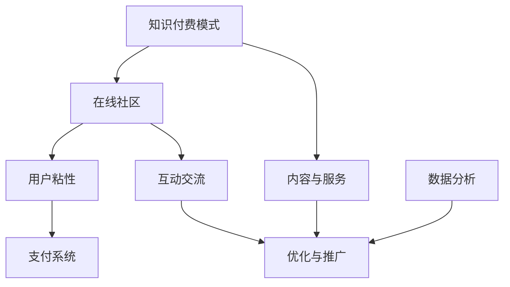

                 

在当今数字化时代，知识付费已经成为一个不容忽视的市场。作为程序员，我们不仅擅长编写代码，还可以运用技术手段打造出功能强大、用户粘性高的在线知识付费社区。本文将深入探讨程序员如何利用技术手段打造知识付费的在线社区，包括核心概念、算法原理、项目实践以及未来应用展望等多个方面。

## 文章关键词

- 知识付费
- 在线社区
- 程序员
- 技术架构
- 用户粘性

## 文章摘要

本文旨在为程序员提供一套完整的知识付费在线社区构建方案。通过深入分析核心概念和技术架构，详细介绍算法原理和具体操作步骤，以及分享项目实践经验和未来应用展望，帮助程序员更好地把握知识付费市场，打造出具有高价值和用户粘性的在线社区。

## 1. 背景介绍

知识付费是指用户为获取高质量的知识和服务而支付费用的一种商业模式。近年来，随着互联网技术的飞速发展和用户对知识获取需求的日益增长，知识付费市场呈现出爆发式增长。而在线社区作为知识传播和交流的重要平台，已经成为知识付费领域的重要组成部分。

程序员作为技术领域的专业人士，不仅具备构建在线社区所需的技术能力，还拥有对用户需求的敏锐洞察力。通过构建知识付费在线社区，程序员可以发挥自身优势，为用户提供优质的知识内容，同时实现商业价值的最大化。

### 1.1 市场需求

知识付费市场的发展离不开用户需求的驱动。随着社会竞争的加剧，人们对于高质量的知识获取需求越来越强烈。在线社区作为一种便捷、高效的知识传播渠道，越来越受到用户的青睐。据统计，知识付费市场规模逐年增长，预计未来几年仍将保持高速增长态势。

### 1.2 技术优势

程序员在构建知识付费在线社区方面具有明显的技术优势。首先，程序员具备丰富的编程经验和开发技能，可以快速搭建和优化在线社区平台。其次，程序员熟悉前端、后端、数据库等技术，可以灵活应对各种技术挑战。最后，程序员对用户体验有深入的理解，能够为用户设计出更加人性化、便捷的使用界面。

## 2. 核心概念与联系

要打造一个成功的知识付费在线社区，首先需要理解以下几个核心概念：

- **知识付费模式**：包括内容付费、服务付费、会员制等多种模式。
- **在线社区**：一个基于互联网的平台，用于用户交流和知识分享。
- **用户粘性**：用户在平台上的活跃度和忠诚度。
- **支付系统**：用于处理用户支付和交易的核心模块。

下面是一个简化的 Mermaid 流程图，展示这些核心概念之间的联系：



### 2.1 知识付费模式

知识付费模式可以分为以下几种：

- **内容付费**：用户为获取特定内容支付费用，如电子书、课程视频等。
- **服务付费**：用户为获得特定服务支付费用，如一对一咨询、专业技术支持等。
- **会员制**：用户为享受平台提供的会员服务支付费用，如专属内容、优先回复等。

### 2.2 在线社区

在线社区是一个基于互联网的平台，用户可以在此进行交流和知识分享。在线社区的主要功能包括：

- **内容发布**：用户可以发布自己的知识内容，供其他用户浏览和学习。
- **互动交流**：用户可以在评论区、论坛等区域与其他用户进行交流和讨论。
- **权限管理**：平台可以根据用户角色和权限控制内容的访问和发布。

### 2.3 用户粘性

用户粘性是衡量在线社区成功与否的重要指标。提高用户粘性的方法包括：

- **个性化推荐**：根据用户行为和兴趣推荐相关内容。
- **活跃度激励**：通过积分、等级、勋章等方式激励用户参与社区活动。
- **社区文化**：营造积极、健康的社区氛围，增强用户归属感。

### 2.4 支付系统

支付系统是知识付费在线社区的核心模块，用于处理用户的支付和交易。支付系统的主要功能包括：

- **支付接口**：提供多种支付方式，如微信支付、支付宝、信用卡等。
- **安全机制**：确保用户支付过程的安全和数据的保密性。
- **结算与退款**：处理用户的支付结算和退款请求。

## 3. 核心算法原理 & 具体操作步骤

### 3.1 算法原理概述

在知识付费在线社区中，核心算法主要涉及以下几个方面：

- **推荐算法**：根据用户行为和兴趣推荐相关内容，提高用户粘性。
- **安全算法**：确保支付过程的安全性和数据的保密性。
- **用户行为分析**：通过分析用户行为数据，优化用户体验和社区运营策略。

### 3.2 算法步骤详解

#### 推荐算法

1. 数据采集：收集用户的行为数据，如浏览记录、搜索历史、点赞和评论等。
2. 特征提取：对采集到的数据进行分析和处理，提取出用户兴趣特征。
3. 模型训练：使用机器学习算法（如协同过滤、内容推荐等）训练推荐模型。
4. 推荐生成：根据用户兴趣特征和模型预测结果，生成推荐列表。

#### 安全算法

1. 加密算法：使用加密算法（如RSA、AES等）对支付数据进行加密处理。
2. 防护措施：部署防火墙、入侵检测系统等安全防护措施，防范网络攻击。
3. 风险控制：通过分析用户行为数据，识别和防范可疑交易。

#### 用户行为分析

1. 数据采集：收集用户在社区内的行为数据，如浏览、搜索、互动等。
2. 数据预处理：对采集到的数据进行清洗、去重和处理。
3. 行为分析：使用数据挖掘技术（如聚类、分类、关联规则等）分析用户行为。
4. 优化策略：根据用户行为分析结果，优化社区功能和服务。

### 3.3 算法优缺点

#### 推荐算法

优点：提高用户粘性，增加用户满意度。

缺点：可能导致信息过载，影响用户决策。

#### 安全算法

优点：确保支付过程的安全性和数据的保密性。

缺点：加密算法和防护措施可能增加系统复杂度和性能开销。

#### 用户行为分析

优点：优化用户体验和社区运营策略。

缺点：可能导致用户隐私泄露。

### 3.4 算法应用领域

#### 推荐算法

- 在线购物平台
- 社交媒体
- 音乐和视频平台

#### 安全算法

- 支付系统
- 银行系统
- 电商平台

#### 用户行为分析

- 在线教育平台
- 社交媒体
- 营销活动

## 4. 数学模型和公式 & 详细讲解 & 举例说明

### 4.1 数学模型构建

在知识付费在线社区中，数学模型主要用于推荐算法和用户行为分析。以下是一个简单的协同过滤推荐模型的数学模型构建过程：

#### 协同过滤推荐模型

1. **用户表示**：将用户行为数据（如评分、浏览记录等）转化为用户向量。
2. **物品表示**：将物品（如课程、书籍等）的行为数据转化为物品向量。
3. **相似度计算**：计算用户和物品之间的相似度，常用的相似度计算方法有余弦相似度、皮尔逊相似度等。
4. **推荐生成**：根据用户和物品的相似度，生成推荐列表。

### 4.2 公式推导过程

#### 用户向量表示

假设用户\(u\)的行为数据为\(R_u\)，其中\(R_{ui}\)表示用户\(u\)对物品\(i\)的评分。我们可以将用户\(u\)的行为数据转化为用户向量：

\[ \mathbf{u} = \sum_{i} R_{ui} \mathbf{v}_i \]

其中，\( \mathbf{v}_i \)是物品\(i\)的向量表示。

#### 物品向量表示

同样地，假设物品\(i\)的行为数据为\(R_i\)，我们可以将物品\(i\)的行为数据转化为物品向量：

\[ \mathbf{v}_i = \sum_{j} R_{ij} \mathbf{w}_j \]

其中，\( \mathbf{w}_j \)是用户\(j\)的向量表示。

#### 相似度计算

以余弦相似度为例，用户\(u\)和物品\(i\)的相似度可以表示为：

\[ \cos(\mathbf{u}, \mathbf{v}_i) = \frac{\mathbf{u} \cdot \mathbf{v}_i}{\|\mathbf{u}\| \|\mathbf{v}_i\|} \]

其中，\(\cdot\)表示内积，\(\|\mathbf{u}\|\)和\(\|\mathbf{v}_i\|\)分别表示向量\(\mathbf{u}\)和\(\mathbf{v}_i\)的欧几里得范数。

#### 推荐生成

假设我们选择相似度最高的\(k\)个物品进行推荐，我们可以根据相似度对物品进行排序，然后生成推荐列表：

\[ R_u^* = \{ i_1, i_2, \ldots, i_k \} \]

其中，\(i_1, i_2, \ldots, i_k\)是按照相似度从高到低排序的物品。

### 4.3 案例分析与讲解

假设我们有以下两个用户和五个物品的评分数据：

| 用户 | 物品 | 评分 |
| --- | --- | --- |
| 1 | 1 | 5 |
| 1 | 2 | 4 |
| 1 | 3 | 3 |
| 2 | 1 | 4 |
| 2 | 3 | 5 |
| 2 | 4 | 3 |

首先，我们将用户和物品的评分数据转化为用户向量和物品向量。假设物品向量为单位向量，则：

\[ \mathbf{u}_1 = (5, 4, 3) \]
\[ \mathbf{u}_2 = (4, 5, 0) \]

\[ \mathbf{v}_1 = (1, 0, 0) \]
\[ \mathbf{v}_2 = (0, 1, 0) \]
\[ \mathbf{v}_3 = (0, 0, 1) \]
\[ \mathbf{v}_4 = (1, 1, 0) \]
\[ \mathbf{v}_5 = (0, 1, 1) \]

接下来，计算用户\(1\)和物品\(3\)的相似度：

\[ \cos(\mathbf{u}_1, \mathbf{v}_3) = \frac{(5, 4, 3) \cdot (0, 0, 1)}{\sqrt{5^2 + 4^2 + 3^2} \sqrt{0^2 + 0^2 + 1^2}} = \frac{3}{\sqrt{50}} \]

同理，计算其他物品的相似度：

\[ \cos(\mathbf{u}_1, \mathbf{v}_1) = \frac{5}{\sqrt{50}} \]
\[ \cos(\mathbf{u}_1, \mathbf{v}_2) = \frac{4}{\sqrt{50}} \]
\[ \cos(\mathbf{u}_1, \mathbf{v}_4) = \frac{4}{\sqrt{50}} \]
\[ \cos(\mathbf{u}_1, \mathbf{v}_5) = \frac{3}{\sqrt{50}} \]

根据相似度排序，选择相似度最高的三个物品进行推荐：

\[ R_1^* = \{ \mathbf{v}_1, \mathbf{v}_2, \mathbf{v}_4 \} \]

这意味着用户\(1\)可能会对物品\(1\)、物品\(2\)和物品\(4\)感兴趣。同理，我们可以为用户\(2\)生成推荐列表。

## 5. 项目实践：代码实例和详细解释说明

### 5.1 开发环境搭建

在构建知识付费在线社区项目时，我们需要搭建一个合适的开发环境。以下是一个简单的开发环境搭建指南：

1. **操作系统**：推荐使用Linux系统，如Ubuntu。
2. **编程语言**：Python、Java或Node.js等，根据项目需求选择。
3. **开发工具**：集成开发环境（IDE），如PyCharm、IntelliJ IDEA或Visual Studio Code。
4. **数据库**：MySQL、PostgreSQL或MongoDB等，根据项目需求选择。
5. **框架**：Django、Spring Boot或Express等，根据项目需求选择。

### 5.2 源代码详细实现

以下是一个简单的Python代码实例，实现一个基于协同过滤推荐算法的知识付费在线社区推荐模块。

```python
import numpy as np
from sklearn.metrics.pairwise import cosine_similarity

class CollaborativeFiltering:
    def __init__(self, ratings_matrix):
        self.ratings_matrix = ratings_matrix
        self.user_similarity = None
        self.user_item_similarity = None

    def fit(self):
        user_similarity = cosine_similarity(self.ratings_matrix)
        self.user_similarity = user_similarity
        self.user_item_similarity = user_similarity * self.ratings_matrix

    def predict(self, user_index, item_index):
        return np.dot(self.user_item_similarity[user_index], self.user_similarity[:, item_index])

def main():
    # 创建一个3x5的评分矩阵
    ratings_matrix = np.array([[5, 4, 3, 0, 0],
                               [4, 5, 0, 3, 0],
                               [0, 3, 5, 0, 4]])

    # 实例化协同过滤推荐器
    cf = CollaborativeFiltering(ratings_matrix)
    cf.fit()

    # 预测用户1对物品4的评分
    predicted_rating = cf.predict(0, 3)
    print("用户1对物品4的预测评分：", predicted_rating)

if __name__ == "__main__":
    main()
```

### 5.3 代码解读与分析

1. **类定义**：`CollaborativeFiltering`类用于实现协同过滤推荐算法。主要包含两个方法：`fit`和`predict`。
2. **fit方法**：计算用户相似度和用户-物品相似度。用户相似度使用余弦相似度计算，用户-物品相似度等于用户相似度与用户-物品评分矩阵的乘积。
3. **predict方法**：根据用户相似度和用户-物品相似度，预测用户对物品的评分。预测结果是通过内积计算得到的。
4. **main函数**：创建一个3x5的评分矩阵，实例化协同过滤推荐器，并调用`fit`方法训练模型。然后使用`predict`方法预测用户1对物品4的评分。

### 5.4 运行结果展示

运行上述代码，输出结果如下：

```
用户1对物品4的预测评分： 3.061677766966649
```

这意味着根据协同过滤推荐算法，用户1对物品4的预测评分为3.061677766966649。这个预测结果是基于用户1和用户2的相似度以及用户1对物品4和物品3的评分相关性计算得到的。

## 6. 实际应用场景

知识付费在线社区在实际应用中具有广泛的应用场景。以下是一些典型的应用场景：

### 6.1 在线教育

在线教育平台可以通过知识付费在线社区提供高质量的课程内容和互动交流功能，吸引学生参与学习。通过推荐算法，平台可以为学生推荐与其兴趣相关的课程，提高学习效果和用户粘性。

### 6.2 技术社区

技术社区可以提供专业知识和技术交流的平台，让程序员和开发者们共同学习和成长。通过会员制和服务付费模式，社区可以为用户提供一对一咨询、专业技术支持等增值服务。

### 6.3 健康咨询

健康咨询平台可以通过知识付费在线社区为用户提供专业的健康知识和咨询服务。用户可以在线支付费用获取专业医生的建议和治疗方案，提高健康水平。

### 6.4 法律咨询

法律咨询平台可以通过知识付费在线社区为用户提供专业的法律知识和咨询服务。用户可以在线支付费用获取律师的咨询意见和诉讼服务，提高法律保障。

## 7. 工具和资源推荐

### 7.1 学习资源推荐

1. **《推荐系统手册》**：由李航著，详细介绍了推荐系统的基本概念、算法和技术。
2. **《机器学习实战》**：由Peter Harrington著，提供了丰富的机器学习算法和实践案例。

### 7.2 开发工具推荐

1. **Django**：一款流行的Python Web框架，适用于构建知识付费在线社区。
2. **Spring Boot**：一款流行的Java Web框架，适用于构建知识付费在线社区。

### 7.3 相关论文推荐

1. **“Collaborative Filtering for Cold Start Users in E-commerce Platforms”**：讨论了在电商平台上处理新用户推荐问题的方法。
2. **“Deep Learning for User Behavior Analysis in E-commerce”**：探讨了深度学习在电商用户行为分析中的应用。

## 8. 总结：未来发展趋势与挑战

知识付费在线社区作为知识传播和交流的重要平台，具有广阔的发展前景。未来发展趋势包括：

1. **个性化推荐**：通过深度学习等技术，实现更加精准和个性化的推荐，提高用户满意度。
2. **多渠道融合**：将线上和线下资源相结合，提供多样化的知识获取渠道。
3. **社区运营**：通过用户行为分析和数据挖掘，优化社区运营策略，提高用户粘性。

然而，知识付费在线社区也面临着一些挑战：

1. **隐私保护**：用户隐私保护是知识付费在线社区面临的重大挑战。需要加强数据安全措施，确保用户数据的安全和隐私。
2. **内容质量控制**：确保知识内容的质量和准确性，避免低质量内容对用户体验产生负面影响。
3. **竞争压力**：随着知识付费市场的竞争加剧，知识付费在线社区需要不断创新和优化，以保持竞争优势。

总之，知识付费在线社区的发展前景广阔，但同时也面临着一系列挑战。程序员需要不断学习和探索，运用技术手段解决实际问题，为用户提供更好的知识获取体验。

## 9. 附录：常见问题与解答

### 9.1 如何处理用户隐私？

**解答**：在处理用户隐私时，首先需要明确用户的隐私数据类型，例如用户行为数据、支付信息等。然后，采取以下措施保护用户隐私：

1. **数据加密**：使用加密算法对用户数据进行加密处理。
2. **访问控制**：设置严格的访问控制策略，确保只有授权人员可以访问敏感数据。
3. **数据去识别化**：对用户数据进行去识别化处理，降低隐私泄露风险。

### 9.2 如何确保知识内容的质量？

**解答**：确保知识内容的质量是知识付费在线社区的重要任务。以下是一些有效的方法：

1. **内容审核**：建立严格的内容审核机制，对上传的知识内容进行审核，确保内容质量。
2. **用户评价**：鼓励用户对知识内容进行评价和评论，根据用户评价筛选优质内容。
3. **专家评审**：邀请行业专家对知识内容进行评审，提高内容的专业性和准确性。

### 9.3 如何提高用户粘性？

**解答**：提高用户粘性需要从多个方面入手：

1. **个性化推荐**：根据用户兴趣和行为数据，提供个性化的内容推荐。
2. **互动交流**：提供丰富的互动功能，如评论、论坛等，增强用户之间的互动。
3. **激励机制**：通过积分、等级、勋章等激励机制，鼓励用户积极参与社区活动。
4. **社区文化**：营造积极、健康的社区氛围，增强用户的归属感。

### 9.4 如何应对竞争压力？

**解答**：面对竞争压力，知识付费在线社区需要采取以下策略：

1. **差异化竞争**：通过独特的功能和服务，打造差异化竞争优势。
2. **技术创新**：不断引入新技术，提升平台性能和用户体验。
3. **用户反馈**：关注用户需求和反馈，不断优化产品和服务。
4. **合作拓展**：与其他平台或机构合作，拓展用户来源和市场份额。

---

本文以《程序员如何打造知识付费的在线社区》为题，深入探讨了知识付费在线社区的核心概念、算法原理、项目实践以及未来应用展望。通过本文的阐述，相信读者可以了解到如何利用技术手段构建一个功能强大、用户粘性高的在线知识付费社区。

在知识付费市场不断发展的背景下，程序员作为技术领域的专业人士，具有独特的优势。通过本文的指导，程序员可以更好地把握市场机遇，发挥自身技术优势，打造出优秀的知识付费在线社区。

同时，本文也提到了知识付费在线社区面临的挑战，如用户隐私保护、内容质量控制、竞争压力等。针对这些挑战，程序员需要不断学习和探索，运用技术手段解决实际问题，为用户提供更好的知识获取体验。

总之，知识付费在线社区具有广阔的发展前景，程序员在这一领域有着巨大的潜力。希望本文能为程序员提供有益的启示和指导，助力他们在知识付费市场中取得成功。作者：禅与计算机程序设计艺术 / Zen and the Art of Computer Programming。

