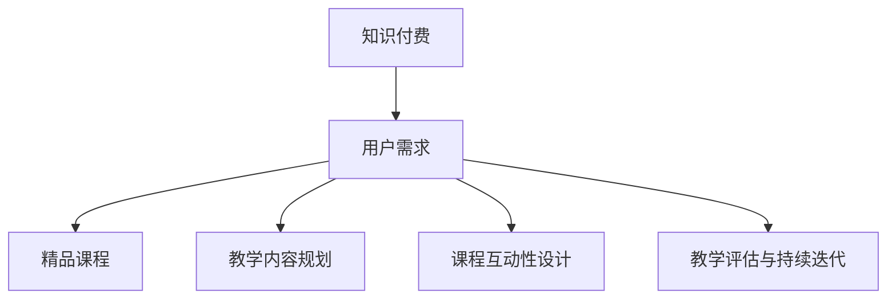

                 

关键词：知识付费、精品课程、编程教学、课程设计、用户需求分析、教学内容规划、互动性、高质量输出、教学评估、持续迭代

> 摘要：本文旨在探讨程序员如何利用自身技术优势，打造出高质量、受欢迎的知识付费课程。文章从用户需求分析、教学内容规划、课程互动性设计、教学评估与持续迭代等多个方面，深入分析并提出了实用的建议。

## 1. 背景介绍

随着互联网的普及和知识付费时代的到来，越来越多的程序员开始尝试将自己的技能和知识转化为线上课程，实现知识的传播和变现。然而，如何打造出一门精品课程，不仅能够满足用户需求，还能确保自身教学内容的持续更新和高质量输出，成为许多程序员面临的挑战。

本文将从以下几个方面进行探讨：

- **用户需求分析**：了解目标用户的需求和痛点，是设计课程的第一步。
- **教学内容规划**：如何组织教学内容，使其既系统又易于理解。
- **课程互动性设计**：互动性是提升学习效果的重要因素。
- **教学评估与持续迭代**：通过评估用户反馈，持续改进课程质量。

## 2. 核心概念与联系

为了更好地理解如何打造精品课程，我们首先需要了解以下几个核心概念：

1. **知识付费**：用户为获取知识而支付的费用。
2. **精品课程**：具有高质量教学内容、合理教学结构、良好互动性的课程。
3. **用户需求**：用户在学习过程中期望获得的知识和体验。

以下是上述核心概念之间的联系：

```
知识付费 -> 用户需求 -> 精品课程
```

接下来，我们将通过一个Mermaid流程图来进一步说明这些概念之间的关系：



## 3. 核心算法原理 & 具体操作步骤

### 3.1 算法原理概述

在打造精品课程的过程中，我们可以将整个过程看作一个算法，其中包含以下几个主要步骤：

1. **需求分析**：通过调研和分析，了解目标用户的需求。
2. **内容规划**：根据需求，设计课程的内容结构和教学大纲。
3. **互动性设计**：设计课程中的互动环节，如讨论区、问答环节等。
4. **教学评估**：收集用户反馈，对课程进行评估和改进。

### 3.2 算法步骤详解

1. **需求分析**

   - **目标用户调研**：通过问卷、访谈等方式，收集目标用户的基本信息和需求。
   - **数据分析**：对收集到的数据进行分析，找出用户的共同需求和痛点。

2. **内容规划**

   - **大纲设计**：根据需求分析结果，设计课程的大纲和教学目标。
   - **内容组织**：将教学内容进行模块化组织，确保逻辑清晰，便于学习。

3. **互动性设计**

   - **讨论区设置**：在课程中设置讨论区，鼓励用户进行交流和互动。
   - **问答环节**：定期举办问答环节，解答用户的问题，提升课程互动性。

4. **教学评估**

   - **用户反馈**：收集用户对课程的评价和反馈，了解课程的优势和不足。
   - **数据统计**：通过数据统计，分析用户的学习效果和满意度。

### 3.3 算法优缺点

- **优点**：通过需求分析和互动设计，能够更好地满足用户需求，提升学习效果。
- **缺点**：需要投入较多的时间和精力进行需求调研和课程设计。

### 3.4 算法应用领域

- **在线教育**：适用于各类在线教育平台，如慕课、知识星球等。
- **企业培训**：适用于企业内部培训，提升员工技能。

## 4. 数学模型和公式 & 详细讲解 & 举例说明

### 4.1 数学模型构建

在打造精品课程的过程中，我们可以引入以下数学模型：

- **用户满意度模型**：通过用户反馈数据，构建用户满意度的数学模型。
- **学习效果模型**：通过用户学习行为数据，构建学习效果的数学模型。

### 4.2 公式推导过程

- **用户满意度模型**：

  用户满意度（S）可以通过以下公式计算：

  $$ S = \frac{\sum_{i=1}^{n} \text{用户i的满意度评分}}{n} $$

  其中，n为用户数量。

- **学习效果模型**：

  学习效果（E）可以通过以下公式计算：

  $$ E = \frac{\sum_{i=1}^{n} \text{用户i的学习成果评分}}{n} $$

  其中，n为用户数量。

### 4.3 案例分析与讲解

以某在线教育平台的编程课程为例，我们通过用户满意度模型和学习效果模型，对该课程进行评估。

- **用户满意度模型**：

  假设有100位用户对该课程进行了评价，其中平均满意度评分为4.5分，则用户满意度为：

  $$ S = \frac{4.5 \times 100}{100} = 4.5 $$

- **学习效果模型**：

  假设有100位用户对该课程进行了学习成果评价，其中平均学习成果评分为4.7分，则学习效果为：

  $$ E = \frac{4.7 \times 100}{100} = 4.7 $$

通过这两个模型，我们可以对该课程的用户满意度和学习效果进行量化评估，从而为课程的改进提供依据。

## 5. 项目实践：代码实例和详细解释说明

### 5.1 开发环境搭建

为了更好地展示课程内容，我们将在Python环境中进行代码实践。以下是开发环境的搭建步骤：

1. 安装Python 3.8及以上版本。
2. 安装必要的Python库，如NumPy、Pandas等。

### 5.2 源代码详细实现

以下是一个简单的用户满意度模型和学

