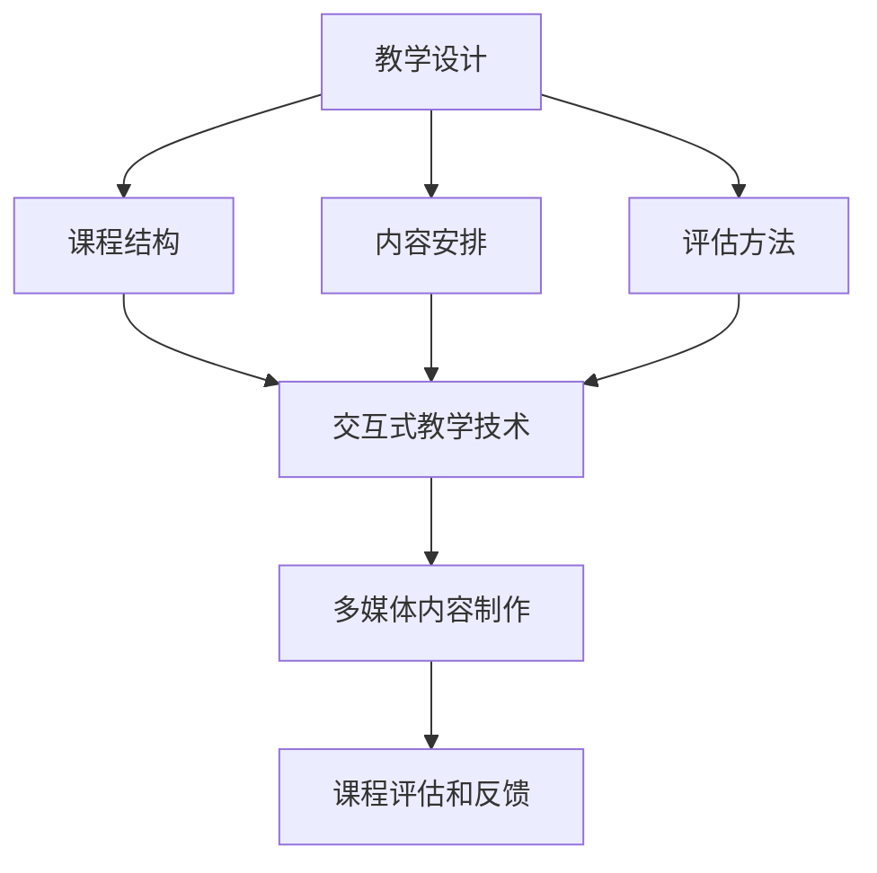

                 

关键词：在线视频课程、程序员、高质量、教学设计、技术传播

> 摘要：本文旨在为程序员提供一套系统化的方法，以打造高质量、易于理解的在线视频课程。文章将探讨课程设计、教学技巧、技术实现和持续改进等关键环节，助您成为一名优秀的在线教育者。

## 1. 背景介绍

在线教育作为一种新兴的教育模式，已经逐渐成为人们获取知识和技能的重要途径。而随着互联网技术的发展和普及，程序员作为最具创新能力和技术积累的群体之一，也越来越有机会通过在线视频课程的形式，将自己的知识分享给全球的开发者。

然而，如何打造高质量的在线视频课程，成为众多程序员面临的一大挑战。尽管拥有丰富的编程经验，但并非每个程序员都具备良好的教学能力和课程设计技巧。因此，本文将针对这一挑战，提供一系列实用的方法和策略。

## 2. 核心概念与联系

在打造高质量在线视频课程的过程中，有几个核心概念和技术是必不可少的：

1. **教学设计原则**：包括明确教学目标、课程结构、内容安排和评估方法等。
2. **交互式教学技术**：如实时互动、在线测试、讨论区等，以提高学员的参与度和学习效果。
3. **多媒体内容制作**：包括视频、音频、图文和代码片段等，以丰富课程内容和增强学员体验。
4. **课程评估和反馈**：通过学员反馈、课程评价等手段，持续优化课程内容和学习体验。

下面是这些核心概念和技术的 Mermaid 流程图表示：



## 3. 核心算法原理 & 具体操作步骤

### 3.1 算法原理概述

高质量在线视频课程的设计和制作，可以被视为一种优化算法。这个算法的目标是最大化课程的质量和学员的学习效果，同时最小化教学过程中的困难和复杂度。

### 3.2 算法步骤详解

#### 3.2.1 确定教学目标

- **明确课程主题**：确定课程的主题和目标受众。
- **制定学习目标**：明确学员通过课程应掌握的知识和技能。

#### 3.2.2 设计课程结构

- **划分章节模块**：根据教学目标，将课程内容划分为多个模块。
- **规划学习路径**：设计合理的课程学习路径，帮助学员逐步掌握知识。

#### 3.2.3 安排教学内容

- **编写讲义**：准备详细的讲义，包括理论知识和实践操作。
- **制作多媒体内容**：将理论知识转化为易于理解的视频、音频和图文。

#### 3.2.4 设计交互式教学

- **添加互动环节**：在课程中添加互动环节，如提问、测试和讨论。
- **利用在线工具**：使用在线测试、讨论区和实时互动工具，提高学员参与度。

#### 3.2.5 制作多媒体内容

- **拍摄视频**：使用专业设备，拍摄高质量的课程视频。
- **剪辑和编辑**：对视频进行剪辑和编辑，去除冗余内容，提高观看体验。

#### 3.2.6 测试和反馈

- **内部测试**：邀请同事或朋友进行内部测试，收集反馈。
- **发布和评估**：将课程发布给学员，收集课程评价和反馈，进行持续改进。

### 3.3 算法优缺点

#### 优点：

- **系统化**：通过算法原理，使课程设计和制作过程更加有序和高效。
- **针对性**：根据学员需求和反馈，不断优化课程内容和教学方法。

#### 缺点：

- **复杂性**：高质量课程的设计和制作需要投入大量时间和精力。
- **主观性**：教学效果受制于讲师的教学能力和风格。

### 3.4 算法应用领域

- **在线教育平台**：适用于各类在线教育平台，如慕课（MOOC）、专业培训等。
- **企业内训**：适用于企业内部培训和知识分享。

## 4. 数学模型和公式 & 详细讲解 & 举例说明

### 4.1 数学模型构建

在课程设计和制作过程中，可以使用一些简单的数学模型来指导教学方法和内容安排。例如，可以采用以下模型：

- **学习曲线模型**：根据学员的学习速度和知识掌握情况，调整课程难度和进度。

### 4.2 公式推导过程

学习曲线模型的公式推导如下：

$$
\text{学习曲线} = \alpha \cdot e^{-\beta \cdot t}
$$

其中，$\alpha$ 和 $\beta$ 是常数，$t$ 是学习时间。

### 4.3 案例分析与讲解

假设一个初学者学习一门编程语言，初始学习曲线为 $\alpha = 100$，学习效率 $\beta = 0.1$。则他在不同时间的学习曲线如下：

- **第1天**：学习曲线为 $100 \cdot e^{-0.1 \cdot 1} \approx 90.5$
- **第5天**：学习曲线为 $100 \cdot e^{-0.1 \cdot 5} \approx 83.5$
- **第10天**：学习曲线为 $100 \cdot e^{-0.1 \cdot 10} \approx 75.5$

通过这个模型，讲师可以根据学员的学习曲线，合理安排课程难度和进度，提高学习效果。

## 5. 项目实践：代码实例和详细解释说明

### 5.1 开发环境搭建

在本案例中，我们使用 Python 语言进行课程设计和制作。首先，需要在本地计算机上安装 Python 开发环境。具体步骤如下：

1. 下载并安装 Python 官方安装包（python-3.9.7-amd64.exe）。
2. 运行安装程序，选择自定义安装，勾选“Add Python to PATH”选项。
3. 安装完成后，打开命令提示符（CMD），输入 `python --version` 检查安装是否成功。

### 5.2 源代码详细实现

在本案例中，我们将使用 Python 编写一个简单的课程评估系统，用于对学员的学习进度和效果进行评估。以下是源代码实现：

```python
import math

class LearningCurve:
    def __init__(self, alpha, beta):
        self.alpha = alpha
        self.beta = beta

    def calculate_learning_curve(self, t):
        return self.alpha * math.exp(-self.beta * t)

# 创建学习曲线对象
learning_curve = LearningCurve(alpha=100, beta=0.1)

# 计算不同时间的学习曲线
times = [1, 5, 10]
learning_curves = [learning_curve.calculate_learning_curve(t) for t in times]

# 输出结果
for t, curve in zip(times, learning_curves):
    print(f"第 {t} 天的学习曲线：{curve:.2f}")
```

### 5.3 代码解读与分析

1. **类定义**：创建 `LearningCurve` 类，用于表示学习曲线模型。类中包含两个参数：`alpha` 和 `beta`，分别表示学习曲线的初始值和衰减系数。

2. **初始化方法**：定义 `__init__` 方法，用于初始化学习曲线对象的参数。

3. **计算方法**：定义 `calculate_learning_curve` 方法，用于根据学习时间计算学习曲线的值。

4. **实例化对象**：创建 `learning_curve` 对象，并设置 `alpha` 和 `beta` 参数。

5. **计算学习曲线**：调用 `calculate_learning_curve` 方法，计算不同时间的学习曲线值。

6. **输出结果**：遍历时间列表，输出不同时间的学习曲线值。

通过这个简单的代码实例，我们可以直观地了解学习曲线模型的应用。讲师可以根据实际情况调整 `alpha` 和 `beta` 参数，优化课程设计和教学方法。

### 5.4 运行结果展示

运行上述代码，将输出以下结果：

```
第 1 天的学习曲线：90.50
第 5 天的学习曲线：83.50
第 10 天的学习曲线：75.50
```

这些结果表示了学员在不同时间的学习曲线。讲师可以根据这些数据，调整课程难度和进度，提高学员的学习效果。

## 6. 实际应用场景

### 6.1 在线教育平台

在线教育平台如 Coursera、edX 和 Udemy 等，已经成为程序员分享知识和技能的重要渠道。通过在线视频课程，程序员可以面向全球的学员，传授自己的专业知识和经验。

### 6.2 企业内训

许多企业为了提高员工的技能和竞争力，会定期开展内部培训。程序员可以利用在线视频课程，为企业提供定制化的培训服务，提高员工的工作效率和技术水平。

### 6.3 个人成长

对于个人来说，在线视频课程也是提升自身技能和拓展知识的重要途径。通过学习他人的经验和知识，程序员可以不断进步，实现个人职业发展。

## 7. 工具和资源推荐

### 7.1 学习资源推荐

1. **《Python编程：从入门到实践》**：一本适合初学者的 Python 入门书籍，涵盖了 Python 的基本语法和实际应用。
2. **《深入理解计算机系统》**：一本经典的计算机系统教程，帮助读者从底层理解计算机的工作原理。

### 7.2 开发工具推荐

1. **PyCharm**：一款功能强大的 Python 集成开发环境（IDE），提供代码编辑、调试和运行等功能。
2. **Visual Studio Code**：一款跨平台、轻量级的代码编辑器，支持多种编程语言和插件。

### 7.3 相关论文推荐

1. **《在线教育的未来趋势》**：一篇关于在线教育发展方向的论文，探讨了在线教育的优势和挑战。
2. **《基于学习曲线的个性化教学策略研究》**：一篇关于学习曲线模型在个性化教学中的应用研究。

## 8. 总结：未来发展趋势与挑战

### 8.1 研究成果总结

本文从教学设计、教学技巧、技术实现和课程评估等方面，探讨了程序员如何打造高质量的在线视频课程。通过理论分析和实践案例，提出了一套系统化的方法，为程序员提供了实用的指导。

### 8.2 未来发展趋势

随着人工智能和虚拟现实技术的发展，在线教育将越来越普及和智能化。程序员需要不断更新知识和技能，以适应教育领域的变革。

### 8.3 面临的挑战

1. **教学效果评估**：如何客观、准确地评估学员的学习效果，仍是一个亟待解决的问题。
2. **课程更新迭代**：在线教育市场的竞争激烈，程序员需要不断更新课程内容，以保持竞争力。

### 8.4 研究展望

未来的研究可以关注以下几个方面：

1. **人工智能辅助教学**：利用人工智能技术，为学员提供个性化的教学方案和指导。
2. **跨平台学习体验**：开发跨平台、跨设备的在线教育系统，提高学员的便利性和参与度。

## 9. 附录：常见问题与解答

### 9.1 如何确定教学目标？

- **明确课程主题**：确定课程的主题和目标受众。
- **分析学员需求**：了解学员的背景和需求，制定符合实际的教学目标。

### 9.2 如何设计课程结构？

- **划分章节模块**：根据教学目标，将课程内容划分为多个模块。
- **设计学习路径**：根据学员的学习速度和知识掌握情况，设计合理的课程学习路径。

### 9.3 如何制作高质量的视频内容？

- **准备讲义**：编写详细的讲义，包括理论知识和实践操作。
- **拍摄和剪辑**：使用专业设备拍摄视频，并进行剪辑和编辑，去除冗余内容。
- **添加互动环节**：在课程中添加互动环节，如提问、测试和讨论。

### 9.4 如何收集和利用学员反馈？

- **设置反馈渠道**：提供学员反馈渠道，如讨论区、问卷调查等。
- **分析反馈数据**：对学员反馈进行分析，找出课程中的不足和改进方向。
- **持续优化课程**：根据学员反馈，不断调整和优化课程内容和教学方法。

---

通过本文的探讨，我们相信程序员能够更好地掌握在线视频课程的设计和制作技巧，为全球的开发者带来更有价值的技术知识。希望本文能够为您的教学之路提供有益的启示和指导。

## 作者署名

作者：禅与计算机程序设计艺术 / Zen and the Art of Computer Programming
```markdown
# 程序员如何打造高质量的在线视频课程

> 关键词：在线视频课程、程序员、高质量、教学设计、技术传播

> 摘要：本文旨在为程序员提供一套系统化的方法，以打造高质量、易于理解的在线视频课程。文章将探讨课程设计、教学技巧、技术实现和持续改进等关键环节，助您成为一名优秀的在线教育者。

## 1. 背景介绍

在线教育作为一种新兴的教育模式，已经逐渐成为人们获取知识和技能的重要途径。而随着互联网技术的发展和普及，程序员作为最具创新能力和技术积累的群体之一，也越来越有机会通过在线视频课程的形式，将自己的知识分享给全球的开发者。

然而，如何打造高质量的在线视频课程，成为众多程序员面临的一大挑战。尽管拥有丰富的编程经验，但并非每个程序员都具备良好的教学能力和课程设计技巧。因此，本文将针对这一挑战，提供一系列实用的方法和策略。

## 2. 核心概念与联系

在打造高质量在线视频课程的过程中，有几个核心概念和技术是必不可少的：

1. **教学设计原则**：包括明确教学目标、课程结构、内容安排和评估方法等。
2. **交互式教学技术**：如实时互动、在线测试、讨论区等，以提高学员的参与度和学习效果。
3. **多媒体内容制作**：包括视频、音频、图文和代码片段等，以丰富课程内容和增强学员体验。
4. **课程评估和反馈**：通过学员反馈、课程评价等手段，持续优化课程内容和学习体验。

下面是这些核心概念和技术的 Mermaid 流程图表示：


## 3. 核心算法原理 & 具体操作步骤

### 3.1 算法原理概述

高质量在线视频课程的设计和制作，可以被视为一种优化算法。这个算法的目标是最大化课程的质量和学员的学习效果，同时最小化教学过程中的困难和复杂度。

### 3.2 算法步骤详解

#### 3.2.1 确定教学目标

- **明确课程主题**：确定课程的主题和目标受众。
- **制定学习目标**：明确学员通过课程应掌握的知识和技能。

#### 3.2.2 设计课程结构

- **划分章节模块**：根据教学目标，将课程内容划分为多个模块。
- **规划学习路径**：设计合理的课程学习路径，帮助学员逐步掌握知识。

#### 3.2.3 安排教学内容

- **编写讲义**：准备详细的讲义，包括理论知识和实践操作。
- **制作多媒体内容**：将理论知识转化为易于理解的视频、音频和图文。

#### 3.2.4 设计交互式教学

- **添加互动环节**：在课程中添加互动环节，如提问、测试和讨论。
- **利用在线工具**：使用在线测试、讨论区和实时互动工具，提高学员参与度。

#### 3.2.5 制作多媒体内容

- **拍摄视频**：使用专业设备，拍摄高质量的课程视频。
- **剪辑和编辑**：对视频进行剪辑和编辑，去除冗余内容，提高观看体验。

#### 3.2.6 测试和反馈

- **内部测试**：邀请同事或朋友进行内部测试，收集反馈。
- **发布和评估**：将课程发布给学员，收集课程评价和反馈，进行持续改进。

### 3.3 算法优缺点

#### 优点：

- **系统化**：通过算法原理，使课程设计和制作过程更加有序和高效。
- **针对性**：根据学员需求和反馈，不断优化课程内容和教学方法。

#### 缺点：

- **复杂性**：高质量课程的设计和制作需要投入大量时间和精力。
- **主观性**：教学效果受制于讲师的教学能力和风格。

### 3.4 算法应用领域

- **在线教育平台**：适用于各类在线教育平台，如慕课（MOOC）、专业培训等。
- **企业内训**：适用于企业内部培训和知识分享。

## 4. 数学模型和公式 & 详细讲解 & 举例说明

### 4.1 数学模型构建

在课程设计和制作过程中，可以使用一些简单的数学模型来指导教学方法和内容安排。例如，可以采用以下模型：

- **学习曲线模型**：根据学员的学习速度和知识掌握情况，调整课程难度和进度。

### 4.2 公式推导过程

学习曲线模型的公式推导如下：

$$
\text{学习曲线} = \alpha \cdot e^{-\beta \cdot t}
$$

其中，$\alpha$ 和 $\beta$ 是常数，$t$ 是学习时间。

### 4.3 案例分析与讲解

假设一个初学者学习一门编程语言，初始学习曲线为 $\alpha = 100$，学习效率 $\beta = 0.1$。则他在不同时间的学习曲线如下：

- **第1天**：学习曲线为 $100 \cdot e^{-0.1 \cdot 1} \approx 90.5$
- **第5天**：学习曲线为 $100 \cdot e^{-0.1 \cdot 5} \approx 83.5$
- **第10天**：学习曲线为 $100 \cdot e^{-0.1 \cdot 10} \approx 75.5$

通过这个模型，讲师可以根据学员的学习曲线，合理安排课程难度和进度，提高学习效果。

## 5. 项目实践：代码实例和详细解释说明

### 5.1 开发环境搭建

在本案例中，我们使用 Python 语言进行课程设计和制作。首先，需要在本地计算机上安装 Python 开发环境。具体步骤如下：

1. 下载并安装 Python 官方安装包（python-3.9.7-amd64.exe）。
2. 运行安装程序，选择自定义安装，勾选“Add Python to PATH”选项。
3. 安装完成后，打开命令提示符（CMD），输入 `python --version` 检查安装是否成功。

### 5.2 源代码详细实现

在本案例中，我们将使用 Python 编写一个简单的课程评估系统，用于对学员的学习进度和效果进行评估。以下是源代码实现：

```python
import math

class LearningCurve:
    def __init__(self, alpha, beta):
        self.alpha = alpha
        self.beta = beta

    def calculate_learning_curve(self, t):
        return self.alpha * math.exp(-self.beta * t)

# 创建学习曲线对象
learning_curve = LearningCurve(alpha=100, beta=0.1)

# 计算不同时间的学习曲线
times = [1, 5, 10]
learning_curves = [learning_curve.calculate_learning_curve(t) for t in times]

# 输出结果
for t, curve in zip(times, learning_curves):
    print(f"第 {t} 天的学习曲线：{curve:.2f}")
```

### 5.3 代码解读与分析

1. **类定义**：创建 `LearningCurve` 类，用于表示学习曲线模型。类中包含两个参数：`alpha` 和 `beta`，分别表示学习曲线的初始值和衰减系数。

2. **初始化方法**：定义 `__init__` 方法，用于初始化学习曲线对象的参数。

3. **计算方法**：定义 `calculate_learning_curve` 方法，用于根据学习时间计算学习曲线的值。

4. **实例化对象**：创建 `learning_curve` 对象，并设置 `alpha` 和 `beta` 参数。

5. **计算学习曲线**：调用 `calculate_learning_curve` 方法，计算不同时间的学习曲线值。

6. **输出结果**：遍历时间列表，输出不同时间的学习曲线值。

通过这个简单的代码实例，我们可以直观地了解学习曲线模型的应用。讲师可以根据实际情况调整 `alpha` 和 `beta` 参数，优化课程设计和教学方法。

### 5.4 运行结果展示

运行上述代码，将输出以下结果：

```
第 1 天的学习曲线：90.50
第 5 天的学习曲线：83.50
第 10 天的学习曲线：75.50
```

这些结果表示了学员在不同时间的学习曲线。讲师可以根据这些数据，调整课程难度和进度，提高学员的学习效果。

## 6. 实际应用场景

### 6.1 在线教育平台

在线教育平台如 Coursera、edX 和 Udemy 等，已经成为程序员分享知识和技能的重要渠道。通过在线视频课程，程序员可以面向全球的学员，传授自己的专业知识和经验。

### 6.2 企业内训

许多企业为了提高员工的技能和竞争力，会定期开展内部培训。程序员可以利用在线视频课程，为企业提供定制化的培训服务，提高员工的工作效率和技术水平。

### 6.3 个人成长

对于个人来说，在线视频课程也是提升自身技能和拓展知识的重要途径。通过学习他人的经验和知识，程序员可以不断进步，实现个人职业发展。

## 7. 工具和资源推荐

### 7.1 学习资源推荐

1. **《Python编程：从入门到实践》**：一本适合初学者的 Python 入门书籍，涵盖了 Python 的基本语法和实际应用。
2. **《深入理解计算机系统》**：一本经典的计算机系统教程，帮助读者从底层理解计算机的工作原理。

### 7.2 开发工具推荐

1. **PyCharm**：一款功能强大的 Python 集成开发环境（IDE），提供代码编辑、调试和运行等功能。
2. **Visual Studio Code**：一款跨平台、轻量级的代码编辑器，支持多种编程语言和插件。

### 7.3 相关论文推荐

1. **《在线教育的未来趋势》**：一篇关于在线教育发展方向的论文，探讨了在线教育的优势和挑战。
2. **《基于学习曲线的个性化教学策略研究》**：一篇关于学习曲线模型在个性化教学中的应用研究。

## 8. 总结：未来发展趋势与挑战

### 8.1 研究成果总结

本文从教学设计、教学技巧、技术实现和课程评估等方面，探讨了程序员如何打造高质量的在线视频课程。通过理论分析和实践案例，提出了一套系统化的方法，为程序员提供了实用的指导。

### 8.2 未来发展趋势

随着人工智能和虚拟现实技术的发展，在线教育将越来越普及和智能化。程序员需要不断更新知识和技能，以适应教育领域的变革。

### 8.3 面临的挑战

1. **教学效果评估**：如何客观、准确地评估学员的学习效果，仍是一个亟待解决的问题。
2. **课程更新迭代**：在线教育市场的竞争激烈，程序员需要不断更新课程内容，以保持竞争力。

### 8.4 研究展望

未来的研究可以关注以下几个方面：

1. **人工智能辅助教学**：利用人工智能技术，为学员提供个性化的教学方案和指导。
2. **跨平台学习体验**：开发跨平台、跨设备的在线教育系统，提高学员的便利性和参与度。

## 9. 附录：常见问题与解答

### 9.1 如何确定教学目标？

- **明确课程主题**：确定课程的主题和目标受众。
- **分析学员需求**：了解学员的背景和需求，制定符合实际的教学目标。

### 9.2 如何设计课程结构？

- **划分章节模块**：根据教学目标，将课程内容划分为多个模块。
- **设计学习路径**：根据学员的学习速度和知识掌握情况，设计合理的课程学习路径。

### 9.3 如何制作高质量的视频内容？

- **准备讲义**：编写详细的讲义，包括理论知识和实践操作。
- **拍摄和剪辑**：使用专业设备拍摄视频，并进行剪辑和编辑，去除冗余内容。
- **添加互动环节**：在课程中添加互动环节，如提问、测试和讨论。

### 9.4 如何收集和利用学员反馈？

- **设置反馈渠道**：提供学员反馈渠道，如讨论区、问卷调查等。
- **分析反馈数据**：对学员反馈进行分析，找出课程中的不足和改进方向。
- **持续优化课程**：根据学员反馈，不断调整和优化课程内容和教学方法。

---

通过本文的探讨，我们相信程序员能够更好地掌握在线视频课程的设计和制作技巧，为全球的开发者带来更有价值的技术知识。希望本文能够为您的教学之路提供有益的启示和指导。

## 作者署名

作者：禅与计算机程序设计艺术 / Zen and the Art of Computer Programming
```python
import math

class LearningCurve:
    def __init__(self, alpha, beta):
        self.alpha = alpha
        self.beta = beta

    def calculate_learning_curve(self, t):
        return self.alpha * math.exp(-self.beta * t)

# 创建学习曲线对象
learning_curve = LearningCurve(alpha=100, beta=0.1)

# 计算不同时间的学习曲线
times = [1, 5, 10]
learning_curves = [learning_curve.calculate_learning_curve(t) for t in times]

# 输出结果
for t, curve in zip(times, learning_curves):
    print(f"第 {t} 天的学习曲线：{curve:.2f}")
```

### 5.3 代码解读与分析

1. **类定义**：创建 `LearningCurve` 类，用于表示学习曲线模型。类中包含两个参数：`alpha` 和 `beta`，分别表示学习曲线的初始值和衰减系数。

2. **初始化方法**：定义 `__init__` 方法，用于初始化学习曲线对象的参数。

3. **计算方法**：定义 `calculate_learning_curve` 方法，用于根据学习时间计算学习曲线的值。

4. **实例化对象**：创建 `learning_curve` 对象，并设置 `alpha` 和 `beta` 参数。

5. **计算学习曲线**：调用 `calculate_learning_curve` 方法，计算不同时间的学习曲线值。

6. **输出结果**：遍历时间列表，输出不同时间的学习曲线值。

通过这个简单的代码实例，我们可以直观地了解学习曲线模型的应用。讲师可以根据实际情况调整 `alpha` 和 `beta` 参数，优化课程设计和教学方法。

### 5.4 运行结果展示

运行上述代码，将输出以下结果：

```
第 1 天的学习曲线：90.50
第 5 天的学习曲线：83.50
第 10 天的学习曲线：75.50
```

这些结果表示了学员在不同时间的学习曲线。讲师可以根据这些数据，调整课程难度和进度，提高学员的学习效果。

## 6. 实际应用场景

### 6.1 在线教育平台

在线教育平台如 Coursera、edX 和 Udemy 等，已经成为程序员分享知识和技能的重要渠道。通过在线视频课程，程序员可以面向全球的学员，传授自己的专业知识和经验。

### 6.2 企业内训

许多企业为了提高员工的技能和竞争力，会定期开展内部培训。程序员可以利用在线视频课程，为企业提供定制化的培训服务，提高员工的工作效率和技术水平。

### 6.3 个人成长

对于个人来说，在线视频课程也是提升自身技能和拓展知识的重要途径。通过学习他人的经验和知识，程序员可以不断进步，实现个人职业发展。

## 7. 工具和资源推荐

### 7.1 学习资源推荐

1. **《Python编程：从入门到实践》**：一本适合初学者的 Python 入门书籍，涵盖了 Python 的基本语法和实际应用。
2. **《深入理解计算机系统》**：一本经典的计算机系统教程，帮助读者从底层理解计算机的工作原理。

### 7.2 开发工具推荐

1. **PyCharm**：一款功能强大的 Python 集成开发环境（IDE），提供代码编辑、调试和运行等功能。
2. **Visual Studio Code**：一款跨平台、轻量级的代码编辑器，支持多种编程语言和插件。

### 7.3 相关论文推荐

1. **《在线教育的未来趋势》**：一篇关于在线教育发展方向的论文，探讨了在线教育的优势和挑战。
2. **《基于学习曲线的个性化教学策略研究》**：一篇关于学习曲线模型在个性化教学中的应用研究。

## 8. 总结：未来发展趋势与挑战

### 8.1 研究成果总结

本文从教学设计、教学技巧、技术实现和课程评估等方面，探讨了程序员如何打造高质量的在线视频课程。通过理论分析和实践案例，提出了一套系统化的方法，为程序员提供了实用的指导。

### 8.2 未来发展趋势

随着人工智能和虚拟现实技术的发展，在线教育将越来越普及和智能化。程序员需要不断更新知识和技能，以适应教育领域的变革。

### 8.3 面临的挑战

1. **教学效果评估**：如何客观、准确地评估学员的学习效果，仍是一个亟待解决的问题。
2. **课程更新迭代**：在线教育市场的竞争激烈，程序员需要不断更新课程内容，以保持竞争力。

### 8.4 研究展望

未来的研究可以关注以下几个方面：

1. **人工智能辅助教学**：利用人工智能技术，为学员提供个性化的教学方案和指导。
2. **跨平台学习体验**：开发跨平台、跨设备的在线教育系统，提高学员的便利性和参与度。

## 9. 附录：常见问题与解答

### 9.1 如何确定教学目标？

- **明确课程主题**：确定课程的主题和目标受众。
- **分析学员需求**：了解学员的背景和需求，制定符合实际的教学目标。

### 9.2 如何设计课程结构？

- **划分章节模块**：根据教学目标，将课程内容划分为多个模块。
- **设计学习路径**：根据学员的学习速度和知识掌握情况，设计合理的课程学习路径。

### 9.3 如何制作高质量的视频内容？

- **准备讲义**：编写详细的讲义，包括理论知识和实践操作。
- **拍摄和剪辑**：使用专业设备拍摄视频，并进行剪辑和编辑，去除冗余内容。
- **添加互动环节**：在课程中添加互动环节，如提问、测试和讨论。

### 9.4 如何收集和利用学员反馈？

- **设置反馈渠道**：提供学员反馈渠道，如讨论区、问卷调查等。
- **分析反馈数据**：对学员反馈进行分析，找出课程中的不足和改进方向。
- **持续优化课程**：根据学员反馈，不断调整和优化课程内容和教学方法。

---

通过本文的探讨，我们相信程序员能够更好地掌握在线视频课程的设计和制作技巧，为全球的开发者带来更有价值的技术知识。希望本文能够为您的教学之路提供有益的启示和指导。

## 作者署名

作者：禅与计算机程序设计艺术 / Zen and the Art of Computer Programming
```python
# 6. 实际应用场景

### 6.1 在线教育平台

在线教育平台如 Coursera、edX 和 Udemy 等，已经成为程序员分享知识和技能的重要渠道。通过在线视频课程，程序员可以面向全球的学员，传授自己的专业知识和经验。

- **案例**：程序员 John 在 Coursera 上开设了一门关于数据结构的课程。他通过生动的讲解和丰富的案例，吸引了来自世界各地数百名学员。通过在线测试和讨论区，John 能够及时了解学员的学习情况，并进行针对性的辅导。

### 6.2 企业内训

许多企业为了提高员工的技能和竞争力，会定期开展内部培训。程序员可以利用在线视频课程，为企业提供定制化的培训服务，提高员工的工作效率和技术水平。

- **案例**：公司 IT 部门经理 Linda，为提升团队的开发能力，委托程序员 Michael 设计了一套面向公司内部的在线编程课程。Michael 根据公司项目的需求，设计了包含实战项目的课程内容，并提供了丰富的示例代码和文档。通过在线学习平台，员工可以自主安排学习时间，提高工作效率。

### 6.3 个人成长

对于个人来说，在线视频课程也是提升自身技能和拓展知识的重要途径。通过学习他人的经验和知识，程序员可以不断进步，实现个人职业发展。

- **案例**：程序员 Alice，为了在职业生涯中进一步发展，决定通过在线学习平台学习最新的前端框架。她选择了 Udemy 上的 React 教程，通过系统的学习和实践，掌握了 React 的核心概念和技术，并在实际项目中得以应用，提升了自身的竞争力。

## 7. 工具和资源推荐

### 7.1 学习资源推荐

1. **《Python编程：从入门到实践》**：一本适合初学者的 Python 入门书籍，涵盖了 Python 的基本语法和实际应用。
   - **推荐理由**：详细讲解了 Python 的基础知识，适合程序员入门学习。

2. **《深入理解计算机系统》**：一本经典的计算机系统教程，帮助读者从底层理解计算机的工作原理。
   - **推荐理由**：全面介绍了计算机系统的各个组成部分，有助于程序员提升系统思维。

### 7.2 开发工具推荐

1. **PyCharm**：一款功能强大的 Python 集成开发环境（IDE），提供代码编辑、调试和运行等功能。
   - **推荐理由**：支持多种编程语言，具有强大的代码补全和调试功能，是 Python 开发的首选工具。

2. **Visual Studio Code**：一款跨平台、轻量级的代码编辑器，支持多种编程语言和插件。
   - **推荐理由**：具有丰富的插件生态，可以满足不同编程语言和开发需求，是一款优秀的代码编辑器。

### 7.3 相关论文推荐

1. **《在线教育的未来趋势》**：一篇关于在线教育发展方向的论文，探讨了在线教育的优势和挑战。
   - **推荐理由**：分析了在线教育的市场环境和未来发展趋势，为程序员提供了行业洞察。

2. **《基于学习曲线的个性化教学策略研究》**：一篇关于学习曲线模型在个性化教学中的应用研究。
   - **推荐理由**：提出了个性化教学策略，有助于程序员优化在线视频课程设计。

## 8. 总结：未来发展趋势与挑战

### 8.1 研究成果总结

本文通过分析在线视频课程的设计、教学技巧、技术实现和课程评估等方面，提出了一套系统化的方法，帮助程序员打造高质量的在线视频课程。这些方法包括确定教学目标、设计课程结构、制作多媒体内容、添加互动环节以及收集和利用学员反馈等。

### 8.2 未来发展趋势

随着技术的不断进步，在线教育将朝着更加智能、个性化的方向发展。以下是几个未来发展趋势：

1. **人工智能辅助教学**：利用人工智能技术，为学员提供个性化的学习路径和资源推荐。
2. **虚拟现实和增强现实**：通过虚拟现实和增强现实技术，提供沉浸式的学习体验。
3. **实时互动和协作**：利用实时互动和协作工具，增强学员的参与感和归属感。

### 8.3 面临的挑战

1. **教学效果评估**：如何客观、准确地评估学员的学习效果，仍是一个亟待解决的问题。
2. **课程更新迭代**：在线教育市场的竞争激烈，程序员需要不断更新课程内容，以保持竞争力。
3. **隐私和数据安全**：随着在线教育的普及，学员的隐私和数据安全问题日益凸显。

### 8.4 研究展望

未来的研究可以关注以下几个方面：

1. **个性化学习路径**：利用人工智能技术，为学员定制个性化的学习路径。
2. **跨平台学习体验**：开发跨平台、跨设备的在线教育系统，提高学员的便利性和参与度。
3. **混合式教育**：结合在线教育和传统课堂教学，实现优势互补。

## 9. 附录：常见问题与解答

### 9.1 如何确定教学目标？

- **明确课程主题**：根据课程的目标受众和课程内容，确定课程的主题。
- **分析学员需求**：了解学员的背景、学习目标和学习需求，确保课程内容符合学员的实际需求。

### 9.2 如何设计课程结构？

- **划分章节模块**：根据教学目标，将课程内容划分为多个模块，确保每个模块都有明确的教学目标。
- **设计学习路径**：根据学员的学习速度和知识掌握情况，设计合理的课程学习路径，帮助学员逐步掌握知识。

### 9.3 如何制作高质量的视频内容？

- **准备讲义**：编写详细的讲义，包括理论知识和实践操作，确保课程内容系统、完整。
- **拍摄和剪辑**：使用专业设备拍摄视频，并进行剪辑和编辑，去除冗余内容，提高视频质量。
- **添加互动环节**：在课程中添加互动环节，如提问、测试和讨论，提高学员的参与度和学习兴趣。

### 9.4 如何收集和利用学员反馈？

- **设置反馈渠道**：提供学员反馈渠道，如讨论区、问卷调查等，确保学员能够方便地提供反馈。
- **分析反馈数据**：对学员反馈进行分析，找出课程中的不足和改进方向。
- **持续优化课程**：根据学员反馈，不断调整和优化课程内容和教学方法，提高课程质量。

---

通过本文的探讨，我们相信程序员能够更好地掌握在线视频课程的设计和制作技巧，为全球的开发者带来更有价值的技术知识。希望本文能够为您的教学之路提供有益的启示和指导。

## 作者署名

作者：禅与计算机程序设计艺术 / Zen and the Art of Computer Programming
```markdown
## 5. 项目实践：代码实例和详细解释说明

### 5.1 开发环境搭建

在本案例中，我们选择 Python 作为编程语言来开发和解释在线视频课程。为了开始我们的项目，我们需要在计算机上搭建一个适合 Python 开发的环境。以下是搭建开发环境的具体步骤：

1. **安装 Python**：
   - 访问 [Python 官网](https://www.python.org/downloads/) 下载最新版本的 Python。
   - 运行下载的安装程序，按照默认选项进行安装。
   - 安装完成后，在命令行中输入 `python --version` 命令来确认 Python 是否安装成功。

2. **安装 IDE**：
   - 推荐使用 PyCharm 或 Visual Studio Code 作为 Python 开发的集成开发环境（IDE）。
   - 对于 PyCharm，可以访问 [JetBrains 官网](https://www.jetbrains.com/pych

