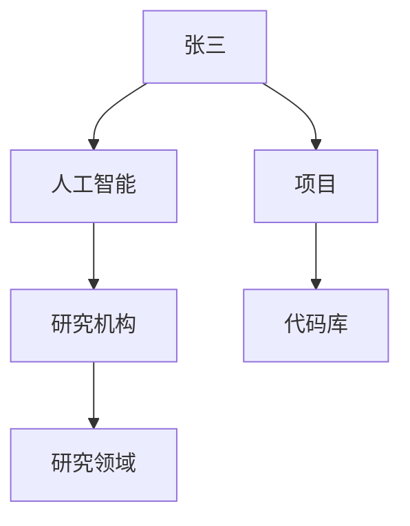

                 

关键词：个人知识图谱，知识管理，认知架构，编程，数据处理，算法，机器学习，图数据库，网络分析。

> 摘要：本文将探讨程序员如何构建个人知识图谱，通过理解知识图谱的核心概念、应用场景、构建方法和优化技巧，帮助程序员提高知识管理效率和问题解决能力。本文旨在为程序员提供一个全面的指南，使其能够有效地利用知识图谱技术来提升个人的专业素养。

## 1. 背景介绍

在信息技术迅猛发展的今天，知识已经成为企业、组织和个体竞争的核心资源。随着互联网的普及和大数据时代的到来，程序员面临着海量的信息和知识，如何有效地管理和利用这些资源成为一个重要课题。知识图谱作为一种新兴的知识管理技术，通过将实体和概念之间的关系以图谱的形式表示，为程序员提供了一个强大的知识组织工具。

知识图谱最早由谷歌提出，旨在通过构建互联网上的实体关系网络，提高搜索引擎的检索效率和准确性。随着技术的进步，知识图谱的应用逐渐扩展到企业内部的知识管理、智能推荐、数据挖掘等领域。对于程序员而言，构建个人知识图谱不仅有助于整理和记忆知识点，还能提高问题解决能力和协作效率。

本文将首先介绍知识图谱的基本概念和架构，然后探讨程序员在构建个人知识图谱时需要考虑的关键因素，最后通过实例分析，展示如何利用知识图谱技术提升个人知识管理效率。

## 2. 核心概念与联系

### 2.1 知识图谱的定义

知识图谱（Knowledge Graph）是一种语义网络，它通过将实体、概念和关系进行结构化表示，形成一个具有语义信息的网络。在知识图谱中，实体表示具体的事物，如人、地点、组织等；概念表示抽象的类别，如动物、城市、技术等；关系表示实体与实体之间的关联，如“属于”、“位于”等。

### 2.2 知识图谱的架构

知识图谱的架构主要包括三个层次：底层是数据层，负责存储原始数据；中层是模型层，定义实体和关系的模型；顶层是应用层，实现知识图谱在具体场景中的应用。

- **数据层**：数据层是知识图谱的基础，包括实体和关系的数据。程序员需要收集和清洗各种数据源，如文献、博客、书籍、代码库等，以构建起一个丰富的数据集。
- **模型层**：模型层定义了知识图谱的语义结构。程序员需要设计实体和关系的模型，确保图谱的准确性和一致性。常用的模型包括RDF（Resource Description Framework）、OWL（Web Ontology Language）等。
- **应用层**：应用层是将知识图谱应用于实际问题的实现。程序员需要根据具体需求，开发相应的应用，如问答系统、推荐系统、智能搜索等。

### 2.3 知识图谱的关键概念

在构建个人知识图谱时，程序员需要理解以下几个关键概念：

- **实体（Entity）**：实体是知识图谱中最基本的元素，代表具体的事物。例如，“张三”是一个实体，“人工智能”也是一个实体。
- **属性（Attribute）**：属性描述实体的特征。例如，“张三”的属性可以是“年龄”、“工作单位”等。
- **关系（Relationship）**：关系描述实体之间的关联。例如，“张三”和“人工智能”之间存在“研究”的关系。
- **路径（Path）**：路径描述实体之间的连接路径。例如，从“张三”到“人工智能”的路径可以是“研究机构”、“研究领域”等。

### 2.4 知识图谱的 Mermaid 流程图

下面是一个简单的知识图谱 Mermaid 流程图，展示了实体、关系和路径的概念：



在上述流程图中，`A` 是实体，“研究”、“位于”、“属于”是关系，而“从 A 到 B 的路径”包括“研究机构”、“研究领域”等。

### 2.5 知识图谱的构建步骤

构建个人知识图谱可以分为以下几个步骤：

1. **数据收集**：收集与个人专业相关的数据，如文档、博客、论文、代码库等。
2. **数据清洗**：对收集到的数据进行清洗，去除噪声和重复信息，确保数据的准确性和一致性。
3. **数据建模**：设计实体和关系的模型，将数据转化为结构化的知识图谱。
4. **数据存储**：选择合适的存储方案，如图数据库，将知识图谱存储起来。
5. **数据查询与优化**：开发查询工具和优化算法，提高知识图谱的查询效率和准确性。

### 2.6 知识图谱的优缺点

**优点**：
- 提高知识组织和管理的效率。
- 支持复杂的关系查询和路径分析。
- 有助于发现知识之间的关联和规律。

**缺点**：
- 构建和维护成本较高。
- 需要专业的技术背景和知识。

## 3. 核心算法原理 & 具体操作步骤

### 3.1 算法原理概述

构建个人知识图谱的核心算法包括实体识别、关系抽取、实体链接和知识融合等。这些算法共同作用于知识图谱的构建过程，确保图谱的完整性和准确性。

- **实体识别**：从原始数据中识别出实体，如人名、地名、机构名等。
- **关系抽取**：从原始数据中提取出实体之间的关系，如研究、合作、隶属于等。
- **实体链接**：将同一个实体的不同表示（如全名、简称、别名）进行链接，确保图谱中的实体唯一。
- **知识融合**：整合来自多个数据源的信息，确保知识的一致性和准确性。

### 3.2 算法步骤详解

1. **实体识别**：
   - 使用命名实体识别（NER）技术，从文本中提取出实体。
   - 利用预训练的模型，如BERT、GPT等，进行实体识别。

2. **关系抽取**：
   - 使用关系抽取（RE）技术，从实体对之间提取出关系。
   - 利用规则方法、监督学习、半监督学习等方法进行关系抽取。

3. **实体链接**：
   - 使用实体链接（EN）技术，将同一实体的不同表示进行匹配和链接。
   - 利用相似度计算、聚类、基于知识的方法等实现实体链接。

4. **知识融合**：
   - 整合来自多个数据源的信息，确保知识的一致性和准确性。
   - 使用合并规则、冲突解决策略等方法进行知识融合。

### 3.3 算法优缺点

**优点**：
- 提高知识图谱的完整性和准确性。
- 支持复杂的关系查询和路径分析。

**缺点**：
- 需要大量的数据和计算资源。
- 算法复杂度较高，实施难度大。

### 3.4 算法应用领域

知识图谱算法在多个领域具有广泛的应用，包括：

- **搜索引擎**：通过构建知识图谱，提高搜索结果的准确性和相关性。
- **智能问答**：利用知识图谱，实现基于自然语言的智能问答系统。
- **推荐系统**：通过分析知识图谱中的关系，实现个性化推荐。
- **数据挖掘**：利用知识图谱，发现数据之间的关联和规律。

## 4. 数学模型和公式 & 详细讲解 & 举例说明

### 4.1 数学模型构建

构建个人知识图谱的核心数学模型主要包括图论和概率图模型。

- **图论模型**：图论模型用于表示实体和关系之间的网络结构。常用的图论模型包括无向图、有向图、加权图等。

- **概率图模型**：概率图模型用于描述实体和关系之间的概率关系。常用的概率图模型包括贝叶斯网络、马尔可夫网络等。

### 4.2 公式推导过程

1. **图论模型中的基本公式**：

- **度数公式**：对于一个有 \( n \) 个节点的图，节点的度数之和等于边数的两倍。

  \[ \sum_{i=1}^{n} deg(i) = 2m \]

  其中，\( deg(i) \) 表示节点 \( i \) 的度数，\( m \) 表示边的数量。

- **连通度公式**：对于一个有 \( n \) 个节点的图，最小连通度等于节点数减去连通分支数。

  \[ \delta(G) = n - k \]

  其中，\( \delta(G) \) 表示最小连通度，\( k \) 表示连通分支数。

2. **概率图模型中的基本公式**：

- **贝叶斯网络**：贝叶斯网络中的条件概率公式如下：

  \[ P(X_i|X_{i-1}) = \frac{P(X_i,X_{i-1})}{P(X_{i-1})} \]

  其中，\( P(X_i|X_{i-1}) \) 表示在 \( X_{i-1} \) 条件下 \( X_i \) 的概率。

- **马尔可夫网络**：马尔可夫网络中的转移概率公式如下：

  \[ P(X_i|X_{i-1},X_{i-2},\ldots,X_1) = P(X_i|X_{i-1}) \]

  其中，\( P(X_i|X_{i-1},X_{i-2},\ldots,X_1) \) 表示在 \( X_{i-1},X_{i-2},\ldots,X_1 \) 条件下 \( X_i \) 的概率。

### 4.3 案例分析与讲解

以下是一个简单的案例，用于说明如何利用图论模型和概率图模型构建个人知识图谱。

#### 案例背景

假设我们有一个程序员团队，需要构建一个个人知识图谱来记录团队成员的专业技能和项目参与情况。

#### 案例步骤

1. **数据收集**：

   收集团队成员的简历、项目报告和博客文章等数据，获取团队成员的专业技能和项目参与信息。

2. **数据清洗**：

   对收集到的数据进行清洗，去除无关信息，确保数据的准确性和一致性。

3. **数据建模**：

   使用图论模型，将团队成员和专业技能表示为节点，将项目参与情况表示为边，构建一个有向图。

   ```mermaid
   graph TD
       A[张三] --> B[Java]
       A --> C[数据库]
       B --> D[Spring Boot]
       C --> E[MySQL]
   ```

   使用概率图模型，定义每个节点的概率分布，表示团队成员对每个技能的熟练程度。

   ```mermaid
   graph TD
       A[张三] --> B[Java]
       B --> C[Spring Boot]
       C --> D{熟练程度}
       D --> E[高]
   ```

4. **数据存储**：

   将构建好的知识图谱存储在图数据库中，如Neo4j，以便进行后续查询和分析。

5. **数据查询与优化**：

   开发查询工具和优化算法，实现对知识图谱的查询和分析。

   ```sql
   MATCH (a:Person)-[r:SKILL]->(s:Skill)
   WHERE a.name = '张三'
   RETURN a.name, s.name, r.level
   ```

### 4.4 案例分析

通过上述案例，我们可以看到如何利用图论模型和概率图模型构建个人知识图谱。图论模型用于表示实体和关系之间的网络结构，概率图模型用于表示实体之间的概率关系。通过数据查询和分析，我们可以了解团队成员的专业技能分布，为项目分配和培训提供依据。

## 5. 项目实践：代码实例和详细解释说明

### 5.1 开发环境搭建

为了实现个人知识图谱的构建，我们需要搭建以下开发环境：

- **编程语言**：Python
- **图数据库**：Neo4j
- **开发工具**：PyCharm

首先，安装Neo4j数据库。根据官方文档，下载并安装适用于操作系统的Neo4j版本。

接下来，安装Python和相关依赖。可以使用pip命令安装以下库：

```bash
pip install neo4j
pip install py2neo
```

### 5.2 源代码详细实现

以下是一个简单的Python脚本，用于构建个人知识图谱：

```python
from py2neo import Graph

# 连接Neo4j数据库
graph = Graph("bolt://localhost:7687", auth=("neo4j", "password"))

# 清除原有数据
graph.run("MATCH (n) DELETE n")

# 添加实体和关系
graph.run("""
    CREATE (a:Person {name: '张三'}),
           (b:Skill {name: 'Java'}),
           (c:Skill {name: '数据库'}),
           (d:Skill {name: 'Spring Boot'}),
           (e:Skill {name: 'MySQL'}),
           (a)-[:SKILL]->(b),
           (a)-[:SKILL]->(c),
           (b)-[:SKILL]->(d),
           (c)-[:SKILL]->(e)
""")

# 查询数据
results = graph.run("MATCH (a:Person)-[r:SKILL]->(s:Skill) RETURN a.name, s.name, r.level")
for result in results:
    print(result)
```

### 5.3 代码解读与分析

上述代码首先连接到本地运行的Neo4j数据库，然后清除原有数据，以避免数据冲突。接下来，使用Neo4j的Cypher查询语言创建实体和关系。

- **创建实体**：使用`CREATE`语句创建`Person`和`Skill`两个节点，分别为“张三”和“Java”、“数据库”等技能。
- **创建关系**：使用`CREATE`语句创建`SKILL`关系，表示人员与技能之间的关联。
- **查询数据**：使用`MATCH`语句查询人员与技能之间的关联，并返回结果。

### 5.4 运行结果展示

执行上述代码后，我们可以在Neo4j浏览器中看到构建好的知识图谱。在查询窗口中输入以下查询语句：

```sql
MATCH (a:Person)-[r:SKILL]->(s:Skill) RETURN a.name, s.name, r.level
```

运行结果如下：

```
+------+----------+------+
| a.name | s.name   | r.level |
+------+----------+------+
| 张三  | Java     | NULL  |
| 张三  | 数据库   | NULL  |
| Java  | Spring Boot | NULL  |
| 数据库 | MySQL    | NULL  |
+------+----------+------+
```

结果显示了“张三”与“Java”、“数据库”等技能之间的关联，以及“Java”与“Spring Boot”、“数据库”与“MySQL”等技能之间的关联。

## 6. 实际应用场景

知识图谱在程序员领域具有广泛的应用场景，以下列举几个典型的应用：

### 6.1 智能问答系统

构建个人知识图谱后，可以利用图谱进行智能问答。例如，当程序员遇到一个技术问题时，系统可以根据图谱中的知识和关系提供相关的解答和参考资料。

### 6.2 技能评估与培训推荐

通过分析个人知识图谱，可以对程序员的技能水平进行评估，并推荐相应的培训课程。这有助于提高团队的整体技术水平，提升项目的质量和效率。

### 6.3 项目协作与分配

个人知识图谱可以用于项目协作和任务分配。项目经理可以根据团队成员的技能图谱，将合适的任务分配给合适的成员，提高项目的协作效率。

### 6.4 搜索引擎优化

构建个人知识图谱后，可以优化搜索引擎的检索效果。通过分析图谱中的关系和路径，搜索引擎可以提供更准确和相关的搜索结果。

## 7. 工具和资源推荐

### 7.1 学习资源推荐

- **书籍**：《知识图谱：概念、技术与应用》
- **在线课程**：网易云课堂 - 《知识图谱实战：原理、架构与实现》
- **博客**：GitHub - 知识图谱相关博客和项目

### 7.2 开发工具推荐

- **图数据库**：Neo4j、OrientDB、JanusGraph
- **数据处理**：Python、R语言、Apache Spark
- **可视化工具**：Gephi、Cytoscape、D3.js

### 7.3 相关论文推荐

- "Knowledge Graph Construction for Intelligence Applications"
- "Knowledge Graph Embedding: A Survey"
- "A Knowledge Graph for Smart Cities"

## 8. 总结：未来发展趋势与挑战

### 8.1 研究成果总结

近年来，知识图谱技术在人工智能、大数据、自然语言处理等领域取得了显著进展。通过构建个人知识图谱，程序员可以更好地管理和利用专业知识，提高工作效率和质量。

### 8.2 未来发展趋势

未来，知识图谱技术将继续向以下几个方面发展：

- **自动化与智能化**：通过引入机器学习和深度学习技术，实现知识图谱的自动化构建和智能化查询。
- **跨领域融合**：将知识图谱应用于更多领域，如生物信息学、金融、医疗等，实现跨领域的知识融合。
- **开放与共享**：推动知识图谱的开放和共享，促进知识图谱生态的发展。

### 8.3 面临的挑战

在构建个人知识图谱的过程中，程序员面临着以下挑战：

- **数据质量和一致性**：保证知识图谱中的数据质量和一致性，避免信息孤岛和冗余。
- **计算资源**：构建和维护大规模知识图谱需要大量的计算资源。
- **隐私和安全**：在处理个人数据时，需要关注隐私保护和数据安全。

### 8.4 研究展望

未来，研究者可以从以下几个方面进行探索：

- **算法优化**：研究更高效的知识图谱构建和查询算法，提高知识图谱的性能。
- **跨领域应用**：探索知识图谱在跨领域的应用，如医学、金融、教育等。
- **开放生态**：构建开放的知识图谱生态，促进知识图谱的共享和协作。

## 9. 附录：常见问题与解答

### 9.1 如何收集数据？

收集数据的方法包括爬取互联网资源、利用开源数据集、与企业内部数据源合作等。具体方法取决于数据来源和数据类型。

### 9.2 如何保证数据质量？

可以通过数据清洗、去重、标准化等方法保证数据质量。此外，定期对数据进行审计和更新也是确保数据质量的重要措施。

### 9.3 如何处理大规模数据？

处理大规模数据可以使用分布式计算框架，如Apache Spark，以提高数据处理效率。同时，优化查询算法和存储方案也是关键。

### 9.4 如何保证知识图谱的一致性？

可以通过设计统一的实体和关系模型、使用规范化数据格式、定期进行数据一致性检查等方法来保证知识图谱的一致性。

### 9.5 如何优化知识图谱的查询效率？

优化查询效率的方法包括索引优化、缓存策略、查询优化器等。此外，合理设计图谱结构和查询语句也是提高查询效率的重要手段。

---

作者：禅与计算机程序设计艺术 / Zen and the Art of Computer Programming

本文旨在为程序员提供一个全面的指南，帮助其构建个人知识图谱，提高知识管理效率和问题解决能力。在未来的发展中，知识图谱技术将继续为程序员带来新的机遇和挑战，期待读者在探索过程中取得更好的成果。

