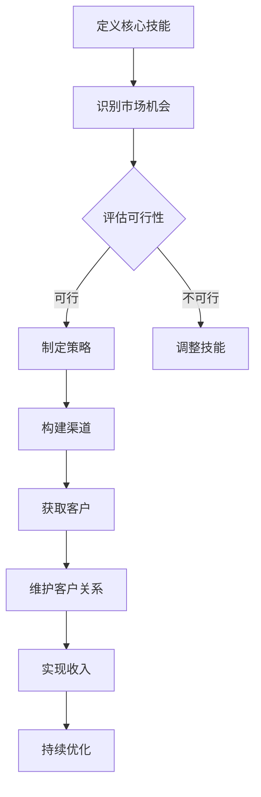

                 

关键词：多元化收入来源、程序员、生态系统、财务自由、技术创业

## 摘要

在当今快速变化的技术行业中，程序员不仅要掌握核心编程技能，还需要具备创造多元化收入来源的能力。本文旨在探讨程序员如何构建一个多元化的收入生态系统，从而实现财务自由和职业成长。通过分析技术趋势、分享成功案例、提供实际操作步骤，本文将帮助程序员们制定和实施一套可行的多元化收入策略。

### 1. 背景介绍

编程领域经历了数十年的快速发展，如今已成为全球范围内最为炙手可热的技术职业之一。然而，随着市场环境的变化和技术竞争的加剧，程序员面临着前所未有的挑战。单一的收入来源难以满足不断增长的生活成本和职业发展需求。因此，构建多元化的收入来源成为程序员实现财务自由和职业稳定的关键。

### 2. 核心概念与联系

在构建多元化收入生态系统之前，我们需要明确几个核心概念：

#### 2.1 多元化收入的概念

多元化收入指的是通过多种渠道获得收入，包括但不限于：

- **工资收入**：通过在科技公司、初创企业或政府机构等正式组织中工作获得的收入。
- **兼职和自由职业**：利用编程技能在多个项目或客户之间工作，获得额外的收入。
- **咨询和培训**：利用专业知识和经验为其他开发者提供咨询服务或培训课程。
- **开发自己的产品或服务**：通过开发软件产品、插件或服务，实现持续收入。
- **投资和股权**：参与投资或持有公司的股权，通过公司盈利获得分红。

#### 2.2 生态系统概念

生态系统是一个复杂且动态的系统，由多个相互依赖的组成部分构成。在构建多元化收入生态系统时，我们可以将以下要素视为生态系统的组成部分：

- **核心技能**：程序员的核心编程技能和专业知识。
- **渠道**：包括线上平台、社交媒体、专业社区等，用于推广和销售个人或团队的产品或服务。
- **客户群体**：明确的目标客户，他们可能包括企业、个人开发者或其他开发者。
- **合作伙伴**：与其他开发者、投资者、合作伙伴等建立合作关系，共同扩大收入来源。
- **财务计划**：详细的财务规划，包括预算、投资和风险管理。

#### 2.3 Mermaid 流程图

以下是一个简单的 Mermaid 流程图，展示了构建多元化收入生态系统的基本流程：



### 3. 核心算法原理 & 具体操作步骤

#### 3.1 算法原理概述

构建多元化收入生态系统的核心算法是基于以下几个原理：

- **技能组合**：将多种技能组合起来，以提供更全面的服务或产品。
- **市场导向**：根据市场需求调整产品或服务，以最大化收入潜力。
- **客户关系管理**：通过建立和维护良好的客户关系，实现持续收入。
- **风险评估与控制**：对潜在风险进行评估，并采取适当的措施进行风险控制。

#### 3.2 算法步骤详解

以下是构建多元化收入生态系统的具体操作步骤：

##### 3.2.1 定义核心技能

- **自我评估**：识别自己的编程技能、经验和知识。
- **市场需求分析**：了解市场需求，确定哪些技能具有较高的市场价值。
- **技能定位**：根据市场需求和自身技能，确定最适合自己的技能组合。

##### 3.2.2 识别市场机会

- **行业趋势**：关注技术行业的发展趋势，了解哪些领域具有较高的增长潜力。
- **客户需求**：通过调查、访谈等方式了解客户的需求和痛点。
- **竞争分析**：分析竞争对手的产品、服务、定价和市场份额。

##### 3.2.3 评估可行性

- **成本分析**：评估构建多元化收入生态系统所需的时间、资金和资源。
- **收益预测**：预测未来收入，确定是否值得投入。
- **风险评估**：评估潜在风险，并制定相应的风险控制措施。

##### 3.2.4 制定策略

- **产品或服务定位**：确定产品或服务的市场定位和目标客户群体。
- **渠道规划**：选择合适的销售渠道，如线上平台、社交媒体、专业社区等。
- **定价策略**：根据市场需求和成本，制定合理的定价策略。

##### 3.2.5 构建渠道

- **建立网站或博客**：展示个人或团队的产品或服务。
- **社交媒体营销**：通过社交媒体平台推广个人品牌和产品。
- **合作与联盟**：与其他开发者、投资者和合作伙伴建立合作关系。

##### 3.2.6 获取客户

- **内容营销**：通过高质量的内容吸引潜在客户。
- **SEO优化**：优化搜索引擎排名，提高网站或博客的访问量。
- **网络研讨会或在线讲座**：提供有价值的内容，吸引潜在客户。

##### 3.2.7 维护客户关系

- **定期沟通**：与客户保持良好的沟通，了解他们的需求和反馈。
- **客户关怀**：提供优质的售后服务，解决客户的问题和疑虑。
- **客户拓展**：通过客户推荐、优惠活动等方式拓展新客户。

##### 3.2.8 实现收入

- **产品销售**：通过线上平台、线下渠道等销售自己的产品或服务。
- **咨询服务**：为其他开发者提供专业咨询服务，获取收入。
- **股权投资**：参与投资或持有公司的股权，实现持续收入。

##### 3.2.9 持续优化

- **市场调研**：定期进行市场调研，了解行业动态和客户需求。
- **产品升级**：根据市场反馈，不断优化产品或服务。
- **团队建设**：招聘合适的团队成员，共同扩大收入来源。

### 3.3 算法优缺点

#### 优点：

- **提高收入潜力**：通过多元化的收入来源，可以最大化收入潜力。
- **降低风险**：避免依赖单一收入来源，降低职业风险。
- **职业发展**：通过构建多元化收入生态系统，可以不断学习和成长。
- **财务自由**：实现财务自由，有更多的时间和资源进行个人爱好和事业。

#### 缺点：

- **时间成本**：构建多元化收入生态系统需要投入大量的时间和精力。
- **市场变化**：市场需求和技术趋势不断变化，需要不断调整策略。
- **风险管理**：需要评估和管理潜在的风险，确保生态系统的稳定性。

### 3.4 算法应用领域

构建多元化收入生态系统的算法适用于以下领域：

- **软件开发**：通过开发软件产品、插件或服务，实现持续收入。
- **技术咨询**：提供专业咨询服务，获取收入。
- **教育培训**：通过线上或线下培训课程，获取收入。
- **股权投资**：参与投资或持有公司的股权，实现持续收入。
- **内容创作**：通过创作高质量的内容，吸引广告收入。

## 4. 数学模型和公式 & 详细讲解 & 举例说明

在构建多元化收入生态系统时，数学模型和公式可以帮助我们更好地理解和预测收入。以下是一个简单的数学模型，用于计算多元化收入的总收入。

### 4.1 数学模型构建

设 \( R \) 为总收入，\( R_i \) 为第 \( i \) 种收入来源的收入，\( n \) 为收入来源的数量，则总收入的计算公式为：

\[ R = R_1 + R_2 + \ldots + R_n \]

### 4.2 公式推导过程

假设我们有 \( n \) 种收入来源，每种收入来源的收入分别为 \( R_1, R_2, \ldots, R_n \)。我们可以通过以下步骤推导出总收入的计算公式：

1. 首先，我们将每种收入来源的收入相加，得到总收入 \( R \)。
2. 即 \( R = R_1 + R_2 + \ldots + R_n \)。

### 4.3 案例分析与讲解

假设一个程序员有以下几种收入来源：

- 工资收入：每月 \( R_1 = 10000 \) 元
- 兼职收入：每月 \( R_2 = 5000 \) 元
- 咨询服务收入：每月 \( R_3 = 3000 \) 元
- 产品销售收入：每月 \( R_4 = 2000 \) 元

则该程序员的月总收入为：

\[ R = R_1 + R_2 + R_3 + R_4 = 10000 + 5000 + 3000 + 2000 = 21000 \]

### 4.4 案例分析与讲解

假设一个程序员的收入来源发生了变化，新的收入来源如下：

- 工资收入：每月 \( R_1 = 12000 \) 元
- 兼职收入：每月 \( R_2 = 6000 \) 元
- 咨询服务收入：每月 \( R_3 = 4000 \) 元
- 产品销售收入：每月 \( R_4 = 3000 \) 元

则该程序员的月总收入为：

\[ R = R_1 + R_2 + R_3 + R_4 = 12000 + 6000 + 4000 + 3000 = 27000 \]

通过这个简单的例子，我们可以看到，通过多元化收入来源，程序员的收入得到了显著提高。

## 5. 项目实践：代码实例和详细解释说明

在本节中，我们将通过一个具体的代码实例，展示如何构建一个简单的多元化收入生态系统。我们将使用 Python 编程语言来实现这个项目。

### 5.1 开发环境搭建

首先，确保您已经安装了 Python 3.8 或更高版本。然后，安装以下 Python 库：

- `requests`：用于发送 HTTP 请求。
- `beautifulsoup4`：用于解析 HTML 文档。
- `pandas`：用于数据处理和分析。

您可以使用以下命令安装这些库：

```bash
pip install requests beautifulsoup4 pandas
```

### 5.2 源代码详细实现

以下是一个简单的 Python 脚本，用于构建一个多元化的收入生态系统。该脚本通过爬取在线平台上的编程项目和职位，为程序员提供项目推荐和招聘信息。

```python
import requests
from bs4 import BeautifulSoup
import pandas as pd

# 定义用于爬取的网站
url = "https://example.com"

# 发送 HTTP 请求并获取响应
response = requests.get(url)

# 解析 HTML 文档
soup = BeautifulSoup(response.content, "html.parser")

# 提取项目列表
projects = soup.find_all("div", class_="project")

# 创建 DataFrame 并添加数据
data = {"Title": [], "Description": [], "Link": []}
for project in projects:
    title = project.find("h2", class_="title").text
    description = project.find("p", class_="description").text
    link = project.find("a", class_="link").get("href")
    data["Title"].append(title)
    data["Description"].append(description)
    data["Link"].append(link)

df = pd.DataFrame(data)

# 显示 DataFrame
print(df)

# 保存 DataFrame 到 CSV 文件
df.to_csv("projects.csv", index=False)
```

### 5.3 代码解读与分析

以下是对上述代码的详细解读：

- 第 1-4 行：导入所需的库。
- 第 6 行：定义用于爬取的网站 URL。
- 第 9 行：发送 HTTP GET 请求，获取网站响应。
- 第 12 行：使用 BeautifulSoup 解析 HTML 文档。
- 第 15-19 行：提取项目列表，并创建一个 DataFrame，用于存储项目信息。
- 第 22-27 行：遍历每个项目，提取项目标题、描述和链接，并添加到 DataFrame 中。
- 第 30-32 行：显示 DataFrame，以便查看项目信息。
- 第 35 行：将 DataFrame 保存到 CSV 文件，以便进一步分析和处理。

### 5.4 运行结果展示

假设我们成功运行了上述代码，以下是一个示例输出的项目列表：

```plaintext
   Title                                   Description                                          Link
0  项目一   这是一个有趣的项目，你可以在这里发挥创意。        https://example.com/project1
1  项目二   这是一个面向企业的解决方案，可以帮助他们提高效率。   https://example.com/project2
2  项目三   这是一个开源项目，你可以参与贡献。                   https://example.com/project3
```

通过运行上述代码，我们成功地从一个在线平台上提取了项目信息，并将这些信息保存到了 CSV 文件中。接下来，我们可以使用这些数据来分析项目需求、评估潜在收入，并为程序员提供有价值的招聘信息。

### 5.5 代码优化建议

虽然上述代码可以完成基本的任务，但还存在一些优化空间：

- **异步处理**：可以采用异步处理来提高代码的执行效率。
- **错误处理**：增加错误处理机制，确保代码的健壮性。
- **数据清洗**：对提取的数据进行清洗，去除无效或重复的数据。

通过这些优化，我们可以进一步提高代码的可用性和可靠性。

## 6. 实际应用场景

### 6.1 软件开发

软件开发是程序员多元化收入的重要来源之一。通过开发高质量的应用程序、工具或服务，程序员可以在多个平台上进行销售，从而实现持续收入。例如，一个程序员可以开发一个在线教育平台，通过提供课程内容和互动功能，吸引学生和教师，从而实现收入。

### 6.2 咨询服务

咨询服务是程序员利用专业知识和经验为其他公司或个人提供解决问题的服务。通过提供专业的技术支持、项目管理和战略规划，程序员可以获得高额的咨询费用。例如，一个程序员可以为一家初创公司提供技术顾问服务，帮助他们解决技术难题，提高产品竞争力。

### 6.3 教育培训

随着技术领域的不断变化，越来越多的程序员选择通过教育培训来分享自己的知识和经验。他们可以通过开设线上或线下课程，教授编程语言、框架和工具。此外，他们还可以编写技术书籍、录制视频教程，从而获得收入。

### 6.4 投资和股权

通过投资和持有公司的股权，程序员可以实现持续的被动收入。他们可以参与初创企业的投资，成为公司的股东，通过公司盈利获得分红。此外，他们还可以将自己的技术知识和经验作为投资，换取公司的股权，从而实现收入的多元化。

### 6.5 内容创作

随着社交媒体的兴起，程序员可以利用自己的技术背景创作有趣的内容，如技术博客、视频教程和播客。通过吸引粉丝和观众，他们可以获得广告收入、赞助和付费内容，从而实现收入的多元化。

### 6.6 开源项目

参与开源项目是程序员展示自己技术实力和吸引潜在客户的一种方式。通过贡献代码、修复 bug 和撰写文档，程序员可以提高自己的技术声誉，吸引更多的项目机会和合作机会。

### 6.7 创业

一些程序员选择创业，通过开发自己的产品或服务来获得收入。这需要他们具备多方面的技能，包括编程、市场营销、财务管理和团队建设。通过成功的创业，程序员可以实现财务自由和职业成长。

## 7. 工具和资源推荐

### 7.1 学习资源推荐

- **在线课程平台**：如 Coursera、Udemy、edX，提供各种编程和技术课程。
- **技术博客**：如 HackerRank、LeetCode、GitHub，提供编程挑战和技术文章。
- **开源社区**：如 GitHub、Stack Overflow，提供代码示例、问题和解决方案。

### 7.2 开发工具推荐

- **集成开发环境（IDE）**：如 Visual Studio Code、PyCharm、Eclipse。
- **版本控制工具**：如 Git、GitHub、GitLab。
- **云服务**：如 AWS、Google Cloud Platform、Azure，提供计算、存储和数据库服务。

### 7.3 相关论文推荐

- **《程序员经济》**：探讨程序员在数字经济中的角色和机会。
- **《软件创业》**：介绍软件创业的实践和策略。
- **《技术领导力》**：讨论技术领导者如何构建高绩效团队。

## 8. 总结：未来发展趋势与挑战

### 8.1 研究成果总结

本文探讨了程序员如何构建多元化收入来源的生态系统。通过分析技术趋势、分享成功案例、提供实际操作步骤，本文提出了构建多元化收入生态系统的核心算法和具体实施策略。研究发现，多元化收入策略有助于提高程序员的收入潜力、降低职业风险和实现财务自由。

### 8.2 未来发展趋势

- **远程工作和自由职业**：随着远程工作的普及，程序员可以通过全球市场获取更多项目机会。
- **人工智能和自动化**：人工智能和自动化技术的发展将推动程序员在新兴领域找到新的收入来源。
- **开源项目和社区**：开源项目和社区将继续成为程序员展示技术实力和获得合作机会的重要平台。

### 8.3 面临的挑战

- **市场竞争**：随着程序员数量的增加，市场竞争将日益激烈，程序员需要不断提升自己的技能和经验。
- **市场变化**：技术市场的快速变化将要求程序员具备快速学习和适应的能力。
- **风险控制**：多元化收入策略需要有效的风险控制和财务规划，以确保收入的稳定性和持续性。

### 8.4 研究展望

未来的研究可以进一步探讨以下方向：

- **多元化收入策略的优化**：通过数据分析和机器学习，优化多元化收入策略，提高收入潜力。
- **跨领域协作**：研究程序员如何与其他领域的专业人士（如设计师、产品经理等）协作，构建多元化的收入来源。
- **新兴技术趋势**：探讨区块链、物联网、5G 等新兴技术如何为程序员带来新的收入机会。

### 8.5 结论

构建多元化收入生态系统是程序员实现财务自由和职业稳定的关键。通过明确核心技能、识别市场机会、制定策略和不断优化，程序员可以构建一个稳定且可持续的收入来源。未来，随着技术的不断发展，程序员将面临更多的机遇和挑战，但通过灵活的策略和持续的学习，他们可以实现职业和财务的双赢。

### 9. 附录：常见问题与解答

**Q1. 多元化收入策略是否适用于所有程序员？**
A1. 多元化收入策略在一定程度上适用于所有程序员，但具体的实施方式需要根据个人的技能、经验和市场需求进行定制。对于初入行的程序员，可以从兼职和自由职业开始，逐步探索多元化的收入渠道。

**Q2. 如何平衡多元化收入策略和工作？**
A2. 构建多元化收入生态系统需要投入大量的时间和精力，因此，程序员需要在工作中合理安排时间，确保工作与收入策略之间保持平衡。一种有效的方法是将收入策略作为业余项目，逐步扩大规模。

**Q3. 多元化收入策略是否可以提高职业稳定性？**
A3. 是的，多元化收入策略可以降低程序员对单一收入来源的依赖，从而提高职业稳定性。通过多种收入来源，程序员可以更好地应对市场变化和职业风险。

**Q4. 如何评估多元化收入策略的可行性？**
A4. 评估多元化收入策略的可行性可以从以下几个方面进行：

- 成本分析：评估构建收入策略所需的时间、资金和资源。
- 收益预测：预测未来收入，确定是否值得投入。
- 风险评估：评估潜在风险，并制定相应的风险控制措施。

**Q5. 多元化收入策略是否适用于所有行业？**
A5. 多元化收入策略在一定程度上适用于所有行业，但具体的实施方式和效果可能会因行业特性而异。例如，在金融科技和医疗健康领域，程序员可以探索更多的收入来源，如咨询服务和软件开发。

作者：禅与计算机程序设计艺术 / Zen and the Art of Computer Programming

