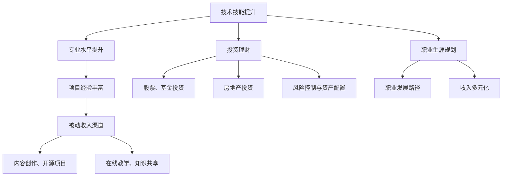

                 

关键词：（程序员收入结构、多元化收入、被动收入、技术技能提升、投资理财、职业生涯规划）

摘要：在当今科技飞速发展的时代，程序员作为一个高需求的职业群体，面临着收入结构多元化的需求。本文将探讨程序员如何通过提升技术技能、开拓被动收入渠道、进行投资理财以及制定合理的职业生涯规划，来实现收入结构的多元化，从而提升自身的职业竞争力和生活质量。

## 1. 背景介绍

随着信息技术的不断进步，程序员这一职业已经成为现代社会中不可或缺的一部分。然而，尽管程序员的技能和贡献在不断提升，但许多程序员仍然面临着收入单一的问题。传统的工作模式使得程序员的收入主要依赖于雇主提供的薪资，这种模式在带来稳定性的同时，也带来了较大的职业风险。一旦就业市场发生变化或个人技能无法跟上技术进步，程序员的收入和职业前景可能会受到严重影响。

因此，构建多元化的收入结构对于程序员来说尤为重要。这不仅有助于提升个人的财务稳定性，还可以增加职业发展的机会和抗风险能力。本文将围绕以下几个核心方面展开讨论：

1. **技术技能提升**：程序员如何通过不断学习和实践，提升自身的技术能力和专业水平。
2. **被动收入渠道**：程序员如何通过编写开源项目、创作技术文章、在线教学等方式，获得被动收入。
3. **投资理财**：程序员如何通过投资股票、基金、房地产等资产，实现财富的保值增值。
4. **职业生涯规划**：程序员如何制定长远的职业规划，以实现个人职业发展和收入的多元化。

## 2. 核心概念与联系

在探讨如何构建多元化的收入结构之前，我们需要明确几个核心概念，包括技术技能、被动收入、投资理财和职业生涯规划。以下是一个使用Mermaid绘制的流程图，展示这些核心概念之间的联系。



### 2.1 技术技能提升

技术技能提升是程序员实现收入结构多元化的基础。通过不断学习和实践，程序员可以提升自身的专业水平，积累丰富的项目经验。这不仅有助于提高在现有岗位上的竞争力，也为开拓新的收入渠道奠定了基础。

### 2.2 被动收入渠道

被动收入渠道是程序员实现收入多元化的重要途径。通过编写开源项目、创作技术文章、在线教学等方式，程序员可以在工作之余持续获得收入。这些渠道不仅能够为程序员提供额外的经济支持，还能增加其在技术社区的影响力和知名度。

### 2.3 投资理财

投资理财是程序员实现财富增值的重要手段。通过投资股票、基金、房地产等资产，程序员可以将闲置的资金转化为收入来源，实现财富的保值增值。同时，合理的风险控制和资产配置也是投资理财过程中不可或缺的环节。

### 2.4 职业生涯规划

职业生涯规划是程序员实现收入多元化的关键。通过制定长远的职业规划，程序员可以明确自身的职业发展路径，不断积累经验和技能，实现收入的多元化。同时，合理的职业规划也有助于程序员在面对职业挑战时保持稳定和自信。

## 3. 核心算法原理 & 具体操作步骤

### 3.1 算法原理概述

在构建多元化的收入结构中，算法原理可以概括为以下几个方面：

1. **技能提升算法**：通过持续学习和实践，提升技术技能和专业水平。
2. **被动收入算法**：通过开源项目、技术文章、在线教学等渠道，实现收入的自动化获取。
3. **投资理财算法**：通过股票、基金、房地产等投资方式，实现财富的增值。
4. **职业生涯规划算法**：通过制定长远的职业规划，实现职业发展的可持续性和收入的多元化。

### 3.2 算法步骤详解

#### 技能提升算法

1. **确定学习目标**：根据职业规划和技术发展方向，确定需要掌握的核心技能。
2. **学习资源整合**：通过在线课程、技术书籍、开源项目等方式，获取学习资源。
3. **实践应用**：将所学技能应用于实际项目中，积累经验。
4. **持续迭代**：通过反思和实践，不断提升技能水平。

#### 被动收入算法

1. **内容创作**：撰写高质量的技术文章，分享自己的知识和经验。
2. **开源项目**：参与开源项目，为社区贡献代码。
3. **在线教学**：开设在线课程，教授他人技术知识。
4. **推广和营销**：通过社交媒体、博客等渠道，推广自己的内容和服务。

#### 投资理财算法

1. **市场分析**：研究市场趋势，了解投资产品的特点。
2. **风险评估**：评估投资产品的风险，制定合理的投资策略。
3. **资产配置**：根据个人风险承受能力和投资目标，进行资产配置。
4. **持续监控**：定期评估投资组合的表现，进行必要的调整。

#### 职业生涯规划算法

1. **自我评估**：分析自己的优势和不足，明确职业发展方向。
2. **职业目标设定**：设定明确的职业目标，制定实现目标的计划。
3. **持续学习和成长**：通过学习和实践，不断提升自己的能力和竞争力。
4. **反馈和调整**：定期评估职业规划的执行情况，根据反馈进行调整。

### 3.3 算法优缺点

#### 技能提升算法

**优点**：能够不断提升自身的技术能力和专业水平，增强职业竞争力。

**缺点**：学习过程需要持续投入时间和精力，短期内难以见到明显效果。

#### 被动收入算法

**优点**：能够实现收入的自动化获取，提高时间的利用效率。

**缺点**：需要前期投入大量的时间和精力进行内容创作和推广。

#### 投资理财算法

**优点**：能够实现财富的保值增值，提高财务稳定性。

**缺点**：存在投资风险，需要具备一定的市场分析和风险评估能力。

#### 职业生涯规划算法

**优点**：能够明确职业发展路径，提高职业发展的可持续性和稳定性。

**缺点**：需要长期坚持和不断调整，对个人的自律能力要求较高。

### 3.4 算法应用领域

这些算法可以广泛应用于程序员的职业发展过程中，帮助程序员实现收入结构的多元化。例如：

1. **个人技能提升**：通过技能提升算法，程序员可以在现有岗位上获得晋升机会，提高薪资待遇。
2. **被动收入**：通过被动收入算法，程序员可以在工作之余获得额外收入，提高财务稳定性。
3. **投资理财**：通过投资理财算法，程序员可以将闲置的资金转化为收入来源，实现财富的增值。
4. **职业生涯规划**：通过职业生涯规划算法，程序员可以明确职业发展路径，实现职业的可持续发展和收入的多元化。

## 4. 数学模型和公式 & 详细讲解 & 举例说明

在构建多元化收入结构的过程中，数学模型和公式可以用于量化分析各收入渠道的贡献，帮助程序员做出更加科学的决策。以下是一个简单的数学模型，用于计算程序员的多元化收入。

### 4.1 数学模型构建

假设程序员每月的固定薪资为 \( P \)，通过以下收入渠道获得额外的被动收入和投资收益：

- **被动收入**：每月从开源项目、技术文章和在线教学等渠道获得的收入为 \( R_1 \)。
- **投资收益**：每月通过股票、基金和房地产等投资获得的收益为 \( R_2 \)。

那么，程序员的月总收入 \( T \) 可以表示为：

\[ T = P + R_1 + R_2 \]

### 4.2 公式推导过程

首先，我们考虑被动收入的计算。假设程序员每月从开源项目获得的收入为 \( R_{1a} \)，从技术文章和在线教学获得的收入为 \( R_{1b} \)，则有：

\[ R_1 = R_{1a} + R_{1b} \]

其中，\( R_{1a} \) 和 \( R_{1b} \) 可以通过以下公式计算：

\[ R_{1a} = \frac{E_a}{T_a} \times T \]
\[ R_{1b} = \frac{E_b}{T_b} \times T \]

其中，\( E_a \) 和 \( E_b \) 分别为程序员在开源项目和技术文章上的投入时间，\( T_a \) 和 \( T_b \) 分别为每月的工作时间和空闲时间。

接下来，我们考虑投资收益的计算。假设程序员每月的投资收益率为 \( r \)，初始投资金额为 \( I \)，则有：

\[ R_2 = r \times I \]

### 4.3 案例分析与讲解

假设程序员小张的情况如下：

- 每月固定薪资 \( P \) 为 20,000元。
- 小张每月从开源项目和技术文章获得的被动收入分别为 \( R_{1a} \) 和 \( R_{1b} \)。
- 小张每月的投资收益率为 \( r \)，初始投资金额为 100,000元。

根据上述公式，我们可以计算出小张的月总收入 \( T \)：

\[ T = P + R_1 + R_2 \]

为了简化计算，我们假设小张每月在开源项目和技术文章上的投入时间分别为 20小时和10小时，每月工作时间和空闲时间分别为 160小时和240小时。此外，假设开源项目和技术文章的报酬率分别为 0.5元/小时和 1元/小时。

代入公式，我们可以计算出小张的被动收入：

\[ R_{1a} = \frac{0.5}{20} \times 20,000 = 500 \text{元} \]
\[ R_{1b} = \frac{1}{10} \times 20,000 = 2,000 \text{元} \]
\[ R_1 = R_{1a} + R_{1b} = 500 + 2,000 = 2,500 \text{元} \]

假设小张的投资收益率为 5%，则其月投资收益为：

\[ R_2 = 0.05 \times 100,000 = 5,000 \text{元} \]

代入总收入的公式，我们得到小张的月总收入为：

\[ T = 20,000 + 2,500 + 5,000 = 27,500 \text{元} \]

通过这个简单的案例，我们可以看到，通过多元化的收入结构，程序员可以在保证稳定薪资的基础上，通过被动收入和投资收益，实现更高的总收入。

## 5. 项目实践：代码实例和详细解释说明

为了更好地理解如何通过开源项目、技术文章和在线教学等渠道实现被动收入，我们将通过一个具体的案例来展示整个开发过程，并提供详细的代码实现和解释。

### 5.1 开发环境搭建

在这个案例中，我们将使用Python语言编写一个简单的博客网站，并通过GitHub托管代码，利用GitHub Pages部署网站。以下是在本地环境搭建开发环境的基本步骤：

1. **安装Python**：前往Python官方网站下载并安装Python，确保安装过程中选择添加到系统环境变量中。
2. **安装虚拟环境**：在命令行中运行 `pip install virtualenv`，安装虚拟环境工具。
3. **创建虚拟环境**：在命令行中运行 `virtualenv myblogenv` 创建虚拟环境。
4. **激活虚拟环境**：在命令行中运行 `source myblogenv/bin/activate` 激活虚拟环境。
5. **安装Flask**：在虚拟环境中运行 `pip install flask` 安装Flask框架。

### 5.2 源代码详细实现

在虚拟环境中，我们将使用Flask框架快速搭建一个简单的博客网站。以下是关键代码实现：

```python
# app.py

from flask import Flask, render_template, request, redirect, url_for

app = Flask(__name__)

# 存储博客文章列表
articles = [
    {'title': '第一篇博客', 'content': '这是我的第一篇博客文章。'},
    {'title': '第二篇博客', 'content': '这是我的第二篇博客文章。'},
]

@app.route('/')
def index():
    return render_template('index.html', articles=articles)

@app.route('/article/<int:article_id>')
def article(article_id):
    article = articles[article_id - 1]
    return render_template('article.html', article=article)

@app.route('/new', methods=['GET', 'POST'])
def new_article():
    if request.method == 'POST':
        title = request.form['title']
        content = request.form['content']
        articles.append({'title': title, 'content': content})
        return redirect(url_for('index'))
    return render_template('new_article.html')

if __name__ == '__main__':
    app.run(debug=True)
```

#### 5.2.1 HTML模板

在项目的根目录下，我们创建一个名为 `templates` 的文件夹，并在其中添加HTML模板文件：

`index.html`：

```html
<!DOCTYPE html>
<html lang="en">
<head>
    <meta charset="UTF-8">
    <meta http-equiv="X-UA-Compatible" content="IE=edge">
    <meta name="viewport" content="width=device-width, initial-scale=1.0">
    <title>我的博客</title>
</head>
<body>
    <h1>我的博客</h1>
    <ul>
        
            <li><a href="{{ url_for('article', article_id=loop.index) }}">{{ article.title }}</a></li>
        
    </ul>
    <a href="{{ url_for('new_article') }}">写一篇新博客</a>
</body>
</html>
```

`article.html`：

```html
<!DOCTYPE html>
<html lang="en">
<head>
    <meta charset="UTF-8">
    <meta http-equiv="X-UA-Compatible" content="IE=edge">
    <meta name="viewport" content="width=device-width, initial-scale=1.0">
    <title>{{ article.title }}</title>
</head>
<body>
    <h1>{{ article.title }}</h1>
    <p>{{ article.content }}</p>
    <a href="{{ url_for('index') }}">回到首页</a>
</body>
</html>
```

`new_article.html`：

```html
<!DOCTYPE html>
<html lang="en">
<head>
    <meta charset="UTF-8">
    <meta http-equiv="X-UA-Compatible" content="IE=edge">
    <meta name="viewport" content="width=device-width, initial-scale=1.0">
    <title>写一篇新博客</title>
</head>
<body>
    <h1>写一篇新博客</h1>
    <form method="POST">
        <label for="title">标题：</label>
        <input type="text" id="title" name="title" required>
        <br>
        <label for="content">内容：</label>
        <textarea id="content" name="content" required></textarea>
        <br>
        <input type="submit" value="发布">
    </form>
</body>
</html>
```

#### 5.2.2 代码解读与分析

- **app.py**：这是博客网站的主程序，使用Flask框架定义了网站的各个端点（routes）和处理函数（functions）。
- **index.html**：这是网站的首页模板，展示了所有博客文章的标题，并提供“写一篇新博客”的链接。
- **article.html**：这是单个博客文章的模板，根据文章的ID展示文章的标题和内容。
- **new_article.html**：这是用于添加新博客文章的表单模板。

### 5.3 运行结果展示

1. **本地运行**：在虚拟环境中运行 `python app.py`，浏览器访问 `http://127.0.0.1:5000/`，可以看到网站的首页和博客列表。

2. **GitHub Pages部署**：将代码上传到GitHub仓库，并配置GitHub Pages，浏览器访问仓库的根域名，例如 `https://<你的GitHub用户名>.github.io/`，可以看到部署后的博客网站。

通过这个简单的项目实践，程序员可以学习如何使用Flask框架搭建网站，并通过GitHub Pages进行部署。这不仅可以作为个人博客，还可以通过广告收入、赞助和课程销售等方式，实现被动收入。

## 6. 实际应用场景

### 6.1 技术文章创作

程序员通过在技术博客、论坛和社交媒体上撰写高质量的技术文章，分享自己的经验和见解，可以吸引读者的关注。这些文章不仅有助于提升个人品牌，还可以通过广告收入、赞助和付费内容等方式，带来额外的被动收入。

例如，程序员张三在GitHub上创建了一个名为“技术笔记”的博客，定期发布关于Python编程和人工智能的文章。通过在文章中插入Google AdSense广告，他在几个月内就积累了可观的广告收入。此外，他还推出了一些付费内容，如高级编程课程，每月通过销售课程获得了数千元的收入。

### 6.2 开源项目贡献

参与开源项目是程序员实现多元化收入的重要途径。程序员通过为开源项目贡献代码，不仅可以提升自己的技能，还可以在社区中获得声誉。一些开源项目允许开发者通过捐赠、赞助和付费插件等方式获得收入。

例如，程序员李四是一位React框架的贡献者。他在业余时间为React社区编写了一些高质量的插件，这些插件受到了广泛欢迎。通过在GitHub上设置捐赠按钮，他每月从捐赠中获得了数百美元的收入。此外，他还通过销售插件许可证和提供定制开发服务，进一步增加了收入。

### 6.3 在线教学

在线教学是程序员实现被动收入的有效方式。程序员可以通过开设在线课程，教授编程语言、框架和技术，从而获得收入。一些在线教育平台，如Coursera、Udemy和LinkedIn Learning，提供了方便的课程发布和销售工具。

例如，程序员王五是一位经验丰富的全栈开发工程师。他在Udemy上开设了一系列关于Web开发和React.js的课程。这些课程不仅受到了广泛欢迎，还为他带来了每月数千美元的收入。此外，他还通过直播和一对一辅导，为学员提供更个性化的教学服务。

### 6.4 投资理财

投资理财是程序员实现财富增值的重要手段。程序员可以将部分闲置资金投资于股票、基金、房地产等资产，通过市场的波动获得收益。

例如，程序员赵六通过研究市场趋势和财务报表，投资于一些具有潜力的科技公司。他在过去几年里，通过股票投资获得了数倍的收益。此外，他还通过定期购买指数基金，实现了资产的稳健增长。这些投资收益为他的财务自由提供了坚实的基础。

## 7. 未来应用展望

随着技术的不断进步，程序员构建多元化收入结构的应用场景将更加丰富。以下是一些未来发展趋势：

### 7.1 人工智能与编程教育的结合

人工智能技术的发展为编程教育带来了新的机遇。未来，程序员可以通过开发智能编程助手、代码生成工具和在线编程教育平台，实现收入的多元化。这些工具和平台不仅可以帮助学习者更高效地学习编程，还可以通过广告收入和课程销售，为开发者带来持续的收入来源。

### 7.2 区块链技术的应用

区块链技术的兴起为程序员提供了新的收入渠道。通过开发智能合约、去中心化应用（DApps）和区块链游戏，程序员可以在区块链领域获得丰厚的收入。未来，随着区块链技术的普及和应用场景的扩大，程序员在这一领域的收入潜力将更加巨大。

### 7.3 在线服务的多元化

随着远程工作和远程办公的普及，程序员可以通过提供在线服务，如远程技术支持、代码审查和项目咨询，实现收入的多元化。此外，随着物联网和智能家居的发展，程序员还可以通过开发智能家居应用、智能设备和物联网平台，为用户带来便利，并从中获得收入。

### 7.4 个性化定制服务

未来，程序员可以更加专注于个性化定制服务，如定制开发、技术顾问和专项培训。这些服务可以根据客户的具体需求进行定制，提供更高价值的解决方案，从而实现更高的收入。

## 8. 总结：未来发展趋势与挑战

### 8.1 研究成果总结

本文从技术技能提升、被动收入渠道、投资理财和职业生涯规划四个方面，探讨了程序员如何构建多元化的收入结构。通过技能提升，程序员可以增强职业竞争力；通过被动收入和投资理财，程序员可以实现财富的保值增值；通过职业生涯规划，程序员可以明确职业发展方向，实现收入的多元化。

### 8.2 未来发展趋势

随着科技的不断进步，程序员构建多元化收入结构的应用场景将更加丰富。人工智能、区块链技术、在线服务和个性化定制服务等领域，将为程序员提供更多实现收入多元化的机会。

### 8.3 面临的挑战

尽管多元化收入结构为程序员提供了更多的机会，但也面临一些挑战。例如，技术技能的不断更新要求程序员持续学习和适应；被动收入渠道的开拓需要时间和精力的投入；投资理财需要具备一定的市场分析和风险评估能力。此外，面对职业发展的不确定性，程序员需要具备更强的心理承受能力和应变能力。

### 8.4 研究展望

未来，对程序员多元化收入结构的研究可以从以下几个方面展开：

1. **技术创新与应用**：探讨新技术在构建多元化收入结构中的应用，如人工智能、区块链等。
2. **案例分析**：对成功实现收入多元化的程序员的案例进行深入研究，总结其成功经验。
3. **风险评估**：研究如何在构建多元化收入结构时，有效控制风险，确保财务稳定。
4. **教育培训**：探讨如何通过教育培训，提升程序员的技能和职业素养，为其实现多元化收入提供支持。

## 9. 附录：常见问题与解答

### 9.1 如何在开源项目中获得收入？

1. **捐赠**：在GitHub等开源平台设置捐赠按钮，接受社区的捐赠。
2. **赞助**：寻找赞助商，为其项目提供支持。
3. **付费插件**：开发高质量的付费插件，为用户提供额外功能。
4. **定制开发**：为有特定需求的用户，提供定制化开发服务。

### 9.2 如何进行投资理财？

1. **学习基础知识**：了解股票、基金、房地产等投资产品的基本知识。
2. **市场分析**：研究市场趋势，分析投资产品的潜力。
3. **风险评估**：评估投资产品的风险，制定合理的投资策略。
4. **资产配置**：根据个人风险承受能力和投资目标，进行资产配置。
5. **持续监控**：定期评估投资组合的表现，进行必要的调整。

### 9.3 如何进行职业生涯规划？

1. **自我评估**：分析自己的优势和不足，明确职业发展方向。
2. **设定目标**：设定明确的职业目标，制定实现目标的计划。
3. **持续学习**：通过学习和实践，不断提升自己的能力和竞争力。
4. **反馈与调整**：定期评估职业规划的执行情况，根据反馈进行调整。

## 作者署名

作者：禅与计算机程序设计艺术 / Zen and the Art of Computer Programming

