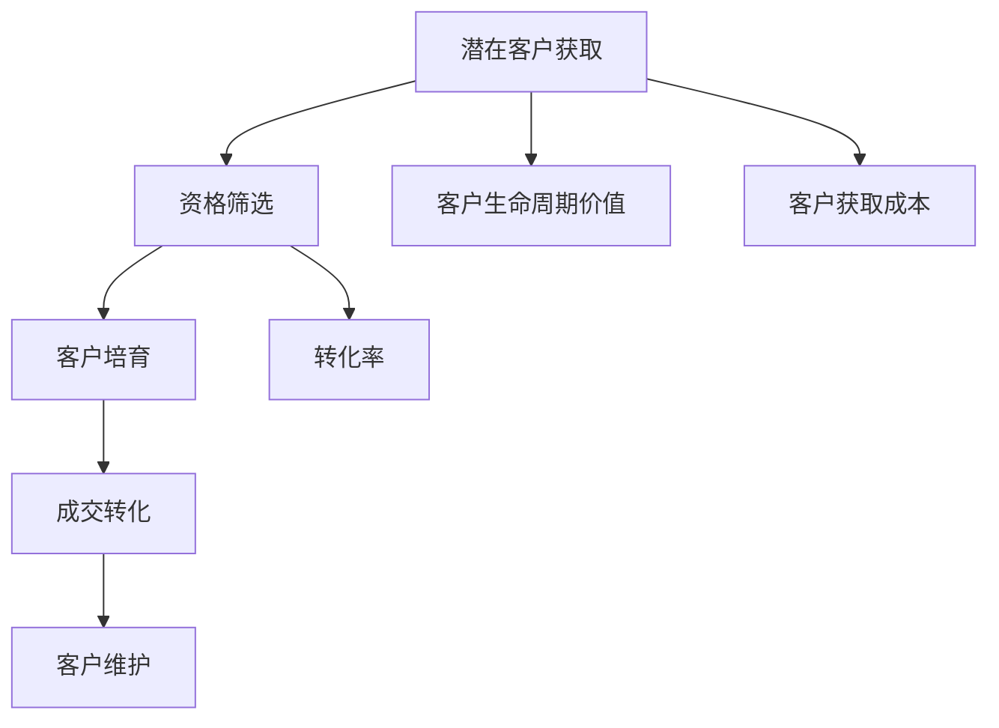

                 

 关键词：销售漏斗、转化率、客户管理、营销策略、数据分析、技术实施、用户互动

> 摘要：本文将探讨程序员如何运用技术手段构建高转化率的销售漏斗。通过深入分析销售漏斗的关键要素、核心算法原理以及数学模型，我们将提供一套系统的技术解决方案，帮助程序员在销售过程中实现高效转化。

## 1. 背景介绍

在当今的商业环境中，销售漏斗（Sales Funnel）是营销和销售管理中不可或缺的工具。它通过量化客户从接触品牌到完成购买的全过程，帮助企业了解市场反应和客户行为，进而优化营销策略，提升销售额。而在这个过程中，程序员的角色越来越重要，他们不仅是技术实施者，更是销售漏斗构建的核心推动者。

高转化率的销售漏斗能够帮助企业在激烈的市场竞争中脱颖而出。然而，构建一个高效的漏斗并非易事，它需要深入理解客户行为、市场动态以及技术实现。本文将围绕这三个核心维度展开，为程序员提供一套构建高转化率销售漏斗的技术指南。

## 2. 核心概念与联系

### 2.1 销售漏斗的基本概念

销售漏斗是一个表示客户从接触到最终购买过程的模型，通常包括以下几个阶段：

1. **潜在客户获取**（Lead Generation）：通过各种渠道吸引潜在客户。
2. **资格筛选**（Qualification）：对潜在客户进行筛选，识别那些有购买意愿和购买力的客户。
3. **客户培育**（Nurturing）：通过提供有价值的内容和个性化服务，增强客户的购买意愿。
4. **成交转化**（Conversion）：促成客户完成购买。
5. **客户维护**（Retention）：保持客户忠诚度，增加复购率。

### 2.2 关键概念联系

为了构建一个高效的销售漏斗，程序员需要理解以下几个关键概念之间的联系：

- **客户生命周期价值（CLV）**：预测客户在其生命周期内为公司带来的总收益。
- **客户获取成本（CAC）**：获取一个客户所需的平均成本。
- **转化率**：每个阶段的客户转化比例。

通过Mermaid流程图，我们可以直观地展示这些概念之间的联系：



### 2.3 销售漏斗的构建步骤

构建一个高效的漏斗通常包括以下步骤：

1. **明确目标**：确定企业希望通过销售漏斗实现的业务目标。
2. **数据收集**：收集客户行为数据，包括访问、互动和购买等。
3. **漏斗建模**：根据数据构建漏斗模型，识别关键节点和瓶颈。
4. **优化策略**：通过数据分析，识别并优化每个阶段的策略。
5. **实施监控**：实时监控漏斗运行情况，及时调整策略。

接下来，我们将详细讨论这些核心概念和联系，帮助程序员深入理解并构建高转化率的销售漏斗。

## 3. 核心算法原理 & 具体操作步骤

### 3.1 算法原理概述

构建高转化率销售漏斗的核心在于理解并优化每个阶段的转化率。这涉及到多种算法和技术，如机器学习、数据分析、客户细分等。以下是一些关键的算法原理：

- **客户细分**：通过数据分析，将客户分为不同的群体，针对每个群体制定个性化的营销策略。
- **预测模型**：利用机器学习算法，预测哪些潜在客户最有可能转化为实际购买。
- **A/B测试**：通过对比不同策略的效果，选择最优的营销方式。
- **用户行为分析**：利用数据分析技术，深入理解客户的行为模式，优化用户体验。

### 3.2 算法步骤详解

#### 3.2.1 客户细分

1. **数据收集**：收集客户的各类数据，如 demographics（人口统计信息）、行为数据（访问、点击、购买等）。
2. **特征提取**：从原始数据中提取有用的特征，如年龄、性别、购买历史等。
3. **模型训练**：使用机器学习算法，如聚类算法（如K-means）或决策树，对特征进行分类，生成客户细分模型。
4. **模型评估**：通过交叉验证等方法评估模型效果，调整参数以提高准确性。

#### 3.2.2 预测模型

1. **数据准备**：收集历史销售数据，包括购买金额、购买时间、客户特征等。
2. **特征工程**：对数据进行预处理，提取有用的特征，如最近一次购买时间、购买频率等。
3. **模型选择**：选择合适的预测模型，如线性回归、逻辑回归或随机森林等。
4. **模型训练与评估**：使用训练集训练模型，使用验证集进行评估，调整模型参数以优化预测效果。

#### 3.2.3 A/B测试

1. **定义假设**：明确要测试的变量，如页面布局、促销策略等。
2. **分组分配**：将用户随机分为两组，一组使用原始策略，另一组使用新策略。
3. **数据收集**：收集两组用户的交互数据，如点击率、转化率等。
4. **结果分析**：对比两组数据，确定哪种策略更有效，并据此进行调整。

#### 3.2.4 用户行为分析

1. **数据收集**：使用数据分析工具（如Google Analytics）收集用户行为数据。
2. **行为模式识别**：通过分析数据，识别用户的行为模式，如访问路径、停留时间等。
3. **优化策略**：根据用户行为模式，优化网站布局、内容推荐等，以提高用户体验和转化率。

### 3.3 算法优缺点

- **客户细分**：优点是可以针对不同客户群体制定个性化策略，提高转化率；缺点是需要大量的数据支持，且模型构建和调整复杂。
- **预测模型**：优点是可以预测潜在客户的购买概率，提前采取措施；缺点是需要准确的预测模型和大量的历史数据。
- **A/B测试**：优点是简单易行，可以快速验证新策略的有效性；缺点是可能需要大量时间和资源。
- **用户行为分析**：优点是可以通过分析用户行为，优化网站和产品，提高用户体验；缺点是需要专业的数据分析技能。

### 3.4 算法应用领域

这些算法和技术可以广泛应用于电子商务、在线营销、金融科技等领域。例如，电子商务网站可以通过客户细分和预测模型，提高广告投放效率和转化率；在线营销平台可以通过A/B测试，优化页面布局和用户互动，提高用户留存率；金融科技公司可以通过用户行为分析，识别欺诈行为，提高交易安全性。

## 4. 数学模型和公式 & 详细讲解 & 举例说明

### 4.1 数学模型构建

构建销售漏斗的数学模型需要考虑多个变量和参数，包括客户获取成本（CAC）、客户生命周期价值（CLV）、转化率（Conversion Rate）等。以下是一个简单的数学模型：

\[ 
\text{ROI} = \frac{\text{CLV} - \text{CAC}}{\text{CAC}} 
\]

其中，ROI（Return on Investment）表示投资回报率，CLV（Customer Lifetime Value）表示客户生命周期价值，CAC（Customer Acquisition Cost）表示客户获取成本。

### 4.2 公式推导过程

1. **计算客户获取成本（CAC）**：

\[ 
\text{CAC} = \frac{\text{营销成本}}{\text{新客户数量}} 
\]

2. **计算客户生命周期价值（CLV）**：

\[ 
\text{CLV} = \text{平均订单价值} \times \text{购买频率} \times \text{客户生命周期} 
\]

3. **计算转化率**：

\[ 
\text{转化率} = \frac{\text{成交客户数量}}{\text{潜在客户数量}} 
\]

### 4.3 案例分析与讲解

假设一家电子商务公司的营销成本为100万元，吸引到1000名新客户，平均订单价值为500元，购买频率为每月一次，客户生命周期为2年。根据以上数据，我们可以计算出：

- **客户获取成本（CAC）**：

\[ 
\text{CAC} = \frac{1000000}{1000} = 1000 \text{元} 
\]

- **客户生命周期价值（CLV）**：

\[ 
\text{CLV} = 500 \times 1 \times 2 = 1000 \text{元} 
\]

- **转化率**：

\[ 
\text{转化率} = \frac{1000}{1000} = 100\% 
\]

- **ROI**：

\[ 
\text{ROI} = \frac{1000 - 1000}{1000} = 0 
\]

从计算结果可以看出，该公司的ROI为0，说明其投资回报率不高。这可能是因为其转化率过高，导致新客户的平均生命周期较短，或者营销成本过高。

### 4.4 案例分析与优化

为了优化ROI，公司可以采取以下措施：

1. **降低客户获取成本（CAC）**：通过提高广告投放效率、优化营销策略等方式，降低获取新客户的成本。
2. **提高客户生命周期价值（CLV）**：通过提供更优质的产品和服务，增加客户的满意度和忠诚度，延长客户生命周期。
3. **优化转化率**：通过用户行为分析，优化网站布局和用户体验，提高转化率。

通过这些措施，公司可以提高ROI，实现更高的销售转化率。

## 5. 项目实践：代码实例和详细解释说明

### 5.1 开发环境搭建

为了构建高转化率的销售漏斗，我们需要搭建一个合适的技术环境。以下是一个简单的开发环境搭建步骤：

1. **选择编程语言**：Python 是一个非常适合数据分析、机器学习和 web 开发的语言。
2. **安装 Python 和相关库**：使用 `pip` 安装必要的库，如 NumPy、Pandas、Scikit-learn、Matplotlib 等。
3. **配置数据分析工具**：如使用 Jupyter Notebook 或 PyCharm 作为开发环境。

### 5.2 源代码详细实现

以下是一个简单的客户细分和预测模型的实现示例：

```python
import pandas as pd
from sklearn.model_selection import train_test_split
from sklearn.ensemble import RandomForestClassifier
from sklearn.metrics import accuracy_score

# 读取数据
data = pd.read_csv('data.csv')

# 特征提取
features = data[['age', 'income', 'behavior']]
labels = data['converted']

# 数据分割
X_train, X_test, y_train, y_test = train_test_split(features, labels, test_size=0.2, random_state=42)

# 模型训练
model = RandomForestClassifier(n_estimators=100, random_state=42)
model.fit(X_train, y_train)

# 模型评估
predictions = model.predict(X_test)
accuracy = accuracy_score(y_test, predictions)
print(f'Accuracy: {accuracy:.2f}')
```

### 5.3 代码解读与分析

1. **数据读取与预处理**：使用 Pandas 读取数据，并进行必要的预处理。
2. **特征提取**：从原始数据中提取有用的特征。
3. **数据分割**：将数据分为训练集和测试集。
4. **模型训练**：使用随机森林算法训练模型。
5. **模型评估**：评估模型在测试集上的表现。

### 5.4 运行结果展示

通过运行上述代码，我们可以得到模型的评估结果，如准确率等。这有助于我们了解模型的性能，并根据结果进行调整和优化。

## 6. 实际应用场景

### 6.1 电子商务

在电子商务领域，程序员可以通过构建销售漏斗，优化广告投放、商品推荐和用户体验，提高转化率和销售额。

### 6.2 在线营销

在线营销平台可以通过销售漏斗，分析客户行为，优化营销策略，提高广告投放效率和ROI。

### 6.3 金融科技

金融科技公司可以通过销售漏斗，识别潜在客户，预测客户需求，提供个性化的金融产品和服务。

### 6.4 物流与供应链

物流和供应链企业可以通过销售漏斗，优化库存管理、物流调度和客户服务，提高运营效率。

## 7. 未来应用展望

随着技术的不断进步，销售漏斗的构建和优化将变得更加智能化和自动化。未来的趋势包括：

- **智能化预测**：利用深度学习和大数据分析，实现更准确的客户预测。
- **个性化体验**：通过个性化推荐和互动，提高用户体验和满意度。
- **自动化运营**：利用自动化工具，实现销售漏斗的自动化运营和优化。

然而，面临的挑战包括数据隐私、算法透明度和技术落地等。程序员需要不断学习新技能，应对这些挑战。

## 8. 工具和资源推荐

### 8.1 学习资源推荐

- **书籍**：《Python数据分析》（Wes McKinney）、《机器学习》（周志华）等。
- **在线课程**：Coursera、edX、Udacity 等平台的机器学习和数据分析课程。
- **博客和社区**：Medium、Stack Overflow、GitHub 等平台的优秀博客和社区。

### 8.2 开发工具推荐

- **编程环境**：Jupyter Notebook、PyCharm、Visual Studio Code 等。
- **数据分析库**：Pandas、NumPy、Scikit-learn、Matplotlib 等。
- **机器学习库**：TensorFlow、PyTorch、Scikit-learn 等。

### 8.3 相关论文推荐

- 《Customer Segmentation Using Clustering Algorithms》（客户细分中的聚类算法）
- 《Predicting Customer Lifetime Value》（预测客户生命周期价值）
- 《A/B Testing in Practice》（实践中的A/B测试）

## 9. 总结：未来发展趋势与挑战

### 9.1 研究成果总结

本文探讨了程序员如何构建高转化率的销售漏斗，介绍了核心概念、算法原理和数学模型，并通过案例和实践提供了详细的实现方法。

### 9.2 未来发展趋势

随着人工智能和大数据技术的发展，销售漏斗的构建和优化将变得更加智能化和自动化。个性化体验和实时预测将成为未来的趋势。

### 9.3 面临的挑战

数据隐私、算法透明度和技术落地是当前和未来面临的挑战。程序员需要不断提高技能，应对这些挑战。

### 9.4 研究展望

未来，销售漏斗的研究将集中在如何更准确地预测客户行为，提供个性化的体验，并实现自动化运营。这将为程序员带来更多的机会和挑战。

## 10. 附录：常见问题与解答

### 10.1 销售漏斗的转化率如何计算？

转化率通常表示为特定阶段转化的客户数量与进入该阶段的所有客户数量的比例。例如，资格筛选阶段的转化率计算公式为：

\[ 
\text{转化率} = \frac{\text{通过资格筛选的客户数量}}{\text{参与资格筛选的客户数量}} 
\]

### 10.2 客户生命周期价值（CLV）的计算方法是什么？

客户生命周期价值（CLV）是一个预测值，表示客户在其生命周期内为企业带来的总收益。其计算公式为：

\[ 
\text{CLV} = \text{平均订单价值} \times \text{购买频率} \times \text{客户生命周期} 
\]

其中，平均订单价值、购买频率和客户生命周期可以通过历史数据进行分析得出。

### 10.3 如何优化销售漏斗的转化率？

优化销售漏斗的转化率可以通过以下方法实现：

- **提高客户满意度**：通过提供优质的客户服务和体验，提高客户满意度。
- **精准营销**：通过数据分析，对目标客户进行精准定位和个性化营销。
- **优化用户体验**：通过用户行为分析，优化网站和产品，提高用户体验。
- **A/B测试**：通过对比不同策略的效果，选择最优的营销方式。

作者：禅与计算机程序设计艺术 / Zen and the Art of Computer Programming

以上是《程序员如何构建高转化率的销售漏斗》的完整文章。希望这篇文章能够帮助到程序员们更好地理解和构建高效的销售漏斗，提高业务转化率和销售额。

