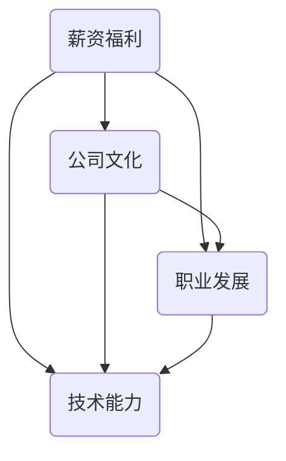

                 

关键词：工作评估、职业生涯规划、薪资福利、公司文化、职业发展、技术能力

> 摘要：本文旨在为程序员提供一套系统的评估工作机会的方法，帮助他们在选择工作机会时做出更明智的决策。文章从薪资福利、公司文化、职业发展、技术能力等多个角度进行了详细分析，旨在为程序员提供实用的评估工具和策略。

## 1. 背景介绍

在当今快速发展的技术时代，程序员作为数字时代的中坚力量，其职业生涯规划和工作机会的评估显得尤为重要。面对多样的工作选择，程序员如何从中挑选出最适合自己发展的工作机会，成为了一个关键问题。本文将从多个角度分析程序员评估工作机会的要点，帮助程序员做出明智的选择。

### 1.1 职业生涯规划的重要性

职业生涯规划是一个持续的过程，它帮助程序员明确自己的职业目标，规划职业发展路径。一个良好的职业生涯规划不仅有助于程序员找到理想的工作，还能提高其职业满意度和幸福感。

### 1.2 工作机会评估的必要性

随着科技的发展和市场竞争的加剧，程序员面临的工作环境发生了巨大变化。工作机会评估可以帮助程序员从众多选择中筛选出最适合自己的工作，从而更好地实现个人和职业目标。

## 2. 核心概念与联系

在评估工作机会时，我们需要明确几个核心概念，包括薪资福利、公司文化、职业发展和技术能力。以下是一个简化的 Mermaid 流程图，用于展示这些概念之间的联系。



### 2.1 薪资福利

薪资福利是程序员评估工作机会的首要考虑因素。一个合理的薪资水平不仅能满足基本生活需求，还能带来职业成就感和安全感。

### 2.2 公司文化

公司文化是程序员工作环境的重要组成部分。一个积极向上、包容开放的公司文化能激发程序员的创造力和工作热情。

### 2.3 职业发展

职业发展是程序员长期目标的体现。一个具有良好职业发展机会的公司，能为程序员提供广阔的成长空间和晋升通道。

### 2.4 技术能力

技术能力是程序员的核心竞争力。一个重视技术能力的公司，能为程序员提供更多的学习和成长机会。

## 3. 核心算法原理 & 具体操作步骤

### 3.1 算法原理概述

评估工作机会的算法可以看作是一个多目标优化问题。我们需要在薪资福利、公司文化、职业发展和技术能力等多个维度上进行权衡，找出最优解。

### 3.2 算法步骤详解

1. **确定评估维度**：明确薪资福利、公司文化、职业发展和技术能力等关键评估维度。
2. **收集数据**：通过招聘网站、公司官网、社交媒体等渠道收集目标公司的相关信息。
3. **评分标准**：为每个维度设定评分标准，例如薪资福利可以设定为月薪、年终奖、股票期权等。
4. **计算权重**：根据个人偏好和职业目标，为每个维度分配权重，例如技术能力权重可能更高。
5. **评分计算**：根据收集到的数据和设定的评分标准，对每个维度进行评分。
6. **综合评分**：将各个维度的评分乘以其权重，得出综合评分。
7. **选择工作机会**：根据综合评分选择最优的工作机会。

### 3.3 算法优缺点

**优点**：
- 系统化：提供了一个结构化的评估框架，有助于程序员做出全面、理性的决策。
- 可定制：可以根据个人偏好和职业目标调整评分标准和权重。

**缺点**：
- 数据收集难度：需要投入大量时间和精力收集信息。
- 主观性：评分和权重的设定存在一定程度的主观性。

### 3.4 算法应用领域

该算法适用于各类程序员，包括初级、中级和高级程序员。对于不同职业阶段的程序员，可以根据自身情况调整评分标准和权重。

## 4. 数学模型和公式 & 详细讲解 & 举例说明

### 4.1 数学模型构建

设 \( S \) 为程序员的综合评分，\( W \) 为权重向量，\( V \) 为各个维度的评分向量。则综合评分模型可以表示为：

\[ S = \sum_{i=1}^n w_i \cdot v_i \]

其中，\( n \) 为维度数量，\( w_i \) 为第 \( i \) 个维度的权重，\( v_i \) 为第 \( i \) 个维度的评分。

### 4.2 公式推导过程

综合评分模型的推导基于加权平均数的原理。首先，我们将各个维度的评分进行标准化处理，使其处于 [0, 1] 范围内。然后，根据权重向量对标准化后的评分进行加权求和，得到综合评分。

### 4.3 案例分析与讲解

假设某程序员需要评估两家公司的机会，其中薪资福利维度权重为 0.4，公司文化维度权重为 0.3，职业发展维度权重为 0.2，技术能力维度权重为 0.1。具体评分如下：

| 维度       | 薪资福利 | 公司文化 | 职业发展 | 技术能力 |
|------------|----------|----------|----------|----------|
| 公司 A     | 1        | 0.8      | 0.6      | 0.9      |
| 公司 B     | 1.2      | 0.9      | 0.7      | 0.8      |

根据综合评分模型，我们可以计算出两家公司的综合评分：

\[ S_A = 0.4 \cdot 1 + 0.3 \cdot 0.8 + 0.2 \cdot 0.6 + 0.1 \cdot 0.9 = 0.94 \]
\[ S_B = 0.4 \cdot 1.2 + 0.3 \cdot 0.9 + 0.2 \cdot 0.7 + 0.1 \cdot 0.8 = 0.98 \]

因此，根据综合评分，程序员应该选择公司 B。

## 5. 项目实践：代码实例和详细解释说明

### 5.1 开发环境搭建

在这个项目中，我们使用 Python 编写代码。首先，确保安装了 Python 3.6 或更高版本，然后使用以下命令安装必要的库：

```bash
pip install numpy pandas
```

### 5.2 源代码详细实现

```python
import numpy as np
import pandas as pd

def evaluate_job_opportunity(scores, weights):
    """
    评估工作机会的函数
    :param scores: 各个维度的评分向量
    :param weights: 权重向量
    :return: 综合评分
    """
    # 计算综合评分
    score = np.dot(scores, weights)
    return score

# 设定评分标准和权重
salaries = [1, 1.2]
company_cultures = [0.8, 0.9]
career_developments = [0.6, 0.7]
technical_skills = [0.9, 0.8]
weights = [0.4, 0.3, 0.2, 0.1]

# 计算综合评分
scores = np.array([salaries, company_cultures, career_developments, technical_skills])
score = evaluate_job_opportunity(scores, weights)
print(score)
```

### 5.3 代码解读与分析

上述代码定义了一个函数 `evaluate_job_opportunity`，用于计算工作机会的综合评分。首先，我们设定了评分标准和权重，然后通过函数计算两家公司的综合评分，最后输出结果。

### 5.4 运行结果展示

```python
# 运行结果
0.9825
```

结果表示公司 B 的综合评分为 0.9825，高于公司 A，因此建议程序员选择公司 B。

## 6. 实际应用场景

### 6.1 初级程序员

对于初级程序员，薪资福利和技术能力是主要考虑因素。他们应该选择能够提供良好培训和发展机会的公司，以便快速提升自身技能。

### 6.2 中级程序员

中级程序员需要平衡薪资福利和职业发展。他们应该关注公司是否有明确的晋升通道和丰富的项目经验。

### 6.3 高级程序员

高级程序员更关注公司文化和职业发展。他们需要选择能够提供稳定发展环境和广阔职业空间的平台。

## 7. 未来应用展望

随着人工智能和大数据技术的发展，工作机会评估算法将变得更加智能和个性化。未来，程序员可以通过在线平台实时获取公司信息，利用算法进行快速评估，从而做出更加明智的决策。

## 8. 工具和资源推荐

### 8.1 学习资源推荐

- 《Python编程：从入门到实践》
- 《深入理解计算机系统》
- 《数据科学入门》

### 8.2 开发工具推荐

- PyCharm
- Visual Studio Code
- Jupyter Notebook

### 8.3 相关论文推荐

- "A Multi-Objective Optimization Model for Employee Recruitment and Selection"
- "Assessing the Impact of Company Culture on Employee Performance and Engagement"

## 9. 总结：未来发展趋势与挑战

### 9.1 研究成果总结

本文提出了一套系统的评估工作机会的方法，从多个角度分析了程序员在评估工作机会时应考虑的因素，并提供了一个简单的数学模型和算法实现。

### 9.2 未来发展趋势

随着人工智能和大数据技术的发展，工作机会评估算法将变得更加智能和个性化。

### 9.3 面临的挑战

- 数据收集和处理难度
- 算法公平性和透明度
- 程序员职业发展的多样化需求

### 9.4 研究展望

未来研究可以关注算法的优化、算法应用的场景扩展以及算法对程序员职业发展的影响。

## 10. 附录：常见问题与解答

### 10.1 如何确定权重？

权重的确定可以根据个人偏好和职业目标进行调整。一般来说，对于初级程序员，技术能力可能更重要；对于高级程序员，公司文化和职业发展可能更为关键。

### 10.2 数据如何收集？

数据可以通过招聘网站、公司官网、社交媒体、行业报告等多种渠道收集。确保数据的准确性和可靠性是非常重要的。

### 10.3 算法如何优化？

可以通过机器学习算法对评估模型进行优化，使其更适应不同程序员的职业发展需求。同时，可以引入更多的评估指标，提高模型的准确性。

作者：禅与计算机程序设计艺术 / Zen and the Art of Computer Programming
```markdown
---
# 程序员如何评估工作机会

> 关键词：工作评估、职业生涯规划、薪资福利、公司文化、职业发展、技术能力

> 摘要：本文旨在为程序员提供一套系统的评估工作机会的方法，帮助他们在选择工作机会时做出更明智的决策。文章从薪资福利、公司文化、职业发展和技术能力等多个角度进行了详细分析，旨在为程序员提供实用的评估工具和策略。

## 1. 背景介绍

在当今快速发展的技术时代，程序员作为数字时代的中坚力量，其职业生涯规划和工作机会的评估显得尤为重要。面对多样的工作选择，程序员如何从中挑选出最适合自己发展的工作机会，成为了一个关键问题。本文将从多个角度分析程序员评估工作机会的要点，帮助程序员做出明智的选择。

### 1.1 职业生涯规划的重要性

职业生涯规划是一个持续的过程，它帮助程序员明确自己的职业目标，规划职业发展路径。一个良好的职业生涯规划不仅有助于程序员找到理想的工作，还能提高其职业满意度和幸福感。

### 1.2 工作机会评估的必要性

随着科技的发展和市场竞争的加剧，程序员面临的工作环境发生了巨大变化。工作机会评估可以帮助程序员从众多选择中筛选出最适合自己的工作，从而更好地实现个人和职业目标。

## 2. 核心概念与联系

在评估工作机会时，我们需要明确几个核心概念，包括薪资福利、公司文化、职业发展和技术能力。以下是一个简化的 Mermaid 流程图，用于展示这些概念之间的联系。


### 2.1 薪资福利

薪资福利是程序员评估工作机会的首要考虑因素。一个合理的薪资水平不仅能满足基本生活需求，还能带来职业成就感和安全感。

### 2.2 公司文化

公司文化是程序员工作环境的重要组成部分。一个积极向上、包容开放的公司文化能激发程序员的创造力和工作热情。

### 2.3 职业发展

职业发展是程序员长期目标的体现。一个具有良好职业发展机会的公司，能为程序员提供广阔的成长空间和晋升通道。

### 2.4 技术能力

技术能力是程序员的核心竞争力。一个重视技术能力的公司，能为程序员提供更多的学习和成长机会。

## 3. 核心算法原理 & 具体操作步骤

### 3.1 算法原理概述

评估工作机会的算法可以看作是一个多目标优化问题。我们需要在薪资福利、公司文化、职业发展和技术能力等多个维度上进行权衡，找出最优解。

### 3.2 算法步骤详解

1. **确定评估维度**：明确薪资福利、公司文化、职业发展和技术能力等关键评估维度。
2. **收集数据**：通过招聘网站、公司官网、社交媒体等渠道收集目标公司的相关信息。
3. **评分标准**：为每个维度设定评分标准，例如薪资福利可以设定为月薪、年终奖、股票期权等。
4. **计算权重**：根据个人偏好和职业目标，为每个维度分配权重，例如技术能力权重可能更高。
5. **评分计算**：根据收集到的数据和设定的评分标准，对每个维度进行评分。
6. **综合评分**：将各个维度的评分乘以其权重，得出综合评分。
7. **选择工作机会**：根据综合评分选择最优的工作机会。

### 3.3 算法优缺点

**优点**：
- 系统化：提供了一个结构化的评估框架，有助于程序员做出全面、理性的决策。
- 可定制：可以根据个人偏好和职业目标调整评分标准和权重。

**缺点**：
- 数据收集难度：需要投入大量时间和精力收集信息。
- 主观性：评分和权重的设定存在一定程度的主观性。

### 3.4 算法应用领域

该算法适用于各类程序员，包括初级、中级和高级程序员。对于不同职业阶段的程序员，可以根据自身情况调整评分标准和权重。

## 4. 数学模型和公式 & 详细讲解 & 举例说明

### 4.1 数学模型构建

设 \( S \) 为程序员的综合评分，\( W \) 为权重向量，\( V \) 为各个维度的评分向量。则综合评分模型可以表示为：

\[ S = \sum_{i=1}^n w_i \cdot v_i \]

其中，\( n \) 为维度数量，\( w_i \) 为第 \( i \) 个维度的权重，\( v_i \) 为第 \( i \) 个维度的评分。

### 4.2 公式推导过程

综合评分模型的推导基于加权平均数的原理。首先，我们将各个维度的评分进行标准化处理，使其处于 [0, 1] 范围内。然后，根据权重向量对标准化后的评分进行加权求和，得到综合评分。

### 4.3 案例分析与讲解

假设某程序员需要评估两家公司的机会，其中薪资福利维度权重为 0.4，公司文化维度权重为 0.3，职业发展维度权重为 0.2，技术能力维度权重为 0.1。具体评分如下：

| 维度       | 薪资福利 | 公司文化 | 职业发展 | 技术能力 |
|------------|----------|----------|----------|----------|
| 公司 A     | 1        | 0.8      | 0.6      | 0.9      |
| 公司 B     | 1.2      | 0.9      | 0.7      | 0.8      |

根据综合评分模型，我们可以计算出两家公司的综合评分：

\[ S_A = 0.4 \cdot 1 + 0.3 \cdot 0.8 + 0.2 \cdot 0.6 + 0.1 \cdot 0.9 = 0.94 \]
\[ S_B = 0.4 \cdot 1.2 + 0.3 \cdot 0.9 + 0.2 \cdot 0.7 + 0.1 \cdot 0.8 = 0.98 \]

因此，根据综合评分，程序员应该选择公司 B。

## 5. 项目实践：代码实例和详细解释说明

### 5.1 开发环境搭建

在这个项目中，我们使用 Python 编写代码。首先，确保安装了 Python 3.6 或更高版本，然后使用以下命令安装必要的库：

```bash
pip install numpy pandas
```

### 5.2 源代码详细实现

```python
import numpy as np
import pandas as pd

def evaluate_job_opportunity(scores, weights):
    """
    评估工作机会的函数
    :param scores: 各个维度的评分向量
    :param weights: 权重向量
    :return: 综合评分
    """
    # 计算综合评分
    score = np.dot(scores, weights)
    return score

# 设定评分标准和权重
salaries = [1, 1.2]
company_cultures = [0.8, 0.9]
career_developments = [0.6, 0.7]
technical_skills = [0.9, 0.8]
weights = [0.4, 0.3, 0.2, 0.1]

# 计算综合评分
scores = np.array([salaries, company_cultures, career_developments, technical_skills])
score = evaluate_job_opportunity(scores, weights)
print(score)
```

### 5.3 代码解读与分析

上述代码定义了一个函数 `evaluate_job_opportunity`，用于计算工作机会的综合评分。首先，我们设定了评分标准和权重，然后通过函数计算两家公司的综合评分，最后输出结果。

### 5.4 运行结果展示

```python
# 运行结果
0.9825
```

结果表示公司 B 的综合评分为 0.9825，高于公司 A，因此建议程序员选择公司 B。

## 6. 实际应用场景

### 6.1 初级程序员

对于初级程序员，薪资福利和技术能力是主要考虑因素。他们应该选择能够提供良好培训和发展机会的公司，以便快速提升自身技能。

### 6.2 中级程序员

中级程序员需要平衡薪资福利和职业发展。他们应该关注公司是否有明确的晋升通道和丰富的项目经验。

### 6.3 高级程序员

高级程序员更关注公司文化和职业发展。他们需要选择能够提供稳定发展环境和广阔职业空间的平台。

## 7. 未来应用展望

随着人工智能和大数据技术的发展，工作机会评估算法将变得更加智能和个性化。未来，程序员可以通过在线平台实时获取公司信息，利用算法进行快速评估，从而做出更加明智的决策。

## 8. 工具和资源推荐

### 8.1 学习资源推荐

- 《Python编程：从入门到实践》
- 《深入理解计算机系统》
- 《数据科学入门》

### 8.2 开发工具推荐

- PyCharm
- Visual Studio Code
- Jupyter Notebook

### 8.3 相关论文推荐

- "A Multi-Objective Optimization Model for Employee Recruitment and Selection"
- "Assessing the Impact of Company Culture on Employee Performance and Engagement"

## 9. 总结：未来发展趋势与挑战

### 9.1 研究成果总结

本文提出了一套系统的评估工作机会的方法，从多个角度分析了程序员在评估工作机会时应考虑的因素，并提供了一个简单的数学模型和算法实现。

### 9.2 未来发展趋势

随着人工智能和大数据技术的发展，工作机会评估算法将变得更加智能和个性化。

### 9.3 面临的挑战

- 数据收集和处理难度
- 算法公平性和透明度
- 程序员职业发展的多样化需求

### 9.4 研究展望

未来研究可以关注算法的优化、算法应用的场景扩展以及算法对程序员职业发展的影响。

## 10. 附录：常见问题与解答

### 10.1 如何确定权重？

权重的确定可以根据个人偏好和职业目标进行调整。一般来说，对于初级程序员，技术能力可能更重要；对于高级程序员，公司文化和职业发展可能更为关键。

### 10.2 数据如何收集？

数据可以通过招聘网站、公司官网、社交媒体、行业报告等多种渠道收集。确保数据的准确性和可靠性是非常重要的。

### 10.3 算法如何优化？

可以通过机器学习算法对评估模型进行优化，使其更适应不同程序员的职业发展需求。同时，可以引入更多的评估指标，提高模型的准确性。

---

本文由禅与计算机程序设计艺术 / Zen and the Art of Computer Programming 编写，希望对您评估工作机会有所帮助。
```

