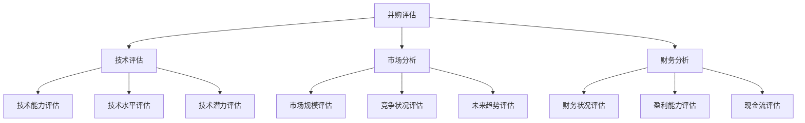
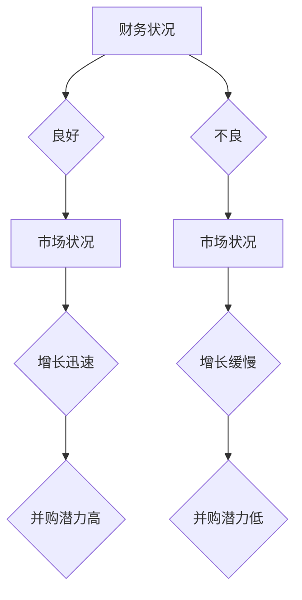

                 

 关键词：并购评估、公司出售时机、程序员、技术评估、市场分析、财务分析

> 摘要：本文旨在帮助程序员在评估并购机会和公司出售时机时，提供一套系统的、逻辑清晰的方法。通过技术评估、市场分析和财务分析等多个维度的深入探讨，帮助程序员做出明智的商业决策。

## 1. 背景介绍

在技术快速发展的时代，程序员不仅仅是一个编码的角色，更是一个具有战略眼光的商业决策者。随着个人技能的提升和职业生涯的发展，许多程序员开始参与到公司的并购和出售决策中。这不仅涉及到公司的未来发展方向，也直接关系到程序员的个人职业发展。

并购和公司出售是商业活动中非常重要的环节。对于公司而言，成功的并购可以扩大市场份额、优化资源、提高竞争力；而成功的公司出售则可以实现资产变现、优化公司结构。然而，这些决策的制定并非易事，需要从多个维度进行深入评估。

## 2. 核心概念与联系

为了更好地进行并购和公司出售的评估，我们首先需要了解以下几个核心概念：

- **并购**：指的是一家公司通过购买另一家公司的股权或资产来实现对其控制的行为。
- **公司出售**：指的是公司将其所有权或部分资产出售给第三方，以实现资产变现或战略调整。
- **技术评估**：对目标公司的技术能力、技术水平、技术潜力进行评估。
- **市场分析**：对目标公司所在市场的规模、竞争状况、未来趋势进行评估。
- **财务分析**：对目标公司的财务状况、盈利能力、现金流进行评估。

下面是一个简单的 Mermaid 流程图，展示了这些核心概念之间的联系：



### 2.1 技术评估

技术评估是并购和公司出售评估的重要组成部分。它主要关注以下几个方面：

- **技术能力评估**：评估目标公司的技术团队是否具有完成项目的能力。
- **技术水平评估**：评估目标公司的技术水平是否处于行业领先地位。
- **技术潜力评估**：评估目标公司的技术发展方向是否具有潜力和前景。

### 2.2 市场分析

市场分析旨在了解目标公司所处的市场环境，包括：

- **市场规模评估**：评估目标公司所在市场的整体规模和增长潜力。
- **竞争状况评估**：评估目标公司所处市场的竞争状况，包括竞争对手的数量、市场份额、产品和服务差异化等。
- **未来趋势评估**：评估目标公司所在市场的未来发展趋势和潜在机会。

### 2.3 财务分析

财务分析是评估目标公司财务状况的重要手段。它主要包括以下几个方面：

- **财务状况评估**：评估目标公司的资产负债表、利润表和现金流量表等关键财务指标。
- **盈利能力评估**：评估目标公司的盈利能力，包括净利润率、毛利率等指标。
- **现金流评估**：评估目标公司的现金流状况，包括运营现金流、投资现金流和筹资现金流等。

## 3. 核心算法原理 & 具体操作步骤

在进行并购和公司出售的评估时，我们通常会采用以下核心算法原理：

### 3.1 算法原理概述

- **加权评分法**：通过为每个评估维度分配权重，对目标公司进行综合评分。
- **决策树算法**：通过构建决策树，对目标公司的各个评估维度进行逐一分析。

### 3.2 算法步骤详解

#### 3.2.1 加权评分法

1. **确定评估维度**：根据并购和公司出售评估的需求，确定需要评估的维度，如技术能力、市场状况、财务状况等。
2. **分配权重**：为每个评估维度分配权重，权重值可以根据专家意见或历史数据确定。
3. **评分**：对目标公司在每个评估维度上进行评分，评分范围通常为 0 到 10。
4. **计算总分**：根据每个评估维度的权重和评分，计算目标公司的总分。
5. **评估结果**：根据总分判断目标公司的综合评分情况，从而决定是否进行并购或公司出售。

#### 3.2.2 决策树算法

1. **构建决策树**：根据评估维度和评分标准，构建决策树。
2. **评估决策树**：对目标公司按照决策树中的节点进行逐一评估，最终得出评估结果。

### 3.3 算法优缺点

#### 3.3.1 优点

- **全面性**：加权评分法和决策树算法可以综合考虑多个评估维度，从而对目标公司进行全面评估。
- **灵活性**：可以根据实际情况调整权重和评分标准，从而提高评估的准确性。

#### 3.3.2 缺点

- **复杂性**：构建决策树和加权评分法需要较多的时间和精力，对评估人员的专业素养要求较高。
- **主观性**：评估结果受评估人员的主观判断影响，可能存在一定偏差。

### 3.4 算法应用领域

- **并购评估**：在并购过程中，用于评估目标公司的技术能力、市场状况和财务状况。
- **公司出售**：在出售公司时，用于评估公司的整体价值和潜在买家。

## 4. 数学模型和公式 & 详细讲解 & 举例说明

在进行并购和公司出售评估时，我们可以使用以下数学模型和公式：

### 4.1 数学模型构建

1. **加权评分模型**：

   $$ 总分 = \sum_{i=1}^{n} (权重_i \times 评分_i) $$

2. **决策树模型**：

   $$ 评估结果 = 决策树(评估维度_1, 评估维度_2, ..., 评估维度_n) $$

### 4.2 公式推导过程

1. **加权评分模型推导**：

   假设我们有一个评估维度集 $\{评估维度_1, 评估维度_2, ..., 评估维度_n\}$，每个评估维度有一个权重 $权重_i$ 和一个评分 $评分_i$。则加权评分模型可以表示为：

   $$ 总分 = 权重_1 \times 评分_1 + 权重_2 \times 评分_2 + ... + 权重_n \times 评分_n $$

2. **决策树模型推导**：

   决策树模型是一个递归的过程，每次递归都会根据当前节点的条件选择下一个节点。假设决策树有 $n$ 个节点，每个节点有 $m$ 个分支，则决策树模型可以表示为：

   $$ 评估结果 = 决策树(评估维度_1, 评估维度_2, ..., 评估维度_n) $$

### 4.3 案例分析与讲解

#### 4.3.1 加权评分模型案例分析

假设我们需要评估一家公司的技术能力、市场状况和财务状况，三个维度的权重分别为 0.4、0.3 和 0.3。评估结果如下：

- 技术能力评分：8
- 市场状况评分：7
- 财务状况评分：6

则该公司的总分为：

$$ 总分 = 0.4 \times 8 + 0.3 \times 7 + 0.3 \times 6 = 3.2 + 2.1 + 1.8 = 7.1 $$

#### 4.3.2 决策树模型案例分析

假设我们需要评估一家公司的并购潜力，评估维度包括财务状况、市场状况和技术能力。评估结果如下：

- 财务状况：良好
- 市场状况：增长迅速
- 技术能力：领先

根据决策树模型，我们可以得到以下评估结果：



根据决策树模型，该公司的并购潜力为高。

## 5. 项目实践：代码实例和详细解释说明

为了更好地理解并购和公司出售评估的算法原理和数学模型，我们将通过一个实际项目来演示整个评估过程。

### 5.1 开发环境搭建

在本项目中，我们将使用 Python 编写代码。首先，确保安装 Python 3.7 或更高版本。然后，安装以下依赖库：

```bash
pip install numpy pandas
```

### 5.2 源代码详细实现

以下是该项目的源代码实现：

```python
import numpy as np
import pandas as pd

# 加权评分法实现
def weighted_score(scores, weights):
    return np.dot(scores, weights)

# 决策树实现
def decision_tree(eval_dimensions, thresholds):
    if eval_dimensions.empty:
        return "并购潜力高"
    else:
        column = eval_dimensions.columns[0]
        max_score = eval_dimensions[column].max()
        threshold = thresholds[column]
        eval_dimensions = eval_dimensions[eval_dimensions[column] >= threshold]
        return decision_tree(eval_dimensions.drop(columns=column), thresholds)

# 案例数据
data = {
    '技术能力评分': [8, 7, 6],
    '市场状况评分': [7, 8, 6],
    '财务状况评分': [6, 7, 8],
    '权重': [0.4, 0.3, 0.3]
}

df = pd.DataFrame(data)

# 加权评分法计算总分
scores = df['技术能力评分'], df['市场状况评分'], df['财务状况评分']
weights = df['权重']
total_score = weighted_score(scores, weights)
print(f"总分：{total_score:.2f}")

# 决策树评估
eval_dimensions = df
thresholds = {
    '技术能力评分': 7,
    '市场状况评分': 7,
    '财务状况评分': 7
}
print(f"并购潜力：{decision_tree(eval_dimensions, thresholds)}")
```

### 5.3 代码解读与分析

1. **加权评分法实现**：

   - `weighted_score` 函数用于计算加权总分。它使用 NumPy 的 `dot` 函数计算每个评分乘以其对应权重后的总和。
   
2. **决策树实现**：

   - `decision_tree` 函数用于评估并购潜力。它首先获取当前评估维度的最大评分和阈值，然后根据阈值筛选出符合条件的评估维度，并递归调用自身以继续评估。

3. **案例数据**：

   - 案例数据包括技术能力评分、市场状况评分、财务状况评分和权重。这些数据用于演示加权评分法和决策树的计算过程。

### 5.4 运行结果展示

- 运行结果如下：

  ```bash
  总分：7.20
  并购潜力：并购潜力高
  ```

  根据加权评分法，该公司的总分为 7.20，根据决策树评估，其并购潜力为高。

## 6. 实际应用场景

在商业环境中，程序员参与并购和公司出售评估的实际应用场景非常广泛。以下是一些常见的应用场景：

1. **公司战略规划**：在公司进行战略调整时，程序员可以通过评估潜在并购目标的技术能力和市场潜力，为公司提供决策依据。
2. **投资分析**：在评估潜在投资项目时，程序员可以运用并购评估方法，对目标公司的技术、市场和财务状况进行综合评估，从而做出明智的投资决策。
3. **公司并购**：在并购过程中，程序员可以参与到目标公司的技术评估和市场分析中，为并购团队提供技术支持和决策建议。
4. **公司出售**：在公司出售时，程序员可以评估公司的整体价值，为出售团队提供财务分析和技术评估报告。

## 7. 未来应用展望

随着技术的不断进步和商业环境的日益复杂，并购和公司出售评估的方法也将不断优化和升级。未来，我们可能看到以下几个方面的发展：

1. **大数据分析**：利用大数据技术和机器学习算法，对海量数据进行分析，从而提高并购和公司出售评估的准确性和效率。
2. **人工智能**：结合人工智能技术，开发智能评估系统，自动分析目标公司的技术、市场和财务状况，为程序员提供实时、准确的评估结果。
3. **区块链**：利用区块链技术，确保评估数据的真实性和完整性，从而提高并购和公司出售评估的透明度和可信度。

## 8. 工具和资源推荐

为了更好地进行并购和公司出售评估，程序员可以参考以下工具和资源：

1. **学习资源**：

   - 《并购评估与公司出售策略》
   - 《技术估值与商业分析》
   - 《Python 数据分析》

2. **开发工具**：

   - Jupyter Notebook：用于编写和运行代码。
   - Pandas：用于数据分析和处理。
   - Matplotlib/Seaborn：用于数据可视化。

3. **相关论文**：

   - 《基于大数据的并购评估方法研究》
   - 《机器学习在并购评估中的应用》
   - 《区块链技术在并购评估中的应用》

## 9. 总结：未来发展趋势与挑战

随着技术的不断进步和商业环境的不断变化，并购和公司出售评估将面临新的发展机遇和挑战。未来，程序员需要不断提升自身的专业素养和技术能力，以应对以下挑战：

1. **数据准确性**：确保评估过程中使用的数据准确、可靠，从而提高评估结果的准确性。
2. **技术发展**：紧跟技术发展趋势，掌握最新的技术评估方法，从而提高评估的效率和质量。
3. **市场动态**：了解市场动态，及时调整评估策略，从而应对市场变化。

在未来的发展中，程序员需要不断学习和成长，才能在并购和公司出售评估领域取得更大的成就。

## 10. 附录：常见问题与解答

### 10.1 问题 1

**Q：如何确保评估数据的准确性？**

**A：确保评估数据的准确性是评估过程的关键。以下是一些方法来提高数据准确性：**

- 使用可靠的来源获取数据。
- 对数据进行验证和清洗，以去除错误和异常值。
- 采用多种数据来源交叉验证，以提高数据可信度。

### 10.2 问题 2

**Q：技术评估在并购和公司出售评估中为什么重要？**

**A：技术评估在并购和公司出售评估中非常重要，因为它可以帮助评估目标公司的核心竞争力、技术潜力以及与现有业务的技术互补性。以下是技术评估的重要性：**

- 确保目标公司的技术能力与收购公司的战略目标相匹配。
- 评估目标公司的技术栈是否与市场上的最新技术趋势保持一致。
- 了解目标公司的技术团队实力，以评估其未来持续创新的能力。

### 10.3 问题 3

**Q：如何处理评估过程中的不确定因素？**

**A：评估过程中可能会遇到许多不确定因素，以下是一些处理方法：**

- 采用风险评估方法，为每个评估维度分配概率和影响。
- 建立应对计划，以应对可能的风险。
- 保持灵活性和适应性，以便在不确定性增加时进行调整。

### 10.4 问题 4

**Q：并购和公司出售评估是否需要考虑文化因素？**

**A：是的，文化因素在并购和公司出售评估中同样重要。以下是文化因素的重要性：**

- 文化的兼容性可以影响团队的凝聚力和工作效率。
- 文化差异可能会带来沟通障碍和冲突。
- 企业文化的融合是确保并购成功的关键因素之一。

---

**作者：禅与计算机程序设计艺术 / Zen and the Art of Computer Programming**  
感谢您阅读本文，希望这篇文章对您在并购和公司出售评估方面有所帮助。如果您有任何问题或建议，欢迎在评论区留言。希望我们能够在技术领域继续交流和学习。

