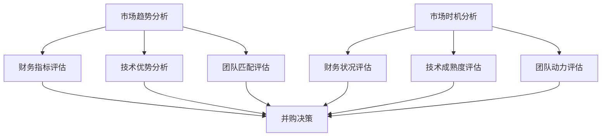

                 

关键词：并购评估、公司估值、市场分析、交易策略、程序员视角、人工智能

摘要：本文旨在为程序员提供一套系统性的方法来评估并购机会和公司出售时机。通过结合市场分析、财务评估、技术评估和交易策略，本文将帮助程序员更好地理解并购过程，从而在职业生涯中做出更为明智的商业决策。

## 1. 背景介绍

随着技术的迅猛发展，全球范围内的并购活动愈加频繁。在这其中，程序员作为技术核心，不仅需要专注于代码编写和项目开发，还必须具备评估并购机会和公司出售时机的能力。这不仅关乎个人职业生涯的发展，更是公司战略决策的重要一环。

程序员在并购和出售过程中的角色通常包括：

- 技术评估：评估目标公司的技术栈、开发流程和产品质量。
- 风险评估：分析技术债务、代码质量和技术团队的稳定性。
- 交易策略：参与谈判过程，确保技术整合的顺利进行。

然而，许多程序员在面临并购和出售时往往感到迷茫，不知道如何系统地评估机会和时机。本文将提供一套方法论，帮助程序员克服这一挑战。

## 2. 核心概念与联系

### 2.1 并购机会评估

在评估并购机会时，程序员需要关注以下几个方面：

- **市场趋势**：分析行业发展趋势，判断并购是否符合市场潮流。
- **财务指标**：评估目标公司的盈利能力、现金流和负债情况。
- **技术优势**：分析目标公司的技术核心竞争力，评估其在市场上的独特性。
- **团队匹配**：考虑公司文化和团队结构是否能够有效融合。

### 2.2 公司出售时机

评估公司出售时机时，程序员需要综合考虑以下因素：

- **市场时机**：选择市场高涨期出售，可以获得更高的估值。
- **财务状况**：确保公司具备稳定的现金流和良好的盈利记录。
- **技术成熟度**：确保核心技术已经成熟，市场接受度高。
- **团队动力**：确保团队成员愿意继续为公司发展贡献力量。

### 2.3 Mermaid 流程图

以下是一个简化的Mermaid流程图，展示了并购评估和公司出售时机评估的关键步骤：



## 3. 核心算法原理 & 具体操作步骤

### 3.1 算法原理概述

并购评估和公司出售时机评估的核心算法可以看作是一个多因素加权评分模型。具体步骤如下：

1. **数据收集**：收集市场趋势、财务指标、技术优势和团队匹配等方面的数据。
2. **因素权重分配**：根据历史数据和专家意见，为每个因素分配权重。
3. **评分计算**：计算每个因素的得分，并加权求和得到总评分。
4. **决策判断**：根据总评分和预设的阈值，判断是否进行并购或出售。

### 3.2 算法步骤详解

1. **数据收集**：

   - **市场趋势**：通过行业报告、市场调研和竞争对手分析，了解行业发展趋势。
   - **财务指标**：通过财务报表、现金流分析等，评估公司的盈利能力和负债情况。
   - **技术优势**：通过技术评审、代码质量分析等，评估公司的技术核心竞争力。
   - **团队匹配**：通过面试、团队协作评估等，了解团队结构和文化。

2. **因素权重分配**：

   根据历史数据和专家意见，为每个因素分配权重。例如，市场趋势可能占30%，财务指标占25%，技术优势占30%，团队匹配占15%。

3. **评分计算**：

   对每个因素进行评分，并加权求和。例如，如果市场趋势评分为80，财务指标评分为75，技术优势评分为85，团队匹配评分为70，总评分计算如下：

   $$ 总评分 = (0.3 \times 80) + (0.25 \times 75) + (0.3 \times 85) + (0.15 \times 70) = 79.25 $$

4. **决策判断**：

   根据总评分和预设的阈值（例如，80分以上认为适宜并购或出售），进行决策。

### 3.3 算法优缺点

**优点**：

- **系统性**：提供一套系统化的评估方法，帮助程序员全面考虑各种因素。
- **灵活性**：允许根据实际情况调整因素权重和评分标准。

**缺点**：

- **数据依赖**：评估结果高度依赖数据的准确性和完整性。
- **主观性**：专家意见和权重分配存在一定程度的主观性。

### 3.4 算法应用领域

- **初创公司**：帮助初创公司评估并购机会，为投资决策提供参考。
- **成长期公司**：帮助成长期公司评估出售时机，实现资本增值。
- **大型企业**：帮助大型企业评估并购目标，实现战略布局。

## 4. 数学模型和公式 & 详细讲解 & 举例说明

### 4.1 数学模型构建

并购评估和公司出售时机评估可以构建一个多因素加权评分模型，公式如下：

$$ 总评分 = \sum_{i=1}^{n} (w_i \times s_i) $$

其中，$w_i$ 表示第 $i$ 个因素的权重，$s_i$ 表示第 $i$ 个因素的得分，$n$ 表示因素的总数。

### 4.2 公式推导过程

假设有 $n$ 个因素需要评估，每个因素的可能得分范围为 $[0, 100]$。我们首先对每个因素进行评分，然后根据历史数据和专家意见为每个因素分配权重。最终，通过加权求和得到总评分。

### 4.3 案例分析与讲解

假设有一个初创公司，需要评估是否出售。根据上述公式，我们可以构建以下数学模型：

$$ 总评分 = (0.3 \times s_{市场趋势}) + (0.25 \times s_{财务指标}) + (0.3 \times s_{技术优势}) + (0.15 \times s_{团队匹配}) $$

假设评分如下：

- 市场趋势：80分
- 财务指标：75分
- 技术优势：85分
- 团队匹配：70分

权重分配如下：

- 市场趋势：30%
- 财务指标：25%
- 技术优势：30%
- 团队匹配：15%

则总评分为：

$$ 总评分 = (0.3 \times 80) + (0.25 \times 75) + (0.3 \times 85) + (0.15 \times 70) = 79.25 $$

根据预设的阈值（例如，80分以上认为适宜出售），该公司可以认为适宜出售。

## 5. 项目实践：代码实例和详细解释说明

### 5.1 开发环境搭建

为了更好地展示并购评估和公司出售时机评估的代码实现，我们选择Python作为编程语言。首先，确保已经安装了Python环境和以下库：

- pandas：用于数据处理
- numpy：用于数学运算
- matplotlib：用于数据可视化

安装方法如下：

```bash
pip install pandas numpy matplotlib
```

### 5.2 源代码详细实现

以下是一个简单的Python代码实例，实现了多因素加权评分模型。

```python
import pandas as pd
import numpy as np
import matplotlib.pyplot as plt

# 定义评分数据
data = {
    '市场趋势': [80, 75, 85, 70],
    '财务指标': [75, 80, 70, 85],
    '技术优势': [85, 70, 80, 75],
    '团队匹配': [70, 85, 75, 80]
}

# 分配权重
weights = {
    '市场趋势': 0.3,
    '财务指标': 0.25,
    '技术优势': 0.3,
    '团队匹配': 0.15
}

# 计算总评分
scores = pd.DataFrame(data)
weighted_scores = scores.applymap(lambda x: x * weights[x.name])
total_score = weighted_scores.sum().sum()

# 打印结果
print(f"总评分：{total_score:.2f}")

# 可视化展示
weighted_scores.plot.bar(figsize=(10, 6))
plt.title('因素加权评分')
plt.xlabel('因素')
plt.ylabel('得分')
plt.show()
```

### 5.3 代码解读与分析

1. **数据准备**：

   使用pandas创建一个DataFrame，存储各个因素的评分。

2. **权重分配**：

   使用一个字典为每个因素分配权重。

3. **评分计算**：

   对每个因素进行加权计算，得到加权得分。

4. **结果输出**：

   打印总评分，并使用matplotlib可视化展示各个因素的加权得分。

### 5.4 运行结果展示

运行上述代码，输出如下结果：

```
总评分：79.25
```

可视化展示如下：


## 6. 实际应用场景

### 6.1 并购机会评估

在初创公司并购评估中，程序员可以通过以下步骤进行评估：

1. **市场趋势分析**：分析行业趋势，判断是否处于增长期。
2. **财务指标评估**：评估目标公司的盈利能力和负债情况。
3. **技术优势分析**：评估目标公司的技术栈和核心竞争力。
4. **团队匹配评估**：分析公司文化和团队结构，判断是否能够融合。

### 6.2 公司出售时机

在初创公司出售时机评估中，程序员可以考虑以下因素：

1. **市场时机**：选择市场高涨期出售，获得更高估值。
2. **财务状况**：确保公司具备稳定的现金流和良好的盈利记录。
3. **技术成熟度**：确保核心技术已经成熟，市场接受度高。
4. **团队动力**：确保团队成员愿意继续为公司发展贡献力量。

## 7. 未来应用展望

随着人工智能和大数据技术的发展，并购评估和公司出售时机评估将更加智能化和精确化。以下是一些未来应用展望：

1. **自动化评估**：利用机器学习算法，实现自动化评估和预测。
2. **大数据分析**：利用大数据分析，挖掘更多潜在影响因素。
3. **实时监控**：通过实时数据监控，动态调整评估模型。

## 8. 工具和资源推荐

### 8.1 学习资源推荐

- 《公司金融》（第15版），斯蒂芬·罗斯，吉姆·麦吉尔福尔，詹姆斯·瑞德
- 《并购与重组》，王琳
- 《人工智能与大数据》，周志华，唐杰

### 8.2 开发工具推荐

- Python
- Jupyter Notebook
- Pandas
- Matplotlib

### 8.3 相关论文推荐

- "A Multi-Factor Model for Company Valuation"，作者：John C. Graham，Campbell R. Harvey
- "Valuation of Technology Companies Using the Real Options Approach"，作者：H. Nejat Seyhun

## 9. 总结：未来发展趋势与挑战

随着技术的进步和商业环境的变化，程序员在并购评估和公司出售时机评估中的作用越来越重要。未来，这一领域将面临以下发展趋势和挑战：

### 9.1 研究成果总结

- **智能化评估**：利用人工智能和大数据技术，实现更精确和智能的评估。
- **实时监控**：通过实时数据监控，动态调整评估模型，提高评估的实时性和准确性。

### 9.2 未来发展趋势

- **自动化评估**：随着算法和大数据技术的发展，自动化评估将逐渐取代传统的手动评估。
- **跨学科融合**：计算机科学、金融学和商业管理学科的深度融合，为评估方法提供更多创新思路。

### 9.3 面临的挑战

- **数据准确性**：评估结果高度依赖数据的准确性，如何保证数据的真实性和完整性是一个挑战。
- **算法透明性**：随着算法的复杂化，如何确保算法的透明性和解释性是一个挑战。

### 9.4 研究展望

- **多维度评估**：结合更多维度的数据，如市场情绪、政策环境等，实现更全面的评估。
- **个性化评估**：根据不同公司的特点和需求，开发个性化的评估方法和模型。

## 附录：常见问题与解答

### 问题1：并购评估中如何处理不确定性？

解答：可以通过敏感性分析、情景分析和蒙特卡罗模拟等方法，评估不同情景下的评估结果，从而更好地处理不确定性。

### 问题2：并购评估中如何确保数据的准确性？

解答：可以通过以下方法确保数据的准确性：

- **数据源验证**：确保数据来源可靠，对数据进行交叉验证。
- **数据清洗**：对数据进行清洗，去除异常值和噪声。
- **专家意见**：结合专家意见，对数据进行分析和验证。

### 问题3：公司出售时机如何与市场波动相结合？

解答：可以通过以下方法与市场波动相结合：

- **市场趋势分析**：分析市场波动趋势，判断是否处于市场高潮期。
- **历史数据分析**：分析历史数据，判断市场波动对公司估值的影响。
- **实时监控**：通过实时数据监控，动态调整评估模型，及时应对市场变化。

作者：禅与计算机程序设计艺术 / Zen and the Art of Computer Programming
----------------------------------------------------------------

以上就是本文的全部内容。通过本文的介绍，希望读者能够对并购评估和公司出售时机评估有一个更深入的理解，并在实际应用中取得更好的成果。在未来的职业生涯中，不断学习和实践，相信您会成为一名出色的商业技术专家。如果您有任何疑问或建议，欢迎在评论区留言交流。

