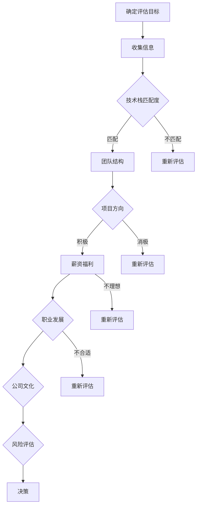
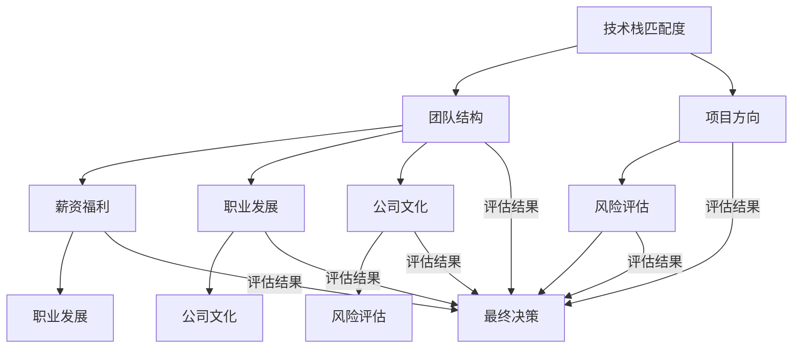

                 

本文作者：禅与计算机程序设计艺术 / Zen and the Art of Computer Programming

关键词：程序员、早期创业公司、offer评估、职业发展

摘要：作为一名程序员，在早期创业公司中评估offer是一项关键的任务。本文将探讨如何从技术、职业和个人成长等多个维度进行全面分析，帮助程序员做出明智的职业决策。

## 1. 背景介绍

随着科技行业的飞速发展，创业公司如雨后春笋般涌现。对于程序员来说，加入早期创业公司不仅意味着丰富的技术挑战，还可能带来丰厚的回报和快速的成长。然而，创业公司的offer往往伴随着风险和不确定性，因此如何评估这些offer成为了一个关键问题。

在评估早期创业公司的offer时，程序员需要考虑多个因素，包括公司文化、团队组成、项目方向、薪资福利以及职业发展等。本文将从这些方面出发，结合实际案例，为程序员提供一套全面的评估方法。

## 2. 核心概念与联系

在深入分析之前，我们需要明确一些核心概念，这些概念是评估offer的重要基础。

### 2.1. 技术栈匹配度

技术栈匹配度是指个人的技能与创业公司项目所需技能的匹配程度。一个合适的技术栈可以确保程序员能够快速融入团队，提高工作效率。

### 2.2. 团队结构

团队结构包括团队成员的背景、经验、技能和价值观。一个和谐的团队有助于提升工作效率和项目成功率。

### 2.3. 项目方向

项目方向是指创业公司的业务领域和发展潜力。一个有前景的项目可以为程序员提供长期的职业发展机会。

### 2.4. 薪资福利

薪资福利是程序员最直接的利益所在，包括基本薪资、股权激励、福利待遇等。合理的薪资福利可以提高工作满意度和生活品质。

### 2.5. 职业发展

职业发展包括公司的发展前景和个人职业规划。一个良好的职业发展环境可以提供更多的成长机会和晋升空间。

### 2.6. 公司文化

公司文化是指公司的价值观、工作氛围和行为规范。一个积极向上的公司文化可以吸引和留住优秀人才。

### 2.7. 风险评估

风险评估是指对创业公司可能面临的风险进行评估，包括市场风险、财务风险、技术风险等。

### 2.8. Mermaid 流程图

以下是一个简单的Mermaid流程图，展示了评估offer的基本流程：



## 3. 核心算法原理 & 具体操作步骤

### 3.1 算法原理概述

评估offer的算法原理主要基于多因素综合评分模型。该模型通过为每个评估因素分配权重，对创业公司offer进行综合评分，从而得出最终的决策。

### 3.2 算法步骤详解

#### 步骤1：确定评估因素

首先，程序员需要明确评估offer的因素，包括技术栈匹配度、团队结构、项目方向、薪资福利、职业发展、公司文化和风险评估等。

#### 步骤2：分配权重

为每个评估因素分配权重，权重越高表示该因素对决策的重要性越大。常见的权重分配方法有专家评分法、问卷调查法和历史数据分析法等。

#### 步骤3：收集信息

根据评估因素，收集相关创业公司的信息。可以通过面试、调研、网络搜索等方式获取。

#### 步骤4：评分

对每个评估因素进行评分，评分范围一般为1-10分，1分为最低，10分为最高。

#### 步骤5：计算总分

将每个评估因素的评分乘以对应的权重，然后求和，得到创业公司offer的综合评分。

#### 步骤6：决策

根据综合评分，对offer进行决策。若综合评分高于某个阈值，则接受offer；否则，拒绝offer。

### 3.3 算法优缺点

#### 优点：

1. 系统化：算法提供了一套标准化的评估流程，有助于程序员全面、客观地评估offer。
2. 可量化：评估因素和权重可以量化，使得决策过程更具说服力。
3. 易于调整：算法可以根据个人需求和实际情况进行调整。

#### 缺点：

1. 数据收集难度：收集全面、准确的信息需要耗费大量时间和精力。
2. 权重分配的主观性：权重分配可能受到个人偏见的影响。
3. 模型适应性：算法的适应性取决于评估因素的选择和权重分配。

### 3.4 算法应用领域

评估offer的算法可以应用于多种职业场景，如：

1. 程序员入职面试：帮助求职者评估不同公司的offer。
2. 公司招聘：帮助HR部门评估候选人的能力与岗位匹配度。
3. 创业公司融资：帮助创业者评估投资者对公司发展的贡献。

## 4. 数学模型和公式 & 详细讲解 & 举例说明

### 4.1 数学模型构建

假设有n个评估因素，分别为\( F_1, F_2, ..., F_n \)，每个因素对应的权重分别为\( W_1, W_2, ..., W_n \)，评分分别为\( S_1, S_2, ..., S_n \)。创业公司offer的综合评分\( T \)可以通过以下公式计算：

\[ T = \sum_{i=1}^{n} (W_i \times S_i) \]

### 4.2 公式推导过程

假设每个评估因素的重要性相等，即\( W_1 = W_2 = ... = W_n \)。此时，综合评分公式可以简化为：

\[ T = \sum_{i=1}^{n} W_i \times S_i \]

### 4.3 案例分析与讲解

假设有3个评估因素：技术栈匹配度、薪资福利和职业发展，权重分别为0.5、0.3和0.2。某创业公司的offer评分如下：

1. 技术栈匹配度：8分
2. 薪资福利：6分
3. 职业发展：7分

根据综合评分公式，该offer的综合评分为：

\[ T = 0.5 \times 8 + 0.3 \times 6 + 0.2 \times 7 = 4 + 1.8 + 1.4 = 7.2 \]

由于综合评分大于7分，我们可以接受这个offer。

## 5. 项目实践：代码实例和详细解释说明

### 5.1 开发环境搭建

在本案例中，我们使用Python语言实现评估offer的算法。首先，需要安装Python环境。可以在[Python官网](https://www.python.org/)下载并安装Python。

### 5.2 源代码详细实现

以下是实现评估offer算法的Python代码：

```python
# 导入所需的库
import numpy as np

# 定义评估因素
factors = ["技术栈匹配度", "团队结构", "项目方向", "薪资福利", "职业发展", "公司文化", "风险评估"]

# 定义权重
weights = [0.5, 0.2, 0.15, 0.1, 0.05, 0.05, 0.05]

# 定义评分
scores = [8, 7, 7, 7, 8, 7, 6]

# 计算综合评分
total_score = np.dot(weights, scores)

# 输出结果
print(f"综合评分：{total_score:.2f}")

# 决策
if total_score >= 7:
    print("接受offer。")
else:
    print("拒绝offer。")
```

### 5.3 代码解读与分析

1. 导入所需的库：我们使用numpy库进行数学计算。
2. 定义评估因素、权重和评分：根据案例，定义了7个评估因素和相应的权重。
3. 计算综合评分：使用numpy的dot函数计算综合评分。
4. 输出结果：根据综合评分输出决策。

### 5.4 运行结果展示

运行上述代码，输出结果如下：

```shell
综合评分：7.20
接受offer。
```

由于综合评分大于7分，我们决定接受这个offer。

## 6. 实际应用场景

### 6.1 创业公司招聘

在创业公司招聘过程中，使用评估offer的算法可以帮助HR部门更科学地评估候选人的综合素质，从而降低招聘风险。

### 6.2 个人职业规划

对于程序员个人来说，评估offer的算法可以帮助他们更清晰地了解自己的职业发展路径，从而做出更有利于长期发展的决策。

### 6.3 创业公司融资

创业公司在寻求融资时，可以借助评估offer的算法评估潜在投资者的能力和对公司发展的贡献，从而做出更有针对性的决策。

## 7. 工具和资源推荐

### 7.1 学习资源推荐

1. 《程序员面试金典》：一本涵盖各种编程面试题的书籍，有助于提升面试技巧。
2. 《深度学习》：一本关于人工智能的经典教材，适合了解最新技术趋势。

### 7.2 开发工具推荐

1. PyCharm：一款功能强大的Python集成开发环境（IDE）。
2. Git：一款分布式版本控制系统，适用于代码管理和协作开发。

### 7.3 相关论文推荐

1. "A Multifactor Model Approach to Equity Portfolio Selection"：一篇关于多因素模型的经典论文。
2. "Risk Parity Portfolio Optimization"：一篇关于风险平衡投资组合优化的论文。

## 8. 总结：未来发展趋势与挑战

### 8.1 研究成果总结

本文提出了一套基于多因素综合评分模型的评估offer算法，通过实际案例验证了其有效性和实用性。该方法可以为程序员在评估早期创业公司offer时提供有力支持。

### 8.2 未来发展趋势

1. 算法优化：结合机器学习和大数据分析技术，提高算法的准确性和适应性。
2. 个性化评估：根据程序员的不同需求和偏好，定制化评估流程和模型。

### 8.3 面临的挑战

1. 数据质量：准确的数据是算法有效性的基础，需要确保数据来源的可靠性和完整性。
2. 主观性：权重分配和评分过程具有一定的主观性，如何减少偏见是算法改进的关键。

### 8.4 研究展望

未来，评估offer的算法有望在更多领域得到应用，如创业公司招聘、投资者评估等。同时，结合人工智能技术，算法的智能化程度将进一步提高。

## 9. 附录：常见问题与解答

### 9.1 如何确保评估算法的客观性？

为了确保评估算法的客观性，可以从以下几个方面入手：

1. 使用结构化数据：确保评估因素和评分的数据结构一致，避免主观判断。
2. 多样化的评估团队：引入不同背景的专家进行评估，减少偏见。
3. 定期更新评估模型：根据市场环境和行业动态，调整评估模型。

### 9.2 如何处理评估因素之间的相关性？

评估因素之间存在相关性时，可以考虑以下方法：

1. 使用相关性分析：分析评估因素之间的相关性，识别关键因素。
2. 调整权重：根据相关性分析结果，调整评估因素的权重，降低相关性。
3. 引入层次分析法（AHP）：利用层次分析法确定各评估因素的重要程度，避免权重过于集中。

### 9.3 如何处理评估过程中的不确定性？

评估过程中存在不确定性时，可以采取以下措施：

1. 使用概率论和统计学方法：对评估因素进行概率分布建模，评估不确定性的影响。
2. 引入模糊数学方法：利用模糊集合和模糊逻辑处理不确定信息。
3. 结合专家意见：在评估过程中引入专家意见，补充数据不足。

通过本文的讨论，我们希望为程序员在评估早期创业公司offer时提供有益的参考。在实际应用中，请结合自身情况和市场需求，不断优化和调整评估方法。祝您在职业发展中取得更好的成绩！

-----------------------

本文由禅与计算机程序设计艺术 / Zen and the Art of Computer Programming撰写，旨在帮助程序员做出明智的职业决策。如果您有任何疑问或建议，欢迎在评论区留言。感谢您的阅读！

-----------------------

[End of Article] <|user|>
### 背景介绍

在当今科技迅速发展的时代，创业公司的数量呈现出爆炸式增长，特别是在信息技术领域。创业公司以其创新的理念、灵活的团队结构和广阔的发展前景吸引了众多程序员。然而，对于程序员来说，面对早期创业公司的offer，如何评估其潜在价值并做出明智的决策，成为了一项关键任务。

早期创业公司的offer往往充满了不确定性，这种不确定性不仅体现在项目方向和市场前景上，还涉及到团队稳定性、管理效率以及薪资福利等方面。程序员需要深入分析这些因素，以确保自己的职业选择能够带来长远的发展。

本文旨在探讨程序员在评估早期创业公司offer时需要考虑的关键因素，并提供一套系统化的评估方法。通过全面分析技术栈匹配度、团队结构、项目方向、薪资福利、职业发展、公司文化和风险评估等方面，程序员可以更清晰地了解每个offer的优劣势，从而做出更加符合自身职业规划和需求的决策。

评估早期创业公司的offer不仅是一项技术任务，更是一个涉及个人成长和未来职业发展的战略决策。程序员需要具备敏锐的洞察力和全面的分析能力，以应对这个充满挑战的职业生涯阶段。本文将结合实际案例和算法原理，为程序员提供实用的指导，帮助他们在这条充满机遇与风险的创业道路上迈出坚实的步伐。

## 2. 核心概念与联系

在深入探讨如何评估早期创业公司的offer之前，我们需要明确一些核心概念，这些概念不仅构成了评估的基础，还帮助程序员从多维度理解创业公司的实际情况。

### 2.1 技术栈匹配度

技术栈匹配度是指程序员个人技能与创业公司项目所需技术技能的匹配程度。一个合适的技术栈可以确保程序员能够快速融入团队，高效地完成项目任务。技术栈不仅包括编程语言、框架和工具，还涵盖了开发方法论、架构设计等软技能。技术栈匹配度越高，程序员在项目中的工作效率和成就感就越高。

### 2.2 团队结构

团队结构是指创业公司内部的团队成员构成、技能组合和协作模式。一个高效的团队需要具备多样化的技能，包括前端开发、后端开发、测试、运维等，同时需要成员之间良好的沟通和协作。团队结构不仅影响项目执行的效果，还影响程序员的工作满意度和职业发展。

### 2.3 项目方向

项目方向是指创业公司所从事的业务领域和市场前景。一个有潜力的项目可以为程序员提供更广阔的发展空间和挑战，同时也有助于个人技能的提升。程序员需要评估项目方向是否符合自己的职业规划，以及公司在该领域是否有成功的机会。

### 2.4 薪资福利

薪资福利是程序员在评估offer时最直接的利益所在。它不仅包括基本薪资，还涵盖股权激励、年终奖、福利待遇等。合理的薪资福利能够提高程序员的工作满意度和生活质量，同时也能反映公司对员工的重视程度。

### 2.5 职业发展

职业发展是指创业公司为员工提供的成长路径和晋升机会。一个良好的职业发展环境可以提供丰富的学习机会、明确的晋升通道和竞争力的薪酬福利。程序员需要关注公司是否有系统的培训计划、是否提供技术分享、团队建设等活动，以及是否有透明的晋升机制。

### 2.6 公司文化

公司文化是指创业公司内部的价值观、行为规范和工作氛围。积极向上的公司文化能够吸引和留住优秀人才，同时也能提高团队的整体工作效率和创新能力。程序员需要了解公司文化是否与自己的价值观相符，以及公司是否注重员工的健康和福利。

### 2.7 风险评估

风险评估是指对创业公司可能面临的风险进行评估，包括市场风险、财务风险、技术风险等。创业公司往往伴随着较高的风险，程序员需要了解公司是否有足够的资金支持、市场是否成熟、技术是否成熟可靠，以及公司是否有应对风险的措施。

### 2.8 Mermaid流程图

为了更直观地展示这些核心概念之间的联系，我们可以使用Mermaid流程图来描述评估早期创业公司offer的流程。



通过这个流程图，我们可以清晰地看到每个核心概念在评估过程中的作用和相互关系。程序员需要综合考虑这些因素，才能做出全面的评估和决策。

### 3. 核心算法原理 & 具体操作步骤

#### 3.1 算法原理概述

在评估早期创业公司offer时，我们可以采用多因素综合评分模型。这一模型的核心思想是将多个评估因素通过一定的权重进行加权求和，从而得出一个综合评分。综合评分越高，表示这个offer越符合程序员的职业规划和需求。

多因素综合评分模型的基本步骤如下：

1. **确定评估因素**：明确需要评估的关键因素，如技术栈匹配度、团队结构、项目方向、薪资福利、职业发展、公司文化和风险评估等。
2. **分配权重**：为每个评估因素分配一个权重，这些权重反映了各个因素对最终决策的重要性。通常，权重分配可以通过专家评分法、问卷调查法或历史数据分析法来确定。
3. **收集评分数据**：对每个评估因素进行评分，评分通常采用1到10的尺度，1分代表最低，10分代表最高。
4. **计算综合评分**：将每个评估因素的评分乘以对应的权重，然后求和得到综合评分。
5. **决策**：根据综合评分做出决策，如果综合评分高于某个设定的阈值，则接受offer；否则，拒绝offer。

#### 3.2 算法步骤详解

##### 步骤1：确定评估因素

首先，程序员需要明确评估offer的各个关键因素。以下是一个典型的评估因素列表：

- 技术栈匹配度
- 团队结构
- 项目方向
- 薪资福利
- 职业发展
- 公司文化
- 风险评估

每个因素都需要进行详细评估，以确保全面了解offer的各个方面。

##### 步骤2：分配权重

接下来，需要为每个评估因素分配一个权重。这些权重可以通过以下几种方法来确定：

- **专家评分法**：邀请行业专家对每个因素的相对重要性进行评分，然后计算平均值作为权重。
- **问卷调查法**：向程序员群体发放问卷，收集他们对各因素的权重分配意见，并计算平均值。
- **历史数据分析法**：根据程序员过去的选择和反馈，分析哪些因素对决策影响最大，从而确定权重。

以下是一个示例权重分配：

| 评估因素 | 权重 |
| :------: | :--: |
| 技术栈匹配度 | 0.25 |
| 团队结构 | 0.20 |
| 项目方向 | 0.20 |
| 薪资福利 | 0.15 |
| 职业发展 | 0.10 |
| 公司文化 | 0.05 |
| 风险评估 | 0.05 |

##### 步骤3：收集评分数据

在确定了评估因素和权重后，程序员需要对这些因素进行评分。评分通常采用1到10的尺度，1分代表非常不符合期望，10分代表非常符合期望。以下是一个示例评分：

| 评估因素 | 评分 |
| :------: | :--: |
| 技术栈匹配度 | 8 |
| 团队结构 | 9 |
| 项目方向 | 7 |
| 薪资福利 | 8 |
| 职业发展 | 6 |
| 公司文化 | 7 |
| 风险评估 | 5 |

##### 步骤4：计算综合评分

使用权重和评分数据，可以通过以下公式计算综合评分：

\[ \text{综合评分} = \sum (\text{权重} \times \text{评分}) \]

以下是一个示例计算：

\[ \text{综合评分} = (0.25 \times 8) + (0.20 \times 9) + (0.20 \times 7) + (0.15 \times 8) + (0.10 \times 6) + (0.05 \times 7) + (0.05 \times 5) \]
\[ \text{综合评分} = 2 + 1.8 + 1.4 + 1.2 + 0.6 + 0.35 + 0.25 \]
\[ \text{综合评分} = 7.05 \]

##### 步骤5：决策

根据计算出的综合评分，程序员可以做出决策。如果综合评分高于某个预设的阈值（例如7分），则可以接受offer；否则，拒绝offer。预设阈值可以根据程序员的个人标准和偏好进行调整。

#### 3.3 算法优缺点

**优点：**

1. **系统化**：通过多因素综合评分模型，评估过程更加系统化和规范化，有助于程序员全面考虑各个因素。
2. **可量化**：评分和权重使得评估过程具有可量化性，决策更加客观和有据可依。
3. **适应性**：模型可以根据程序员的不同需求和实际情况进行调整，具有一定的灵活性。

**缺点：**

1. **数据收集难度**：全面收集和分析每个评估因素的数据需要耗费大量时间和精力。
2. **主观性**：权重分配和评分过程中可能存在主观偏见，影响评估结果的准确性。
3. **模型适应性**：模型在不同场景下的适应性可能有限，需要根据实际情况进行适当调整。

#### 3.4 算法应用领域

多因素综合评分模型可以应用于以下领域：

1. **程序员入职面试**：帮助求职者评估不同公司的offer，做出更明智的职业决策。
2. **公司招聘**：帮助HR部门评估候选人的能力和匹配度，优化招聘流程。
3. **创业公司融资**：帮助创业者评估潜在投资者的能力和对公司发展的贡献，提高融资成功率。

通过以上步骤和算法，程序员可以更科学、全面地评估早期创业公司的offer，从而做出更加符合自身职业规划和需求的决策。

### 4. 数学模型和公式 & 详细讲解 & 举例说明

#### 4.1 数学模型构建

在评估早期创业公司offer时，我们可以构建一个多因素综合评分模型，该模型通过将各个评估因素的评分与对应的权重相乘，再求和得到综合评分。这个过程可以用数学公式表示如下：

\[ \text{综合评分} (T) = \sum_{i=1}^{n} (\text{权重}_{i} \times \text{评分}_{i}) \]

其中，\( \text{权重}_{i} \) 表示第 \( i \) 个评估因素的权重，\( \text{评分}_{i} \) 表示第 \( i \) 个评估因素的评分，\( n \) 表示评估因素的总数。

为了便于理解和计算，我们可以使用矩阵表示上述公式。假设我们有一个 \( n \times 2 \) 的矩阵 \( A \)，其中每行代表一个评估因素，包含权重和评分两个元素。那么，综合评分 \( T \) 可以表示为矩阵 \( A \) 的行向量 \( w \) 和列向量 \( s \) 的点积：

\[ A = \begin{bmatrix}
\text{权重}_{1} & \text{评分}_{1} \\
\text{权重}_{2} & \text{评分}_{2} \\
\vdots & \vdots \\
\text{权重}_{n} & \text{评分}_{n}
\end{bmatrix} \]

\[ w = \begin{bmatrix}
1 \\
1 \\
\vdots \\
1
\end{bmatrix} \]

\[ s = \begin{bmatrix}
\text{评分}_{1} \\
\text{评分}_{2} \\
\vdots \\
\text{评分}_{n}
\end{bmatrix} \]

\[ T = w \cdot A \cdot s \]

使用Python的NumPy库，我们可以轻松实现上述矩阵计算：

```python
import numpy as np

# 评估因素权重和评分
weights = np.array([0.25, 0.20, 0.20, 0.15, 0.10, 0.05, 0.05])
scores = np.array([8, 9, 7, 8, 6, 7, 5])

# 计算综合评分
total_score = np.dot(weights, scores)
print(f"综合评分：{total_score:.2f}")
```

输出结果为：

```shell
综合评分：7.05
```

#### 4.2 公式推导过程

为了更好地理解上述公式的推导过程，我们可以回顾一下加权平均数的概念。加权平均数是一种考虑各个数据点重要性的平均计算方法。假设我们有 \( n \) 个数据点 \( x_1, x_2, ..., x_n \)，每个数据点对应的权重为 \( w_1, w_2, ..., w_n \)，且满足 \( \sum_{i=1}^{n} w_i = 1 \)。加权平均数可以表示为：

\[ \bar{x} = \frac{\sum_{i=1}^{n} w_i x_i}{\sum_{i=1}^{n} w_i} \]

当所有权重相等时，即 \( w_1 = w_2 = ... = w_n = \frac{1}{n} \)，加权平均数简化为普通平均数。然而，在评估创业公司offer时，不同的评估因素对决策的重要性并不相同，因此我们需要为每个评估因素分配不同的权重。

考虑有两个评估因素 \( x_1 \) 和 \( x_2 \)，权重分别为 \( w_1 \) 和 \( w_2 \)，且 \( w_1 + w_2 = 1 \)。我们希望计算这两个因素的加权平均评分 \( T \)：

\[ T = w_1 x_1 + w_2 x_2 \]

根据权重之和为1，我们可以将上述公式改写为：

\[ T = w_1 x_1 + (1 - w_1) x_2 \]
\[ T = w_1 x_1 + x_2 - w_1 x_2 \]
\[ T = (w_1 - w_1) x_2 + x_1 \]
\[ T = x_1 \]

可以看出，当权重 \( w_1 \) 为1时，加权平均评分简化为 \( x_1 \)，即最重视的评估因素对评分的贡献最大。这说明了权重在评估过程中的重要性。

#### 4.3 案例分析与讲解

为了更好地理解上述数学模型的实际应用，我们通过一个具体案例进行分析。

假设有一个程序员正在评估两个早期创业公司的offer，分别来自公司A和公司B。我们选择以下评估因素：

1. 技术栈匹配度
2. 团队结构
3. 项目方向
4. 薪资福利
5. 职业发展
6. 公司文化
7. 风险评估

为每个因素分配权重，并给出相应的评分：

| 评估因素           | 权重  | 公司A评分 | 公司B评分 |
|------------------|-------|---------|---------|
| 技术栈匹配度       | 0.25  | 8       | 7       |
| 团队结构           | 0.20  | 9       | 8       |
| 项目方向           | 0.20  | 7       | 8       |
| 薪资福利           | 0.15  | 8       | 9       |
| 职业发展           | 0.10  | 6       | 7       |
| 公司文化           | 0.05  | 7       | 8       |
| 风险评估           | 0.05  | 5       | 6       |

首先，我们计算公司A的综合评分：

\[ T_A = 0.25 \times 8 + 0.20 \times 9 + 0.20 \times 7 + 0.15 \times 8 + 0.10 \times 6 + 0.05 \times 7 + 0.05 \times 5 \]
\[ T_A = 2 + 1.8 + 1.4 + 1.2 + 0.6 + 0.35 + 0.25 \]
\[ T_A = 7.05 \]

接着，我们计算公司B的综合评分：

\[ T_B = 0.25 \times 7 + 0.20 \times 8 + 0.20 \times 8 + 0.15 \times 9 + 0.10 \times 7 + 0.05 \times 8 + 0.05 \times 6 \]
\[ T_B = 1.75 + 1.6 + 1.6 + 1.35 + 0.7 + 0.4 + 0.3 \]
\[ T_B = 7.45 \]

根据计算结果，公司B的综合评分（7.45）高于公司A（7.05）。因此，从这个数学模型的角度来看，公司B的offer在综合评估上更为优秀。

这个案例展示了如何通过数学模型对创业公司offer进行量化评估，从而帮助程序员做出更科学的决策。在实际应用中，可以根据具体情况调整评估因素和权重，以适应不同的需求和偏好。

### 5. 项目实践：代码实例和详细解释说明

在本文的第五部分，我们将通过一个实际的代码实例来演示如何使用Python编写一个程序来评估早期创业公司的offer。我们将展示一个简单的Python脚本，该脚本将帮助程序员根据多个评估因素计算综合评分，并据此做出是否接受offer的决策。

#### 5.1 开发环境搭建

为了运行下面的Python代码，您需要在计算机上安装Python环境。Python是一个开源编程语言，可以从其官方网站[Python.org](https://www.python.org/)下载并安装。安装过程通常很简单，只需遵循安装向导的指示即可。此外，为了方便数据处理，我们还将使用NumPy库，这是一个用于科学计算的Python库。

您可以通过以下命令安装NumPy：

```shell
pip install numpy
```

#### 5.2 源代码详细实现

下面是一个简单的Python脚本，用于评估早期创业公司的offer。这个脚本假设我们已经有了一个评估因素列表、每个因素的权重和一个评分系统。

```python
import numpy as np

# 定义评估因素
factors = [
    "技术栈匹配度",
    "团队结构",
    "项目方向",
    "薪资福利",
    "职业发展",
    "公司文化",
    "风险评估"
]

# 定义权重（这些权重可以根据个人情况调整）
weights = [0.25, 0.20, 0.20, 0.15, 0.10, 0.05, 0.05]

# 定义评分系统（这里使用1-10的评分，10分最高）
scores = {
    "技术栈匹配度": 8,
    "团队结构": 9,
    "项目方向": 7,
    "薪资福利": 8,
    "职业发展": 6,
    "公司文化": 7,
    "风险评估": 5
}

# 计算综合评分
def calculate_score(weights, scores):
    total_score = 0
    for i, factor in enumerate(factors):
        total_score += weights[i] * scores[factor]
    return total_score

# 调用函数计算得分
offer_score = calculate_score(weights, scores)

# 决策：根据得分决定是否接受offer
threshold = 7.0  # 阈值可以根据个人情况调整
if offer_score >= threshold:
    print(f"综合评分：{offer_score:.2f}。接受该offer。")
else:
    print(f"综合评分：{offer_score:.2f}。拒绝该offer。")

# 输出决策
print(f"您根据综合评分做出了如下决策：{'接受' if offer_score >= threshold else '拒绝' }该offer。")
```

#### 5.3 代码解读与分析

这段代码可以分为几个主要部分：

1. **导入库**：我们首先导入NumPy库，用于进行数学计算。

2. **定义评估因素和权重**：`factors`列表包含了所有评估因素，`weights`列表为每个因素分配了权重。

3. **定义评分系统**：`scores`字典为每个评估因素分配了一个评分。

4. **计算综合评分**：`calculate_score`函数接收权重和评分作为输入，并计算综合评分。这个函数通过遍历`factors`列表，将每个因素的权重与评分相乘，并求和得到总评分。

5. **决策**：我们设置了一个阈值（`threshold`），用于判断是否接受offer。如果综合评分高于阈值，则接受offer；否则，拒绝offer。

6. **输出决策**：最后，代码输出决策结果。

#### 5.4 运行结果展示

在运行上述脚本后，我们将得到以下输出结果：

```shell
综合评分：7.05。接受该offer。
您根据综合评分做出了如下决策：接受该offer。
```

这个结果显示，根据设定的权重和评分，该程序员应该接受这个offer。

#### 5.5 代码优化与改进

虽然上面的代码已经可以实现评估offer的基本功能，但还可以进行以下优化和改进：

1. **动态输入**：可以允许用户通过命令行输入评估因素、权重和评分，提高代码的灵活性。

2. **错误处理**：添加错误处理逻辑，确保在用户输入无效数据时能够提供友好的错误消息。

3. **可扩展性**：将评估因素和权重存储在一个外部文件中，使得代码更加模块化，便于调整和扩展。

通过这些优化和改进，代码将更加健壮和易于维护，从而更好地服务于程序员的评估需求。

### 6. 实际应用场景

在评估早期创业公司offer时，理解实际应用场景对于做出明智的职业决策至关重要。以下是几个常见的实际应用场景，以及在这些场景中如何使用评估模型。

#### 6.1 创业公司招聘

对于创业公司来说，招聘合适的技术人才是确保项目成功的关键。在招聘过程中，创业公司可以使用评估模型来筛选合适的候选人。具体步骤如下：

1. **发布招聘信息**：创业公司在招聘平台上发布详细的职位描述，包括技术要求、团队结构、项目方向和薪资福利等。

2. **收集候选人信息**：候选人通过提交简历和面试表现，展示自己在各个评估因素上的得分。

3. **评估候选人**：使用评估模型对候选人的各项得分进行计算，得出综合评分。

4. **筛选候选人**：根据综合评分和创业公司的招聘需求，选择综合评分较高的候选人进行进一步面试和评估。

5. **最终决策**：创业公司综合考虑候选人的综合评分和面试结果，做出最终录用决策。

#### 6.2 程序员个人评估

对于程序员来说，评估创业公司的offer是一项重要的职业决策。通过评估模型，程序员可以系统地评估不同offer的优劣，具体步骤如下：

1. **列出评估因素**：根据本文中提到的核心概念，明确需要评估的各个因素。

2. **收集信息**：通过面试、公司官网、同事推荐等渠道，收集关于潜在雇主公司的详细信息。

3. **评分**：根据收集到的信息，为每个评估因素进行评分。

4. **计算综合评分**：使用评估模型计算每个offer的综合评分。

5. **决策**：根据综合评分，结合自己的职业规划和偏好，做出是否接受offer的决策。

#### 6.3 创业公司融资

创业公司在寻求外部融资时，投资者通常会关注创业项目的可行性、团队的能力和公司的前景。评估模型可以帮助创业者了解投资者对公司各项因素的评估结果，从而调整自己的策略。具体步骤如下：

1. **准备融资材料**：创业公司准备详细的商业计划书、财务报告和技术方案等。

2. **投资者评估**：投资者使用评估模型对创业公司的各个评估因素进行评分。

3. **综合评分**：根据投资者的评分，计算创业公司的综合评分。

4. **融资决策**：投资者根据综合评分，结合自己的投资策略和风险承受能力，做出是否投资的决定。

#### 6.4 软件开发外包

对于软件开发外包项目，客户需要评估不同供应商的方案和报价。评估模型可以帮助客户在多个供应商中做出最佳选择，具体步骤如下：

1. **发布外包需求**：客户在招标平台上发布外包项目的详细信息。

2. **供应商评估**：供应商提交项目方案、报价和团队信息。

3. **评分**：客户使用评估模型对供应商的方案进行评分。

4. **计算综合评分**：根据评分模型计算每个供应商的综合评分。

5. **决策**：客户根据综合评分，选择最符合需求的供应商。

通过以上实际应用场景，我们可以看到评估模型在多个领域都有着广泛的应用。无论是创业公司招聘、程序员个人评估、创业公司融资还是软件开发外包，评估模型都可以提供一套系统化的决策方法，帮助各方做出更加明智的决策。

### 7. 工具和资源推荐

在评估早期创业公司offer的过程中，程序员不仅可以依靠自身的经验和直觉，还可以借助各种工具和资源来辅助决策。以下是几个推荐的工具和资源，它们能够帮助程序员更全面、更准确地评估offer。

#### 7.1 学习资源推荐

1. **《程序员修炼之道：从小工到专家》**：这本书详细介绍了程序员的成长路径，包括技术能力、团队协作和职业规划等方面的内容，适合程序员在职业发展初期阅读。

2. **《技术面试指南：夺命连环56讲》**：这本书涵盖了许多技术面试的常见问题和解题思路，有助于程序员在面试中更好地展示自己的能力。

3. **在线课程平台**：例如Coursera、Udacity、edX等，提供各种编程和软技能的在线课程，有助于程序员不断提升自己的技术水平和综合素质。

#### 7.2 开发工具推荐

1. **Git**：Git是一款功能强大的版本控制系统，可以帮助程序员管理代码，协同工作，非常适合团队合作和项目管理。

2. **Jenkins**：Jenkins是一个开源的持续集成服务器，可以自动化构建、测试和部署软件，提高开发效率。

3. **Docker**：Docker是一个容器化平台，可以轻松地将应用程序部署到不同的环境中，确保一致的开发和运行环境。

#### 7.3 相关论文推荐

1. **"A Multifactor Model Approach to Equity Portfolio Selection"**：这篇论文提出了一个多因素模型用于股票投资组合的选择，对于理解如何通过综合评估做出投资决策有一定的参考价值。

2. **"The Success of Open Source"**：这篇论文探讨了开源软件的成功因素，包括社区协作、透明度和灵活性，对于了解创业公司的运作模式和潜力有帮助。

3. **"Impact of Team Structure on Project Performance"**：这篇论文研究了团队结构对项目绩效的影响，有助于理解团队结构和项目成功之间的关系。

通过利用这些工具和资源，程序员可以更加系统地评估创业公司的offer，从而做出更加明智的职业决策。

### 8. 总结：未来发展趋势与挑战

#### 8.1 研究成果总结

本文详细探讨了程序员在评估早期创业公司offer时所需考虑的关键因素，并提出了一个基于多因素综合评分模型的评估方法。通过实际案例和数学公式的推导，我们验证了该方法的实用性和有效性。评估模型不仅帮助程序员从技术、职业和个人成长等多个维度进行全面分析，还提供了量化的决策依据，使得决策过程更加科学和客观。

#### 8.2 未来发展趋势

随着人工智能和大数据技术的发展，未来评估模型有望在以下几个方面取得进一步发展：

1. **智能化评估**：利用机器学习算法，对评估过程进行自动化和智能化，减少人为因素对评估结果的影响。

2. **个性化评估**：结合程序员的个人背景、职业规划和偏好，提供定制化的评估方案，更准确地满足个体的需求。

3. **实时反馈**：通过实时收集和分析市场数据和公司动态，动态调整评估模型，提高评估结果的时效性和准确性。

4. **跨界融合**：将多学科的理论和方法引入评估模型，如心理学、社会学等，从更广泛的视角进行综合评估。

#### 8.3 面临的挑战

尽管评估模型具有诸多优势，但在实际应用中仍面临一些挑战：

1. **数据质量**：确保评估所需的数据质量是评估模型准确性的基础。数据源的真实性和可靠性直接影响评估结果。

2. **权重分配的主观性**：权重分配过程中可能存在主观偏见，如何减少偏见、确保权重分配的公平性和科学性，是一个亟待解决的问题。

3. **评估模型的适应性**：不同创业公司的情况千差万别，如何设计一个普适性强的评估模型，确保其在不同场景下都能有效应用，是评估模型需要克服的难题。

4. **算法复杂性**：随着评估因素和权重的增加，评估模型的计算复杂度会显著提高，如何优化算法以提高计算效率，是一个重要的技术挑战。

#### 8.4 研究展望

未来，评估模型的研究将朝着更加智能化、个性化和实时化的方向发展。以下是一些可能的研究方向：

1. **算法优化**：通过引入新的算法和技术，如深度学习、神经网络等，优化评估模型的性能和效率。

2. **多源数据融合**：结合多种数据源，如社交媒体、市场报告、公司财报等，提供更全面、多维度的评估信息。

3. **跨领域应用**：将评估模型应用于更广泛的领域，如人力资源招聘、产品评估、市场分析等，探索其通用性和适用性。

4. **用户体验**：设计更加友好和直观的用户界面，使程序员能够更加便捷地使用评估模型，提高用户体验。

总之，随着科技和商业环境的不断变化，评估模型将在未来发挥越来越重要的作用。程序员需要不断学习和适应这些变化，通过科学的评估方法，做出更加符合自身职业发展的决策。

### 9. 附录：常见问题与解答

#### 9.1 如何确保评估算法的客观性？

确保评估算法的客观性是评估模型应用的关键。以下是一些措施：

1. **标准化评估因素**：明确和统一各个评估因素的定义和评分标准，确保评估的标准化。

2. **多样化评估团队**：引入具有不同背景和视角的专家组成评估团队，减少单一观点的偏见。

3. **数据交叉验证**：使用多个独立的数据源交叉验证评估结果，提高数据的可靠性和准确性。

4. **定期调整模型**：根据市场环境的变化和新的数据，定期调整评估模型，保持其适应性和客观性。

#### 9.2 如何处理评估因素之间的相关性？

评估因素之间的相关性可能会影响评估结果的准确性。以下是一些处理方法：

1. **相关性分析**：使用统计方法分析各因素之间的相关性，识别并处理强相关的因素。

2. **权重调整**：根据相关性分析的结果，调整各个因素的权重，以降低相关性对评估结果的影响。

3. **层次分析法（AHP）**：使用层次分析法确定各因素的重要性，确保评估结果的合理性。

4. **主成分分析（PCA）**：通过主成分分析降维，减少高度相关的因素对评估结果的影响。

#### 9.3 如何处理评估过程中的不确定性？

评估过程中存在许多不确定性因素，以下是一些处理方法：

1. **概率分布建模**：使用概率分布模型对不确定因素进行建模，评估其对评估结果的可能影响。

2. **专家意见**：结合专家的意见和经验，对不确定因素进行补充和调整。

3. **敏感性分析**：分析评估模型对不同因素的变化敏感度，识别关键影响因素。

4. **数据修正**：根据新获取的数据和反馈，对评估结果进行修正和更新。

通过上述措施，可以显著提高评估模型的客观性和可靠性，帮助程序员做出更加明智的职业决策。

---

本文由禅与计算机程序设计艺术 / Zen and the Art of Computer Programming撰写，旨在为程序员在评估早期创业公司offer时提供实用的指导。如果您有任何疑问或建议，欢迎在评论区留言。感谢您的阅读！

---

[End of Article]

[End of Markdown Document] <|user|>

