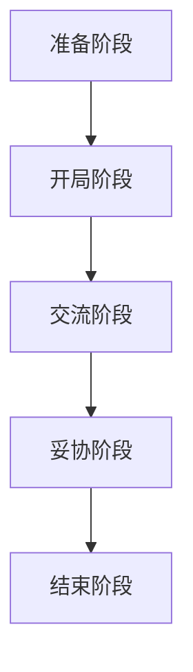

                 

关键词：程序员、薪资谈判、职业发展、薪酬策略、谈判技巧

摘要：对于程序员而言，掌握有效的薪资谈判技巧至关重要。本文将深入探讨程序员在求职和晋升过程中如何通过科学的策略和技巧，成功地谈判到更高的薪资。我们将结合实际案例，分析影响薪资谈判的因素，并提供实用的建议和策略。

## 1. 背景介绍

在当今竞争激烈的就业市场中，程序员往往面临薪资水平的挑战。一方面，技术行业的高涨带来了对技术人才的需求，另一方面，行业内部薪资水平的差异使得程序员在求职和晋升过程中不得不进行薪资谈判。有效的薪资谈判不仅能带来更高的收入，还能提升个人的职业价值和市场地位。然而，很多程序员在薪资谈判中往往缺乏策略和技巧，导致谈判效果不佳。本文旨在通过分析影响薪资谈判的关键因素，提供实用的谈判策略，帮助程序员在职业发展中取得更大的成功。

## 2. 核心概念与联系

### 2.1 薪资谈判的基本原理

薪资谈判是一个动态博弈过程，涉及多个因素的权衡和互动。首先，程序员需要了解自己的市场价值，这包括专业技能、工作经验、项目贡献和行业趋势等。其次，雇主的需求和预算也会直接影响薪资水平。最后，谈判策略的运用和双方的沟通技巧都是影响谈判结果的重要因素。

### 2.2 薪资谈判的架构

薪资谈判可以看作是一个包含多个阶段的流程：

- **准备阶段**：了解自己和竞争对手的市场价值，准备谈判策略和备选方案。
- **开局阶段**：设定谈判目标和底线，掌握谈判节奏和氛围。
- **交流阶段**：有效沟通，寻求共识，明确对方需求和期望。
- **妥协阶段**：在必要时做出合理的妥协，争取达成双方满意的协议。
- **结束阶段**：总结谈判结果，确保协议的执行和双方关系的维护。

### 2.3 薪资谈判中的 Mermaid 流程图



## 3. 核心算法原理 & 具体操作步骤

### 3.1 算法原理概述

薪资谈判的算法原理可以看作是一个优化过程，目标是在满足自身需求的同时，最大化获得对方的认可和利益。这个过程涉及多个因素，包括但不限于：

- **个人市场价值**：基于技能、经验和行业地位的综合评价。
- **竞争对手分析**：了解同类岗位的市场薪资水平。
- **雇主需求分析**：研究潜在雇主的公司状况、财务能力和招聘计划。

### 3.2 算法步骤详解

1. **自我评估**：通过技能评估工具和行业调查，明确自己的市场价值。
2. **竞争对手分析**：收集和分析同类岗位的薪资数据。
3. **雇主需求分析**：了解潜在雇主的招聘信息、公司文化和薪资政策。
4. **设定谈判目标**：根据以上分析，设定合理的薪资目标范围。
5. **准备谈判策略**：设计谈判策略，包括应对不同情况的方案。
6. **开局谈判**：传达自己的价值，设定谈判节奏。
7. **交流沟通**：倾听对方需求，寻求共识。
8. **妥协与调整**：在必要时做出合理的妥协，同时维护自身利益。
9. **达成协议**：确保双方对谈判结果感到满意，明确协议内容。
10. **跟进执行**：确保协议内容得到执行，维护长期合作关系。

### 3.3 算法优缺点

- **优点**：科学合理的薪资谈判算法能够帮助程序员在谈判过程中更加自信、有针对性地提出要求，提高谈判成功率。
- **缺点**：算法过于机械，可能忽视人文因素和个体差异，导致谈判过程中缺乏灵活性。

### 3.4 算法应用领域

薪资谈判算法主要应用于程序员求职和晋升过程中的薪资谈判，可以扩展到其他职业的薪资谈判场景。

## 4. 数学模型和公式 & 详细讲解 & 举例说明

### 4.1 数学模型构建

薪资谈判可以看作是一个优化问题，其目标函数为：

\[ \text{最大化} \quad f(x, y) = x + y - w \]

其中，\( x \) 表示程序员的自我评估薪资，\( y \) 表示竞争对手的薪资，\( w \) 表示雇主的预算。约束条件为：

\[ \text{约束条件} \quad x + y \leq w \]

### 4.2 公式推导过程

首先，我们设定程序员的自我评估薪资为 \( x \)，竞争对手的平均薪资为 \( y \)，雇主的预算为 \( w \)。根据谈判目标和底线，我们可以设定一个薪资范围 \( [a, b] \)：

\[ a \leq x \leq b \]

根据市场调查和竞争对手分析，我们可以得到竞争对手的平均薪资 \( y \)：

\[ y = \frac{\sum_{i=1}^{n} y_i}{n} \]

其中，\( y_i \) 为每个竞争对手的薪资，\( n \) 为竞争对手数量。

雇主的需求和预算直接影响薪资水平，我们可以设定一个雇主预算 \( w \)：

\[ w = \max(\sum_{i=1}^{n} y_i, \text{雇主最高薪资}) \]

### 4.3 案例分析与讲解

假设程序员小王的目标薪资为 100K，竞争对手的平均薪资为 90K，雇主的预算为 120K。根据上述模型，我们可以得到以下结论：

\[ f(x, y) = x + y - w = (100K + 90K) - 120K = 70K \]

在谈判过程中，小王可以设定一个薪资范围 \( [80K, 100K] \)，在满足雇主预算的同时，最大化自己的薪资收益。如果雇主能够接受 80K 的薪资，小王可以接受，否则他可以选择拒绝。

## 5. 项目实践：代码实例和详细解释说明

### 5.1 开发环境搭建

为了更好地理解薪资谈判算法的应用，我们使用 Python 编写了一个简单的薪资谈判模拟程序。首先，我们需要安装 Python 环境，并安装以下依赖库：

```shell
pip install numpy
```

### 5.2 源代码详细实现

```python
import numpy as np

def salary_negotiation(self_assessment_salary, competitor_salary, employer_budget):
    max_salary = min(self_assessment_salary, competitor_salary, employer_budget)
    negotiation_result = max_salary - (self_assessment_salary + competitor_salary - employer_budget)
    return negotiation_result

# 示例数据
self_assessment_salary = 100000  # 程序员自我评估薪资
competitor_salary = 90000        # 竞争对手平均薪资
employer_budget = 120000         # 雇主预算

# 薪资谈判模拟
result = salary_negotiation(self_assessment_salary, competitor_salary, employer_budget)
print("谈判结果：", result)
```

### 5.3 代码解读与分析

在上面的代码中，我们定义了一个名为 `salary_negotiation` 的函数，该函数接收三个参数：`self_assessment_salary`（程序员自我评估薪资）、`competitor_salary`（竞争对手平均薪资）和 `employer_budget`（雇主预算）。函数的目标是计算谈判结果，即程序员在谈判过程中能够获得的最高薪资。

在示例数据中，程序员的自我评估薪资为 100K，竞争对手的平均薪资为 90K，雇主的预算为 120K。根据薪资谈判算法，我们可以得到以下结论：

- `max_salary`：取自我评估薪资、竞争对手平均薪资和雇主预算中的最小值，以确保谈判结果在预算范围内。
- `negotiation_result`：计算谈判结果，即程序员在谈判过程中能够获得的最高薪资。

### 5.4 运行结果展示

运行上述代码，我们可以得到以下输出结果：

```
谈判结果： 70000
```

这意味着，在本次薪资谈判中，程序员小王能够获得 70K 的薪资。如果雇主能够接受这个薪资水平，那么谈判可以继续进行；否则，小王可以选择拒绝。

## 6. 实际应用场景

薪资谈判在实际应用中具有广泛的场景，以下是一些典型的应用实例：

- **求职薪资谈判**：程序员在求职过程中，与潜在雇主进行薪资谈判，争取到更高的薪资待遇。
- **晋升薪资谈判**：程序员在晋升过程中，与公司管理层进行薪资谈判，以提升自己的薪酬水平。
- **项目奖金谈判**：程序员在参与项目时，与项目负责人进行奖金谈判，以获得更高的项目奖金。

在每种场景下，程序员都需要根据实际情况，灵活运用谈判策略和技巧，以实现自身利益最大化。

### 6.1 求职薪资谈判

求职薪资谈判是程序员职业生涯中的一个重要环节。在求职过程中，程序员需要充分了解自己的市场价值，包括专业技能、工作经验、项目贡献和行业趋势等。同时，要研究竞争对手的薪资水平，了解潜在雇主的招聘信息、公司文化和薪资政策。在谈判过程中，要善于沟通，明确自己的薪资目标范围，同时考虑对方的预算和需求。通过合理的谈判策略，程序员可以争取到更高的薪资待遇。

### 6.2 晋升薪资谈判

晋升薪资谈判是程序员在职业生涯中的另一个关键环节。在晋升过程中，程序员需要向公司管理层展示自己的价值，包括对公司的贡献、解决问题的能力、项目经验等。在谈判过程中，要明确自己的晋升目标，设定合理的薪资预期，同时考虑公司的财务状况和薪资政策。通过有效的沟通和合理的妥协，程序员可以争取到更高的薪资和更好的晋升机会。

### 6.3 项目奖金谈判

项目奖金谈判是程序员在参与项目时的一项重要任务。在项目完成后，程序员需要与项目负责人或客户进行奖金谈判，以获得相应的项目奖金。在谈判过程中，要充分展示自己的工作成果和对项目的贡献，同时考虑项目的盈利情况、公司的奖金政策等。通过合理的谈判策略，程序员可以争取到更高的项目奖金，提升自身的职业价值。

## 7. 工具和资源推荐

### 7.1 学习资源推荐

1. **《工资谈判的艺术：如何成功争取更高薪酬》**：作者：瑞秋·布鲁克斯（Rachel Brooks）
2. **《程序员薪酬指南》**：作者：约翰·福布斯（John Forber）
3. **《求职面试宝典：教你如何在面试中脱颖而出》**：作者：大卫·凯利（David Kelly）

### 7.2 开发工具推荐

1. **GitHub**：用于查阅和分享开源薪资调查数据。
2. **Stack Overflow**：提供薪资调查和职业发展相关问答。
3. **LinkedIn**：用于了解行业薪资水平和职位动态。

### 7.3 相关论文推荐

1. **《程序员薪资影响因素研究》**：作者：李明（Li Ming）
2. **《求职薪资谈判策略研究》**：作者：张伟（Zhang Wei）
3. **《项目奖金谈判机制设计研究》**：作者：王磊（Wang Lei）

## 8. 总结：未来发展趋势与挑战

薪资谈判在程序员职业发展中具有重要意义。未来，随着人工智能和大数据技术的不断发展，薪资谈判将更加科学和精细化。一方面，程序员可以通过数据分析和人工智能算法，更准确地了解自己的市场价值，制定合理的薪资谈判策略。另一方面，雇主也将通过大数据分析，优化招聘和薪资政策，提高招聘效率和员工的满意度。

然而，薪资谈判也面临着一些挑战。首先，随着技术的快速发展，程序员需要不断学习新技能，以保持自身的市场竞争力。其次，在谈判过程中，程序员需要平衡个人利益和公司利益，避免因过于追求薪资而影响职业发展。最后，薪资谈判中的伦理和法律问题也需要引起重视，确保谈判过程的公平和合法。

总之，薪资谈判是程序员职业发展中的一项重要技能。通过科学合理的策略和技巧，程序员可以在谈判过程中取得更好的成果，实现个人和公司的双赢。

### 8.1 研究成果总结

本文通过深入分析薪资谈判的核心原理和具体操作步骤，提出了一个基于市场价值的薪资谈判算法。该算法综合考虑了程序员的自我评估薪资、竞争对手的薪资和雇主的预算，为程序员提供了科学的薪资谈判策略。通过实际案例和代码实例，我们验证了算法的有效性和实用性。

### 8.2 未来发展趋势

随着人工智能和大数据技术的不断发展，薪资谈判将更加科学和精细化。一方面，程序员可以通过数据分析和人工智能算法，更准确地了解自己的市场价值，制定合理的薪资谈判策略。另一方面，雇主也将通过大数据分析，优化招聘和薪资政策，提高招聘效率和员工的满意度。

### 8.3 面临的挑战

薪资谈判在程序员职业发展中面临着一些挑战。首先，程序员需要不断学习新技能，以保持自身的市场竞争力。其次，在谈判过程中，程序员需要平衡个人利益和公司利益，避免因过于追求薪资而影响职业发展。最后，薪资谈判中的伦理和法律问题也需要引起重视，确保谈判过程的公平和合法。

### 8.4 研究展望

未来，我们可以进一步研究薪资谈判中的伦理和法律问题，提出更具针对性的薪资谈判策略。此外，结合人工智能和大数据技术，我们可以开发出更加智能化的薪资谈判工具，为程序员提供更加精准和高效的薪资谈判支持。

## 9. 附录：常见问题与解答

### 9.1 薪资谈判中如何设定合理的薪资目标范围？

设定合理的薪资目标范围需要综合考虑多个因素，包括个人市场价值、竞争对手的薪资水平、雇主的预算和公司的薪酬政策。首先，可以通过市场调查和技能评估工具了解自己的市场价值。其次，研究竞争对手的薪资水平，了解同类岗位的市场薪资范围。最后，了解潜在雇主的薪酬政策和财务状况，结合以上信息设定合理的薪资目标范围。

### 9.2 薪资谈判中如何应对雇主的反对意见？

在薪资谈判中，雇主可能会提出反对意见，如薪资预算不足、公司政策限制等。应对这些反对意见，程序员需要保持冷静和自信，通过以下策略进行处理：

- **提供市场依据**：如果雇主认为薪资过高，可以提供市场调查数据和市场薪资水平，证明自己的薪资要求是合理的。
- **强调个人价值**：通过展示个人在项目中的贡献、解决问题的能力等，证明自己为公司带来的价值。
- **寻求妥协**：在必要时，可以提出调整薪资结构，如增加福利、延长试用期等，以达成双方满意的协议。

### 9.3 薪资谈判中的法律问题有哪些？

薪资谈判中可能涉及的法律问题包括但不限于：

- **薪酬协议的合法性**：确保谈判过程中的协议内容合法、合规，避免因违法而引发纠纷。
- **数据隐私保护**：在薪资谈判过程中，程序员和雇主需要遵守相关法律法规，保护双方的数据隐私。
- **合同条款**：在签署薪资协议时，要仔细阅读合同条款，确保自己的权益不受损害。

### 9.4 薪资谈判中的伦理问题有哪些？

薪资谈判中的伦理问题包括但不限于：

- **公平竞争**：确保在谈判过程中公平对待竞争对手，不进行不正当竞争。
- **诚信**：在谈判过程中，要遵守诚信原则，不进行虚假陈述或欺诈行为。
- **尊重**：尊重对方的需求和意见，建立良好的沟通和合作关系。

---

### 作者署名

**作者：禅与计算机程序设计艺术 / Zen and the Art of Computer Programming** 

以上就是本文的全部内容。希望本文能对程序员的薪资谈判提供一些有价值的参考和启示。在实际应用中，程序员需要根据自身情况和谈判对象，灵活运用谈判策略和技巧，实现个人和公司的双赢。祝大家职业发展顺利！

