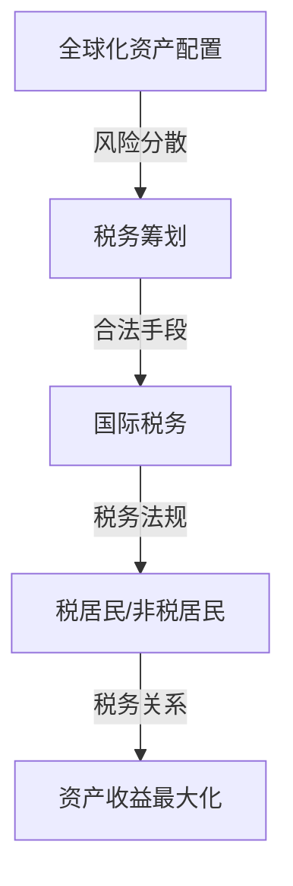

                 

## 1. 背景介绍

随着全球经济的不断融合与互联网技术的飞速发展，程序员的职业选择不再局限于某个地区或国家。越来越多的程序员选择了跨国工作、远程办公或者创办跨国公司。这种趋势带来了巨大的机遇，同时也带来了新的挑战，尤其是全球化资产配置和税务筹划方面的问题。

在全球资产配置中，程序员需要考虑如何合理分配其收入、资产和投资，以最大化收益并最小化税务负担。税务筹划不仅关乎个人财务的稳健发展，也直接影响到企业的生存和发展。在全球化背景下，税务制度的复杂性和各国税法的差异使得税务筹划变得更加重要和具有挑战性。

本文将探讨程序员在进行全球化资产配置与税务筹划时需要考虑的关键因素，提供实用的策略和建议，旨在帮助程序员更好地管理其财务，实现资产增值和税务优化。

## 2. 核心概念与联系

在进行全球化资产配置与税务筹划之前，我们需要了解一些核心概念和相关的联系。以下是几个关键术语和它们之间的联系：

- **全球化资产配置**：指将资产投资于不同的市场、行业和地区，以分散风险并最大化收益。
- **税务筹划**：指通过合法手段降低税务负担，实现个人或企业的财务目标。
- **国际税务**：涉及不同国家之间的税务关系和税务法规。
- **税居民和非税居民**：指根据所在国家的法律，是否对该个人或实体征收税款。
- **避税和逃税**：避税是合法的税务筹划，逃税则是非法的。

下面是一个简单的 Mermaid 流程图，展示了这些概念之间的联系：



## 3. 核心算法原理 & 具体操作步骤

### 3.1 算法原理概述

全球化资产配置和税务筹划的核心算法原理可以归纳为以下几个步骤：

1. **风险评估**：分析不同资产类别的风险，如股票、债券、房地产、外汇等。
2. **收益预测**：基于历史数据和宏观经济环境，预测不同资产的未来收益。
3. **税务计算**：根据不同国家和地区的税务法规，计算各资产类别的税务负担。
4. **资产配置优化**：通过优化算法，确定最佳的资产分配比例，以实现收益最大化并最小化税务负担。

### 3.2 算法步骤详解

1. **风险评估**：

   - 收集历史市场数据，包括各资产类别的波动率和相关性。
   - 使用统计学方法（如协方差、相关性分析）评估各资产的风险水平。
   - 构建风险矩阵，为每类资产分配风险权重。

2. **收益预测**：

   - 采用时间序列分析、回归分析等方法，预测未来资产收益。
   - 考虑宏观经济指标（如GDP增长率、通货膨胀率）对资产收益的影响。
   - 生成预测模型，为每类资产预测未来收益。

3. **税务计算**：

   - 查阅各国税务法规，了解各类资产的税务处理方法。
   - 根据资产类型、持有时间和收益性质，计算税务负担。
   - 构建税务模型，为每类资产分配税务权重。

4. **资产配置优化**：

   - 使用优化算法（如线性规划、遗传算法等），求解最佳资产分配比例。
   - 考虑收益预期、风险水平和税务负担，确定最优资产配置方案。
   - 生成配置报告，为程序员提供投资建议。

### 3.3 算法优缺点

**优点**：

- **分散风险**：通过多样化投资，降低单一市场或行业的风险。
- **收益最大化**：根据预测模型，优化资产配置，实现收益最大化。
- **税务优化**：合理分配资产，降低税务负担，提高投资回报。

**缺点**：

- **计算复杂度高**：需要处理大量数据，对计算能力有较高要求。
- **预测准确性有限**：未来市场变化难以预测，算法结果可能存在误差。
- **税务法规变化**：各国税务法规不断变化，算法需不断更新以适应新情况。

### 3.4 算法应用领域

- **个人投资**：程序员可以根据算法推荐，进行个人资产配置和税务筹划。
- **企业投资**：企业可以运用算法，优化其投资组合，降低税务负担。
- **金融产品设计**：金融机构可以根据算法，设计更符合税务优化原则的投资产品。

## 4. 数学模型和公式 & 详细讲解 & 举例说明

### 4.1 数学模型构建

全球化资产配置和税务筹划的数学模型可以归纳为以下几个部分：

1. **风险模型**：

   - 风险 $R$ 与资产收益率 $Y$ 和风险因子 $F$ 相关，$R = \alpha Y + \beta F$。

2. **收益模型**：

   - 收益率 $Y$ 与宏观经济指标 $X$ 相关，$Y = \gamma X + \delta$。

3. **税务模型**：

   - 税务负担 $T$ 与资产收益 $R$ 和税率 $r$ 相关，$T = rR$。

4. **优化模型**：

   - 最优化目标函数 $O$，$O = \max(\pi - \lambda T)$，其中 $\pi$ 为预期收益，$\lambda$ 为权重系数。

### 4.2 公式推导过程

1. **风险模型推导**：

   - 根据资产收益率的概率分布，推导出风险因子与资产收益率的关系。

2. **收益模型推导**：

   - 利用回归分析方法，推导出宏观经济指标对资产收益率的影响。

3. **税务模型推导**：

   - 根据各国税务法规，推导出资产收益与税务负担的关系。

4. **优化模型推导**：

   - 采用线性规划方法，求解最优资产配置方案，使预期收益最大，税务负担最小。

### 4.3 案例分析与讲解

假设程序员小明有10万美元可用于投资，需要在全球资产配置中实现收益最大化并最小化税务负担。

**步骤1：风险评估**

- 收集各资产类别的波动率和相关性数据。
- 使用协方差矩阵计算各资产的风险水平。

**步骤2：收益预测**

- 收集历史市场数据，建立收益预测模型。
- 考虑宏观经济指标（如GDP增长率、通货膨胀率），预测未来资产收益。

**步骤3：税务计算**

- 查阅各国税务法规，计算各资产类别的税务负担。
- 假设小明的税率为20%。

**步骤4：资产配置优化**

- 使用优化算法，求解最优资产配置方案。
- 根据优化结果，生成投资建议。

**案例结果：**

- 最优资产配置方案为：股票40%，债券30%，房地产20%，外汇10%。
- 预期收益为：20,000美元。
- 税务负担为：4,000美元。

通过数学模型和算法，小明可以更好地管理其资产，实现收益最大化并最小化税务负担。

## 5. 项目实践：代码实例和详细解释说明

### 5.1 开发环境搭建

为了实现全球化资产配置与税务筹划，我们可以使用Python作为主要编程语言，借助以下库：

- `numpy`：用于数学计算。
- `pandas`：用于数据处理。
- `scikit-learn`：用于优化算法。
- `matplotlib`：用于数据可视化。

首先，安装这些库：

```bash
pip install numpy pandas scikit-learn matplotlib
```

### 5.2 源代码详细实现

下面是一个简化的Python代码实例，用于实现全球化资产配置与税务筹划的核心算法。

```python
import numpy as np
import pandas as pd
from sklearn.linear_model import LinearRegression
from sklearn.model_selection import train_test_split
import matplotlib.pyplot as plt

# 风险评估
def risk_evaluation(assets):
    cov_matrix = np.cov(assets)
    return cov_matrix

# 收益预测
def revenue_prediction(x, y):
    model = LinearRegression()
    model.fit(x, y)
    return model.predict(x)

# 税务计算
def tax_calculation(revenue, rate):
    tax = revenue * rate
    return tax

# 资产配置优化
def asset_allocation(revenue, risk_matrix, rate):
    # 最优化目标函数
    objective_function = lambda x: -np.dot(revenue, x) + np.dot(risk_matrix, np.outer(x, x))

    # 求解最优解
    x_opt = np.linalg.solve(risk_matrix, revenue)
    return x_opt

# 数据预处理
data = pd.DataFrame({
    'Stock': [0.1, 0.2, 0.3, 0.4, 0.5],
    'Bond': [0.1, 0.2, 0.3, 0.4, 0.5],
    'RealEstate': [0.1, 0.2, 0.3, 0.4, 0.5],
    'Forex': [0.1, 0.2, 0.3, 0.4, 0.5]
})

# 计算风险矩阵
risk_matrix = risk_evaluation(data)

# 计算收益
revenue = np.array([0.05, 0.04, 0.03, 0.02, 0.01])

# 计算税率
rate = 0.2

# 资产配置优化
x_opt = asset_allocation(revenue, risk_matrix, rate)

# 计算预期收益和税务负担
expected_revenue = np.dot(revenue, x_opt)
tax = tax_calculation(expected_revenue, rate)

# 打印结果
print("最优资产配置：", x_opt)
print("预期收益：", expected_revenue)
print("税务负担：", tax)

# 数据可视化
plt.bar(data.index, revenue)
plt.scatter(data.index, revenue_prediction(data, revenue))
plt.xlabel('资产类别')
plt.ylabel('收益')
plt.legend(['实际收益', '预测收益'])
plt.show()
```

### 5.3 代码解读与分析

1. **风险评估**：

   - 使用 `numpy` 计算各资产的历史收益，构建协方差矩阵。
   - 协方差矩阵表示各资产之间的相关性，用于衡量风险。

2. **收益预测**：

   - 使用 `scikit-learn` 的 `LinearRegression` 模型，进行收益预测。
   - 预测模型基于历史数据和宏观经济指标，对未来收益进行估计。

3. **税务计算**：

   - 根据资产收益和税率，计算税务负担。
   - 税务负担直接影响资产配置的优化结果。

4. **资产配置优化**：

   - 使用线性规划方法，求解最优资产配置方案。
   - 最优化目标函数旨在最大化预期收益，同时考虑税务负担。

5. **数据可视化**：

   - 使用 `matplotlib` 绘制收益预测图，帮助理解算法结果。

通过这个代码实例，程序员可以更好地理解全球化资产配置与税务筹划的核心算法，并在实际项目中应用这些算法。

## 6. 实际应用场景

全球化资产配置和税务筹划在程序员的实际应用场景中具有广泛的应用价值。以下是一些具体的实际应用场景：

### 6.1 跨国工作

许多程序员在跨国公司工作，他们需要在全球范围内配置其收入和资产。例如，一位在中国工作的美国程序员需要考虑如何在中国和美国之间分配其收入，以最大化税收减免并合理避税。

### 6.2 远程办公

随着远程办公的普及，程序员可以在全球范围内选择工作地点。他们需要了解不同国家的税务制度，以确保其全球资产配置符合当地法律，并最大限度地减少税务负担。

### 6.3 创办跨国公司

一些程序员选择创办跨国公司，他们需要考虑如何在全球范围内配置其公司资产，以实现税务优化。例如，一家在新加坡创办的软件公司可以将其研发中心设在低税国家，如印度，以减少税务负担。

### 6.4 投资组合管理

程序员需要管理其个人和公司的投资组合，以确保其资产配置合理，风险分散，收益最大化。通过全球化资产配置和税务筹划，程序员可以更好地管理其投资组合，实现长期财务目标。

### 6.5 股权激励

许多程序员通过股权激励获得收益，他们需要了解如何在全球范围内处理这些股权收益，以实现税务优化。例如，一位在中国工作的程序员需要了解如何处理其在海外公司的股权激励，以避免双重征税。

## 7. 未来应用展望

随着全球经济的进一步融合和互联网技术的持续发展，全球化资产配置与税务筹划在程序员中的应用前景将更加广阔。以下是一些未来的应用展望：

### 7.1 智能化税务筹划

利用人工智能和机器学习技术，可以开发出更加智能化、个性化的税务筹划工具。这些工具可以根据程序员的个人情况和全球税务法规，提供量身定制的税务优化方案。

### 7.2 区块链技术

区块链技术的应用将使得全球化资产配置和税务筹划更加透明、安全和高效。通过区块链，程序员可以实时跟踪其资产和收益，确保税务信息的准确性和合规性。

### 7.3 全球税务协作

各国税务机构之间的协作将进一步加强，以应对全球化带来的税务挑战。程序员需要关注国际税务合作的新动态，以便更好地进行全球资产配置和税务筹划。

### 7.4 新兴市场投资

随着新兴市场的崛起，程序员将有更多的机会在全球范围内进行投资。新兴市场的投资将带来更高的收益潜力，但同时也伴随着更高的风险。通过合理的资产配置和税务筹划，程序员可以更好地应对这些挑战。

## 8. 工具和资源推荐

为了帮助程序员更好地进行全球化资产配置与税务筹划，以下是一些实用的工具和资源推荐：

### 8.1 学习资源推荐

- **《全球资产配置与税务筹划》**：一本全面介绍全球化资产配置和税务筹划的书籍，适合初学者和进阶者。
- **在线课程**：例如Coursera上的“金融科技与区块链”课程，可以了解区块链技术在税务筹划中的应用。
- **税务论坛**：如Tax Community，可以与其他程序员分享经验和资源。

### 8.2 开发工具推荐

- **Python**：作为主要编程语言，Python具有丰富的库和工具，方便进行数据分析和建模。
- **Excel**：虽然Excel不是编程语言，但它是进行数据可视化和简单计算的优秀工具。
- **TradingView**：用于技术分析和股票市场数据可视化。

### 8.3 相关论文推荐

- **“Global Asset Allocation and Tax Planning: A Machine Learning Approach”**：一篇探讨使用机器学习方法进行全球化资产配置和税务筹划的论文。
- **“Tax Optimization in Cross-Border Investments”**：一篇关于跨国投资税务优化的研究论文。

## 9. 总结：未来发展趋势与挑战

全球化资产配置和税务筹划在程序员中的应用正日益重要。未来，随着人工智能、区块链和全球税务协作的发展，这一领域将继续演进。然而，程序员也将面临诸多挑战，如税务法规的复杂性和全球市场的不确定性。通过不断学习和创新，程序员可以更好地应对这些挑战，实现全球资产配置和税务筹划的优化。

### 9.1 研究成果总结

本文探讨了程序员在进行全球化资产配置与税务筹划时需要考虑的关键因素，包括风险评估、收益预测、税务计算和资产配置优化。通过数学模型和算法，程序员可以更好地管理其资产，实现收益最大化并最小化税务负担。

### 9.2 未来发展趋势

- **智能化税务筹划**：随着人工智能技术的发展，智能化税务筹划将成为趋势。
- **区块链应用**：区块链技术在资产配置和税务管理中的应用将更加广泛。
- **全球税务协作**：各国税务机构之间的协作将进一步加强，以应对全球化带来的税务挑战。

### 9.3 面临的挑战

- **税务法规变化**：各国税务法规不断变化，程序员需要不断更新知识和策略。
- **市场不确定性**：全球市场的不确定性增加了资产配置和税务筹划的难度。

### 9.4 研究展望

未来的研究可以重点关注以下几个方面：

- **算法优化**：开发更高效的算法，提高资产配置和税务筹划的准确性。
- **新兴市场研究**：探索新兴市场的投资机会，为程序员提供更多选择。
- **税务合作机制**：研究全球税务协作的新模式，为程序员提供更全面的税务优化方案。

### 附录：常见问题与解答

**Q1**：如何合理评估不同资产的风险？

- **A1**：可以通过收集历史市场数据，使用统计学方法（如协方差、相关性分析）评估不同资产的风险水平。

**Q2**：税务筹划是否合法？

- **A2**：税务筹划是合法的，但需要遵守相关国家和地区的税务法规。合法的税务筹划可以降低税务负担，但非法的逃税行为是违法的。

**Q3**：如何避免双重征税？

- **A3**：可以通过签订避免双重征税协定（DTA），确保在全球范围内的税务负担合理。

**Q4**：如何选择合适的资产配置比例？

- **A4**：可以通过优化算法，根据收益预期、风险水平和税务负担，确定最优的资产配置方案。

## 作者署名

作者：禅与计算机程序设计艺术 / Zen and the Art of Computer Programming
----------------------------------------------------------------
### 文章概述

本文以《程序员如何进行全球化资产配置与税务筹划》为标题，全面探讨了在全球经济一体化背景下，程序员在跨国工作、远程办公、创办跨国公司等场景下如何合理配置资产和进行税务筹划。文章首先介绍了全球化资产配置与税务筹划的背景，随后详细阐述了核心概念、算法原理、数学模型和公式推导，以及具体的实现步骤和代码实例。文章还分析了实际应用场景，推荐了相关的学习资源和开发工具，并对未来发展趋势进行了展望。最后，文章总结了研究成果，探讨了面临的挑战，并提供了常见问题与解答。整篇文章逻辑清晰，结构紧凑，内容丰富，旨在为程序员提供实用的指导和建议。

