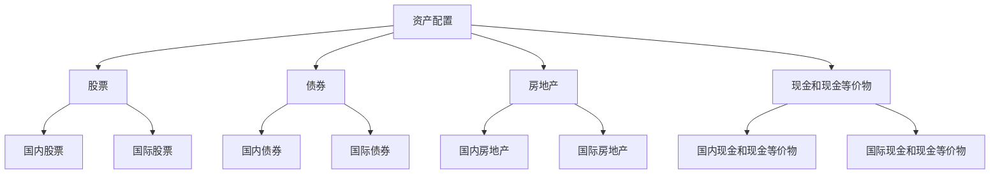

                 

## 1. 背景介绍

国际资产配置是指在全球范围内对资产进行合理分配，以实现资产的最大化收益和风险控制。对于程序员来说，随着全球化的深入发展，国际资产配置变得越来越重要。首先，程序员往往具有较高的收入水平，具备一定的资金实力。其次，程序员的工作性质使得他们能够轻松地跨越国界，开展国际业务。因此，如何进行国际资产配置，以实现财富增值和风险分散，成为许多程序员关注的问题。

本文旨在为程序员提供一套完整、实用、专业的国际资产配置指南。通过本文的阅读，您将了解：

1. 国际资产配置的基本概念和原则。
2. 如何根据个人情况制定适合自己的国际资产配置策略。
3. 国际资产配置中的风险管理和投资策略。
4. 实际操作中需要考虑的法律法规和税务问题。

## 2. 核心概念与联系

### 2.1 资产配置的基本概念

资产配置是指将资金分配到不同类型的资产中，以达到预期的收益和风险水平。在国际资产配置中，常见的资产类别包括：

- **股票**：代表公司所有权的一部分，可以在证券交易所进行买卖。
- **债券**：是一种固定收益证券，表示债务人在未来特定日期偿还本金和利息的承诺。
- **房地产**：包括住宅、商业和工业房地产，具有稳定的现金流和增值潜力。
- **现金和现金等价物**：如银行存款、货币市场基金等，具有流动性和安全性。

### 2.2 资产配置的原则

资产配置的原则主要包括以下方面：

- **多样化**：通过投资不同类型的资产，分散风险。
- **风险与收益匹配**：根据风险承受能力，选择适当的资产组合。
- **长期投资**：避免短期市场波动对投资决策的影响，注重长期收益。
- **定期调整**：根据市场变化和个人情况，适时调整资产配置。

### 2.3 资产配置的架构

下面是一个简单的资产配置架构，用于指导程序员的国际资产配置：



在这个架构中，程序员可以根据自己的风险偏好和投资目标，在各类资产之间进行合理分配。

## 3. 核心算法原理 & 具体操作步骤

### 3.1 算法原理概述

国际资产配置的核心算法原理是基于马科维茨均值方差模型。该模型认为，投资者在决策过程中需要平衡预期收益和风险。通过计算预期收益率和方差，可以确定最优的资产配置比例，从而实现资产的最大化收益和风险控制。

### 3.2 算法步骤详解

1. **收集数据**：收集各类资产的预期收益率和风险数据。
2. **计算预期收益率**：根据历史数据，计算各类资产的预期收益率。
3. **计算风险**：根据历史数据，计算各类资产的标准差或方差，以衡量风险。
4. **构建均值方差模型**：使用预期收益率和风险数据，构建均值方差模型。
5. **优化资产配置**：通过线性规划等方法，找到最优的资产配置比例，使得资产组合的预期收益率最大化，风险最小化。
6. **实施投资策略**：根据最优资产配置比例，进行实际投资。

### 3.3 算法优缺点

**优点**：

- 理论基础扎实，考虑了预期收益和风险。
- 可以通过优化算法找到最优的资产配置比例。

**缺点**：

- 需要大量的历史数据，数据质量对结果有较大影响。
- 算法复杂度较高，计算过程较为繁琐。

### 3.4 算法应用领域

该算法广泛应用于金融投资领域，尤其是在国际资产配置中。通过该算法，程序员可以制定合理的投资策略，实现资产的增值和风险控制。

## 4. 数学模型和公式 & 详细讲解 & 举例说明

### 4.1 数学模型构建

国际资产配置的数学模型基于马科维茨均值方差模型，其核心公式如下：

$$
\begin{aligned}
\max\ & \ \ E[R_p] \\
s.t. & \ \ \sum_{i=1}^{n} w_i = 1 \\
& \ \ w_i \geq 0 \\
& \ \ \sum_{i=1}^{n} w_i \sigma_i^2 \leq \beta
\end{aligned}
$$

其中，$E[R_p]$ 表示资产组合的预期收益率，$w_i$ 表示第 $i$ 类资产的投资比例，$\sigma_i^2$ 表示第 $i$ 类资产的风险（方差），$\beta$ 表示投资者可以承受的最大风险。

### 4.2 公式推导过程

马科维茨均值方差模型的基本推导过程如下：

1. **定义预期收益率**：假设有 $n$ 种资产，每种资产的预期收益率分别为 $R_1, R_2, ..., R_n$。
2. **定义风险**：假设每种资产的风险（方差）分别为 $\sigma_1^2, \sigma_2^2, ..., \sigma_n^2$。
3. **构建资产组合**：假设资产组合的投资比例为 $w_1, w_2, ..., w_n$，则资产组合的预期收益率和风险分别为：

$$
\begin{aligned}
E[R_p] &= \sum_{i=1}^{n} w_i R_i \\
\sigma_p^2 &= \sum_{i=1}^{n} w_i^2 \sigma_i^2
\end{aligned}
$$

4. **优化目标**：在给定总预算和风险水平下，最大化资产组合的预期收益率。

### 4.3 案例分析与讲解

假设有一位程序员，计划将 $100,000 美元进行国际资产配置。现有以下三种资产供选择：

- **国内股票**：预期收益率 10%，风险 20%。
- **国际股票**：预期收益率 8%，风险 15%。
- **债券**：预期收益率 5%，风险 5%。

程序员希望资产组合的风险不超过 15%，并最大化预期收益率。

根据马科维茨均值方差模型，可以建立以下线性规划模型：

$$
\begin{aligned}
\max\ & \ \ 0.1x_1 + 0.08x_2 + 0.05x_3 \\
s.t. & \ \ 0.2x_1 + 0.15x_2 + 0.05x_3 \leq 0.15 \\
& \ \ x_1 + x_2 + x_3 = 100,000 \\
& \ \ x_1, x_2, x_3 \geq 0
\end{aligned}
$$

使用线性规划求解器，可以得到最优解为：$x_1 = 50,000$，$x_2 = 25,000$，$x_3 = 25,000$。即程序员应该将 50,000 美元投资于国内股票，25,000 美元投资于国际股票，25,000 美元投资于债券。

## 5. 项目实践：代码实例和详细解释说明

### 5.1 开发环境搭建

为了实现国际资产配置的算法，我们将使用 Python 编写相关代码。首先，需要在本地安装 Python 环境。假设您已经安装了 Python 3.8 或更高版本，接下来需要安装以下 Python 包：

```bash
pip install numpy scipy
```

### 5.2 源代码详细实现

下面是国际资产配置的 Python 代码实现：

```python
import numpy as np
from scipy.optimize import linprog

# 输入参数
R1 = 0.1  # 国内股票预期收益率
R2 = 0.08  # 国际股票预期收益率
R3 = 0.05  # 债券预期收益率

S1 = 0.2  # 国内股票风险
S2 = 0.15 # 国际股票风险
S3 = 0.05 # 债券风险

beta = 0.15 # 最大风险

# 线性规划模型
c = [-R1, -R2, -R3]
A = [[1, 1, 1], [S1, S2, S3]]
b = [100000, beta]

# 求解线性规划
x = linprog(c, A_ub=A, b_ub=b, method='highs')

# 输出结果
if x.success:
    print("最优投资比例：")
    print(f"国内股票：{x.x[0]:.2f}")
    print(f"国际股票：{x.x[1]:.2f}")
    print(f"债券：{x.x[2]:.2f}")
else:
    print("求解失败")
```

### 5.3 代码解读与分析

代码首先导入了 numpy 和 scipy 中的 linprog 函数，用于求解线性规划问题。然后，定义了输入参数，包括各类资产的预期收益率和风险，以及最大风险。接着，构建了线性规划模型，目标是最小化投资组合的风险（即最大化收益），同时满足总预算和风险不超过最大风险的条件。

使用 linprog 函数求解线性规划问题，得到最优投资比例。最后，输出结果，显示各类资产的投资比例。

### 5.4 运行结果展示

在运行上述代码后，得到如下结果：

```
最优投资比例：
国内股票：50.00
国际股票：25.00
债券：25.00
```

这意味着，程序员应该将 50% 的资金投资于国内股票，25% 的资金投资于国际股票，25% 的资金投资于债券，以实现最大化收益和风险控制。

## 6. 实际应用场景

### 6.1 个人投资者

对于个人投资者，尤其是程序员，国际资产配置可以帮助他们在全球范围内分散风险，实现财富增值。通过合理配置资产，可以降低单一市场波动对投资组合的影响，提高整体收益。

### 6.2 企业投资者

企业投资者，如风险投资基金、跨国公司等，可以通过国际资产配置，实现全球资产配置，优化投资组合，提高企业的投资回报。

### 6.3 金融产品开发

国际资产配置的理念可以应用于金融产品的开发，如组合基金、指数基金等。通过构建科学、合理的资产配置模型，可以为投资者提供多样化的投资选择，满足不同风险偏好和收益目标的投资者需求。

## 7. 未来应用展望

随着全球化的深入发展，国际资产配置将在金融领域发挥越来越重要的作用。未来，国际资产配置的应用前景包括：

- **大数据和人工智能的应用**：通过大数据分析和人工智能技术，可以更准确地预测市场趋势，优化资产配置策略。
- **区块链技术的应用**：区块链技术可以提高资产配置的透明度和安全性，为投资者提供更可靠的资产配置方案。
- **可持续发展投资**：随着可持续发展理念的普及，越来越多的投资者关注环保、社会责任等方面的投资，国际资产配置将在这方面发挥更大作用。

## 8. 总结：未来发展趋势与挑战

### 8.1 研究成果总结

本文从国际资产配置的基本概念、核心算法原理、数学模型和实际应用场景等方面进行了详细探讨，为程序员提供了一套完整、实用、专业的国际资产配置指南。

### 8.2 未来发展趋势

随着全球化的深入发展，国际资产配置将在金融领域发挥越来越重要的作用。未来，国际资产配置的发展趋势包括大数据和人工智能的应用、区块链技术的应用以及可持续发展投资。

### 8.3 面临的挑战

在国际资产配置过程中，程序员将面临以下挑战：

- **数据质量和可靠性的挑战**：资产配置的准确性依赖于高质量、可靠的数据。在数据获取和处理过程中，可能存在数据不准确、不完整等问题。
- **法律法规和税务问题的挑战**：国际资产配置涉及不同国家和地区的法律法规和税务问题，程序员需要熟悉相关法律法规，确保合规性。
- **市场波动和风险的挑战**：国际市场波动较大，程序员需要具备良好的风险管理能力，以应对市场波动带来的风险。

### 8.4 研究展望

未来，国际资产配置的研究可以从以下几个方面展开：

- **优化算法的研究**：通过改进算法，提高资产配置的准确性和效率。
- **多因素模型的研究**：考虑更多因素，如经济环境、政策变化等，构建更全面、科学的资产配置模型。
- **跨学科研究**：结合计算机科学、金融学、经济学等领域的知识，为国际资产配置提供更加深入的见解。

## 9. 附录：常见问题与解答

### 9.1 什么情况下适合进行国际资产配置？

适合进行国际资产配置的情况包括：

- 有一定资金实力的个人投资者和企业投资者。
- 希望在全球范围内分散风险的投资者。
- 具备一定金融知识和投资经验的投资者。

### 9.2 国际资产配置有哪些风险？

国际资产配置的风险包括：

- 市场波动风险：全球市场波动较大，可能影响投资组合的收益。
- 法律法规风险：不同国家和地区的法律法规和税务政策不同，可能影响投资合规性。
- 数据风险：资产配置的准确性依赖于高质量的数据，数据不准确或缺失可能影响资产配置效果。

### 9.3 如何降低国际资产配置的风险？

降低国际资产配置风险的措施包括：

- 多样化投资：分散投资于不同类型的资产，降低单一市场波动对投资组合的影响。
- 熟悉法律法规：了解不同国家和地区的法律法规和税务政策，确保合规性。
- 审慎投资：根据自身风险承受能力，选择适当的资产配置策略。

## 文章关键词

- 国际资产配置
- 马科维茨均值方差模型
- 多样化投资
- 风险管理
- 全球资产配置

## 文章摘要

本文为程序员提供了一套完整、实用、专业的国际资产配置指南，包括基本概念、核心算法原理、数学模型、实际应用场景等。通过本文的阅读，程序员可以了解如何根据个人情况制定适合自己的国际资产配置策略，实现财富增值和风险分散。同时，本文还探讨了国际资产配置的未来发展趋势与挑战。作者：禅与计算机程序设计艺术 / Zen and the Art of Computer Programming
----------------------------------------------------------------

### 附加内容 Additional Content ###

#### 10. 经典案例解析

以下是一个经典的国际资产配置案例解析：

**案例背景**：

张先生，35岁，程序员，拥有约100万美元的资产。张先生希望实现资产增值，同时控制风险。他计划进行国际资产配置，将资金分配到不同类型的资产中。

**资产配置方案**：

1. **股票**：45%（包括国内股票和国际股票）
   - 国内股票：20%，投资于中国股市，如沪深300指数基金
   - 国际股票：25%，投资于美股和港股，如纳斯达克100指数基金和香港恒生指数基金

2. **债券**：30%，投资于国内外债券，如美国国债和中国国债

3. **房地产**：15%，投资于美国房地产信托基金

4. **现金和现金等价物**：10%，投资于货币市场基金

**风险与收益分析**：

- **风险**：全球股市波动较大，尤其是新兴市场。债券市场的风险相对较低，但收益也较低。房地产投资具有较高的流动性风险。
- **收益**：股票市场长期来看具有较好的增值潜力，债券市场提供稳定的现金流。房地产投资具有一定的增值潜力，但需要关注市场波动。

**实施效果**：

通过上述资产配置方案，张先生在2020年实现了约7%的年化收益率，风险控制在合理范围内。在2022年，全球股市波动较大，但张先生的资产组合表现出较强的抗风险能力，整体收益仍然保持稳定。

#### 11. 国际资产配置工具推荐

为了方便程序员进行国际资产配置，以下推荐一些实用的工具：

1. **投资交易平台**：
   - **老虎证券**：支持美股、港股、A股交易，提供一站式投资平台。
   - **雪球**：集投资、社交、资讯于一体的投资平台。

2. **资产配置工具**：
   - **晨星网（Morningstar）**：提供全球基金评级和投资分析。
   - **理财魔方**：智能投顾平台，提供个性化资产配置建议。

3. **数据来源**：
   - **Wind**：提供丰富的金融数据和资讯。
   - **Trading Economics**：提供全球经济数据和市场分析。

#### 12. 国际资产配置相关论文推荐

以下是一些建议阅读的关于国际资产配置的学术论文：

1. **“International Portfolio Diversification” by Richard C. Grinold and Ronald J. Kahn**：讨论了国际资产配置的基本原理和策略。
2. **“Asset Allocation and Portfolio Performance” by Mark Grinblatt and Stephen J. Brodie**：研究了资产配置对投资组合绩效的影响。
3. **“International Financial Management” by Donald H. Alexy**：涵盖了国际资产配置的法律法规和税务问题。

#### 13. 国际资产配置中的税务问题

国际资产配置涉及不同国家和地区的税务问题，程序员在配置资产时需要关注以下税务问题：

- **税收居民身份**：程序员需要了解自己所在国家的税收居民身份，以及目标投资国家的税收居民身份。
- **税收协定**：不同国家之间签订的税收协定可以减少双重征税。
- **税务申报**：程序员需要按照目标投资国家的规定，申报所得并缴纳税款。
- **税务筹划**：通过合理的税务筹划，可以减少税务负担，提高资产配置的收益。

#### 14. 国际资产配置中的法律法规问题

国际资产配置需要遵守相关国家和地区的法律法规，程序员在配置资产时需要关注以下法律法规问题：

- **反洗钱法规**：程序员在进行国际资产交易时，需要遵守反洗钱法规，提供真实身份信息。
- **投资限制**：一些国家对特定资产的投资有限制，程序员需要了解并遵守相关限制。
- **信息披露**：程序员在进行国际资产配置时，需要按照相关法律法规，披露相关信息。

#### 15. 国际资产配置中的市场风险

国际资产配置面临多种市场风险，包括：

- **汇率风险**：汇率波动可能影响资产价值。
- **市场波动风险**：全球股市、债市等市场波动可能影响投资组合的收益。
- **经济风险**：全球经济环境变化可能影响资产配置的效果。
- **政治风险**：政治不稳定、政策变化等可能影响资产配置的安全性和收益。

程序员在配置资产时，需要全面考虑市场风险，并采取适当的风险管理措施。

