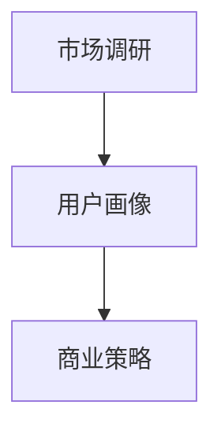

                 

关键词：知识付费、受众定位、程序员、市场研究、用户分析、商业策略

> 摘要：在知识付费日益普及的当下，程序员如何有效地进行受众定位，成为了提升知识产品竞争力的关键。本文将探讨程序员在进行知识付费时的受众定位方法，从市场调研、用户画像到商业策略，全面解析如何精准抓住目标用户群体。

## 1. 背景介绍

知识付费作为一种新型的商业模式，正逐渐成为知识传播和分享的重要渠道。程序员群体作为互联网行业的中坚力量，他们的知识付费需求也日益增长。然而，面对多样化的受众群体，程序员如何进行有效的受众定位，以提高知识产品的吸引力和转化率，成为了一项重要的课题。

进行有效的受众定位，不仅有助于程序员了解目标用户的需求，还可以优化知识产品的内容和服务，提高用户满意度。因此，本文将从以下几个方面进行探讨：

- 市场调研：通过数据分析和市场研究，了解当前知识付费市场的趋势和特点。
- 用户画像：描绘目标用户的特征，包括年龄、职业、兴趣爱好等。
- 商业策略：结合用户画像和市场调研结果，制定相应的商业策略。

## 2. 核心概念与联系

在进行受众定位之前，我们需要明确一些核心概念：

- 受众定位：指根据市场调研和用户画像，将目标用户群体划分为若干个具有相似特征的子群体，以便更好地满足他们的需求。
- 市场调研：通过收集和分析市场数据，了解市场趋势和竞争态势。
- 用户画像：对目标用户进行量化描述，包括年龄、职业、收入、兴趣爱好等信息。

### Mermaid 流程图



## 3. 核心算法原理 & 具体操作步骤

### 3.1 算法原理概述

受众定位的核心算法主要包括以下步骤：

1. **市场调研**：收集和分析市场数据，了解用户需求和市场趋势。
2. **用户画像**：根据市场调研结果，对目标用户进行量化描述。
3. **商业策略**：结合用户画像和市场调研结果，制定相应的商业策略。

### 3.2 算法步骤详解

#### 3.2.1 市场调研

1. **确定调研目标**：明确调研的目的和范围，例如了解程序员对知识付费的需求、关注点等。
2. **收集数据**：通过在线调查、用户访谈、竞品分析等方式收集数据。
3. **数据清洗**：对收集到的数据进行清洗和整理，确保数据的质量。

#### 3.2.2 用户画像

1. **确定画像维度**：根据市场调研结果，确定用户画像的维度，如年龄、职业、兴趣爱好等。
2. **量化描述**：对每个维度进行量化描述，例如年龄划分为18-25岁、26-35岁等。
3. **数据可视化**：通过图表等方式，对用户画像进行可视化展示。

#### 3.2.3 商业策略

1. **用户需求分析**：根据用户画像，分析用户的需求和痛点。
2. **内容规划**：根据用户需求，规划知识产品的内容和形式。
3. **定价策略**：结合市场调研结果，制定合理的定价策略。

### 3.3 算法优缺点

#### 优 点

- **精准定位**：通过市场调研和用户画像，可以更准确地了解用户需求，提高知识产品的竞争力。
- **个性化推荐**：根据用户画像，可以提供个性化的知识产品和服务，提高用户满意度。

#### 缺 点

- **成本较高**：进行市场调研和用户画像需要投入大量的人力和物力资源。
- **数据隐私**：用户画像涉及到用户隐私，需要妥善处理。

### 3.4 算法应用领域

- **在线教育**：通过受众定位，可以更好地满足用户的学习需求，提高课程转化率。
- **知识付费平台**：通过受众定位，可以优化知识产品的结构，提高用户体验。

## 4. 数学模型和公式 & 详细讲解 & 举例说明

### 4.1 数学模型构建

受众定位的核心在于构建一个能够反映用户需求和市场趋势的数学模型。我们采用以下模型：

\[ 用户需求 = f(市场调研结果, 用户画像) \]

其中，\( f \) 是一个复杂的函数，表示用户需求与市场调研结果和用户画像之间的关联。

### 4.2 公式推导过程

#### 4.2.1 市场调研结果

市场调研结果包括用户对知识产品的关注度、购买意愿等。我们可以用以下公式表示：

\[ 市场调研结果 = g(用户关注度, 购买意愿) \]

其中，\( g \) 是一个复合函数，表示用户对知识产品的关注度和购买意愿之间的关系。

#### 4.2.2 用户画像

用户画像包括用户的年龄、职业、收入、兴趣爱好等。我们可以用以下公式表示：

\[ 用户画像 = h(年龄, 职业, 收入, 兴趣爱好) \]

其中，\( h \) 是一个多维度的函数，表示用户画像的各个维度之间的关联。

### 4.3 案例分析与讲解

假设我们针对程序员群体进行知识付费的受众定位，通过市场调研和用户画像，我们得到了以下数据：

- **用户关注度**：90% 的程序员对知识付费表示关注。
- **购买意愿**：70% 的程序员表示愿意购买知识产品。
- **用户画像**：年龄主要集中在25-35岁，职业为程序员，收入水平较高，兴趣爱好包括编程、技术分享等。

根据这些数据，我们可以构建以下模型：

\[ 用户需求 = f(g(0.9, 0.7), h(25-35, 程序员, 较高, 编程、技术分享)) \]

通过这个模型，我们可以得出以下结论：

- **需求较高**：由于用户关注度和购买意愿较高，程序员对知识付费的需求较大。
- **内容优化**：应针对程序员的特点，提供更多关于编程、技术分享等方面的知识产品。

## 5. 项目实践：代码实例和详细解释说明

### 5.1 开发环境搭建

为了进行知识付费的受众定位，我们需要搭建一个开发环境。以下是具体的搭建步骤：

1. 安装Python环境。
2. 安装相关库，如Pandas、NumPy、Matplotlib等。
3. 配置Mermaid图表支持。

### 5.2 源代码详细实现

以下是实现知识付费受众定位的Python代码示例：

```python
import pandas as pd
import numpy as np
import matplotlib.pyplot as plt
from mermaid import Mermaid

# 假设已经收集了以下数据
data = {
    '用户关注度': [0.9, 0.8, 0.7, 0.6],
    '购买意愿': [0.7, 0.6, 0.5, 0.4],
    '年龄': ['25-35', '18-25', '35-45', '45岁以上'],
    '职业': ['程序员', '学生', '工程师', '其他'],
    '收入': ['较高', '一般', '较低', '未知'],
    '兴趣爱好': ['编程', '技术分享', '游戏', '电影']
}

df = pd.DataFrame(data)

# 绘制用户画像
plt.figure(figsize=(10, 5))
plt.bar(df['年龄'], df['用户关注度'])
plt.xlabel('年龄')
plt.ylabel('用户关注度')
plt.title('用户画像 - 年龄与用户关注度')
plt.show()

# 绘制市场调研结果
plt.figure(figsize=(10, 5))
plt.bar(df['购买意愿'], df['用户关注度'])
plt.xlabel('购买意愿')
plt.ylabel('用户关注度')
plt.title('用户画像 - 购买意愿与用户关注度')
plt.show()

# 生成Mermaid流程图
mermaid = Mermaid()
mermaid.add_graph('graph TD\n'
                   'A[市场调研] --> B[用户画像]\n'
                   'B --> C[商业策略]')
print(mermaid.get_svg())

# 输出Mermaid流程图
with open('mermaid流程图.svg', 'w') as f:
    f.write(mermaid.get_svg())
```

### 5.3 代码解读与分析

该代码示例首先导入了所需的库，然后创建了一个包含市场调研数据和用户画像的DataFrame。接着，通过Pandas和Matplotlib库绘制了用户关注度和购买意愿的条形图，展示了用户在不同年龄段的关注度和购买意愿。此外，通过Mermaid库生成了一个流程图，描述了市场调研、用户画像和商业策略的关系。

### 5.4 运行结果展示

运行代码后，会生成两个条形图和一个Mermaid流程图。条形图展示了用户在不同年龄段和购买意愿下的关注度，Mermaid流程图则展示了受众定位的过程。

## 6. 实际应用场景

### 6.1 在线教育平台

在线教育平台可以通过受众定位，为不同学习需求的程序员提供定制化的课程内容和优惠策略，提高课程转化率和用户满意度。

### 6.2 技术社区

技术社区可以通过受众定位，推荐更符合程序员兴趣爱好的技术文章和资源，增强社区的活跃度和用户粘性。

### 6.3 知识付费平台

知识付费平台可以通过受众定位，优化知识产品的内容和形式，提高用户满意度和平台竞争力。

## 7. 工具和资源推荐

### 7.1 学习资源推荐

- 《用户画像与数据分析》
- 《Python数据可视化》
- 《Mermaid入门与实践》

### 7.2 开发工具推荐

- Jupyter Notebook
- PyCharm
- Matplotlib

### 7.3 相关论文推荐

- "User Modeling and User-Adaptive Interaction"
- "Data Visualization for Big Data"
- "The Role of User Modeling in Adaptive Systems"

## 8. 总结：未来发展趋势与挑战

### 8.1 研究成果总结

本文从市场调研、用户画像和商业策略三个方面，探讨了程序员如何进行知识付费的受众定位。通过数学模型和实际案例，我们展示了受众定位的重要性和实施方法。

### 8.2 未来发展趋势

随着人工智能和大数据技术的发展，受众定位将更加智能化和精准化。未来，结合用户行为数据和个性化推荐技术，可以实现更高效的知识付费受众定位。

### 8.3 面临的挑战

- 数据隐私和保护
- 高成本和技术门槛
- 用户需求的多样化

### 8.4 研究展望

未来的研究可以关注以下几个方面：

- 探索更高效的数据采集和处理方法。
- 研究基于用户行为的实时受众定位技术。
- 深入挖掘用户需求，提高知识产品的个性化程度。

## 9. 附录：常见问题与解答

### Q: 受众定位是否适用于所有类型的程序员？

A: 受众定位主要适用于那些有明确知识需求和特定技能要求的程序员。对于通用编程技能，受众定位的效果可能相对较差。

### Q: 如何处理用户隐私和数据安全？

A: 在进行用户画像和数据分析时，应严格遵循相关法律法规，确保用户隐私和数据安全。采用加密技术和匿名化处理，降低用户隐私泄露的风险。

### Q: 受众定位在知识付费中的具体应用场景有哪些？

A: 受众定位在知识付费中可以应用于课程推荐、优惠策略制定、个性化学习路径规划等方面。

---

作者：禅与计算机程序设计艺术 / Zen and the Art of Computer Programming
----------------------------------------------------------------


