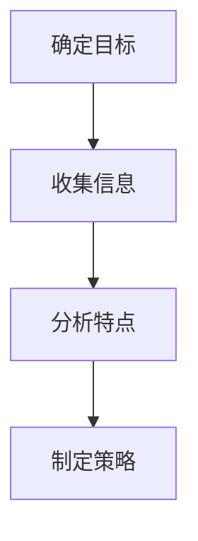

                 

关键词：知识付费，竞品分析，程序员，市场研究，案例分析，工具推荐

> 摘要：本文将探讨程序员如何通过竞品分析，深入了解知识付费市场的现状，识别潜在机会，优化自身知识付费产品和服务，从而提升市场竞争力。文章将结合实际案例，详细介绍竞品分析的步骤、方法和工具，为程序员在知识付费领域提供实用的参考和指导。

## 1. 背景介绍

### 1.1 知识付费的定义与意义

知识付费，是指用户为获取有价值的信息、技能或知识，向知识生产者或服务商支付的费用。随着互联网和信息技术的发展，知识付费已成为一种重要的商业模式，满足了用户个性化学习需求和内容创作者的价值实现。

### 1.2 程序员在知识付费市场的地位

程序员是知识付费市场的重要组成部分。随着技术更新速度加快，程序员需要不断学习新技术、新工具，以保持自身的竞争力。知识付费为程序员提供了便捷的学习途径，降低了学习成本，提高了学习效率。

### 1.3 竞品分析的重要性

竞品分析是了解市场、竞争对手和自身产品的重要手段。对于程序员来说，通过竞品分析，可以深入了解知识付费市场的现状，识别竞争对手的优势和不足，优化自身的产品和服务，提高市场竞争力。

## 2. 核心概念与联系

### 2.1 知识付费产品分类

知识付费产品可以分为以下几类：

- 在线课程：包括编程语言、框架、算法等课程。
- 电子书：包括技术书籍、手册等。
- 实战项目：包括编程项目、案例分享等。
- 在线问答：包括技术问答、专业咨询等。

### 2.2 知识付费市场结构

知识付费市场包括以下几部分：

- 知识生产者：包括个人和机构，如技术专家、培训机构、自媒体等。
- 知识服务商：包括平台、代理商等，如网易云课堂、掘金等。
- 用户：包括程序员、技术爱好者、学生等。

### 2.3 竞品分析流程

竞品分析流程可以分为以下几个步骤：

- 确定分析目标：明确分析的目的和范围。
- 收集竞品信息：通过搜索、调研等手段获取竞品资料。
- 分析竞品特点：对比竞品的优点、不足、市场定位等。
- 制定优化策略：根据竞品分析结果，制定优化自身产品和服务的方法。

### 2.4 Mermaid 流程图



## 3. 核心算法原理 & 具体操作步骤

### 3.1 算法原理概述

竞品分析的核心在于对竞品的深入理解，从而找到自身产品的优化方向。核心算法包括以下几部分：

- 数据收集：通过搜索引擎、社交媒体、市场调研等手段收集竞品信息。
- 数据分析：运用统计分析、文本挖掘等方法，分析竞品特点。
- 模型构建：构建竞品分析模型，评估竞品优势、不足和市场定位。

### 3.2 算法步骤详解

1. 确定分析目标：明确竞品分析的目的，如市场调研、产品优化、战略规划等。
2. 收集竞品信息：通过搜索引擎、社交媒体、市场调研等手段获取竞品资料，包括产品特点、市场定位、用户评价等。
3. 数据预处理：对收集到的数据进行清洗、筛选和整合，为后续分析做准备。
4. 数据分析：运用统计分析、文本挖掘等方法，分析竞品特点，包括产品功能、用户体验、市场表现等。
5. 构建模型：基于分析结果，构建竞品分析模型，评估竞品优势、不足和市场定位。
6. 制定策略：根据竞品分析结果，制定优化自身产品和服务的方法。

### 3.3 算法优缺点

优点：

- 可帮助程序员深入了解市场，识别竞争对手优势。
- 有助于优化自身产品和服务，提高市场竞争力。

缺点：

- 需要一定的专业知识和技能，如数据分析、市场调研等。
- 竞品分析结果可能受到数据质量和分析方法的影响。

### 3.4 算法应用领域

- 知识付费产品优化：通过竞品分析，了解市场需求和用户喜好，优化产品功能和用户体验。
- 市场调研：了解竞争对手的市场表现，为产品定位和推广策略提供依据。
- 战略规划：通过竞品分析，制定有针对性的战略规划，提高企业在市场中的竞争力。

## 4. 数学模型和公式 & 详细讲解 & 举例说明

### 4.1 数学模型构建

竞品分析中的数学模型可以包括以下几种：

- 评分模型：用于评估竞品的用户满意度。
- 评价模型：用于分析竞品的优点和不足。
- 贡献模型：用于评估竞品对市场的贡献。

### 4.2 公式推导过程

以评分模型为例，公式如下：

$$
\text{评分} = \frac{\sum_{i=1}^{n} w_i \cdot s_i}{n}
$$

其中，$w_i$ 为第 $i$ 个评分指标的权重，$s_i$ 为第 $i$ 个评分指标的得分。

### 4.3 案例分析与讲解

假设我们对两款在线编程课程进行竞品分析，评分模型中的评分指标包括课程质量、教学效果、用户满意度等。

1. 数据收集：通过搜索引擎、用户评论等渠道收集数据。
2. 数据预处理：对数据进行清洗、筛选和整合。
3. 数据分析：根据评分模型，计算两款课程的评分。
4. 结果展示：将分析结果可视化，帮助程序员了解竞品的优劣势。

## 5. 项目实践：代码实例和详细解释说明

### 5.1 开发环境搭建

- 使用 Python 编写代码。
- 安装必要的库，如 Pandas、Numpy、Matplotlib 等。

### 5.2 源代码详细实现

以下是一个简单的竞品分析代码实例：

```python
import pandas as pd
import numpy as np
import matplotlib.pyplot as plt

# 数据收集
data = pd.read_csv('data.csv')

# 数据预处理
data = data[['course_id', 'quality', 'effectiveness', 'satisfaction']]
data = data.dropna()

# 数据分析
scores = data.groupby('course_id').mean()

# 结果展示
scores['score'] = scores['quality'] * 0.3 + scores['effectiveness'] * 0.4 + scores['satisfaction'] * 0.3
scores.sort_values('score', ascending=False).plot(kind='bar')
plt.show()
```

### 5.3 代码解读与分析

- 代码首先导入必要的库。
- 通过 Pandas 读取数据，并对数据进行预处理。
- 使用 Numpy 和 Pandas 计算评分。
- 使用 Matplotlib 将分析结果可视化。

### 5.4 运行结果展示

运行代码后，将生成一个条形图，展示两款课程的评分。根据评分结果，程序员可以了解竞品的优劣势，为产品优化提供参考。

## 6. 实际应用场景

### 6.1 知识付费平台

- 程序员可以通过竞品分析，了解市场上主流的知识付费平台，如网易云课堂、腾讯课堂等，优化自身平台的产品和服务。

### 6.2 技术博客

- 程序员可以通过竞品分析，了解市场上优秀的技术博客，如掘金、V2EX 等，提升自身博客的吸引力。

### 6.3 技术论坛

- 程序员可以通过竞品分析，了解市场上主流的技术论坛，如 Stack Overflow、CSDN 等，提高自身论坛的用户活跃度。

## 7. 工具和资源推荐

### 7.1 学习资源推荐

- 《数据分析：实战方法与案例解析》
- 《Python数据分析基础教程：Numpy学习指南》
- 《Python数据分析应用》

### 7.2 开发工具推荐

- Jupyter Notebook：用于编写和运行代码。
- Git：用于版本控制和团队协作。
- VS Code：用于编写代码和调试。

### 7.3 相关论文推荐

- 《基于数据的竞争分析：理论、方法和应用》
- 《数据挖掘技术在竞品分析中的应用》
- 《大数据时代的竞品分析：方法与实践》

## 8. 总结：未来发展趋势与挑战

### 8.1 研究成果总结

- 竞品分析在程序员的知识付费领域具有重要的应用价值。
- 通过竞品分析，程序员可以深入了解市场，优化产品和服务，提高市场竞争力。

### 8.2 未来发展趋势

- 数据驱动的竞品分析将成为主流。
- 人工智能和大数据技术将进一步提升竞品分析的效果。

### 8.3 面临的挑战

- 数据质量和分析方法将直接影响竞品分析的准确性。
- 如何在激烈的市场竞争中脱颖而出，是程序员面临的重要挑战。

### 8.4 研究展望

- 加强竞品分析的理论研究，提高分析方法的科学性和实用性。
- 探索人工智能和大数据技术在竞品分析中的应用，提升分析效果。

## 9. 附录：常见问题与解答

### 9.1 竞品分析的意义是什么？

竞品分析的意义在于帮助程序员深入了解市场，识别竞争对手的优势和不足，优化自身产品和服务，提高市场竞争力。

### 9.2 如何进行有效的竞品分析？

进行有效的竞品分析需要遵循以下步骤：

1. 确定分析目标。
2. 收集竞品信息。
3. 数据预处理。
4. 数据分析。
5. 构建模型。
6. 制定策略。

### 9.3 竞品分析常用的方法有哪些？

竞品分析常用的方法包括：市场调研、用户调研、数据分析、案例研究等。

---

以上是《程序员如何进行知识付费的竞品分析》的完整文章。本文通过深入探讨竞品分析的核心概念、原理、方法和实际应用，为程序员在知识付费领域提供了实用的参考和指导。希望本文能对您在竞品分析方面有所启发，助力您在知识付费市场中取得更好的成绩。作者：禅与计算机程序设计艺术 / Zen and the Art of Computer Programming。

