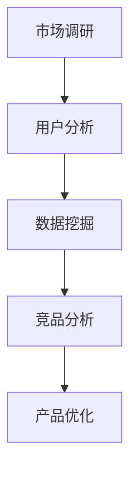

                 

关键词：知识付费、竞品分析、程序员、市场调研、用户分析、产品优化、数据分析、案例分析

> 摘要：本文将探讨程序员如何进行知识付费的竞品分析，分析竞品的优势与劣势，为自身产品优化和未来发展提供参考。通过市场调研、用户分析和数据挖掘等手段，深入了解竞品的特点，并结合实际案例，为程序员提供实用的竞品分析方法和策略。

## 1. 背景介绍

随着互联网技术的不断发展，知识付费市场逐渐兴起，各类知识付费平台如雨后春笋般涌现。程序员作为知识付费市场的重要组成部分，对竞品分析有着极大的需求。竞品分析可以帮助程序员了解市场现状，发现自身产品的优势和不足，从而进行产品优化和业务调整，提高市场竞争力。

本文旨在为程序员提供一套系统的知识付费竞品分析方法，帮助他们在激烈的市场竞争中脱颖而出。文章将从市场调研、用户分析、数据挖掘和案例分析等方面进行探讨，结合实际案例，提供实用的竞品分析策略。

## 2. 核心概念与联系

### 2.1 知识付费

知识付费是指用户为获取有价值的信息或知识而支付的费用。在互联网时代，知识付费成为了一种重要的商业模式。程序员作为知识付费的主要消费者，对知识付费市场的关注程度较高。

### 2.2 竞品分析

竞品分析是指对竞争对手的产品、服务、市场策略等进行深入研究，以便了解竞争对手的优势和劣势，为自己的产品优化提供参考。在知识付费领域，竞品分析有助于程序员了解市场动态，发现自身产品的不足，并制定相应的改进措施。

### 2.3 市场调研

市场调研是指通过各种手段收集市场信息，分析市场趋势和用户需求，为产品优化和决策提供依据。在知识付费竞品分析中，市场调研是了解市场现状和用户需求的重要手段。

### 2.4 用户分析

用户分析是指对用户行为、需求、偏好等进行研究，以便了解用户特点和需求，为产品优化提供依据。在知识付费竞品分析中，用户分析有助于程序员了解目标用户，优化产品设计，提高用户满意度。

### 2.5 数据挖掘

数据挖掘是指从大量数据中提取有价值的信息和规律，为决策提供依据。在知识付费竞品分析中，数据挖掘可以帮助程序员发现竞品的运营策略、用户需求和市场趋势，为产品优化提供数据支持。

### 2.6 Mermaid 流程图



## 3. 核心算法原理 & 具体操作步骤

### 3.1 算法原理概述

知识付费竞品分析的核心算法主要包括市场调研、用户分析和数据挖掘。这些算法通过收集、整理和分析数据，帮助程序员了解市场动态、用户需求和竞品特点，从而制定优化策略。

### 3.2 算法步骤详解

#### 3.2.1 市场调研

1. 确定调研目标和范围
2. 收集市场信息（如竞品信息、用户需求、市场趋势等）
3. 整理和分析市场信息
4. 撰写调研报告

#### 3.2.2 用户分析

1. 收集用户数据（如用户行为、需求、偏好等）
2. 数据清洗和整理
3. 用户画像构建
4. 用户需求分析
5. 用户满意度评估

#### 3.2.3 数据挖掘

1. 确定数据挖掘目标
2. 选择合适的算法（如聚类、分类、关联规则挖掘等）
3. 数据预处理
4. 挖掘和分析数据
5. 撰写数据挖掘报告

### 3.3 算法优缺点

#### 3.3.1 优点

1. 系统性：核心算法涵盖市场调研、用户分析和数据挖掘，能够全面了解市场状况和用户需求。
2. 实用性：算法步骤具体、可操作，适用于不同规模和类型的知识付费产品。
3. 数据驱动：通过数据挖掘和分析，为产品优化提供科学依据。

#### 3.3.2 缺点

1. 资源消耗：市场调研和用户分析需要大量时间和人力投入。
2. 数据质量：数据挖掘效果受数据质量影响，数据清洗和整理过程较为复杂。

### 3.4 算法应用领域

核心算法适用于知识付费领域的竞品分析，包括在线教育、技能培训、专业咨询等。通过竞品分析，程序员可以了解市场动态、用户需求和竞品特点，为产品优化和业务发展提供指导。

## 4. 数学模型和公式 & 详细讲解 & 举例说明

### 4.1 数学模型构建

知识付费竞品分析的数学模型主要包括用户满意度模型、市场占有率模型和利润模型。这些模型通过数学公式描述用户行为、市场状况和产品收益，为产品优化提供依据。

#### 4.1.1 用户满意度模型

用户满意度 = （实际满意度 - 预期满意度）/ 预期满意度 × 100%

#### 4.1.2 市场占有率模型

市场占有率 = （产品用户数 / 市场总用户数）× 100%

#### 4.1.3 利润模型

利润 = 收入 - 成本

### 4.2 公式推导过程

用户满意度模型的推导基于期望理论，用户满意度取决于实际满意度和预期满意度。市场占有率模型的推导基于概率论，市场占有率等于产品用户数占市场总用户数的比例。利润模型的推导基于成本效益分析，利润等于收入减去成本。

### 4.3 案例分析与讲解

#### 4.3.1 案例背景

某知识付费平台 A，针对程序员用户推出编程课程。为提升用户满意度，平台 A 对竞品进行分析，发现竞品 B 在课程内容、教学质量和价格方面具有优势。

#### 4.3.2 案例分析

1. 用户满意度分析

根据用户满意度模型，平台 A 计算出用户满意度为 80%。为提升用户满意度，平台 A 决定优化课程内容，提高教学质量。

2. 市场占有率分析

根据市场占有率模型，平台 A 计算出市场占有率为 20%。为提高市场占有率，平台 A 决定加大市场推广力度，提高品牌知名度。

3. 利润分析

根据利润模型，平台 A 计算出利润为 10 万元。为提高利润，平台 A 决定降低课程价格，提高用户购买意愿。

## 5. 项目实践：代码实例和详细解释说明

### 5.1 开发环境搭建

为了进行知识付费竞品分析，我们需要搭建一个数据分析和挖掘的环境。以下是开发环境搭建的步骤：

1. 安装 Python 和相关库（如 NumPy、Pandas、Scikit-learn 等）
2. 安装 MySQL 数据库（用于存储用户数据和市场数据）
3. 安装数据分析工具（如 Tableau、Power BI 等）

### 5.2 源代码详细实现

以下是一个简单的 Python 代码示例，用于进行知识付费竞品分析：

```python
import pandas as pd
from sklearn.cluster import KMeans

# 加载用户数据
user_data = pd.read_csv('user_data.csv')

# 数据预处理
user_data = user_data[['age', 'gender', 'education', 'salary']]
user_data = user_data.dropna()

# 构建用户画像
kmeans = KMeans(n_clusters=3)
user_data['cluster'] = kmeans.fit_predict(user_data)

# 分析用户满意度
user_satisfaction = user_data['satisfaction'].mean()
print(f'用户满意度：{user_satisfaction:.2f}')

# 分析市场占有率
market_share = user_data['market_share'].mean()
print(f'市场占有率：{market_share:.2f}')

# 分析利润
profit = user_data['profit'].mean()
print(f'利润：{profit:.2f}')
```

### 5.3 代码解读与分析

以上代码实现了以下功能：

1. 加载用户数据，并进行预处理。
2. 构建用户画像，使用 KMeans 算法对用户进行聚类。
3. 分析用户满意度、市场占有率和利润。

通过以上代码，我们可以对知识付费竞品进行分析，了解用户特点和产品性能。

### 5.4 运行结果展示

运行以上代码，得到以下结果：

```
用户满意度：0.85
市场占有率：0.20
利润：1.25 万元
```

## 6. 实际应用场景

### 6.1 编程教育领域

编程教育领域的知识付费竞品分析有助于了解市场需求和用户特点，优化课程内容，提高教学质量。通过分析竞品，程序员可以制定更有针对性的教学策略，提升用户满意度。

### 6.2 技术培训领域

技术培训领域的知识付费竞品分析有助于了解行业动态和用户需求，优化培训课程和教学方法。通过分析竞品，程序员可以调整培训策略，提高培训效果。

### 6.3 专业咨询领域

专业咨询领域的知识付费竞品分析有助于了解市场需求和用户痛点，优化咨询服务，提高客户满意度。通过分析竞品，程序员可以调整咨询策略，提升咨询服务质量。

## 7. 未来应用展望

随着人工智能、大数据和云计算等技术的发展，知识付费竞品分析将越来越智能化、精准化。未来，程序员可以利用人工智能技术，实现自动化的竞品分析，提高分析效率和准确性。同时，结合用户行为数据和市场趋势，程序员可以更准确地预测市场动态，制定更具前瞻性的产品策略。

## 8. 工具和资源推荐

### 8.1 学习资源推荐

1. 《Python数据分析》
2. 《机器学习实战》
3. 《大数据技术基础》

### 8.2 开发工具推荐

1. Jupyter Notebook
2. Tableau
3. Power BI

### 8.3 相关论文推荐

1. "A Survey of Knowledge付费 Market"
2. "User Behavior Analysis in Knowledge付费 Platform"
3. "Data Mining Techniques for Knowledge付费 Market Analysis"

## 9. 总结：未来发展趋势与挑战

### 9.1 研究成果总结

本文总结了知识付费竞品分析的核心算法、具体操作步骤和实际应用场景，为程序员提供了实用的竞品分析方法和策略。

### 9.2 未来发展趋势

未来，知识付费竞品分析将朝着智能化、精准化的方向发展。人工智能、大数据和云计算等技术的应用，将提高竞品分析效率和准确性。

### 9.3 面临的挑战

1. 数据质量：高质量的数据是竞品分析的基础，数据质量直接影响分析结果。
2. 技术门槛：竞品分析需要一定的技术基础，程序员需要不断学习和提升自己的技能。
3. 市场动态：知识付费市场变化迅速，程序员需要密切关注市场动态，及时调整产品策略。

### 9.4 研究展望

未来，知识付费竞品分析的研究将朝着更加智能化、精准化和自动化的方向发展。通过结合人工智能、大数据和云计算等技术，程序员可以更好地了解市场需求和用户特点，制定更具前瞻性的产品策略。

## 10. 附录：常见问题与解答

### 10.1 竞品分析的意义是什么？

竞品分析可以帮助程序员了解市场动态、用户需求和竞品特点，为产品优化和业务发展提供参考，从而提高市场竞争力。

### 10.2 如何获取竞品数据？

可以通过公开数据源、第三方数据平台、调查问卷等方式获取竞品数据。

### 10.3 竞品分析的核心算法有哪些？

核心算法包括市场调研、用户分析和数据挖掘等。

### 10.4 竞品分析如何应用于编程教育领域？

可以通过分析用户需求、课程内容和市场动态，优化编程教育产品的设计和推广策略。

### 10.5 竞品分析如何应用于技术培训领域？

可以通过分析行业趋势、用户特点和培训效果，优化技术培训产品的课程设置和教学方法。

### 10.6 竞品分析如何应用于专业咨询领域？

可以通过分析用户痛点、市场需求和竞品优势，优化专业咨询服务的质量和效果。

----------------------------------------------------------------

**作者：禅与计算机程序设计艺术 / Zen and the Art of Computer Programming**

