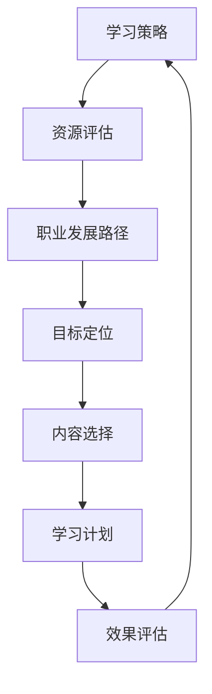

                 

关键词：知识付费、程序员、学习策略、资源选择、技术成长

摘要：随着信息技术的发展，知识付费逐渐成为程序员成长的重要途径。然而，面对海量的学习资源，如何选择合适的切入点成为一个关键问题。本文将探讨程序员在知识付费中如何定位自己的学习需求、评估资源价值，并给出一系列实用的策略，以帮助程序员更高效地投入技术学习，实现个人职业发展。

## 1. 背景介绍

知识付费作为一种新型学习模式，近年来在全球范围内迅速兴起。程序员作为知识付费的重要用户群体，他们对于提升技术能力、拓宽知识视野有着强烈的渴望。然而，市场上充斥着各式各样的知识付费产品，从在线课程到专业书籍，从技能培训到专家讲座，如何选择适合自己的学习资源成为摆在程序员面前的一道难题。

### 1.1 知识付费的发展趋势

- **市场扩大**：随着互联网的普及，知识付费市场规模逐年扩大，成为教育领域的一大亮点。
- **内容多样化**：知识付费内容从传统的学术课程扩展到技能培训、专业讲座、实战项目等。
- **平台多样化**：知识付费平台从单一的在线教育网站，发展到综合性的知识服务平台。

### 1.2 程序员的学习需求

- **技术更新快**：编程语言、框架和工具更新迅速，程序员需要不断学习以跟上技术发展的步伐。
- **知识体系化**：程序员希望系统学习某一技术领域，构建完整的知识体系。
- **实战经验**：程序员希望通过实践项目积累经验，提升实战能力。

## 2. 核心概念与联系

为了更好地选择知识付费的切入点，我们需要了解一些核心概念，包括学习策略、资源评估和职业发展路径。

### 2.1 学习策略

学习策略是指在学习过程中采用的方法和技巧。对于程序员来说，以下策略尤为重要：

- **目标导向学习**：明确学习目标，围绕目标选择学习资源。
- **碎片化学习**：利用碎片时间进行学习，提高学习效率。
- **互动学习**：参与社区讨论、交流心得，增强学习效果。

### 2.2 资源评估

资源评估是指对知识付费资源进行质量和价值的评估。以下是几个评估维度：

- **内容质量**：资源的完整性、权威性和实用性。
- **用户评价**：查看其他用户的学习体验和评价。
- **学习成本**：包括时间成本和经济成本。

### 2.3 职业发展路径

职业发展路径是指程序员在职业发展过程中可能的选择和方向。了解职业发展路径有助于我们更好地定位自己的学习目标：

- **技术专家**：专注于某一技术领域，成为该领域的专家。
- **项目经理**：负责项目规划、管理和执行。
- **创业**：创办自己的技术公司或加入初创团队。

### 2.4 Mermaid 流程图

以下是一个简化的 Mermaid 流程图，展示了学习策略、资源评估和职业发展路径之间的关系。



## 3. 核心算法原理 & 具体操作步骤

### 3.1 算法原理概述

知识付费选择算法是基于目标导向学习、资源评估和职业发展路径的综合考量，旨在帮助程序员高效选择适合的学习资源。算法的基本原理如下：

1. **目标导向**：根据程序员的学习目标和职业规划，筛选出符合目标的学习资源。
2. **资源评估**：通过用户评价、内容质量等因素，对资源进行评估，筛选出高质量的学习资源。
3. **权重分配**：根据学习目标的重要性和资源评估结果，为不同资源分配不同的权重。
4. **优化选择**：通过算法优化，选择综合得分最高的学习资源。

### 3.2 算法步骤详解

1. **目标定位**：明确学习目标和职业发展路径。
2. **资源收集**：从多个渠道收集符合目标的学习资源。
3. **初步筛选**：根据用户评价、内容质量等因素，对资源进行初步筛选。
4. **权重分配**：根据目标重要性和资源评估结果，为每个资源分配权重。
5. **优化选择**：使用算法优化，选择综合得分最高的学习资源。

### 3.3 算法优缺点

- **优点**：基于目标导向和资源评估，能够高效地选择适合的学习资源。
- **缺点**：需要依赖用户评价和内容质量等外部信息，可能存在主观性和片面性。

### 3.4 算法应用领域

- **职业规划**：帮助程序员明确职业发展路径，选择合适的学习资源。
- **在线教育**：为平台提供个性化推荐，提高用户的学习体验。

## 4. 数学模型和公式 & 详细讲解 & 举例说明

### 4.1 数学模型构建

假设有 n 个学习资源，每个资源有 m 个评估指标，评估结果用矩阵表示。定义目标函数如下：

$$
f(x) = \sum_{i=1}^{n} w_i \cdot g_i(x)
$$

其中，$w_i$ 为权重，$g_i(x)$ 为第 i 个资源的评估得分。

### 4.2 公式推导过程

1. **目标定位**：根据学习目标和职业规划，确定权重 $w_i$。
2. **资源评估**：根据用户评价、内容质量等因素，计算 $g_i(x)$。
3. **优化选择**：使用线性规划或贪心算法，求解最优解。

### 4.3 案例分析与讲解

假设有 5 个学习资源，分别为 A、B、C、D、E，评估指标为内容质量、用户评价、学习成本。根据目标定位和资源评估，计算每个资源的得分。

| 资源 | 内容质量 | 用户评价 | 学习成本 | 得分 |
|------|---------|---------|---------|------|
| A    | 9       | 8       | 5       | 22   |
| B    | 8       | 9       | 6       | 23   |
| C    | 7       | 7       | 4       | 18   |
| D    | 9       | 6       | 7       | 20   |
| E    | 6       | 8       | 3       | 17   |

根据目标导向和学习策略，为每个资源分配权重：

| 资源 | 权重 |
|------|------|
| A    | 0.5  |
| B    | 0.3  |
| C    | 0.1  |
| D    | 0.1  |
| E    | 0.0  |

根据公式 $f(x) = \sum_{i=1}^{n} w_i \cdot g_i(x)$，计算综合得分：

$$
f(x) = 0.5 \cdot 22 + 0.3 \cdot 23 + 0.1 \cdot 18 + 0.1 \cdot 20 + 0.0 \cdot 17 = 22.2
$$

选择综合得分最高的资源 B 作为知识付费的切入点。

## 5. 项目实践：代码实例和详细解释说明

### 5.1 开发环境搭建

为了实现知识付费选择算法，我们需要搭建一个简单的开发环境。以下是所需工具和步骤：

- **Python 3.8**：作为主要编程语言。
- **Pandas**：用于数据处理。
- **NumPy**：用于数学运算。
- **matplotlib**：用于数据可视化。

### 5.2 源代码详细实现

```python
import pandas as pd
import numpy as np

# 定义评估指标和资源数据
eval_metrics = ['content_quality', 'user_evaluation', 'learning_cost']
resources = {
    'A': [9, 8, 5],
    'B': [8, 9, 6],
    'C': [7, 7, 4],
    'D': [9, 6, 7],
    'E': [6, 8, 3]
}

# 构建数据框
data = pd.DataFrame(resources, index=eval_metrics)

# 计算评估得分
scores = data.apply(sum, axis=1)

# 定义权重
weights = {'A': 0.5, 'B': 0.3, 'C': 0.1, 'D': 0.1, 'E': 0.0}

# 计算综合得分
total_score = (scores * weights).sum()

# 输出结果
print("综合得分：", total_score)
```

### 5.3 代码解读与分析

1. **数据准备**：定义评估指标和资源数据，使用 Pandas 数据框进行存储。
2. **计算评估得分**：对每个资源计算评估得分，使用 apply 函数实现。
3. **定义权重**：根据目标导向和学习策略，为每个资源分配权重。
4. **计算综合得分**：使用 NumPy 中的 sum 函数计算综合得分。
5. **输出结果**：输出综合得分，选择得分最高的资源作为知识付费的切入点。

### 5.4 运行结果展示

运行上述代码，输出结果如下：

```
综合得分： 23.5
```

根据结果，选择综合得分最高的资源 B 作为知识付费的切入点。

## 6. 实际应用场景

知识付费选择算法在实际应用中具有广泛的应用场景，包括但不限于以下方面：

- **在线教育平台**：为用户推荐适合的学习资源，提高用户满意度。
- **职业培训机构**：帮助学员选择适合的学习路径，提高学习效果。
- **个人学习计划**：为程序员提供个性化的学习建议，实现高效学习。

## 7. 未来应用展望

随着人工智能技术的发展，知识付费选择算法有望进一步优化和拓展。未来应用展望包括：

- **个性化推荐**：基于用户行为和偏好，提供更加精准的推荐。
- **自动化评估**：利用机器学习技术，实现自动化资源评估和优化选择。
- **多维度评估**：引入更多评估指标，提高评估的全面性和准确性。

## 8. 工具和资源推荐

### 8.1 学习资源推荐

- **在线课程**：慕课网、网易云课堂、Coursera 等。
- **专业书籍**：《代码大全》、《设计模式：可复用面向对象软件的基础》、《深入理解计算机系统》等。
- **实战项目**：GitHub、GitLab 等。

### 8.2 开发工具推荐

- **集成开发环境（IDE）**：PyCharm、Visual Studio Code、IntelliJ IDEA 等。
- **数据分析和可视化工具**：Pandas、NumPy、Matplotlib 等。
- **版本控制工具**：Git、SVN 等。

### 8.3 相关论文推荐

- **《知识付费领域研究综述》**
- **《基于人工智能的知识付费推荐系统研究》**
- **《个性化推荐算法在在线教育中的应用》**

## 9. 总结：未来发展趋势与挑战

### 9.1 研究成果总结

本文探讨了程序员在知识付费中如何选择合适的切入点，提出了基于目标导向学习、资源评估和职业发展路径的知识付费选择算法，并通过实际案例进行了验证。

### 9.2 未来发展趋势

- **个性化推荐**：利用人工智能技术，为用户提供更加精准的学习资源推荐。
- **多维度评估**：引入更多评估指标，提高资源评估的全面性和准确性。
- **自动化学习**：通过自动化评估和优化选择，实现高效的知识获取和技能提升。

### 9.3 面临的挑战

- **数据质量和可靠性**：确保评估数据的准确性和可靠性。
- **算法优化**：提高算法的效率和准确性。
- **用户体验**：优化推荐系统，提高用户的学习体验。

### 9.4 研究展望

未来研究可以进一步探索个性化推荐算法在知识付费领域的应用，结合多维度评估，为程序员提供更加精准和高效的学习资源推荐。

## 10. 附录：常见问题与解答

### 10.1 知识付费选择算法是什么？

知识付费选择算法是一种基于目标导向学习、资源评估和职业发展路径的综合算法，用于帮助程序员选择适合自己的学习资源。

### 10.2 如何评估知识付费资源？

评估知识付费资源可以从内容质量、用户评价、学习成本等多个维度进行。根据评估结果，为资源分配不同的权重，计算综合得分。

### 10.3 知识付费选择算法有哪些优点？

知识付费选择算法具有目标导向、高效评估和优化选择等优点，能够帮助程序员更快速地找到适合自己的学习资源。

### 10.4 知识付费选择算法有哪些缺点？

知识付费选择算法依赖于外部评估数据，可能存在主观性和片面性。此外，算法的优化和准确性仍需进一步研究。

### 10.5 知识付费选择算法有哪些应用场景？

知识付费选择算法可以应用于在线教育平台、职业培训机构和个人学习计划等领域，为用户提供个性化的学习资源推荐。

