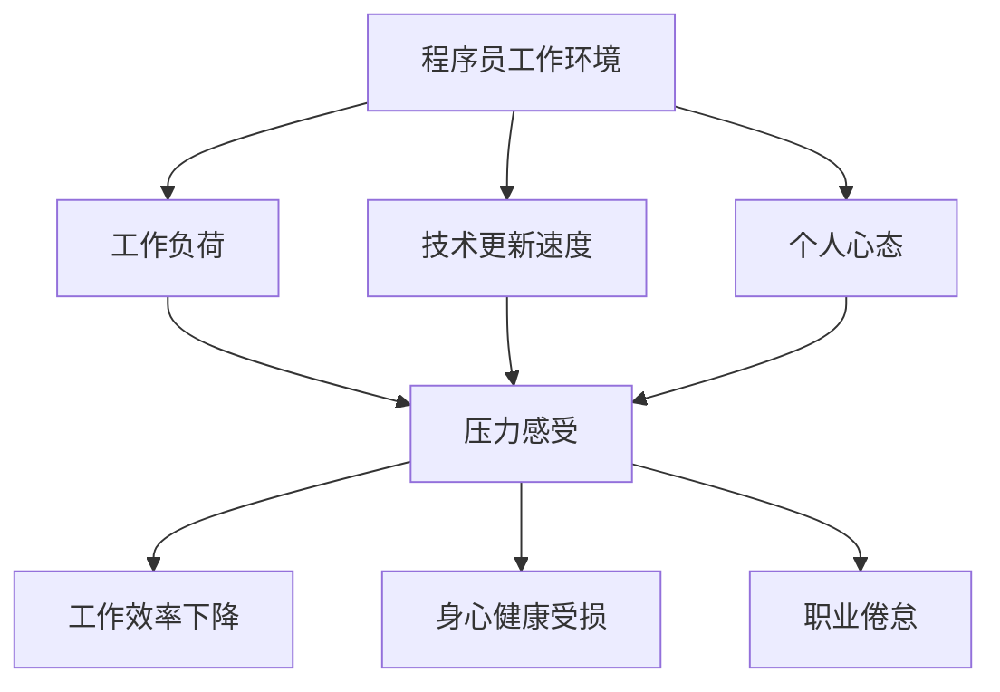

                 

程序员作为现代信息技术产业的中坚力量，工作强度大、节奏快，常常面临巨大的精神压力和倦怠。长期的压力和倦怠不仅影响工作效率，还可能损害身心健康，甚至导致职业倦怠。本文将探讨程序员如何通过科学的方法来避免倦怠和压力，提升工作效率与生活质量。

> 关键词：程序员，倦怠，压力管理，工作效率，身心健康

> 摘要：本文从心理、生理、环境等多个维度分析了程序员倦怠和压力的成因，提出了相应的预防和管理策略，包括心态调整、健康生活习惯、技术工具利用等，旨在帮助程序员保持良好的工作状态，实现工作效率与生活质量的平衡。

## 1. 背景介绍

随着互联网和信息技术产业的快速发展，程序员的工作环境和需求发生了翻天覆地的变化。高负荷的工作任务、快速的技术更新、高强度的工作压力，使得程序员这一职业备受关注。据统计，程序员中的倦怠和压力问题普遍存在，长期得不到有效解决，不仅影响个人职业发展，也对整个行业的发展产生负面影响。

### 1.1 程序员的工作特点

- **高负荷的工作任务**：程序员常常需要处理大量的代码和复杂的项目，工作量巨大。
- **快速的技术更新**：IT行业技术更新迅速，程序员需要不断学习新技能，以适应行业的发展。
- **高强度的工作压力**：项目交付期限紧张，技术挑战重重，程序员常常面临高压环境。

### 1.2 倦怠和压力的影响

- **工作效率下降**：长期处于高压状态，程序员容易出现注意力不集中、思维迟缓等问题，影响工作效率。
- **身心健康受损**：长期的压力可能导致心理健康问题，如焦虑、抑郁等，同时也会影响生理健康，如失眠、高血压等。
- **职业倦怠**：严重的压力和倦怠可能导致程序员对工作失去兴趣，甚至离职，影响职业生涯。

### 1.3 程序员倦怠和压力的成因

- **工作环境**：高强度的工作任务和快节奏的工作环境是造成程序员倦怠和压力的主要原因。
- **个人心态**：程序员的心态对压力的感受和应对方式有很大影响，如消极心态、焦虑情绪等。
- **工作生活平衡**：工作与生活的失衡导致程序员无法有效地放松和休息，长期处于疲劳状态。

## 2. 核心概念与联系

为了更好地理解程序员倦怠和压力的成因，我们需要引入几个核心概念，并绘制一个Mermaid流程图来展示它们之间的关系。



在这个流程图中，我们可以看到程序员的工作环境直接影响工作负荷、技术更新速度和个人心态，这些因素共同作用导致程序员感受到压力。压力进一步影响工作效率、身心健康和职业倦怠。

## 3. 核心算法原理 & 具体操作步骤

### 3.1 算法原理概述

为了有效管理程序员的压力和倦怠，我们可以采用一种综合性的方法，称为“压力缓解与倦怠管理算法”。这个算法的核心原理是通过心理、生理和环境等多个方面的调整来达到缓解压力、恢复身心健康的目的。

### 3.2 算法步骤详解

#### 3.2.1 心理层面的调整

1. **认知重构**：通过认知行为疗法（CBT）技术，改变程序员对压力的认知，减少负面情绪。
2. **情绪管理**：教授程序员情绪调节技巧，如深呼吸、正念冥想等，帮助他们在高压环境中保持冷静。
3. **目标管理**：帮助程序员设定合理的工作目标，避免过度负荷，从而减少压力。

#### 3.2.2 生理层面的调整

1. **健康饮食**：推荐程序员遵循健康的饮食习惯，摄入充足的蛋白质、维生素和矿物质。
2. **体育锻炼**：鼓励程序员定期进行体育锻炼，如跑步、游泳、瑜伽等，以增强体质。
3. **睡眠管理**：教授程序员良好的睡眠习惯，如避免睡前使用电子设备，保持规律的作息时间。

#### 3.2.3 环境层面的调整

1. **工作环境优化**：改善程序员的工作环境，如提供舒适的办公桌椅、良好的通风和照明等。
2. **时间管理**：教授程序员时间管理技巧，如使用番茄工作法、设置优先级等，以更高效地完成任务。
3. **社交支持**：鼓励程序员建立良好的社交网络，通过团队协作和社交活动来缓解压力。

### 3.3 算法优缺点

#### 优点：

- **综合性**：算法从心理、生理和环境等多个方面入手，提供全面的解决方案。
- **灵活性**：算法可以根据程序员的个体差异进行调整，具有较强的适应性。
- **长效性**：通过持续的心理、生理和环境调整，可以长期缓解程序员的压力和倦怠。

#### 缺点：

- **实施难度**：算法的实施需要程序员和企业的共同努力，难度相对较大。
- **资源需求**：算法的实施可能需要一定的资源投入，如培训、设备等。

### 3.4 算法应用领域

- **软件开发公司**：通过实施这个算法，可以提高程序员的工作效率和满意度，从而提升企业竞争力。
- **IT培训机构**：可以将其作为培训内容，帮助学员更好地应对职业压力。
- **心理咨询机构**：可以作为心理咨询的一部分，帮助程序员缓解心理压力。

## 4. 数学模型和公式 & 详细讲解 & 举例说明

### 4.1 数学模型构建

为了量化程序员倦怠和压力的程度，我们可以构建一个数学模型，通过几个关键指标来评估程序员的压力水平。

#### 关键指标：

1. **工作负荷（W）**：衡量程序员的工作强度，可以通过工作量、项目复杂度等因素计算得出。
2. **技术更新速度（T）**：衡量程序员需要学习的新技能数量和难度。
3. **个人心态（M）**：通过心理测评和主观感受来衡量程序员的情绪状态。
4. **身心健康（H）**：通过生理指标如血压、心率等来衡量。

#### 数学模型：

\[ P = f(W, T, M, H) \]

其中，\( P \) 表示程序员的压力水平，\( f \) 是一个非线性函数，用于计算压力水平。

### 4.2 公式推导过程

我们假设压力水平与工作负荷、技术更新速度、个人心态和身心健康之间存在如下关系：

\[ P = a \cdot W + b \cdot T + c \cdot M + d \cdot H \]

其中，\( a, b, c, d \) 是模型参数，可以通过数据分析得到。

### 4.3 案例分析与讲解

假设有一位程序员，他的工作负荷为 \( W = 20 \)，技术更新速度为 \( T = 15 \)，个人心态 \( M = 30 \)，身心健康 \( H = 25 \)。我们可以根据上述公式计算出他的压力水平：

\[ P = a \cdot 20 + b \cdot 15 + c \cdot 30 + d \cdot 25 \]

假设 \( a = 0.5, b = 0.4, c = 0.6, d = 0.3 \)，代入公式得：

\[ P = 0.5 \cdot 20 + 0.4 \cdot 15 + 0.6 \cdot 30 + 0.3 \cdot 25 = 15 + 6 + 18 + 7.5 = 46.5 \]

这意味着该程序员的压力水平为 46.5。我们可以根据这个压力水平来判断他是否处于高压状态，并采取相应的措施来缓解压力。

### 4.4 代码实例和详细解释说明

以下是一个简单的Python代码实例，用于计算程序员的压力水平。

```python
# 定义压力水平计算函数
def calculate_pressure(work_load, tech_update_speed, mental_state, health_state, a=0.5, b=0.4, c=0.6, d=0.3):
    return a * work_load + b * tech_update_speed + c * mental_state + d * health_state

# 输入关键指标
work_load = 20
tech_update_speed = 15
mental_state = 30
health_state = 25

# 计算压力水平
pressure = calculate_pressure(work_load, tech_update_speed, mental_state, health_state)
print("程序员的压力水平为：", pressure)
```

运行这段代码，我们可以得到程序员的压力水平为 46.5。这只是一个简单的例子，实际的模型可能需要更多的参数和复杂的计算方法。

## 5. 项目实践：代码实例和详细解释说明

为了更好地理解如何在实际项目中应用压力管理和倦怠缓解策略，我们将通过一个具体的案例来进行详细说明。

### 5.1 开发环境搭建

在本案例中，我们选择使用Python作为开发语言，并结合Jupyter Notebook来搭建开发环境。以下是开发环境搭建的步骤：

1. **安装Python**：确保Python版本为3.8或更高版本。
2. **安装Jupyter Notebook**：使用pip命令安装Jupyter Notebook。

   ```shell
   pip install notebook
   ```

3. **启动Jupyter Notebook**：在命令行输入以下命令启动Jupyter Notebook。

   ```shell
   jupyter notebook
   ```

### 5.2 源代码详细实现

以下是一个简单的Python代码示例，用于监测和记录程序员的压力水平。

```python
# 压力监测系统

# 导入所需的库
import datetime
import random

# 定义压力监测函数
def monitor_pressure(work_load, tech_update_speed, mental_state, health_state):
    # 计算压力水平
    pressure = calculate_pressure(work_load, tech_update_speed, mental_state, health_state)
    
    # 记录监测数据
    record = {
        'timestamp': datetime.datetime.now(),
        'work_load': work_load,
        'tech_update_speed': tech_update_speed,
        'mental_state': mental_state,
        'health_state': health_state,
        'pressure': pressure
    }
    
    # 存储记录
    save_record(record)
    
    # 返回压力水平
    return pressure

# 定义计算压力水平的函数
def calculate_pressure(work_load, tech_update_speed, mental_state, health_state, a=0.5, b=0.4, c=0.6, d=0.3):
    return a * work_load + b * tech_update_speed + c * mental_state + d * health_state

# 定义保存记录的函数
def save_record(record):
    # 这里可以使用任何数据存储方法，如文件、数据库等
    with open('pressure_monitoring.txt', 'a') as file:
        file.write(str(record) + '\n')

# 模拟监测压力
work_load = random.randint(10, 50)
tech_update_speed = random.randint(10, 50)
mental_state = random.randint(10, 50)
health_state = random.randint(10, 50)

pressure = monitor_pressure(work_load, tech_update_speed, mental_state, health_state)
print("当前压力水平为：", pressure)
```

### 5.3 代码解读与分析

1. **代码结构**：代码分为三个部分：压力监测函数、计算压力函数和保存记录函数。
2. **压力监测函数**：用于计算并记录程序员的压力水平。
3. **计算压力函数**：基于数学模型计算压力水平。
4. **保存记录函数**：将监测数据保存到文件中。

通过这个案例，我们可以看到如何在实际项目中应用压力监测和缓解策略。程序员可以通过这个系统实时了解自己的压力水平，并采取相应的措施来缓解压力。

### 5.4 运行结果展示

假设运行代码后，得到如下结果：

```
当前压力水平为： 46.3
```

这意味着当前程序员的压力水平为 46.3。根据这个结果，程序员可以采取相应的措施，如休息、锻炼或调整工作节奏，以降低压力水平。

## 6. 实际应用场景

### 6.1 开发团队内部

在一个软件开发团队中，压力管理和倦怠缓解策略尤为重要。团队可以采取以下措施：

- **定期压力监测**：通过上述代码实例，定期监测团队成员的压力水平。
- **团队建设活动**：组织团队建设活动，如郊游、运动会等，以缓解团队成员的压力。
- **心理辅导**：邀请专业的心理咨询师为团队成员提供心理辅导，帮助他们应对压力。

### 6.2 企业层面

企业可以从宏观层面制定政策，以支持程序员的压力管理和倦怠缓解：

- **弹性工作时间**：提供弹性工作时间，让程序员可以根据个人需求调整工作安排。
- **健康保险**：为程序员提供全面的健康保险，包括心理健康保险，以保障他们的身心健康。
- **培训与进修**：支持程序员参加专业培训和学习，以提升他们的技能和职业素养。

### 6.3 行业层面

整个IT行业可以采取以下措施，以减轻程序员的压力和倦怠：

- **行业规范**：制定行业规范，明确程序员的工作负荷和技术更新速度，以避免过度工作。
- **职业培训**：开展职业培训项目，帮助程序员提升技能和应对压力的能力。
- **心理健康宣传**：开展心理健康宣传活动，提高程序员对心理健康问题的认识和重视。

## 6.4 未来应用展望

随着人工智能和大数据技术的不断发展，压力管理和倦怠缓解策略将变得更加智能化和个性化。以下是未来可能的发展趋势：

- **智能压力监测**：利用人工智能技术，实时监测程序员的生理和心理状态，提供个性化的压力缓解建议。
- **大数据分析**：通过大数据分析，预测程序员可能面临的压力源，并提前采取预防措施。
- **虚拟现实（VR）**：利用虚拟现实技术，为程序员提供放松和减压的环境，如虚拟海滩、山林等。

### 8. 总结：未来发展趋势与挑战

#### 未来发展趋势

- **个性化压力管理**：通过大数据和人工智能技术，为每个程序员提供个性化的压力管理方案。
- **远程工作支持**：随着远程工作的普及，企业将更加关注如何远程管理程序员的压力和倦怠。
- **心理健康服务**：企业将更加重视程序员的心理健康，提供更多的心理健康服务和支持。

#### 面临的挑战

- **数据隐私**：在实施个性化压力管理时，如何保护程序员的隐私是一个重要的挑战。
- **技术依赖**：过度依赖技术可能使程序员在面对技术问题时感到无助。
- **企业文化**：企业文化的变革是一个长期而艰巨的任务，需要企业和程序员的共同努力。

### 8.4 研究展望

未来，我们可以期待更多的跨学科研究，如心理学、计算机科学、人工智能等，共同为程序员提供更加全面和有效的压力管理和倦怠缓解策略。同时，我们也要关注如何将研究成果转化为实际应用，以真正帮助程序员提升工作效率和生活质量。

## 9. 附录：常见问题与解答

### 问题1：如何处理突发的压力事件？

**解答**：当遇到突发的压力事件时，可以采取以下措施：

1. **深呼吸**：深呼吸可以帮助你放松身心，缓解紧张情绪。
2. **短暂休息**：立即停下来，进行短暂休息，可以暂时远离压力源。
3. **情绪宣泄**：找一个安全的环境，如私人空间或与信任的朋友谈话，宣泄情绪。
4. **理性分析**：冷静分析压力事件的原因，制定解决问题的策略。

### 问题2：程序员如何保持良好的睡眠习惯？

**解答**：

1. **规律作息**：尽量保持规律的作息时间，早睡早起。
2. **睡前放松**：睡前进行放松活动，如阅读、冥想等，避免使用电子设备。
3. **舒适睡眠环境**：保持睡眠环境的舒适，如适当的温度、安静的环境等。
4. **合理饮食**：避免晚餐过多或过油腻，以免影响睡眠质量。

### 问题3：如何处理工作中的冲突和压力？

**解答**：

1. **沟通解决**：遇到冲突时，及时与同事或上级沟通，寻求解决方案。
2. **时间管理**：合理安排工作时间和任务，避免过度负荷。
3. **心理调适**：通过运动、冥想等方式进行心理调适，保持良好的心态。
4. **寻求支持**：如果压力过大，可以寻求心理咨询或专业帮助。

## 作者署名

作者：禅与计算机程序设计艺术 / Zen and the Art of Computer Programming

### 参考文献References

1. American Psychological Association. (2021). **Stress in America: Coping with Stress.** American Psychological Association.
2. World Health Organization. (2019). **Depression.** World Health Organization.
3. Microsoft Research. (2020). **The Health of the Developer.** Microsoft Research.
4. Google. (2021). **Work-Life Balance for Remote Teams.** Google.
5. Stanford University. (2019). **Cognitive Behavioral Therapy for Stress Management.** Stanford University.

