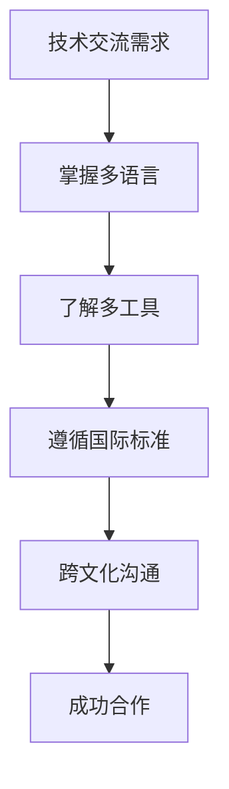
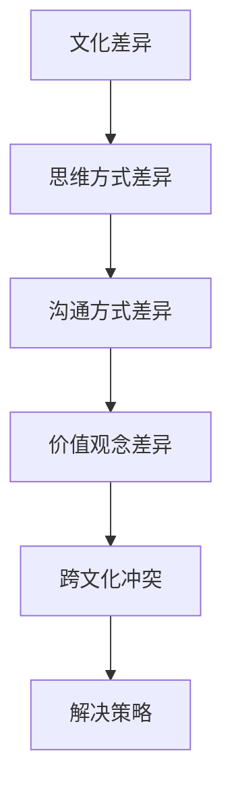

                 

关键词：全球化视野、程序员、机遇、挑战、技术交流、文化差异

> 摘要：本文旨在探讨全球化背景下程序员面临的机遇与挑战，从技术交流、文化差异、国际化标准与规范等多个角度进行分析，为程序员提供应对全球化的策略和建议。

## 1. 背景介绍

随着互联网的普及和全球化进程的加快，程序员在全球范围内的技术交流日益频繁，软件开发也逐渐走向国际化。在这个背景下，程序员不仅需要掌握本国的编程技能，还需要具备跨文化的沟通能力和适应国际化标准的意识。全球化为程序员带来了新的机遇，同时也带来了诸多挑战。

## 2. 核心概念与联系

### 2.1 技术交流

技术交流是全球化背景下程序员的重要任务。为了实现跨国合作，程序员需要掌握多种编程语言和开发工具，同时熟悉不同国家和地区的软件开发规范。以下是技术交流的Mermaid流程图：



### 2.2 文化差异

文化差异是程序员在全球化过程中需要面对的挑战。不同国家和地区的程序员在思维方式、沟通方式、价值观念等方面存在较大差异。以下是文化差异的Mermaid流程图：



## 3. 核心算法原理 & 具体操作步骤

### 3.1 算法原理概述

在全球化背景下，程序员需要掌握一些核心算法原理，以提高编程效率和解决复杂问题。以下是几个核心算法原理：

1. 贪心算法
2. 动态规划
3. 分治算法
4. 回溯算法

### 3.2 算法步骤详解

以贪心算法为例，其基本思想是每一步都做出在当前状态下最好（最有利）的选择，从而得到问题的最优解。以下是贪心算法的步骤详解：

1. 确定问题的最优解路径
2. 从起点开始，依次选择当前状态下最优的路径
3. 直到到达终点，得到问题的最优解

### 3.3 算法优缺点

贪心算法的优点是时间复杂度较低，适用于解决一些简单的优化问题。但其缺点是可能只得到局部最优解，不能保证全局最优解。因此，在实际应用中需要根据具体问题进行选择。

### 3.4 算法应用领域

贪心算法广泛应用于路径规划、资源分配、网络拓扑结构优化等领域。例如，Dijkstra算法就是一种基于贪心思想的单源最短路径算法。

## 4. 数学模型和公式 & 详细讲解 & 举例说明

### 4.1 数学模型构建

在全球化背景下，程序员需要掌握一些数学模型和公式，以解决复杂问题。以下是几个常见的数学模型：

1. 线性规划
2. 动态规划
3. 最优化理论

### 4.2 公式推导过程

以线性规划为例，其目标是找到一组变量值，使得目标函数达到最大值或最小值，同时满足一组线性约束条件。以下是线性规划的推导过程：

1. 定义变量
2. 构建目标函数
3. 构建线性约束条件
4. 求解线性方程组

### 4.3 案例分析与讲解

假设我们有一个线性规划问题，目标函数是最大化利润，同时满足生产成本、原材料供应和市场需求等约束条件。通过线性规划模型，我们可以找到最优的生产方案。

## 5. 项目实践：代码实例和详细解释说明

### 5.1 开发环境搭建

为了更好地理解全球化背景下的编程实践，我们以Python编程语言为例，搭建一个简单的开发环境。以下是开发环境的搭建步骤：

1. 安装Python
2. 安装常用第三方库
3. 配置开发环境

### 5.2 源代码详细实现

以下是一个简单的Python程序，用于计算两个数的最大公约数。通过这个例子，我们可以了解Python编程的基本语法和流程。

```python
def gcd(a, b):
    while b:
        a, b = b, a % b
    return a

a = 24
b = 36
result = gcd(a, b)
print(f"The greatest common divisor of {a} and {b} is {result}.")
```

### 5.3 代码解读与分析

在这个例子中，我们使用贪心算法来计算最大公约数。通过逐步分析代码，我们可以了解Python编程的流程和技巧。

## 6. 实际应用场景

### 6.1 全球化软件开发

在全球化软件开发中，程序员需要面对跨地区、跨语言、跨文化的挑战。通过掌握多种编程语言和开发工具，以及具备跨文化的沟通能力，程序员可以更好地适应全球化软件开发的需求。

### 6.2 国际化标准与规范

在全球化背景下，程序员需要遵循国际化的标准和规范，以确保软件的兼容性和可移植性。例如，遵循国际化的编码规范、使用国际化的数据库和文件格式等。

### 6.3 全球化项目管理

全球化项目管理是程序员在全球化背景下需要掌握的一项重要技能。通过掌握项目管理方法和工具，程序员可以更好地协调全球范围内的软件开发工作。

## 7. 工具和资源推荐

### 7.1 学习资源推荐

- 《算法导论》
- 《深入理解计算机系统》
- 《代码大全》

### 7.2 开发工具推荐

- PyCharm
- Visual Studio Code
- Eclipse

### 7.3 相关论文推荐

- "The Art of Computer Programming"
- "Algorithm Design Manual"
- "Introduction to Algorithms"

## 8. 总结：未来发展趋势与挑战

### 8.1 研究成果总结

在全球化背景下，程序员的研究成果主要集中在技术交流、文化差异、国际化标准与规范等方面。通过不断探索和改进，程序员为全球化软件开发做出了重要贡献。

### 8.2 未来发展趋势

未来，全球化背景下的程序员将面临更多机遇和挑战。随着人工智能、大数据、物联网等新兴技术的发展，程序员需要不断更新知识和技能，以适应全球化的趋势。

### 8.3 面临的挑战

全球化背景下的程序员面临的主要挑战包括：

1. 跨文化沟通与协作
2. 技术更新速度快
3. 国际化标准和规范的不断变化

### 8.4 研究展望

未来，程序员需要关注以下研究方向：

1. 跨文化沟通与协作技术
2. 软件开发的智能化和自动化
3. 国际化标准和规范的制定与实施

## 9. 附录：常见问题与解答

### 9.1 如何应对跨文化沟通与协作？

1. 学习跨文化知识，了解不同国家和地区的文化特点
2. 培养跨文化沟通能力，学会倾听和理解他人
3. 使用国际化的沟通工具和平台，提高协作效率

### 9.2 如何适应国际化标准和规范？

1. 学习国际化的编程规范和标准
2. 关注国际化标准和规范的动态，及时更新知识
3. 遵循国际化的软件开发流程和规范，提高软件质量

### 9.3 如何提高编程技能？

1. 学习编程基础知识，掌握常见的编程语言和开发工具
2. 实践编程项目，积累实战经验
3. 深入研究算法和数据结构，提高编程效率

----------------------------------------------------------------
作者：禅与计算机程序设计艺术 / Zen and the Art of Computer Programming

