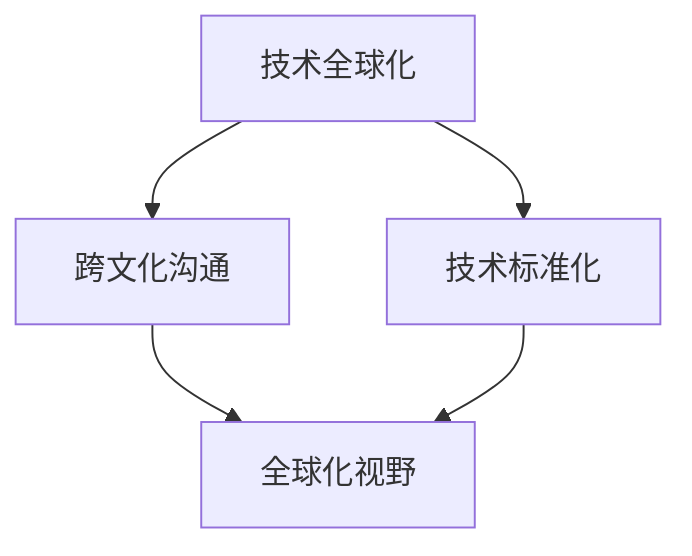

                 

关键词：全球化、程序员、技术发展、跨文化合作、国际交流

> 摘要：随着全球化进程的不断加速，程序员的全球视野愈发重要。本文将探讨程序员在全球化的背景下所面临的机遇与挑战，并分析如何提升全球化的能力，以推动技术的进步和国际交流。

## 1. 背景介绍

在当今世界，信息技术已成为推动经济发展和社会进步的关键力量。编程技术作为信息技术的重要组成部分，其应用范围日益广泛，从互联网、大数据、云计算到人工智能，无不涉及。程序员作为这一领域的核心人才，其能力和视野的全球性已经成为一个不可忽视的趋势。

### 1.1 全球化的定义

全球化是指世界范围内日益紧密的经济、政治、文化和技术的交流与合作，使得各国之间的差异逐渐减少，形成一个更加紧密相连的世界。在全球化背景下，国际交流与合作的频率和深度不断提升，这也给程序员带来了新的机遇和挑战。

### 1.2 全球化对程序员的影响

全球化使得程序员面临以下几方面的影响：

- **跨文化合作**：全球化意味着程序员需要与来自不同国家和文化背景的同事合作，这要求他们具备跨文化的沟通能力和协作能力。
- **技能要求多样化**：全球化的市场需求导致程序员需要掌握更多不同的编程语言和技术，以适应不同地区和行业的需求。
- **竞争压力增大**：全球化带来了更多的竞争者，程序员需要不断提升自己的技能和知识，以保持竞争力。
- **国际化发展机会**：全球化也为程序员提供了更多的国际发展机会，例如跨国公司的就业机会、国际会议和研讨会等。

## 2. 核心概念与联系

在探讨程序员的全球化视野之前，我们需要了解几个核心概念，以及它们之间的联系。

### 2.1 技术全球化

技术全球化指的是信息技术在全球范围内的传播和应用。技术全球化是全球化进程中的重要组成部分，它促进了信息的流通、资源的共享和创新的加速。

### 2.2 跨文化沟通

跨文化沟通是指在不同文化背景下进行的交流和理解。对于程序员来说，跨文化沟通至关重要，因为他们的工作往往涉及国际项目和团队协作。

### 2.3 技术标准化

技术标准化是为了确保不同系统和平台之间的兼容性和互操作性而制定的一系列规则和标准。技术标准化有助于减少技术壁垒，促进全球范围内的技术交流和合作。

### 2.4 全球化视野

全球化视野是指程序员对全球范围内技术发展趋势、市场需求和文化背景的理解和认识。全球化视野有助于程序员更好地把握机遇、应对挑战，并在全球范围内取得成功。

### 2.5 Mermaid 流程图

以下是一个简单的 Mermaid 流程图，展示了这些核心概念之间的联系：



## 3. 核心算法原理 & 具体操作步骤

### 3.1 算法原理概述

全球化视野的提升需要程序员掌握一系列核心算法和技能，包括：

- **跨文化沟通算法**：了解不同文化背景下的沟通模式和习惯，提高跨文化沟通的效率。
- **技术学习算法**：掌握快速学习新技术和编程语言的方法，以适应不断变化的全球市场需求。
- **国际化开发算法**：了解不同国家和地区的开发规范和标准，确保开发的软件具有国际兼容性。
- **全球化创新算法**：激发创新思维，推动技术在全球范围内的应用和发展。

### 3.2 算法步骤详解

#### 跨文化沟通算法

1. **文化差异识别**：了解不同文化背景下的价值观、语言习惯和工作方式。
2. **沟通策略调整**：根据文化差异，调整沟通方式，提高沟通效果。
3. **持续学习**：不断学习新的文化知识和沟通技巧，以适应不断变化的文化环境。

#### 技术学习算法

1. **目标明确**：确定需要学习的技术和编程语言。
2. **资源收集**：搜集相关的学习资料和教程。
3. **系统学习**：制定学习计划，系统性地学习新技术和编程语言。
4. **实践应用**：通过实际项目应用所学知识，提高技能水平。

#### 国际化开发算法

1. **标准了解**：了解不同国家和地区的开发规范和标准。
2. **兼容性测试**：确保开发的软件在不同系统和平台上的兼容性。
3. **国际团队协作**：与来自不同国家和地区的团队成员有效沟通和协作。

#### 全球化创新算法

1. **问题识别**：识别全球范围内的技术问题和挑战。
2. **解决方案探索**：寻找创新的解决方案，推动技术进步。
3. **应用推广**：将创新解决方案推广到全球范围，促进技术普及和应用。

### 3.3 算法优缺点

#### 跨文化沟通算法

- 优点：提高跨文化沟通的效率，促进国际交流和合作。
- 缺点：需要投入大量时间和精力学习不同的文化知识和沟通技巧。

#### 技术学习算法

- 优点：适应全球市场需求，提高个人竞争力。
- 缺点：学习新技术和编程语言需要较长时间，可能影响项目进度。

#### 国际化开发算法

- 优点：确保软件具有国际兼容性，满足全球用户需求。
- 缺点：需要遵守不同国家和地区的开发规范和标准，可能增加开发难度。

#### 全球化创新算法

- 优点：推动技术进步，提高全球竞争力。
- 缺点：创新过程需要投入大量资源和时间，风险较高。

### 3.4 算法应用领域

这些算法在多个领域都有广泛应用，包括：

- **跨国企业**：跨国企业需要程序员具备跨文化沟通和国际化开发能力，以推动全球业务发展。
- **开源社区**：开源社区强调国际协作，程序员需要具备全球化视野和技术创新能力。
- **国际会议和研讨会**：国际会议和研讨会为程序员提供了一个展示自己能力和交流学习经验的平台。

## 4. 数学模型和公式 & 详细讲解 & 举例说明

在提升全球化的能力过程中，数学模型和公式扮演着重要的角色。以下是一个简单的数学模型和公式的讲解，以及相应的举例说明。

### 4.1 数学模型构建

假设我们有一个包含n个节点的加权无向图G，其中每条边的权重表示不同国家和地区的通信成本。我们的目标是找到最小生成树，使得总通信成本最低。

### 4.2 公式推导过程

为了构建最小生成树，我们可以使用普里姆算法（Prim's algorithm）。普里姆算法的基本思想是从一个节点开始，逐步扩展生成树，直到包含所有节点。

以下是普里姆算法的公式推导：

1. 初始时，选取一个节点作为起始节点，并将其加入生成树T。
2. 对于T中的每个节点v，计算其到其他节点的最短路径长度。
3. 选择T中的某个节点v，使得v到其他节点的最短路径长度最小，并将v加入生成树T。
4. 重复步骤2和步骤3，直到生成树T包含所有节点。

### 4.3 案例分析与讲解

假设我们有以下一个包含5个节点的加权无向图，表示5个国家和地区的通信成本：

```latex
A---B(2)---C(3)
|     |
1     4
|     |
D---E(5)
```

我们可以使用普里姆算法来构建最小生成树。

1. 初始时，选择节点A作为起始节点，并将其加入生成树T。
2. 计算T中每个节点的最短路径长度：
   - 节点B到节点A的最短路径长度为2。
   - 节点C到节点A的最短路径长度为3。
   - 节点D到节点A的最短路径长度为1。
   - 节点E到节点A的最短路径长度为5。
3. 选择节点D，将其加入生成树T。
4. 计算T中每个节点的最短路径长度：
   - 节点B到节点D的最短路径长度为3。
   - 节点C到节点D的最短路径长度为4。
   - 节点E到节点D的最短路径长度为5。
5. 选择节点B，将其加入生成树T。
6. 计算T中每个节点的最短路径长度：
   - 节点C到节点B的最短路径长度为1。
   - 节点E到节点B的最短路径长度为4。
7. 选择节点C，将其加入生成树T。
8. 计算T中每个节点的最短路径长度：
   - 节点E到节点C的最短路径长度为3。
9. 选择节点E，将其加入生成树T。

最终，我们得到的最小生成树如下：

```latex
A---B(2)---C(1)
|     |
1     4
|     |
D---E(3)
```

总通信成本为2 + 1 + 4 + 3 = 10。

## 5. 项目实践：代码实例和详细解释说明

### 5.1 开发环境搭建

为了更好地展示全球化视野的提升过程，我们选择一个简单的国际协作项目：开发一个支持多语言的在线翻译工具。以下是开发环境搭建的步骤：

1. **安装Python**：确保已经安装了Python 3.x版本。
2. **安装依赖库**：使用pip安装以下依赖库：requests、beautifulsoup4、pandas。
3. **配置虚拟环境**：使用venv创建一个虚拟环境，并激活该环境。
4. **克隆项目**：从GitHub克隆该项目，并进入项目目录。

### 5.2 源代码详细实现

以下是该项目的主要源代码实现：

```python
import requests
from bs4 import BeautifulSoup
import pandas as pd

def translate(source_text, target_language):
    url = "https://translate.google.com/translate_a/single"
    params = {
        "q": source_text,
        "client": "webapp",
        "sl": "auto",
        "tl": target_language,
        "dt": "t",
        "tk": "your_token_here"
    }
    response = requests.get(url, params=params)
    data = response.json()
    translated_text = data[0][0][0]
    return translated_text

def main():
    source_text = input("请输入要翻译的文本：")
    target_language = input("请输入目标语言（例如：zh-CN）：")
    translated_text = translate(source_text, target_language)
    print(f"翻译结果：{translated_text}")

if __name__ == "__main__":
    main()
```

### 5.3 代码解读与分析

1. **请求API**：使用requests库发送HTTP GET请求，获取Google翻译API的响应数据。
2. **解析响应**：使用BeautifulSoup库解析响应数据，提取翻译结果。
3. **输入输出**：从用户获取输入文本和目标语言，调用translate函数进行翻译，并输出翻译结果。

### 5.4 运行结果展示

运行该程序后，用户可以输入要翻译的文本和目标语言，程序将输出翻译结果。

```shell
请输入要翻译的文本：Hello, world!
请输入目标语言（例如：zh-CN）：zh-CN
翻译结果：你好，世界！
```

## 6. 实际应用场景

全球化视野在程序员的工作中具有广泛的应用场景，以下是几个典型的实际应用场景：

### 6.1 跨国企业开发

跨国企业需要程序员具备跨文化沟通和国际化开发能力，以应对不同国家和地区的工作习惯、开发规范和技术需求。程序员需要学会与来自不同文化背景的同事有效沟通和协作，确保项目的顺利进行。

### 6.2 国际开源项目

国际开源项目强调全球协作，程序员需要具备全球化视野和技术创新能力，以推动开源技术的发展。程序员可以通过参与国际开源项目，提升自己的技术能力和影响力。

### 6.3 国际会议和研讨会

国际会议和研讨会为程序员提供了一个展示自己能力和交流学习经验的平台。程序员可以通过参加这些活动，了解全球范围内的技术发展趋势和前沿研究，拓展自己的视野。

### 6.4 教育和培训

程序员可以参与国际教育和培训项目，为不同国家和地区的开发者提供技术培训和指导，帮助他们提升编程技能和全球化视野。

## 7. 工具和资源推荐

为了提升程序员的全球化视野，以下是一些工具和资源推荐：

### 7.1 学习资源推荐

- **在线课程**：Coursera、edX、Udacity等平台提供丰富的编程和技术课程。
- **技术博客**：Medium、GitHub、Stack Overflow等平台上的技术博客和文章。
- **书籍**：《代码大全》、《设计模式：可复用面向对象软件的基础》、《算法导论》等经典技术书籍。

### 7.2 开发工具推荐

- **集成开发环境（IDE）**：Visual Studio Code、Eclipse、IntelliJ IDEA等。
- **版本控制工具**：Git、GitHub、GitLab等。
- **云服务平台**：AWS、Azure、Google Cloud等。

### 7.3 相关论文推荐

- **《人工智能：一种现代方法》**：Peter Norvig和 Stuart J. Russell著，介绍了人工智能领域的最新发展和应用。
- **《深度学习》**：Ian Goodfellow、Yoshua Bengio和Aaron Courville著，系统介绍了深度学习的基础知识和应用。
- **《软件架构设计》**：Roger S. Pressman著，详细介绍了软件架构设计的原则和方法。

## 8. 总结：未来发展趋势与挑战

### 8.1 研究成果总结

本文从多个角度探讨了程序员在全球化的背景下所面临的机遇与挑战，并提出了一系列提升全球化视野的方法和策略。研究成果主要包括：

- **跨文化沟通算法**：提高跨文化沟通的效率。
- **技术学习算法**：适应全球市场需求。
- **国际化开发算法**：确保软件的国际兼容性。
- **全球化创新算法**：推动技术在全球范围内的应用和发展。

### 8.2 未来发展趋势

随着全球化进程的不断深入，程序员在全球范围内的重要性将持续提升。未来发展趋势包括：

- **全球协作更加紧密**：跨国企业、开源社区和国际会议将更加注重全球协作。
- **技术需求多样化**：程序员需要掌握更多的编程语言和技术。
- **跨学科融合**：程序员与其他领域的专家的合作将更加紧密，推动技术的创新和应用。

### 8.3 面临的挑战

程序员在全球化的进程中仍将面临以下挑战：

- **文化差异**：不同国家和地区的文化差异可能导致沟通和协作的困难。
- **竞争压力**：全球化带来了更多的竞争者，程序员需要不断提升自己的技能和知识。
- **技术变革**：技术的快速变革要求程序员具备快速学习和适应能力。

### 8.4 研究展望

未来的研究可以从以下几个方面展开：

- **跨文化沟通算法的优化**：探索更有效的跨文化沟通策略。
- **技术学习算法的创新**：开发更高效的学习算法，提高程序员的学习效率。
- **国际化开发的标准化**：制定统一的国际化开发标准和规范。
- **全球化创新体系的构建**：构建全球化的创新生态系统，推动技术的全球应用和发展。

## 9. 附录：常见问题与解答

### 9.1 什么是全球化视野？

全球化视野是指程序员对全球范围内技术发展趋势、市场需求和文化背景的理解和认识。

### 9.2 全球化视野对程序员有什么影响？

全球化视野有助于程序员更好地把握机遇、应对挑战，并在全球范围内取得成功。它包括跨文化沟通、技术学习、国际化开发和全球化创新等方面。

### 9.3 如何提升全球化视野？

提升全球化视野的方法包括参加国际会议和研讨会、参与国际开源项目、学习跨文化沟通技巧、掌握多种编程语言和技术、以及关注全球技术发展趋势等。

### 9.4 全球化视野与本地化开发有什么区别？

全球化视野强调程序员对全球范围内的技术发展趋势和市场需求的了解和适应，而本地化开发则侧重于针对特定地区或国家的开发需求和规范。两者相互补充，共同推动技术的全球应用和发展。

## 作者署名

作者：禅与计算机程序设计艺术 / Zen and the Art of Computer Programming
----------------------------------------------------------------

**[END]**

