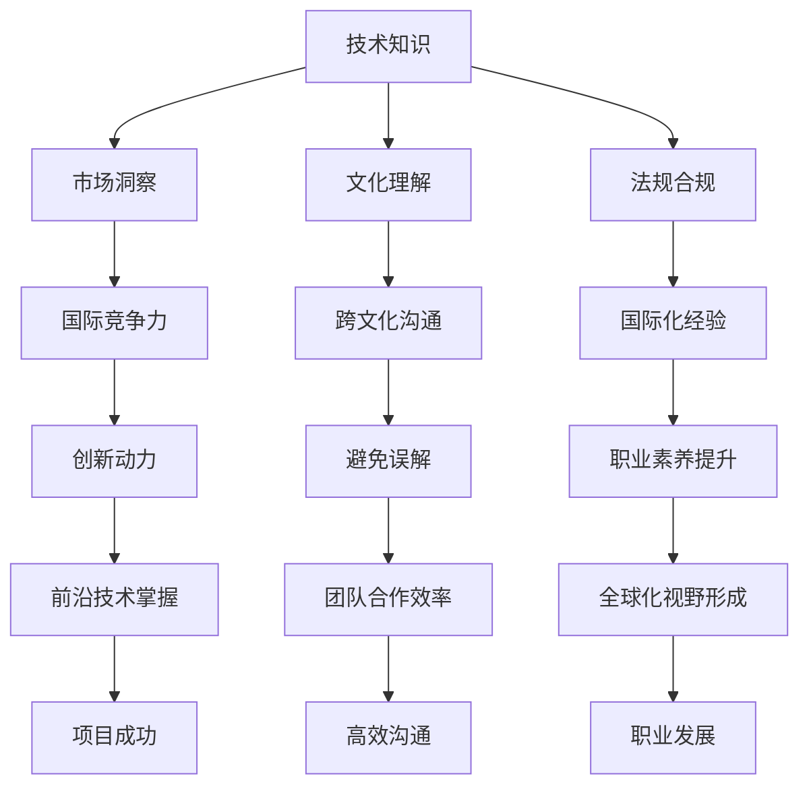

                 

关键词：全球化视野、程序员、机遇、挑战、技术传播、跨文化沟通、国际合作、技能需求。

> 摘要：本文将探讨程序员的全球化视野对于其在国际舞台上发挥重要作用所面临的机遇与挑战。随着全球化的不断深入，程序员的工作范围不再局限于本地市场，而是跨越国界，涉及跨国公司和国际项目。本文旨在分析程序员在全球化的背景下如何抓住机遇、应对挑战，以及如何通过提升全球化视野来增强自身的竞争力。

## 1. 背景介绍

全球化是当今世界经济发展的主旋律，信息技术的飞速进步更是为全球化注入了强大动力。互联网的普及、云计算的兴起以及移动设备的广泛使用，使得程序员的工作不再受地域限制。他们可以通过远程协作参与国际项目，共享全球资源，实现知识和技术的高效传播。

### 1.1 全球化带来的机遇

全球化为程序员带来了以下机遇：

- **跨国工作机会**：程序员可以参与到跨国公司或国际项目中，获得更广泛的职业发展空间。
- **技能多样性**：全球化的工作环境要求程序员掌握多种编程语言和工具，提升自身技能多样性。
- **薪资水平提升**：程序员在国际项目中的高技能需求通常能带来更高的薪资回报。
- **知识共享**：程序员可以通过全球协作，分享和借鉴各地的优秀实践和经验。

### 1.2 全球化带来的挑战

然而，全球化也带来了新的挑战：

- **文化差异**：程序员需要在多元文化的团队中工作，这要求他们具备良好的跨文化沟通能力。
- **时区差异**：国际项目通常涉及跨时区协作，程序员需要适应不同的工作时间安排。
- **隐私与安全问题**：跨境数据传输和处理可能面临不同的法律法规，程序员需要了解并遵守不同国家的数据保护政策。
- **技能不均衡**：不同国家在编程教育和职业培训方面的差异可能导致程序员技能水平的不均衡。

## 2. 核心概念与联系

### 2.1 全球化视野的定义

全球化视野是指程序员在全球化背景下，能够从全球范围内理解和分析技术发展、市场需求、文化差异等问题的能力。这种视野不仅要求程序员具备专业的技术能力，还要求他们具有跨文化沟通和合作的能力。

### 2.2 全球化视野的重要性

全球化视野对程序员的重要性体现在以下几个方面：

- **国际竞争力**：具备全球化视野的程序员能更好地适应国际市场的需求，提升个人和团队的竞争力。
- **创新动力**：全球化视野使程序员能够接触到全球最前沿的技术和理念，激发创新思维。
- **跨文化沟通**：全球化视野有助于程序员在多元文化环境中有效沟通，避免误解和冲突。
- **国际化经验**：通过参与国际项目，程序员可以获得宝贵的国际化经验，提升职业素养。

### 2.3 全球化视野的架构

为了更好地理解全球化视野，我们可以将其分为以下几个部分：

- **技术知识**：程序员需要掌握多种编程语言、框架和工具，具备解决复杂技术问题的能力。
- **市场洞察**：程序员需要了解全球市场的动态，包括需求、趋势和竞争环境。
- **文化理解**：程序员需要具备跨文化沟通和合作的能力，理解不同文化的价值观和习惯。
- **法规合规**：程序员需要了解不同国家的法律法规，特别是与数据隐私和安全相关的内容。

### 2.4 全球化视野的 Mermaid 流程图



## 3. 核心算法原理 & 具体操作步骤

### 3.1 算法原理概述

全球化视野的形成是一个复杂的过程，涉及多个因素的交互作用。以下是一些关键原理和步骤：

- **知识积累**：程序员需要通过不断学习和实践，积累广泛的技术知识和市场洞察。
- **文化认知**：程序员需要通过跨文化交流，加深对不同文化的理解。
- **经验积累**：程序员需要通过参与国际项目，积累实际操作经验。
- **自我反思**：程序员需要定期进行自我反思，总结经验，不断提升自我。

### 3.2 算法步骤详解

#### 步骤一：知识积累

- **学习新技术**：定期学习新的编程语言、框架和工具，保持技术更新。
- **参加培训课程**：参加线上或线下的培训课程，提升专业知识和技能。
- **阅读专业书籍**：阅读与编程、市场和跨文化相关的书籍，拓宽视野。

#### 步骤二：文化认知

- **了解文化差异**：通过阅读、交流和观察，了解不同文化的价值观、习惯和行为模式。
- **跨文化培训**：参加跨文化培训，提高跨文化沟通和合作的能力。
- **参与国际交流**：参与国际会议、研讨会和交流活动，与来自不同国家的同行交流。

#### 步骤三：经验积累

- **参与国际项目**：积极参与国际项目，了解项目运作流程，积累跨国工作经验。
- **实践应用**：将所学知识和技能应用到实际项目中，解决实际问题。
- **反思与总结**：在项目结束后，进行反思和总结，发现问题，吸取经验。

#### 步骤四：自我反思

- **定期评估**：定期评估自己的知识和技能，找出不足之处。
- **制定改进计划**：根据评估结果，制定改进计划，不断提升自我。
- **持续学习**：保持持续学习的态度，不断更新自己的知识库。

### 3.3 算法优缺点

#### 优点

- **提高国际竞争力**：通过全球化视野的形成，程序员能更好地适应国际市场的需求，提高个人和团队的竞争力。
- **促进创新**：全球化视野使程序员能够接触到全球最前沿的技术和理念，激发创新思维。
- **提升职业素养**：全球化视野有助于程序员在多元文化环境中有效沟通，提升职业素养。

#### 缺点

- **文化冲突**：在多元文化环境中工作，程序员可能会面临文化冲突和误解。
- **工作压力**：跨国项目的时区差异和协调难度可能增加程序员的工作压力。
- **法规合规问题**：不同国家的法律法规可能对程序员的工作产生限制。

### 3.4 算法应用领域

全球化视野的形成对程序员在以下领域有重要影响：

- **跨国公司**：跨国公司的程序员需要具备全球化视野，以适应全球业务的需求。
- **国际项目**：国际项目的程序员需要具备全球化视野，以实现跨国协作和项目成功。
- **开源社区**：开源社区的程序员通过全球化视野，可以更好地参与全球开源项目的开发和推广。
- **教育和培训**：教育和培训机构的程序员需要具备全球化视野，以培养具有国际竞争力的学生和学员。

## 4. 数学模型和公式 & 详细讲解 & 举例说明

### 4.1 数学模型构建

全球化视野的形成可以看作是一个动态系统，其数学模型可以表示为以下形式：

\[ FV(t) = f(K(t), C(t), E(t), R(t)) \]

其中：

- \( FV(t) \) 表示在时间 \( t \) 的全球化视野水平。
- \( K(t) \) 表示在时间 \( t \) 的技术知识水平。
- \( C(t) \) 表示在时间 \( t \) 的文化认知水平。
- \( E(t) \) 表示在时间 \( t \) 的实践经验水平。
- \( R(t) \) 表示在时间 \( t \) 的自我反思能力。

### 4.2 公式推导过程

公式 \( FV(t) = f(K(t), C(t), E(t), R(t)) \) 的推导过程如下：

1. **技术知识水平的影响**：技术知识水平 \( K(t) \) 对全球化视野 \( FV(t) \) 产生直接影响。技术知识越丰富，全球化视野越宽广。
2. **文化认知水平的影响**：文化认知水平 \( C(t) \) 对全球化视野 \( FV(t) \) 产生间接影响。良好的文化认知有助于程序员在多元文化环境中有效沟通和合作。
3. **实践经验水平的影响**：实践经验水平 \( E(t) \) 对全球化视野 \( FV(t) \) 产生直接影响。丰富的实践经验使程序员能够更好地应对全球化工作环境中的各种挑战。
4. **自我反思能力的影响**：自我反思能力 \( R(t) \) 对全球化视野 \( FV(t) \) 产生间接影响。通过自我反思，程序员可以不断提升自我，优化全球化视野。

### 4.3 案例分析与讲解

#### 案例一：跨国公司程序员

某跨国公司的程序员A通过以下步骤提升了全球化视野：

1. **知识积累**：学习多种编程语言、框架和工具，参加相关培训课程，阅读专业书籍。
2. **文化认知**：参加跨文化培训，了解不同文化的价值观和习惯，参与国际交流活动。
3. **经验积累**：参与多个国际项目，了解项目运作流程，积累跨国工作经验。
4. **自我反思**：定期评估自己的知识和技能，总结经验，制定改进计划。

通过这些步骤，程序员A的全球化视野得到了显著提升，成功适应了跨国公司的需求，并在工作中取得了优异成绩。

#### 案例二：开源社区程序员

某开源社区的程序员B通过以下步骤提升了全球化视野：

1. **知识积累**：学习多种编程语言、框架和工具，参加开源社区活动，了解全球开源项目的发展趋势。
2. **文化认知**：通过阅读、交流和观察，了解不同文化的价值观和习惯，与来自不同国家的同行进行技术交流。
3. **经验积累**：参与多个开源项目，解决各种技术难题，积累丰富的实践经验。
4. **自我反思**：定期评估自己的知识和技能，总结经验，不断优化全球化视野。

通过这些步骤，程序员B在开源社区中获得了广泛的认可，并成为了全球开源项目的重要贡献者。

## 5. 项目实践：代码实例和详细解释说明

### 5.1 开发环境搭建

为了更好地实践全球化视野的提升，我们可以选择一个具体的开源项目，如GitHub上的一个国际化项目。首先，我们需要搭建开发环境。

#### 步骤一：安装Git

在本地计算机上安装Git，以便克隆项目仓库并提交代码。

```bash
$ sudo apt-get install git
```

#### 步骤二：安装Node.js

安装Node.js和npm，以便运行项目所需的命令。

```bash
$ sudo apt-get install nodejs
$ sudo npm install -g npm
```

#### 步骤三：克隆项目仓库

克隆GitHub上的国际化项目仓库。

```bash
$ git clone https://github.com/your-username/internationalization-project.git
```

#### 步骤四：安装依赖项

进入项目目录，安装项目所需的依赖项。

```bash
$ cd internationalization-project
$ npm install
```

### 5.2 源代码详细实现

国际化项目通常包含以下关键文件和模块：

- **src/index.js**：主程序文件，负责处理前端和后端的交互。
- **src/i18n.js**：国际化模块，负责处理多语言支持。
- **src/locale/**/*.js**：语言包文件，包含不同语言的翻译。

以下是一个简单的国际化示例：

```javascript
// src/i18n.js

const locales = {
  en: require('./locale/en.json'),
  zh: require('./locale/zh.json')
};

function setLocale(locale) {
  window.locale = locale;
}

function getTranslation(key) {
  return locales[window.locale][key];
}

module.exports = {
  setLocale,
  getTranslation
};
```

```javascript
// src/locale/en.json

{
  "welcome": "Welcome",
  "sign_in": "Sign In"
}
```

```javascript
// src/locale/zh.json

{
  "welcome": "欢迎",
  "sign_in": "登录"
}
```

### 5.3 代码解读与分析

在该项目中，`src/i18n.js` 负责处理多语言支持。它定义了一个 `locales` 对象，包含两个语言包：英文（en）和中文（zh）。通过 `setLocale` 函数，我们可以设置当前语言。`getTranslation` 函数则根据当前语言获取翻译。

在 `src/locale/**/*.js` 文件中，我们定义了不同语言的翻译内容。例如，英文中 "welcome" 翻译为 "Welcome"，中文中翻译为 "欢迎"。

在主程序文件 `src/index.js` 中，我们可以使用 `i18n` 模块提供的函数来显示多语言界面。

```javascript
// src/index.js

const i18n = require('./i18n');

i18n.setLocale('zh');

document.getElementById('welcome').textContent = i18n.getTranslation('welcome');
document.getElementById('sign_in').textContent = i18n.getTranslation('sign_in');
```

在该示例中，我们首先设置了中文语言，然后使用 `getTranslation` 函数获取翻译，并将其显示在页面上。

### 5.4 运行结果展示

通过以上代码，我们可以在页面上显示中文界面。例如，页面上的 "welcome" 将显示为 "欢迎"，"sign_in" 将显示为 "登录"。

## 6. 实际应用场景

### 6.1 跨国公司

跨国公司通常需要处理多个国家和地区的业务，程序员需要具备全球化视野，以便：

- **适应不同市场的需求**：了解不同市场的技术趋势和用户需求，提供适合当地的产品和服务。
- **实现跨国协作**：与来自不同国家的同事和合作伙伴有效沟通，确保项目顺利进行。

### 6.2 国际项目

国际项目通常涉及多个国家和团队，程序员需要具备全球化视野，以便：

- **协调不同团队的进度**：理解不同团队的时区和工作习惯，确保项目按时完成。
- **解决文化冲突**：了解不同文化的价值观和习惯，避免误解和冲突。

### 6.3 开源社区

开源社区是一个全球化的平台，程序员需要具备全球化视野，以便：

- **参与国际项目**：与全球的开发者合作，共同推动开源项目的发展。
- **推广技术理念**：将本地技术理念推广到全球，促进技术交流和合作。

### 6.4 未来应用展望

随着全球化的不断深入，全球化视野在程序员中的应用前景广阔。未来，程序员需要：

- **提升跨文化沟通能力**：在多元文化环境中更加自如地沟通和合作。
- **掌握多种编程语言和工具**：适应不同市场需求，提高竞争力。
- **关注全球技术趋势**：紧跟全球技术发展，推动技术创新。

## 7. 工具和资源推荐

### 7.1 学习资源推荐

- **在线课程**：Coursera、edX、Udemy 等平台上提供的国际化编程、跨文化沟通等课程。
- **书籍**：《全球软件工程》、《跨文化项目管理》等关于全球化视野的书籍。

### 7.2 开发工具推荐

- **版本控制工具**：Git、GitHub、GitLab 等。
- **国际化框架**：i18next、Angular i18n、React Intl 等。

### 7.3 相关论文推荐

- **《全球化与软件开发：挑战与机遇》**：分析全球化对软件开发的影响。
- **《跨文化沟通在国际化项目中的重要性》**：探讨跨文化沟通在国际项目中的关键作用。

## 8. 总结：未来发展趋势与挑战

### 8.1 研究成果总结

本文通过对全球化视野的分析，总结了程序员在全球化的背景下如何抓住机遇、应对挑战，以及如何通过提升全球化视野来增强自身的竞争力。研究发现，全球化视野的形成是一个动态过程，涉及技术知识、文化认知、实践经验等多个方面。

### 8.2 未来发展趋势

未来，全球化视野在程序员中的应用前景广阔。随着全球化的不断深入，程序员需要：

- **提升跨文化沟通能力**：在多元文化环境中更加自如地沟通和合作。
- **掌握多种编程语言和工具**：适应不同市场需求，提高竞争力。
- **关注全球技术趋势**：紧跟全球技术发展，推动技术创新。

### 8.3 面临的挑战

然而，全球化视野的形成也面临一系列挑战，包括：

- **文化冲突**：在多元文化环境中工作，程序员可能会面临文化冲突和误解。
- **工作压力**：跨国项目的时区差异和协调难度可能增加程序员的工作压力。
- **法规合规问题**：不同国家的法律法规可能对程序员的工作产生限制。

### 8.4 研究展望

未来的研究可以从以下几个方面展开：

- **全球化视野的量化评估**：开发量化评估模型，评估程序员的全球化视野水平。
- **跨文化沟通策略**：研究有效的跨文化沟通策略，提高程序员在国际项目中的沟通效果。
- **全球化教育与培训**：探索全球化教育与培训模式，培养具有全球化视野的程序员。

## 9. 附录：常见问题与解答

### 9.1 全球化视野是什么？

全球化视野是指程序员在全球化背景下，能够从全球范围内理解和分析技术发展、市场需求、文化差异等问题的能力。

### 9.2 为什么程序员需要全球化视野？

全球化视野有助于程序员提高国际竞争力、促进创新、提升职业素养，并更好地适应跨国公司的需求、国际项目和开源社区的工作环境。

### 9.3 如何提升全球化视野？

提升全球化视野的方法包括学习新技术、进行跨文化培训、参与国际项目、积累实践经验以及定期自我反思。

### 9.4 全球化视野对程序员的工作有哪些影响？

全球化视野对程序员的工作影响广泛，包括提高工作效率、优化项目管理、促进团队合作、提升职业发展等。

## 文章作者

> 作者：禅与计算机程序设计艺术 / Zen and the Art of Computer Programming

本文旨在为程序员提供关于全球化视野的深入分析和实用建议，帮助他们在全球化背景下抓住机遇、应对挑战，实现职业发展。希望本文能对广大程序员有所启发和帮助。

----------------------------------------------------------------

以上就是文章的正文内容。请确认文章的完整性、结构和内容是否符合您的要求。如果需要任何修改或补充，请及时告知。在完成确认后，我将为您生成最终的Markdown格式文章。

