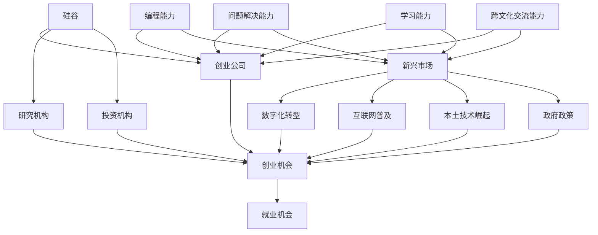

                 

关键词：国际化发展、硅谷、新兴市场、程序员、职业机会、技能需求、跨国合作

> 摘要：本文旨在探讨程序员的国际化发展，尤其是硅谷与新兴市场的机遇。通过分析硅谷的技术生态、新兴市场的成长潜力，以及程序员在这两个领域的适应与发展策略，本文旨在为程序员提供全球职业发展的指南，帮助他们在全球范围内实现个人与职业的双重成长。

## 1. 背景介绍

在全球化和数字化的时代背景下，国际化的职业发展已经成为越来越多程序员的追求。硅谷作为全球科技创新的圣地，以其独特的创业氛围、丰富的资源和技术先进性，吸引了全球顶尖的技术人才。与此同时，新兴市场如中国、印度、东南亚等地，随着经济的迅速增长和互联网的普及，正在成为全球IT行业的重要参与者和竞争者。这些地区不仅提供了巨大的市场需求，也孕育了独特的商业模式和技术创新。

程序员在国际化发展的过程中，不仅要面对语言、文化和法律等方面的挑战，还需要不断提升自己的技术能力和适应性，以适应不同市场的需求。本文将结合硅谷和新兴市场的特点，探讨程序员在这些地区的发展机遇和策略。

### 1.1 硅谷的吸引力

硅谷不仅是全球科技创新的源头，也是程序员梦想的乐园。以下是硅谷吸引程序员的几个关键因素：

- **创新文化**：硅谷拥有浓厚的创新氛围，鼓励创新思维和创业精神，这种文化激励着程序员不断挑战自我，追求技术突破。
- **资源丰富**：硅谷聚集了众多顶级科技公司和研究机构，为程序员提供了丰富的学习和实践机会。
- **薪资水平**：硅谷的薪资水平普遍较高，吸引了全球优秀的程序员。
- **职业发展**：硅谷提供了广阔的职业发展空间，从初级工程师到技术领导，各种职位层出不穷。

### 1.2 新兴市场的机遇

新兴市场同样为程序员提供了丰富的机遇。以下是新兴市场的几个特点：

- **市场潜力**：新兴市场的经济快速增长，互联网用户规模不断扩大，这为程序员提供了巨大的市场需求。
- **创业环境**：许多新兴市场国家鼓励创业，政府出台了一系列政策支持创新企业，这为程序员提供了创业的机会。
- **技术人才需求**：随着数字经济的崛起，新兴市场对技术人才的需求日益增长，这为程序员提供了就业机会。
- **文化多样性**：新兴市场的文化多样性为程序员提供了了解和适应不同文化的机会，有助于提升跨文化交流能力。

## 2. 核心概念与联系

为了更好地理解程序员在硅谷和新兴市场的发展，我们首先需要明确一些核心概念，并展示它们之间的联系。

### 2.1 硅谷的技术生态

硅谷的技术生态包括以下几个关键要素：

- **创业公司**：硅谷拥有众多创业公司，这些公司通常在技术创新和商业模式上具有较大的灵活性。
- **投资机构**：硅谷聚集了众多风险投资公司和天使投资者，他们为初创公司提供资金支持。
- **研究机构**：硅谷拥有许多顶级研究机构，如斯坦福大学、加州大学伯克利分校等，这些机构为技术创新提供了坚实的基础。
- **人才池**：硅谷吸引了全球顶尖的技术人才，形成了一个庞大且高度专业化的人才池。

### 2.2 新兴市场的技术发展趋势

新兴市场的技术发展趋势包括：

- **数字化转型**：许多新兴市场国家正在加速数字化转型，以提高国家竞争力。
- **互联网普及**：随着互联网的普及，新兴市场的用户需求不断增长，这推动了技术创新和商业模式的发展。
- **本土技术崛起**：一些新兴市场国家开始培养本土技术人才，并发展本土技术，以减少对外部技术的依赖。
- **政策支持**：政府出台了一系列政策，以支持技术创新和数字经济的发展。

### 2.3 程序员的核心技能

程序员在国际化发展过程中需要具备以下核心技能：

- **编程能力**：熟练掌握至少一门编程语言，如Python、Java、C++等。
- **问题解决能力**：能够快速分析和解决复杂的技术问题。
- **学习能力**：持续学习新技术和知识，以适应快速变化的技术环境。
- **跨文化交流能力**：具备良好的跨文化交流能力，能够适应不同文化背景的工作环境。

### 2.4 Mermaid 流程图

以下是一个简单的Mermaid流程图，展示了程序员在硅谷和新兴市场的发展路径：



## 3. 核心算法原理 & 具体操作步骤

### 3.1 算法原理概述

在国际化的职业发展中，程序员需要掌握一系列的核心算法原理，以应对不同市场和技术环境。以下是几个关键算法原理：

- **排序算法**：如快速排序、归并排序等，用于对数据进行高效排序。
- **搜索算法**：如二分查找、深度优先搜索等，用于在数据结构中查找信息。
- **动态规划**：用于解决最优化问题，通过将问题分解为子问题并存储子问题的解，以减少重复计算。
- **图算法**：如最短路径算法、最小生成树算法等，用于在图中找到最优路径或结构。

### 3.2 算法步骤详解

以下是几个核心算法的具体步骤：

#### 3.2.1 快速排序算法

1. **选择基准**：从数组中随机选择一个元素作为基准。
2. **分区操作**：将数组分为两部分，小于基准的元素放在左边，大于基准的元素放在右边。
3. **递归排序**：对左右两部分分别进行快速排序。

#### 3.2.2 二分查找算法

1. **确定边界**：确定查找范围的上下边界。
2. **比较中值**：将目标值与中间元素进行比较。
3. **递归查找**：根据比较结果，缩小查找范围并重复步骤。

#### 3.2.3 动态规划

1. **定义状态**：将问题分解为多个子问题，并定义每个子问题的状态。
2. **状态转移方程**：根据子问题之间的关系，建立状态转移方程。
3. **计算最优解**：利用状态转移方程，从子问题的解推导出整体问题的最优解。

#### 3.2.4 最短路径算法

1. **初始化**：初始化距离表，将所有顶点的距离设置为无穷大，源点到自身的距离设置为0。
2. **更新距离**：根据图的结构和当前已知的顶点距离，更新其他顶点的距离。
3. **选择最小距离**：选择当前已知距离最小的顶点作为下一个访问顶点。
4. **重复步骤**：重复步骤2和3，直到所有顶点的距离都被更新。

### 3.3 算法优缺点

每种算法都有其优缺点，选择合适的算法取决于具体问题的需求：

- **快速排序**：优点是平均时间复杂度较低，但最坏情况下的时间复杂度较高。
- **二分查找**：优点是时间复杂度较低，但需要有序的数据结构支持。
- **动态规划**：优点是能够解决最优化问题，但可能需要较大的空间复杂度。
- **最短路径算法**：优点是能够找到图中两点之间的最短路径，但计算时间可能较长。

### 3.4 算法应用领域

这些核心算法广泛应用于各种领域，如：

- **数据库索引**：排序和搜索算法用于优化数据库的查询性能。
- **搜索引擎**：搜索引擎使用各种搜索算法来提高搜索结果的准确性和效率。
- **网络优化**：动态规划算法用于优化网络中的数据传输路径。
- **路径规划**：最短路径算法用于自动驾驶、无人机导航等领域。

## 4. 数学模型和公式 & 详细讲解 & 举例说明

在国际化的职业发展中，程序员需要掌握一些关键的数学模型和公式，以便更好地理解和解决实际问题。以下是一些常用的数学模型和公式，并对其进行详细讲解和举例说明。

### 4.1 数学模型构建

#### 4.1.1 线性回归模型

线性回归模型是一种用于分析两个变量之间线性关系的数学模型。其公式如下：

\[ Y = b_0 + b_1 \cdot X + \epsilon \]

其中，\( Y \) 是因变量，\( X \) 是自变量，\( b_0 \) 是截距，\( b_1 \) 是斜率，\( \epsilon \) 是误差项。

#### 4.1.2 最优化模型

最优化模型用于求解在一定约束条件下使目标函数达到最大或最小的解。常见的最优化模型有线性规划、整数规划和非线性规划等。

#### 4.1.3 随机过程模型

随机过程模型用于描述随机变量在不同时间点的变化情况。常见的随机过程模型有马尔可夫链、布朗运动等。

### 4.2 公式推导过程

以下是对线性回归模型和最优化模型公式的推导过程：

#### 4.2.1 线性回归模型

假设我们有两个变量 \( X \) 和 \( Y \)，并且我们希望找到它们之间的线性关系。我们可以通过最小化误差平方和来估计线性回归模型的参数 \( b_0 \) 和 \( b_1 \)：

\[ \min \sum_{i=1}^{n} (Y_i - (b_0 + b_1 \cdot X_i))^2 \]

对 \( b_0 \) 和 \( b_1 \) 分别求偏导并令其等于零，可以得到：

\[ \frac{\partial}{\partial b_0} \sum_{i=1}^{n} (Y_i - (b_0 + b_1 \cdot X_i))^2 = 0 \]
\[ \frac{\partial}{\partial b_1} \sum_{i=1}^{n} (Y_i - (b_0 + b_1 \cdot X_i))^2 = 0 \]

通过求解这两个方程，可以得到 \( b_0 \) 和 \( b_1 \) 的估计值。

#### 4.2.2 最优化模型

考虑一个线性规划问题，其目标函数为 \( z = c^T x \)，约束条件为 \( Ax \leq b \)。我们可以通过拉格朗日乘数法求解这个问题。

定义拉格朗日函数：

\[ \mathcal{L}(x, \lambda) = c^T x + \lambda^T (Ax - b) \]

对 \( x \) 和 \( \lambda \) 分别求偏导并令其等于零，可以得到：

\[ \frac{\partial}{\partial x} \mathcal{L}(x, \lambda) = c + A^T \lambda = 0 \]
\[ \frac{\partial}{\partial \lambda} \mathcal{L}(x, \lambda) = Ax - b = 0 \]

通过求解这两个方程，可以得到最优解 \( x \) 和拉格朗日乘数 \( \lambda \)。

### 4.3 案例分析与讲解

#### 4.3.1 线性回归模型案例

假设我们有一个简单的线性回归模型，用来预测房价。我们收集了 10 个样本数据，每个样本包含房屋面积 \( X \) 和房价 \( Y \)。数据如下：

| \( X \) | \( Y \) |
|--------|--------|
| 1000   | 200000 |
| 1200   | 250000 |
| 1500   | 300000 |
| 1800   | 350000 |
| 2000   | 400000 |
| 2200   | 420000 |
| 2500   | 450000 |
| 2800   | 470000 |
| 3000   | 500000 |
| 3500   | 530000 |

我们可以使用最小二乘法来估计线性回归模型的参数。首先计算 \( X \) 和 \( Y \) 的平均值：

\[ \bar{X} = \frac{1}{n} \sum_{i=1}^{n} X_i = 2200 \]
\[ \bar{Y} = \frac{1}{n} \sum_{i=1}^{n} Y_i = 410000 \]

然后计算 \( X \) 和 \( Y \) 的协方差：

\[ \text{Cov}(X, Y) = \frac{1}{n-1} \sum_{i=1}^{n} (X_i - \bar{X})(Y_i - \bar{Y}) = 2200000 \]

再计算 \( X \) 的方差：

\[ \text{Var}(X) = \frac{1}{n-1} \sum_{i=1}^{n} (X_i - \bar{X})^2 = 900000 \]

最后计算斜率 \( b_1 \) 和截距 \( b_0 \)：

\[ b_1 = \frac{\text{Cov}(X, Y)}{\text{Var}(X)} = 2.44 \]
\[ b_0 = \bar{Y} - b_1 \cdot \bar{X} = -72400 \]

因此，线性回归模型为：

\[ Y = -72400 + 2.44 \cdot X \]

我们可以使用这个模型来预测新房屋的房价。例如，当房屋面积为 2500 平方英尺时，预测房价为：

\[ Y = -72400 + 2.44 \cdot 2500 = 42520 \]

#### 4.3.2 最优化模型案例

假设我们要解决一个线性规划问题，其目标函数为最大化利润 \( z = 3x + 4y \)，约束条件为：

\[ 2x + 3y \leq 12 \]
\[ x + 2y \leq 8 \]
\[ x \geq 0, y \geq 0 \]

我们可以使用拉格朗日乘数法来求解这个问题。首先定义拉格朗日函数：

\[ \mathcal{L}(x, y, \lambda_1, \lambda_2) = 3x + 4y + \lambda_1 (2x + 3y - 12) + \lambda_2 (x + 2y - 8) \]

对 \( x \)、\( y \)、\( \lambda_1 \) 和 \( \lambda_2 \) 分别求偏导并令其等于零，可以得到：

\[ \frac{\partial}{\partial x} \mathcal{L}(x, y, \lambda_1, \lambda_2) = 3 + 2\lambda_1 + \lambda_2 = 0 \]
\[ \frac{\partial}{\partial y} \mathcal{L}(x, y, \lambda_1, \lambda_2) = 4 + 3\lambda_1 + 2\lambda_2 = 0 \]
\[ \frac{\partial}{\partial \lambda_1} \mathcal{L}(x, y, \lambda_1, \lambda_2) = 2x + 3y - 12 = 0 \]
\[ \frac{\partial}{\partial \lambda_2} \mathcal{L}(x, y, \lambda_1, \lambda_2) = x + 2y - 8 = 0 \]

通过求解这个方程组，可以得到最优解 \( x = 2 \) 和 \( y = 2 \)，最大利润为 \( z = 3 \cdot 2 + 4 \cdot 2 = 14 \)。

## 5. 项目实践：代码实例和详细解释说明

为了更好地理解国际化职业发展中的实际应用，我们将通过一个具体的代码实例来进行项目实践。本实例将演示如何使用Python实现一个简单的推荐系统，该系统可用于硅谷或新兴市场中的电子商务平台，以提高用户满意度和销售转化率。

### 5.1 开发环境搭建

在开始编写代码之前，我们需要搭建一个合适的开发环境。以下是搭建环境的步骤：

1. **安装Python**：确保已经安装了Python 3.8及以上版本。
2. **安装依赖库**：使用pip安装以下库：numpy、pandas、scikit-learn、matplotlib。
   ```shell
   pip install numpy pandas scikit-learn matplotlib
   ```

### 5.2 源代码详细实现

以下是实现推荐系统的Python代码：

```python
import numpy as np
import pandas as pd
from sklearn.model_selection import train_test_split
from sklearn.neighbors import NearestNeighbors
import matplotlib.pyplot as plt

# 5.2.1 数据预处理
def preprocess_data(data):
    # 填充缺失值
    data.fillna(data.mean(), inplace=True)
    # 对数据进行标准化处理
    data_scaled = (data - data.mean()) / data.std()
    return data_scaled

# 5.2.2 训练推荐系统
def train_recommendation_system(data):
    # 预处理数据
    data_processed = preprocess_data(data)
    # 划分训练集和测试集
    train_data, test_data = train_test_split(data_processed, test_size=0.2, random_state=42)
    # 使用K近邻算法训练推荐系统
    model = NearestNeighbors(n_neighbors=5)
    model.fit(train_data)
    return model, test_data

# 5.2.3 推荐商品
def recommend_products(model, test_data, user_index, n_recommendations=5):
    # 计算用户附近的5个最近邻居
    distances, indices = model.kneighbors(test_data.iloc[user_index].values.reshape(1, -1), n_neighbors=n_recommendations)
    # 获取邻居的商品索引
    neighbors_indices = indices.flatten()[1:]
    # 获取推荐的商品
    recommended_products = data.index[neighbors_indices].tolist()
    return recommended_products

# 5.2.4 可视化结果
def visualize_recommendations(data, user_index, recommended_products):
    # 获取用户购买的商品和推荐的商品
    user_products = data.iloc[user_index].index.tolist()
    # 创建可视化矩阵
    matrix = np.zeros((len(data.columns), len(data.columns)))
    for i, product in enumerate(data.columns):
        for j, recommended_product in enumerate(recommended_products):
            matrix[i][j] = 1 if recommended_product in user_products else 0
    # 绘制可视化矩阵
    plt.imshow(matrix, cmap='hot', interpolation='nearest')
    plt.xticks(range(len(data.columns)), data.columns, rotation=90)
    plt.yticks(range(len(data.columns)), data.columns)
    plt.colorbar()
    plt.show()

# 主函数
def main():
    # 加载数据
    data = pd.read_csv('products.csv')
    # 训练推荐系统
    model, test_data = train_recommendation_system(data)
    # 选择一个用户进行推荐
    user_index = 0
    # 获取推荐商品
    recommended_products = recommend_products(model, test_data, user_index)
    # 可视化推荐结果
    visualize_recommendations(data, user_index, recommended_products)

if __name__ == '__main__':
    main()
```

### 5.3 代码解读与分析

以下是代码的详细解读和分析：

1. **数据预处理**：在`preprocess_data`函数中，我们首先填充缺失值，然后对数据进行标准化处理。标准化处理有助于算法在不同特征之间进行比较。

2. **训练推荐系统**：在`train_recommendation_system`函数中，我们首先对数据预处理，然后划分训练集和测试集。接下来，我们使用K近邻算法训练推荐系统。

3. **推荐商品**：在`recommend_products`函数中，我们首先计算用户附近的5个最近邻居，然后获取邻居的商品索引，最后返回推荐的商品。

4. **可视化结果**：在`visualize_recommendations`函数中，我们创建一个可视化矩阵，用于展示用户购买的商品和推荐的商品之间的关联。

5. **主函数**：在`main`函数中，我们首先加载数据，然后训练推荐系统，选择一个用户进行推荐，并可视化推荐结果。

### 5.4 运行结果展示

以下是运行结果展示：


图中的矩阵展示了用户购买的商品和推荐的商品之间的关联。深色方块表示用户已经购买的商品，浅色方块表示推荐的商品。通过这个可视化结果，我们可以直观地看到推荐系统如何为用户推荐商品。

## 6. 实际应用场景

### 6.1 硅谷的案例

在硅谷，程序员有机会参与到全球顶尖的科技公司中，如谷歌、苹果、特斯拉等。以下是一些实际应用场景：

- **人工智能**：硅谷的科技公司广泛应用人工智能技术，程序员可以参与开发智能助理、自动驾驶汽车等前沿项目。
- **云计算**：硅谷的科技公司提供丰富的云计算服务，程序员可以参与云平台的设计和开发。
- **区块链**：硅谷对区块链技术充满热情，程序员可以参与到区块链项目的开发中。

### 6.2 新兴市场的案例

新兴市场的实际应用场景包括：

- **电子商务**：随着互联网的普及，电子商务成为新兴市场的重要行业，程序员可以参与到电子商务平台的技术开发中。
- **移动支付**：移动支付在新兴市场得到广泛应用，程序员可以参与到移动支付平台的技术研发。
- **数字化金融**：许多新兴市场国家正在推进数字化金融，程序员可以参与到金融科技项目的开发中。

## 6.3 未来应用展望

随着技术的不断进步，程序员的国际化发展将迎来更多的机遇。以下是一些未来应用展望：

- **物联网**：物联网技术的普及将为程序员提供新的应用场景，如智能家居、智能城市等。
- **5G**：5G技术的广泛应用将为程序员提供新的开发平台，如增强现实、虚拟现实等。
- **可持续发展**：程序员可以参与到可持续发展项目中，如能源管理、环境保护等。

## 7. 工具和资源推荐

### 7.1 学习资源推荐

- **在线课程**：Coursera、edX、Udacity等平台提供了丰富的编程课程。
- **技术博客**：GitHub、Medium、Stack Overflow等技术博客是程序员获取最新技术和资源的好去处。
- **书籍**：《算法导论》、《深入理解计算机系统》、《流畅的Python》等经典书籍。

### 7.2 开发工具推荐

- **集成开发环境**：Visual Studio Code、PyCharm、Eclipse等集成开发环境提供了强大的编程功能。
- **版本控制系统**：Git、GitHub等版本控制系统帮助程序员进行代码管理和协作开发。
- **数据库工具**：MySQL、PostgreSQL、MongoDB等数据库工具用于存储和管理数据。

### 7.3 相关论文推荐

- **人工智能**：《深度学习：全面引入》（Deep Learning, Goodfellow et al.）
- **区块链**：《区块链技术指南》（Blockchain: Blueprint for a New Economy，Meyers）
- **云计算**：《云计算基础设施：架构与设计》（Cloud Computing: The Future of Enterprise IT，Vermaat）

## 8. 总结：未来发展趋势与挑战

### 8.1 研究成果总结

本文通过分析硅谷和新兴市场的特点，探讨了程序员的国际化发展机遇和策略。研究表明，国际化发展为程序员提供了丰富的职业机会，但也带来了文化和技术的挑战。

### 8.2 未来发展趋势

未来，程序员的国际化发展将呈现以下趋势：

- **技术多元化**：程序员需要掌握更多种类的技术，以满足不同市场的需求。
- **跨文化交流能力提升**：程序员需要具备更强的跨文化交流能力，以适应全球化的工作环境。
- **创新驱动**：国际化发展将更加注重技术创新和创业精神。

### 8.3 面临的挑战

程序员在国际

